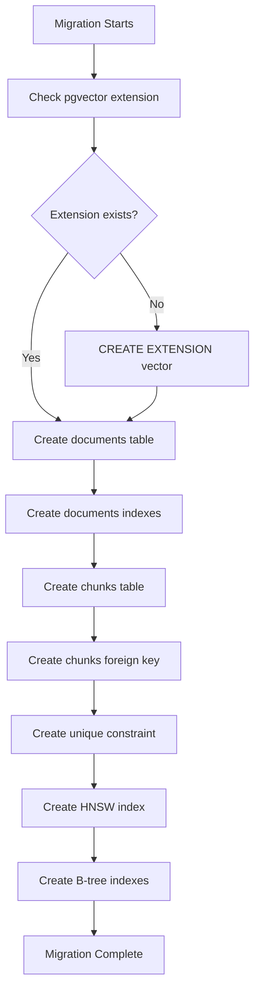

# LCS-DES-041b: Design Specification — Schema Migration

## 1. Metadata & Categorization

| Field | Value | Description |
| :--- | :--- | :--- |
| **Feature ID** | `RAG-041b` | Sub-part of RAG-041 |
| **Feature Name** | `Vector Schema Migration` | Database tables for RAG |
| **Target Version** | `v0.4.1b` | Second sub-part of v0.4.1 |
| **Module Scope** | `Lexichord.Modules.RAG` | RAG module |
| **Swimlane** | `Memory` | Part of RAG vertical |
| **License Tier** | `Core` | Infrastructure for all tiers |
| **Feature Gate Key** | `FeatureFlags.RAG.VectorStorage` | Shared with parent feature |
| **Author** | Lead Architect | |
| **Status** | `Draft` | |
| **Last Updated** | `2026-01-27` | |
| **Parent Document** | [LCS-DES-041-INDEX](./LCS-DES-041-INDEX.md) | |
| **Scope Breakdown** | [LCS-SBD-041 §3.2](./LCS-SBD-041.md#32-v041b-schema-migration) | |

---

## 2. Executive Summary

### 2.1 The Requirement

The RAG system needs database tables to store:
- **Documents**: Metadata about indexed files (path, hash, status)
- **Chunks**: Text segments with vector embeddings for similarity search

Additionally, an HNSW (Hierarchical Navigable Small World) index is required for efficient approximate nearest neighbor queries.

### 2.2 The Proposed Solution

Create a FluentMigrator migration (`Migration_003_VectorSchema`) that:

1. Ensures pgvector extension is enabled
2. Creates `documents` table with file metadata columns
3. Creates `chunks` table with `VECTOR(1536)` embedding column
4. Creates HNSW index for cosine similarity search
5. Supports clean rollback for development iterations

---

## 3. Architecture & Modular Strategy

### 3.1 Dependencies

#### 3.1.1 Upstream Dependencies

| Interface | Source Version | Purpose |
| :--- | :--- | :--- |
| `FluentMigrator` | v0.0.5c | Migration framework |
| pgvector extension | v0.4.1a | Vector type support |

#### 3.1.2 NuGet Packages

| Package | Version | Purpose |
| :--- | :--- | :--- |
| `FluentMigrator` | 6.2.x | Migration DSL |
| `FluentMigrator.Runner` | 6.2.x | Migration execution |
| `FluentMigrator.Runner.Postgres` | 6.2.x | PostgreSQL support |

### 3.2 Licensing Behavior

**No license gating.** Schema is core infrastructure. Feature gating occurs at service layer.

---

## 4. Data Contract (The API)

### 4.1 Migration Class

```csharp
using FluentMigrator;

namespace Lexichord.Modules.RAG.Migrations;

/// <summary>
/// Creates the vector storage schema for RAG functionality.
/// </summary>
/// <remarks>
/// <para>This migration creates two tables:</para>
/// <list type="bullet">
///   <item><c>documents</c> - Stores metadata about indexed files</item>
///   <item><c>chunks</c> - Stores text segments with vector embeddings</item>
/// </list>
/// <para>Requires pgvector extension to be enabled (v0.4.1a).</para>
/// </remarks>
[Migration(202601270001)]
[Tags("RAG", "Vector")]
public class Migration_003_VectorSchema : Migration
{
    /// <summary>
    /// Creates the vector storage tables and indexes.
    /// </summary>
    public override void Up();

    /// <summary>
    /// Removes the vector storage tables.
    /// </summary>
    public override void Down();
}
```

### 4.2 Documents Table Schema

| Column | Type | Constraints | Description |
| :--- | :--- | :--- | :--- |
| `id` | UUID | PK, DEFAULT gen_random_uuid() | Unique identifier |
| `file_path` | TEXT | NOT NULL, UNIQUE | Absolute file path |
| `file_hash` | TEXT | NOT NULL | SHA-256 content hash |
| `title` | TEXT | NULLABLE | Document title |
| `file_size` | BIGINT | NOT NULL, DEFAULT 0 | Size in bytes |
| `last_modified` | TIMESTAMPTZ | NULLABLE | File modification time |
| `indexed_at` | TIMESTAMPTZ | NOT NULL, DEFAULT NOW() | When indexed |
| `chunk_count` | INTEGER | NOT NULL, DEFAULT 0 | Number of chunks |
| `status` | TEXT | NOT NULL, DEFAULT 'pending' | Indexing status |
| `error_message` | TEXT | NULLABLE | Error if failed |
| `metadata` | JSONB | NULLABLE | Additional metadata |

### 4.3 Chunks Table Schema

| Column | Type | Constraints | Description |
| :--- | :--- | :--- | :--- |
| `id` | UUID | PK, DEFAULT gen_random_uuid() | Unique identifier |
| `document_id` | UUID | FK → documents(id) ON DELETE CASCADE | Parent document |
| `content` | TEXT | NOT NULL | Chunk text |
| `chunk_index` | INTEGER | NOT NULL | Position in document |
| `start_offset` | INTEGER | NOT NULL | Start char offset |
| `end_offset` | INTEGER | NOT NULL | End char offset |
| `embedding` | VECTOR(1536) | NULLABLE | OpenAI embedding |
| `heading` | TEXT | NULLABLE | Section heading |
| `heading_level` | INTEGER | NULLABLE | H1=1, H2=2, etc. |
| `metadata` | JSONB | NULLABLE | Additional metadata |
| `created_at` | TIMESTAMPTZ | NOT NULL, DEFAULT NOW() | Creation time |

**Constraints:**
- `UNIQUE(document_id, chunk_index)` - One chunk per index per document

### 4.4 Indexes

| Index Name | Table | Columns | Type | Purpose |
| :--- | :--- | :--- | :--- | :--- |
| `idx_chunks_embedding_hnsw` | chunks | embedding | HNSW | Vector similarity |
| `idx_documents_file_path` | documents | file_path | B-tree | Path lookup |
| `idx_documents_status` | documents | status | B-tree | Status filtering |
| `idx_chunks_document_id` | chunks | document_id | B-tree | Chunk lookup |

---

## 5. Implementation Logic

### 5.1 Migration Flow



### 5.2 HNSW Index Parameters

```text
CREATE INDEX idx_chunks_embedding_hnsw ON chunks
USING hnsw (embedding vector_cosine_ops)
WITH (m = 16, ef_construction = 64);

Parameters explained:
┌─────────────────────┬───────┬─────────────────────────────────────────┐
│ Parameter           │ Value │ Description                             │
├─────────────────────┼───────┼─────────────────────────────────────────┤
│ m                   │ 16    │ Max connections per node per layer      │
│                     │       │ Higher = more accurate, more memory     │
├─────────────────────┼───────┼─────────────────────────────────────────┤
│ ef_construction     │ 64    │ Candidate list size during build        │
│                     │       │ Higher = better quality, slower build   │
├─────────────────────┼───────┼─────────────────────────────────────────┤
│ vector_cosine_ops   │ -     │ Distance operator class                 │
│                     │       │ Enables <=> cosine distance operator    │
└─────────────────────┴───────┴─────────────────────────────────────────┘
```

---

## 6. Data Persistence

### 6.1 Data Lifecycle

```text
Document Lifecycle:
┌─────────┐    ┌──────────┐    ┌─────────┐    ┌────────┐
│ Pending │ -> │ Indexing │ -> │ Indexed │ or │ Failed │
└─────────┘    └──────────┘    └─────────┘    └────────┘
     │                              │
     │         ┌───────┐            │
     └─────────│ Stale │ <──────────┘
               └───────┘
               (file changed)

Chunk Lifecycle:
- Created during document indexing
- Updated when embedding is generated
- Deleted when parent document is deleted (CASCADE)
```

### 6.2 Cascade Behavior

| Parent Action | Child Action | Rationale |
| :--- | :--- | :--- |
| DELETE document | DELETE all chunks | Orphan chunks are useless |
| UPDATE document | No cascade | Chunks are regenerated explicitly |

---

## 7. UI/UX Specifications

**None.** This is a database schema migration with no direct UI.

---

## 8. Observability & Logging

| Level | Source | Message |
| :--- | :--- | :--- |
| Info | FluentMigrator | `Applying migration 202601270001` |
| Info | FluentMigrator | `Creating table: documents` |
| Info | FluentMigrator | `Creating table: chunks` |
| Info | FluentMigrator | `Creating index: idx_chunks_embedding_hnsw` |
| Info | FluentMigrator | `Migration 202601270001 completed` |

---

## 9. Security & Safety

| Risk | Level | Mitigation |
| :--- | :--- | :--- |
| Data loss on rollback | High | Down() only drops tables, warns in docs |
| Index build blocking | Medium | CONCURRENTLY option for production |
| Large embedding storage | Low | TOAST compression automatic for vectors |

---

## 10. Acceptance Criteria

### 10.1 Functional Criteria

| # | Given | When | Then |
| :--- | :--- | :--- | :--- |
| 1 | Database exists | Migration runs | `documents` table created |
| 2 | Database exists | Migration runs | `chunks` table created |
| 3 | Tables exist | Query indexes | HNSW index exists |
| 4 | Tables exist | Insert document | ID generated automatically |
| 5 | Document exists | Insert chunk with FK | Chunk created |
| 6 | Document exists | Delete document | Chunks deleted (cascade) |
| 7 | Migration applied | Run Down() | Tables dropped |

### 10.2 Performance Criteria

| # | Given | When | Then |
| :--- | :--- | :--- | :--- |
| 8 | Empty database | Run migration | Completes in < 5s |
| 9 | 10K chunks | Build HNSW index | Completes in < 30s |

---

## 11. Test Scenarios

### 11.1 Migration Tests

```csharp
[Trait("Category", "Integration")]
[Trait("Feature", "v0.4.1b")]
public class VectorSchemaMigrationTests : IAsyncLifetime
{
    private NpgsqlConnection _connection = null!;

    public async Task InitializeAsync()
    {
        // Use test database
        var connectionString = "Host=localhost;Database=lexichord_test;...";
        _connection = new NpgsqlConnection(connectionString);
        await _connection.OpenAsync();
    }

    public async Task DisposeAsync()
    {
        await _connection.DisposeAsync();
    }

    [Fact]
    public async Task Up_CreatesDocumentsTable()
    {
        // Act - run migration via FluentMigrator runner

        // Assert
        var exists = await _connection.ExecuteScalarAsync<bool>(
            "SELECT EXISTS (SELECT 1 FROM information_schema.tables WHERE table_name = 'documents')");
        exists.Should().BeTrue();
    }

    [Fact]
    public async Task Up_CreatesChunksTable_WithVectorColumn()
    {
        // Assert
        var columnType = await _connection.ExecuteScalarAsync<string>(
            "SELECT data_type FROM information_schema.columns WHERE table_name = 'chunks' AND column_name = 'embedding'");
        columnType.Should().Be("USER-DEFINED"); // pgvector type
    }

    [Fact]
    public async Task Up_CreatesHnswIndex()
    {
        // Assert
        var indexExists = await _connection.ExecuteScalarAsync<bool>(
            "SELECT EXISTS (SELECT 1 FROM pg_indexes WHERE indexname = 'idx_chunks_embedding_hnsw')");
        indexExists.Should().BeTrue();
    }

    [Fact]
    public async Task Chunks_CascadeDeleteOnDocumentDelete()
    {
        // Arrange
        var docId = await _connection.ExecuteScalarAsync<Guid>(
            "INSERT INTO documents (file_path, file_hash) VALUES ('/test', 'abc') RETURNING id");
        await _connection.ExecuteAsync(
            "INSERT INTO chunks (document_id, content, chunk_index, start_offset, end_offset) VALUES (@Id, 'test', 0, 0, 4)",
            new { Id = docId });

        // Act
        await _connection.ExecuteAsync("DELETE FROM documents WHERE id = @Id", new { Id = docId });

        // Assert
        var chunkCount = await _connection.ExecuteScalarAsync<int>(
            "SELECT COUNT(*) FROM chunks WHERE document_id = @Id", new { Id = docId });
        chunkCount.Should().Be(0);
    }

    [Fact]
    public async Task Down_DropsAllTables()
    {
        // Act - run Down() migration

        // Assert
        var tablesExist = await _connection.ExecuteScalarAsync<bool>(
            "SELECT EXISTS (SELECT 1 FROM information_schema.tables WHERE table_name IN ('documents', 'chunks'))");
        tablesExist.Should().BeFalse();
    }
}
```

---

## 12. Code Example

### 12.1 Complete Migration Implementation

```csharp
using FluentMigrator;
using FluentMigrator.Postgres;

namespace Lexichord.Modules.RAG.Migrations;

/// <summary>
/// Creates the vector storage schema for RAG functionality.
/// Migration ID: 202601270001
/// </summary>
[Migration(202601270001)]
[Tags("RAG", "Vector")]
public class Migration_003_VectorSchema : Migration
{
    public override void Up()
    {
        // Ensure pgvector extension exists (idempotent)
        Execute.Sql("CREATE EXTENSION IF NOT EXISTS vector;");

        // ═══════════════════════════════════════════════════════════════
        // Documents Table
        // ═══════════════════════════════════════════════════════════════
        Create.Table("documents")
            .WithColumn("id").AsGuid()
                .PrimaryKey()
                .WithDefault(SystemMethods.NewGuid)
            .WithColumn("file_path").AsString(1000)
                .NotNullable()
                .Unique()
            .WithColumn("file_hash").AsString(64)
                .NotNullable()
            .WithColumn("title").AsString(500)
                .Nullable()
            .WithColumn("file_size").AsInt64()
                .NotNullable()
                .WithDefaultValue(0)
            .WithColumn("last_modified").AsDateTimeOffset()
                .Nullable()
            .WithColumn("indexed_at").AsDateTimeOffset()
                .NotNullable()
                .WithDefault(SystemMethods.CurrentUTCDateTime)
            .WithColumn("chunk_count").AsInt32()
                .NotNullable()
                .WithDefaultValue(0)
            .WithColumn("status").AsString(20)
                .NotNullable()
                .WithDefaultValue("pending")
            .WithColumn("error_message").AsString(int.MaxValue)
                .Nullable()
            .WithColumn("metadata").AsCustom("jsonb")
                .Nullable();

        // Documents indexes
        Create.Index("idx_documents_file_path")
            .OnTable("documents")
            .OnColumn("file_path");

        Create.Index("idx_documents_status")
            .OnTable("documents")
            .OnColumn("status");

        // ═══════════════════════════════════════════════════════════════
        // Chunks Table
        // ═══════════════════════════════════════════════════════════════
        Create.Table("chunks")
            .WithColumn("id").AsGuid()
                .PrimaryKey()
                .WithDefault(SystemMethods.NewGuid)
            .WithColumn("document_id").AsGuid()
                .NotNullable()
                .ForeignKey("fk_chunks_document", "documents", "id")
                .OnDelete(System.Data.Rule.Cascade)
            .WithColumn("content").AsString(int.MaxValue)
                .NotNullable()
            .WithColumn("chunk_index").AsInt32()
                .NotNullable()
            .WithColumn("start_offset").AsInt32()
                .NotNullable()
            .WithColumn("end_offset").AsInt32()
                .NotNullable()
            .WithColumn("embedding").AsCustom("vector(1536)")
                .Nullable()
            .WithColumn("heading").AsString(500)
                .Nullable()
            .WithColumn("heading_level").AsInt32()
                .Nullable()
            .WithColumn("metadata").AsCustom("jsonb")
                .Nullable()
            .WithColumn("created_at").AsDateTimeOffset()
                .NotNullable()
                .WithDefault(SystemMethods.CurrentUTCDateTime);

        // Unique constraint: one chunk per index per document
        Create.UniqueConstraint("uq_chunks_document_index")
            .OnTable("chunks")
            .Columns("document_id", "chunk_index");

        // Chunks B-tree index
        Create.Index("idx_chunks_document_id")
            .OnTable("chunks")
            .OnColumn("document_id");

        // ═══════════════════════════════════════════════════════════════
        // HNSW Vector Index
        // ═══════════════════════════════════════════════════════════════
        // Using raw SQL because FluentMigrator doesn't support HNSW syntax
        Execute.Sql(@"
            CREATE INDEX idx_chunks_embedding_hnsw ON chunks
            USING hnsw (embedding vector_cosine_ops)
            WITH (m = 16, ef_construction = 64);
        ");
    }

    public override void Down()
    {
        // Drop in reverse order due to foreign keys
        Delete.Table("chunks");
        Delete.Table("documents");

        // Note: We don't drop the pgvector extension as other
        // migrations or manual usage may depend on it
    }
}
```

---

## 13. DI Registration

```csharp
// In RAGModule.cs or Startup
services.AddFluentMigratorCore()
    .ConfigureRunner(rb => rb
        .AddPostgres()
        .WithGlobalConnectionString(connectionString)
        .ScanIn(typeof(Migration_003_VectorSchema).Assembly).For.Migrations())
    .AddLogging(lb => lb.AddSerilog());
```

---

## 14. Deliverable Checklist

| # | Deliverable | Status |
| :--- | :--- | :--- |
| 1 | `Migration_003_VectorSchema.cs` | [ ] |
| 2 | Documents table with all columns | [ ] |
| 3 | Chunks table with VECTOR column | [ ] |
| 4 | Foreign key with CASCADE delete | [ ] |
| 5 | HNSW index on embedding | [ ] |
| 6 | B-tree indexes for lookups | [ ] |
| 7 | Down() migration (rollback) | [ ] |
| 8 | Integration tests | [ ] |

---

## 15. Verification Commands

```bash
# ═══════════════════════════════════════════════════════════════════════════
# v0.4.1b Verification Commands
# ═══════════════════════════════════════════════════════════════════════════

# 1. Run migrations
dotnet run --project src/Lexichord.Host -- migrate

# 2. Verify tables exist
docker exec lexichord-postgres psql -U lexichord -c "
  SELECT table_name FROM information_schema.tables
  WHERE table_schema = 'public' AND table_name IN ('documents', 'chunks');
"

# 3. Verify documents table columns
docker exec lexichord-postgres psql -U lexichord -c "
  SELECT column_name, data_type, is_nullable
  FROM information_schema.columns
  WHERE table_name = 'documents'
  ORDER BY ordinal_position;
"

# 4. Verify chunks table has vector column
docker exec lexichord-postgres psql -U lexichord -c "
  SELECT column_name, udt_name
  FROM information_schema.columns
  WHERE table_name = 'chunks' AND column_name = 'embedding';
"

# 5. Verify HNSW index
docker exec lexichord-postgres psql -U lexichord -c "
  SELECT indexname, indexdef FROM pg_indexes
  WHERE tablename = 'chunks' AND indexname LIKE '%hnsw%';
"

# 6. Test vector insertion
docker exec lexichord-postgres psql -U lexichord -c "
  INSERT INTO documents (file_path, file_hash) VALUES ('/test/file.md', 'abc123');
  INSERT INTO chunks (document_id, content, chunk_index, start_offset, end_offset, embedding)
  SELECT id, 'Test content', 0, 0, 12, '[$(python3 -c \"print(','.join(['0.1']*1536))\")'::vector
  FROM documents WHERE file_path = '/test/file.md';
  SELECT id, LEFT(content, 20), embedding IS NOT NULL AS has_embedding FROM chunks;
"

# 7. Test cascade delete
docker exec lexichord-postgres psql -U lexichord -c "
  DELETE FROM documents WHERE file_path = '/test/file.md';
  SELECT COUNT(*) FROM chunks; -- Should be 0
"
```

---

## 16. Changelog Entry

```markdown
### v0.4.1b - Schema Migration

- FluentMigrator migration `Migration_003_VectorSchema`
- `documents` table for file metadata and indexing status
- `chunks` table with `VECTOR(1536)` embedding column
- HNSW index for approximate nearest neighbor search
- Cascade delete from documents to chunks
```

---

## 17. Deferred Features

| Feature | Deferred To | Reason |
| :--- | :--- | :--- |
| Table partitioning | v0.5.x | Needed for 1M+ chunks |
| Multiple vector dimensions | v0.4.8 | Support other embedding models |
| Full-text search column | v0.5.x | Hybrid search feature |

---

## Document History

| Version | Date | Author | Changes |
| :--- | :--- | :--- | :--- |
| 1.0 | 2026-01-27 | Lead Architect | Initial draft |
