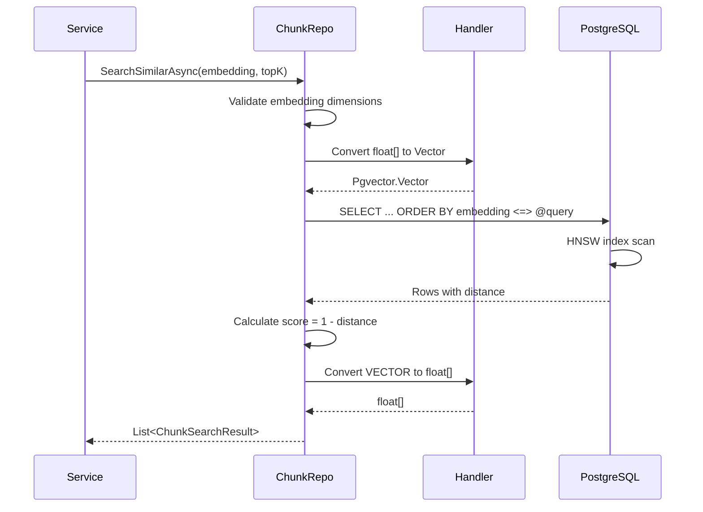

# LCS-DES-041d: Design Specification — Dapper Implementation

## 1. Metadata & Categorization

| Field | Value | Description |
| :--- | :--- | :--- |
| **Feature ID** | `RAG-041d` | Sub-part of RAG-041 |
| **Feature Name** | `Repository Dapper Implementation` | Dapper with pgvector |
| **Target Version** | `v0.4.1d` | Fourth sub-part of v0.4.1 |
| **Module Scope** | `Lexichord.Modules.RAG` | RAG module |
| **Swimlane** | `Memory` | Part of RAG vertical |
| **License Tier** | `Core` | Infrastructure for all tiers |
| **Feature Gate Key** | `FeatureFlags.RAG.VectorStorage` | Shared with parent feature |
| **Author** | Lead Architect | |
| **Status** | `Draft` | |
| **Last Updated** | `2026-01-27` | |
| **Parent Document** | [LCS-DES-041-INDEX](./LCS-DES-041-INDEX.md) | |
| **Scope Breakdown** | [LCS-SBD-041 §3.4](./LCS-SBD-041.md#34-v041d-dapper-implementation) | |

---

## 2. Executive Summary

### 2.1 The Requirement

The repository interfaces defined in v0.4.1c need concrete implementations. These must:
- Execute SQL queries efficiently using Dapper
- Handle pgvector's `VECTOR` type mapping to .NET `float[]`
- Support batch operations for chunk insertion
- Implement vector similarity search with the `<=>` operator

### 2.2 The Proposed Solution

Implement Dapper-based repositories with:

1. `VectorTypeHandler` — Custom Dapper type handler for pgvector
2. `DocumentRepository` — Implements `IDocumentRepository`
3. `ChunkRepository` — Implements `IChunkRepository` with vector search
4. DI registration in `RAGModule`

---

## 3. Architecture & Modular Strategy

### 3.1 Dependencies

#### 3.1.1 Upstream Dependencies

| Interface | Source Version | Purpose |
| :--- | :--- | :--- |
| `IDbConnectionFactory` | v0.0.5b | Connection creation |
| `IDocumentRepository` | v0.4.1c | Interface to implement |
| `IChunkRepository` | v0.4.1c | Interface to implement |
| Schema | v0.4.1b | Tables must exist |

#### 3.1.2 NuGet Packages

| Package | Version | Purpose |
| :--- | :--- | :--- |
| `Dapper` | 2.1.x | Micro-ORM |
| `Npgsql` | 9.0.x | PostgreSQL driver |
| `Npgsql.Pgvector` | 0.2.x | pgvector type support |
| `Polly` | 8.5.x | Retry policies |

### 3.2 Licensing Behavior

**No license gating.** Repositories are infrastructure. Gating at service layer.

---

## 4. Data Contract (The API)

### 4.1 VectorTypeHandler

```csharp
using Dapper;
using Pgvector;
using System.Data;

namespace Lexichord.Modules.RAG.Data;

/// <summary>
/// Dapper type handler for mapping .NET float[] to PostgreSQL VECTOR type.
/// </summary>
/// <remarks>
/// <para>This handler enables Dapper to automatically convert between
/// .NET <c>float[]</c> arrays and pgvector's <c>VECTOR(n)</c> type.</para>
/// <para>Must be registered before any repository operations:</para>
/// <code>SqlMapper.AddTypeHandler(new VectorTypeHandler());</code>
/// </remarks>
public class VectorTypeHandler : SqlMapper.TypeHandler<float[]>
{
    /// <summary>
    /// Sets the parameter value for a float[] to be stored as VECTOR.
    /// </summary>
    /// <param name="parameter">The database parameter.</param>
    /// <param name="value">The float array, or null.</param>
    public override void SetValue(IDbDataParameter parameter, float[]? value)
    {
        parameter.Value = value is null
            ? DBNull.Value
            : new Vector(value);
    }

    /// <summary>
    /// Parses a VECTOR value from the database to float[].
    /// </summary>
    /// <param name="value">The database value.</param>
    /// <returns>A float array, or null if the value is DBNull.</returns>
    /// <exception cref="InvalidCastException">
    /// Thrown if the value is not a Vector or float[].
    /// </exception>
    public override float[]? Parse(object value)
    {
        return value switch
        {
            null or DBNull => null,
            Vector vector => vector.ToArray(),
            float[] array => array,
            _ => throw new InvalidCastException(
                $"Cannot convert {value.GetType().Name} to float[]")
        };
    }
}
```

### 4.2 DocumentRepository

```csharp
namespace Lexichord.Modules.RAG.Data;

/// <summary>
/// Dapper implementation of <see cref="IDocumentRepository"/>.
/// </summary>
public class DocumentRepository : IDocumentRepository
{
    private readonly IDbConnectionFactory _connectionFactory;
    private readonly ILogger<DocumentRepository> _logger;

    public DocumentRepository(
        IDbConnectionFactory connectionFactory,
        ILogger<DocumentRepository> logger)
    {
        _connectionFactory = connectionFactory;
        _logger = logger;
    }

    // Implementation methods...
}
```

### 4.3 ChunkRepository

```csharp
namespace Lexichord.Modules.RAG.Data;

/// <summary>
/// Dapper implementation of <see cref="IChunkRepository"/> with pgvector support.
/// </summary>
public class ChunkRepository : IChunkRepository
{
    private readonly IDbConnectionFactory _connectionFactory;
    private readonly ILogger<ChunkRepository> _logger;

    public ChunkRepository(
        IDbConnectionFactory connectionFactory,
        ILogger<ChunkRepository> logger)
    {
        _connectionFactory = connectionFactory;
        _logger = logger;
    }

    // Implementation methods...
}
```

---

## 5. Implementation Logic

### 5.1 Type Handler Registration Flow

```mermaid
flowchart TD
    A[Application Starts] --> B[RAGModule.RegisterServices]
    B --> C[SqlMapper.AddTypeHandler]
    C --> D[VectorTypeHandler registered]
    D --> E[Repositories resolve from DI]
    E --> F[Repositories execute queries]
    F --> G[Type handler converts float[] ↔ VECTOR]
```

### 5.2 Vector Search Query Flow



### 5.3 SQL Query Patterns

#### 5.3.1 Document Upsert

```sql
INSERT INTO documents (file_path, file_hash, title, file_size, last_modified, status, metadata)
VALUES (@FilePath, @FileHash, @Title, @FileSize, @LastModified, @Status, @Metadata::jsonb)
ON CONFLICT (file_path) DO UPDATE SET
    file_hash = EXCLUDED.file_hash,
    title = EXCLUDED.title,
    file_size = EXCLUDED.file_size,
    last_modified = EXCLUDED.last_modified,
    status = EXCLUDED.status,
    metadata = EXCLUDED.metadata,
    indexed_at = CURRENT_TIMESTAMP
RETURNING *
```

#### 5.3.2 Vector Similarity Search

```sql
SELECT
    c.id, c.document_id, c.content, c.chunk_index,
    c.start_offset, c.end_offset, c.embedding,
    c.heading, c.heading_level, c.metadata, c.created_at,
    1 - (c.embedding <=> @QueryEmbedding::vector) AS score,
    c.embedding <=> @QueryEmbedding::vector AS distance
FROM chunks c
WHERE c.embedding IS NOT NULL
  AND (@DocumentFilter IS NULL OR c.document_id = @DocumentFilter)
  AND 1 - (c.embedding <=> @QueryEmbedding::vector) >= @MinScore
ORDER BY c.embedding <=> @QueryEmbedding::vector
LIMIT @TopK
```

#### 5.3.3 Batch Chunk Insert

```sql
INSERT INTO chunks (document_id, content, chunk_index, start_offset, end_offset, embedding, heading, heading_level, metadata)
VALUES (@DocumentId, @Content, @ChunkIndex, @StartOffset, @EndOffset, @Embedding::vector, @Heading, @HeadingLevel, @Metadata::jsonb)
```

---

## 6. Data Persistence

**Implemented via Dapper.** All data persisted to PostgreSQL using parameterized queries.

### 6.1 Connection Management

```csharp
// Connection created per operation, disposed after use
await using var connection = await _connectionFactory.CreateConnectionAsync(ct);
```

### 6.2 Transaction Handling

```csharp
// For batch operations
await using var connection = await _connectionFactory.CreateConnectionAsync(ct);
await using var transaction = await connection.BeginTransactionAsync(ct);
try
{
    // Execute multiple operations
    await transaction.CommitAsync(ct);
}
catch
{
    await transaction.RollbackAsync(ct);
    throw;
}
```

---

## 7. UI/UX Specifications

**None.** This is a data access implementation with no direct UI.

---

## 8. Observability & Logging

| Level | Source | Message |
| :--- | :--- | :--- |
| Debug | DocumentRepository | `Fetching document by path: {FilePath}` |
| Debug | DocumentRepository | `Upserting document: {FilePath}` |
| Info | DocumentRepository | `Document upserted: {Id} at {FilePath}` |
| Debug | DocumentRepository | `Deleting document: {Id}` |
| Warning | DocumentRepository | `Document not found for deletion: {Id}` |
| Debug | ChunkRepository | `Inserting {Count} chunks for document {DocumentId}` |
| Info | ChunkRepository | `Inserted {Count} chunks for document {DocumentId}` |
| Debug | ChunkRepository | `Searching: TopK={TopK}, MinScore={MinScore}` |
| Info | ChunkRepository | `Search completed: {ResultCount} in {ElapsedMs}ms` |
| Warning | ChunkRepository | `Search slow: {ElapsedMs}ms > 200ms` |
| Error | VectorTypeHandler | `Failed to convert {Type} to float[]` |

---

## 9. Security & Safety

| Risk | Level | Mitigation |
| :--- | :--- | :--- |
| SQL injection | Low | All queries use parameterized inputs |
| Connection leaks | Low | Using `await using` for disposal |
| Embedding dimension mismatch | Medium | Validate before query |

---

## 10. Acceptance Criteria

### 10.1 Functional Criteria

| # | Given | When | Then |
| :--- | :--- | :--- | :--- |
| 1 | Type handler registered | Query with float[] parameter | Converts to VECTOR |
| 2 | Type handler registered | Result has VECTOR column | Converts to float[] |
| 3 | Document repository | `UpsertAsync` new document | Document created with ID |
| 4 | Document repository | `UpsertAsync` existing path | Document updated |
| 5 | Document repository | `GetByPathAsync` exists | Returns document |
| 6 | Document repository | `GetByPathAsync` not exists | Returns null |
| 7 | Chunk repository | `InsertBatchAsync` 100 chunks | All chunks created |
| 8 | Chunk repository | `SearchSimilarAsync` | Returns ranked results |
| 9 | Chunk repository | Search with minScore | Excludes low scores |
| 10 | Chunk repository | Search with documentFilter | Only that document's chunks |

### 10.2 Performance Criteria

| # | Given | When | Then |
| :--- | :--- | :--- | :--- |
| 11 | Empty database | Insert document | < 10ms |
| 12 | 100 chunks | Batch insert | < 500ms |
| 13 | 10K chunks | Vector search | < 200ms |
| 14 | 100K chunks | Vector search | < 500ms |

---

## 11. Test Scenarios

### 11.1 VectorTypeHandler Tests

```csharp
[Trait("Category", "Unit")]
[Trait("Feature", "v0.4.1d")]
public class VectorTypeHandlerTests
{
    private readonly VectorTypeHandler _sut = new();

    [Fact]
    public void SetValue_WithFloatArray_SetsVectorParameter()
    {
        // Arrange
        var parameter = new NpgsqlParameter();
        var embedding = new float[] { 0.1f, 0.2f, 0.3f };

        // Act
        _sut.SetValue(parameter, embedding);

        // Assert
        parameter.Value.Should().BeOfType<Vector>();
        ((Vector)parameter.Value).ToArray().Should().BeEquivalentTo(embedding);
    }

    [Fact]
    public void SetValue_WithNull_SetsDbNull()
    {
        var parameter = new NpgsqlParameter();

        _sut.SetValue(parameter, null);

        parameter.Value.Should().Be(DBNull.Value);
    }

    [Fact]
    public void Parse_WithVector_ReturnsFloatArray()
    {
        var expected = new float[] { 0.1f, 0.2f, 0.3f };
        var vector = new Vector(expected);

        var result = _sut.Parse(vector);

        result.Should().BeEquivalentTo(expected);
    }

    [Fact]
    public void Parse_WithDbNull_ReturnsNull()
    {
        var result = _sut.Parse(DBNull.Value);

        result.Should().BeNull();
    }

    [Fact]
    public void Parse_WithInvalidType_ThrowsInvalidCastException()
    {
        var act = () => _sut.Parse("not a vector");

        act.Should().Throw<InvalidCastException>()
            .WithMessage("*Cannot convert String to float[]*");
    }
}
```

### 11.2 DocumentRepository Integration Tests

```csharp
[Trait("Category", "Integration")]
[Trait("Feature", "v0.4.1d")]
public class DocumentRepositoryTests : IAsyncLifetime
{
    private DocumentRepository _sut = null!;
    private NpgsqlConnection _connection = null!;

    public async Task InitializeAsync()
    {
        // Setup test database connection
        SqlMapper.AddTypeHandler(new VectorTypeHandler());
        // ... connection setup
    }

    [Fact]
    public async Task UpsertAsync_NewDocument_CreatesWithGeneratedId()
    {
        // Arrange
        var document = new Document
        {
            FilePath = $"/test/{Guid.NewGuid()}.md",
            FileHash = "abc123"
        };

        // Act
        var result = await _sut.UpsertAsync(document);

        // Assert
        result.Id.Should().NotBe(Guid.Empty);
        result.FilePath.Should().Be(document.FilePath);
        result.Status.Should().Be(DocumentStatus.Pending);
    }

    [Fact]
    public async Task UpsertAsync_ExistingDocument_Updates()
    {
        // Arrange
        var document = new Document
        {
            FilePath = $"/test/{Guid.NewGuid()}.md",
            FileHash = "original"
        };
        var created = await _sut.UpsertAsync(document);

        // Act
        var updated = await _sut.UpsertAsync(document with { FileHash = "updated" });

        // Assert
        updated.Id.Should().Be(created.Id);
        updated.FileHash.Should().Be("updated");
    }

    [Fact]
    public async Task GetByPathAsync_NotExists_ReturnsNull()
    {
        var result = await _sut.GetByPathAsync("/nonexistent/path.md");

        result.Should().BeNull();
    }

    [Fact]
    public async Task DeleteAsync_ExistingDocument_ReturnsTrue()
    {
        // Arrange
        var document = new Document
        {
            FilePath = $"/test/{Guid.NewGuid()}.md",
            FileHash = "abc123"
        };
        var created = await _sut.UpsertAsync(document);

        // Act
        var result = await _sut.DeleteAsync(created.Id);

        // Assert
        result.Should().BeTrue();
        (await _sut.GetByIdAsync(created.Id)).Should().BeNull();
    }
}
```

### 11.3 ChunkRepository Integration Tests

```csharp
[Trait("Category", "Integration")]
[Trait("Feature", "v0.4.1d")]
public class ChunkRepositoryTests : IAsyncLifetime
{
    private ChunkRepository _sut = null!;
    private Guid _testDocumentId;

    [Fact]
    public async Task InsertBatchAsync_MultipleChunks_InsertsAll()
    {
        // Arrange
        var chunks = Enumerable.Range(0, 10)
            .Select(i => new Chunk
            {
                DocumentId = _testDocumentId,
                Content = $"Chunk content {i}",
                ChunkIndex = i,
                StartOffset = i * 100,
                EndOffset = (i + 1) * 100
            })
            .ToList();

        // Act
        var count = await _sut.InsertBatchAsync(chunks);

        // Assert
        count.Should().Be(10);
        var retrieved = await _sut.GetByDocumentIdAsync(_testDocumentId);
        retrieved.Should().HaveCount(10);
    }

    [Fact]
    public async Task SearchSimilarAsync_WithEmbeddings_ReturnsRankedResults()
    {
        // Arrange
        var embedding1 = CreateNormalizedEmbedding(1.0f, 0.0f); // Similar to query
        var embedding2 = CreateNormalizedEmbedding(0.0f, 1.0f); // Different

        var chunks = new[]
        {
            new Chunk
            {
                DocumentId = _testDocumentId,
                Content = "Similar content",
                ChunkIndex = 0,
                StartOffset = 0,
                EndOffset = 15,
                Embedding = embedding1
            },
            new Chunk
            {
                DocumentId = _testDocumentId,
                Content = "Different content",
                ChunkIndex = 1,
                StartOffset = 15,
                EndOffset = 32,
                Embedding = embedding2
            }
        };
        await _sut.InsertBatchAsync(chunks);

        // Act
        var query = CreateNormalizedEmbedding(1.0f, 0.0f);
        var results = await _sut.SearchSimilarAsync(query, topK: 10, minScore: 0.0f);

        // Assert
        results.Should().HaveCount(2);
        results[0].Chunk.Content.Should().Be("Similar content");
        results[0].Score.Should().BeGreaterThan(results[1].Score);
    }

    [Fact]
    public async Task SearchSimilarAsync_WithMinScore_ExcludesLowScores()
    {
        // Arrange - add chunks with varying similarity
        // ...

        // Act
        var results = await _sut.SearchSimilarAsync(query, topK: 10, minScore: 0.8f);

        // Assert
        results.All(r => r.Score >= 0.8f).Should().BeTrue();
    }

    [Fact]
    public async Task SearchSimilarAsync_InvalidDimensions_ThrowsArgumentException()
    {
        // Arrange
        var invalidEmbedding = new float[100]; // Not 1536

        // Act
        var act = () => _sut.SearchSimilarAsync(invalidEmbedding);

        // Assert
        await act.Should().ThrowAsync<ArgumentException>()
            .WithMessage("*1536 dimensions*");
    }

    private static float[] CreateNormalizedEmbedding(float x, float y)
    {
        var embedding = new float[1536];
        embedding[0] = x;
        embedding[1] = y;
        // Normalize to unit vector
        var magnitude = MathF.Sqrt(x * x + y * y);
        if (magnitude > 0)
        {
            embedding[0] /= magnitude;
            embedding[1] /= magnitude;
        }
        return embedding;
    }
}
```

---

## 12. Code Example

### 12.1 Complete DocumentRepository Implementation

```csharp
using Dapper;
using Microsoft.Extensions.Logging;

namespace Lexichord.Modules.RAG.Data;

/// <summary>
/// Dapper implementation of IDocumentRepository.
/// </summary>
public class DocumentRepository : IDocumentRepository
{
    private readonly IDbConnectionFactory _connectionFactory;
    private readonly ILogger<DocumentRepository> _logger;

    public DocumentRepository(
        IDbConnectionFactory connectionFactory,
        ILogger<DocumentRepository> logger)
    {
        _connectionFactory = connectionFactory;
        _logger = logger;
    }

    public async Task<Document?> GetByPathAsync(string filePath, CancellationToken ct = default)
    {
        _logger.LogDebug("Fetching document by path: {FilePath}", filePath);

        await using var connection = await _connectionFactory.CreateConnectionAsync(ct);

        const string sql = """
            SELECT id, file_path AS FilePath, file_hash AS FileHash, title,
                   file_size AS FileSize, last_modified AS LastModified,
                   indexed_at AS IndexedAt, chunk_count AS ChunkCount,
                   status, error_message AS ErrorMessage, metadata
            FROM documents
            WHERE file_path = @FilePath
            """;

        var result = await connection.QuerySingleOrDefaultAsync<DocumentDto>(
            new CommandDefinition(sql, new { FilePath = filePath }, cancellationToken: ct));

        return result?.ToDocument();
    }

    public async Task<Document?> GetByIdAsync(Guid id, CancellationToken ct = default)
    {
        await using var connection = await _connectionFactory.CreateConnectionAsync(ct);

        const string sql = """
            SELECT id, file_path AS FilePath, file_hash AS FileHash, title,
                   file_size AS FileSize, last_modified AS LastModified,
                   indexed_at AS IndexedAt, chunk_count AS ChunkCount,
                   status, error_message AS ErrorMessage, metadata
            FROM documents
            WHERE id = @Id
            """;

        var result = await connection.QuerySingleOrDefaultAsync<DocumentDto>(
            new CommandDefinition(sql, new { Id = id }, cancellationToken: ct));

        return result?.ToDocument();
    }

    public async Task<Document> UpsertAsync(Document document, CancellationToken ct = default)
    {
        _logger.LogDebug("Upserting document: {FilePath}", document.FilePath);

        await using var connection = await _connectionFactory.CreateConnectionAsync(ct);

        const string sql = """
            INSERT INTO documents (file_path, file_hash, title, file_size, last_modified, status, metadata)
            VALUES (@FilePath, @FileHash, @Title, @FileSize, @LastModified, @Status, @Metadata::jsonb)
            ON CONFLICT (file_path) DO UPDATE SET
                file_hash = EXCLUDED.file_hash,
                title = EXCLUDED.title,
                file_size = EXCLUDED.file_size,
                last_modified = EXCLUDED.last_modified,
                status = EXCLUDED.status,
                metadata = EXCLUDED.metadata,
                indexed_at = CURRENT_TIMESTAMP
            RETURNING id, file_path AS FilePath, file_hash AS FileHash, title,
                      file_size AS FileSize, last_modified AS LastModified,
                      indexed_at AS IndexedAt, chunk_count AS ChunkCount,
                      status, error_message AS ErrorMessage, metadata
            """;

        var result = await connection.QuerySingleAsync<DocumentDto>(
            new CommandDefinition(sql, new
            {
                document.FilePath,
                document.FileHash,
                document.Title,
                document.FileSize,
                document.LastModified,
                Status = document.Status.ToString().ToLowerInvariant(),
                document.Metadata
            }, cancellationToken: ct));

        var upserted = result.ToDocument();
        _logger.LogInformation("Document upserted: {Id} at {FilePath}", upserted.Id, upserted.FilePath);

        return upserted;
    }

    public async Task<bool> DeleteAsync(Guid id, CancellationToken ct = default)
    {
        _logger.LogDebug("Deleting document: {Id}", id);

        await using var connection = await _connectionFactory.CreateConnectionAsync(ct);

        const string sql = "DELETE FROM documents WHERE id = @Id";

        var affected = await connection.ExecuteAsync(
            new CommandDefinition(sql, new { Id = id }, cancellationToken: ct));

        if (affected == 0)
        {
            _logger.LogWarning("Document not found for deletion: {Id}", id);
        }

        return affected > 0;
    }

    public async Task<IReadOnlyList<Document>> GetAllAsync(CancellationToken ct = default)
    {
        await using var connection = await _connectionFactory.CreateConnectionAsync(ct);

        const string sql = """
            SELECT id, file_path AS FilePath, file_hash AS FileHash, title,
                   file_size AS FileSize, last_modified AS LastModified,
                   indexed_at AS IndexedAt, chunk_count AS ChunkCount,
                   status, error_message AS ErrorMessage, metadata
            FROM documents
            ORDER BY indexed_at DESC
            """;

        var results = await connection.QueryAsync<DocumentDto>(
            new CommandDefinition(sql, cancellationToken: ct));

        return results.Select(r => r.ToDocument()).ToList().AsReadOnly();
    }

    public async Task<IReadOnlyList<Document>> GetByStatusAsync(
        DocumentStatus status,
        CancellationToken ct = default)
    {
        await using var connection = await _connectionFactory.CreateConnectionAsync(ct);

        const string sql = """
            SELECT id, file_path AS FilePath, file_hash AS FileHash, title,
                   file_size AS FileSize, last_modified AS LastModified,
                   indexed_at AS IndexedAt, chunk_count AS ChunkCount,
                   status, error_message AS ErrorMessage, metadata
            FROM documents
            WHERE status = @Status
            ORDER BY indexed_at DESC
            """;

        var results = await connection.QueryAsync<DocumentDto>(
            new CommandDefinition(sql, new { Status = status.ToString().ToLowerInvariant() }, cancellationToken: ct));

        return results.Select(r => r.ToDocument()).ToList().AsReadOnly();
    }

    public async Task UpdateChunkCountAsync(Guid documentId, int chunkCount, CancellationToken ct = default)
    {
        await using var connection = await _connectionFactory.CreateConnectionAsync(ct);

        const string sql = "UPDATE documents SET chunk_count = @ChunkCount WHERE id = @Id";

        await connection.ExecuteAsync(
            new CommandDefinition(sql, new { Id = documentId, ChunkCount = chunkCount }, cancellationToken: ct));
    }

    public async Task UpdateStatusAsync(
        Guid documentId,
        DocumentStatus status,
        string? errorMessage = null,
        CancellationToken ct = default)
    {
        await using var connection = await _connectionFactory.CreateConnectionAsync(ct);

        const string sql = """
            UPDATE documents
            SET status = @Status, error_message = @ErrorMessage
            WHERE id = @Id
            """;

        await connection.ExecuteAsync(
            new CommandDefinition(sql, new
            {
                Id = documentId,
                Status = status.ToString().ToLowerInvariant(),
                ErrorMessage = errorMessage
            }, cancellationToken: ct));
    }

    // Internal DTO for Dapper mapping
    private record DocumentDto
    {
        public Guid Id { get; init; }
        public required string FilePath { get; init; }
        public required string FileHash { get; init; }
        public string? Title { get; init; }
        public long FileSize { get; init; }
        public DateTimeOffset? LastModified { get; init; }
        public DateTimeOffset IndexedAt { get; init; }
        public int ChunkCount { get; init; }
        public required string Status { get; init; }
        public string? ErrorMessage { get; init; }
        public string? Metadata { get; init; }

        public Document ToDocument() => new()
        {
            Id = Id,
            FilePath = FilePath,
            FileHash = FileHash,
            Title = Title,
            FileSize = FileSize,
            LastModified = LastModified,
            IndexedAt = IndexedAt,
            ChunkCount = ChunkCount,
            Status = Enum.Parse<DocumentStatus>(Status, ignoreCase: true),
            ErrorMessage = ErrorMessage,
            Metadata = Metadata
        };
    }
}
```

### 12.2 ChunkRepository Vector Search

```csharp
public async Task<IReadOnlyList<ChunkSearchResult>> SearchSimilarAsync(
    float[] queryEmbedding,
    int topK = 10,
    float minScore = 0.7f,
    Guid? documentFilter = null,
    CancellationToken ct = default)
{
    if (queryEmbedding.Length != 1536)
    {
        throw new ArgumentException(
            $"Embedding must have 1536 dimensions, got {queryEmbedding.Length}",
            nameof(queryEmbedding));
    }

    var stopwatch = Stopwatch.StartNew();

    _logger.LogDebug(
        "Searching similar chunks: TopK={TopK}, MinScore={MinScore}, DocFilter={DocFilter}",
        topK, minScore, documentFilter);

    await using var connection = await _connectionFactory.CreateConnectionAsync(ct);

    const string sql = """
        SELECT
            c.id, c.document_id AS DocumentId, c.content, c.chunk_index AS ChunkIndex,
            c.start_offset AS StartOffset, c.end_offset AS EndOffset, c.embedding,
            c.heading, c.heading_level AS HeadingLevel, c.metadata,
            c.created_at AS CreatedAt,
            1 - (c.embedding <=> @QueryEmbedding::vector) AS Score,
            c.embedding <=> @QueryEmbedding::vector AS Distance
        FROM chunks c
        WHERE c.embedding IS NOT NULL
          AND (@DocumentFilter IS NULL OR c.document_id = @DocumentFilter)
          AND 1 - (c.embedding <=> @QueryEmbedding::vector) >= @MinScore
        ORDER BY c.embedding <=> @QueryEmbedding::vector
        LIMIT @TopK
        """;

    var results = await connection.QueryAsync<ChunkWithScore>(
        new CommandDefinition(sql, new
        {
            QueryEmbedding = queryEmbedding,
            TopK = topK,
            MinScore = minScore,
            DocumentFilter = documentFilter
        }, cancellationToken: ct));

    var resultList = results
        .Select(r => new ChunkSearchResult
        {
            Chunk = new Chunk
            {
                Id = r.Id,
                DocumentId = r.DocumentId,
                Content = r.Content,
                ChunkIndex = r.ChunkIndex,
                StartOffset = r.StartOffset,
                EndOffset = r.EndOffset,
                Embedding = r.Embedding,
                Heading = r.Heading,
                HeadingLevel = r.HeadingLevel,
                Metadata = r.Metadata,
                CreatedAt = r.CreatedAt
            },
            Score = r.Score,
            Distance = r.Distance
        })
        .ToList()
        .AsReadOnly();

    stopwatch.Stop();

    _logger.LogInformation(
        "Vector search completed: {ResultCount} results in {ElapsedMs}ms",
        resultList.Count, stopwatch.ElapsedMilliseconds);

    if (stopwatch.ElapsedMilliseconds > 200)
    {
        _logger.LogWarning(
            "Vector search slow: {ElapsedMs}ms > 200ms",
            stopwatch.ElapsedMilliseconds);
    }

    return resultList;
}

private record ChunkWithScore
{
    public Guid Id { get; init; }
    public Guid DocumentId { get; init; }
    public required string Content { get; init; }
    public int ChunkIndex { get; init; }
    public int StartOffset { get; init; }
    public int EndOffset { get; init; }
    public float[]? Embedding { get; init; }
    public string? Heading { get; init; }
    public int? HeadingLevel { get; init; }
    public string? Metadata { get; init; }
    public DateTimeOffset CreatedAt { get; init; }
    public float Score { get; init; }
    public float Distance { get; init; }
}
```

---

## 13. DI Registration

```csharp
// File: src/Lexichord.Modules.RAG/RAGModule.cs

using Dapper;
using Microsoft.Extensions.DependencyInjection;

namespace Lexichord.Modules.RAG;

/// <summary>
/// RAG module registration.
/// </summary>
public static class RAGModule
{
    /// <summary>
    /// Registers RAG services with the DI container.
    /// </summary>
    public static IServiceCollection AddRAGModule(this IServiceCollection services)
    {
        // Register Dapper type handler for pgvector
        // Must be called before any repository operations
        SqlMapper.AddTypeHandler(new VectorTypeHandler());

        // Register repositories
        services.AddScoped<IDocumentRepository, DocumentRepository>();
        services.AddScoped<IChunkRepository, ChunkRepository>();

        return services;
    }
}
```

---

## 14. Deliverable Checklist

| # | Deliverable | Status |
| :--- | :--- | :--- |
| 1 | `VectorTypeHandler.cs` | [ ] |
| 2 | `DocumentRepository.cs` | [ ] |
| 3 | `ChunkRepository.cs` | [ ] |
| 4 | `RAGModule.cs` with DI registration | [ ] |
| 5 | Unit tests for VectorTypeHandler | [ ] |
| 6 | Integration tests for DocumentRepository | [ ] |
| 7 | Integration tests for ChunkRepository | [ ] |
| 8 | Performance tests for vector search | [ ] |

---

## 15. Verification Commands

```bash
# ═══════════════════════════════════════════════════════════════════════════
# v0.4.1d Verification Commands
# ═══════════════════════════════════════════════════════════════════════════

# 1. Verify NuGet packages
dotnet list src/Lexichord.Modules.RAG package | grep -E "Dapper|Npgsql|Pgvector"

# 2. Build project
dotnet build src/Lexichord.Modules.RAG

# 3. Run unit tests
dotnet test --filter "Feature=v0.4.1d&Category=Unit"

# 4. Run integration tests (requires PostgreSQL)
dotnet test --filter "Feature=v0.4.1d&Category=Integration"

# 5. Manual verification - Insert and search
dotnet run --project src/Lexichord.Host -- \
  --command "test-vector-search"
```

---

## 16. Changelog Entry

```markdown
### v0.4.1d - Dapper Implementation

- `VectorTypeHandler` for float[] ↔ pgvector VECTOR mapping
- `DocumentRepository` Dapper implementation
- `ChunkRepository` with vector similarity search
- Batch chunk insertion support
- DI registration in RAGModule
```

---

## 17. Deferred Features

| Feature | Deferred To | Reason |
| :--- | :--- | :--- |
| Connection pooling tuning | v0.4.8 | Performance optimization phase |
| Caching layer | v0.4.8 | Performance optimization phase |
| Read replicas | v0.9.x | Enterprise scaling |

---

## Document History

| Version | Date | Author | Changes |
| :--- | :--- | :--- | :--- |
| 1.0 | 2026-01-27 | Lead Architect | Initial draft |
