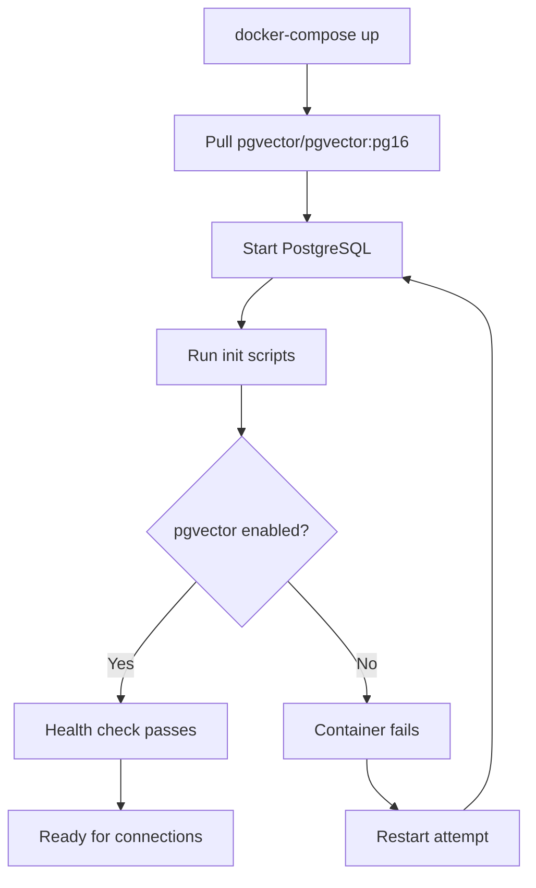

# LCS-DES-041a: Design Specification — pgvector Extension

## 1. Metadata & Categorization

| Field | Value | Description |
| :--- | :--- | :--- |
| **Feature ID** | `RAG-041a` | Sub-part of RAG-041 |
| **Feature Name** | `pgvector Docker Configuration` | PostgreSQL vector extension setup |
| **Target Version** | `v0.4.1a` | First sub-part of v0.4.1 |
| **Module Scope** | `Lexichord.Host` | Infrastructure configuration |
| **Swimlane** | `Memory` | Part of RAG vertical |
| **License Tier** | `Core` | Infrastructure for all tiers |
| **Feature Gate Key** | `FeatureFlags.RAG.VectorStorage` | Shared with parent feature |
| **Author** | Lead Architect | |
| **Status** | `Draft` | |
| **Last Updated** | `2026-01-27` | |
| **Parent Document** | [LCS-DES-041-INDEX](./LCS-DES-041-INDEX.md) | |
| **Scope Breakdown** | [LCS-SBD-041 §3.1](./LCS-SBD-041.md#31-v041a-pgvector-extension) | |

---

## 2. Executive Summary

### 2.1 The Requirement

Lexichord's RAG system requires PostgreSQL with pgvector extension for storing and querying high-dimensional vectors. The development environment must automatically provision a properly configured PostgreSQL instance with pgvector enabled.

> **Problem:** Standard PostgreSQL images do not include pgvector. Manual extension installation is error-prone and not reproducible.

### 2.2 The Proposed Solution

Configure Docker Compose to:

1. Use the official `pgvector/pgvector:pg16` Docker image
2. Run initialization scripts to verify extension availability
3. Implement health checks that confirm pgvector is operational
4. Document local development setup for contributors

---

## 3. Architecture & Modular Strategy

### 3.1 Dependencies

#### 3.1.1 Upstream Dependencies

| Component | Source | Purpose |
| :--- | :--- | :--- |
| Docker | Local environment | Container runtime |
| Docker Compose | Local environment | Multi-container orchestration |

#### 3.1.2 External Resources

| Resource | Version | Purpose |
| :--- | :--- | :--- |
| `pgvector/pgvector` | pg16 | PostgreSQL 16 with pgvector |

### 3.2 Licensing Behavior

**No license gating.** This is core infrastructure available to all users regardless of license tier.

---

## 4. Data Contract (The API)

### 4.1 Docker Compose Service Definition

```yaml
# docker-compose.yml
version: '3.8'

services:
  postgres:
    image: pgvector/pgvector:pg16
    container_name: lexichord-postgres
    environment:
      POSTGRES_USER: lexichord
      POSTGRES_PASSWORD: ${POSTGRES_PASSWORD:-lexichord_dev}
      POSTGRES_DB: lexichord
    volumes:
      - postgres_data:/var/lib/postgresql/data
      - ./docker/init-scripts:/docker-entrypoint-initdb.d:ro
    ports:
      - "${POSTGRES_PORT:-5432}:5432"
    healthcheck:
      test: >
        pg_isready -U lexichord -d lexichord &&
        psql -U lexichord -d lexichord -c "SELECT 1 FROM pg_extension WHERE extname = 'vector'" | grep -q 1
      interval: 10s
      timeout: 5s
      retries: 5
      start_period: 30s
    restart: unless-stopped

volumes:
  postgres_data:
    driver: local
```

### 4.2 Initialization Script

```sql
-- docker/init-scripts/01-init-pgvector.sql

-- Enable pgvector extension
CREATE EXTENSION IF NOT EXISTS vector;

-- Verify installation
DO $$
BEGIN
    IF NOT EXISTS (
        SELECT 1 FROM pg_extension WHERE extname = 'vector'
    ) THEN
        RAISE EXCEPTION 'pgvector extension failed to install';
    END IF;

    RAISE NOTICE 'pgvector extension successfully enabled';
END $$;

-- Log version information
DO $$
DECLARE
    v_version TEXT;
BEGIN
    SELECT extversion INTO v_version
    FROM pg_extension
    WHERE extname = 'vector';

    RAISE NOTICE 'pgvector version: %', v_version;
END $$;
```

### 4.3 Environment Variables

| Variable | Default | Description |
| :--- | :--- | :--- |
| `POSTGRES_PASSWORD` | `lexichord_dev` | Database password |
| `POSTGRES_PORT` | `5432` | Host port mapping |
| `POSTGRES_USER` | `lexichord` | Database user |
| `POSTGRES_DB` | `lexichord` | Database name |

---

## 5. Implementation Logic

### 5.1 Container Startup Flow



### 5.2 Health Check Decision Tree

```text
START: "Is PostgreSQL ready?"
│
├── Run pg_isready
│   ├── FAIL → Container unhealthy, retry
│   └── PASS → Continue
│
├── Query pg_extension for 'vector'
│   ├── NOT FOUND → Container unhealthy, retry
│   └── FOUND → Continue
│
└── Container healthy, accept connections
```

---

## 6. Data Persistence

**Volume Mount:** PostgreSQL data is persisted in a named Docker volume `postgres_data`. This ensures:

- Data survives container restarts
- Data persists across `docker-compose down` (unless `-v` flag used)
- Consistent performance vs bind mounts

**Initialization Scripts:** Mounted read-only from `./docker/init-scripts`. Scripts run once on first container start (when data volume is empty).

---

## 7. UI/UX Specifications

**None.** This is infrastructure configuration with no direct UI.

---

## 8. Observability & Logging

| Level | Source | Message |
| :--- | :--- | :--- |
| NOTICE | init-pgvector.sql | `pgvector extension successfully enabled` |
| NOTICE | init-pgvector.sql | `pgvector version: {version}` |
| ERROR | init-pgvector.sql | `pgvector extension failed to install` |

### 8.1 Docker Logs

```bash
# View PostgreSQL logs
docker logs lexichord-postgres

# Follow logs in real-time
docker logs -f lexichord-postgres

# View initialization output
docker logs lexichord-postgres 2>&1 | grep -i vector
```

---

## 9. Security & Safety

| Risk | Level | Mitigation |
| :--- | :--- | :--- |
| Default password in dev | Low | Use environment variable in production |
| Port exposure | Medium | Bind to localhost only in production |
| Data volume permissions | Low | Docker manages volume permissions |

### 9.1 Production Recommendations

```yaml
# Production overrides (docker-compose.prod.yml)
services:
  postgres:
    ports:
      - "127.0.0.1:5432:5432"  # Localhost only
    environment:
      POSTGRES_PASSWORD: ${POSTGRES_PASSWORD}  # Required, no default
```

---

## 10. Acceptance Criteria

### 10.1 Functional Criteria

| # | Given | When | Then |
| :--- | :--- | :--- | :--- |
| 1 | Docker Compose file exists | `docker-compose up -d` | PostgreSQL container starts |
| 2 | Container is running | Health check executes | Status is "healthy" |
| 3 | Container is healthy | Query `pg_extension` | Row with `extname='vector'` exists |
| 4 | Init script runs | Check logs | "pgvector extension successfully enabled" appears |
| 5 | Data volume exists | Restart container | Data persists |

### 10.2 Performance Criteria

| # | Given | When | Then |
| :--- | :--- | :--- | :--- |
| 6 | Fresh environment | Container starts | Healthy in < 60s |
| 7 | Existing volume | Container restarts | Healthy in < 30s |

---

## 11. Test Scenarios

### 11.1 Shell Verification Tests

```bash
#!/bin/bash
# tests/infrastructure/test-pgvector.sh

set -e

echo "=== pgvector Infrastructure Tests ==="

# Test 1: Container starts
echo "Test 1: Starting PostgreSQL container..."
docker-compose up -d postgres
sleep 5

# Test 2: Health check passes
echo "Test 2: Checking container health..."
HEALTH=$(docker inspect --format='{{.State.Health.Status}}' lexichord-postgres)
if [ "$HEALTH" != "healthy" ]; then
    echo "Waiting for healthy status..."
    for i in {1..12}; do
        sleep 5
        HEALTH=$(docker inspect --format='{{.State.Health.Status}}' lexichord-postgres)
        if [ "$HEALTH" == "healthy" ]; then
            break
        fi
    done
fi

if [ "$HEALTH" != "healthy" ]; then
    echo "FAIL: Container not healthy after 60s"
    docker logs lexichord-postgres
    exit 1
fi
echo "PASS: Container is healthy"

# Test 3: pgvector extension exists
echo "Test 3: Verifying pgvector extension..."
RESULT=$(docker exec lexichord-postgres psql -U lexichord -tAc \
    "SELECT COUNT(*) FROM pg_extension WHERE extname = 'vector'")
if [ "$RESULT" != "1" ]; then
    echo "FAIL: pgvector extension not found"
    exit 1
fi
echo "PASS: pgvector extension enabled"

# Test 4: Vector operations work
echo "Test 4: Testing vector operations..."
docker exec lexichord-postgres psql -U lexichord -c "
    CREATE TEMP TABLE test_vectors (id INT, embedding VECTOR(3));
    INSERT INTO test_vectors VALUES (1, '[1,2,3]'), (2, '[4,5,6]');
    SELECT id, embedding <-> '[1,2,3]' AS distance FROM test_vectors ORDER BY distance;
    DROP TABLE test_vectors;
"
echo "PASS: Vector operations functional"

echo "=== All tests passed ==="
```

### 11.2 Integration Test (C#)

```csharp
[Trait("Category", "Integration")]
[Trait("Feature", "v0.4.1a")]
public class PgvectorInfrastructureTests : IAsyncLifetime
{
    private NpgsqlConnection _connection = null!;

    public async Task InitializeAsync()
    {
        var connectionString = "Host=localhost;Database=lexichord;Username=lexichord;Password=lexichord_dev";
        _connection = new NpgsqlConnection(connectionString);
        await _connection.OpenAsync();
    }

    public async Task DisposeAsync()
    {
        await _connection.DisposeAsync();
    }

    [Fact]
    public async Task PgvectorExtension_IsEnabled()
    {
        // Act
        var result = await _connection.ExecuteScalarAsync<int>(
            "SELECT COUNT(*) FROM pg_extension WHERE extname = 'vector'");

        // Assert
        result.Should().Be(1);
    }

    [Fact]
    public async Task VectorColumn_CanBeCreated()
    {
        // Arrange & Act
        await _connection.ExecuteAsync(
            "CREATE TEMP TABLE test_vec (id INT, v VECTOR(1536))");

        // Assert - no exception means success
    }

    [Fact]
    public async Task VectorDistance_CanBeCalculated()
    {
        // Arrange
        await _connection.ExecuteAsync(@"
            CREATE TEMP TABLE test_sim (id INT, v VECTOR(3));
            INSERT INTO test_sim VALUES (1, '[1,0,0]'), (2, '[0,1,0]');
        ");

        // Act
        var distance = await _connection.ExecuteScalarAsync<double>(
            "SELECT v <-> '[1,0,0]' FROM test_sim WHERE id = 2");

        // Assert
        distance.Should().BeApproximately(1.414, 0.001); // sqrt(2)
    }
}
```

---

## 12. Code Example

### 12.1 Complete Docker Compose Setup

```yaml
# docker-compose.yml
version: '3.8'

services:
  postgres:
    image: pgvector/pgvector:pg16
    container_name: lexichord-postgres
    environment:
      POSTGRES_USER: lexichord
      POSTGRES_PASSWORD: ${POSTGRES_PASSWORD:-lexichord_dev}
      POSTGRES_DB: lexichord
      # Performance tuning for vector operations
      POSTGRES_INITDB_ARGS: "--data-checksums"
    volumes:
      - postgres_data:/var/lib/postgresql/data
      - ./docker/init-scripts:/docker-entrypoint-initdb.d:ro
    ports:
      - "${POSTGRES_PORT:-5432}:5432"
    healthcheck:
      test: >
        pg_isready -U lexichord -d lexichord &&
        psql -U lexichord -d lexichord -c "SELECT 1 FROM pg_extension WHERE extname = 'vector'" | grep -q 1
      interval: 10s
      timeout: 5s
      retries: 5
      start_period: 30s
    restart: unless-stopped
    # Resource limits for development
    deploy:
      resources:
        limits:
          memory: 1G

volumes:
  postgres_data:
    driver: local

networks:
  default:
    name: lexichord-network
```

### 12.2 PostgreSQL Configuration for Vectors

```sql
-- docker/init-scripts/02-configure-postgres.sql

-- Optimize for vector workloads
ALTER SYSTEM SET shared_buffers = '256MB';
ALTER SYSTEM SET effective_cache_size = '512MB';
ALTER SYSTEM SET maintenance_work_mem = '128MB';
ALTER SYSTEM SET work_mem = '64MB';

-- Enable parallel query for vector operations
ALTER SYSTEM SET max_parallel_workers_per_gather = 2;
ALTER SYSTEM SET max_parallel_workers = 4;

-- Reload configuration
SELECT pg_reload_conf();
```

---

## 13. DI Registration

**Not applicable.** This sub-part configures Docker infrastructure, not application services.

---

## 14. Deliverable Checklist

| # | Deliverable | Status |
| :--- | :--- | :--- |
| 1 | `docker-compose.yml` with pgvector service | [ ] |
| 2 | `docker/init-scripts/01-init-pgvector.sql` | [ ] |
| 3 | `docker/init-scripts/02-configure-postgres.sql` | [ ] |
| 4 | `.env.example` with environment variables | [ ] |
| 5 | `docs/development-setup.md` updated | [ ] |
| 6 | Shell test script | [ ] |
| 7 | C# integration test | [ ] |

---

## 15. Verification Commands

```bash
# ═══════════════════════════════════════════════════════════════════════════
# v0.4.1a Verification Commands
# ═══════════════════════════════════════════════════════════════════════════

# 1. Start PostgreSQL with pgvector
docker-compose up -d postgres

# 2. Check container status
docker-compose ps

# 3. Wait for healthy status
docker-compose exec postgres pg_isready -U lexichord

# 4. Verify pgvector extension
docker exec lexichord-postgres psql -U lexichord -c \
  "SELECT extname, extversion FROM pg_extension WHERE extname = 'vector';"

# 5. Test vector operations
docker exec lexichord-postgres psql -U lexichord -c "
  SELECT '[1,2,3]'::vector <-> '[4,5,6]'::vector AS distance;
"

# 6. View logs
docker logs lexichord-postgres | grep -i vector

# 7. Run infrastructure tests
./tests/infrastructure/test-pgvector.sh
```

---

## 16. Changelog Entry

```markdown
### v0.4.1a - pgvector Extension

- Docker Compose configuration for pgvector-enabled PostgreSQL
- Initialization scripts for extension verification
- Health checks confirming vector capability
- Development environment documentation
```

---

## 17. Deferred Features

| Feature | Deferred To | Reason |
| :--- | :--- | :--- |
| PostgreSQL replication | v0.9.x | Enterprise scaling requirement |
| Connection pooling (PgBouncer) | v0.5.x | Performance optimization phase |
| Automated backups | v0.5.x | Production readiness phase |

---

## Document History

| Version | Date | Author | Changes |
| :--- | :--- | :--- | :--- |
| 1.0 | 2026-01-27 | Lead Architect | Initial draft |
