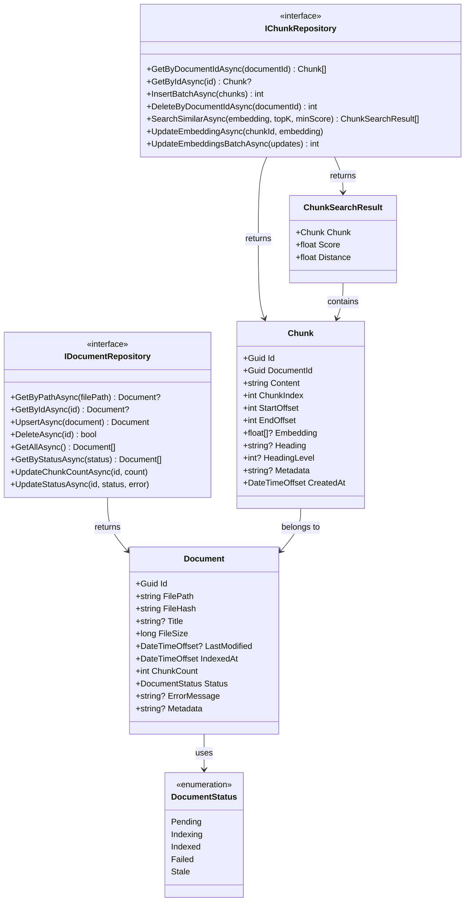

# LCS-DES-041c: Design Specification — Repository Abstractions

## 1. Metadata & Categorization

| Field | Value | Description |
| :--- | :--- | :--- |
| **Feature ID** | `RAG-041c` | Sub-part of RAG-041 |
| **Feature Name** | `Document and Chunk Repository Interfaces` | Repository abstractions |
| **Target Version** | `v0.4.1c` | Third sub-part of v0.4.1 |
| **Module Scope** | `Lexichord.Abstractions` | Shared contracts |
| **Swimlane** | `Memory` | Part of RAG vertical |
| **License Tier** | `Core` | Infrastructure for all tiers |
| **Feature Gate Key** | `FeatureFlags.RAG.VectorStorage` | Shared with parent feature |
| **Author** | Lead Architect | |
| **Status** | `Draft` | |
| **Last Updated** | `2026-01-27` | |
| **Parent Document** | [LCS-DES-041-INDEX](./LCS-DES-041-INDEX.md) | |
| **Scope Breakdown** | [LCS-SBD-041 §3.3](./LCS-SBD-041.md#33-v041c-repository-abstractions) | |

---

## 2. Executive Summary

### 2.1 The Requirement

The RAG system needs a clean abstraction layer between business logic and data access. This enables:
- Unit testing with mock repositories
- Swapping implementations (e.g., in-memory for testing)
- Clear API contracts for document and chunk operations
- Vector search abstraction independent of pgvector specifics

### 2.2 The Proposed Solution

Define interfaces and records in `Lexichord.Abstractions`:

1. `IDocumentRepository` — CRUD operations for indexed documents
2. `IChunkRepository` — Chunk storage and vector similarity search
3. `Document` — Entity record for file metadata
4. `Chunk` — Entity record with embedding support
5. `ChunkSearchResult` — Search result with similarity score
6. `DocumentStatus` — Indexing pipeline status enum

---

## 3. Architecture & Modular Strategy

### 3.1 Dependencies

#### 3.1.1 Upstream Dependencies

None. This sub-part defines abstractions only.

#### 3.1.2 NuGet Packages

None required. Uses only BCL types.

### 3.2 Licensing Behavior

**No license gating.** Abstractions are available to all modules regardless of license tier.

---

## 4. Data Contract (The API)

### 4.1 IDocumentRepository Interface

```csharp
namespace Lexichord.Abstractions.Contracts;

/// <summary>
/// Repository for managing indexed documents in the RAG system.
/// </summary>
/// <remarks>
/// <para>Documents represent files that have been indexed for semantic search.
/// Each document has metadata (path, hash, status) and zero or more chunks.</para>
/// <para>This interface defines the contract for document persistence.
/// Implementations may use Dapper, EF Core, or in-memory storage.</para>
/// </remarks>
public interface IDocumentRepository
{
    /// <summary>
    /// Retrieves a document by its file path.
    /// </summary>
    /// <param name="filePath">The absolute file path.</param>
    /// <param name="ct">Cancellation token.</param>
    /// <returns>The document if found; otherwise, <c>null</c>.</returns>
    /// <example>
    /// <code>
    /// var doc = await repo.GetByPathAsync("/workspace/readme.md");
    /// if (doc is null) { /* not indexed yet */ }
    /// </code>
    /// </example>
    Task<Document?> GetByPathAsync(string filePath, CancellationToken ct = default);

    /// <summary>
    /// Retrieves a document by its unique identifier.
    /// </summary>
    /// <param name="id">The document ID (UUID).</param>
    /// <param name="ct">Cancellation token.</param>
    /// <returns>The document if found; otherwise, <c>null</c>.</returns>
    Task<Document?> GetByIdAsync(Guid id, CancellationToken ct = default);

    /// <summary>
    /// Inserts a new document or updates an existing one based on file path.
    /// </summary>
    /// <param name="document">The document to upsert.</param>
    /// <param name="ct">Cancellation token.</param>
    /// <returns>The upserted document with generated ID (if new).</returns>
    /// <remarks>
    /// If a document with the same <see cref="Document.FilePath"/> exists,
    /// it will be updated. Otherwise, a new document is inserted.
    /// </remarks>
    Task<Document> UpsertAsync(Document document, CancellationToken ct = default);

    /// <summary>
    /// Deletes a document and all its associated chunks.
    /// </summary>
    /// <param name="id">The document ID to delete.</param>
    /// <param name="ct">Cancellation token.</param>
    /// <returns><c>true</c> if deleted; <c>false</c> if not found.</returns>
    /// <remarks>
    /// Chunk deletion is handled by database CASCADE constraint.
    /// </remarks>
    Task<bool> DeleteAsync(Guid id, CancellationToken ct = default);

    /// <summary>
    /// Retrieves all indexed documents.
    /// </summary>
    /// <param name="ct">Cancellation token.</param>
    /// <returns>Immutable list of all documents, ordered by indexed_at descending.</returns>
    Task<IReadOnlyList<Document>> GetAllAsync(CancellationToken ct = default);

    /// <summary>
    /// Retrieves documents filtered by indexing status.
    /// </summary>
    /// <param name="status">The status to filter by.</param>
    /// <param name="ct">Cancellation token.</param>
    /// <returns>Documents with the specified status.</returns>
    /// <example>
    /// <code>
    /// var failed = await repo.GetByStatusAsync(DocumentStatus.Failed);
    /// foreach (var doc in failed) { /* retry or report */ }
    /// </code>
    /// </example>
    Task<IReadOnlyList<Document>> GetByStatusAsync(DocumentStatus status, CancellationToken ct = default);

    /// <summary>
    /// Updates the chunk count for a document after indexing.
    /// </summary>
    /// <param name="documentId">The document ID.</param>
    /// <param name="chunkCount">The new chunk count.</param>
    /// <param name="ct">Cancellation token.</param>
    Task UpdateChunkCountAsync(Guid documentId, int chunkCount, CancellationToken ct = default);

    /// <summary>
    /// Updates the status and optionally error message for a document.
    /// </summary>
    /// <param name="documentId">The document ID.</param>
    /// <param name="status">The new status.</param>
    /// <param name="errorMessage">Optional error message (for Failed status).</param>
    /// <param name="ct">Cancellation token.</param>
    Task UpdateStatusAsync(
        Guid documentId,
        DocumentStatus status,
        string? errorMessage = null,
        CancellationToken ct = default);
}
```

### 4.2 IChunkRepository Interface

```csharp
namespace Lexichord.Abstractions.Contracts;

/// <summary>
/// Repository for managing document chunks with vector embeddings.
/// </summary>
/// <remarks>
/// <para>Chunks are text segments extracted from documents. Each chunk
/// has content, position metadata, and optionally a vector embedding
/// for similarity search.</para>
/// <para>The <see cref="SearchSimilarAsync"/> method performs approximate
/// nearest neighbor search using cosine similarity.</para>
/// </remarks>
public interface IChunkRepository
{
    /// <summary>
    /// Retrieves all chunks for a document, ordered by chunk index.
    /// </summary>
    /// <param name="documentId">The parent document ID.</param>
    /// <param name="ct">Cancellation token.</param>
    /// <returns>Chunks ordered by <see cref="Chunk.ChunkIndex"/> ascending.</returns>
    Task<IReadOnlyList<Chunk>> GetByDocumentIdAsync(Guid documentId, CancellationToken ct = default);

    /// <summary>
    /// Retrieves a single chunk by ID.
    /// </summary>
    /// <param name="id">The chunk ID.</param>
    /// <param name="ct">Cancellation token.</param>
    /// <returns>The chunk if found; otherwise, <c>null</c>.</returns>
    Task<Chunk?> GetByIdAsync(Guid id, CancellationToken ct = default);

    /// <summary>
    /// Inserts multiple chunks in a single batch operation.
    /// </summary>
    /// <param name="chunks">The chunks to insert.</param>
    /// <param name="ct">Cancellation token.</param>
    /// <returns>Number of chunks successfully inserted.</returns>
    /// <remarks>
    /// Batch insertion is more efficient than individual inserts.
    /// Chunks should have <see cref="Chunk.DocumentId"/> set.
    /// </remarks>
    Task<int> InsertBatchAsync(IReadOnlyList<Chunk> chunks, CancellationToken ct = default);

    /// <summary>
    /// Deletes all chunks for a document.
    /// </summary>
    /// <param name="documentId">The parent document ID.</param>
    /// <param name="ct">Cancellation token.</param>
    /// <returns>Number of chunks deleted.</returns>
    /// <remarks>
    /// Use this before re-indexing a document to clear old chunks.
    /// </remarks>
    Task<int> DeleteByDocumentIdAsync(Guid documentId, CancellationToken ct = default);

    /// <summary>
    /// Performs vector similarity search using cosine distance.
    /// </summary>
    /// <param name="queryEmbedding">
    /// The query vector. Must have 1536 dimensions for OpenAI embeddings.
    /// </param>
    /// <param name="topK">Maximum number of results (default: 10).</param>
    /// <param name="minScore">
    /// Minimum cosine similarity score (0-1). Results below this are excluded.
    /// Default: 0.7 (70% similar).
    /// </param>
    /// <param name="documentFilter">
    /// Optional document ID to restrict search to a single document.
    /// </param>
    /// <param name="ct">Cancellation token.</param>
    /// <returns>
    /// Chunks ordered by similarity score descending (most similar first).
    /// </returns>
    /// <exception cref="ArgumentException">
    /// Thrown if <paramref name="queryEmbedding"/> does not have 1536 dimensions.
    /// </exception>
    /// <example>
    /// <code>
    /// var queryVector = await embeddingService.EmbedAsync("What is Lexichord?");
    /// var results = await chunkRepo.SearchSimilarAsync(queryVector, topK: 5);
    /// foreach (var result in results)
    /// {
    ///     Console.WriteLine($"{result.Score:P0}: {result.Chunk.Content[..100]}...");
    /// }
    /// </code>
    /// </example>
    Task<IReadOnlyList<ChunkSearchResult>> SearchSimilarAsync(
        float[] queryEmbedding,
        int topK = 10,
        float minScore = 0.7f,
        Guid? documentFilter = null,
        CancellationToken ct = default);

    /// <summary>
    /// Updates the embedding for an existing chunk.
    /// </summary>
    /// <param name="chunkId">The chunk ID.</param>
    /// <param name="embedding">The new embedding vector (1536 dimensions).</param>
    /// <param name="ct">Cancellation token.</param>
    /// <remarks>
    /// Used when embeddings are generated asynchronously after chunk creation.
    /// </remarks>
    Task UpdateEmbeddingAsync(Guid chunkId, float[] embedding, CancellationToken ct = default);

    /// <summary>
    /// Updates embeddings for multiple chunks in a batch.
    /// </summary>
    /// <param name="updates">Dictionary of chunk ID to embedding.</param>
    /// <param name="ct">Cancellation token.</param>
    /// <returns>Number of chunks updated.</returns>
    Task<int> UpdateEmbeddingsBatchAsync(
        IReadOnlyDictionary<Guid, float[]> updates,
        CancellationToken ct = default);

    /// <summary>
    /// Gets the count of chunks without embeddings for a document.
    /// </summary>
    /// <param name="documentId">The document ID.</param>
    /// <param name="ct">Cancellation token.</param>
    /// <returns>Number of chunks with null embedding.</returns>
    Task<int> GetPendingEmbeddingCountAsync(Guid documentId, CancellationToken ct = default);
}
```

### 4.3 Document Entity Record

```csharp
namespace Lexichord.Abstractions.Contracts;

/// <summary>
/// Represents an indexed document in the RAG system.
/// </summary>
/// <remarks>
/// <para>Documents are the parent entities for chunks. Each document
/// corresponds to a file that has been or will be indexed.</para>
/// <para>The <see cref="FileHash"/> is used for change detection.
/// If the hash changes, the document needs re-indexing.</para>
/// </remarks>
public record Document
{
    /// <summary>
    /// Unique identifier generated by the database.
    /// </summary>
    public Guid Id { get; init; }

    /// <summary>
    /// Absolute file path to the source document.
    /// </summary>
    /// <remarks>
    /// This is the unique constraint for upsert operations.
    /// </remarks>
    public required string FilePath { get; init; }

    /// <summary>
    /// SHA-256 hash of the file content.
    /// </summary>
    /// <remarks>
    /// Used for change detection. If this differs from the current
    /// file hash, the document should be re-indexed.
    /// </remarks>
    public required string FileHash { get; init; }

    /// <summary>
    /// Document title extracted from content or filename.
    /// </summary>
    /// <remarks>
    /// For Markdown files, this is typically the first H1 heading.
    /// Falls back to filename without extension.
    /// </remarks>
    public string? Title { get; init; }

    /// <summary>
    /// File size in bytes.
    /// </summary>
    public long FileSize { get; init; }

    /// <summary>
    /// Last modification timestamp of the source file.
    /// </summary>
    /// <remarks>
    /// Used for quick change detection before computing hash.
    /// </remarks>
    public DateTimeOffset? LastModified { get; init; }

    /// <summary>
    /// When the document was last indexed successfully.
    /// </summary>
    public DateTimeOffset IndexedAt { get; init; }

    /// <summary>
    /// Number of chunks created from this document.
    /// </summary>
    public int ChunkCount { get; init; }

    /// <summary>
    /// Current status in the indexing pipeline.
    /// </summary>
    public DocumentStatus Status { get; init; } = DocumentStatus.Pending;

    /// <summary>
    /// Error message if indexing failed.
    /// </summary>
    /// <remarks>
    /// Only populated when <see cref="Status"/> is <see cref="DocumentStatus.Failed"/>.
    /// </remarks>
    public string? ErrorMessage { get; init; }

    /// <summary>
    /// Additional metadata stored as JSON.
    /// </summary>
    /// <remarks>
    /// Can include: author, tags, language, custom fields.
    /// Stored as JSONB in PostgreSQL.
    /// </remarks>
    public string? Metadata { get; init; }
}
```

### 4.4 Chunk Entity Record

```csharp
namespace Lexichord.Abstractions.Contracts;

/// <summary>
/// Represents a text chunk with optional vector embedding.
/// </summary>
/// <remarks>
/// <para>Chunks are segments of a document, typically split by paragraph,
/// heading, or fixed character count. Each chunk can have a vector
/// embedding for similarity search.</para>
/// <para>The <see cref="Embedding"/> property is nullable because
/// embeddings may be generated asynchronously after chunk creation.</para>
/// </remarks>
public record Chunk
{
    /// <summary>
    /// Unique identifier generated by the database.
    /// </summary>
    public Guid Id { get; init; }

    /// <summary>
    /// Parent document ID.
    /// </summary>
    public Guid DocumentId { get; init; }

    /// <summary>
    /// Text content of the chunk.
    /// </summary>
    /// <remarks>
    /// Typically 500-1500 characters. May include markdown formatting.
    /// </remarks>
    public required string Content { get; init; }

    /// <summary>
    /// Zero-based index of this chunk within the document.
    /// </summary>
    /// <remarks>
    /// Used to maintain document order when reconstructing context.
    /// </remarks>
    public int ChunkIndex { get; init; }

    /// <summary>
    /// Character offset where this chunk starts in the source document.
    /// </summary>
    public int StartOffset { get; init; }

    /// <summary>
    /// Character offset where this chunk ends in the source document.
    /// </summary>
    /// <remarks>
    /// Exclusive end index. Length = EndOffset - StartOffset.
    /// </remarks>
    public int EndOffset { get; init; }

    /// <summary>
    /// Vector embedding for similarity search.
    /// </summary>
    /// <remarks>
    /// <para>1536 dimensions for OpenAI text-embedding-3-small model.</para>
    /// <para>Null if embedding has not been generated yet.</para>
    /// </remarks>
    public float[]? Embedding { get; init; }

    /// <summary>
    /// Section heading if the chunk is under a Markdown header.
    /// </summary>
    /// <remarks>
    /// Used for context injection during retrieval.
    /// Example: "## Installation"
    /// </remarks>
    public string? Heading { get; init; }

    /// <summary>
    /// Heading level (1-6 for H1-H6).
    /// </summary>
    public int? HeadingLevel { get; init; }

    /// <summary>
    /// Additional metadata stored as JSON.
    /// </summary>
    public string? Metadata { get; init; }

    /// <summary>
    /// When the chunk was created.
    /// </summary>
    public DateTimeOffset CreatedAt { get; init; }

    /// <summary>
    /// Length of the chunk content in characters.
    /// </summary>
    public int Length => EndOffset - StartOffset;

    /// <summary>
    /// Whether this chunk has a vector embedding.
    /// </summary>
    public bool HasEmbedding => Embedding is not null;
}
```

### 4.5 ChunkSearchResult Record

```csharp
namespace Lexichord.Abstractions.Contracts;

/// <summary>
/// Result from vector similarity search.
/// </summary>
/// <remarks>
/// Contains the matching chunk along with similarity metrics.
/// Results are ordered by <see cref="Score"/> descending.
/// </remarks>
public record ChunkSearchResult
{
    /// <summary>
    /// The matching chunk.
    /// </summary>
    public required Chunk Chunk { get; init; }

    /// <summary>
    /// Cosine similarity score (0-1).
    /// </summary>
    /// <remarks>
    /// <para>1.0 = identical vectors, 0.0 = orthogonal vectors.</para>
    /// <para>Calculated as: 1 - cosine_distance</para>
    /// </remarks>
    public float Score { get; init; }

    /// <summary>
    /// Cosine distance from the query vector.
    /// </summary>
    /// <remarks>
    /// <para>0.0 = identical, 2.0 = opposite.</para>
    /// <para>Distance = 1 - Score</para>
    /// </remarks>
    public float Distance { get; init; }

    /// <summary>
    /// Score as a percentage string (e.g., "87%").
    /// </summary>
    public string ScorePercentage => $"{Score:P0}";
}
```

### 4.6 DocumentStatus Enum

```csharp
namespace Lexichord.Abstractions.Contracts;

/// <summary>
/// Status of a document in the indexing pipeline.
/// </summary>
public enum DocumentStatus
{
    /// <summary>
    /// Document is queued for indexing.
    /// </summary>
    /// <remarks>
    /// Initial state when a file is discovered.
    /// </remarks>
    Pending = 0,

    /// <summary>
    /// Document is currently being indexed.
    /// </summary>
    /// <remarks>
    /// Chunking and/or embedding is in progress.
    /// </remarks>
    Indexing = 1,

    /// <summary>
    /// Document has been successfully indexed.
    /// </summary>
    /// <remarks>
    /// All chunks created and embeddings generated.
    /// </remarks>
    Indexed = 2,

    /// <summary>
    /// Document indexing failed.
    /// </summary>
    /// <remarks>
    /// Check <see cref="Document.ErrorMessage"/> for details.
    /// </remarks>
    Failed = 3,

    /// <summary>
    /// Document content has changed and needs re-indexing.
    /// </summary>
    /// <remarks>
    /// File hash differs from stored hash.
    /// </remarks>
    Stale = 4
}
```

---

## 5. Implementation Logic

### 5.1 Repository Pattern Relationships



---

## 6. Data Persistence

**Not applicable.** This sub-part defines interfaces only. Persistence is implemented in v0.4.1d.

---

## 7. UI/UX Specifications

**None.** These are backend abstractions with no direct UI.

---

## 8. Observability & Logging

**Not applicable.** Interfaces do not implement logging. Implementations (v0.4.1d) will add logging.

---

## 9. Security & Safety

| Consideration | Approach |
| :--- | :--- |
| Embedding dimension validation | `SearchSimilarAsync` throws if not 1536 |
| Null embedding handling | `Embedding` is nullable, search excludes nulls |
| Path traversal | Implementations should validate file paths |

---

## 10. Acceptance Criteria

### 10.1 Interface Design Criteria

| # | Criterion |
| :--- | :--- |
| 1 | `IDocumentRepository` has all CRUD operations |
| 2 | `IChunkRepository` has batch insert method |
| 3 | `IChunkRepository.SearchSimilarAsync` accepts topK and minScore |
| 4 | `Document` record has all required properties |
| 5 | `Chunk` record has Embedding as nullable float[] |
| 6 | `ChunkSearchResult` has Score and Distance |
| 7 | `DocumentStatus` has all lifecycle states |
| 8 | All methods use CancellationToken |
| 9 | All interfaces have XML documentation |
| 10 | All records are immutable (init-only properties) |

---

## 11. Test Scenarios

### 11.1 Interface Contract Tests

```csharp
[Trait("Category", "Unit")]
[Trait("Feature", "v0.4.1c")]
public class RepositoryInterfaceContractTests
{
    [Fact]
    public void IDocumentRepository_HasRequiredMethods()
    {
        var type = typeof(IDocumentRepository);

        type.GetMethod("GetByPathAsync").Should().NotBeNull();
        type.GetMethod("GetByIdAsync").Should().NotBeNull();
        type.GetMethod("UpsertAsync").Should().NotBeNull();
        type.GetMethod("DeleteAsync").Should().NotBeNull();
        type.GetMethod("GetAllAsync").Should().NotBeNull();
        type.GetMethod("GetByStatusAsync").Should().NotBeNull();
        type.GetMethod("UpdateChunkCountAsync").Should().NotBeNull();
        type.GetMethod("UpdateStatusAsync").Should().NotBeNull();
    }

    [Fact]
    public void IChunkRepository_HasRequiredMethods()
    {
        var type = typeof(IChunkRepository);

        type.GetMethod("GetByDocumentIdAsync").Should().NotBeNull();
        type.GetMethod("InsertBatchAsync").Should().NotBeNull();
        type.GetMethod("DeleteByDocumentIdAsync").Should().NotBeNull();
        type.GetMethod("SearchSimilarAsync").Should().NotBeNull();
        type.GetMethod("UpdateEmbeddingAsync").Should().NotBeNull();
    }

    [Fact]
    public void Document_HasRequiredProperties()
    {
        var doc = new Document
        {
            FilePath = "/test/file.md",
            FileHash = "abc123"
        };

        doc.Id.Should().Be(Guid.Empty); // Default
        doc.FilePath.Should().Be("/test/file.md");
        doc.FileHash.Should().Be("abc123");
        doc.Status.Should().Be(DocumentStatus.Pending); // Default
    }

    [Fact]
    public void Chunk_HasComputedProperties()
    {
        var chunk = new Chunk
        {
            Content = "Test content",
            StartOffset = 10,
            EndOffset = 22,
            Embedding = new float[1536]
        };

        chunk.Length.Should().Be(12);
        chunk.HasEmbedding.Should().BeTrue();
    }

    [Fact]
    public void ChunkSearchResult_HasScorePercentage()
    {
        var result = new ChunkSearchResult
        {
            Chunk = new Chunk { Content = "test" },
            Score = 0.87f,
            Distance = 0.13f
        };

        result.ScorePercentage.Should().Be("87%");
    }

    [Fact]
    public void DocumentStatus_HasAllStates()
    {
        Enum.GetNames<DocumentStatus>().Should().Contain(new[]
        {
            "Pending", "Indexing", "Indexed", "Failed", "Stale"
        });
    }
}
```

---

## 12. Code Example

### 12.1 Complete Abstractions File

```csharp
// File: src/Lexichord.Abstractions/Contracts/RAG/IDocumentRepository.cs

namespace Lexichord.Abstractions.Contracts;

/// <summary>
/// Repository for managing indexed documents in the RAG system.
/// </summary>
public interface IDocumentRepository
{
    Task<Document?> GetByPathAsync(string filePath, CancellationToken ct = default);
    Task<Document?> GetByIdAsync(Guid id, CancellationToken ct = default);
    Task<Document> UpsertAsync(Document document, CancellationToken ct = default);
    Task<bool> DeleteAsync(Guid id, CancellationToken ct = default);
    Task<IReadOnlyList<Document>> GetAllAsync(CancellationToken ct = default);
    Task<IReadOnlyList<Document>> GetByStatusAsync(DocumentStatus status, CancellationToken ct = default);
    Task UpdateChunkCountAsync(Guid documentId, int chunkCount, CancellationToken ct = default);
    Task UpdateStatusAsync(Guid documentId, DocumentStatus status, string? errorMessage = null, CancellationToken ct = default);
}

// File: src/Lexichord.Abstractions/Contracts/RAG/IChunkRepository.cs

/// <summary>
/// Repository for managing document chunks with vector embeddings.
/// </summary>
public interface IChunkRepository
{
    Task<IReadOnlyList<Chunk>> GetByDocumentIdAsync(Guid documentId, CancellationToken ct = default);
    Task<Chunk?> GetByIdAsync(Guid id, CancellationToken ct = default);
    Task<int> InsertBatchAsync(IReadOnlyList<Chunk> chunks, CancellationToken ct = default);
    Task<int> DeleteByDocumentIdAsync(Guid documentId, CancellationToken ct = default);
    Task<IReadOnlyList<ChunkSearchResult>> SearchSimilarAsync(
        float[] queryEmbedding,
        int topK = 10,
        float minScore = 0.7f,
        Guid? documentFilter = null,
        CancellationToken ct = default);
    Task UpdateEmbeddingAsync(Guid chunkId, float[] embedding, CancellationToken ct = default);
    Task<int> UpdateEmbeddingsBatchAsync(IReadOnlyDictionary<Guid, float[]> updates, CancellationToken ct = default);
    Task<int> GetPendingEmbeddingCountAsync(Guid documentId, CancellationToken ct = default);
}
```

---

## 13. DI Registration

**Not applicable.** Interfaces are discovered automatically. Implementations registered in v0.4.1d.

---

## 14. Deliverable Checklist

| # | Deliverable | Status |
| :--- | :--- | :--- |
| 1 | `IDocumentRepository.cs` interface | [ ] |
| 2 | `IChunkRepository.cs` interface | [ ] |
| 3 | `Document.cs` entity record | [ ] |
| 4 | `Chunk.cs` entity record | [ ] |
| 5 | `ChunkSearchResult.cs` record | [ ] |
| 6 | `DocumentStatus.cs` enum | [ ] |
| 7 | XML documentation on all members | [ ] |
| 8 | Interface contract unit tests | [ ] |

---

## 15. Verification Commands

```bash
# ═══════════════════════════════════════════════════════════════════════════
# v0.4.1c Verification Commands
# ═══════════════════════════════════════════════════════════════════════════

# 1. Build abstractions project
dotnet build src/Lexichord.Abstractions

# 2. Verify interfaces exist
grep -r "public interface IDocumentRepository" src/Lexichord.Abstractions/
grep -r "public interface IChunkRepository" src/Lexichord.Abstractions/

# 3. Verify records exist
grep -r "public record Document" src/Lexichord.Abstractions/
grep -r "public record Chunk" src/Lexichord.Abstractions/

# 4. Run interface contract tests
dotnet test --filter "Feature=v0.4.1c"

# 5. Check XML documentation
dotnet build /p:GenerateDocumentationFile=true src/Lexichord.Abstractions
```

---

## 16. Changelog Entry

```markdown
### v0.4.1c - Repository Abstractions

- `IDocumentRepository` interface for document CRUD
- `IChunkRepository` interface with vector search
- `Document` entity record for indexed files
- `Chunk` entity record with embedding support
- `ChunkSearchResult` record with similarity score
- `DocumentStatus` enum for indexing pipeline
```

---

## 17. Deferred Features

| Feature | Deferred To | Reason |
| :--- | :--- | :--- |
| Bulk document operations | v0.4.7 | Index management UI |
| Chunk merging/splitting | v0.4.3 | Chunking strategies |
| Multi-index search | v0.5.x | Advanced search features |

---

## Document History

| Version | Date | Author | Changes |
| :--- | :--- | :--- | :--- |
| 1.0 | 2026-01-27 | Lead Architect | Initial draft |
