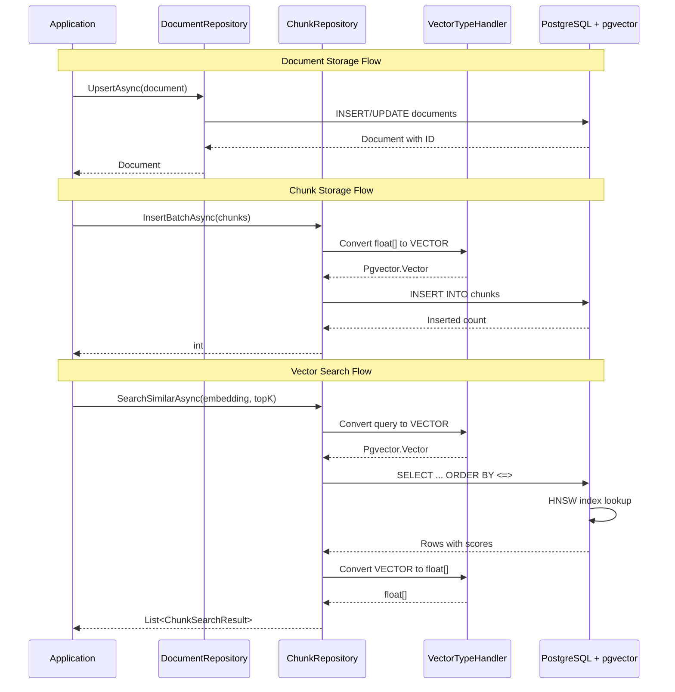

# LCS-SBD-041: Scope Breakdown — The Vector Foundation

## Document Control

| Field            | Value                                                    |
| :--------------- | :------------------------------------------------------- |
| **Document ID**  | LCS-SBD-041                                              |
| **Version**      | v0.4.1                                                   |
| **Codename**     | The Vector Foundation (pgvector Setup)                   |
| **Status**       | In Progress                                              |
| **Last Updated** | 2026-01-31                                               |
| **Owner**        | Lead Architect                                           |
| **Depends On**   | v0.0.5b (IDbConnectionFactory), v0.0.5c (FluentMigrator) |

---

## 1. Executive Summary

### 1.1 The Vision

**v0.4.1** delivers the **Vector Foundation** — the database infrastructure required for semantic search and retrieval-augmented generation (RAG). This release extends the PostgreSQL database to support high-dimensional vector storage, establishing the groundwork for AI-powered document retrieval in v0.4.5+.

While v0.3.x built the "Writing Coach" with algorithmic analysis, v0.4.x gives the system **Memory**. The Vector Foundation provides the storage layer that enables Lexichord to understand document content semantically, not just through keyword matching.

### 1.2 Business Value

- **Semantic Search Foundation:** Enables "find similar passages" and "answer questions about my documents" features.
- **RAG Infrastructure:** Provides the vector storage required for AI-augmented writing assistance.
- **Scalable Architecture:** HNSW indexing supports efficient similarity search across thousands of documents.
- **Industry Standard:** PostgreSQL with pgvector is a proven, cost-effective alternative to dedicated vector databases.
- **Enterprise Ready:** Self-hosted vector storage keeps sensitive document content on-premise.
- **Foundation:** Enables the File Ingestion Pipeline (v0.4.2), Chunking (v0.4.3), Embedding (v0.4.4), and Semantic Search (v0.4.5).

### 1.3 Success Criteria

This release succeeds when:

1. PostgreSQL container starts with pgvector extension automatically enabled.
2. `documents` and `chunks` tables are created via FluentMigrator migration.
3. HNSW index is created on `chunks.embedding` column for approximate nearest neighbor search.
4. `IDocumentRepository` and `IChunkRepository` interfaces are defined in Abstractions.
5. Dapper implementations correctly map `float[]` to PostgreSQL `VECTOR(1536)` type.

### 1.4 License Gating

The Vector Foundation is **Core** infrastructure. All license tiers have access to the database schema. License gating occurs at higher levels:

- **Core:** Schema exists but semantic search features are hidden
- **Writer Pro+:** Full access to vector search features (gated in v0.4.5)

---

## 2. Dependencies on Prior Versions

| Component               | Source Version | Usage in v0.4.1                                                 |
| :---------------------- | :------------- | :-------------------------------------------------------------- |
| `IDbConnectionFactory`  | v0.0.5b        | PostgreSQL connection creation                                  |
| `FluentMigrator`        | v0.0.5c        | Schema migration execution                                      |
| `IGenericRepository<T>` | v0.0.5d        | Base repository pattern                                         |
| `Polly`                 | v0.0.5d        | Retry policies for database operations                          |
| `IConfiguration`        | v0.0.3d        | Database connection string (Microsoft.Extensions.Configuration) |
| `ILogger<T>`            | v0.0.3b        | Structured logging (Microsoft.Extensions.Logging via Serilog)   |

---

## 3. Sub-Part Specifications

### 3.1 v0.4.1a: pgvector Extension

| Field            | Value                         |
| :--------------- | :---------------------------- |
| **Sub-Part ID**  | RAG-041a                      |
| **Title**        | pgvector Docker Configuration |
| **Module**       | `Lexichord.Host`              |
| **License Tier** | Core                          |

**Goal:** Update Docker Compose to use a PostgreSQL image with pgvector pre-installed and verify extension loads on container startup.

**Key Deliverables:**

- Updated `docker-compose.yml` with pgvector-enabled PostgreSQL image
- Initialization script to enable pgvector extension
- Health check to verify extension is loaded
- Documentation for local development setup
- Unit tests verifying extension availability

**Docker Compose Configuration:**

```yaml
services:
    postgres:
        image: pgvector/pgvector:pg16
        environment:
            POSTGRES_USER: lexichord
            POSTGRES_PASSWORD: ${POSTGRES_PASSWORD}
            POSTGRES_DB: lexichord
        volumes:
            - postgres_data:/var/lib/postgresql/data
            - ./init-scripts:/docker-entrypoint-initdb.d
        ports:
            - "5432:5432"
        healthcheck:
            test:
                [
                    "CMD-SHELL",
                    "pg_isready -U lexichord && psql -U lexichord -c 'SELECT 1 FROM pg_extension WHERE extname = $$vector$$'",
                ]
            interval: 10s
            timeout: 5s
            retries: 5
```

**Initialization Script (`init-pgvector.sql`):**

```sql
-- Enable pgvector extension
CREATE EXTENSION IF NOT EXISTS vector;

-- Verify installation
DO $$
BEGIN
    IF NOT EXISTS (SELECT 1 FROM pg_extension WHERE extname = 'vector') THEN
        RAISE EXCEPTION 'pgvector extension failed to install';
    END IF;
END $$;
```

**Verification Command:**

```sql
SELECT * FROM pg_extension WHERE extname = 'vector';
-- Expected: Returns one row with extname = 'vector'
```

**Dependencies:**

- Docker and Docker Compose installed locally
- v0.0.5b: PostgreSQL database infrastructure

---

### 3.2 v0.4.1b: Schema Migration

| Field            | Value                   |
| :--------------- | :---------------------- |
| **Sub-Part ID**  | RAG-041b                |
| **Title**        | Vector Schema Migration |
| **Module**       | `Lexichord.Modules.RAG` |
| **License Tier** | Core                    |

**Goal:** Create FluentMigrator migration defining `documents` and `chunks` tables with vector column and HNSW index.

**Key Deliverables:**

- `Migration_003_VectorSchema.cs` FluentMigrator migration
- `documents` table with file metadata
- `chunks` table with text content and vector embedding
- HNSW index on `chunks.embedding` for efficient similarity search
- Foreign key relationship between chunks and documents
- Rollback support for clean migration reversal

**Key Interfaces:**

```csharp
// Migration class signature
[Migration(202601270001)]
public class Migration_003_VectorSchema : Migration
{
    public override void Up();
    public override void Down();
}
```

**Schema Definition:**

```sql
-- Documents table: stores file metadata
CREATE TABLE documents (
    id UUID PRIMARY KEY DEFAULT gen_random_uuid(),
    file_path TEXT NOT NULL UNIQUE,
    file_hash TEXT NOT NULL,
    title TEXT,
    file_size BIGINT NOT NULL DEFAULT 0,
    last_modified TIMESTAMP WITH TIME ZONE,
    indexed_at TIMESTAMP WITH TIME ZONE NOT NULL DEFAULT CURRENT_TIMESTAMP,
    chunk_count INTEGER NOT NULL DEFAULT 0,
    status TEXT NOT NULL DEFAULT 'pending',
    error_message TEXT,
    metadata JSONB
);

-- Chunks table: stores text segments with embeddings
CREATE TABLE chunks (
    id UUID PRIMARY KEY DEFAULT gen_random_uuid(),
    document_id UUID NOT NULL REFERENCES documents(id) ON DELETE CASCADE,
    content TEXT NOT NULL,
    chunk_index INTEGER NOT NULL,
    start_offset INTEGER NOT NULL,
    end_offset INTEGER NOT NULL,
    embedding VECTOR(1536),
    heading TEXT,
    heading_level INTEGER,
    metadata JSONB,
    created_at TIMESTAMP WITH TIME ZONE NOT NULL DEFAULT CURRENT_TIMESTAMP,
    UNIQUE(document_id, chunk_index)
);

-- HNSW index for approximate nearest neighbor search
CREATE INDEX idx_chunks_embedding_hnsw ON chunks
USING hnsw (embedding vector_cosine_ops)
WITH (m = 16, ef_construction = 64);

-- Additional indexes for common queries
CREATE INDEX idx_documents_file_path ON documents(file_path);
CREATE INDEX idx_documents_status ON documents(status);
CREATE INDEX idx_chunks_document_id ON chunks(document_id);
```

**HNSW Index Parameters:**

| Parameter           | Value | Description                                                                   |
| :------------------ | :---- | :---------------------------------------------------------------------------- |
| `m`                 | 16    | Maximum number of connections per layer (higher = more accurate, more memory) |
| `ef_construction`   | 64    | Size of dynamic candidate list during index construction                      |
| `vector_cosine_ops` | -     | Use cosine similarity for distance calculation                                |

**Dependencies:**

- v0.4.1a: pgvector extension must be enabled
- v0.0.5c: FluentMigrator infrastructure

---

### 3.3 v0.4.1c: Repository Abstractions

| Field            | Value                                    |
| :--------------- | :--------------------------------------- |
| **Sub-Part ID**  | RAG-041c                                 |
| **Title**        | Document and Chunk Repository Interfaces |
| **Module**       | `Lexichord.Abstractions`                 |
| **License Tier** | Core                                     |

**Goal:** Define `IDocumentRepository` and `IChunkRepository` interfaces in Abstractions for data access layer abstraction.

**Key Deliverables:**

- `IDocumentRepository` interface with CRUD operations
- `IChunkRepository` interface with vector search support
- `Document` entity record
- `Chunk` entity record
- `DocumentStatus` enum
- Unit tests for interface contracts

**Key Interfaces:**

```csharp
namespace Lexichord.Abstractions.Contracts;

/// <summary>
/// Repository for managing indexed documents in the RAG system.
/// </summary>
public interface IDocumentRepository
{
    /// <summary>
    /// Retrieves a document by its file path.
    /// </summary>
    /// <param name="filePath">The absolute file path.</param>
    /// <param name="ct">Cancellation token.</param>
    /// <returns>The document if found, null otherwise.</returns>
    Task<Document?> GetByPathAsync(string filePath, CancellationToken ct = default);

    /// <summary>
    /// Retrieves a document by its unique identifier.
    /// </summary>
    /// <param name="id">The document ID.</param>
    /// <param name="ct">Cancellation token.</param>
    /// <returns>The document if found, null otherwise.</returns>
    Task<Document?> GetByIdAsync(Guid id, CancellationToken ct = default);

    /// <summary>
    /// Inserts or updates a document based on file path.
    /// </summary>
    /// <param name="document">The document to upsert.</param>
    /// <param name="ct">Cancellation token.</param>
    /// <returns>The upserted document with generated ID.</returns>
    Task<Document> UpsertAsync(Document document, CancellationToken ct = default);

    /// <summary>
    /// Deletes a document and all its associated chunks.
    /// </summary>
    /// <param name="id">The document ID to delete.</param>
    /// <param name="ct">Cancellation token.</param>
    /// <returns>True if deleted, false if not found.</returns>
    Task<bool> DeleteAsync(Guid id, CancellationToken ct = default);

    /// <summary>
    /// Retrieves all indexed documents.
    /// </summary>
    /// <param name="ct">Cancellation token.</param>
    /// <returns>List of all documents.</returns>
    Task<IReadOnlyList<Document>> GetAllAsync(CancellationToken ct = default);

    /// <summary>
    /// Retrieves documents by status.
    /// </summary>
    /// <param name="status">The document status to filter by.</param>
    /// <param name="ct">Cancellation token.</param>
    /// <returns>List of documents with the specified status.</returns>
    Task<IReadOnlyList<Document>> GetByStatusAsync(DocumentStatus status, CancellationToken ct = default);

    /// <summary>
    /// Updates the chunk count for a document.
    /// </summary>
    /// <param name="documentId">The document ID.</param>
    /// <param name="chunkCount">The new chunk count.</param>
    /// <param name="ct">Cancellation token.</param>
    Task UpdateChunkCountAsync(Guid documentId, int chunkCount, CancellationToken ct = default);
}

/// <summary>
/// Repository for managing document chunks with vector embeddings.
/// </summary>
public interface IChunkRepository
{
    /// <summary>
    /// Retrieves all chunks for a document.
    /// </summary>
    /// <param name="documentId">The parent document ID.</param>
    /// <param name="ct">Cancellation token.</param>
    /// <returns>Ordered list of chunks by index.</returns>
    Task<IReadOnlyList<Chunk>> GetByDocumentIdAsync(Guid documentId, CancellationToken ct = default);

    /// <summary>
    /// Inserts multiple chunks in a batch operation.
    /// </summary>
    /// <param name="chunks">The chunks to insert.</param>
    /// <param name="ct">Cancellation token.</param>
    /// <returns>Number of chunks inserted.</returns>
    Task<int> InsertBatchAsync(IReadOnlyList<Chunk> chunks, CancellationToken ct = default);

    /// <summary>
    /// Deletes all chunks for a document.
    /// </summary>
    /// <param name="documentId">The parent document ID.</param>
    /// <param name="ct">Cancellation token.</param>
    /// <returns>Number of chunks deleted.</returns>
    Task<int> DeleteByDocumentIdAsync(Guid documentId, CancellationToken ct = default);

    /// <summary>
    /// Performs vector similarity search using cosine distance.
    /// </summary>
    /// <param name="queryEmbedding">The query vector (1536 dimensions).</param>
    /// <param name="topK">Maximum number of results to return.</param>
    /// <param name="minScore">Minimum similarity score (0-1).</param>
    /// <param name="documentFilter">Optional document ID to restrict search.</param>
    /// <param name="ct">Cancellation token.</param>
    /// <returns>Chunks ordered by similarity score descending.</returns>
    Task<IReadOnlyList<ChunkSearchResult>> SearchSimilarAsync(
        float[] queryEmbedding,
        int topK = 10,
        float minScore = 0.7f,
        Guid? documentFilter = null,
        CancellationToken ct = default);

    /// <summary>
    /// Updates the embedding for an existing chunk.
    /// </summary>
    /// <param name="chunkId">The chunk ID.</param>
    /// <param name="embedding">The new embedding vector.</param>
    /// <param name="ct">Cancellation token.</param>
    Task UpdateEmbeddingAsync(Guid chunkId, float[] embedding, CancellationToken ct = default);
}
```

**Entity Records:**

```csharp
namespace Lexichord.Abstractions.Contracts;

/// <summary>
/// Status of a document in the indexing pipeline.
/// </summary>
public enum DocumentStatus
{
    /// <summary>Document is queued for indexing.</summary>
    Pending,
    /// <summary>Document is currently being indexed.</summary>
    Indexing,
    /// <summary>Document has been successfully indexed.</summary>
    Indexed,
    /// <summary>Document indexing failed.</summary>
    Failed,
    /// <summary>Document content has changed and needs re-indexing.</summary>
    Stale
}

/// <summary>
/// Represents an indexed document in the RAG system.
/// </summary>
public record Document
{
    /// <summary>Unique identifier.</summary>
    public Guid Id { get; init; }

    /// <summary>Absolute file path.</summary>
    public required string FilePath { get; init; }

    /// <summary>SHA-256 hash of file content for change detection.</summary>
    public required string FileHash { get; init; }

    /// <summary>Document title extracted from content or filename.</summary>
    public string? Title { get; init; }

    /// <summary>File size in bytes.</summary>
    public long FileSize { get; init; }

    /// <summary>Last modification timestamp of the source file.</summary>
    public DateTimeOffset? LastModified { get; init; }

    /// <summary>When the document was indexed.</summary>
    public DateTimeOffset IndexedAt { get; init; }

    /// <summary>Number of chunks created from this document.</summary>
    public int ChunkCount { get; init; }

    /// <summary>Current indexing status.</summary>
    public DocumentStatus Status { get; init; }

    /// <summary>Error message if indexing failed.</summary>
    public string? ErrorMessage { get; init; }

    /// <summary>Additional metadata as JSON.</summary>
    public string? Metadata { get; init; }
}

/// <summary>
/// Represents a text chunk with vector embedding.
/// </summary>
public record Chunk
{
    /// <summary>Unique identifier.</summary>
    public Guid Id { get; init; }

    /// <summary>Parent document ID.</summary>
    public Guid DocumentId { get; init; }

    /// <summary>Text content of the chunk.</summary>
    public required string Content { get; init; }

    /// <summary>Zero-based index within the document.</summary>
    public int ChunkIndex { get; init; }

    /// <summary>Character offset where chunk starts in source.</summary>
    public int StartOffset { get; init; }

    /// <summary>Character offset where chunk ends in source.</summary>
    public int EndOffset { get; init; }

    /// <summary>Vector embedding (1536 dimensions for OpenAI).</summary>
    public float[]? Embedding { get; init; }

    /// <summary>Section heading if chunk is under a header.</summary>
    public string? Heading { get; init; }

    /// <summary>Heading level (1-6 for H1-H6).</summary>
    public int? HeadingLevel { get; init; }

    /// <summary>Additional metadata as JSON.</summary>
    public string? Metadata { get; init; }

    /// <summary>When the chunk was created.</summary>
    public DateTimeOffset CreatedAt { get; init; }
}

/// <summary>
/// Result from vector similarity search.
/// </summary>
public record ChunkSearchResult
{
    /// <summary>The matching chunk.</summary>
    public required Chunk Chunk { get; init; }

    /// <summary>Cosine similarity score (0-1, higher is more similar).</summary>
    public float Score { get; init; }

    /// <summary>Distance from query vector.</summary>
    public float Distance { get; init; }
}
```

**Dependencies:**

- None (defines abstractions only)

---

### 3.4 v0.4.1d: Dapper Implementation

| Field            | Value                            |
| :--------------- | :------------------------------- |
| **Sub-Part ID**  | RAG-041d                         |
| **Title**        | Repository Dapper Implementation |
| **Module**       | `Lexichord.Modules.RAG`          |
| **License Tier** | Core                             |

**Goal:** Implement `DocumentRepository` and `ChunkRepository` using Dapper with custom type handlers for pgvector `VECTOR` to `float[]` conversion.

**Key Deliverables:**

- `DocumentRepository` implementing `IDocumentRepository`
- `ChunkRepository` implementing `IChunkRepository`
- `VectorTypeHandler` for Dapper to map `float[]` to PostgreSQL `VECTOR`
- Connection pooling configuration
- Retry policies using Polly for transient failures
- Unit tests with in-memory database
- Integration tests with real PostgreSQL

**Key Interfaces:**

```csharp
namespace Lexichord.Modules.RAG.Data;

/// <summary>
/// Custom Dapper type handler for pgvector VECTOR type.
/// Maps between .NET float[] and PostgreSQL VECTOR(n).
/// </summary>
public class VectorTypeHandler : SqlMapper.TypeHandler<float[]>
{
    public override void SetValue(IDbDataParameter parameter, float[]? value);
    public override float[]? Parse(object value);
}
```

**Vector Type Handler Implementation:**

```csharp
using Dapper;
using Pgvector;
using System.Data;

namespace Lexichord.Modules.RAG.Data;

/// <summary>
/// Dapper type handler for mapping float[] to PostgreSQL VECTOR type.
/// Uses Npgsql.Pgvector for native pgvector support.
/// </summary>
public class VectorTypeHandler : SqlMapper.TypeHandler<float[]>
{
    /// <summary>
    /// Sets the parameter value for a float[] to be stored as VECTOR.
    /// </summary>
    public override void SetValue(IDbDataParameter parameter, float[]? value)
    {
        parameter.Value = value is null ? DBNull.Value : new Vector(value);
    }

    /// <summary>
    /// Parses a VECTOR value from the database to float[].
    /// </summary>
    public override float[]? Parse(object value)
    {
        return value switch
        {
            null or DBNull => null,
            Vector vector => vector.ToArray(),
            float[] array => array,
            _ => throw new InvalidCastException(
                $"Cannot convert {value.GetType()} to float[]")
        };
    }
}
```

**Repository Implementation Pattern:**

```csharp
namespace Lexichord.Modules.RAG.Data;

/// <summary>
/// Dapper implementation of IDocumentRepository.
/// </summary>
public class DocumentRepository(
    IDbConnectionFactory connectionFactory,
    ILogger<DocumentRepository> logger) : IDocumentRepository
{
    public async Task<Document?> GetByPathAsync(string filePath, CancellationToken ct = default)
    {
        logger.LogDebug("Fetching document by path: {FilePath}", filePath);

        await using var connection = await connectionFactory.CreateConnectionAsync(ct);

        const string sql = """
            SELECT id, file_path, file_hash, title, file_size, last_modified,
                   indexed_at, chunk_count, status, error_message, metadata
            FROM documents
            WHERE file_path = @FilePath
            """;

        return await connection.QuerySingleOrDefaultAsync<Document>(
            new CommandDefinition(sql, new { FilePath = filePath }, cancellationToken: ct));
    }

    public async Task<Document> UpsertAsync(Document document, CancellationToken ct = default)
    {
        logger.LogDebug("Upserting document: {FilePath}", document.FilePath);

        await using var connection = await connectionFactory.CreateConnectionAsync(ct);

        const string sql = """
            INSERT INTO documents (file_path, file_hash, title, file_size, last_modified, status, metadata)
            VALUES (@FilePath, @FileHash, @Title, @FileSize, @LastModified, @Status, @Metadata::jsonb)
            ON CONFLICT (file_path) DO UPDATE SET
                file_hash = EXCLUDED.file_hash,
                title = EXCLUDED.title,
                file_size = EXCLUDED.file_size,
                last_modified = EXCLUDED.last_modified,
                status = EXCLUDED.status,
                metadata = EXCLUDED.metadata,
                indexed_at = CURRENT_TIMESTAMP
            RETURNING *
            """;

        return await connection.QuerySingleAsync<Document>(
            new CommandDefinition(sql, document, cancellationToken: ct));
    }

    // ... additional methods
}
```

**Vector Search Query:**

```csharp
public async Task<IReadOnlyList<ChunkSearchResult>> SearchSimilarAsync(
    float[] queryEmbedding,
    int topK = 10,
    float minScore = 0.7f,
    Guid? documentFilter = null,
    CancellationToken ct = default)
{
    logger.LogDebug(
        "Searching similar chunks: TopK={TopK}, MinScore={MinScore}, DocFilter={DocFilter}",
        topK, minScore, documentFilter);

    await using var connection = await connectionFactory.CreateConnectionAsync(ct);

    // Cosine similarity: 1 - cosine_distance
    // pgvector <=> operator returns cosine distance
    const string sql = """
        SELECT c.*,
               1 - (c.embedding <=> @QueryEmbedding::vector) AS score,
               c.embedding <=> @QueryEmbedding::vector AS distance
        FROM chunks c
        WHERE c.embedding IS NOT NULL
          AND (@DocumentFilter IS NULL OR c.document_id = @DocumentFilter)
          AND 1 - (c.embedding <=> @QueryEmbedding::vector) >= @MinScore
        ORDER BY c.embedding <=> @QueryEmbedding::vector
        LIMIT @TopK
        """;

    var results = await connection.QueryAsync<ChunkSearchResult>(
        new CommandDefinition(sql, new
        {
            QueryEmbedding = queryEmbedding,
            TopK = topK,
            MinScore = minScore,
            DocumentFilter = documentFilter
        }, cancellationToken: ct));

    return results.ToList().AsReadOnly();
}
```

**DI Registration:**

```csharp
// In RAGModule.cs
public static IServiceCollection AddRAGModule(this IServiceCollection services)
{
    // Register Dapper type handler for pgvector
    SqlMapper.AddTypeHandler(new VectorTypeHandler());

    // Register repositories
    services.AddScoped<IDocumentRepository, DocumentRepository>();
    services.AddScoped<IChunkRepository, ChunkRepository>();

    return services;
}
```

**Dependencies:**

- v0.4.1b: Schema must exist
- v0.4.1c: Interface definitions
- v0.0.5b: `IDbConnectionFactory` for connection creation
- v0.0.5d: Polly for retry policies

---

## 4. Implementation Checklist

| #         | Sub-Part | Task                                            | Est. Hours   |
| :-------- | :------- | :---------------------------------------------- | :----------- |
| 1         | v0.4.1a  | Update docker-compose.yml with pgvector image   | 0.5          |
| 2         | v0.4.1a  | Create init-pgvector.sql initialization script  | 0.5          |
| 3         | v0.4.1a  | Add health check for pgvector extension         | 0.5          |
| 4         | v0.4.1a  | Document local development setup                | 1            |
| 5         | v0.4.1a  | Create verification test for extension          | 1            |
| 6         | v0.4.1b  | Create Migration_003_VectorSchema.cs            | 2            |
| 7         | v0.4.1b  | Define documents table with all columns         | 0.5          |
| 8         | v0.4.1b  | Define chunks table with vector column          | 0.5          |
| 9         | v0.4.1b  | Create HNSW index on embedding column           | 0.5          |
| 10        | v0.4.1b  | Implement rollback (Down) migration             | 0.5          |
| 11        | v0.4.1b  | Unit tests for migration up/down                | 1            |
| 12        | v0.4.1c  | Create IDocumentRepository interface            | 1            |
| 13        | v0.4.1c  | Create IChunkRepository interface               | 1            |
| 14        | v0.4.1c  | Create Document entity record                   | 0.5          |
| 15        | v0.4.1c  | Create Chunk entity record                      | 0.5          |
| 16        | v0.4.1c  | Create ChunkSearchResult record                 | 0.5          |
| 17        | v0.4.1c  | Create DocumentStatus enum                      | 0.5          |
| 18        | v0.4.1d  | Install Npgsql.Pgvector NuGet package           | 0.5          |
| 19        | v0.4.1d  | Implement VectorTypeHandler                     | 1            |
| 20        | v0.4.1d  | Implement DocumentRepository                    | 3            |
| 21        | v0.4.1d  | Implement ChunkRepository                       | 3            |
| 22        | v0.4.1d  | Implement vector search query with pgvector     | 2            |
| 23        | v0.4.1d  | Unit tests for repositories (mocked connection) | 2            |
| 24        | v0.4.1d  | Integration tests with real PostgreSQL          | 2            |
| 25        | All      | DI registration in RAGModule.cs                 | 0.5          |
| 26        | All      | End-to-end integration test                     | 1            |
| **Total** |          |                                                 | **27 hours** |

---

## 5. Dependency Matrix

### 5.1 Required Interfaces (from earlier versions)

| Interface               | Source Version | Purpose                                                              |
| :---------------------- | :------------- | :------------------------------------------------------------------- |
| `IDbConnectionFactory`  | v0.0.5b        | PostgreSQL connection creation                                       |
| `IGenericRepository<T>` | v0.0.5d        | Base repository pattern (optional)                                   |
| `IConfiguration`        | v0.0.3d        | Connection string configuration (Microsoft.Extensions.Configuration) |

### 5.2 New Interfaces (defined in v0.4.1)

| Interface             | Defined In | Module       | Purpose                         |
| :-------------------- | :--------- | :----------- | :------------------------------ |
| `IDocumentRepository` | v0.4.1c    | Abstractions | Document CRUD operations        |
| `IChunkRepository`    | v0.4.1c    | Abstractions | Chunk storage and vector search |

### 5.3 New Records/DTOs (defined in v0.4.1)

| Record              | Defined In | Purpose                         |
| :------------------ | :--------- | :------------------------------ |
| `Document`          | v0.4.1c    | Indexed document entity         |
| `Chunk`             | v0.4.1c    | Text chunk with embedding       |
| `ChunkSearchResult` | v0.4.1c    | Vector search result with score |
| `DocumentStatus`    | v0.4.1c    | Indexing status enum            |

### 5.4 NuGet Packages

| Package           | Version | Purpose               | New/Existing |
| :---------------- | :------ | :-------------------- | :----------- |
| `Npgsql`          | 9.0.x   | PostgreSQL driver     | Existing     |
| `Npgsql.Pgvector` | 0.2.x   | pgvector type mapping | New          |
| `Dapper`          | 2.1.x   | Micro-ORM             | Existing     |
| `FluentMigrator`  | 6.2.x   | Schema migrations     | Existing     |
| `Polly`           | 8.5.x   | Retry policies        | Existing     |

---

## 6. Architecture Diagram

```mermaid
graph TB
    subgraph "Lexichord.Modules.RAG"
        subgraph "Data Layer"
            DR[DocumentRepository<br/>Dapper implementation]
            CR[ChunkRepository<br/>Vector search]
            VTH[VectorTypeHandler<br/>float[] ↔ VECTOR]
        end

        subgraph "Migration"
            MIG[Migration_003_VectorSchema<br/>FluentMigrator]
        end
    end

    subgraph "Lexichord.Abstractions"
        IDR[IDocumentRepository]
        ICR[IChunkRepository]
        DOC[Document record]
        CHK[Chunk record]
    end

    subgraph "Infrastructure"
        PG[(PostgreSQL<br/>+ pgvector)]
        DCF[IDbConnectionFactory<br/>v0.0.5b]
    end

    DR --> IDR
    CR --> ICR
    DR --> DOC
    CR --> CHK
    DR --> VTH
    CR --> VTH
    DR --> DCF
    CR --> DCF
    MIG --> PG
    DCF --> PG

    style DR fill:#22c55e,color:#fff
    style CR fill:#22c55e,color:#fff
    style VTH fill:#f97316,color:#fff
    style MIG fill:#f97316,color:#fff
    style PG fill:#4a9eff,color:#fff
```

---

## 7. Data Flow Diagram



---

## 8. Risks & Mitigations

| Risk                                                | Impact | Probability | Mitigation                                                                              |
| :-------------------------------------------------- | :----- | :---------- | :-------------------------------------------------------------------------------------- |
| pgvector extension not available in prod PostgreSQL | High   | Low         | Document required PostgreSQL setup; provide alternative hosted options (Supabase, Neon) |
| HNSW index build time on large datasets             | Medium | Medium      | Build index asynchronously; use CONCURRENTLY option                                     |
| Vector dimension mismatch (not 1536)                | High   | Low         | Validate embedding dimensions before insert; fail fast                                  |
| Memory pressure with large embeddings               | Medium | Medium      | Limit batch sizes; implement connection pooling                                         |
| Migration rollback loses data                       | High   | Low         | Backup before migration; test rollback in staging                                       |
| Dapper type handler registration order              | Low    | Medium      | Register handler in module initialization before any queries                            |

---

## 9. Success Metrics

| Metric                              | Target  | Measurement                               |
| :---------------------------------- | :------ | :---------------------------------------- |
| Extension verification              | < 1s    | `SELECT FROM pg_extension` execution time |
| Migration execution                 | < 5s    | FluentMigrator timing                     |
| Document insert                     | < 10ms  | Stopwatch timing                          |
| Chunk batch insert (100 chunks)     | < 500ms | Stopwatch timing                          |
| Vector search (10K chunks, top-10)  | < 200ms | Query execution time                      |
| Vector search (100K chunks, top-10) | < 500ms | Query execution time                      |
| HNSW index build (10K vectors)      | < 30s   | Index creation time                       |

---

## 10. What This Enables

After v0.4.1, Lexichord will support:

- **v0.4.2 (File Ingestion Pipeline):** Detect file changes and queue them for indexing using the document table.

- **v0.4.3 (Chunking Strategies):** Split documents into chunks and store them using the chunk repository.

- **v0.4.4 (Vector Generation):** Store embeddings in the chunks table using the vector column.

- **v0.4.5 (Semantic Search):** Query similar chunks using the `SearchSimilarAsync` method and HNSW index.

- **v0.4.6 (Reference Panel):** Display search results from the chunk repository in the UI.

---

## 11. Decision Trees

### 11.1 Should Document Be Re-indexed?

```text
START: "Should this document be re-indexed?"
│
├── Does document exist in database?
│   ├── NO → INSERT new document, status = Pending
│   └── YES → Continue
│
├── Has file hash changed?
│   ├── NO → Skip indexing (already up to date)
│   └── YES → Continue
│
├── Is document status = Indexing?
│   ├── YES → Skip (already being processed)
│   └── NO → Continue
│
├── Mark document status = Stale
│
└── Queue for re-indexing
```

### 11.2 Vector Search Strategy

```text
START: "How to search for similar chunks?"
│
├── Is query embedding provided?
│   ├── NO → Return empty results
│   └── YES → Continue
│
├── Is document filter specified?
│   ├── YES → Add WHERE document_id = filter
│   └── NO → Search all documents
│
├── Execute HNSW index query with <=> operator
│
├── Filter results by minScore threshold
│
└── Return top-K results ordered by score descending
```

---

## 12. User Stories

| ID    | Role      | Story                                                                     | Acceptance Criteria                          |
| :---- | :-------- | :------------------------------------------------------------------------ | :------------------------------------------- |
| US-01 | Developer | As a developer, I want PostgreSQL to have pgvector enabled automatically. | Container starts with extension verified.    |
| US-02 | Developer | As a developer, I want database schema created via migration.             | `dotnet ef database update` creates tables.  |
| US-03 | Developer | As a developer, I want to store documents with metadata.                  | `UpsertAsync` saves and retrieves document.  |
| US-04 | Developer | As a developer, I want to store chunks with embeddings.                   | `InsertBatchAsync` stores 1536-dim vectors.  |
| US-05 | Developer | As a developer, I want to search chunks by vector similarity.             | `SearchSimilarAsync` returns ranked results. |
| US-06 | Developer | As a developer, I want cascading delete when document is removed.         | Deleting document removes all its chunks.    |

---

## 13. Use Cases

### UC-01: Initialize Database with pgvector

**Preconditions:**

- Docker and Docker Compose installed
- No existing PostgreSQL container

**Flow:**

1. Developer runs `docker-compose up -d`.
2. PostgreSQL container starts with pgvector image.
3. Initialization script enables pgvector extension.
4. Health check verifies extension is loaded.
5. Container reports healthy status.

**Postconditions:**

- PostgreSQL accessible on port 5432
- `SELECT * FROM pg_extension WHERE extname = 'vector'` returns one row

---

### UC-02: Run Schema Migration

**Preconditions:**

- PostgreSQL running with pgvector enabled
- FluentMigrator configured

**Flow:**

1. Application starts and runs pending migrations.
2. `Migration_003_VectorSchema.Up()` executes.
3. `documents` table created with indexes.
4. `chunks` table created with `VECTOR(1536)` column.
5. HNSW index created on `chunks.embedding`.
6. Migration recorded in version table.

**Postconditions:**

- Tables exist and are queryable
- HNSW index visible in `pg_indexes`

---

### UC-03: Store Document and Chunks

**Preconditions:**

- Schema migration completed
- File content available for indexing

**Flow:**

1. Application creates `Document` record with file metadata.
2. `DocumentRepository.UpsertAsync()` inserts document.
3. Application chunks content into segments.
4. Application generates embeddings for each chunk.
5. `ChunkRepository.InsertBatchAsync()` stores all chunks.
6. `DocumentRepository.UpdateChunkCountAsync()` updates count.

**Postconditions:**

- Document row exists with chunk_count > 0
- Chunk rows exist with non-null embeddings

---

### UC-04: Vector Similarity Search

**Preconditions:**

- Documents and chunks indexed with embeddings
- Query text available

**Flow:**

1. Application generates embedding for query text.
2. `ChunkRepository.SearchSimilarAsync()` called with embedding.
3. pgvector HNSW index finds approximate nearest neighbors.
4. Results filtered by minScore threshold.
5. Top-K results returned with similarity scores.

**Postconditions:**

- Results ordered by similarity (highest first)
- Each result includes chunk content and score

---

## 14. Unit Testing Requirements

### 14.1 VectorTypeHandler Tests

```csharp
[Trait("Category", "Unit")]
[Trait("Feature", "v0.4.1d")]
public class VectorTypeHandlerTests
{
    private readonly VectorTypeHandler _sut = new();

    [Fact]
    public void SetValue_WithFloatArray_SetsVectorParameter()
    {
        // Arrange
        var parameter = new NpgsqlParameter();
        var embedding = new float[] { 0.1f, 0.2f, 0.3f };

        // Act
        _sut.SetValue(parameter, embedding);

        // Assert
        parameter.Value.Should().BeOfType<Vector>();
        ((Vector)parameter.Value).ToArray().Should().BeEquivalentTo(embedding);
    }

    [Fact]
    public void SetValue_WithNull_SetsDbNull()
    {
        // Arrange
        var parameter = new NpgsqlParameter();

        // Act
        _sut.SetValue(parameter, null);

        // Assert
        parameter.Value.Should().Be(DBNull.Value);
    }

    [Fact]
    public void Parse_WithVector_ReturnsFloatArray()
    {
        // Arrange
        var vector = new Vector(new float[] { 0.1f, 0.2f, 0.3f });

        // Act
        var result = _sut.Parse(vector);

        // Assert
        result.Should().BeEquivalentTo(new float[] { 0.1f, 0.2f, 0.3f });
    }

    [Fact]
    public void Parse_WithNull_ReturnsNull()
    {
        // Act
        var result = _sut.Parse(DBNull.Value);

        // Assert
        result.Should().BeNull();
    }
}
```

### 14.2 DocumentRepository Tests

```csharp
[Trait("Category", "Unit")]
[Trait("Feature", "v0.4.1d")]
public class DocumentRepositoryTests
{
    private readonly Mock<IDbConnectionFactory> _connectionFactoryMock;
    private readonly DocumentRepository _sut;

    public DocumentRepositoryTests()
    {
        _connectionFactoryMock = new Mock<IDbConnectionFactory>();
        _sut = new DocumentRepository(
            _connectionFactoryMock.Object,
            NullLogger<DocumentRepository>.Instance);
    }

    [Fact]
    public async Task GetByPathAsync_WithExistingPath_ReturnsDocument()
    {
        // Test implementation with mocked connection
    }

    [Fact]
    public async Task UpsertAsync_WithNewDocument_InsertsAndReturns()
    {
        // Test implementation
    }

    [Fact]
    public async Task DeleteAsync_WithExistingId_ReturnsTrue()
    {
        // Test implementation
    }
}
```

### 14.3 ChunkRepository Tests

```csharp
[Trait("Category", "Unit")]
[Trait("Feature", "v0.4.1d")]
public class ChunkRepositoryTests
{
    [Fact]
    public async Task SearchSimilarAsync_WithValidEmbedding_ReturnsOrderedResults()
    {
        // Test that results are ordered by score descending
    }

    [Fact]
    public async Task SearchSimilarAsync_WithDocumentFilter_FiltersResults()
    {
        // Test that only chunks from specified document are returned
    }

    [Fact]
    public async Task SearchSimilarAsync_WithMinScore_ExcludesLowScores()
    {
        // Test that results below minScore are excluded
    }

    [Fact]
    public async Task InsertBatchAsync_WithChunks_InsertsAll()
    {
        // Test batch insert
    }
}
```

---

## 15. Observability & Logging

| Level   | Source             | Message Template                                                  |
| :------ | :----------------- | :---------------------------------------------------------------- |
| Debug   | DocumentRepository | `Fetching document by path: {FilePath}`                           |
| Debug   | DocumentRepository | `Upserting document: {FilePath}`                                  |
| Info    | DocumentRepository | `Document upserted: {DocumentId} at {FilePath}`                   |
| Debug   | DocumentRepository | `Deleting document: {DocumentId}`                                 |
| Warning | DocumentRepository | `Document not found for deletion: {DocumentId}`                   |
| Debug   | ChunkRepository    | `Inserting {ChunkCount} chunks for document {DocumentId}`         |
| Info    | ChunkRepository    | `Inserted {InsertedCount} chunks for document {DocumentId}`       |
| Debug   | ChunkRepository    | `Searching similar chunks: TopK={TopK}, MinScore={MinScore}`      |
| Info    | ChunkRepository    | `Vector search completed: {ResultCount} results in {ElapsedMs}ms` |
| Warning | ChunkRepository    | `Vector search slow: {ElapsedMs}ms > {ThresholdMs}ms`             |
| Error   | VectorTypeHandler  | `Failed to convert value to float[]: {ValueType}`                 |

---

## 16. UI/UX Specifications

**None.** v0.4.1 is a backend infrastructure release with no direct UI components. UI for viewing indexed documents will be added in v0.4.7 (Index Manager).

---

## 17. Acceptance Criteria (QA)

| #   | Category             | Criterion                                                                 |
| :-- | :------------------- | :------------------------------------------------------------------------ |
| 1   | **[Infrastructure]** | Docker Compose starts PostgreSQL with pgvector extension enabled.         |
| 2   | **[Infrastructure]** | Health check passes after container startup.                              |
| 3   | **[Migration]**      | `Migration_003_VectorSchema` creates documents table.                     |
| 4   | **[Migration]**      | `Migration_003_VectorSchema` creates chunks table with VECTOR column.     |
| 5   | **[Migration]**      | HNSW index created on chunks.embedding column.                            |
| 6   | **[Migration]**      | Migration rollback (Down) drops tables cleanly.                           |
| 7   | **[Repository]**     | `DocumentRepository.UpsertAsync` inserts new document.                    |
| 8   | **[Repository]**     | `DocumentRepository.UpsertAsync` updates existing document.               |
| 9   | **[Repository]**     | `DocumentRepository.DeleteAsync` removes document and cascades to chunks. |
| 10  | **[Repository]**     | `ChunkRepository.InsertBatchAsync` stores chunks with embeddings.         |
| 11  | **[Repository]**     | `ChunkRepository.SearchSimilarAsync` returns results ordered by score.    |
| 12  | **[Repository]**     | Vector search respects minScore threshold.                                |
| 13  | **[Repository]**     | Vector search respects documentFilter parameter.                          |
| 14  | **[Performance]**    | Vector search on 10K chunks completes in < 200ms.                         |
| 15  | **[Type Handler]**   | float[] correctly maps to PostgreSQL VECTOR type.                         |
| 16  | **[Type Handler]**   | PostgreSQL VECTOR correctly maps to float[].                              |

---

## 18. Verification Commands

```bash
# ═══════════════════════════════════════════════════════════════════════════
# v0.4.1 Verification
# ═══════════════════════════════════════════════════════════════════════════

# 1. Start PostgreSQL with pgvector
docker-compose up -d postgres

# 2. Verify pgvector extension is enabled
docker exec -it lexichord-postgres psql -U lexichord -c \
  "SELECT * FROM pg_extension WHERE extname = 'vector';"
# Expected: Returns one row with extname = 'vector'

# 3. Verify NuGet packages installed
dotnet list src/Lexichord.Modules.RAG package | grep -E "Npgsql|Pgvector"

# 4. Build solution
dotnet build

# 5. Run migrations
dotnet run --project src/Lexichord.Host -- migrate

# 6. Verify tables created
docker exec -it lexichord-postgres psql -U lexichord -c \
  "SELECT table_name FROM information_schema.tables WHERE table_schema = 'public';"
# Expected: documents, chunks tables listed

# 7. Verify HNSW index
docker exec -it lexichord-postgres psql -U lexichord -c \
  "SELECT indexname FROM pg_indexes WHERE tablename = 'chunks';"
# Expected: idx_chunks_embedding_hnsw listed

# 8. Run unit tests
dotnet test --filter "Category=Unit&FullyQualifiedName~RAG"

# 9. Run integration tests
dotnet test --filter "Category=Integration&FullyQualifiedName~RAG"

# 10. Manual verification - Insert and search test
docker exec -it lexichord-postgres psql -U lexichord -c "
  INSERT INTO documents (file_path, file_hash, status)
  VALUES ('/test/file.md', 'abc123', 'indexed')
  RETURNING id;
"
```

---

## 19. Deliverable Checklist

| #   | Deliverable                                              | Status |
| :-- | :------------------------------------------------------- | :----- |
| 1   | `docker-compose.yml` with pgvector image                 | [ ]    |
| 2   | `init-pgvector.sql` initialization script                | [ ]    |
| 3   | `Migration_003_VectorSchema.cs` FluentMigrator migration | [ ]    |
| 4   | `IDocumentRepository` interface in Abstractions          | [ ]    |
| 5   | `IChunkRepository` interface in Abstractions             | [ ]    |
| 6   | `Document` entity record                                 | [ ]    |
| 7   | `Chunk` entity record                                    | [ ]    |
| 8   | `ChunkSearchResult` record                               | [ ]    |
| 9   | `DocumentStatus` enum                                    | [ ]    |
| 10  | `VectorTypeHandler` Dapper type handler                  | [ ]    |
| 11  | `DocumentRepository` implementation                      | [ ]    |
| 12  | `ChunkRepository` implementation                         | [ ]    |
| 13  | Unit tests for VectorTypeHandler                         | [ ]    |
| 14  | Unit tests for DocumentRepository                        | [ ]    |
| 15  | Unit tests for ChunkRepository                           | [ ]    |
| 16  | Integration tests with PostgreSQL                        | [ ]    |
| 17  | DI registration in RAGModule.cs                          | [ ]    |

---

## 20. Code Examples

### 20.1 Document Entity

```csharp
namespace Lexichord.Abstractions.Contracts;

/// <summary>
/// Represents an indexed document in the RAG system.
/// Documents are the parent entities for chunks.
/// </summary>
public record Document
{
    /// <summary>
    /// Unique identifier generated by the database.
    /// </summary>
    public Guid Id { get; init; }

    /// <summary>
    /// Absolute file path to the source document.
    /// Used as the unique constraint for upsert operations.
    /// </summary>
    public required string FilePath { get; init; }

    /// <summary>
    /// SHA-256 hash of the file content.
    /// Used for change detection to avoid re-indexing unchanged files.
    /// </summary>
    public required string FileHash { get; init; }

    /// <summary>
    /// Document title extracted from content (first H1) or filename.
    /// </summary>
    public string? Title { get; init; }

    /// <summary>
    /// File size in bytes for display and filtering.
    /// </summary>
    public long FileSize { get; init; }

    /// <summary>
    /// Last modification timestamp of the source file.
    /// Used for quick change detection before computing hash.
    /// </summary>
    public DateTimeOffset? LastModified { get; init; }

    /// <summary>
    /// When the document was last indexed successfully.
    /// </summary>
    public DateTimeOffset IndexedAt { get; init; }

    /// <summary>
    /// Number of chunks created from this document.
    /// Updated after chunking completes.
    /// </summary>
    public int ChunkCount { get; init; }

    /// <summary>
    /// Current status in the indexing pipeline.
    /// </summary>
    public DocumentStatus Status { get; init; } = DocumentStatus.Pending;

    /// <summary>
    /// Error message if indexing failed.
    /// Null when Status != Failed.
    /// </summary>
    public string? ErrorMessage { get; init; }

    /// <summary>
    /// Additional metadata stored as JSON.
    /// Can include: author, tags, custom fields.
    /// </summary>
    public string? Metadata { get; init; }
}
```

### 20.2 FluentMigrator Migration

```csharp
using FluentMigrator;

namespace Lexichord.Modules.RAG.Migrations;

/// <summary>
/// Creates the vector storage schema for RAG functionality.
/// Requires pgvector extension to be enabled.
/// </summary>
[Migration(202601270001)]
public class Migration_003_VectorSchema : Migration
{
    public override void Up()
    {
        // Ensure pgvector extension exists
        Execute.Sql("CREATE EXTENSION IF NOT EXISTS vector;");

        // Documents table
        Create.Table("documents")
            .WithColumn("id").AsGuid().PrimaryKey().WithDefault(SystemMethods.NewGuid)
            .WithColumn("file_path").AsString(1000).NotNullable().Unique()
            .WithColumn("file_hash").AsString(64).NotNullable()
            .WithColumn("title").AsString(500).Nullable()
            .WithColumn("file_size").AsInt64().NotNullable().WithDefaultValue(0)
            .WithColumn("last_modified").AsDateTimeOffset().Nullable()
            .WithColumn("indexed_at").AsDateTimeOffset().NotNullable().WithDefault(SystemMethods.CurrentUTCDateTime)
            .WithColumn("chunk_count").AsInt32().NotNullable().WithDefaultValue(0)
            .WithColumn("status").AsString(20).NotNullable().WithDefaultValue("pending")
            .WithColumn("error_message").AsString(int.MaxValue).Nullable()
            .WithColumn("metadata").AsCustom("jsonb").Nullable();

        // Chunks table with vector column
        Create.Table("chunks")
            .WithColumn("id").AsGuid().PrimaryKey().WithDefault(SystemMethods.NewGuid)
            .WithColumn("document_id").AsGuid().NotNullable()
                .ForeignKey("fk_chunks_document", "documents", "id")
                .OnDelete(System.Data.Rule.Cascade)
            .WithColumn("content").AsString(int.MaxValue).NotNullable()
            .WithColumn("chunk_index").AsInt32().NotNullable()
            .WithColumn("start_offset").AsInt32().NotNullable()
            .WithColumn("end_offset").AsInt32().NotNullable()
            .WithColumn("embedding").AsCustom("vector(1536)").Nullable()
            .WithColumn("heading").AsString(500).Nullable()
            .WithColumn("heading_level").AsInt32().Nullable()
            .WithColumn("metadata").AsCustom("jsonb").Nullable()
            .WithColumn("created_at").AsDateTimeOffset().NotNullable().WithDefault(SystemMethods.CurrentUTCDateTime);

        // Unique constraint on document_id + chunk_index
        Create.UniqueConstraint("uq_chunks_document_index")
            .OnTable("chunks")
            .Columns("document_id", "chunk_index");

        // HNSW index for vector similarity search
        Execute.Sql(@"
            CREATE INDEX idx_chunks_embedding_hnsw ON chunks
            USING hnsw (embedding vector_cosine_ops)
            WITH (m = 16, ef_construction = 64);
        ");

        // Additional indexes
        Create.Index("idx_documents_file_path").OnTable("documents").OnColumn("file_path");
        Create.Index("idx_documents_status").OnTable("documents").OnColumn("status");
        Create.Index("idx_chunks_document_id").OnTable("chunks").OnColumn("document_id");
    }

    public override void Down()
    {
        Delete.Table("chunks");
        Delete.Table("documents");
    }
}
```

### 20.3 ChunkRepository Vector Search

```csharp
namespace Lexichord.Modules.RAG.Data;

/// <summary>
/// Dapper implementation of IChunkRepository with pgvector support.
/// </summary>
public class ChunkRepository(
    IDbConnectionFactory connectionFactory,
    ILogger<ChunkRepository> logger) : IChunkRepository
{
    public async Task<IReadOnlyList<ChunkSearchResult>> SearchSimilarAsync(
        float[] queryEmbedding,
        int topK = 10,
        float minScore = 0.7f,
        Guid? documentFilter = null,
        CancellationToken ct = default)
    {
        if (queryEmbedding.Length != 1536)
        {
            throw new ArgumentException(
                $"Embedding must have 1536 dimensions, got {queryEmbedding.Length}",
                nameof(queryEmbedding));
        }

        var stopwatch = Stopwatch.StartNew();

        logger.LogDebug(
            "Searching similar chunks: TopK={TopK}, MinScore={MinScore}, DocFilter={DocFilter}",
            topK, minScore, documentFilter);

        await using var connection = await connectionFactory.CreateConnectionAsync(ct);

        const string sql = """
            SELECT
                c.id, c.document_id, c.content, c.chunk_index,
                c.start_offset, c.end_offset, c.embedding,
                c.heading, c.heading_level, c.metadata, c.created_at,
                1 - (c.embedding <=> @QueryEmbedding::vector) AS score,
                c.embedding <=> @QueryEmbedding::vector AS distance
            FROM chunks c
            WHERE c.embedding IS NOT NULL
              AND (@DocumentFilter IS NULL OR c.document_id = @DocumentFilter)
              AND 1 - (c.embedding <=> @QueryEmbedding::vector) >= @MinScore
            ORDER BY c.embedding <=> @QueryEmbedding::vector
            LIMIT @TopK
            """;

        var results = await connection.QueryAsync<ChunkWithScore>(
            new CommandDefinition(sql, new
            {
                QueryEmbedding = queryEmbedding,
                TopK = topK,
                MinScore = minScore,
                DocumentFilter = documentFilter
            }, cancellationToken: ct));

        var resultList = results
            .Select(r => new ChunkSearchResult
            {
                Chunk = new Chunk
                {
                    Id = r.Id,
                    DocumentId = r.DocumentId,
                    Content = r.Content,
                    ChunkIndex = r.ChunkIndex,
                    StartOffset = r.StartOffset,
                    EndOffset = r.EndOffset,
                    Embedding = r.Embedding,
                    Heading = r.Heading,
                    HeadingLevel = r.HeadingLevel,
                    Metadata = r.Metadata,
                    CreatedAt = r.CreatedAt
                },
                Score = r.Score,
                Distance = r.Distance
            })
            .ToList()
            .AsReadOnly();

        stopwatch.Stop();

        logger.LogInformation(
            "Vector search completed: {ResultCount} results in {ElapsedMs}ms",
            resultList.Count, stopwatch.ElapsedMilliseconds);

        if (stopwatch.ElapsedMilliseconds > 200)
        {
            logger.LogWarning(
                "Vector search slow: {ElapsedMs}ms > 200ms",
                stopwatch.ElapsedMilliseconds);
        }

        return resultList;
    }

    // Internal record for Dapper mapping
    private record ChunkWithScore
    {
        public Guid Id { get; init; }
        public Guid DocumentId { get; init; }
        public required string Content { get; init; }
        public int ChunkIndex { get; init; }
        public int StartOffset { get; init; }
        public int EndOffset { get; init; }
        public float[]? Embedding { get; init; }
        public string? Heading { get; init; }
        public int? HeadingLevel { get; init; }
        public string? Metadata { get; init; }
        public DateTimeOffset CreatedAt { get; init; }
        public float Score { get; init; }
        public float Distance { get; init; }
    }
}
```

---

## 21. Deferred Features

| Feature                       | Deferred To | Reason                                          |
| :---------------------------- | :---------- | :---------------------------------------------- |
| Multiple embedding dimensions | v0.4.8      | Start with OpenAI's 1536; add flexibility later |
| Full-text search integration  | v0.5.x      | Hybrid search combines vector and keyword       |
| Partitioned chunks table      | v0.5.x      | Needed for very large corpora (1M+ chunks)      |
| Read replicas for search      | v0.9.x      | Enterprise scaling requirement                  |
| Alternative vector indexes    | v0.5.x      | IVFFlat for memory-constrained deployments      |

---

## 22. Changelog Entry

Upon completion of v0.4.1, the following entry will be added to `CHANGELOG.md`:

```markdown
## [0.4.1] - YYYY-MM-DD

### Added

- **Vector Foundation**: PostgreSQL pgvector support for semantic search
- **Docker Configuration**: pgvector-enabled PostgreSQL image with automatic extension setup
- **Schema Migration**: `documents` and `chunks` tables for RAG storage
- **HNSW Index**: Approximate nearest neighbor index for efficient vector search
- **Repository Abstractions**: `IDocumentRepository` and `IChunkRepository` interfaces
- **Dapper Implementation**: Repository implementations with pgvector type mapping
- **VectorTypeHandler**: Custom Dapper handler for float[] ↔ VECTOR conversion

### Technical

- `Document` entity record for indexed file metadata
- `Chunk` entity record with 1536-dimension embedding support
- `ChunkSearchResult` record with similarity score
- `DocumentStatus` enum for indexing pipeline states
- Cosine similarity search using pgvector `<=>` operator
- HNSW index with m=16, ef_construction=64 parameters

### Dependencies

- Added: `Npgsql.Pgvector` 0.2.x for pgvector type support
- Docker image: `pgvector/pgvector:pg16`
```

---
