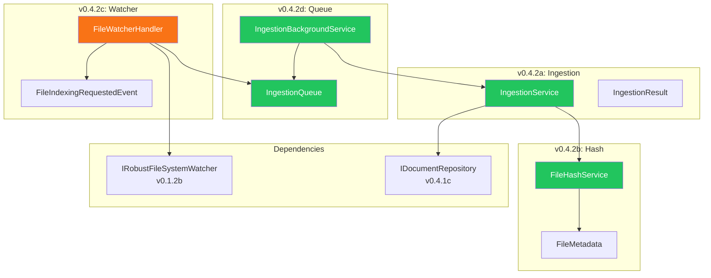
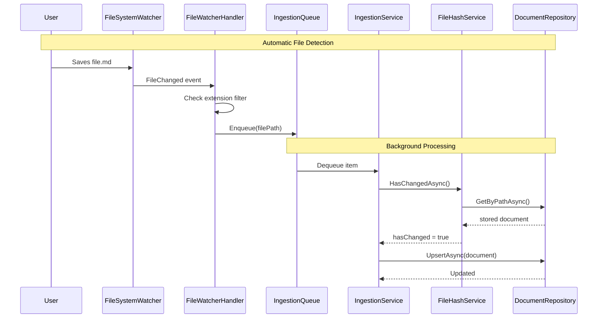

# LCS-DES-042: Design Specification Index — The Watcher

## Document Control

| Field | Value |
| :--- | :--- |
| **Document ID** | LCS-DES-042-INDEX |
| **Feature ID** | RAG-042 |
| **Feature Name** | The Watcher (File Ingestion Pipeline) |
| **Target Version** | v0.4.2 |
| **Module Scope** | Lexichord.Modules.RAG |
| **Swimlane** | Memory |
| **License Tier** | Core |
| **Feature Gate Key** | `FeatureFlags.RAG.Ingestion` |
| **Status** | Draft |
| **Last Updated** | 2026-01-27 |

---

## 1. Executive Summary

**v0.4.2** delivers **The Watcher** — an automatic file ingestion pipeline that detects new and modified files in the workspace for indexing. This release enables Lexichord to continuously monitor the user's workspace and maintain an up-to-date document index without manual intervention.

### 1.1 The Problem

Users need their documents automatically detected and indexed for semantic search. Manual indexing is tedious, error-prone, and breaks the writing flow. Without automatic change detection, users must remember to re-index modified files.

### 1.2 The Solution

Implement an event-driven ingestion pipeline that:

1. **Watches** for file system changes using `IRobustFileSystemWatcher`
2. **Detects** modifications using SHA-256 hash comparison
3. **Queues** files for processing to prevent API overwhelming
4. **Processes** files in the background without blocking the UI

### 1.3 Business Value

| Value | Description |
| :--- | :--- |
| **Automatic Sync** | File changes indexed automatically |
| **Efficient** | Hash-based skip of unchanged files |
| **Non-Blocking** | Background processing keeps UI responsive |
| **Scalable** | Throttled queue prevents API rate limiting |
| **Foundation** | Enables chunking (v0.4.3) and embedding (v0.4.4) |

---

## 2. Related Documents

### 2.1 Scope Breakdown Document

The detailed scope breakdown for v0.4.2, including all sub-parts, implementation checklists, user stories, and acceptance criteria:

| Document | Description |
| :--- | :--- |
| **[LCS-SBD-042](./LCS-SBD-042.md)** | Scope Breakdown — The Watcher |

### 2.2 Sub-Part Design Specifications

Each sub-part has its own detailed design specification following the LDS-01 template:

| Sub-Part | Document | Title | Description |
| :--- | :--- | :--- | :--- |
| v0.4.2a | **[LCS-DES-042a](./LCS-DES-042a.md)** | Ingestion Service Interface | Core ingestion abstractions |
| v0.4.2b | **[LCS-DES-042b](./LCS-DES-042b.md)** | Hash-Based Change Detection | SHA-256 file comparison |
| v0.4.2c | **[LCS-DES-042c](./LCS-DES-042c.md)** | File Watcher Integration | Event-driven file monitoring |
| v0.4.2d | **[LCS-DES-042d](./LCS-DES-042d.md)** | Ingestion Queue | Channel-based processing queue |

---

## 3. Architecture Overview

### 3.1 Component Diagram

### 3.2 Data Flow

---

## 4. Dependencies

### 4.1 Upstream Dependencies (Required)

| Interface | Source Version | Purpose |
| :--- | :--- | :--- |
| `IDocumentRepository` | v0.4.1c | Document storage |
| `IRobustFileSystemWatcher` | v0.1.2b | File system events |
| `IWorkspaceService` | v0.1.2a | Workspace path |
| `IMediator` | v0.0.7a | Event publishing |
| `IConfigurationService` | v0.0.3d | Configuration |

### 4.2 NuGet Packages

| Package | Version | Purpose |
| :--- | :--- | :--- |
| `System.Threading.Channels` | 9.0.x | Bounded queue |
| `System.IO.Hashing` | 9.0.x | SHA-256 |
| `MediatR` | 12.x | Event publishing |

### 4.3 Downstream Consumers (Future)

| Version | Feature | Consumes |
| :--- | :--- | :--- |
| v0.4.3 | Chunking Strategies | `IIngestionService`, ingestion events |
| v0.4.4 | Vector Generation | Document change notifications |
| v0.4.7 | Index Manager | `IIngestionQueue` status |

---

## 5. License Gating Strategy

The File Ingestion Pipeline is **Core** functionality using no license gating.

### 5.1 Behavior by License Tier

| Tier | File Watching | Change Detection | Queue Processing |
| :--- | :--- | :--- | :--- |
| Core | Yes | Yes | Yes |
| Writer Pro | Yes | Yes | Yes |
| Teams | Yes | Yes | Yes |
| Enterprise | Yes | Yes | Yes |

---

## 6. Key Interfaces Summary

| Interface | Defined In | Purpose |
| :--- | :--- | :--- |
| `IIngestionService` | v0.4.2a | File ingestion operations |
| `IFileHashService` | v0.4.2b | Hash computation and comparison |
| `IIngestionQueue` | v0.4.2d | Queue management |

| Record/DTO | Defined In | Purpose |
| :--- | :--- | :--- |
| `IngestionResult` | v0.4.2a | Operation result |
| `IngestionProgressEventArgs` | v0.4.2a | Progress reporting |
| `FileMetadata` | v0.4.2b | File size and timestamp |
| `FileIndexingRequestedEvent` | v0.4.2c | File change notification |
| `IngestionQueueItem` | v0.4.2d | Queue item |

---

## 7. Implementation Checklist Summary

| Sub-Part | Tasks | Est. Hours |
| :--- | :--- | :--- |
| v0.4.2a | Ingestion Service Interface | 3.5 |
| v0.4.2b | Hash-Based Change Detection | 6.5 |
| v0.4.2c | File Watcher Integration | 6.5 |
| v0.4.2d | Ingestion Queue | 9 |
| Integration | Orchestration, Tests, DI | 5.5 |
| **Total** | | **31 hours** |

See [LCS-SBD-042](./LCS-SBD-042.md) Section 4 for the detailed task breakdown.

---

## 8. Success Criteria Summary

| Category | Criterion | Target |
| :--- | :--- | :--- |
| **Latency** | File change detection | < 1s |
| **Performance** | Hash computation (1MB) | < 50ms |
| **Performance** | Queue enqueue | < 1ms |
| **Efficiency** | Debounce reduction | 90% |
| **Startup** | Background service | < 100ms |
| **Shutdown** | Graceful completion | < 5s |

See [LCS-SBD-042](./LCS-SBD-042.md) Section 9 for full success metrics.

---

## 9. Test Coverage Summary

| Sub-Part | Unit Tests | Integration Tests |
| :--- | :--- | :--- |
| v0.4.2a | Interface contracts | - |
| v0.4.2b | Hash computation, change detection | File system tests |
| v0.4.2c | Event filtering, debouncing | Watcher integration |
| v0.4.2d | Queue operations, priorities | Background service |

See individual design specs for detailed test scenarios.

---

## 10. What This Enables

| Version | Feature | Uses From v0.4.2 |
| :--- | :--- | :--- |
| v0.4.3 | Chunking Strategies | Ingested documents for chunking |
| v0.4.4 | Vector Generation | Change detection for re-embedding |
| v0.4.5 | Semantic Search | Indexed documents |
| v0.4.7 | Index Manager | Queue status, progress events |

---

## Document History

| Version | Date | Author | Changes |
| :--- | :--- | :--- | :--- |
| 1.0 | 2026-01-27 | Lead Architect | Initial draft |
