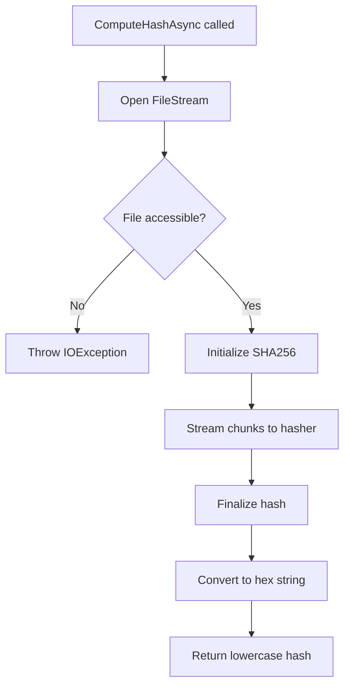

# LCS-DES-042b: Design Specification — Hash-Based Change Detection

## 1. Metadata & Categorization

| Field | Value | Description |
| :--- | :--- | :--- |
| **Feature ID** | `RAG-042b` | Sub-part of RAG-042 |
| **Feature Name** | `Hash-Based Change Detection` | SHA-256 file comparison |
| **Target Version** | `v0.4.2b` | Second sub-part of v0.4.2 |
| **Module Scope** | `Lexichord.Modules.RAG` | RAG module implementation |
| **Swimlane** | `Memory` | Part of RAG vertical |
| **License Tier** | `Core` | Infrastructure for all tiers |
| **Feature Gate Key** | `FeatureFlags.RAG.Ingestion` | Shared with parent feature |
| **Author** | Lead Architect | |
| **Status** | `Draft` | |
| **Last Updated** | `2026-01-27` | |
| **Parent Document** | [LCS-DES-042-INDEX](./LCS-DES-042-INDEX.md) | |
| **Scope Breakdown** | [LCS-SBD-042 §3.2](./LCS-SBD-042.md#32-v042b-hash-based-change-detection) | |

---

## 2. Executive Summary

### 2.1 The Requirement

The ingestion pipeline must efficiently detect file modifications to avoid re-processing unchanged files. Re-indexing unchanged content wastes compute resources and API quota (for embedding generation).

> **Problem:** Without change detection, every file save triggers full re-indexing, even when content is unchanged.

### 2.2 The Proposed Solution

Implement `FileHashService` using SHA-256 with a tiered detection strategy:

1. **Quick check:** Compare file size (different = changed)
2. **Quick check:** Compare last modified timestamp (same = unchanged)
3. **Full check:** Compute SHA-256 hash (different = changed)

This minimizes hash computation for obvious cases while ensuring accurate detection.

---

## 3. Architecture & Modular Strategy

### 3.1 Dependencies

#### 3.1.1 Upstream Dependencies

| Component | Source | Purpose |
| :--- | :--- | :--- |
| `IDocumentRepository` | v0.4.1c | Retrieve stored hashes |
| `Document` | v0.4.1c | Stored file metadata |

#### 3.1.2 NuGet Packages

| Package | Version | Purpose |
| :--- | :--- | :--- |
| `System.IO.Hashing` | 9.0.x | SHA-256 streaming computation |

### 3.2 Licensing Behavior

**No license gating.** This is core infrastructure available to all users.

---

## 4. Data Contract (The API)

### 4.1 IFileHashService Interface

```csharp
namespace Lexichord.Abstractions.Contracts;

/// <summary>
/// Service for computing and comparing file content hashes.
/// Uses SHA-256 for cryptographic integrity verification.
/// </summary>
/// <remarks>
/// <para>The service uses a tiered detection strategy to minimize computation:
/// 1. Quick size check (different size = definitely changed)
/// 2. Quick timestamp check (same timestamp = assume unchanged)
/// 3. Full hash computation (compare SHA-256 for definitive answer)
/// </para>
/// <para>Hash computation uses streaming to support large files without
/// loading entire content into memory.</para>
/// </remarks>
public interface IFileHashService
{
    /// <summary>
    /// Computes the SHA-256 hash of a file's content.
    /// </summary>
    /// <param name="filePath">Absolute path to the file.</param>
    /// <param name="ct">Cancellation token.</param>
    /// <returns>Lowercase hex-encoded SHA-256 hash (64 characters).</returns>
    /// <exception cref="FileNotFoundException">If file does not exist.</exception>
    /// <exception cref="IOException">If file cannot be read.</exception>
    Task<string> ComputeHashAsync(string filePath, CancellationToken ct = default);

    /// <summary>
    /// Determines if a file has changed since it was last indexed.
    /// Uses tiered detection: size → timestamp → hash.
    /// </summary>
    /// <param name="filePath">Path to the file to check.</param>
    /// <param name="storedHash">Previously stored SHA-256 hash.</param>
    /// <param name="storedSize">Previously stored file size in bytes.</param>
    /// <param name="storedModified">Previously stored modification timestamp.</param>
    /// <param name="ct">Cancellation token.</param>
    /// <returns>True if file content has changed, false if unchanged.</returns>
    Task<bool> HasChangedAsync(
        string filePath,
        string storedHash,
        long storedSize,
        DateTimeOffset? storedModified,
        CancellationToken ct = default);

    /// <summary>
    /// Gets file metadata without computing hash.
    /// </summary>
    /// <param name="filePath">Path to the file.</param>
    /// <returns>File metadata including size and modification time.</returns>
    FileMetadata GetMetadata(string filePath);

    /// <summary>
    /// Computes hash and returns metadata in a single operation.
    /// </summary>
    /// <param name="filePath">Path to the file.</param>
    /// <param name="ct">Cancellation token.</param>
    /// <returns>Metadata with computed hash.</returns>
    Task<FileMetadataWithHash> GetMetadataWithHashAsync(
        string filePath,
        CancellationToken ct = default);
}
```

### 4.2 FileMetadata Record

```csharp
namespace Lexichord.Abstractions.Contracts;

/// <summary>
/// Metadata about a file for change detection.
/// </summary>
public record FileMetadata
{
    /// <summary>
    /// Whether the file exists on disk.
    /// </summary>
    public bool Exists { get; init; }

    /// <summary>
    /// File size in bytes. Zero if file doesn't exist.
    /// </summary>
    public long Size { get; init; }

    /// <summary>
    /// Last modification timestamp in UTC.
    /// Default value if file doesn't exist.
    /// </summary>
    public DateTimeOffset LastModified { get; init; }

    /// <summary>
    /// Creates metadata for a non-existent file.
    /// </summary>
    public static FileMetadata NotFound => new()
    {
        Exists = false,
        Size = 0,
        LastModified = default
    };
}

/// <summary>
/// File metadata with computed hash.
/// </summary>
public record FileMetadataWithHash : FileMetadata
{
    /// <summary>
    /// SHA-256 hash of file content (lowercase hex, 64 chars).
    /// Null if file doesn't exist.
    /// </summary>
    public string? Hash { get; init; }
}
```

---

## 5. Implementation Logic

### 5.1 Change Detection Decision Tree

```text
START: "Has file changed since last index?"
│
├── Get current file metadata
│   └── File doesn't exist?
│       └── YES → Return TRUE (deleted = changed)
│
├── Compare file size
│   └── Size different?
│       └── YES → Return TRUE (definitely changed, skip hash)
│
├── Compare last modified timestamp
│   └── Timestamp unchanged (within 1 second)?
│       └── YES → Return FALSE (assume unchanged, skip hash)
│
├── Compute SHA-256 hash of current file
│
├── Compare with stored hash
│   ├── Different → Return TRUE (content changed)
│   └── Same → Return FALSE (timestamp changed but content same)
│
└── END
```

### 5.2 Hash Computation Flow



---

## 6. Data Persistence

**None.** This service computes hashes; storage is handled by `IDocumentRepository` (v0.4.1c).

---

## 7. UI/UX Specifications

**None.** This is a backend service with no direct UI.

---

## 8. Observability & Logging

| Level | Source | Message |
| :--- | :--- | :--- |
| Debug | FileHashService | `Computing hash for: {FilePath} ({FileSize} bytes)` |
| Debug | FileHashService | `Hash computed in {ElapsedMs}ms: {Hash}` |
| Debug | FileHashService | `Quick check: size changed {OldSize} → {NewSize}` |
| Debug | FileHashService | `Quick check: timestamp unchanged, skipping hash` |
| Info | FileHashService | `File changed (hash mismatch): {FilePath}` |
| Debug | FileHashService | `File unchanged (hash match): {FilePath}` |
| Warning | FileHashService | `File no longer exists: {FilePath}` |

---

## 9. Security & Safety

| Risk | Level | Mitigation |
| :--- | :--- | :--- |
| Hash collision | Very Low | SHA-256 has no known practical collisions |
| Large file memory | Low | Streaming computation, no full load |
| Locked file access | Medium | Retry with backoff, share read access |

---

## 10. Acceptance Criteria

### 10.1 Functional Criteria

| # | Given | When | Then |
| :--- | :--- | :--- | :--- |
| 1 | Valid file | `ComputeHashAsync` called | Returns 64-char hex hash |
| 2 | Same content | Hash computed twice | Same hash returned |
| 3 | Different content | Hash computed for each | Different hashes |
| 4 | Unchanged file | `HasChangedAsync` with same hash | Returns false |
| 5 | Changed file | `HasChangedAsync` with different content | Returns true |
| 6 | Different size | `HasChangedAsync` called | Returns true (skip hash) |
| 7 | Same timestamp | `HasChangedAsync` called | Returns false (skip hash) |
| 8 | Non-existent file | `HasChangedAsync` called | Returns true |

### 10.2 Performance Criteria

| # | Given | When | Then |
| :--- | :--- | :--- | :--- |
| 9 | 1MB file | Hash computed | < 50ms |
| 10 | 10MB file | Hash computed | < 200ms |
| 11 | Unchanged file (same timestamp) | `HasChangedAsync` | < 1ms (no hash) |

---

## 11. Test Scenarios

### 11.1 Unit Tests

```csharp
[Trait("Category", "Unit")]
[Trait("Feature", "v0.4.2b")]
public class FileHashServiceTests
{
    private readonly FileHashService _sut;

    public FileHashServiceTests()
    {
        _sut = new FileHashService(NullLogger<FileHashService>.Instance);
    }

    [Fact]
    public async Task ComputeHashAsync_ValidFile_ReturnsSha256Hex()
    {
        // Arrange
        var tempFile = Path.GetTempFileName();
        await File.WriteAllTextAsync(tempFile, "Hello, World!");

        try
        {
            // Act
            var hash = await _sut.ComputeHashAsync(tempFile);

            // Assert
            hash.Should().NotBeNullOrEmpty();
            hash.Should().HaveLength(64);
            hash.Should().MatchRegex("^[a-f0-9]{64}$");
        }
        finally
        {
            File.Delete(tempFile);
        }
    }

    [Fact]
    public async Task ComputeHashAsync_SameContent_ReturnsSameHash()
    {
        // Arrange
        var file1 = Path.GetTempFileName();
        var file2 = Path.GetTempFileName();
        var content = "Identical content for testing";

        await File.WriteAllTextAsync(file1, content);
        await File.WriteAllTextAsync(file2, content);

        try
        {
            // Act
            var hash1 = await _sut.ComputeHashAsync(file1);
            var hash2 = await _sut.ComputeHashAsync(file2);

            // Assert
            hash1.Should().Be(hash2);
        }
        finally
        {
            File.Delete(file1);
            File.Delete(file2);
        }
    }

    [Fact]
    public async Task ComputeHashAsync_DifferentContent_ReturnsDifferentHash()
    {
        // Arrange
        var file1 = Path.GetTempFileName();
        var file2 = Path.GetTempFileName();

        await File.WriteAllTextAsync(file1, "Content A");
        await File.WriteAllTextAsync(file2, "Content B");

        try
        {
            // Act
            var hash1 = await _sut.ComputeHashAsync(file1);
            var hash2 = await _sut.ComputeHashAsync(file2);

            // Assert
            hash1.Should().NotBe(hash2);
        }
        finally
        {
            File.Delete(file1);
            File.Delete(file2);
        }
    }

    [Fact]
    public async Task HasChangedAsync_SameHashSameSize_ReturnsFalse()
    {
        // Arrange
        var tempFile = Path.GetTempFileName();
        var content = "Test content";
        await File.WriteAllTextAsync(tempFile, content);

        var hash = await _sut.ComputeHashAsync(tempFile);
        var metadata = _sut.GetMetadata(tempFile);

        try
        {
            // Act
            var hasChanged = await _sut.HasChangedAsync(
                tempFile,
                hash,
                metadata.Size,
                metadata.LastModified);

            // Assert
            hasChanged.Should().BeFalse();
        }
        finally
        {
            File.Delete(tempFile);
        }
    }

    [Fact]
    public async Task HasChangedAsync_DifferentSize_ReturnsTrue_SkipsHash()
    {
        // Arrange
        var tempFile = Path.GetTempFileName();
        await File.WriteAllTextAsync(tempFile, "New longer content");

        try
        {
            // Act - stored size is smaller than current
            var hasChanged = await _sut.HasChangedAsync(
                tempFile,
                "oldhash",
                5, // smaller than actual
                DateTimeOffset.UtcNow.AddDays(-1));

            // Assert
            hasChanged.Should().BeTrue();
        }
        finally
        {
            File.Delete(tempFile);
        }
    }

    [Fact]
    public async Task HasChangedAsync_SameTimestamp_ReturnsFalse_SkipsHash()
    {
        // Arrange
        var tempFile = Path.GetTempFileName();
        await File.WriteAllTextAsync(tempFile, "Content");
        var metadata = _sut.GetMetadata(tempFile);

        try
        {
            // Act - same size, same timestamp
            var hasChanged = await _sut.HasChangedAsync(
                tempFile,
                "anyhash", // won't be checked
                metadata.Size,
                metadata.LastModified);

            // Assert
            hasChanged.Should().BeFalse();
        }
        finally
        {
            File.Delete(tempFile);
        }
    }

    [Fact]
    public async Task HasChangedAsync_DeletedFile_ReturnsTrue()
    {
        // Arrange
        var nonExistentPath = Path.Combine(Path.GetTempPath(), Guid.NewGuid().ToString());

        // Act
        var hasChanged = await _sut.HasChangedAsync(
            nonExistentPath,
            "somehash",
            1000,
            DateTimeOffset.UtcNow.AddDays(-1));

        // Assert
        hasChanged.Should().BeTrue();
    }

    [Fact]
    public void GetMetadata_ExistingFile_ReturnsCorrectData()
    {
        // Arrange
        var tempFile = Path.GetTempFileName();
        File.WriteAllText(tempFile, "Test");

        try
        {
            // Act
            var metadata = _sut.GetMetadata(tempFile);

            // Assert
            metadata.Exists.Should().BeTrue();
            metadata.Size.Should().Be(4);
            metadata.LastModified.Should().BeCloseTo(
                DateTimeOffset.UtcNow,
                TimeSpan.FromSeconds(5));
        }
        finally
        {
            File.Delete(tempFile);
        }
    }

    [Fact]
    public void GetMetadata_NonExistentFile_ReturnsNotFound()
    {
        // Arrange
        var nonExistentPath = Path.Combine(Path.GetTempPath(), Guid.NewGuid().ToString());

        // Act
        var metadata = _sut.GetMetadata(nonExistentPath);

        // Assert
        metadata.Exists.Should().BeFalse();
        metadata.Size.Should().Be(0);
    }
}
```

---

## 12. Code Example

### 12.1 FileHashService Implementation

```csharp
using System.Security.Cryptography;

namespace Lexichord.Modules.RAG.Services;

/// <summary>
/// Service for computing and comparing file hashes using SHA-256.
/// Uses streaming computation for memory efficiency with large files.
/// </summary>
public sealed class FileHashService : IFileHashService
{
    private readonly ILogger<FileHashService> _logger;

    // Buffer size for streaming hash computation (80KB)
    private const int BufferSize = 81920;

    // Timestamp tolerance in seconds for "same timestamp" check
    private const double TimestampToleranceSeconds = 1.0;

    public FileHashService(ILogger<FileHashService> logger)
    {
        _logger = logger;
    }

    /// <inheritdoc />
    public async Task<string> ComputeHashAsync(string filePath, CancellationToken ct = default)
    {
        var stopwatch = Stopwatch.StartNew();
        var fileInfo = new FileInfo(filePath);

        _logger.LogDebug(
            "Computing hash for: {FilePath} ({FileSize} bytes)",
            filePath, fileInfo.Length);

        await using var stream = new FileStream(
            filePath,
            FileMode.Open,
            FileAccess.Read,
            FileShare.Read,
            bufferSize: BufferSize,
            useAsync: true);

        var hashBytes = await SHA256.HashDataAsync(stream, ct);
        var hash = Convert.ToHexString(hashBytes).ToLowerInvariant();

        stopwatch.Stop();
        _logger.LogDebug(
            "Hash computed in {ElapsedMs}ms: {Hash}",
            stopwatch.ElapsedMilliseconds, hash);

        return hash;
    }

    /// <inheritdoc />
    public async Task<bool> HasChangedAsync(
        string filePath,
        string storedHash,
        long storedSize,
        DateTimeOffset? storedModified,
        CancellationToken ct = default)
    {
        var metadata = GetMetadata(filePath);

        // File deleted = changed
        if (!metadata.Exists)
        {
            _logger.LogWarning("File no longer exists: {FilePath}", filePath);
            return true;
        }

        // Quick check 1: Size changed = definitely changed
        if (metadata.Size != storedSize)
        {
            _logger.LogDebug(
                "Quick check: size changed {OldSize} → {NewSize}",
                storedSize, metadata.Size);
            return true;
        }

        // Quick check 2: Timestamp unchanged = assume unchanged
        if (storedModified.HasValue)
        {
            var timeDiff = Math.Abs((metadata.LastModified - storedModified.Value).TotalSeconds);
            if (timeDiff < TimestampToleranceSeconds)
            {
                _logger.LogDebug(
                    "Quick check: timestamp unchanged, skipping hash");
                return false;
            }
        }

        // Full check: Compute and compare hash
        var currentHash = await ComputeHashAsync(filePath, ct);

        if (!string.Equals(currentHash, storedHash, StringComparison.OrdinalIgnoreCase))
        {
            _logger.LogInformation(
                "File changed (hash mismatch): {FilePath}",
                filePath);
            return true;
        }

        _logger.LogDebug(
            "File unchanged (hash match): {FilePath}",
            filePath);
        return false;
    }

    /// <inheritdoc />
    public FileMetadata GetMetadata(string filePath)
    {
        var fileInfo = new FileInfo(filePath);

        if (!fileInfo.Exists)
        {
            return FileMetadata.NotFound;
        }

        return new FileMetadata
        {
            Exists = true,
            Size = fileInfo.Length,
            LastModified = new DateTimeOffset(fileInfo.LastWriteTimeUtc, TimeSpan.Zero)
        };
    }

    /// <inheritdoc />
    public async Task<FileMetadataWithHash> GetMetadataWithHashAsync(
        string filePath,
        CancellationToken ct = default)
    {
        var metadata = GetMetadata(filePath);

        if (!metadata.Exists)
        {
            return new FileMetadataWithHash
            {
                Exists = false,
                Size = 0,
                LastModified = default,
                Hash = null
            };
        }

        var hash = await ComputeHashAsync(filePath, ct);

        return new FileMetadataWithHash
        {
            Exists = true,
            Size = metadata.Size,
            LastModified = metadata.LastModified,
            Hash = hash
        };
    }
}
```

---

## 13. DI Registration

```csharp
// In RAGModule.cs
services.AddSingleton<IFileHashService, FileHashService>();
```

---

## 14. Deliverable Checklist

| # | Deliverable | Status |
| :--- | :--- | :--- |
| 1 | `IFileHashService` interface | [ ] |
| 2 | `FileMetadata` record | [ ] |
| 3 | `FileMetadataWithHash` record | [ ] |
| 4 | `FileHashService` implementation | [ ] |
| 5 | Unit tests for hash computation | [ ] |
| 6 | Unit tests for change detection | [ ] |

---

## 15. Verification Commands

```bash
# ═══════════════════════════════════════════════════════════════════════════
# v0.4.2b Verification Commands
# ═══════════════════════════════════════════════════════════════════════════

# 1. Build RAG module
dotnet build src/Lexichord.Modules.RAG

# 2. Run unit tests
dotnet test --filter "Category=Unit&FullyQualifiedName~FileHash"

# 3. Verify hash computation works
# (Integration test verifying SHA-256 output matches expected)
```

---

## 16. Changelog Entry

```markdown
### v0.4.2b - Hash-Based Change Detection

- `IFileHashService` interface for hash operations
- `FileHashService` implementation using SHA-256
- Tiered detection: size → timestamp → hash
- Streaming computation for large file support
- `FileMetadata` and `FileMetadataWithHash` records
```

---

## 17. Deferred Features

| Feature | Deferred To | Reason |
| :--- | :--- | :--- |
| Incremental hashing | v0.5.x | Optimization for very large files |
| Hash caching | v0.4.8 | Performance optimization phase |

---

## Document History

| Version | Date | Author | Changes |
| :--- | :--- | :--- | :--- |
| 1.0 | 2026-01-27 | Lead Architect | Initial draft |
