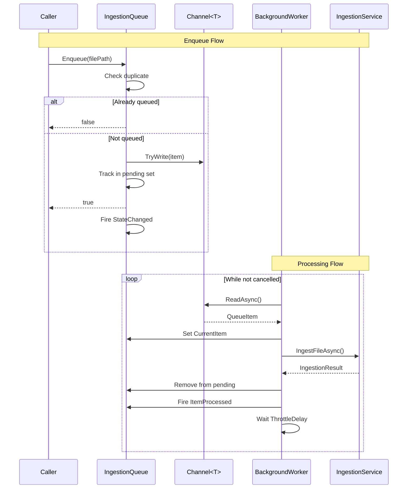

# LCS-DES-042d: Design Specification — Ingestion Queue

## 1. Metadata & Categorization

| Field | Value | Description |
| :--- | :--- | :--- |
| **Feature ID** | `RAG-042d` | Sub-part of RAG-042 |
| **Feature Name** | `Ingestion Queue` | Channel-based processing queue |
| **Target Version** | `v0.4.2d` | Fourth sub-part of v0.4.2 |
| **Module Scope** | `Lexichord.Modules.RAG` | RAG module implementation |
| **Swimlane** | `Memory` | Part of RAG vertical |
| **License Tier** | `Core` | Infrastructure for all tiers |
| **Feature Gate Key** | `FeatureFlags.RAG.Ingestion` | Shared with parent feature |
| **Author** | Lead Architect | |
| **Status** | `Draft` | |
| **Last Updated** | `2026-01-27` | |
| **Parent Document** | [LCS-DES-042-INDEX](./LCS-DES-042-INDEX.md) | |
| **Scope Breakdown** | [LCS-SBD-042 §3.4](./LCS-SBD-042.md#34-v042d-ingestion-queue) | |

---

## 2. Executive Summary

### 2.1 The Requirement

The file watcher may detect many file changes rapidly. Processing them all immediately would overwhelm the embedding API (rate limits) and impact UI responsiveness. Files need to be queued and processed sequentially with throttling.

> **Problem:** Burst file changes (e.g., git checkout) could trigger hundreds of simultaneous embedding API calls, causing rate limiting and high memory usage.

### 2.2 The Proposed Solution

Implement `IngestionQueue` using `System.Threading.Channels`:

1. Bounded queue with configurable maximum size
2. Duplicate detection to prevent re-queuing same file
3. Priority support (high/normal/low)
4. Background `HostedService` for queue consumption
5. Throttle delay between items to respect API rate limits
6. Graceful shutdown with pending item completion

---

## 3. Architecture & Modular Strategy

### 3.1 Dependencies

#### 3.1.1 Upstream Dependencies

| Component | Source | Purpose |
| :--- | :--- | :--- |
| `IIngestionService` | v0.4.2a | Process dequeued files |
| `IDocumentRepository` | v0.4.1c | Update document status |

#### 3.1.2 NuGet Packages

| Package | Version | Purpose |
| :--- | :--- | :--- |
| `System.Threading.Channels` | 9.0.x | High-performance bounded queue |

### 3.2 Licensing Behavior

**No license gating.** Queue is core infrastructure.

---

## 4. Data Contract (The API)

### 4.1 IIngestionQueue Interface

```csharp
namespace Lexichord.Abstractions.Contracts;

/// <summary>
/// Queue for managing file ingestion requests.
/// Provides bounded, priority-based queueing with duplicate detection.
/// </summary>
public interface IIngestionQueue
{
    /// <summary>
    /// Enqueues a file for ingestion.
    /// </summary>
    /// <param name="filePath">Absolute path to the file.</param>
    /// <param name="priority">Processing priority.</param>
    /// <returns>True if enqueued, false if already pending or queue full.</returns>
    bool Enqueue(string filePath, IngestionPriority priority = IngestionPriority.Normal);

    /// <summary>
    /// Removes a file from the queue if not yet processed.
    /// </summary>
    /// <param name="filePath">Path to remove.</param>
    /// <returns>True if found and removed.</returns>
    bool TryRemove(string filePath);

    /// <summary>
    /// Checks if a file is currently queued.
    /// </summary>
    /// <param name="filePath">Path to check.</param>
    /// <returns>True if pending in queue.</returns>
    bool IsQueued(string filePath);

    /// <summary>
    /// Gets the current number of pending items.
    /// </summary>
    int Count { get; }

    /// <summary>
    /// Gets whether the queue is currently processing items.
    /// </summary>
    bool IsProcessing { get; }

    /// <summary>
    /// Gets the path currently being processed, if any.
    /// </summary>
    string? CurrentItem { get; }

    /// <summary>
    /// Fires when an item completes processing.
    /// </summary>
    event EventHandler<IngestionQueueEventArgs> ItemProcessed;

    /// <summary>
    /// Fires when queue state changes (started/stopped/depth change).
    /// </summary>
    event EventHandler<QueueStateChangedEventArgs> StateChanged;
}

/// <summary>
/// Priority levels for ingestion queue items.
/// </summary>
public enum IngestionPriority
{
    /// <summary>Low priority - background indexing, git checkouts.</summary>
    Low = 0,

    /// <summary>Normal priority - file watcher events.</summary>
    Normal = 1,

    /// <summary>High priority - user-initiated indexing.</summary>
    High = 2
}

/// <summary>
/// Event args for item processed notification.
/// </summary>
public class IngestionQueueEventArgs : EventArgs
{
    /// <summary>Path of the processed file.</summary>
    public required string FilePath { get; init; }

    /// <summary>Whether processing succeeded.</summary>
    public bool Success { get; init; }

    /// <summary>Processing duration.</summary>
    public TimeSpan Duration { get; init; }

    /// <summary>Error message if failed.</summary>
    public string? ErrorMessage { get; init; }

    /// <summary>Remaining items in queue.</summary>
    public int RemainingCount { get; init; }
}

/// <summary>
/// Event args for queue state changes.
/// </summary>
public class QueueStateChangedEventArgs : EventArgs
{
    /// <summary>New queue depth.</summary>
    public int Count { get; init; }

    /// <summary>Whether processing is active.</summary>
    public bool IsProcessing { get; init; }

    /// <summary>Type of state change.</summary>
    public QueueStateChange ChangeType { get; init; }
}

/// <summary>
/// Types of queue state changes.
/// </summary>
public enum QueueStateChange
{
    /// <summary>Item added to queue.</summary>
    ItemEnqueued,

    /// <summary>Item removed from queue.</summary>
    ItemDequeued,

    /// <summary>Processing started.</summary>
    ProcessingStarted,

    /// <summary>Processing stopped.</summary>
    ProcessingStopped,

    /// <summary>Queue cleared.</summary>
    Cleared
}
```

### 4.2 IngestionQueueOptions

```csharp
namespace Lexichord.Modules.RAG.Configuration;

/// <summary>
/// Configuration options for the ingestion queue.
/// </summary>
public record IngestionQueueOptions
{
    /// <summary>
    /// Maximum number of items in the queue.
    /// Oldest items dropped when full.
    /// Default: 1000
    /// </summary>
    public int MaxQueueSize { get; init; } = 1000;

    /// <summary>
    /// Maximum concurrent processing operations.
    /// Default: 2
    /// </summary>
    public int MaxConcurrency { get; init; } = 2;

    /// <summary>
    /// Delay between item processing in milliseconds.
    /// Helps with API rate limiting.
    /// Default: 500ms
    /// </summary>
    public int ThrottleDelayMs { get; init; } = 500;

    /// <summary>
    /// Timeout per item processing in milliseconds.
    /// Default: 60000 (1 minute)
    /// </summary>
    public int ProcessingTimeoutMs { get; init; } = 60000;

    /// <summary>
    /// Maximum time to wait for pending items during shutdown.
    /// Default: 5000ms
    /// </summary>
    public int ShutdownTimeoutMs { get; init; } = 5000;
}
```

---

## 5. Implementation Logic

### 5.1 Queue Processing Flow



### 5.2 Priority Queue Strategy

```text
PRIORITY IMPLEMENTATION:
│
├── Use multiple channels (one per priority level)
│   ├── High priority channel
│   ├── Normal priority channel
│   └── Low priority channel
│
├── Worker reads in priority order:
│   1. Try read from High channel (non-blocking)
│   2. If empty, try read from Normal channel
│   3. If empty, try read from Low channel
│   4. If all empty, await on combined reader
│
└── Result: High priority items always processed first
```

### 5.3 Graceful Shutdown

```text
SHUTDOWN SEQUENCE:
│
├── StopAsync() called by host
│
├── Signal cancellation to worker
│
├── Complete all channel writers (no new items)
│
├── Wait up to ShutdownTimeoutMs for:
│   ├── Current item to finish processing
│   └── Pending high-priority items to complete
│
├── If timeout:
│   ├── Log warning with remaining item count
│   └── Items remain in pending state (not lost if persisted)
│
└── Dispose resources
```

---

## 6. Data Persistence

**Memory only.** Queue items are not persisted. On application restart, pending items are lost. Persistence to disk is a v0.4.8 enhancement.

---

## 7. UI/UX Specifications

**None.** Queue status UI will be added in v0.4.7 (Index Manager).

---

## 8. Observability & Logging

| Level | Source | Message |
| :--- | :--- | :--- |
| Info | IngestionQueue | `Enqueued: {FilePath} (Priority: {Priority})` |
| Debug | IngestionQueue | `Queue depth: {Count}` |
| Warning | IngestionQueue | `Duplicate skipped: {FilePath}` |
| Warning | IngestionQueue | `Queue full, dropping oldest` |
| Info | IngestionBackgroundService | `Background service started` |
| Debug | IngestionBackgroundService | `Processing: {FilePath}` |
| Info | IngestionBackgroundService | `Completed: {FilePath} in {Duration}ms` |
| Warning | IngestionBackgroundService | `Failed: {FilePath} - {Error}` |
| Warning | IngestionBackgroundService | `Processing timeout: {FilePath}` |
| Info | IngestionBackgroundService | `Shutting down, {Count} items pending` |
| Info | IngestionBackgroundService | `Shutdown complete` |

---

## 9. Security & Safety

| Risk | Level | Mitigation |
| :--- | :--- | :--- |
| Memory exhaustion | Medium | Bounded queue with MaxQueueSize |
| Deadlock | Low | Async throughout, timeout on processing |
| Item loss on crash | Medium | Deferred to v0.4.8 (persistence) |

---

## 10. Acceptance Criteria

### 10.1 Functional Criteria

| # | Given | When | Then |
| :--- | :--- | :--- | :--- |
| 1 | Empty queue | `Enqueue` called | Returns true, Count = 1 |
| 2 | Item in queue | Same path enqueued | Returns false, Count unchanged |
| 3 | Item in queue | `TryRemove` called | Returns true, Count = 0 |
| 4 | Processing active | New item enqueued | Processed after current |
| 5 | High priority item | Enqueued after low | Processed before low |
| 6 | Shutdown requested | Items pending | Wait for current, complete gracefully |
| 7 | Queue at max | New item added | Oldest item dropped |

### 10.2 Performance Criteria

| # | Given | When | Then |
| :--- | :--- | :--- | :--- |
| 8 | Any queue state | `Enqueue` called | < 1ms |
| 9 | 1000 items | Bulk enqueue | < 100ms total |
| 10 | Throttle configured | Item processed | Wait ThrottleDelayMs before next |

---

## 11. Test Scenarios

### 11.1 Unit Tests

```csharp
[Trait("Category", "Unit")]
[Trait("Feature", "v0.4.2d")]
public class IngestionQueueTests
{
    private readonly IngestionQueue _sut;

    public IngestionQueueTests()
    {
        var options = Options.Create(new IngestionQueueOptions());
        _sut = new IngestionQueue(options, NullLogger<IngestionQueue>.Instance);
    }

    [Fact]
    public void Enqueue_NewPath_ReturnsTrue()
    {
        // Act
        var result = _sut.Enqueue("/path/to/file.md");

        // Assert
        result.Should().BeTrue();
        _sut.Count.Should().Be(1);
    }

    [Fact]
    public void Enqueue_DuplicatePath_ReturnsFalse()
    {
        // Arrange
        _sut.Enqueue("/path/to/file.md");

        // Act
        var result = _sut.Enqueue("/path/to/file.md");

        // Assert
        result.Should().BeFalse();
        _sut.Count.Should().Be(1);
    }

    [Fact]
    public void Enqueue_CaseInsensitive_DetectsDuplicate()
    {
        // Arrange
        _sut.Enqueue("/Path/To/File.md");

        // Act
        var result = _sut.Enqueue("/path/to/file.md");

        // Assert
        result.Should().BeFalse();
    }

    [Fact]
    public void TryRemove_ExistingPath_ReturnsTrue()
    {
        // Arrange
        _sut.Enqueue("/path/to/file.md");

        // Act
        var result = _sut.TryRemove("/path/to/file.md");

        // Assert
        result.Should().BeTrue();
        _sut.Count.Should().Be(0);
    }

    [Fact]
    public void TryRemove_NonExistentPath_ReturnsFalse()
    {
        // Act
        var result = _sut.TryRemove("/nonexistent.md");

        // Assert
        result.Should().BeFalse();
    }

    [Fact]
    public void IsQueued_AfterEnqueue_ReturnsTrue()
    {
        // Arrange
        _sut.Enqueue("/path/to/file.md");

        // Act & Assert
        _sut.IsQueued("/path/to/file.md").Should().BeTrue();
    }

    [Fact]
    public void IsQueued_AfterRemove_ReturnsFalse()
    {
        // Arrange
        _sut.Enqueue("/path/to/file.md");
        _sut.TryRemove("/path/to/file.md");

        // Act & Assert
        _sut.IsQueued("/path/to/file.md").Should().BeFalse();
    }

    [Fact]
    public void Enqueue_AtMaxCapacity_DropsOldest()
    {
        // Arrange
        var options = Options.Create(new IngestionQueueOptions { MaxQueueSize = 3 });
        var queue = new IngestionQueue(options, NullLogger<IngestionQueue>.Instance);

        queue.Enqueue("/file1.md", IngestionPriority.Low);
        queue.Enqueue("/file2.md", IngestionPriority.Normal);
        queue.Enqueue("/file3.md", IngestionPriority.High);

        // Act
        var result = queue.Enqueue("/file4.md");

        // Assert
        result.Should().BeTrue();
        queue.Count.Should().Be(3);
        queue.IsQueued("/file1.md").Should().BeFalse(); // Dropped
        queue.IsQueued("/file4.md").Should().BeTrue();
    }

    [Fact]
    public void ItemProcessed_Event_FiresOnCompletion()
    {
        // Arrange
        var eventFired = false;
        _sut.ItemProcessed += (_, args) => eventFired = true;

        // Implementation-specific test...
    }
}

[Trait("Category", "Unit")]
[Trait("Feature", "v0.4.2d")]
public class IngestionBackgroundServiceTests
{
    [Fact]
    public async Task StartAsync_BeginsProcessing()
    {
        // Arrange
        var queueMock = new Mock<IIngestionQueue>();
        var serviceMock = new Mock<IIngestionService>();

        var sut = new IngestionBackgroundService(
            queueMock.Object,
            serviceMock.Object,
            Options.Create(new IngestionQueueOptions()),
            NullLogger<IngestionBackgroundService>.Instance);

        // Act
        await sut.StartAsync(CancellationToken.None);

        // Assert
        // Verify processing started...
    }

    [Fact]
    public async Task StopAsync_WaitsForCurrentItem()
    {
        // Arrange & Act & Assert
        // Test graceful shutdown...
    }
}
```

---

## 12. Code Example

### 12.1 IngestionQueue Implementation

```csharp
using System.Collections.Concurrent;
using System.Threading.Channels;

namespace Lexichord.Modules.RAG.Services;

/// <summary>
/// Channel-based ingestion queue with priority support and duplicate detection.
/// </summary>
public sealed class IngestionQueue : IIngestionQueue, IDisposable
{
    private readonly ILogger<IngestionQueue> _logger;
    private readonly IngestionQueueOptions _options;

    // Three channels for priority levels
    private readonly Channel<QueueItem> _highChannel;
    private readonly Channel<QueueItem> _normalChannel;
    private readonly Channel<QueueItem> _lowChannel;

    // Track pending items for duplicate detection
    private readonly ConcurrentDictionary<string, QueueItem> _pending;

    private string? _currentItem;
    private bool _isProcessing;

    public IngestionQueue(
        IOptions<IngestionQueueOptions> options,
        ILogger<IngestionQueue> logger)
    {
        _options = options.Value;
        _logger = logger;
        _pending = new ConcurrentDictionary<string, QueueItem>(
            StringComparer.OrdinalIgnoreCase);

        var channelOptions = new BoundedChannelOptions(_options.MaxQueueSize / 3)
        {
            FullMode = BoundedChannelFullMode.DropOldest,
            SingleReader = true,
            SingleWriter = false
        };

        _highChannel = Channel.CreateBounded<QueueItem>(channelOptions);
        _normalChannel = Channel.CreateBounded<QueueItem>(channelOptions);
        _lowChannel = Channel.CreateBounded<QueueItem>(channelOptions);
    }

    public int Count => _pending.Count;
    public bool IsProcessing => _isProcessing;
    public string? CurrentItem => _currentItem;

    public event EventHandler<IngestionQueueEventArgs>? ItemProcessed;
    public event EventHandler<QueueStateChangedEventArgs>? StateChanged;

    public bool Enqueue(string filePath, IngestionPriority priority = IngestionPriority.Normal)
    {
        var item = new QueueItem
        {
            FilePath = filePath,
            Priority = priority,
            EnqueuedAt = DateTimeOffset.UtcNow
        };

        // Check for duplicate
        if (!_pending.TryAdd(filePath, item))
        {
            _logger.LogWarning("Duplicate skipped: {FilePath}", filePath);
            return false;
        }

        // Write to appropriate channel
        var channel = priority switch
        {
            IngestionPriority.High => _highChannel,
            IngestionPriority.Low => _lowChannel,
            _ => _normalChannel
        };

        if (!channel.Writer.TryWrite(item))
        {
            _pending.TryRemove(filePath, out _);
            _logger.LogWarning("Queue full, dropping oldest");
            return false;
        }

        _logger.LogInformation(
            "Enqueued: {FilePath} (Priority: {Priority})",
            filePath, priority);

        OnStateChanged(QueueStateChange.ItemEnqueued);
        return true;
    }

    public bool TryRemove(string filePath)
    {
        if (_pending.TryRemove(filePath, out _))
        {
            OnStateChanged(QueueStateChange.ItemDequeued);
            return true;
        }
        return false;
    }

    public bool IsQueued(string filePath)
    {
        return _pending.ContainsKey(filePath);
    }

    /// <summary>
    /// Reads items from the queue in priority order.
    /// Called by the background service.
    /// </summary>
    public async IAsyncEnumerable<QueueItem> ReadAllAsync(
        [EnumeratorCancellation] CancellationToken ct = default)
    {
        _isProcessing = true;
        OnStateChanged(QueueStateChange.ProcessingStarted);

        try
        {
            while (!ct.IsCancellationRequested)
            {
                // Try high priority first
                if (_highChannel.Reader.TryRead(out var highItem))
                {
                    yield return SetCurrentAndReturn(highItem);
                    continue;
                }

                // Then normal priority
                if (_normalChannel.Reader.TryRead(out var normalItem))
                {
                    yield return SetCurrentAndReturn(normalItem);
                    continue;
                }

                // Then low priority
                if (_lowChannel.Reader.TryRead(out var lowItem))
                {
                    yield return SetCurrentAndReturn(lowItem);
                    continue;
                }

                // All empty, wait for any channel
                try
                {
                    var item = await WaitForAnyChannelAsync(ct);
                    if (item is not null)
                    {
                        yield return SetCurrentAndReturn(item);
                    }
                }
                catch (OperationCanceledException)
                {
                    break;
                }
            }
        }
        finally
        {
            _currentItem = null;
            _isProcessing = false;
            OnStateChanged(QueueStateChange.ProcessingStopped);
        }
    }

    /// <summary>
    /// Called when an item finishes processing.
    /// </summary>
    public void MarkCompleted(QueueItem item, bool success, TimeSpan duration, string? error = null)
    {
        _pending.TryRemove(item.FilePath, out _);
        _currentItem = null;

        ItemProcessed?.Invoke(this, new IngestionQueueEventArgs
        {
            FilePath = item.FilePath,
            Success = success,
            Duration = duration,
            ErrorMessage = error,
            RemainingCount = _pending.Count
        });

        _logger.LogDebug("Queue depth: {Count}", _pending.Count);
    }

    private QueueItem SetCurrentAndReturn(QueueItem item)
    {
        _currentItem = item.FilePath;
        return item;
    }

    private async Task<QueueItem?> WaitForAnyChannelAsync(CancellationToken ct)
    {
        // Use Task.WhenAny to wait on all channels
        var highTask = _highChannel.Reader.WaitToReadAsync(ct).AsTask();
        var normalTask = _normalChannel.Reader.WaitToReadAsync(ct).AsTask();
        var lowTask = _lowChannel.Reader.WaitToReadAsync(ct).AsTask();

        await Task.WhenAny(highTask, normalTask, lowTask);

        // Check channels in priority order
        if (_highChannel.Reader.TryRead(out var high)) return high;
        if (_normalChannel.Reader.TryRead(out var normal)) return normal;
        if (_lowChannel.Reader.TryRead(out var low)) return low;

        return null;
    }

    private void OnStateChanged(QueueStateChange changeType)
    {
        StateChanged?.Invoke(this, new QueueStateChangedEventArgs
        {
            Count = _pending.Count,
            IsProcessing = _isProcessing,
            ChangeType = changeType
        });
    }

    public void Dispose()
    {
        _highChannel.Writer.Complete();
        _normalChannel.Writer.Complete();
        _lowChannel.Writer.Complete();
    }
}

public record QueueItem
{
    public required string FilePath { get; init; }
    public IngestionPriority Priority { get; init; }
    public DateTimeOffset EnqueuedAt { get; init; }
}
```

### 12.2 IngestionBackgroundService Implementation

```csharp
namespace Lexichord.Modules.RAG.Services;

/// <summary>
/// Background service that processes the ingestion queue.
/// </summary>
public sealed class IngestionBackgroundService : BackgroundService
{
    private readonly IIngestionQueue _queue;
    private readonly IIngestionService _ingestionService;
    private readonly IngestionQueueOptions _options;
    private readonly ILogger<IngestionBackgroundService> _logger;

    public IngestionBackgroundService(
        IIngestionQueue queue,
        IIngestionService ingestionService,
        IOptions<IngestionQueueOptions> options,
        ILogger<IngestionBackgroundService> logger)
    {
        _queue = (IngestionQueue)queue;
        _ingestionService = ingestionService;
        _options = options.Value;
        _logger = logger;
    }

    protected override async Task ExecuteAsync(CancellationToken stoppingToken)
    {
        _logger.LogInformation("Background service started");

        try
        {
            await foreach (var item in ((IngestionQueue)_queue).ReadAllAsync(stoppingToken))
            {
                await ProcessItemAsync(item, stoppingToken);

                // Throttle to respect API rate limits
                if (_options.ThrottleDelayMs > 0)
                {
                    await Task.Delay(_options.ThrottleDelayMs, stoppingToken);
                }
            }
        }
        catch (OperationCanceledException)
        {
            _logger.LogInformation("Shutting down, {Count} items pending", _queue.Count);
        }

        _logger.LogInformation("Shutdown complete");
    }

    private async Task ProcessItemAsync(QueueItem item, CancellationToken stoppingToken)
    {
        _logger.LogDebug("Processing: {FilePath}", item.FilePath);

        var stopwatch = Stopwatch.StartNew();

        try
        {
            using var cts = CancellationTokenSource.CreateLinkedTokenSource(stoppingToken);
            cts.CancelAfter(_options.ProcessingTimeoutMs);

            var result = await _ingestionService.IngestFileAsync(item.FilePath, cts.Token);

            stopwatch.Stop();

            if (result.Success)
            {
                _logger.LogInformation(
                    "Completed: {FilePath} in {Duration}ms",
                    item.FilePath, stopwatch.ElapsedMilliseconds);
            }
            else
            {
                _logger.LogWarning(
                    "Failed: {FilePath} - {Error}",
                    item.FilePath, result.ErrorMessage);
            }

            ((IngestionQueue)_queue).MarkCompleted(
                item,
                result.Success,
                stopwatch.Elapsed,
                result.ErrorMessage);
        }
        catch (OperationCanceledException) when (!stoppingToken.IsCancellationRequested)
        {
            stopwatch.Stop();
            _logger.LogWarning("Processing timeout: {FilePath}", item.FilePath);

            ((IngestionQueue)_queue).MarkCompleted(
                item,
                success: false,
                stopwatch.Elapsed,
                "Processing timeout");
        }
        catch (Exception ex)
        {
            stopwatch.Stop();
            _logger.LogError(ex, "Processing error: {FilePath}", item.FilePath);

            ((IngestionQueue)_queue).MarkCompleted(
                item,
                success: false,
                stopwatch.Elapsed,
                ex.Message);
        }
    }

    public override async Task StopAsync(CancellationToken cancellationToken)
    {
        _logger.LogInformation("Stop requested, waiting for current item...");
        await base.StopAsync(cancellationToken);
    }
}
```

---

## 13. DI Registration

```csharp
// In RAGModule.cs
services.Configure<IngestionQueueOptions>(
    configuration.GetSection("RAG:Queue"));

services.AddSingleton<IIngestionQueue, IngestionQueue>();
services.AddHostedService<IngestionBackgroundService>();
```

---

## 14. Deliverable Checklist

| # | Deliverable | Status |
| :--- | :--- | :--- |
| 1 | `IIngestionQueue` interface | [ ] |
| 2 | `IngestionPriority` enum | [ ] |
| 3 | `IngestionQueueEventArgs` class | [ ] |
| 4 | `QueueStateChangedEventArgs` class | [ ] |
| 5 | `IngestionQueueOptions` configuration | [ ] |
| 6 | `IngestionQueue` implementation | [ ] |
| 7 | `IngestionBackgroundService` hosted service | [ ] |
| 8 | Priority queue with channels | [ ] |
| 9 | Duplicate detection | [ ] |
| 10 | Graceful shutdown | [ ] |
| 11 | Unit tests for queue | [ ] |
| 12 | Unit tests for background service | [ ] |

---

## 15. Verification Commands

```bash
# ═══════════════════════════════════════════════════════════════════════════
# v0.4.2d Verification Commands
# ═══════════════════════════════════════════════════════════════════════════

# 1. Build RAG module
dotnet build src/Lexichord.Modules.RAG

# 2. Run unit tests
dotnet test --filter "Category=Unit&FullyQualifiedName~IngestionQueue"

# 3. Verify NuGet package
dotnet list src/Lexichord.Modules.RAG package | grep Channels

# 4. Manual verification
# a) Start application
# b) Check logs for "Background service started"
# c) Create multiple .md files rapidly
# d) Verify throttled processing in logs
# e) Stop application, verify graceful shutdown
```

---

## 16. Changelog Entry

```markdown
### v0.4.2d - Ingestion Queue

- `IIngestionQueue` interface with priority support
- `IngestionQueue` implementation using System.Threading.Channels
- `IngestionBackgroundService` for queue consumption
- Priority levels: High, Normal, Low
- Duplicate detection (case-insensitive)
- Configurable throttling and timeouts
- Graceful shutdown with pending item handling
```

---

## 17. Deferred Features

| Feature | Deferred To | Reason |
| :--- | :--- | :--- |
| Queue persistence to disk | v0.4.8 | Crash recovery enhancement |
| Distributed queue (Redis) | v0.9.x | Enterprise multi-instance |
| Queue metrics/telemetry | v0.5.x | Observability improvements |

---

## Document History

| Version | Date | Author | Changes |
| :--- | :--- | :--- | :--- |
| 1.0 | 2026-01-27 | Lead Architect | Initial draft |
