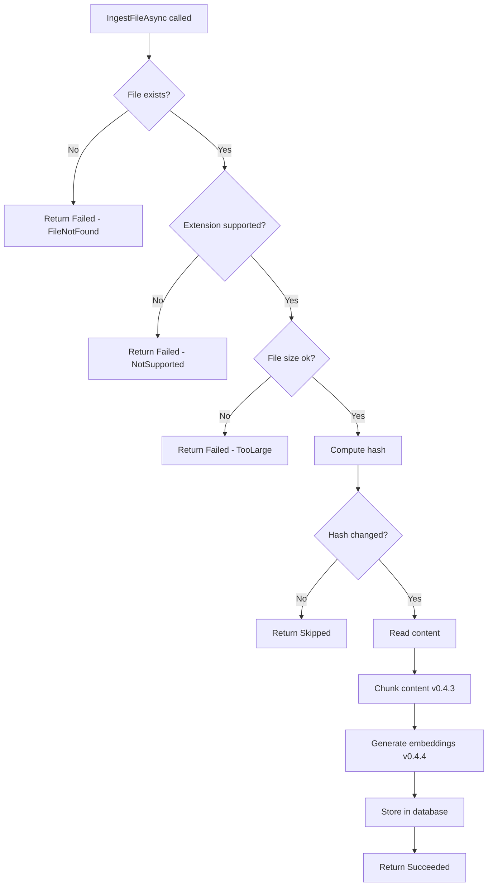

# LCS-DES-042a: Design Specification — Ingestion Service Interface

## 1. Metadata & Categorization

| Field | Value | Description |
| :--- | :--- | :--- |
| **Feature ID** | `RAG-042a` | Sub-part of RAG-042 |
| **Feature Name** | `Ingestion Service Interface` | Core ingestion abstractions |
| **Target Version** | `v0.4.2a` | First sub-part of v0.4.2 |
| **Module Scope** | `Lexichord.Abstractions` | Interface definitions |
| **Swimlane** | `Memory` | Part of RAG vertical |
| **License Tier** | `Core` | Infrastructure for all tiers |
| **Feature Gate Key** | `FeatureFlags.RAG.Ingestion` | Shared with parent feature |
| **Author** | Lead Architect | |
| **Status** | `Draft` | |
| **Last Updated** | `2026-01-27` | |
| **Parent Document** | [LCS-DES-042-INDEX](./LCS-DES-042-INDEX.md) | |
| **Scope Breakdown** | [LCS-SBD-042 §3.1](./LCS-SBD-042.md#31-v042a-ingestion-service-interface) | |

---

## 2. Executive Summary

### 2.1 The Requirement

The RAG system needs a standardized interface for ingesting files and directories into the document index. Other components need to trigger ingestion, monitor progress, and receive results through a consistent API.

> **Problem:** Without a defined interface, file ingestion logic would be tightly coupled to specific implementations, making testing and extension difficult.

### 2.2 The Proposed Solution

Define `IIngestionService` interface in Abstractions with:

1. Single file ingestion (`IngestFileAsync`)
2. Directory ingestion with recursive option (`IngestDirectoryAsync`)
3. Document removal (`RemoveDocumentAsync`)
4. Progress reporting via events (`ProgressChanged`)
5. Structured result types (`IngestionResult`)

---

## 3. Architecture & Modular Strategy

### 3.1 Dependencies

#### 3.1.1 Upstream Dependencies

None. This defines core abstractions.

#### 3.1.2 External Resources

None required.

### 3.2 Licensing Behavior

**No license gating.** This is core infrastructure available to all users regardless of license tier.

---

## 4. Data Contract (The API)

### 4.1 IIngestionService Interface

```csharp
namespace Lexichord.Abstractions.Contracts;

/// <summary>
/// Service for ingesting files into the RAG document index.
/// Provides methods for single file, directory, and batch ingestion.
/// </summary>
/// <remarks>
/// <para>The ingestion service coordinates the full pipeline: file reading,
/// hashing, chunking, embedding, and storage.</para>
/// <para>All operations are asynchronous and support cancellation.</para>
/// <para>Progress is reported through the <see cref="ProgressChanged"/> event.</para>
/// </remarks>
/// <example>
/// <code>
/// var result = await ingestionService.IngestFileAsync("/path/to/document.md");
/// if (result.Success)
/// {
///     Console.WriteLine($"Ingested {result.DocumentId}");
/// }
/// </code>
/// </example>
public interface IIngestionService
{
    /// <summary>
    /// Ingests a single file into the document index.
    /// </summary>
    /// <param name="filePath">Absolute path to the file to ingest.</param>
    /// <param name="ct">Cancellation token.</param>
    /// <returns>Result indicating success, failure, or skip (unchanged).</returns>
    /// <exception cref="FileNotFoundException">If the file does not exist.</exception>
    /// <exception cref="NotSupportedException">If the file type is not supported.</exception>
    Task<IngestionResult> IngestFileAsync(string filePath, CancellationToken ct = default);

    /// <summary>
    /// Ingests all supported files in a directory.
    /// </summary>
    /// <param name="directoryPath">Path to the directory to scan.</param>
    /// <param name="recursive">If true, includes files in subdirectories.</param>
    /// <param name="ct">Cancellation token.</param>
    /// <returns>Aggregate result with counts of processed, skipped, and failed files.</returns>
    /// <exception cref="DirectoryNotFoundException">If the directory does not exist.</exception>
    Task<IngestionResult> IngestDirectoryAsync(
        string directoryPath,
        bool recursive,
        CancellationToken ct = default);

    /// <summary>
    /// Removes a document and its chunks from the index.
    /// </summary>
    /// <param name="filePath">Path of the file to remove from index.</param>
    /// <returns>True if the document was found and removed, false if not found.</returns>
    Task<bool> RemoveDocumentAsync(string filePath);

    /// <summary>
    /// Re-indexes a document regardless of whether it has changed.
    /// </summary>
    /// <param name="filePath">Path of the file to force re-index.</param>
    /// <param name="ct">Cancellation token.</param>
    /// <returns>Result of the re-indexing operation.</returns>
    Task<IngestionResult> ForceReindexAsync(string filePath, CancellationToken ct = default);

    /// <summary>
    /// Fires when ingestion progress changes.
    /// Raised on the thread pool; handlers should marshal to UI thread if needed.
    /// </summary>
    event EventHandler<IngestionProgressEventArgs> ProgressChanged;
}
```

### 4.2 IngestionResult Record

```csharp
namespace Lexichord.Abstractions.Contracts;

/// <summary>
/// Result of an ingestion operation.
/// </summary>
/// <remarks>
/// For single file operations, <see cref="DocumentId"/> is set on success.
/// For directory operations, counts indicate batch processing results.
/// </remarks>
public record IngestionResult
{
    /// <summary>
    /// Whether the operation completed successfully.
    /// For directories, true if at least one file was processed.
    /// </summary>
    public bool Success { get; init; }

    /// <summary>
    /// Number of files that were successfully processed.
    /// </summary>
    public int FilesProcessed { get; init; }

    /// <summary>
    /// Number of files skipped because they were unchanged.
    /// </summary>
    public int FilesSkipped { get; init; }

    /// <summary>
    /// Number of files that failed to process.
    /// </summary>
    public int FilesFailed { get; init; }

    /// <summary>
    /// Error message if the operation failed.
    /// Null on success.
    /// </summary>
    public string? ErrorMessage { get; init; }

    /// <summary>
    /// Document ID for single file operations.
    /// Null for directory operations or failures.
    /// </summary>
    public Guid? DocumentId { get; init; }

    /// <summary>
    /// Number of chunks created (for single file operations).
    /// </summary>
    public int ChunkCount { get; init; }

    /// <summary>
    /// Total processing time for the operation.
    /// </summary>
    public TimeSpan Duration { get; init; }

    /// <summary>
    /// Creates a successful single-file result.
    /// </summary>
    public static IngestionResult Succeeded(Guid documentId, int chunkCount, TimeSpan duration) =>
        new()
        {
            Success = true,
            FilesProcessed = 1,
            DocumentId = documentId,
            ChunkCount = chunkCount,
            Duration = duration
        };

    /// <summary>
    /// Creates a skipped result (file unchanged).
    /// </summary>
    public static IngestionResult Skipped() =>
        new()
        {
            Success = true,
            FilesSkipped = 1
        };

    /// <summary>
    /// Creates a failed result.
    /// </summary>
    public static IngestionResult Failed(string errorMessage, TimeSpan duration) =>
        new()
        {
            Success = false,
            FilesFailed = 1,
            ErrorMessage = errorMessage,
            Duration = duration
        };
}
```

### 4.3 IngestionProgressEventArgs

```csharp
namespace Lexichord.Abstractions.Contracts;

/// <summary>
/// Event arguments for ingestion progress updates.
/// </summary>
public class IngestionProgressEventArgs : EventArgs
{
    /// <summary>
    /// Path of the file currently being processed.
    /// </summary>
    public required string CurrentFile { get; init; }

    /// <summary>
    /// Number of files completed so far.
    /// </summary>
    public int Completed { get; init; }

    /// <summary>
    /// Total number of files to process.
    /// May increase during directory scanning.
    /// </summary>
    public int Total { get; init; }

    /// <summary>
    /// Current phase of the ingestion pipeline.
    /// </summary>
    public IngestionPhase Phase { get; init; }

    /// <summary>
    /// Progress percentage (0-100).
    /// </summary>
    public int PercentComplete => Total > 0 ? (Completed * 100) / Total : 0;

    /// <summary>
    /// Estimated time remaining based on current processing rate.
    /// Null if not enough data to estimate.
    /// </summary>
    public TimeSpan? EstimatedRemaining { get; init; }
}

/// <summary>
/// Phases of the ingestion pipeline.
/// </summary>
public enum IngestionPhase
{
    /// <summary>Scanning directory for files.</summary>
    Scanning,

    /// <summary>Computing file hash for change detection.</summary>
    Hashing,

    /// <summary>Reading file content into memory.</summary>
    Reading,

    /// <summary>Splitting content into chunks.</summary>
    Chunking,

    /// <summary>Generating vector embeddings.</summary>
    Embedding,

    /// <summary>Storing document and chunks in database.</summary>
    Storing,

    /// <summary>Operation complete.</summary>
    Complete
}
```

### 4.4 IngestionOptions

```csharp
namespace Lexichord.Abstractions.Contracts;

/// <summary>
/// Configuration options for the ingestion service.
/// </summary>
public record IngestionOptions
{
    /// <summary>
    /// File extensions to include in ingestion.
    /// Default: .md, .txt, .json, .yaml, .yml
    /// </summary>
    public IReadOnlySet<string> SupportedExtensions { get; init; } =
        new HashSet<string>(StringComparer.OrdinalIgnoreCase)
        {
            ".md", ".txt", ".json", ".yaml", ".yml"
        };

    /// <summary>
    /// Directory names to exclude from recursive scanning.
    /// Default: .git, node_modules, bin, obj
    /// </summary>
    public IReadOnlySet<string> ExcludedDirectories { get; init; } =
        new HashSet<string>(StringComparer.OrdinalIgnoreCase)
        {
            ".git", "node_modules", "bin", "obj", ".vs", ".idea"
        };

    /// <summary>
    /// Maximum file size in bytes to process.
    /// Default: 10MB
    /// </summary>
    public long MaxFileSizeBytes { get; init; } = 10 * 1024 * 1024;

    /// <summary>
    /// Maximum concurrent ingestion operations.
    /// Default: 2
    /// </summary>
    public int MaxConcurrentIngestions { get; init; } = 2;

    /// <summary>
    /// Delay between batch API requests in milliseconds.
    /// Default: 500ms
    /// </summary>
    public int ThrottleDelayMs { get; init; } = 500;

    /// <summary>
    /// Maximum queue size for pending ingestions.
    /// Default: 1000
    /// </summary>
    public int MaxQueueSize { get; init; } = 1000;

    /// <summary>
    /// Timeout per file processing in milliseconds.
    /// Default: 60000 (1 minute)
    /// </summary>
    public int ProcessingTimeoutMs { get; init; } = 60000;
}
```

---

## 5. Implementation Logic

### 5.1 Ingestion Flow Diagram



---

## 6. Data Persistence

**None.** This sub-part defines interfaces only. The implementation (v0.4.2d) uses `IDocumentRepository` from v0.4.1c.

---

## 7. UI/UX Specifications

**None.** This is a backend abstraction with no direct UI.

---

## 8. Observability & Logging

| Level | Source | Message |
| :--- | :--- | :--- |
| Debug | IngestionService | `Ingesting file: {FilePath}` |
| Info | IngestionService | `Ingestion completed: {FilePath} ({ChunkCount} chunks)` |
| Debug | IngestionService | `File skipped (unchanged): {FilePath}` |
| Warning | IngestionService | `File too large: {FilePath} ({FileSize} bytes)` |
| Error | IngestionService | `Ingestion failed: {FilePath} - {ErrorMessage}` |

---

## 9. Security & Safety

| Risk | Level | Mitigation |
| :--- | :--- | :--- |
| Path traversal | Medium | Validate paths are within workspace |
| Large file DoS | Low | MaxFileSizeBytes limit |
| Symlink loops | Low | Don't follow symlinks |

---

## 10. Acceptance Criteria

### 10.1 Functional Criteria

| # | Given | When | Then |
| :--- | :--- | :--- | :--- |
| 1 | Valid .md file | `IngestFileAsync` called | Returns Success with DocumentId |
| 2 | Non-existent file | `IngestFileAsync` called | Returns Failed with FileNotFound |
| 3 | Unsupported extension | `IngestFileAsync` called | Returns Failed with NotSupported |
| 4 | Unchanged file | `IngestFileAsync` called | Returns Skipped |
| 5 | Directory with files | `IngestDirectoryAsync` called | Returns aggregate counts |
| 6 | Progress listener | Ingestion in progress | ProgressChanged fires |

---

## 11. Test Scenarios

### 11.1 Unit Tests

```csharp
[Trait("Category", "Unit")]
[Trait("Feature", "v0.4.2a")]
public class IngestionResultTests
{
    [Fact]
    public void Succeeded_WithValidInput_CreatesSuccessResult()
    {
        // Arrange
        var documentId = Guid.NewGuid();
        var chunkCount = 5;
        var duration = TimeSpan.FromSeconds(2);

        // Act
        var result = IngestionResult.Succeeded(documentId, chunkCount, duration);

        // Assert
        result.Success.Should().BeTrue();
        result.FilesProcessed.Should().Be(1);
        result.DocumentId.Should().Be(documentId);
        result.ChunkCount.Should().Be(chunkCount);
        result.Duration.Should().Be(duration);
    }

    [Fact]
    public void Skipped_CreatesSkippedResult()
    {
        // Act
        var result = IngestionResult.Skipped();

        // Assert
        result.Success.Should().BeTrue();
        result.FilesSkipped.Should().Be(1);
        result.FilesProcessed.Should().Be(0);
    }

    [Fact]
    public void Failed_WithMessage_CreatesFailedResult()
    {
        // Arrange
        var message = "File not found";
        var duration = TimeSpan.FromMilliseconds(100);

        // Act
        var result = IngestionResult.Failed(message, duration);

        // Assert
        result.Success.Should().BeFalse();
        result.FilesFailed.Should().Be(1);
        result.ErrorMessage.Should().Be(message);
    }
}

[Trait("Category", "Unit")]
[Trait("Feature", "v0.4.2a")]
public class IngestionProgressEventArgsTests
{
    [Theory]
    [InlineData(0, 10, 0)]
    [InlineData(5, 10, 50)]
    [InlineData(10, 10, 100)]
    [InlineData(0, 0, 0)]
    public void PercentComplete_CalculatesCorrectly(int completed, int total, int expected)
    {
        // Arrange
        var args = new IngestionProgressEventArgs
        {
            CurrentFile = "/test.md",
            Completed = completed,
            Total = total,
            Phase = IngestionPhase.Reading
        };

        // Assert
        args.PercentComplete.Should().Be(expected);
    }
}
```

---

## 12. Code Example

### 12.1 Interface Usage Example

```csharp
public class ExampleUsage
{
    private readonly IIngestionService _ingestionService;
    private readonly ILogger<ExampleUsage> _logger;

    public ExampleUsage(
        IIngestionService ingestionService,
        ILogger<ExampleUsage> logger)
    {
        _ingestionService = ingestionService;
        _logger = logger;

        // Subscribe to progress events
        _ingestionService.ProgressChanged += OnProgressChanged;
    }

    public async Task IngestWorkspaceAsync(string workspacePath)
    {
        var result = await _ingestionService.IngestDirectoryAsync(
            workspacePath,
            recursive: true);

        if (result.Success)
        {
            _logger.LogInformation(
                "Ingestion complete: {Processed} processed, {Skipped} skipped, {Failed} failed",
                result.FilesProcessed,
                result.FilesSkipped,
                result.FilesFailed);
        }
        else
        {
            _logger.LogError("Ingestion failed: {Error}", result.ErrorMessage);
        }
    }

    private void OnProgressChanged(object? sender, IngestionProgressEventArgs e)
    {
        _logger.LogDebug(
            "[{Phase}] {Percent}% - {File}",
            e.Phase,
            e.PercentComplete,
            Path.GetFileName(e.CurrentFile));
    }
}
```

---

## 13. DI Registration

```csharp
// In RAGModule.cs
services.Configure<IngestionOptions>(
    configuration.GetSection("RAG:Ingestion"));
```

---

## 14. Deliverable Checklist

| # | Deliverable | Status |
| :--- | :--- | :--- |
| 1 | `IIngestionService` interface | [ ] |
| 2 | `IngestionResult` record | [ ] |
| 3 | `IngestionProgressEventArgs` class | [ ] |
| 4 | `IngestionPhase` enum | [ ] |
| 5 | `IngestionOptions` record | [ ] |
| 6 | Unit tests for result types | [ ] |

---

## 15. Verification Commands

```bash
# ═══════════════════════════════════════════════════════════════════════════
# v0.4.2a Verification Commands
# ═══════════════════════════════════════════════════════════════════════════

# 1. Build abstractions project
dotnet build src/Lexichord.Abstractions

# 2. Run unit tests
dotnet test --filter "Category=Unit&FullyQualifiedName~IngestionResult"

# 3. Verify interface exists
grep -r "interface IIngestionService" src/Lexichord.Abstractions/
```

---

## 16. Changelog Entry

```markdown
### v0.4.2a - Ingestion Service Interface

- `IIngestionService` interface for file and directory ingestion
- `IngestionResult` record for operation results
- `IngestionProgressEventArgs` for progress reporting
- `IngestionPhase` enum for pipeline stages
- `IngestionOptions` for configuration
```

---

## 17. Deferred Features

| Feature | Deferred To | Reason |
| :--- | :--- | :--- |
| Batch ingestion with priorities | v0.4.2d | Queue implementation |
| Progress estimation | v0.4.7 | UI integration |

---

## Document History

| Version | Date | Author | Changes |
| :--- | :--- | :--- | :--- |
| 1.0 | 2026-01-27 | Lead Architect | Initial draft |
