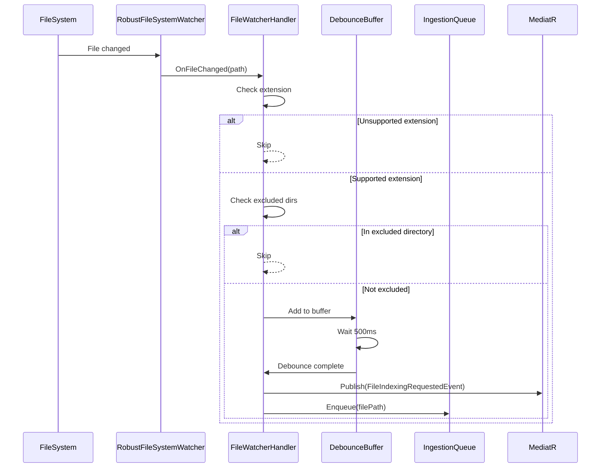

# LCS-DES-042c: Design Specification — File Watcher Integration

## 1. Metadata & Categorization

| Field | Value | Description |
| :--- | :--- | :--- |
| **Feature ID** | `RAG-042c` | Sub-part of RAG-042 |
| **Feature Name** | `File Watcher Integration` | Event-driven file monitoring |
| **Target Version** | `v0.4.2c` | Third sub-part of v0.4.2 |
| **Module Scope** | `Lexichord.Modules.RAG` | RAG module implementation |
| **Swimlane** | `Memory` | Part of RAG vertical |
| **License Tier** | `Core` | Infrastructure for all tiers |
| **Feature Gate Key** | `FeatureFlags.RAG.Ingestion` | Shared with parent feature |
| **Author** | Lead Architect | |
| **Status** | `Draft` | |
| **Last Updated** | `2026-01-27` | |
| **Parent Document** | [LCS-DES-042-INDEX](./LCS-DES-042-INDEX.md) | |
| **Scope Breakdown** | [LCS-SBD-042 §3.3](./LCS-SBD-042.md#33-v042c-file-watcher-integration) | |

---

## 2. Executive Summary

### 2.1 The Requirement

The RAG system needs to automatically detect file changes in the workspace without manual triggers. When users create or modify documents, the system should queue them for indexing.

> **Problem:** Users shouldn't need to manually trigger indexing after every save. The system should detect changes automatically.

### 2.2 The Proposed Solution

Integrate with `IRobustFileSystemWatcher` (v0.1.2b) to:

1. Subscribe to file creation and modification events
2. Filter events by supported file extensions
3. Debounce rapid changes to prevent duplicate processing
4. Publish `FileIndexingRequestedEvent` via MediatR
5. Enqueue files to `IIngestionQueue`

---

## 3. Architecture & Modular Strategy

### 3.1 Dependencies

#### 3.1.1 Upstream Dependencies

| Component | Source | Purpose |
| :--- | :--- | :--- |
| `IRobustFileSystemWatcher` | v0.1.2b | File system event notifications |
| `IWorkspaceService` | v0.1.2a | Workspace root path |
| `IMediator` | v0.0.7a | Event publishing |
| `IIngestionQueue` | v0.4.2d | Queue files for processing |

### 3.2 Licensing Behavior

**No license gating.** File watching is core infrastructure.

---

## 4. Data Contract (The API)

### 4.1 FileIndexingRequestedEvent

```csharp
namespace Lexichord.Modules.RAG.Events;

/// <summary>
/// Published when a file change is detected that requires indexing.
/// Consumed by the ingestion queue handler.
/// </summary>
public record FileIndexingRequestedEvent : INotification
{
    /// <summary>
    /// Absolute path to the file that changed.
    /// </summary>
    public required string FilePath { get; init; }

    /// <summary>
    /// Type of change that was detected.
    /// </summary>
    public FileChangeType ChangeType { get; init; }

    /// <summary>
    /// When the change was detected by the file watcher.
    /// </summary>
    public DateTimeOffset DetectedAt { get; init; } = DateTimeOffset.UtcNow;

    /// <summary>
    /// Original path if this was a rename operation.
    /// </summary>
    public string? OldPath { get; init; }
}

/// <summary>
/// Types of file system changes.
/// </summary>
public enum FileChangeType
{
    /// <summary>File was created.</summary>
    Created,

    /// <summary>File content was modified.</summary>
    Modified,

    /// <summary>File was deleted.</summary>
    Deleted,

    /// <summary>File was renamed.</summary>
    Renamed
}
```

### 4.2 FileWatcherIngestionHandler

```csharp
namespace Lexichord.Modules.RAG.Handlers;

/// <summary>
/// Handles file system events and queues supported files for ingestion.
/// Implements debouncing and extension filtering.
/// </summary>
public interface IFileWatcherIngestionHandler : IDisposable
{
    /// <summary>
    /// Starts watching the specified directory.
    /// </summary>
    /// <param name="directoryPath">Directory to watch.</param>
    void StartWatching(string directoryPath);

    /// <summary>
    /// Stops watching and clears pending debounce timers.
    /// </summary>
    void StopWatching();

    /// <summary>
    /// Whether the handler is currently watching.
    /// </summary>
    bool IsWatching { get; }

    /// <summary>
    /// Number of events pending in debounce buffer.
    /// </summary>
    int PendingEvents { get; }
}
```

### 4.3 FileWatcherOptions

```csharp
namespace Lexichord.Modules.RAG.Configuration;

/// <summary>
/// Configuration options for file watcher behavior.
/// </summary>
public record FileWatcherOptions
{
    /// <summary>
    /// File extensions to include (with leading dot).
    /// Default: .md, .txt, .json, .yaml, .yml
    /// </summary>
    public IReadOnlySet<string> IncludeExtensions { get; init; } =
        new HashSet<string>(StringComparer.OrdinalIgnoreCase)
        {
            ".md", ".txt", ".json", ".yaml", ".yml"
        };

    /// <summary>
    /// Directory names to exclude.
    /// Default: .git, node_modules, bin, obj
    /// </summary>
    public IReadOnlySet<string> ExcludeDirectories { get; init; } =
        new HashSet<string>(StringComparer.OrdinalIgnoreCase)
        {
            ".git", "node_modules", "bin", "obj", ".vs", ".idea", "__pycache__"
        };

    /// <summary>
    /// Debounce delay in milliseconds.
    /// Events within this window are consolidated.
    /// Default: 500ms
    /// </summary>
    public int DebounceDelayMs { get; init; } = 500;

    /// <summary>
    /// Whether to watch subdirectories.
    /// Default: true
    /// </summary>
    public bool IncludeSubdirectories { get; init; } = true;

    /// <summary>
    /// Maximum file size to process (in bytes).
    /// Default: 10MB
    /// </summary>
    public long MaxFileSizeBytes { get; init; } = 10 * 1024 * 1024;
}
```

---

## 5. Implementation Logic

### 5.1 Event Flow Diagram



### 5.2 Extension Filter Decision Tree

```text
START: "Should this file be processed?"
│
├── Get file extension
│   └── No extension?
│       └── Skip
│
├── Is extension in IncludeExtensions set?
│   ├── NO → Skip (log debug)
│   └── YES → Continue
│
├── Get parent directory path
│
├── Does path contain any ExcludeDirectories?
│   ├── YES → Skip (log debug)
│   └── NO → Continue
│
├── Is file size > MaxFileSizeBytes?
│   ├── YES → Skip (log warning)
│   └── NO → Continue
│
└── Process file → Add to debounce buffer
```

### 5.3 Debounce Logic

```text
DEBOUNCE(filePath):
│
├── Is filePath already in debounce buffer?
│   ├── YES → Reset timer, don't add duplicate
│   └── NO → Add to buffer with new timer
│
├── Start timer for DebounceDelayMs
│
├── Timer fires:
│   ├── Remove from buffer
│   ├── Publish FileIndexingRequestedEvent
│   └── Enqueue to IIngestionQueue
│
└── END

Note: Multiple rapid changes to same file result in single event.
```

---

## 6. Data Persistence

**None.** Events are ephemeral. Queue persistence is handled by `IIngestionQueue` (v0.4.2d).

---

## 7. UI/UX Specifications

**None.** This is a backend service. Status UI will be added in v0.4.7.

---

## 8. Observability & Logging

| Level | Source | Message |
| :--- | :--- | :--- |
| Debug | FileWatcherHandler | `File change detected: {FilePath} ({ChangeType})` |
| Debug | FileWatcherHandler | `Skipping unsupported extension: {Extension}` |
| Debug | FileWatcherHandler | `Skipping excluded directory: {DirectoryName}` |
| Warning | FileWatcherHandler | `Skipping large file: {FilePath} ({Size} bytes)` |
| Debug | FileWatcherHandler | `Debounce timer started for: {FilePath}` |
| Debug | FileWatcherHandler | `Debounce timer reset for: {FilePath}` |
| Info | FileWatcherHandler | `Queueing for ingestion: {FilePath}` |
| Info | FileWatcherHandler | `Started watching: {DirectoryPath}` |
| Info | FileWatcherHandler | `Stopped watching` |

---

## 9. Security & Safety

| Risk | Level | Mitigation |
| :--- | :--- | :--- |
| Path traversal | Medium | Validate path is within workspace |
| Symlink loops | Low | Don't follow symlinks |
| Event storm | Medium | Debouncing + bounded queue |

---

## 10. Acceptance Criteria

### 10.1 Functional Criteria

| # | Given | When | Then |
| :--- | :--- | :--- | :--- |
| 1 | Handler watching | New .md file created | Event published |
| 2 | Handler watching | .md file modified | Event published |
| 3 | Handler watching | .exe file created | No event (filtered) |
| 4 | Handler watching | File in .git created | No event (excluded) |
| 5 | Handler watching | Same file modified 3x in 500ms | Single event |
| 6 | Handler watching | File > 10MB modified | No event (size filter) |
| 7 | Handler stopped | File modified | No event |

### 10.2 Performance Criteria

| # | Given | When | Then |
| :--- | :--- | :--- | :--- |
| 8 | Handler watching | 100 files created rapidly | < 100ms to queue all |
| 9 | Handler watching | Debounce window | 90% duplicate reduction |

---

## 11. Test Scenarios

### 11.1 Unit Tests

```csharp
[Trait("Category", "Unit")]
[Trait("Feature", "v0.4.2c")]
public class FileWatcherIngestionHandlerTests
{
    private readonly Mock<IIngestionQueue> _queueMock;
    private readonly Mock<IMediator> _mediatorMock;
    private readonly FileWatcherIngestionHandler _sut;

    public FileWatcherIngestionHandlerTests()
    {
        _queueMock = new Mock<IIngestionQueue>();
        _mediatorMock = new Mock<IMediator>();

        var options = Options.Create(new FileWatcherOptions());
        _sut = new FileWatcherIngestionHandler(
            _queueMock.Object,
            _mediatorMock.Object,
            options,
            NullLogger<FileWatcherIngestionHandler>.Instance);
    }

    [Theory]
    [InlineData(".md", true)]
    [InlineData(".txt", true)]
    [InlineData(".json", true)]
    [InlineData(".yaml", true)]
    [InlineData(".yml", true)]
    [InlineData(".exe", false)]
    [InlineData(".dll", false)]
    [InlineData(".pdf", false)]
    public void ShouldProcess_WithExtension_FiltersCorrectly(
        string extension, bool shouldProcess)
    {
        // Arrange
        var filePath = $"/workspace/file{extension}";

        // Act
        var result = _sut.ShouldProcessFile(filePath);

        // Assert
        result.Should().Be(shouldProcess);
    }

    [Theory]
    [InlineData("/workspace/.git/config", false)]
    [InlineData("/workspace/node_modules/package/index.js", false)]
    [InlineData("/workspace/bin/Debug/app.dll", false)]
    [InlineData("/workspace/src/document.md", true)]
    [InlineData("/workspace/docs/readme.txt", true)]
    public void ShouldProcess_WithPath_FiltersExcludedDirectories(
        string filePath, bool shouldProcess)
    {
        // Act
        var result = _sut.ShouldProcessFile(filePath);

        // Assert
        result.Should().Be(shouldProcess);
    }

    [Fact]
    public async Task OnFileChanged_WithSupportedFile_EnqueuesFile()
    {
        // Arrange
        var filePath = "/workspace/document.md";
        _queueMock.Setup(q => q.Enqueue(filePath, It.IsAny<IngestionPriority>()))
            .Returns(true);

        // Act
        await _sut.HandleFileChangeAsync(filePath, FileChangeType.Modified);
        await Task.Delay(600); // Wait for debounce

        // Assert
        _queueMock.Verify(q => q.Enqueue(filePath, IngestionPriority.Normal), Times.Once);
    }

    [Fact]
    public async Task OnFileChanged_RapidChanges_DebouncesSingleEvent()
    {
        // Arrange
        var filePath = "/workspace/document.md";
        _queueMock.Setup(q => q.Enqueue(filePath, It.IsAny<IngestionPriority>()))
            .Returns(true);

        // Act - simulate rapid changes
        for (int i = 0; i < 5; i++)
        {
            await _sut.HandleFileChangeAsync(filePath, FileChangeType.Modified);
            await Task.Delay(100); // Less than debounce delay
        }
        await Task.Delay(600); // Wait for final debounce

        // Assert - only one enqueue call
        _queueMock.Verify(q => q.Enqueue(filePath, IngestionPriority.Normal), Times.Once);
    }

    [Fact]
    public async Task OnFileChanged_DeletedFile_PublishesDeleteEvent()
    {
        // Arrange
        var filePath = "/workspace/document.md";

        // Act
        await _sut.HandleFileChangeAsync(filePath, FileChangeType.Deleted);
        await Task.Delay(600);

        // Assert
        _mediatorMock.Verify(m => m.Publish(
            It.Is<FileIndexingRequestedEvent>(e =>
                e.FilePath == filePath &&
                e.ChangeType == FileChangeType.Deleted),
            It.IsAny<CancellationToken>()),
            Times.Once);
    }
}
```

---

## 12. Code Example

### 12.1 FileWatcherIngestionHandler Implementation

```csharp
using System.Collections.Concurrent;
using System.Reactive.Linq;
using System.Reactive.Subjects;

namespace Lexichord.Modules.RAG.Handlers;

/// <summary>
/// Handles file system events and queues supported files for ingestion.
/// Uses Rx for debouncing rapid file changes.
/// </summary>
public sealed class FileWatcherIngestionHandler : IFileWatcherIngestionHandler
{
    private readonly IIngestionQueue _queue;
    private readonly IMediator _mediator;
    private readonly FileWatcherOptions _options;
    private readonly ILogger<FileWatcherIngestionHandler> _logger;

    private readonly Subject<FileChangeEvent> _eventSubject;
    private readonly ConcurrentDictionary<string, DateTimeOffset> _pendingEvents;
    private IDisposable? _debounceSubscription;

    private IRobustFileSystemWatcher? _watcher;

    public FileWatcherIngestionHandler(
        IIngestionQueue queue,
        IMediator mediator,
        IOptions<FileWatcherOptions> options,
        ILogger<FileWatcherIngestionHandler> logger)
    {
        _queue = queue;
        _mediator = mediator;
        _options = options.Value;
        _logger = logger;

        _eventSubject = new Subject<FileChangeEvent>();
        _pendingEvents = new ConcurrentDictionary<string, DateTimeOffset>(
            StringComparer.OrdinalIgnoreCase);

        SetupDebouncing();
    }

    public bool IsWatching => _watcher is not null;
    public int PendingEvents => _pendingEvents.Count;

    public void StartWatching(string directoryPath)
    {
        if (_watcher is not null)
        {
            StopWatching();
        }

        _logger.LogInformation("Started watching: {DirectoryPath}", directoryPath);

        // Wire up to IRobustFileSystemWatcher
        // Implementation depends on v0.1.2b interface
    }

    public void StopWatching()
    {
        _watcher?.Dispose();
        _watcher = null;
        _pendingEvents.Clear();
        _logger.LogInformation("Stopped watching");
    }

    /// <summary>
    /// Checks if a file should be processed based on extension and path filters.
    /// </summary>
    public bool ShouldProcessFile(string filePath)
    {
        // Check extension
        var extension = Path.GetExtension(filePath);
        if (string.IsNullOrEmpty(extension))
        {
            return false;
        }

        if (!_options.IncludeExtensions.Contains(extension))
        {
            _logger.LogDebug("Skipping unsupported extension: {Extension}", extension);
            return false;
        }

        // Check excluded directories
        var pathParts = filePath.Split(Path.DirectorySeparatorChar, Path.AltDirectorySeparatorChar);
        foreach (var part in pathParts)
        {
            if (_options.ExcludeDirectories.Contains(part))
            {
                _logger.LogDebug("Skipping excluded directory: {DirectoryName}", part);
                return false;
            }
        }

        // Check file size
        try
        {
            var fileInfo = new FileInfo(filePath);
            if (fileInfo.Exists && fileInfo.Length > _options.MaxFileSizeBytes)
            {
                _logger.LogWarning(
                    "Skipping large file: {FilePath} ({Size} bytes)",
                    filePath, fileInfo.Length);
                return false;
            }
        }
        catch (Exception ex)
        {
            _logger.LogDebug(ex, "Could not check file size: {FilePath}", filePath);
        }

        return true;
    }

    /// <summary>
    /// Handles a file change event (called by file watcher).
    /// </summary>
    public Task HandleFileChangeAsync(string filePath, FileChangeType changeType)
    {
        _logger.LogDebug("File change detected: {FilePath} ({ChangeType})", filePath, changeType);

        if (!ShouldProcessFile(filePath) && changeType != FileChangeType.Deleted)
        {
            return Task.CompletedTask;
        }

        // Add to debounce buffer
        _pendingEvents[filePath] = DateTimeOffset.UtcNow;
        _eventSubject.OnNext(new FileChangeEvent(filePath, changeType));

        return Task.CompletedTask;
    }

    private void SetupDebouncing()
    {
        _debounceSubscription = _eventSubject
            .GroupBy(e => e.FilePath)
            .SelectMany(group =>
                group.Throttle(TimeSpan.FromMilliseconds(_options.DebounceDelayMs)))
            .Subscribe(async evt =>
            {
                _pendingEvents.TryRemove(evt.FilePath, out _);
                await ProcessDebouncedEventAsync(evt);
            });
    }

    private async Task ProcessDebouncedEventAsync(FileChangeEvent evt)
    {
        _logger.LogInformation("Queueing for ingestion: {FilePath}", evt.FilePath);

        // Publish event
        var notification = new FileIndexingRequestedEvent
        {
            FilePath = evt.FilePath,
            ChangeType = evt.ChangeType,
            DetectedAt = DateTimeOffset.UtcNow
        };

        await _mediator.Publish(notification);

        // Enqueue for processing (unless deleted)
        if (evt.ChangeType != FileChangeType.Deleted)
        {
            _queue.Enqueue(evt.FilePath, IngestionPriority.Normal);
        }
    }

    public void Dispose()
    {
        _debounceSubscription?.Dispose();
        _eventSubject.Dispose();
        StopWatching();
    }

    private record FileChangeEvent(string FilePath, FileChangeType ChangeType);
}
```

---

## 13. DI Registration

```csharp
// In RAGModule.cs
services.Configure<FileWatcherOptions>(
    configuration.GetSection("RAG:FileWatcher"));

services.AddSingleton<IFileWatcherIngestionHandler, FileWatcherIngestionHandler>();
```

---

## 14. Deliverable Checklist

| # | Deliverable | Status |
| :--- | :--- | :--- |
| 1 | `FileIndexingRequestedEvent` notification | [ ] |
| 2 | `FileChangeType` enum | [ ] |
| 3 | `FileWatcherOptions` configuration | [ ] |
| 4 | `IFileWatcherIngestionHandler` interface | [ ] |
| 5 | `FileWatcherIngestionHandler` implementation | [ ] |
| 6 | Debouncing with Rx | [ ] |
| 7 | Unit tests for filtering | [ ] |
| 8 | Unit tests for debouncing | [ ] |

---

## 15. Verification Commands

```bash
# ═══════════════════════════════════════════════════════════════════════════
# v0.4.2c Verification Commands
# ═══════════════════════════════════════════════════════════════════════════

# 1. Build RAG module
dotnet build src/Lexichord.Modules.RAG

# 2. Run unit tests
dotnet test --filter "Category=Unit&FullyQualifiedName~FileWatcher"

# 3. Manual verification
# a) Start application with workspace open
# b) Create test.md in workspace
# c) Check logs for "File change detected" and "Queueing for ingestion"
# d) Rapidly save file 5 times
# e) Verify only one "Queueing" message after debounce
```

---

## 16. Changelog Entry

```markdown
### v0.4.2c - File Watcher Integration

- `FileIndexingRequestedEvent` MediatR notification
- `FileWatcherIngestionHandler` with debouncing
- Extension filtering (.md, .txt, .json, .yaml)
- Directory exclusion (.git, node_modules, bin, obj)
- File size limit (10MB default)
- Rx-based debounce (500ms default)
```

---

## 17. Deferred Features

| Feature | Deferred To | Reason |
| :--- | :--- | :--- |
| Custom extension configuration UI | v0.4.7 | Settings page |
| Exclusion pattern wildcards | v0.5.x | Advanced configuration |

---

## Document History

| Version | Date | Author | Changes |
| :--- | :--- | :--- | :--- |
| 1.0 | 2026-01-27 | Lead Architect | Initial draft |
