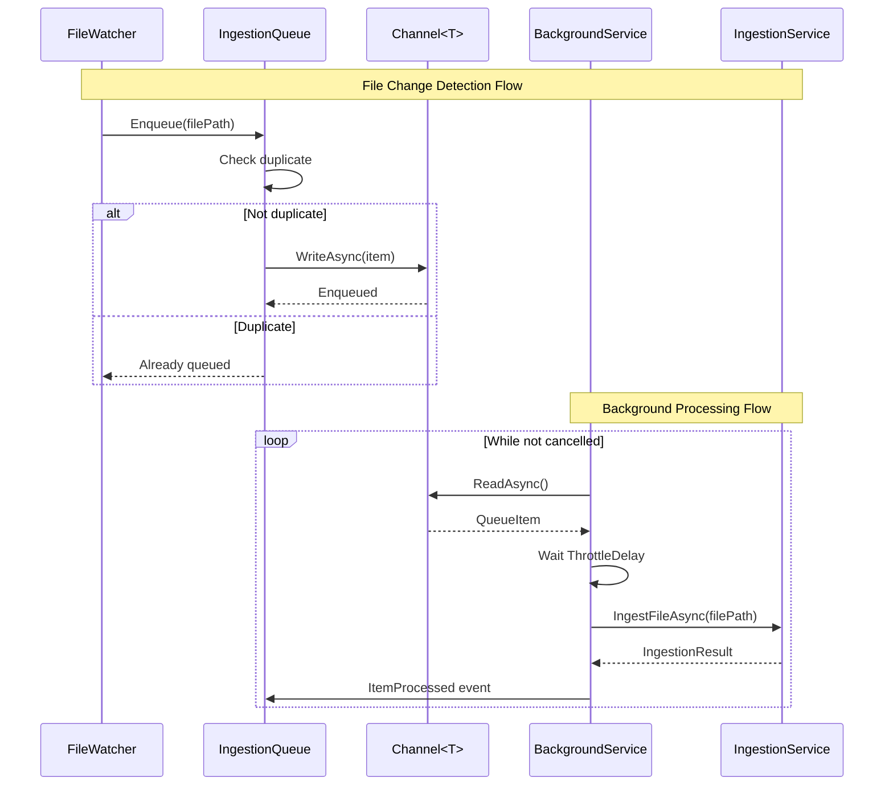
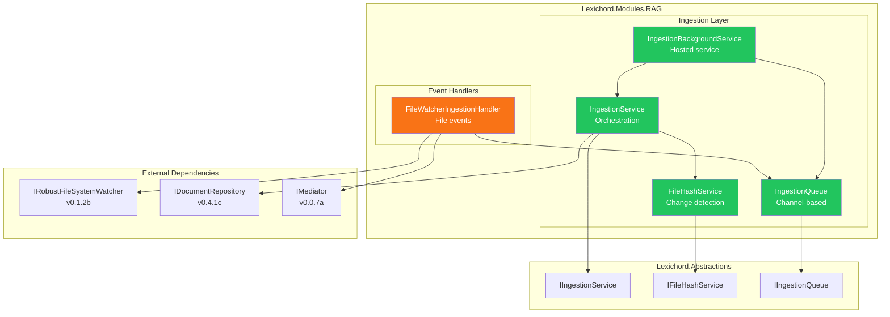
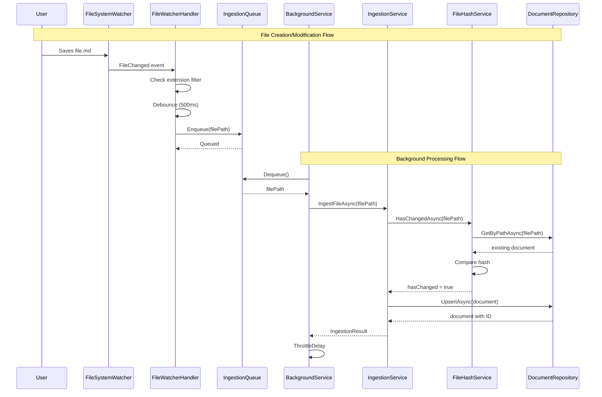

# LCS-SBD-042: Scope Breakdown — The Watcher

## Document Control

| Field            | Value                                    |
| :--------------- | :--------------------------------------- |
| **Document ID**  | LCS-SBD-042                              |
| **Version**      | v0.4.2                                   |
| **Codename**     | The Watcher (File Ingestion Pipeline)    |
| **Status**       | Draft                                    |
| **Last Updated** | 2026-01-27                               |
| **Owner**        | Lead Architect                           |
| **Depends On**   | v0.4.1 (Vector Foundation), v0.1.2b (IRobustFileSystemWatcher) |

---

## 1. Executive Summary

### 1.1 The Vision

**v0.4.2** delivers **The Watcher** — an automatic file ingestion pipeline that detects new and modified files in the workspace for indexing. This release bridges the gap between the vector storage infrastructure (v0.4.1) and the chunking/embedding systems (v0.4.3-4), enabling Lexichord to continuously monitor the user's workspace and maintain an up-to-date document index.

With The Watcher, users no longer need to manually trigger indexing. The system automatically detects file changes and queues them for processing, creating a seamless experience where the RAG system stays synchronized with the user's writing.

### 1.2 Business Value

- **Automatic Synchronization:** File changes are detected and indexed automatically.
- **Efficient Processing:** Hash-based change detection prevents unnecessary re-indexing.
- **Non-Blocking:** Background queue processing keeps the UI responsive.
- **Scalable Architecture:** Throttled queue prevents overwhelming the embedding API.
- **Developer Friendly:** Event-driven architecture enables easy extension.
- **Foundation:** Enables document processing in v0.4.3 (Chunking) and v0.4.4 (Embedding).

### 1.3 Success Criteria

This release succeeds when:

1. `IIngestionService` interface provides file and directory ingestion methods.
2. `FileHashService` correctly detects file modifications using SHA-256.
3. File watcher integration publishes `FileIndexingRequestedEvent` for supported file types.
4. `IngestionQueue` processes files sequentially with configurable throttling.
5. Background `HostedService` consumes queue and coordinates ingestion.

### 1.4 License Gating

File watching and change detection is **Core** functionality. All license tiers can benefit from automatic file monitoring. The actual semantic search features that consume the indexed data are gated at **Writer Pro** (in v0.4.5).

---

## 2. Dependencies on Prior Versions

| Component                  | Source Version | Usage in v0.4.2                                  |
| :------------------------- | :------------- | :----------------------------------------------- |
| `IDocumentRepository`      | v0.4.1c        | Store document metadata and status               |
| `Document`                 | v0.4.1c        | Document entity for tracking indexed files       |
| `DocumentStatus`           | v0.4.1c        | Indexing pipeline states                         |
| `IRobustFileSystemWatcher` | v0.1.2b        | File system change notifications                 |
| `IWorkspaceService`        | v0.1.2a        | Get current workspace root path                  |
| `IMediator`                | v0.0.7a        | Publish ingestion events                         |
| `IConfigurationService`    | v0.0.3d        | Ingestion configuration settings                 |
| `Serilog`                  | v0.0.3b        | Structured logging                               |

---

## 3. Sub-Part Specifications

### 3.1 v0.4.2a: Ingestion Service Interface

| Field            | Value                                     |
| :--------------- | :---------------------------------------- |
| **Sub-Part ID**  | RAG-042a                                  |
| **Title**        | Ingestion Service Interface               |
| **Module**       | `Lexichord.Abstractions`                  |
| **License Tier** | Core                                      |

**Goal:** Define `IIngestionService` interface in Abstractions for file and directory ingestion operations.

**Key Deliverables:**

- `IIngestionService` interface with ingestion methods
- `IngestionResult` record for operation results
- `IngestionProgressEventArgs` for progress reporting
- `IngestionOptions` record for configuration
- Unit tests for interface contracts

**Key Interfaces:**

```csharp
namespace Lexichord.Abstractions.Contracts;

/// <summary>
/// Service for ingesting files into the RAG system.
/// </summary>
public interface IIngestionService
{
    /// <summary>
    /// Ingests a single file into the document index.
    /// </summary>
    /// <param name="filePath">Absolute path to the file.</param>
    /// <param name="ct">Cancellation token.</param>
    /// <returns>Result indicating success or failure.</returns>
    Task<IngestionResult> IngestFileAsync(string filePath, CancellationToken ct = default);

    /// <summary>
    /// Ingests all supported files in a directory.
    /// </summary>
    /// <param name="directoryPath">Path to the directory.</param>
    /// <param name="recursive">Whether to include subdirectories.</param>
    /// <param name="ct">Cancellation token.</param>
    /// <returns>Result with count of processed files.</returns>
    Task<IngestionResult> IngestDirectoryAsync(
        string directoryPath,
        bool recursive,
        CancellationToken ct = default);

    /// <summary>
    /// Removes a document from the index.
    /// </summary>
    /// <param name="filePath">Path of the file to remove.</param>
    /// <returns>True if removed, false if not found.</returns>
    Task<bool> RemoveDocumentAsync(string filePath);

    /// <summary>
    /// Fires when ingestion progress changes.
    /// </summary>
    event EventHandler<IngestionProgressEventArgs> ProgressChanged;
}

/// <summary>
/// Result of an ingestion operation.
/// </summary>
public record IngestionResult
{
    /// <summary>Whether the operation succeeded.</summary>
    public bool Success { get; init; }

    /// <summary>Number of files processed.</summary>
    public int FilesProcessed { get; init; }

    /// <summary>Number of files skipped (unchanged).</summary>
    public int FilesSkipped { get; init; }

    /// <summary>Number of files that failed.</summary>
    public int FilesFailed { get; init; }

    /// <summary>Error message if operation failed.</summary>
    public string? ErrorMessage { get; init; }

    /// <summary>Document ID if single file was ingested.</summary>
    public Guid? DocumentId { get; init; }

    /// <summary>Total processing time.</summary>
    public TimeSpan Duration { get; init; }
}

/// <summary>
/// Event args for ingestion progress updates.
/// </summary>
public class IngestionProgressEventArgs : EventArgs
{
    /// <summary>Current file being processed.</summary>
    public required string CurrentFile { get; init; }

    /// <summary>Number of files completed.</summary>
    public int Completed { get; init; }

    /// <summary>Total number of files to process.</summary>
    public int Total { get; init; }

    /// <summary>Current operation phase.</summary>
    public IngestionPhase Phase { get; init; }

    /// <summary>Progress percentage (0-100).</summary>
    public int PercentComplete => Total > 0 ? (Completed * 100) / Total : 0;
}

/// <summary>
/// Phases of the ingestion pipeline.
/// </summary>
public enum IngestionPhase
{
    /// <summary>Scanning for files.</summary>
    Scanning,
    /// <summary>Computing file hashes.</summary>
    Hashing,
    /// <summary>Reading file content.</summary>
    Reading,
    /// <summary>Chunking content.</summary>
    Chunking,
    /// <summary>Generating embeddings.</summary>
    Embedding,
    /// <summary>Storing in database.</summary>
    Storing,
    /// <summary>Operation complete.</summary>
    Complete
}
```

**Dependencies:**

- None (defines abstractions only)

---

### 3.2 v0.4.2b: Hash-Based Change Detection

| Field            | Value                                     |
| :--------------- | :---------------------------------------- |
| **Sub-Part ID**  | RAG-042b                                  |
| **Title**        | Hash-Based Change Detection               |
| **Module**       | `Lexichord.Modules.RAG`                   |
| **License Tier** | Core                                      |

**Goal:** Implement `FileHashService` using SHA-256 to detect file modifications and skip unchanged files.

**Key Deliverables:**

- `IFileHashService` interface for hash operations
- `FileHashService` implementation using SHA-256
- Quick pre-filtering using file size and last modified timestamp
- Integration with `IDocumentRepository` for hash comparison
- Unit tests for hash calculation and change detection

**Key Interfaces:**

```csharp
namespace Lexichord.Abstractions.Contracts;

/// <summary>
/// Service for computing and comparing file hashes.
/// </summary>
public interface IFileHashService
{
    /// <summary>
    /// Computes SHA-256 hash of file content.
    /// </summary>
    /// <param name="filePath">Path to the file.</param>
    /// <param name="ct">Cancellation token.</param>
    /// <returns>Hex-encoded hash string.</returns>
    Task<string> ComputeHashAsync(string filePath, CancellationToken ct = default);

    /// <summary>
    /// Checks if a file has changed since last indexing.
    /// Uses quick metadata check before computing full hash.
    /// </summary>
    /// <param name="filePath">Path to the file.</param>
    /// <param name="storedHash">Previously stored hash.</param>
    /// <param name="storedSize">Previously stored file size.</param>
    /// <param name="storedModified">Previously stored modification time.</param>
    /// <param name="ct">Cancellation token.</param>
    /// <returns>True if file has changed, false if unchanged.</returns>
    Task<bool> HasChangedAsync(
        string filePath,
        string storedHash,
        long storedSize,
        DateTimeOffset? storedModified,
        CancellationToken ct = default);

    /// <summary>
    /// Gets file metadata without computing hash.
    /// </summary>
    /// <param name="filePath">Path to the file.</param>
    /// <returns>File metadata.</returns>
    FileMetadata GetMetadata(string filePath);
}

/// <summary>
/// Metadata about a file for change detection.
/// </summary>
public record FileMetadata
{
    /// <summary>File size in bytes.</summary>
    public long Size { get; init; }

    /// <summary>Last modification time.</summary>
    public DateTimeOffset LastModified { get; init; }

    /// <summary>Whether the file exists.</summary>
    public bool Exists { get; init; }
}
```

**Change Detection Logic:**

```text
DETECT_CHANGE(filePath, storedDocument):
│
├── Get current file metadata (size, lastModified)
│   ├── File doesn't exist → Return DELETED
│   └── File exists → Continue
│
├── Quick check: Has size changed?
│   ├── YES → Return CHANGED (skip hash)
│   └── NO → Continue
│
├── Quick check: Has lastModified changed?
│   ├── NO → Return UNCHANGED (skip hash)
│   └── YES → Continue
│
├── Compute SHA-256 hash of current file
│
├── Compare with stored hash
│   ├── DIFFERENT → Return CHANGED
│   └── SAME → Return UNCHANGED
│
└── END
```

**Dependencies:**

- v0.4.1c: `IDocumentRepository` for retrieving stored hashes

---

### 3.3 v0.4.2c: File Watcher Integration

| Field            | Value                                     |
| :--------------- | :---------------------------------------- |
| **Sub-Part ID**  | RAG-042c                                  |
| **Title**        | File Watcher Integration                  |
| **Module**       | `Lexichord.Modules.RAG`                   |
| **License Tier** | Core                                      |

**Goal:** Extend `IRobustFileSystemWatcher` integration to publish `FileIndexingRequestedEvent` when supported files are created or modified.

**Key Deliverables:**

- `FileIndexingRequestedEvent` MediatR notification
- `FileWatcherIngestionHandler` to handle file system events
- Configurable file type filtering (`.md`, `.txt`, `.json`, `.yaml`)
- Debouncing to prevent duplicate events during rapid changes
- Integration tests for event publishing

**Key Interfaces:**

```csharp
namespace Lexichord.Modules.RAG.Events;

/// <summary>
/// Published when a file change is detected that requires indexing.
/// </summary>
public record FileIndexingRequestedEvent : INotification
{
    /// <summary>Absolute path to the file.</summary>
    public required string FilePath { get; init; }

    /// <summary>Type of change detected.</summary>
    public FileChangeType ChangeType { get; init; }

    /// <summary>When the change was detected.</summary>
    public DateTimeOffset DetectedAt { get; init; } = DateTimeOffset.UtcNow;
}

/// <summary>
/// Type of file system change.
/// </summary>
public enum FileChangeType
{
    /// <summary>File was created.</summary>
    Created,
    /// <summary>File was modified.</summary>
    Modified,
    /// <summary>File was deleted.</summary>
    Deleted,
    /// <summary>File was renamed.</summary>
    Renamed
}
```

**Supported File Extensions:**

| Extension | Description        | Enabled by Default |
| :-------- | :----------------- | :----------------- |
| `.md`     | Markdown           | Yes                |
| `.txt`    | Plain text         | Yes                |
| `.json`   | JSON               | Yes                |
| `.yaml`   | YAML               | Yes                |
| `.yml`    | YAML (alternate)   | Yes                |
| `.rst`    | reStructuredText   | No                 |
| `.adoc`   | AsciiDoc           | No                 |

**Dependencies:**

- v0.1.2b: `IRobustFileSystemWatcher` for file system events
- v0.0.7a: `IMediator` for event publishing

---

### 3.4 v0.4.2d: Ingestion Queue

| Field            | Value                                     |
| :--------------- | :---------------------------------------- |
| **Sub-Part ID**  | RAG-042d                                  |
| **Title**        | Ingestion Queue                           |
| **Module**       | `Lexichord.Modules.RAG`                   |
| **License Tier** | Core                                      |

**Goal:** Implement `IngestionQueue` using `System.Threading.Channels` for sequential file processing with throttling.

**Key Deliverables:**

- `IIngestionQueue` interface for queue operations
- `IngestionQueue` implementation using Channels
- `IngestionBackgroundService` hosted service for queue consumption
- Configurable concurrency and throttling settings
- Graceful shutdown with pending item processing
- Unit tests for queue behavior

**Key Interfaces:**

```csharp
namespace Lexichord.Abstractions.Contracts;

/// <summary>
/// Queue for managing file ingestion requests.
/// </summary>
public interface IIngestionQueue
{
    /// <summary>
    /// Enqueues a file for ingestion.
    /// </summary>
    /// <param name="filePath">Path to the file.</param>
    /// <param name="priority">Processing priority.</param>
    /// <returns>True if enqueued, false if duplicate.</returns>
    bool Enqueue(string filePath, IngestionPriority priority = IngestionPriority.Normal);

    /// <summary>
    /// Removes a file from the queue if not yet processed.
    /// </summary>
    /// <param name="filePath">Path to remove.</param>
    /// <returns>True if removed.</returns>
    bool TryRemove(string filePath);

    /// <summary>
    /// Gets the current queue depth.
    /// </summary>
    int Count { get; }

    /// <summary>
    /// Gets whether the queue is currently processing.
    /// </summary>
    bool IsProcessing { get; }

    /// <summary>
    /// Fires when an item is processed.
    /// </summary>
    event EventHandler<IngestionQueueEventArgs> ItemProcessed;
}

/// <summary>
/// Priority levels for ingestion queue.
/// </summary>
public enum IngestionPriority
{
    /// <summary>Low priority (background indexing).</summary>
    Low = 0,
    /// <summary>Normal priority (file watcher events).</summary>
    Normal = 1,
    /// <summary>High priority (user-initiated).</summary>
    High = 2
}
```

**Configuration Options:**

| Setting                  | Default | Description                              |
| :----------------------- | :------ | :--------------------------------------- |
| `MaxConcurrentIngestions` | 2       | Maximum parallel ingestion operations    |
| `ThrottleDelayMs`        | 500     | Delay between batch requests (API rate limiting) |
| `MaxQueueSize`           | 1000    | Maximum items in queue                   |
| `ProcessingTimeoutMs`    | 60000   | Timeout per file processing              |

**Queue Flow Diagram:**



**Dependencies:**

- v0.4.2a: `IIngestionService` interface
- v0.4.2b: `IFileHashService` for change detection
- System.Threading.Channels NuGet package

---

## 4. Implementation Checklist

| #  | Sub-Part | Task                                                      | Est. Hours |
| :- | :------- | :-------------------------------------------------------- | :--------- |
| 1  | v0.4.2a  | Create IIngestionService interface                        | 1          |
| 2  | v0.4.2a  | Create IngestionResult record                             | 0.5        |
| 3  | v0.4.2a  | Create IngestionProgressEventArgs                         | 0.5        |
| 4  | v0.4.2a  | Create IngestionPhase enum                                | 0.5        |
| 5  | v0.4.2a  | Unit tests for interface contracts                        | 1          |
| 6  | v0.4.2b  | Create IFileHashService interface                         | 0.5        |
| 7  | v0.4.2b  | Implement FileHashService with SHA-256                    | 2          |
| 8  | v0.4.2b  | Implement quick metadata pre-check                        | 1          |
| 9  | v0.4.2b  | Implement HasChangedAsync with full logic                 | 1.5        |
| 10 | v0.4.2b  | Unit tests for hash service                               | 1.5        |
| 11 | v0.4.2c  | Create FileIndexingRequestedEvent                         | 0.5        |
| 12 | v0.4.2c  | Create FileWatcherIngestionHandler                        | 2          |
| 13 | v0.4.2c  | Implement file extension filtering                        | 1          |
| 14 | v0.4.2c  | Implement debouncing for rapid changes                    | 1.5        |
| 15 | v0.4.2c  | Integration tests for event publishing                    | 1.5        |
| 16 | v0.4.2d  | Create IIngestionQueue interface                          | 0.5        |
| 17 | v0.4.2d  | Implement IngestionQueue with Channels                    | 2.5        |
| 18 | v0.4.2d  | Implement IngestionBackgroundService                      | 2.5        |
| 19 | v0.4.2d  | Implement priority queue logic                            | 1          |
| 20 | v0.4.2d  | Implement graceful shutdown                               | 1          |
| 21 | v0.4.2d  | Unit tests for queue behavior                             | 2          |
| 22 | All      | Implement IngestionService orchestration                  | 3          |
| 23 | All      | Integration tests for full pipeline                       | 2          |
| 24 | All      | DI registration in RAGModule.cs                           | 0.5        |
| **Total** |   |                                                           | **31 hours** |

---

## 5. Dependency Matrix

### 5.1 Required Interfaces (from earlier versions)

| Interface                  | Source Version | Purpose                              |
| :------------------------- | :------------- | :----------------------------------- |
| `IDocumentRepository`      | v0.4.1c        | Document storage and retrieval       |
| `IRobustFileSystemWatcher` | v0.1.2b        | File system event notifications      |
| `IWorkspaceService`        | v0.1.2a        | Workspace root path                  |
| `IMediator`                | v0.0.7a        | Event publishing                     |
| `IConfigurationService`    | v0.0.3d        | Configuration settings               |

### 5.2 New Interfaces (defined in v0.4.2)

| Interface                   | Defined In | Module        | Purpose                 |
| :-------------------------- | :--------- | :------------ | :---------------------- |
| `IIngestionService`         | v0.4.2a    | Abstractions  | File ingestion operations |
| `IFileHashService`          | v0.4.2b    | Abstractions  | Hash computation and comparison |
| `IIngestionQueue`           | v0.4.2d    | Abstractions  | Queue management        |

### 5.3 New Records/DTOs (defined in v0.4.2)

| Record                        | Defined In | Purpose                                |
| :---------------------------- | :--------- | :------------------------------------- |
| `IngestionResult`             | v0.4.2a    | Ingestion operation result             |
| `IngestionProgressEventArgs`  | v0.4.2a    | Progress reporting                     |
| `FileMetadata`                | v0.4.2b    | File size and modification time        |
| `FileIndexingRequestedEvent`  | v0.4.2c    | File change notification               |
| `IngestionQueueEventArgs`     | v0.4.2d    | Queue processing events                |

### 5.4 NuGet Packages

| Package                        | Version | Purpose                    | New/Existing |
| :----------------------------- | :------ | :------------------------- | :----------- |
| `System.Threading.Channels`    | 9.0.x   | Bounded ingestion queue    | New          |
| `System.IO.Hashing`            | 9.0.x   | SHA-256 computation        | New          |
| `MediatR`                      | 12.x    | Event publishing           | Existing     |

---

## 6. Architecture Diagram



---

## 7. Data Flow Diagram



---

## 8. Risks & Mitigations

| Risk | Impact | Probability | Mitigation |
| :--- | :----- | :---------- | :--------- |
| High file change frequency overwhelming queue | Medium | Medium | Debouncing + bounded queue with backpressure |
| Large files blocking processing | High | Low | Streaming hash computation + timeout |
| File locked during hashing | Medium | Medium | Retry with exponential backoff |
| Queue items lost on crash | Medium | Low | Persist queue to disk before processing |
| Race condition with rapid file changes | Low | Medium | Use file version check before processing |
| Memory pressure with many pending items | Medium | Low | Bounded queue with configurable limit |

---

## 9. Success Metrics

| Metric | Target | Measurement |
| :----- | :----- | :---------- |
| File change detection latency | < 1s | Time from save to event |
| Hash computation (1MB file) | < 50ms | Stopwatch timing |
| Queue enqueue operation | < 1ms | Channel write time |
| Debounce effectiveness | 90% reduction | Duplicate event count |
| Background service startup | < 100ms | Service initialization |
| Graceful shutdown | < 5s | Pending item completion |

---

## 10. What This Enables

After v0.4.2, Lexichord will support:

- **v0.4.3 (Chunking Strategies):** Split ingested files into semantic chunks.
- **v0.4.4 (Vector Generation):** Generate embeddings for detected file changes.
- **v0.4.5 (Semantic Search):** Search across automatically indexed documents.
- **v0.4.7 (Index Manager):** Display queue status and processing progress.

---

## 11. Decision Trees

### 11.1 Should File Be Processed?

```text
START: "Should this file be processed?"
│
├── Is file extension in supported list?
│   ├── NO → Skip, log debug
│   └── YES → Continue
│
├── Is file in excluded directory (.git, node_modules)?
│   ├── YES → Skip, log debug
│   └── NO → Continue
│
├── Is file size > MaxFileSizeMB (default 10MB)?
│   ├── YES → Skip, log warning
│   └── NO → Continue
│
├── Is file already in queue?
│   ├── YES → Skip (debounce)
│   └── NO → Continue
│
└── Enqueue for processing
```

### 11.2 Change Detection Strategy

```text
START: "Has file changed since last index?"
│
├── Does document exist in database?
│   ├── NO → File is NEW, process it
│   └── YES → Continue
│
├── Get stored metadata (hash, size, lastModified)
│
├── Has file size changed?
│   ├── YES → File CHANGED, process it
│   └── NO → Continue
│
├── Has lastModified timestamp changed?
│   ├── NO → File UNCHANGED, skip
│   └── YES → Continue
│
├── Compute current SHA-256 hash
│
├── Does hash match stored hash?
│   ├── YES → File UNCHANGED (timestamp-only change)
│   └── NO → File CHANGED, process it
│
└── END
```

---

## 12. User Stories

| ID    | Role            | Story                                                                               | Acceptance Criteria                                   |
| :---- | :-------------- | :---------------------------------------------------------------------------------- | :---------------------------------------------------- |
| US-01 | Writer          | As a writer, I want my files automatically detected for indexing.                   | New .md files trigger indexing.                       |
| US-02 | Writer          | As a writer, I want modified files to be re-indexed automatically.                  | Saving a file triggers re-indexing.                   |
| US-03 | Writer          | As a writer, I want unchanged files to be skipped for efficiency.                   | Saving without changes doesn't re-index.              |
| US-04 | Developer       | As a developer, I want to monitor ingestion queue status.                           | Queue depth and processing state visible.             |
| US-05 | Developer       | As a developer, I want to configure ingestion throttling.                           | MaxConcurrent and ThrottleDelay configurable.         |
| US-06 | Developer       | As a developer, I want ingestion to not block the UI.                               | All processing happens in background.                 |

---

## 13. Use Cases

### UC-01: New File Detection

**Preconditions:**

- Workspace is open with file watcher active
- RAG module is loaded

**Flow:**

1. User creates new file `notes.md` in workspace.
2. File watcher detects creation event.
3. Handler checks extension is in supported list.
4. Handler debounces rapid events (500ms window).
5. Handler enqueues file path to ingestion queue.
6. Background service dequeues and processes.
7. `IIngestionService.IngestFileAsync()` is called.
8. Document created in database with status `Pending`.

**Postconditions:**

- Document exists in database
- File is ready for chunking (v0.4.3)

---

### UC-02: File Modification Detection

**Preconditions:**

- File already indexed in database
- File watcher is active

**Flow:**

1. User modifies `notes.md` and saves.
2. File watcher detects modification event.
3. Handler enqueues file for processing.
4. Service checks file hash against stored hash.
5. Hash is different, file marked for re-processing.
6. Existing chunks deleted (will be recreated in v0.4.3).
7. Document status updated to `Stale`.

**Postconditions:**

- Document marked for re-chunking
- Old chunks will be replaced

---

### UC-03: Unchanged File Skip

**Preconditions:**

- File indexed with current hash
- User opens file, makes no changes, saves

**Flow:**

1. User saves file (no content changes).
2. File watcher detects modification event.
3. Service checks file size (unchanged).
4. Service checks lastModified (changed).
5. Service computes hash (matches stored).
6. File skipped, no database update.

**Postconditions:**

- No re-indexing occurs
- Processing time minimized

---

## 14. Unit Testing Requirements

### 14.1 FileHashService Tests

```csharp
[Trait("Category", "Unit")]
[Trait("Feature", "v0.4.2b")]
public class FileHashServiceTests
{
    private readonly FileHashService _sut = new();

    [Fact]
    public async Task ComputeHashAsync_WithValidFile_ReturnsSha256()
    {
        // Arrange
        var tempFile = Path.GetTempFileName();
        await File.WriteAllTextAsync(tempFile, "Hello World");

        try
        {
            // Act
            var hash = await _sut.ComputeHashAsync(tempFile);

            // Assert
            hash.Should().NotBeNullOrEmpty();
            hash.Should().HaveLength(64); // SHA-256 hex length
        }
        finally
        {
            File.Delete(tempFile);
        }
    }

    [Fact]
    public async Task ComputeHashAsync_SameContent_ReturnsSameHash()
    {
        // Arrange
        var file1 = Path.GetTempFileName();
        var file2 = Path.GetTempFileName();
        var content = "Identical content";
        await File.WriteAllTextAsync(file1, content);
        await File.WriteAllTextAsync(file2, content);

        try
        {
            // Act
            var hash1 = await _sut.ComputeHashAsync(file1);
            var hash2 = await _sut.ComputeHashAsync(file2);

            // Assert
            hash1.Should().Be(hash2);
        }
        finally
        {
            File.Delete(file1);
            File.Delete(file2);
        }
    }

    [Fact]
    public async Task HasChangedAsync_WithSameHash_ReturnsFalse()
    {
        // Arrange
        var tempFile = Path.GetTempFileName();
        var content = "Test content";
        await File.WriteAllTextAsync(tempFile, content);
        var hash = await _sut.ComputeHashAsync(tempFile);
        var metadata = _sut.GetMetadata(tempFile);

        try
        {
            // Act
            var hasChanged = await _sut.HasChangedAsync(
                tempFile, hash, metadata.Size, metadata.LastModified);

            // Assert
            hasChanged.Should().BeFalse();
        }
        finally
        {
            File.Delete(tempFile);
        }
    }

    [Fact]
    public async Task HasChangedAsync_WithDifferentSize_ReturnsTrue()
    {
        // Arrange
        var tempFile = Path.GetTempFileName();
        await File.WriteAllTextAsync(tempFile, "New content");

        try
        {
            // Act
            var hasChanged = await _sut.HasChangedAsync(
                tempFile, "oldhash", 5, DateTimeOffset.UtcNow.AddDays(-1));

            // Assert
            hasChanged.Should().BeTrue();
        }
        finally
        {
            File.Delete(tempFile);
        }
    }
}
```

### 14.2 IngestionQueue Tests

```csharp
[Trait("Category", "Unit")]
[Trait("Feature", "v0.4.2d")]
public class IngestionQueueTests
{
    [Fact]
    public void Enqueue_WithNewPath_ReturnsTrue()
    {
        // Arrange
        var queue = new IngestionQueue(Options.Create(new IngestionOptions()));

        // Act
        var result = queue.Enqueue("/path/to/file.md");

        // Assert
        result.Should().BeTrue();
        queue.Count.Should().Be(1);
    }

    [Fact]
    public void Enqueue_WithDuplicatePath_ReturnsFalse()
    {
        // Arrange
        var queue = new IngestionQueue(Options.Create(new IngestionOptions()));
        queue.Enqueue("/path/to/file.md");

        // Act
        var result = queue.Enqueue("/path/to/file.md");

        // Assert
        result.Should().BeFalse();
        queue.Count.Should().Be(1);
    }

    [Fact]
    public void TryRemove_WithExistingPath_ReturnsTrue()
    {
        // Arrange
        var queue = new IngestionQueue(Options.Create(new IngestionOptions()));
        queue.Enqueue("/path/to/file.md");

        // Act
        var result = queue.TryRemove("/path/to/file.md");

        // Assert
        result.Should().BeTrue();
        queue.Count.Should().Be(0);
    }

    [Fact]
    public void Enqueue_WithHighPriority_ProcessedFirst()
    {
        // Arrange
        var queue = new IngestionQueue(Options.Create(new IngestionOptions()));
        queue.Enqueue("/low.md", IngestionPriority.Low);
        queue.Enqueue("/high.md", IngestionPriority.High);
        queue.Enqueue("/normal.md", IngestionPriority.Normal);

        // Assert - High priority items dequeued first
        // Implementation-specific verification
    }
}
```

---

## 15. Observability & Logging

| Level   | Source                    | Message Template                                                       |
| :------ | :------------------------ | :--------------------------------------------------------------------- |
| Debug   | FileWatcherHandler        | `File change detected: {FilePath} ({ChangeType})`                      |
| Debug   | FileWatcherHandler        | `Skipping unsupported extension: {Extension}`                          |
| Debug   | FileHashService           | `Computing hash for: {FilePath} ({FileSize} bytes)`                    |
| Debug   | FileHashService           | `Hash computed in {ElapsedMs}ms: {Hash}`                               |
| Info    | FileHashService           | `File change detected: {FilePath} (hash mismatch)`                     |
| Debug   | FileHashService           | `File unchanged: {FilePath} (hash match)`                              |
| Info    | IngestionQueue            | `Enqueued for ingestion: {FilePath} (Priority: {Priority})`            |
| Debug   | IngestionQueue            | `Queue depth: {Count}`                                                 |
| Warning | IngestionQueue            | `Queue full, dropping: {FilePath}`                                     |
| Info    | IngestionBackgroundService | `Processing: {FilePath}`                                              |
| Info    | IngestionBackgroundService | `Ingestion completed: {FilePath} in {ElapsedMs}ms`                    |
| Warning | IngestionBackgroundService | `Ingestion failed: {FilePath} - {ErrorMessage}`                       |
| Info    | IngestionBackgroundService | `Background service started`                                          |
| Info    | IngestionBackgroundService | `Background service stopping, {PendingCount} items pending`           |

---

## 16. UI/UX Specifications

**None.** v0.4.2 is a backend infrastructure release. UI for monitoring ingestion progress will be added in v0.4.7 (Index Manager).

---

## 17. Acceptance Criteria (QA)

| #   | Category            | Criterion                                                                    |
| :-- | :------------------ | :--------------------------------------------------------------------------- |
| 1   | **[Detection]**     | File watcher detects new .md file creation.                                  |
| 2   | **[Detection]**     | File watcher detects .md file modification.                                  |
| 3   | **[Detection]**     | File watcher ignores unsupported extensions (.exe, .dll).                    |
| 4   | **[Detection]**     | File watcher ignores .git directory.                                         |
| 5   | **[Hashing]**       | SHA-256 hash computed correctly for files.                                   |
| 6   | **[Hashing]**       | Same content produces same hash across files.                                |
| 7   | **[Hashing]**       | Different content produces different hash.                                   |
| 8   | **[Change]**        | Unchanged file (same hash) is skipped.                                       |
| 9   | **[Change]**        | Changed file (different hash) is re-indexed.                                 |
| 10  | **[Change]**        | File size pre-check detects obvious changes.                                 |
| 11  | **[Queue]**         | Files enqueued without blocking.                                             |
| 12  | **[Queue]**         | Duplicate paths are not re-enqueued.                                         |
| 13  | **[Queue]**         | High priority items processed before normal.                                 |
| 14  | **[Processing]**    | Background service processes queue items.                                    |
| 15  | **[Processing]**    | Throttle delay applied between items.                                        |
| 16  | **[Processing]**    | Graceful shutdown completes pending items.                                   |
| 17  | **[Performance]**   | Hash computation < 50ms for 1MB file.                                        |
| 18  | **[Performance]**   | File detection latency < 1s.                                                 |

---

## 18. Verification Commands

```bash
# ═══════════════════════════════════════════════════════════════════════════
# v0.4.2 Verification
# ═══════════════════════════════════════════════════════════════════════════

# 1. Verify NuGet packages installed
dotnet list src/Lexichord.Modules.RAG package | grep -E "Channels|Hashing"

# 2. Build solution
dotnet build

# 3. Run unit tests for v0.4.2 components
dotnet test --filter "Category=Unit&FullyQualifiedName~Ingestion"
dotnet test --filter "Category=Unit&FullyQualifiedName~FileHash"

# 4. Run integration tests
dotnet test --filter "Category=Integration&FullyQualifiedName~RAG"

# 5. Manual verification - File watcher
# a) Start application with workspace open
# b) Create new file: test.md
# c) Check logs for "File change detected"
# d) Modify file and save
# e) Check logs for "Enqueued for ingestion"

# 6. Manual verification - Hash comparison
# a) Save file without changes
# b) Verify logs show "File unchanged (hash match)"
```

---

## 19. Deliverable Checklist

| #  | Deliverable                                                    | Status |
| :- | :------------------------------------------------------------- | :----- |
| 1  | `IIngestionService` interface                                  | [ ]    |
| 2  | `IngestionResult` record                                       | [ ]    |
| 3  | `IngestionProgressEventArgs` class                             | [ ]    |
| 4  | `IFileHashService` interface                                   | [ ]    |
| 5  | `FileHashService` implementation                               | [ ]    |
| 6  | `FileMetadata` record                                          | [ ]    |
| 7  | `FileIndexingRequestedEvent` notification                      | [ ]    |
| 8  | `FileWatcherIngestionHandler` event handler                    | [ ]    |
| 9  | `IIngestionQueue` interface                                    | [ ]    |
| 10 | `IngestionQueue` implementation                                | [ ]    |
| 11 | `IngestionBackgroundService` hosted service                    | [ ]    |
| 12 | `IngestionService` orchestration implementation                | [ ]    |
| 13 | Unit tests for FileHashService                                 | [ ]    |
| 14 | Unit tests for IngestionQueue                                  | [ ]    |
| 15 | Integration tests for file watcher                             | [ ]    |
| 16 | DI registration in RAGModule.cs                                | [ ]    |

---

## 20. Code Examples

### 20.1 FileHashService Implementation

```csharp
namespace Lexichord.Modules.RAG.Services;

/// <summary>
/// Service for computing and comparing file hashes using SHA-256.
/// Optimized for large files using streaming computation.
/// </summary>
public sealed class FileHashService : IFileHashService
{
    private readonly ILogger<FileHashService> _logger;

    public FileHashService(ILogger<FileHashService> logger)
    {
        _logger = logger;
    }

    /// <inheritdoc />
    public async Task<string> ComputeHashAsync(string filePath, CancellationToken ct = default)
    {
        var stopwatch = Stopwatch.StartNew();

        _logger.LogDebug("Computing hash for: {FilePath}", filePath);

        await using var stream = new FileStream(
            filePath,
            FileMode.Open,
            FileAccess.Read,
            FileShare.Read,
            bufferSize: 81920,
            useAsync: true);

        var hashBytes = await SHA256.HashDataAsync(stream, ct);
        var hash = Convert.ToHexString(hashBytes).ToLowerInvariant();

        stopwatch.Stop();
        _logger.LogDebug(
            "Hash computed in {ElapsedMs}ms: {Hash}",
            stopwatch.ElapsedMilliseconds, hash);

        return hash;
    }

    /// <inheritdoc />
    public async Task<bool> HasChangedAsync(
        string filePath,
        string storedHash,
        long storedSize,
        DateTimeOffset? storedModified,
        CancellationToken ct = default)
    {
        var metadata = GetMetadata(filePath);

        if (!metadata.Exists)
        {
            _logger.LogDebug("File no longer exists: {FilePath}", filePath);
            return true; // Treat as changed (deleted)
        }

        // Quick check: size changed = definitely changed
        if (metadata.Size != storedSize)
        {
            _logger.LogDebug(
                "File size changed: {FilePath} ({OldSize} → {NewSize})",
                filePath, storedSize, metadata.Size);
            return true;
        }

        // Quick check: timestamp unchanged = assume unchanged
        if (storedModified.HasValue &&
            Math.Abs((metadata.LastModified - storedModified.Value).TotalSeconds) < 1)
        {
            _logger.LogDebug("File unchanged (same timestamp): {FilePath}", filePath);
            return false;
        }

        // Full check: compute and compare hash
        var currentHash = await ComputeHashAsync(filePath, ct);

        if (currentHash != storedHash)
        {
            _logger.LogInfo("File changed (hash mismatch): {FilePath}", filePath);
            return true;
        }

        _logger.LogDebug("File unchanged (hash match): {FilePath}", filePath);
        return false;
    }

    /// <inheritdoc />
    public FileMetadata GetMetadata(string filePath)
    {
        var fileInfo = new FileInfo(filePath);

        return new FileMetadata
        {
            Exists = fileInfo.Exists,
            Size = fileInfo.Exists ? fileInfo.Length : 0,
            LastModified = fileInfo.Exists
                ? new DateTimeOffset(fileInfo.LastWriteTimeUtc, TimeSpan.Zero)
                : default
        };
    }
}
```

### 20.2 IngestionQueue Implementation

```csharp
namespace Lexichord.Modules.RAG.Services;

/// <summary>
/// Channel-based queue for managing file ingestion requests.
/// Supports priorities and duplicate detection.
/// </summary>
public sealed class IngestionQueue : IIngestionQueue, IDisposable
{
    private readonly Channel<IngestionQueueItem> _channel;
    private readonly ConcurrentDictionary<string, byte> _pending;
    private readonly ILogger<IngestionQueue> _logger;
    private readonly IngestionOptions _options;

    public IngestionQueue(
        IOptions<IngestionOptions> options,
        ILogger<IngestionQueue> logger)
    {
        _options = options.Value;
        _logger = logger;
        _pending = new ConcurrentDictionary<string, byte>(StringComparer.OrdinalIgnoreCase);

        _channel = Channel.CreateBounded<IngestionQueueItem>(
            new BoundedChannelOptions(_options.MaxQueueSize)
            {
                FullMode = BoundedChannelFullMode.DropOldest
            });
    }

    public int Count => _pending.Count;

    public bool IsProcessing { get; private set; }

    public event EventHandler<IngestionQueueEventArgs>? ItemProcessed;

    public bool Enqueue(string filePath, IngestionPriority priority = IngestionPriority.Normal)
    {
        // Check for duplicate
        if (!_pending.TryAdd(filePath, 0))
        {
            _logger.LogDebug("Already queued: {FilePath}", filePath);
            return false;
        }

        var item = new IngestionQueueItem
        {
            FilePath = filePath,
            Priority = priority,
            EnqueuedAt = DateTimeOffset.UtcNow
        };

        if (_channel.Writer.TryWrite(item))
        {
            _logger.LogInfo(
                "Enqueued for ingestion: {FilePath} (Priority: {Priority})",
                filePath, priority);
            return true;
        }

        _pending.TryRemove(filePath, out _);
        _logger.LogWarning("Queue full, dropping: {FilePath}", filePath);
        return false;
    }

    public bool TryRemove(string filePath)
    {
        return _pending.TryRemove(filePath, out _);
    }

    /// <summary>
    /// Reads items from the queue for processing.
    /// </summary>
    public async IAsyncEnumerable<IngestionQueueItem> ReadAllAsync(
        [EnumeratorCancellation] CancellationToken ct = default)
    {
        IsProcessing = true;

        try
        {
            await foreach (var item in _channel.Reader.ReadAllAsync(ct))
            {
                _pending.TryRemove(item.FilePath, out _);
                yield return item;
            }
        }
        finally
        {
            IsProcessing = false;
        }
    }

    public void Dispose()
    {
        _channel.Writer.Complete();
    }
}

public record IngestionQueueItem
{
    public required string FilePath { get; init; }
    public IngestionPriority Priority { get; init; }
    public DateTimeOffset EnqueuedAt { get; init; }
}
```

---

## 21. Deferred Features

| Feature                         | Deferred To | Reason                                          |
| :------------------------------ | :---------- | :---------------------------------------------- |
| Queue persistence to disk       | v0.4.8      | Nice-to-have for crash recovery                 |
| Distributed queue (Redis)       | v0.9.x      | Enterprise multi-instance support               |
| Custom file extension config    | v0.4.7      | UI for configuration                            |
| Directory exclusion patterns    | v0.4.7      | UI for configuration                            |
| Real-time queue progress UI     | v0.4.7      | Index Manager feature                           |

---

## 22. Changelog Entry

Upon completion of v0.4.2, the following entry will be added to `CHANGELOG.md`:

```markdown
## [0.4.2] - YYYY-MM-DD

### Added

- **File Ingestion Pipeline**: Automatic file detection and indexing
- **Hash-Based Change Detection**: SHA-256 comparison to skip unchanged files
- **File Watcher Integration**: Automatic detection of .md, .txt, .json, .yaml files
- **Ingestion Queue**: Channel-based queue with priority support
- **Background Processing**: HostedService for non-blocking ingestion

### Technical

- `IIngestionService` interface for file and directory ingestion
- `IFileHashService` interface for hash computation
- `IIngestionQueue` interface for queue management
- `FileIndexingRequestedEvent` MediatR notification
- Debouncing for rapid file changes
- Configurable throttling for API rate limiting

### Dependencies

- Added: `System.Threading.Channels` 9.0.x for bounded queue
- Added: `System.IO.Hashing` 9.0.x for SHA-256 computation
```

---
