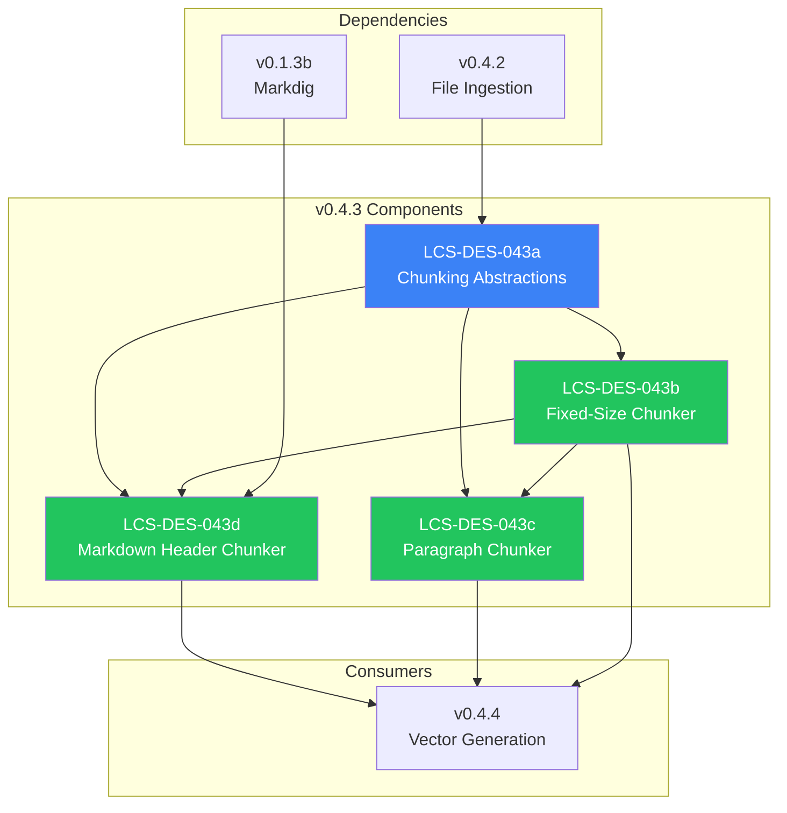

# LCS-DES-043-INDEX: Design Specification Index — The Splitter

## Document Control

| Field            | Value                              |
| :--------------- | :--------------------------------- |
| **Document ID**  | LCS-DES-043-INDEX                  |
| **Version**      | v0.4.3                             |
| **Codename**     | The Splitter (Chunking Strategies) |
| **Status**       | Draft                              |
| **Last Updated** | 2026-01-27                         |
| **Owner**        | Lead Architect                     |

---

## 1. Overview

This index provides navigation to all design specifications for **v0.4.3: The Splitter**, which implements a flexible chunking system for breaking documents into semantically meaningful segments suitable for embedding.

---

## 2. Design Specifications

| Document ID                       | Title                   | Description                                  | Status |
| :-------------------------------- | :---------------------- | :------------------------------------------- | :----- |
| [LCS-DES-043a](./LCS-DES-043a.md) | Chunking Abstractions   | Interfaces, enums, and records for chunking  | Draft  |
| [LCS-DES-043b](./LCS-DES-043b.md) | Fixed-Size Chunker      | Character-count based splitting with overlap | Draft  |
| [LCS-DES-043c](./LCS-DES-043c.md) | Paragraph Chunker       | Paragraph boundary detection and merging     | Draft  |
| [LCS-DES-043d](./LCS-DES-043d.md) | Markdown Header Chunker | Hierarchical header-based chunking           | Draft  |

---

## 3. Architecture Overview



---

## 4. Sub-Part Summary

### 4.1 LCS-DES-043a: Chunking Abstractions

**Purpose:** Defines the core interfaces and types for the chunking system.

**Key Components:**

- `ChunkingMode` enum (FixedSize, Paragraph, MarkdownHeader, Semantic)
- `IChunkingStrategy` interface
- `TextChunk` record (content, offsets, metadata)
- `ChunkMetadata` record (index, heading, level)
- `ChunkingOptions` record (size, overlap, boundaries)

**Module:** `Lexichord.Abstractions`

---

### 4.2 LCS-DES-043b: Fixed-Size Chunker

**Purpose:** Implements character-count based splitting with configurable overlap and word boundary respect.

**Key Components:**

- `FixedSizeChunkingStrategy` class
- Word boundary detection algorithm
- Overlap calculation
- Performance optimization for large texts

**Configuration:**

| Option                | Default | Description                     |
| :-------------------- | :------ | :------------------------------ |
| TargetSize            | 1000    | Target chunk size in characters |
| Overlap               | 100     | Overlap between chunks          |
| RespectWordBoundaries | true    | Don't split mid-word            |

**Module:** `Lexichord.Modules.RAG`

---

### 4.3 LCS-DES-043c: Paragraph Chunker

**Purpose:** Implements paragraph-aware chunking with intelligent merging and splitting.

**Key Components:**

- `ParagraphChunkingStrategy` class
- Double-newline paragraph detection
- Short paragraph merging (<200 chars)
- Long paragraph splitting (>2000 chars)
- Fixed-size fallback for oversized paragraphs

**Rules:**

| Scenario                     | Action                |
| :--------------------------- | :-------------------- |
| Paragraph < MinSize          | Merge with next       |
| Paragraph > MaxSize          | Split using FixedSize |
| Consecutive short paragraphs | Combine until MinSize |

**Module:** `Lexichord.Modules.RAG`

---

### 4.4 LCS-DES-043d: Markdown Header Chunker

**Purpose:** Implements hierarchical chunking based on Markdown header structure.

**Key Components:**

- `MarkdownHeaderChunkingStrategy` class
- Markdig-based Markdown parsing
- Header hierarchy detection
- Chunk boundary at header transitions
- Metadata preservation (heading text, level)

**Hierarchy Rules:**

| Current | Next | Action                              |
| :------ | :--- | :---------------------------------- |
| H1      | H1   | End chunk, start new                |
| H1      | H2   | Continue (nested)                   |
| H2      | H1   | End chunk, start new (higher level) |
| H2      | H2   | End chunk, start new (same level)   |
| H2      | H3   | Continue (nested)                   |

**Module:** `Lexichord.Modules.RAG`

---

## 5. Dependency Chain

```text
v0.4.3a (Abstractions)
    │
    ├── v0.4.3b (Fixed-Size) ─────────────────────┐
    │       │                                      │
    │       ├── v0.4.3c (Paragraph) ──────────────┼── v0.4.4 (Embedding)
    │       │       │                              │
    │       │       └── v0.4.3d (Markdown) ───────┘
    │       │               │
    │       └───────────────┘ (fallback)
    │
    └── v0.1.3b (Markdig) ── v0.4.3d (parsing)
```

---

## 6. Interface Dependencies

| Interface           | Source  | Used By                    |
| :------------------ | :------ | :------------------------- |
| `IChunkingStrategy` | v0.4.3a | All chunking strategies    |
| `IIngestionService` | v0.4.2a | Triggers chunking pipeline |
| `IConfiguration`    | v0.0.3d | Chunking options           |
| `MarkdownPipeline`  | v0.1.3b | Markdown parsing           |

---

## 7. New Types Introduced

### 7.1 Enums

| Enum           | Values                                         | Purpose            |
| :------------- | :--------------------------------------------- | :----------------- |
| `ChunkingMode` | FixedSize, Paragraph, MarkdownHeader, Semantic | Strategy selection |

### 7.2 Interfaces

| Interface           | Methods           | Purpose                     |
| :------------------ | :---------------- | :-------------------------- |
| `IChunkingStrategy` | `Mode`, `Split()` | Chunking algorithm contract |

### 7.3 Records

| Record            | Properties                                 | Purpose       |
| :---------------- | :----------------------------------------- | :------------ |
| `TextChunk`       | Content, StartOffset, EndOffset, Metadata  | Chunk output  |
| `ChunkMetadata`   | Index, Heading, Level, TotalChunks         | Chunk context |
| `ChunkingOptions` | TargetSize, Overlap, MinSize, MaxSize, ... | Configuration |

### 7.4 Classes

| Class                            | Implements          | Purpose                  |
| :------------------------------- | :------------------ | :----------------------- |
| `FixedSizeChunkingStrategy`      | `IChunkingStrategy` | Character-based chunking |
| `ParagraphChunkingStrategy`      | `IChunkingStrategy` | Paragraph-based chunking |
| `MarkdownHeaderChunkingStrategy` | `IChunkingStrategy` | Header-based chunking    |
| `ChunkingStrategyFactory`        | —                   | Strategy selection       |

---

## 8. Testing Strategy

| Sub-Part | Unit Tests                             | Integration Tests      |
| :------- | :------------------------------------- | :--------------------- |
| v0.4.3a  | Record validation, interface contracts | —                      |
| v0.4.3b  | Chunk sizes, overlap, word boundaries  | Large file performance |
| v0.4.3c  | Merging, splitting, edge cases         | Pipeline integration   |
| v0.4.3d  | Header detection, hierarchy, fallback  | Markdig integration    |

---

## 9. Related Documents

| Document                                | Relationship                  |
| :-------------------------------------- | :---------------------------- |
| [LCS-SBD-043](./LCS-SBD-043.md)         | Scope Breakdown for v0.4.3    |
| [LCS-SBD-042](../v0.4.2/LCS-SBD-042.md) | Predecessor (File Ingestion)  |
| [LCS-SBD-044](../v0.4.4/LCS-SBD-044.md) | Successor (Vector Generation) |
| [roadmap-v0.4.x](../roadmap-v0.4.x.md)  | Version roadmap               |

---

## 10. Revision History

| Version | Date       | Author         | Changes       |
| :------ | :--------- | :------------- | :------------ |
| 0.1     | 2026-01-27 | Lead Architect | Initial draft |

---
