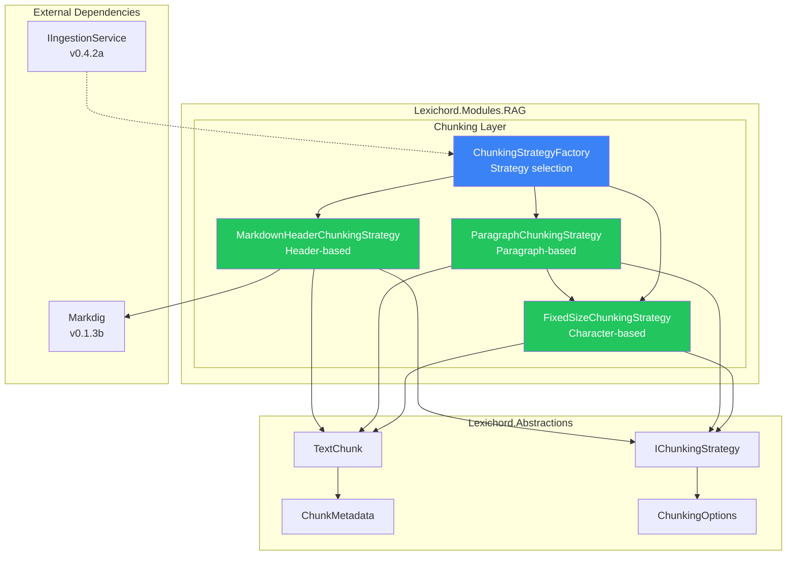
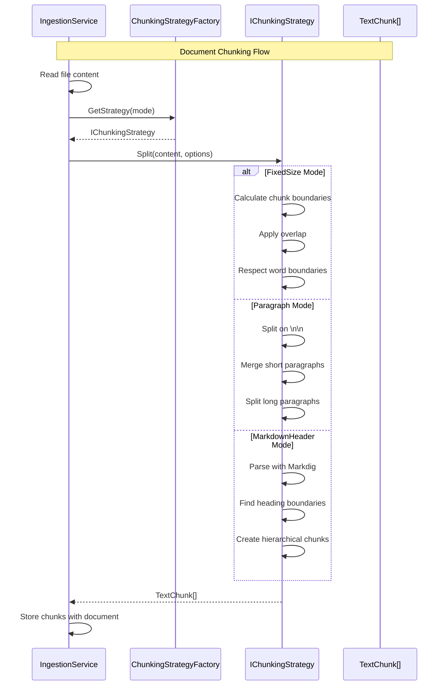

# LCS-SBD-043: Scope Breakdown — The Splitter

## Document Control

| Field            | Value                                    |
| :--------------- | :--------------------------------------- |
| **Document ID**  | LCS-SBD-043                              |
| **Version**      | v0.4.3                                   |
| **Codename**     | The Splitter (Chunking Strategies)       |
| **Status**       | Draft                                    |
| **Last Updated** | 2026-01-27                               |
| **Owner**        | Lead Architect                           |
| **Depends On**   | v0.4.2 (File Ingestion), v0.1.3b (Markdig) |

---

## 1. Executive Summary

### 1.1 The Vision

**v0.4.3** delivers **The Splitter** — a flexible chunking system that breaks documents into semantically meaningful text segments suitable for embedding. This release provides the critical bridge between raw document content (v0.4.2) and vector generation (v0.4.4), ensuring that text is divided in ways that preserve meaning and context.

Effective chunking is fundamental to RAG quality. Poor chunk boundaries can split sentences mid-thought, while oversized chunks dilute semantic precision. The Splitter provides three complementary strategies—fixed-size, paragraph-based, and Markdown-aware—allowing users to choose the approach that best fits their content.

### 1.2 Business Value

- **Semantic Precision:** Chunks aligned with natural text boundaries improve search relevance.
- **Flexible Strategies:** Multiple chunking modes for different document types.
- **Context Preservation:** Overlap and metadata maintain coherence across chunks.
- **Markdown Intelligence:** Header-aware chunking preserves document structure.
- **Extensible Design:** Strategy pattern enables future chunking algorithms.
- **Foundation:** Prepares text for embedding in v0.4.4.

### 1.3 Success Criteria

This release succeeds when:

1. `IChunkingStrategy` interface enables pluggable chunking algorithms.
2. `FixedSizeChunkingStrategy` splits text with configurable size and overlap.
3. `ParagraphChunkingStrategy` respects paragraph boundaries intelligently.
4. `MarkdownHeaderChunkingStrategy` creates hierarchical chunks from Markdown headers.
5. All strategies respect word boundaries and preserve metadata.

### 1.4 License Gating

Chunking is **Core** functionality. All license tiers can chunk documents. The semantic search that uses chunked content is gated at **Writer Pro** (v0.4.5).

---

## 2. Dependencies on Prior Versions

| Component                  | Source Version | Usage in v0.4.3                                  |
| :------------------------- | :------------- | :----------------------------------------------- |
| `IIngestionService`        | v0.4.2a        | Triggers chunking after file ingestion           |
| `Document`                 | v0.4.1c        | Document entity containing content               |
| `IConfigurationService`    | v0.0.3d        | Chunking configuration settings                  |
| `Markdig`                  | v0.1.3b        | Markdown parsing for header chunking             |
| `IMediator`                | v0.0.7a        | Publish chunking events                          |
| `Serilog`                  | v0.0.3b        | Structured logging                               |

---

## 3. Sub-Part Specifications

### 3.1 v0.4.3a: Chunking Abstractions

| Field            | Value                                     |
| :--------------- | :---------------------------------------- |
| **Sub-Part ID**  | RAG-043a                                  |
| **Title**        | Chunking Abstractions                     |
| **Module**       | `Lexichord.Abstractions`                  |
| **License Tier** | Core                                      |

**Goal:** Define `IChunkingStrategy` interface, `ChunkingMode` enum, and supporting types for pluggable chunking algorithms.

**Key Deliverables:**

- `IChunkingStrategy` interface for all chunking implementations
- `ChunkingMode` enum for strategy selection
- `TextChunk` record for chunk output
- `ChunkMetadata` record for chunk context
- `ChunkingOptions` record for configuration
- Unit tests for record validation

**Key Interfaces:**

```csharp
namespace Lexichord.Abstractions.Contracts;

/// <summary>
/// Available chunking strategies.
/// </summary>
public enum ChunkingMode
{
    /// <summary>Split by character count with overlap.</summary>
    FixedSize,
    /// <summary>Split on paragraph boundaries.</summary>
    Paragraph,
    /// <summary>Split on Markdown headers.</summary>
    MarkdownHeader,
    /// <summary>Split using semantic analysis (future).</summary>
    Semantic
}

/// <summary>
/// Strategy for splitting text into chunks.
/// </summary>
public interface IChunkingStrategy
{
    /// <summary>
    /// The chunking mode this strategy implements.
    /// </summary>
    ChunkingMode Mode { get; }

    /// <summary>
    /// Splits content into chunks.
    /// </summary>
    /// <param name="content">The text content to split.</param>
    /// <param name="options">Chunking configuration.</param>
    /// <returns>List of text chunks with metadata.</returns>
    IReadOnlyList<TextChunk> Split(string content, ChunkingOptions options);
}

/// <summary>
/// A chunk of text with position and metadata.
/// </summary>
/// <param name="Content">The text content of the chunk.</param>
/// <param name="StartOffset">Character offset from start of document.</param>
/// <param name="EndOffset">Character offset of end of chunk.</param>
/// <param name="Metadata">Additional context about the chunk.</param>
public record TextChunk(
    string Content,
    int StartOffset,
    int EndOffset,
    ChunkMetadata Metadata)
{
    /// <summary>Length of the chunk in characters.</summary>
    public int Length => EndOffset - StartOffset;
}

/// <summary>
/// Metadata about a chunk's context within the document.
/// </summary>
/// <param name="Index">Zero-based index of this chunk.</param>
/// <param name="Heading">Section heading if applicable.</param>
/// <param name="Level">Heading level (1-6) if applicable.</param>
public record ChunkMetadata(
    int Index,
    string? Heading = null,
    int Level = 0)
{
    /// <summary>Total chunks in the document (set during processing).</summary>
    public int TotalChunks { get; init; }
}

/// <summary>
/// Options for configuring chunking behavior.
/// </summary>
public record ChunkingOptions
{
    /// <summary>Target chunk size in characters (default: 1000).</summary>
    public int TargetSize { get; init; } = 1000;

    /// <summary>Overlap between chunks in characters (default: 100).</summary>
    public int Overlap { get; init; } = 100;

    /// <summary>Minimum chunk size before merging (default: 200).</summary>
    public int MinSize { get; init; } = 200;

    /// <summary>Maximum chunk size before splitting (default: 2000).</summary>
    public int MaxSize { get; init; } = 2000;

    /// <summary>Whether to respect word boundaries (default: true).</summary>
    public bool RespectWordBoundaries { get; init; } = true;

    /// <summary>Whether to preserve leading whitespace (default: false).</summary>
    public bool PreserveWhitespace { get; init; } = false;
}
```

**Dependencies:**

- None (defines abstractions only)

---

### 3.2 v0.4.3b: Fixed-Size Chunker

| Field            | Value                                     |
| :--------------- | :---------------------------------------- |
| **Sub-Part ID**  | RAG-043b                                  |
| **Title**        | Fixed-Size Chunker                        |
| **Module**       | `Lexichord.Modules.RAG`                   |
| **License Tier** | Core                                      |

**Goal:** Implement `FixedSizeChunkingStrategy` that splits text by character count with configurable overlap and word boundary respect.

**Key Deliverables:**

- `FixedSizeChunkingStrategy` implementation
- Character-based splitting with overlap
- Word boundary detection and respect
- Performance optimization for large texts
- Unit tests for edge cases

**Algorithm:**

```text
FIXED_SIZE_SPLIT(content, options):
│
├── Initialize chunks = []
├── Initialize position = 0
│
├── WHILE position < content.length:
│   │
│   ├── Calculate end = position + targetSize
│   │
│   ├── IF end >= content.length:
│   │   └── end = content.length
│   │
│   ├── IF respectWordBoundaries AND end < content.length:
│   │   │
│   │   ├── Find last space before end
│   │   │   └── IF found: end = lastSpaceIndex
│   │   │
│   │   ├── IF no space found in last 20% of chunk:
│   │   │   └── Find first space after original end
│   │   │       └── IF found within 10% overage: end = firstSpaceIndex
│   │   │
│   │   └── ELSE: Keep original end (no good boundary)
│   │
│   ├── Extract chunk = content[position..end]
│   │
│   ├── Create TextChunk with:
│   │   ├── Content = chunk.Trim() if not preserveWhitespace
│   │   ├── StartOffset = position
│   │   ├── EndOffset = end
│   │   └── Metadata = { Index = chunks.count }
│   │
│   ├── Add chunk to chunks
│   │
│   └── position = end - overlap
│       └── Ensure position advances at least 1 char
│
└── RETURN chunks
```

**Configuration:**

| Setting                | Default | Description                              |
| :--------------------- | :------ | :--------------------------------------- |
| `TargetSize`           | 1000    | Target chunk size in characters          |
| `Overlap`              | 100     | Overlap between chunks                   |
| `RespectWordBoundaries` | true   | Don't split mid-word                     |

**Dependencies:**

- v0.4.3a: `IChunkingStrategy`, `TextChunk`, `ChunkingOptions`

---

### 3.3 v0.4.3c: Paragraph Chunker

| Field            | Value                                     |
| :--------------- | :---------------------------------------- |
| **Sub-Part ID**  | RAG-043c                                  |
| **Title**        | Paragraph Chunker                         |
| **Module**       | `Lexichord.Modules.RAG`                   |
| **License Tier** | Core                                      |

**Goal:** Implement `ParagraphChunkingStrategy` that splits on paragraph boundaries, merges short paragraphs, and splits long ones.

**Key Deliverables:**

- `ParagraphChunkingStrategy` implementation
- Double-newline paragraph detection
- Short paragraph merging (<MinSize)
- Long paragraph splitting (>MaxSize)
- Fallback to fixed-size for oversized paragraphs
- Unit tests for merging and splitting logic

**Algorithm:**

```text
PARAGRAPH_SPLIT(content, options):
│
├── Split content on "\n\n" → raw_paragraphs
│
├── Initialize chunks = []
├── Initialize buffer = ""
├── Initialize bufferStart = 0
├── Initialize position = 0
│
├── FOR EACH paragraph IN raw_paragraphs:
│   │
│   ├── IF paragraph.length > maxSize:
│   │   │
│   │   ├── IF buffer is not empty:
│   │   │   └── Flush buffer as chunk
│   │   │
│   │   ├── Split paragraph using FixedSizeStrategy
│   │   └── Add sub-chunks to chunks
│   │
│   ├── ELSE IF buffer.length + paragraph.length < minSize:
│   │   │
│   │   └── Append paragraph to buffer (merge)
│   │
│   ├── ELSE IF buffer.length + paragraph.length <= targetSize:
│   │   │
│   │   └── Append paragraph to buffer
│   │
│   ├── ELSE:
│   │   │
│   │   ├── Flush buffer as chunk
│   │   └── Start new buffer with paragraph
│   │
│   └── Update position += paragraph.length + 2 (for \n\n)
│
├── IF buffer is not empty:
│   └── Flush remaining buffer as chunk
│
└── RETURN chunks
```

**Merging Rules:**

| Scenario                     | Action                          |
| :--------------------------- | :------------------------------ |
| Paragraph < MinSize          | Merge with next paragraph       |
| Buffer + Paragraph ≤ Target  | Continue merging                |
| Buffer + Paragraph > Target  | Flush buffer, start new         |
| Paragraph > MaxSize          | Split using FixedSizeStrategy   |

**Dependencies:**

- v0.4.3a: `IChunkingStrategy`, `TextChunk`, `ChunkingOptions`
- v0.4.3b: `FixedSizeChunkingStrategy` (fallback for long paragraphs)

---

### 3.4 v0.4.3d: Markdown Header Chunker

| Field            | Value                                     |
| :--------------- | :---------------------------------------- |
| **Sub-Part ID**  | RAG-043d                                  |
| **Title**        | Markdown Header Chunker                   |
| **Module**       | `Lexichord.Modules.RAG`                   |
| **License Tier** | Core                                      |

**Goal:** Implement `MarkdownHeaderChunkingStrategy` that creates hierarchical chunks based on Markdown header structure.

**Key Deliverables:**

- `MarkdownHeaderChunkingStrategy` implementation
- Markdig-based Markdown parsing
- Hierarchical chunk boundaries (content until next same/higher level header)
- Header text preservation in metadata
- Fallback for non-Markdown content
- Unit tests for header hierarchy

**Key Interfaces:**

```csharp
namespace Lexichord.Modules.RAG.Chunking;

/// <summary>
/// Chunks Markdown documents by header structure.
/// </summary>
public class MarkdownHeaderChunkingStrategy : IChunkingStrategy
{
    private readonly MarkdownPipeline _pipeline;
    private readonly IChunkingStrategy _fallback;

    public ChunkingMode Mode => ChunkingMode.MarkdownHeader;

    public MarkdownHeaderChunkingStrategy(IChunkingStrategy fallbackStrategy)
    {
        _pipeline = new MarkdownPipelineBuilder().Build();
        _fallback = fallbackStrategy;
    }

    public IReadOnlyList<TextChunk> Split(string content, ChunkingOptions options)
    {
        var document = Markdown.Parse(content, _pipeline);

        // Find all heading blocks
        var headings = document
            .Descendants<HeadingBlock>()
            .OrderBy(h => h.Line)
            .ToList();

        if (headings.Count == 0)
        {
            // No headers found, fall back to paragraph chunking
            return _fallback.Split(content, options);
        }

        return CreateHierarchicalChunks(content, headings, options);
    }
}
```

**Hierarchical Chunking Logic:**

```text
MARKDOWN_HEADER_SPLIT(content, headings, options):
│
├── Initialize chunks = []
├── Initialize lines = content.Split('\n')
│
├── FOR i = 0 TO headings.count - 1:
│   │
│   ├── currentHeading = headings[i]
│   ├── currentLevel = currentHeading.Level (1-6)
│   │
│   ├── Find end boundary:
│   │   │
│   │   ├── SCAN from i+1 to headings.count:
│   │   │   └── IF nextHeading.Level <= currentLevel:
│   │   │       └── endLine = nextHeading.Line - 1
│   │   │       └── BREAK
│   │   │
│   │   └── IF no boundary found:
│   │       └── endLine = lines.count - 1
│   │
│   ├── Extract content from currentHeading.Line to endLine
│   │
│   ├── IF content.length > maxSize:
│   │   │
│   │   ├── Split using FixedSizeStrategy
│   │   └── Preserve heading metadata in all sub-chunks
│   │
│   ├── ELSE:
│   │   │
│   │   └── Create single chunk with:
│   │       ├── Metadata.Heading = headerText
│   │       └── Metadata.Level = currentLevel
│   │
│   └── Add chunk(s) to chunks
│
└── RETURN chunks
```

**Example Transformation:**

```markdown
# Introduction
This is intro text.

## Background
Some background info.

## Methods
### Data Collection
Collection details.

### Analysis
Analysis details.

# Results
Final results.
```

Produces chunks:

| Index | Heading         | Level | Content Range        |
| :---- | :-------------- | :---- | :------------------- |
| 0     | Introduction    | 1     | "This is intro..."   |
| 1     | Background      | 2     | "Some background..." |
| 2     | Methods         | 2     | (empty or minimal)   |
| 3     | Data Collection | 3     | "Collection details" |
| 4     | Analysis        | 3     | "Analysis details"   |
| 5     | Results         | 1     | "Final results"      |

**Dependencies:**

- v0.4.3a: `IChunkingStrategy`, `TextChunk`, `ChunkMetadata`
- v0.4.3b: `FixedSizeChunkingStrategy` (fallback for long sections)
- v0.1.3b: `Markdig` for Markdown parsing

---

## 4. Implementation Checklist

| #  | Sub-Part | Task                                                      | Est. Hours |
| :- | :------- | :-------------------------------------------------------- | :--------- |
| 1  | v0.4.3a  | Create ChunkingMode enum                                  | 0.5        |
| 2  | v0.4.3a  | Create IChunkingStrategy interface                        | 0.5        |
| 3  | v0.4.3a  | Create TextChunk record                                   | 0.5        |
| 4  | v0.4.3a  | Create ChunkMetadata record                               | 0.5        |
| 5  | v0.4.3a  | Create ChunkingOptions record                             | 0.5        |
| 6  | v0.4.3a  | Unit tests for records and validation                     | 1          |
| 7  | v0.4.3b  | Implement FixedSizeChunkingStrategy core logic            | 2          |
| 8  | v0.4.3b  | Implement word boundary detection                         | 1.5        |
| 9  | v0.4.3b  | Implement overlap calculation                             | 1          |
| 10 | v0.4.3b  | Optimize for large text performance                       | 1          |
| 11 | v0.4.3b  | Unit tests for fixed-size chunking                        | 2          |
| 12 | v0.4.3c  | Implement ParagraphChunkingStrategy core logic            | 2          |
| 13 | v0.4.3c  | Implement paragraph merging                               | 1          |
| 14 | v0.4.3c  | Implement long paragraph splitting                        | 1          |
| 15 | v0.4.3c  | Unit tests for paragraph chunking                         | 2          |
| 16 | v0.4.3d  | Implement MarkdownHeaderChunkingStrategy core             | 2.5        |
| 17 | v0.4.3d  | Implement hierarchical boundary detection                 | 1.5        |
| 18 | v0.4.3d  | Implement header metadata extraction                      | 1          |
| 19 | v0.4.3d  | Implement fallback for non-Markdown                       | 0.5        |
| 20 | v0.4.3d  | Unit tests for Markdown chunking                          | 2          |
| 21 | All      | Create ChunkingStrategyFactory                            | 1          |
| 22 | All      | Integration tests for all strategies                      | 2          |
| 23 | All      | DI registration in RAGModule.cs                           | 0.5        |
| **Total** |   |                                                           | **27 hours** |

---

## 5. Dependency Matrix

### 5.1 Required Interfaces (from earlier versions)

| Interface                  | Source Version | Purpose                              |
| :------------------------- | :------------- | :----------------------------------- |
| `IConfigurationService`    | v0.0.3d        | Chunking configuration               |
| `IMediator`                | v0.0.7a        | Event publishing                     |
| `MarkdownPipeline`         | v0.1.3b        | Markdig Markdown parsing             |

### 5.2 New Interfaces (defined in v0.4.3)

| Interface                   | Defined In | Module        | Purpose                 |
| :-------------------------- | :--------- | :------------ | :---------------------- |
| `IChunkingStrategy`         | v0.4.3a    | Abstractions  | Chunking algorithm contract |

### 5.3 New Records/DTOs (defined in v0.4.3)

| Record                        | Defined In | Purpose                                |
| :---------------------------- | :--------- | :------------------------------------- |
| `TextChunk`                   | v0.4.3a    | Chunk with content and position        |
| `ChunkMetadata`               | v0.4.3a    | Chunk context (index, heading, level)  |
| `ChunkingOptions`             | v0.4.3a    | Configuration options                  |

### 5.4 New Implementations (defined in v0.4.3)

| Class                           | Defined In | Purpose                              |
| :------------------------------ | :--------- | :----------------------------------- |
| `FixedSizeChunkingStrategy`     | v0.4.3b    | Character-count based splitting      |
| `ParagraphChunkingStrategy`     | v0.4.3c    | Paragraph-boundary splitting         |
| `MarkdownHeaderChunkingStrategy`| v0.4.3d    | Header-hierarchy splitting           |
| `ChunkingStrategyFactory`       | v0.4.3     | Factory for strategy selection       |

### 5.5 NuGet Packages

| Package                        | Version | Purpose                    | New/Existing |
| :----------------------------- | :------ | :------------------------- | :----------- |
| `Markdig`                      | 0.37.x  | Markdown parsing           | Existing     |

---

## 6. Architecture Diagram



---

## 7. Data Flow Diagram



---

## 8. Risks & Mitigations

| Risk | Impact | Probability | Mitigation |
| :--- | :----- | :---------- | :--------- |
| Very large documents causing memory pressure | Medium | Low | Stream-based processing for >10MB files |
| Markdown parsing failures | Medium | Low | Fallback to paragraph chunking |
| Inconsistent chunk sizes | Low | Medium | Min/max bounds with merging/splitting |
| Word boundary detection edge cases | Low | Medium | Comprehensive test suite for Unicode |
| Performance degradation with deep nesting | Low | Low | Flatten headers beyond level 4 |
| Empty chunks from sparse headers | Low | Medium | Filter empty chunks, merge with siblings |

---

## 9. Success Metrics

| Metric | Target | Measurement |
| :----- | :----- | :---------- |
| Chunking speed (1MB document) | < 100ms | Stopwatch timing |
| Average chunk size variance | < 20% of target | Standard deviation |
| Word boundary violations | 0% | Unit test coverage |
| Markdown header detection | > 99% | Test against corpus |
| Memory usage (10MB document) | < 50MB peak | Memory profiler |
| Empty chunk rate | < 5% | Filter/merge effectiveness |

---

## 10. What This Enables

After v0.4.3, Lexichord will support:

- **v0.4.4 (Vector Generation):** Embed chunked text into vectors.
- **v0.4.5 (Semantic Search):** Search within semantically meaningful chunks.
- **v0.4.6 (Reference Panel):** Display chunk previews with headings.
- **v0.4.7 (Index Manager):** Show chunk counts per document.

---

## 11. Decision Trees

### 11.1 Strategy Selection

```text
START: "Which chunking strategy to use?"
│
├── Is content Markdown with headers?
│   ├── YES → Use MarkdownHeaderChunkingStrategy
│   └── NO → Continue
│
├── Does content have clear paragraph structure?
│   ├── YES → Use ParagraphChunkingStrategy
│   └── NO → Continue
│
├── Is content unstructured or code?
│   └── Use FixedSizeChunkingStrategy
│
└── DEFAULT: ParagraphChunkingStrategy
```

### 11.2 Chunk Size Management

```text
START: "How to handle this chunk's size?"
│
├── Is chunk.length < MinSize?
│   ├── Is there a previous uncommitted chunk?
│   │   ├── YES → Merge with previous
│   │   └── NO → Hold in buffer for next
│   └── Continue
│
├── Is chunk.length > MaxSize?
│   └── Split using FixedSizeStrategy with overlap
│
├── Is chunk.length within [MinSize, MaxSize]?
│   └── Accept as-is
│
└── END
```

---

## 12. User Stories

| ID    | Role            | Story                                                                               | Acceptance Criteria                                   |
| :---- | :-------------- | :---------------------------------------------------------------------------------- | :---------------------------------------------------- |
| US-01 | Writer          | As a writer, I want my documents split into meaningful chunks.                      | Documents chunked by paragraphs.                      |
| US-02 | Writer          | As a writer, I want Markdown structure preserved in chunking.                       | Headers create chunk boundaries.                      |
| US-03 | Writer          | As a writer, I want chunks to not split mid-sentence.                               | Word boundaries respected.                            |
| US-04 | Developer       | As a developer, I want configurable chunk sizes.                                    | TargetSize, Overlap configurable.                     |
| US-05 | Developer       | As a developer, I want to select chunking strategy per document.                    | ChunkingMode enum for selection.                      |
| US-06 | Developer       | As a developer, I want chunk metadata for context.                                  | Index, Heading, Level in metadata.                    |

---

## 13. Use Cases

### UC-01: Chunking Plain Text

**Preconditions:**

- Document ingested successfully
- Content is plain text without headers

**Flow:**

1. IngestionService reads file content.
2. ChunkingStrategyFactory returns ParagraphChunkingStrategy.
3. Strategy splits on `\n\n` boundaries.
4. Short paragraphs merged (< 200 chars).
5. Long paragraphs split (> 2000 chars).
6. Chunks returned with sequential indices.

**Postconditions:**

- Chunks ready for embedding
- Each chunk between MinSize and MaxSize

---

### UC-02: Chunking Markdown Document

**Preconditions:**

- Document is Markdown with headers
- Markdig available for parsing

**Flow:**

1. IngestionService reads Markdown content.
2. ChunkingStrategyFactory returns MarkdownHeaderChunkingStrategy.
3. Markdig parses document AST.
4. Strategy identifies heading blocks.
5. Chunks created at heading boundaries.
6. Header text stored in ChunkMetadata.Heading.
7. Header level stored in ChunkMetadata.Level.

**Postconditions:**

- Chunks aligned with document structure
- Metadata preserves navigation context

---

### UC-03: Handling Long Section

**Preconditions:**

- Markdown section exceeds MaxSize
- Section has no sub-headers

**Flow:**

1. MarkdownHeaderChunkingStrategy identifies oversized section.
2. Falls back to FixedSizeChunkingStrategy.
3. Section split with overlap.
4. All sub-chunks retain parent heading metadata.
5. Sub-chunks indexed sequentially within section.

**Postconditions:**

- No chunk exceeds MaxSize
- Section context preserved in all sub-chunks

---

## 14. Unit Testing Requirements

### 14.1 FixedSizeChunkingStrategy Tests

```csharp
[Trait("Category", "Unit")]
[Trait("Feature", "v0.4.3b")]
public class FixedSizeChunkingStrategyTests
{
    private readonly FixedSizeChunkingStrategy _sut = new();

    [Fact]
    public void Split_WithShortContent_ReturnsSingleChunk()
    {
        // Arrange
        var content = "This is a short text.";
        var options = new ChunkingOptions { TargetSize = 1000 };

        // Act
        var chunks = _sut.Split(content, options);

        // Assert
        chunks.Should().HaveCount(1);
        chunks[0].Content.Should().Be(content);
        chunks[0].StartOffset.Should().Be(0);
        chunks[0].EndOffset.Should().Be(content.Length);
    }

    [Fact]
    public void Split_WithLongContent_CreatesOverlappingChunks()
    {
        // Arrange
        var content = new string('a', 2500);
        var options = new ChunkingOptions { TargetSize = 1000, Overlap = 100 };

        // Act
        var chunks = _sut.Split(content, options);

        // Assert
        chunks.Should().HaveCountGreaterThan(1);

        // Verify overlap
        var firstChunkEnd = chunks[0].EndOffset;
        var secondChunkStart = chunks[1].StartOffset;
        (firstChunkEnd - secondChunkStart).Should().BeGreaterOrEqualTo(100);
    }

    [Fact]
    public void Split_RespectsWordBoundaries()
    {
        // Arrange
        var content = "The quick brown fox jumps over the lazy dog repeatedly.";
        var options = new ChunkingOptions
        {
            TargetSize = 20,
            Overlap = 5,
            RespectWordBoundaries = true
        };

        // Act
        var chunks = _sut.Split(content, options);

        // Assert
        foreach (var chunk in chunks)
        {
            // Chunks should not start or end mid-word
            if (chunk.StartOffset > 0)
            {
                content[chunk.StartOffset - 1].Should().Be(' ');
            }
        }
    }

    [Theory]
    [InlineData(500, 50)]
    [InlineData(1000, 100)]
    [InlineData(2000, 200)]
    public void Split_WithDifferentSizes_ProducesCorrectChunkSizes(
        int targetSize, int overlap)
    {
        // Arrange
        var content = new string('x', 10000);
        var options = new ChunkingOptions
        {
            TargetSize = targetSize,
            Overlap = overlap
        };

        // Act
        var chunks = _sut.Split(content, options);

        // Assert
        foreach (var chunk in chunks.Take(chunks.Count - 1))
        {
            chunk.Length.Should().BeCloseTo(targetSize, (uint)(targetSize * 0.1));
        }
    }
}
```

### 14.2 ParagraphChunkingStrategy Tests

```csharp
[Trait("Category", "Unit")]
[Trait("Feature", "v0.4.3c")]
public class ParagraphChunkingStrategyTests
{
    private readonly ParagraphChunkingStrategy _sut;

    public ParagraphChunkingStrategyTests()
    {
        _sut = new ParagraphChunkingStrategy(new FixedSizeChunkingStrategy());
    }

    [Fact]
    public void Split_SeparatesParagraphs()
    {
        // Arrange
        var content = "First paragraph.\n\nSecond paragraph.\n\nThird paragraph.";
        var options = new ChunkingOptions();

        // Act
        var chunks = _sut.Split(content, options);

        // Assert
        chunks.Should().HaveCount(3);
        chunks[0].Content.Should().Contain("First");
        chunks[1].Content.Should().Contain("Second");
        chunks[2].Content.Should().Contain("Third");
    }

    [Fact]
    public void Split_MergesShortParagraphs()
    {
        // Arrange
        var content = "Hi.\n\nHello.\n\nHey.";
        var options = new ChunkingOptions { MinSize = 200 };

        // Act
        var chunks = _sut.Split(content, options);

        // Assert
        chunks.Should().HaveCount(1);
        chunks[0].Content.Should().Contain("Hi").And.Contain("Hello").And.Contain("Hey");
    }

    [Fact]
    public void Split_SplitsLongParagraphs()
    {
        // Arrange
        var longParagraph = new string('a', 3000);
        var content = $"Short.\n\n{longParagraph}\n\nShort again.";
        var options = new ChunkingOptions { MaxSize = 2000 };

        // Act
        var chunks = _sut.Split(content, options);

        // Assert
        var longChunks = chunks.Where(c => c.Content.Contains('a')).ToList();
        longChunks.Should().HaveCountGreaterThan(1);
    }
}
```

### 14.3 MarkdownHeaderChunkingStrategy Tests

```csharp
[Trait("Category", "Unit")]
[Trait("Feature", "v0.4.3d")]
public class MarkdownHeaderChunkingStrategyTests
{
    private readonly MarkdownHeaderChunkingStrategy _sut;

    public MarkdownHeaderChunkingStrategyTests()
    {
        _sut = new MarkdownHeaderChunkingStrategy(new ParagraphChunkingStrategy());
    }

    [Fact]
    public void Split_CreatesChunksPerHeader()
    {
        // Arrange
        var content = """
            # Introduction
            Intro content here.

            # Methods
            Methods content here.

            # Results
            Results content here.
            """;
        var options = new ChunkingOptions();

        // Act
        var chunks = _sut.Split(content, options);

        // Assert
        chunks.Should().HaveCount(3);
        chunks[0].Metadata.Heading.Should().Be("Introduction");
        chunks[1].Metadata.Heading.Should().Be("Methods");
        chunks[2].Metadata.Heading.Should().Be("Results");
    }

    [Fact]
    public void Split_RespectsHeaderHierarchy()
    {
        // Arrange
        var content = """
            # Chapter 1
            Chapter intro.

            ## Section 1.1
            Section content.

            ## Section 1.2
            More content.

            # Chapter 2
            Next chapter.
            """;
        var options = new ChunkingOptions();

        // Act
        var chunks = _sut.Split(content, options);

        // Assert
        chunks.Should().HaveCount(4);
        chunks[0].Metadata.Level.Should().Be(1);
        chunks[1].Metadata.Level.Should().Be(2);
        chunks[2].Metadata.Level.Should().Be(2);
        chunks[3].Metadata.Level.Should().Be(1);
    }

    [Fact]
    public void Split_FallsBackForNoHeaders()
    {
        // Arrange
        var content = "Just some plain text.\n\nWith paragraphs.\n\nBut no headers.";
        var options = new ChunkingOptions();

        // Act
        var chunks = _sut.Split(content, options);

        // Assert
        chunks.Should().NotBeEmpty();
        chunks.All(c => c.Metadata.Heading == null).Should().BeTrue();
    }

    [Fact]
    public void Split_PreservesHeaderMetadata()
    {
        // Arrange
        var content = """
            ## Background
            This is background information.
            """;
        var options = new ChunkingOptions();

        // Act
        var chunks = _sut.Split(content, options);

        // Assert
        chunks[0].Metadata.Heading.Should().Be("Background");
        chunks[0].Metadata.Level.Should().Be(2);
        chunks[0].Metadata.Index.Should().Be(0);
    }
}
```

---

## 15. Observability & Logging

| Level   | Source                         | Message Template                                                       |
| :------ | :----------------------------- | :--------------------------------------------------------------------- |
| Debug   | ChunkingStrategyFactory        | `Selected chunking strategy: {Mode}`                                   |
| Debug   | FixedSizeChunkingStrategy      | `Splitting {ContentLength} chars with target {TargetSize}`             |
| Debug   | FixedSizeChunkingStrategy      | `Created {ChunkCount} chunks with {Overlap} char overlap`              |
| Debug   | ParagraphChunkingStrategy      | `Found {ParagraphCount} paragraphs`                                    |
| Debug   | ParagraphChunkingStrategy      | `Merged {MergeCount} short paragraphs`                                 |
| Debug   | ParagraphChunkingStrategy      | `Split {SplitCount} long paragraphs`                                   |
| Debug   | MarkdownHeaderChunkingStrategy | `Found {HeaderCount} headers in document`                              |
| Debug   | MarkdownHeaderChunkingStrategy | `Created chunk for header: {Heading} (level {Level})`                  |
| Info    | MarkdownHeaderChunkingStrategy | `No headers found, falling back to paragraph chunking`                 |
| Warning | FixedSizeChunkingStrategy      | `Chunk exceeds MaxSize after word boundary adjustment: {Size}`         |
| Info    | All                            | `Chunking complete: {ChunkCount} chunks from {ContentLength} chars`    |

---

## 16. UI/UX Specifications

**None.** v0.4.3 is a backend processing release. Chunk visualization will appear in v0.4.6 (Reference Panel) search results.

---

## 17. Acceptance Criteria (QA)

| #   | Category            | Criterion                                                                    |
| :-- | :------------------ | :--------------------------------------------------------------------------- |
| 1   | **[FixedSize]**     | Chunks created at target size (±10%).                                        |
| 2   | **[FixedSize]**     | Overlap applied between consecutive chunks.                                  |
| 3   | **[FixedSize]**     | Word boundaries respected (no mid-word splits).                              |
| 4   | **[Paragraph]**     | Splits occur on `\n\n` boundaries.                                           |
| 5   | **[Paragraph]**     | Short paragraphs (<MinSize) merged with adjacent.                            |
| 6   | **[Paragraph]**     | Long paragraphs (>MaxSize) split using fixed-size.                           |
| 7   | **[Markdown]**      | Headers create chunk boundaries.                                             |
| 8   | **[Markdown]**      | Header text preserved in metadata.                                           |
| 9   | **[Markdown]**      | Header level (1-6) recorded in metadata.                                     |
| 10  | **[Markdown]**      | Hierarchical boundaries respected.                                           |
| 11  | **[Markdown]**      | Falls back gracefully for non-Markdown.                                      |
| 12  | **[Metadata]**      | All chunks have sequential Index.                                            |
| 13  | **[Metadata]**      | StartOffset and EndOffset accurate.                                          |
| 14  | **[Metadata]**      | TotalChunks set correctly.                                                   |
| 15  | **[Performance]**   | 1MB document chunked in < 100ms.                                             |
| 16  | **[Performance]**   | Memory usage < 50MB for 10MB document.                                       |

---

## 18. Verification Commands

```bash
# ═══════════════════════════════════════════════════════════════════════════
# v0.4.3 Verification
# ═══════════════════════════════════════════════════════════════════════════

# 1. Build solution
dotnet build

# 2. Run unit tests for v0.4.3 components
dotnet test --filter "Category=Unit&FullyQualifiedName~Chunking"
dotnet test --filter "Feature=v0.4.3a"
dotnet test --filter "Feature=v0.4.3b"
dotnet test --filter "Feature=v0.4.3c"
dotnet test --filter "Feature=v0.4.3d"

# 3. Run integration tests
dotnet test --filter "Category=Integration&FullyQualifiedName~Chunking"

# 4. Verify chunking strategies registered
# Check RAGModule.cs for strategy registrations

# 5. Manual verification - Fixed size
# a) Create 3000 character document
# b) Chunk with TargetSize=1000, Overlap=100
# c) Verify ~4 chunks created

# 6. Manual verification - Markdown
# a) Create Markdown with 3 level-1 headers
# b) Chunk with MarkdownHeader mode
# c) Verify 3 chunks with header metadata
```

---

## 19. Deliverable Checklist

| #  | Deliverable                                                    | Status |
| :- | :------------------------------------------------------------- | :----- |
| 1  | `ChunkingMode` enum                                            | [ ]    |
| 2  | `IChunkingStrategy` interface                                  | [ ]    |
| 3  | `TextChunk` record                                             | [ ]    |
| 4  | `ChunkMetadata` record                                         | [ ]    |
| 5  | `ChunkingOptions` record                                       | [ ]    |
| 6  | `FixedSizeChunkingStrategy` implementation                     | [ ]    |
| 7  | `ParagraphChunkingStrategy` implementation                     | [ ]    |
| 8  | `MarkdownHeaderChunkingStrategy` implementation                | [ ]    |
| 9  | `ChunkingStrategyFactory` implementation                       | [ ]    |
| 10 | Unit tests for FixedSizeChunkingStrategy                       | [ ]    |
| 11 | Unit tests for ParagraphChunkingStrategy                       | [ ]    |
| 12 | Unit tests for MarkdownHeaderChunkingStrategy                  | [ ]    |
| 13 | Integration tests for chunking pipeline                        | [ ]    |
| 14 | DI registration in RAGModule.cs                                | [ ]    |

---

## 20. Code Examples

### 20.1 FixedSizeChunkingStrategy Implementation

```csharp
namespace Lexichord.Modules.RAG.Chunking;

/// <summary>
/// Splits text into fixed-size chunks with configurable overlap.
/// Respects word boundaries to avoid splitting mid-word.
/// </summary>
public sealed class FixedSizeChunkingStrategy : IChunkingStrategy
{
    private readonly ILogger<FixedSizeChunkingStrategy> _logger;

    public ChunkingMode Mode => ChunkingMode.FixedSize;

    public FixedSizeChunkingStrategy(ILogger<FixedSizeChunkingStrategy> logger)
    {
        _logger = logger;
    }

    public IReadOnlyList<TextChunk> Split(string content, ChunkingOptions options)
    {
        if (string.IsNullOrEmpty(content))
        {
            return Array.Empty<TextChunk>();
        }

        _logger.LogDebug(
            "Splitting {ContentLength} chars with target {TargetSize}",
            content.Length, options.TargetSize);

        var chunks = new List<TextChunk>();
        var position = 0;
        var index = 0;

        while (position < content.Length)
        {
            var end = Math.Min(position + options.TargetSize, content.Length);

            // Adjust to word boundary if enabled and not at end
            if (options.RespectWordBoundaries && end < content.Length)
            {
                end = FindWordBoundary(content, position, end, options.TargetSize);
            }

            var chunkContent = content[position..end];

            if (!options.PreserveWhitespace)
            {
                chunkContent = chunkContent.Trim();
            }

            if (!string.IsNullOrWhiteSpace(chunkContent))
            {
                chunks.Add(new TextChunk(
                    chunkContent,
                    position,
                    end,
                    new ChunkMetadata(index++)));
            }

            // Move position, accounting for overlap
            var advance = end - position - options.Overlap;
            position += Math.Max(advance, 1); // Ensure progress
        }

        // Set total chunks in metadata
        var totalChunks = chunks.Count;
        for (var i = 0; i < chunks.Count; i++)
        {
            chunks[i] = chunks[i] with
            {
                Metadata = chunks[i].Metadata with { TotalChunks = totalChunks }
            };
        }

        _logger.LogDebug(
            "Created {ChunkCount} chunks with {Overlap} char overlap",
            chunks.Count, options.Overlap);

        return chunks;
    }

    private static int FindWordBoundary(
        string content, int start, int idealEnd, int targetSize)
    {
        // Look backwards for a space
        var searchStart = Math.Max(start, idealEnd - (int)(targetSize * 0.2));
        for (var i = idealEnd - 1; i >= searchStart; i--)
        {
            if (char.IsWhiteSpace(content[i]))
            {
                return i + 1; // Include the space in previous chunk
            }
        }

        // No space found backwards, look forward briefly
        var searchEnd = Math.Min(content.Length, idealEnd + (int)(targetSize * 0.1));
        for (var i = idealEnd; i < searchEnd; i++)
        {
            if (char.IsWhiteSpace(content[i]))
            {
                return i + 1;
            }
        }

        // No good boundary, keep original
        return idealEnd;
    }
}
```

### 20.2 ParagraphChunkingStrategy Implementation

```csharp
namespace Lexichord.Modules.RAG.Chunking;

/// <summary>
/// Splits text on paragraph boundaries, merging short and splitting long paragraphs.
/// </summary>
public sealed class ParagraphChunkingStrategy : IChunkingStrategy
{
    private readonly IChunkingStrategy _fixedSizeFallback;
    private readonly ILogger<ParagraphChunkingStrategy> _logger;

    public ChunkingMode Mode => ChunkingMode.Paragraph;

    public ParagraphChunkingStrategy(
        FixedSizeChunkingStrategy fixedSizeFallback,
        ILogger<ParagraphChunkingStrategy> logger)
    {
        _fixedSizeFallback = fixedSizeFallback;
        _logger = logger;
    }

    public IReadOnlyList<TextChunk> Split(string content, ChunkingOptions options)
    {
        if (string.IsNullOrEmpty(content))
        {
            return Array.Empty<TextChunk>();
        }

        var paragraphs = content.Split(
            new[] { "\n\n", "\r\n\r\n" },
            StringSplitOptions.RemoveEmptyEntries);

        _logger.LogDebug("Found {ParagraphCount} paragraphs", paragraphs.Length);

        var chunks = new List<TextChunk>();
        var buffer = new StringBuilder();
        var bufferStart = 0;
        var position = 0;
        var mergeCount = 0;
        var splitCount = 0;

        foreach (var paragraph in paragraphs)
        {
            var trimmed = paragraph.Trim();

            if (trimmed.Length > options.MaxSize)
            {
                // Flush buffer first
                if (buffer.Length > 0)
                {
                    chunks.Add(CreateChunk(buffer.ToString(), bufferStart, chunks.Count));
                    buffer.Clear();
                }

                // Split long paragraph
                var subChunks = _fixedSizeFallback.Split(trimmed, options);
                foreach (var subChunk in subChunks)
                {
                    chunks.Add(subChunk with
                    {
                        StartOffset = position + subChunk.StartOffset,
                        EndOffset = position + subChunk.EndOffset,
                        Metadata = subChunk.Metadata with { Index = chunks.Count }
                    });
                }
                splitCount++;
            }
            else if (buffer.Length + trimmed.Length < options.MinSize)
            {
                // Merge short paragraphs
                if (buffer.Length > 0) buffer.Append("\n\n");
                buffer.Append(trimmed);
                mergeCount++;
            }
            else if (buffer.Length + trimmed.Length <= options.TargetSize)
            {
                // Continue building
                if (buffer.Length > 0) buffer.Append("\n\n");
                buffer.Append(trimmed);
            }
            else
            {
                // Flush and start new
                if (buffer.Length > 0)
                {
                    chunks.Add(CreateChunk(buffer.ToString(), bufferStart, chunks.Count));
                }
                buffer.Clear();
                buffer.Append(trimmed);
                bufferStart = position;
            }

            position += paragraph.Length + 2; // Account for \n\n
        }

        // Flush remaining
        if (buffer.Length > 0)
        {
            chunks.Add(CreateChunk(buffer.ToString(), bufferStart, chunks.Count));
        }

        _logger.LogDebug("Merged {MergeCount} short paragraphs", mergeCount);
        _logger.LogDebug("Split {SplitCount} long paragraphs", splitCount);

        // Set total chunks
        var total = chunks.Count;
        return chunks.Select(c => c with
        {
            Metadata = c.Metadata with { TotalChunks = total }
        }).ToList();
    }

    private static TextChunk CreateChunk(string content, int start, int index)
    {
        return new TextChunk(
            content,
            start,
            start + content.Length,
            new ChunkMetadata(index));
    }
}
```

### 20.3 ChunkingStrategyFactory Implementation

```csharp
namespace Lexichord.Modules.RAG.Chunking;

/// <summary>
/// Factory for selecting chunking strategies.
/// </summary>
public sealed class ChunkingStrategyFactory
{
    private readonly IServiceProvider _services;
    private readonly ILogger<ChunkingStrategyFactory> _logger;

    public ChunkingStrategyFactory(
        IServiceProvider services,
        ILogger<ChunkingStrategyFactory> logger)
    {
        _services = services;
        _logger = logger;
    }

    /// <summary>
    /// Gets the appropriate chunking strategy for the specified mode.
    /// </summary>
    public IChunkingStrategy GetStrategy(ChunkingMode mode)
    {
        _logger.LogDebug("Selected chunking strategy: {Mode}", mode);

        return mode switch
        {
            ChunkingMode.FixedSize => _services.GetRequiredService<FixedSizeChunkingStrategy>(),
            ChunkingMode.Paragraph => _services.GetRequiredService<ParagraphChunkingStrategy>(),
            ChunkingMode.MarkdownHeader => _services.GetRequiredService<MarkdownHeaderChunkingStrategy>(),
            ChunkingMode.Semantic => throw new NotSupportedException(
                "Semantic chunking will be available in a future release."),
            _ => throw new ArgumentOutOfRangeException(nameof(mode))
        };
    }

    /// <summary>
    /// Auto-detects the best strategy for the content.
    /// </summary>
    public IChunkingStrategy GetStrategy(string content, string? fileExtension = null)
    {
        // Markdown detection
        if (fileExtension?.Equals(".md", StringComparison.OrdinalIgnoreCase) == true ||
            content.Contains("\n# ") ||
            content.StartsWith("# "))
        {
            return GetStrategy(ChunkingMode.MarkdownHeader);
        }

        // Default to paragraph
        return GetStrategy(ChunkingMode.Paragraph);
    }
}
```

---

## 21. Deferred Features

| Feature                         | Deferred To | Reason                                          |
| :------------------------------ | :---------- | :---------------------------------------------- |
| Semantic chunking (NLP-based)   | v0.6.x      | Requires embedding model integration            |
| Sentence-level chunking         | v0.5.x      | Needs sentence tokenizer                        |
| Code-aware chunking             | v0.5.x      | Requires language-specific parsers              |
| Streaming chunking for large files | v0.4.8   | Performance optimization                        |
| Custom chunking rules           | v0.4.7      | UI for configuration                            |

---

## 22. Changelog Entry

Upon completion of v0.4.3, the following entry will be added to `CHANGELOG.md`:

```markdown
## [0.4.3] - YYYY-MM-DD

### Added

- **Chunking Strategies**: Flexible document chunking for RAG
- **Fixed-Size Chunker**: Character-count based splitting with overlap
- **Paragraph Chunker**: Natural paragraph boundary detection
- **Markdown Header Chunker**: Hierarchical header-based chunking
- **Chunk Metadata**: Index, heading, and level tracking

### Technical

- `IChunkingStrategy` interface for pluggable chunking algorithms
- `TextChunk` record with position and metadata
- `ChunkMetadata` record for chunk context
- `ChunkingOptions` for configurable behavior
- `ChunkingStrategyFactory` for strategy selection
- Word boundary respect in fixed-size chunking
- Short paragraph merging and long paragraph splitting
- Markdig-based Markdown parsing for header detection

### Performance

- Chunking speed: < 100ms for 1MB document
- Memory usage: < 50MB for 10MB document
```

---
