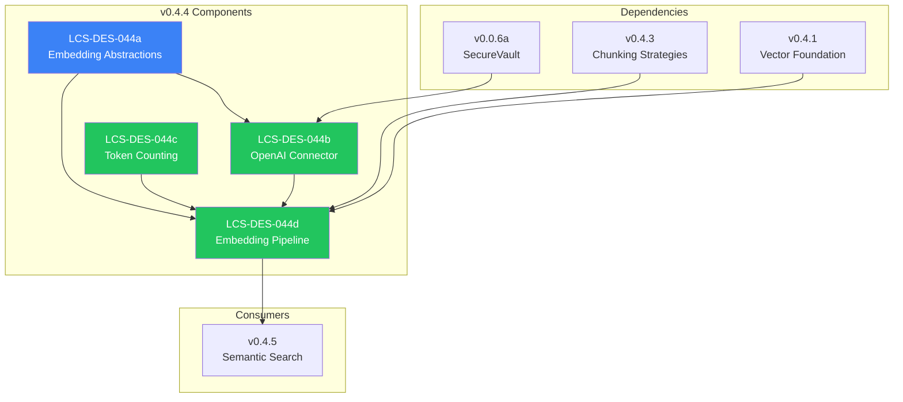

# LCS-DES-044-INDEX: Design Specification Index — The Embedder

## Document Control

| Field            | Value                                    |
| :--------------- | :--------------------------------------- |
| **Document ID**  | LCS-DES-044-INDEX                        |
| **Version**      | v0.4.4                                   |
| **Codename**     | The Embedder (Vector Generation)         |
| **Status**       | Draft                                    |
| **Last Updated** | 2026-01-27                               |
| **Owner**        | Lead Architect                           |

---

## 1. Overview

This index provides navigation to all design specifications for **v0.4.4: The Embedder**, which implements vector generation using external embedding APIs to convert text chunks into high-dimensional vectors for semantic search.

---

## 2. Design Specifications

| Document ID    | Title                      | Description                                      | Status |
| :------------- | :------------------------- | :----------------------------------------------- | :----- |
| [LCS-DES-044a](./LCS-DES-044a.md) | Embedding Abstractions | Interfaces and records for embedding | Draft |
| [LCS-DES-044b](./LCS-DES-044b.md) | OpenAI Connector | OpenAI API integration with retry logic | Draft |
| [LCS-DES-044c](./LCS-DES-044c.md) | Token Counting | Token validation and text truncation | Draft |
| [LCS-DES-044d](./LCS-DES-044d.md) | Embedding Pipeline | Document indexing orchestration | Draft |

---

## 3. Architecture Overview



---

## 4. Sub-Part Summary

### 4.1 LCS-DES-044a: Embedding Abstractions

**Purpose:** Defines the core interfaces and types for the embedding system.

**Key Components:**

- `IEmbeddingService` interface (`EmbedAsync`, `EmbedBatchAsync`)
- `EmbeddingOptions` record (model, dimensions, timeout)
- `EmbeddingResult` record (embedding, tokens, latency)

**Module:** `Lexichord.Abstractions`

---

### 4.2 LCS-DES-044b: OpenAI Connector

**Purpose:** Implements embedding generation using OpenAI's `text-embedding-3-small` model.

**Key Components:**

- `OpenAIEmbeddingService` class
- Polly retry policy (exponential backoff)
- Batch request support (up to 100 texts)
- Secure API key retrieval via `ISecureVault`

**Configuration:**

| Option | Default | Description |
| :----- | :------ | :---------- |
| Model | text-embedding-3-small | OpenAI model |
| Dimensions | 1536 | Vector size |
| MaxBatchSize | 100 | Texts per request |
| MaxRetries | 3 | Retry attempts |

**Module:** `Lexichord.Modules.RAG`

---

### 4.3 LCS-DES-044c: Token Counting

**Purpose:** Validates text size and truncates oversized content before embedding.

**Key Components:**

- `ITokenCounter` interface
- `TiktokenTokenCounter` using `Microsoft.ML.Tokenizers`
- `TruncateToTokenLimit` method with warning logs

**Token Limits:**

| Model | Max Tokens | Encoding |
| :---- | :--------- | :------- |
| text-embedding-3-small | 8191 | cl100k_base |

**Module:** `Lexichord.Modules.RAG`

---

### 4.4 LCS-DES-044d: Embedding Pipeline

**Purpose:** Orchestrates the complete document indexing flow.

**Key Components:**

- `DocumentIndexingPipeline` orchestrator
- Integration with chunking, token counting, embedding, storage
- `DocumentIndexedEvent` success notification
- `DocumentIndexingFailedEvent` failure notification
- License gating (WriterPro tier)

**Pipeline Flow:**

```text
Document → Chunk → Validate Tokens → Embed (batched) → Store → Event
```

**Module:** `Lexichord.Modules.RAG`

---

## 5. Dependency Chain

```text
v0.4.4a (Abstractions)
    │
    ├── v0.4.4b (OpenAI Connector) ────────────┐
    │       │                                   │
    │       ├── v0.0.6a (SecureVault) ─────────┤
    │       └── Polly (retry)                   │
    │                                           │
    ├── v0.4.4c (Token Counting) ──────────────┼── v0.4.4d (Pipeline)
    │       │                                   │
    │       └── Microsoft.ML.Tokenizers        │
    │                                           │
    ├── v0.4.3a (Chunking) ────────────────────┤
    │                                           │
    └── v0.4.1c (Repositories) ────────────────┘
```

---

## 6. Interface Dependencies

| Interface | Source | Used By |
| :-------- | :----- | :------ |
| `IEmbeddingService` | v0.4.4a | OpenAI connector, pipeline |
| `ITokenCounter` | v0.4.4c | Pipeline |
| `IChunkingStrategy` | v0.4.3a | Pipeline |
| `ISecureVault` | v0.0.6a | OpenAI connector |
| `IChunkRepository` | v0.4.1c | Pipeline |
| `IDocumentRepository` | v0.4.1c | Pipeline |
| `IMediator` | v0.0.7a | Events |
| `ILicenseContext` | v0.0.4c | License gating |

---

## 7. New Types Introduced

### 7.1 Interfaces

| Interface | Methods | Purpose |
| :-------- | :------ | :------ |
| `IEmbeddingService` | `EmbedAsync`, `EmbedBatchAsync` | Embedding generation |
| `ITokenCounter` | `CountTokens`, `TruncateToTokenLimit` | Token validation |

### 7.2 Records

| Record | Properties | Purpose |
| :----- | :--------- | :------ |
| `EmbeddingOptions` | Model, Dimensions, MaxTokens, ... | Configuration |
| `EmbeddingResult` | Success, Embedding, TokenCount, ... | Operation result |
| `IndexingResult` | Success, DocumentId, ChunkCount, ... | Pipeline result |
| `DocumentIndexedEvent` | DocumentId, FilePath, ChunkCount | Success event |
| `DocumentIndexingFailedEvent` | FilePath, ErrorMessage | Failure event |

### 7.3 Classes

| Class | Implements | Purpose |
| :---- | :--------- | :------ |
| `OpenAIEmbeddingService` | `IEmbeddingService` | OpenAI API integration |
| `TiktokenTokenCounter` | `ITokenCounter` | Token counting |
| `DocumentIndexingPipeline` | — | Indexing orchestration |

---

## 8. Testing Strategy

| Sub-Part | Unit Tests | Integration Tests |
| :------- | :--------- | :---------------- |
| v0.4.4a | Record validation | — |
| v0.4.4b | Mocked HTTP, retry logic | Real API (optional) |
| v0.4.4c | Token counting accuracy | — |
| v0.4.4d | Pipeline flow, events | Full pipeline |

---

## 9. Related Documents

| Document | Relationship |
| :------- | :----------- |
| [LCS-SBD-044](./LCS-SBD-044.md) | Scope Breakdown for v0.4.4 |
| [LCS-SBD-043](../v0.4.3/LCS-SBD-043.md) | Predecessor (Chunking) |
| [LCS-SBD-045](../v0.4.5/LCS-SBD-045.md) | Successor (Semantic Search) |
| [roadmap-v0.4.x](../roadmap-v0.4.x.md) | Version roadmap |

---

## 10. Revision History

| Version | Date       | Author         | Changes                    |
| :------ | :--------- | :------------- | :------------------------- |
| 0.1     | 2026-01-27 | Lead Architect | Initial draft              |

---
