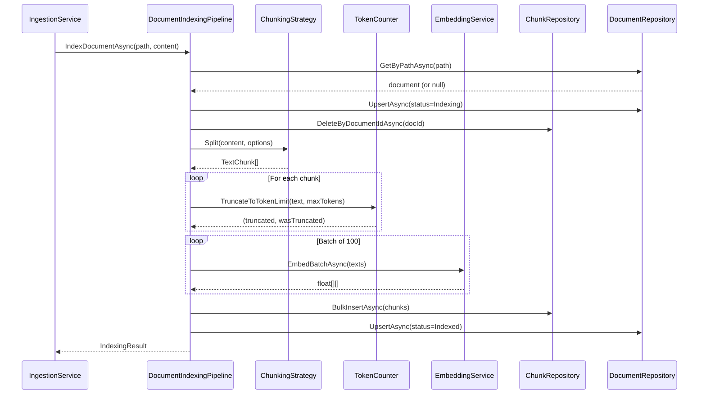
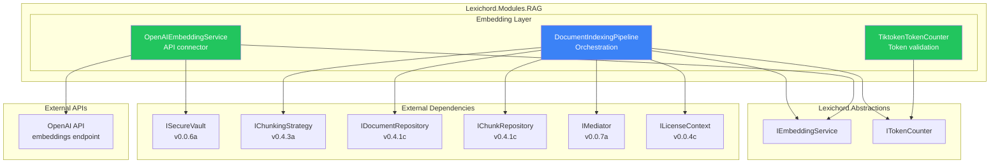
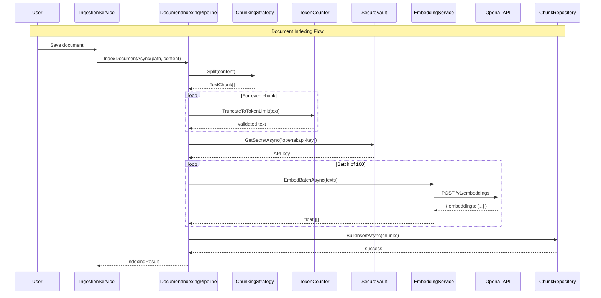

# LCS-SBD-044: Scope Breakdown — The Embedder

## Document Control

| Field            | Value                                                                |
| :--------------- | :------------------------------------------------------------------- |
| **Document ID**  | LCS-SBD-044                                                          |
| **Version**      | v0.4.4                                                               |
| **Codename**     | The Embedder (Vector Generation)                                     |
| **Status**       | Draft                                                                |
| **Last Updated** | 2026-01-27                                                           |
| **Owner**        | Lead Architect                                                       |
| **Depends On**   | v0.4.3 (Chunking), v0.4.1 (Vector Foundation), v0.0.6a (SecureVault) |

---

## 1. Executive Summary

### 1.1 The Vision

**v0.4.4** delivers **The Embedder** — the vector generation system that converts text chunks into high-dimensional vectors using external embedding APIs. This release completes the indexing pipeline, transforming human-readable text into machine-searchable vectors stored in pgvector.

With The Embedder, Lexichord can now convert any document chunk into a 1536-dimensional vector representation using OpenAI's `text-embedding-3-small` model. These vectors capture semantic meaning, enabling similarity-based retrieval in subsequent versions.

### 1.2 Business Value

- **Semantic Representation:** Convert text into vectors that capture meaning.
- **API Integration:** Secure OpenAI API connectivity with key management.
- **Token Awareness:** Pre-check and truncate oversized chunks.
- **Resilient Processing:** Polly retry policies handle rate limits gracefully.
- **Batch Efficiency:** Batch embedding requests reduce API costs.
- **Complete Pipeline:** Full document-to-vector indexing flow.

### 1.3 Success Criteria

This release succeeds when:

1. `IEmbeddingService` interface abstracts embedding generation.
2. `OpenAIEmbeddingService` connects to OpenAI API with retry logic.
3. `ITokenCounter` validates and truncates oversized text.
4. `DocumentIndexingPipeline` orchestrates chunk → embed → store flow.
5. Embedded vectors are correctly stored in pgvector.

### 1.4 License Gating

Embedding generation requires external API access and is gated at **Writer Pro** tier. Core users can watch files and chunk content, but cannot generate embeddings or perform semantic search.

---

## 2. Dependencies on Prior Versions

| Component             | Source Version | Usage in v0.4.4                  |
| :-------------------- | :------------- | :------------------------------- |
| `IChunkingStrategy`   | v0.4.3a        | Chunk documents before embedding |
| `TextChunk`           | v0.4.3a        | Input to embedding service       |
| `IChunkRepository`    | v0.4.1c        | Store embedded chunks            |
| `IDocumentRepository` | v0.4.1c        | Update document status           |
| `ISecureVault`        | v0.0.6a        | Retrieve OpenAI API key          |
| `IMediator`           | v0.0.7a        | Publish indexing events          |
| `Polly`               | v0.0.5d        | Retry policies for API calls     |
| `IConfiguration`      | v0.0.3d        | Embedding configuration          |
| `ILogger<T>`          | v0.0.3b        | Structured logging               |

---

## 3. Sub-Part Specifications

### 3.1 v0.4.4a: Embedding Abstractions

| Field            | Value                    |
| :--------------- | :----------------------- |
| **Sub-Part ID**  | RAG-044a                 |
| **Title**        | Embedding Abstractions   |
| **Module**       | `Lexichord.Abstractions` |
| **License Tier** | Core (interface only)    |

**Goal:** Define `IEmbeddingService` interface and supporting types for vector generation.

**Key Deliverables:**

- `IEmbeddingService` interface for embedding operations
- `EmbeddingOptions` record for configuration
- `EmbeddingResult` record for operation results
- Unit tests for interface contracts

**Key Interfaces:**

```csharp
namespace Lexichord.Abstractions.Contracts;

/// <summary>
/// Service for generating text embeddings (vector representations).
/// </summary>
public interface IEmbeddingService
{
    /// <summary>
    /// Gets the model name used for embedding.
    /// </summary>
    string ModelName { get; }

    /// <summary>
    /// Gets the vector dimensions produced by this service.
    /// </summary>
    int Dimensions { get; }

    /// <summary>
    /// Gets the maximum tokens the model accepts.
    /// </summary>
    int MaxTokens { get; }

    /// <summary>
    /// Embeds a single text string into a vector.
    /// </summary>
    /// <param name="text">Text to embed.</param>
    /// <param name="ct">Cancellation token.</param>
    /// <returns>Float array of dimension Dimensions.</returns>
    Task<float[]> EmbedAsync(string text, CancellationToken ct = default);

    /// <summary>
    /// Embeds multiple texts in a single batch request.
    /// More efficient than multiple single calls.
    /// </summary>
    /// <param name="texts">Texts to embed (max 100 per batch).</param>
    /// <param name="ct">Cancellation token.</param>
    /// <returns>List of embeddings in same order as input.</returns>
    Task<IReadOnlyList<float[]>> EmbedBatchAsync(
        IReadOnlyList<string> texts,
        CancellationToken ct = default);
}

/// <summary>
/// Configuration options for embedding service.
/// </summary>
public record EmbeddingOptions
{
    /// <summary>Model identifier (default: text-embedding-3-small).</summary>
    public string Model { get; init; } = "text-embedding-3-small";

    /// <summary>Maximum tokens per text (default: 8191).</summary>
    public int MaxTokens { get; init; } = 8191;

    /// <summary>Vector dimensions (default: 1536).</summary>
    public int Dimensions { get; init; } = 1536;

    /// <summary>Whether to normalize vectors (default: true).</summary>
    public bool Normalize { get; init; } = true;

    /// <summary>Maximum texts per batch request (default: 100).</summary>
    public int MaxBatchSize { get; init; } = 100;

    /// <summary>API timeout in seconds (default: 60).</summary>
    public int TimeoutSeconds { get; init; } = 60;

    /// <summary>Maximum retry attempts (default: 3).</summary>
    public int MaxRetries { get; init; } = 3;
}

/// <summary>
/// Result of an embedding operation.
/// </summary>
public record EmbeddingResult
{
    /// <summary>Whether the operation succeeded.</summary>
    public bool Success { get; init; }

    /// <summary>The generated embedding vector.</summary>
    public float[]? Embedding { get; init; }

    /// <summary>Number of tokens in the input text.</summary>
    public int TokenCount { get; init; }

    /// <summary>Error message if operation failed.</summary>
    public string? ErrorMessage { get; init; }

    /// <summary>Whether the text was truncated.</summary>
    public bool WasTruncated { get; init; }

    /// <summary>API latency in milliseconds.</summary>
    public long LatencyMs { get; init; }
}
```

**Dependencies:**

- None (defines abstractions only)

---

### 3.2 v0.4.4b: OpenAI Connector

| Field            | Value                   |
| :--------------- | :---------------------- |
| **Sub-Part ID**  | RAG-044b                |
| **Title**        | OpenAI Connector        |
| **Module**       | `Lexichord.Modules.RAG` |
| **License Tier** | WriterPro               |

**Goal:** Implement `OpenAIEmbeddingService` using `text-embedding-3-small` model with secure key management and retry logic.

**Key Deliverables:**

- `OpenAIEmbeddingService` implementation
- Integration with `ISecureVault` for API key
- Polly retry policy for rate limit handling
- Batch request support (up to 100 texts)
- Unit tests with mocked HTTP responses

**Key Implementation:**

```csharp
namespace Lexichord.Modules.RAG.Embedding;

/// <summary>
/// Embedding service using OpenAI's text-embedding-3-small model.
/// </summary>
public sealed class OpenAIEmbeddingService : IEmbeddingService, IDisposable
{
    private const string ApiEndpoint = "https://api.openai.com/v1/embeddings";
    private const string SecretKey = "openai:api-key";

    private readonly HttpClient _httpClient;
    private readonly ISecureVault _vault;
    private readonly IAsyncPolicy<HttpResponseMessage> _retryPolicy;
    private readonly EmbeddingOptions _options;
    private readonly ILogger<OpenAIEmbeddingService> _logger;

    public string ModelName => _options.Model;
    public int Dimensions => _options.Dimensions;
    public int MaxTokens => _options.MaxTokens;

    public OpenAIEmbeddingService(
        IHttpClientFactory httpFactory,
        ISecureVault vault,
        IOptions<EmbeddingOptions> options,
        ILogger<OpenAIEmbeddingService> logger)
    {
        _httpClient = httpFactory.CreateClient("OpenAI");
        _vault = vault;
        _options = options.Value;
        _logger = logger;

        _retryPolicy = CreateRetryPolicy();
    }

    public async Task<float[]> EmbedAsync(string text, CancellationToken ct = default)
    {
        var results = await EmbedBatchAsync(new[] { text }, ct);
        return results[0];
    }

    public async Task<IReadOnlyList<float[]>> EmbedBatchAsync(
        IReadOnlyList<string> texts,
        CancellationToken ct = default)
    {
        if (texts.Count == 0)
            return Array.Empty<float[]>();

        if (texts.Count > _options.MaxBatchSize)
            throw new ArgumentException($"Batch size exceeds maximum of {_options.MaxBatchSize}");

        var apiKey = await _vault.GetSecretAsync(SecretKey)
            ?? throw new InvalidOperationException("OpenAI API key not configured");

        var request = new
        {
            model = _options.Model,
            input = texts,
            dimensions = _options.Dimensions
        };

        var stopwatch = Stopwatch.StartNew();

        var response = await _retryPolicy.ExecuteAsync(async () =>
        {
            var httpRequest = new HttpRequestMessage(HttpMethod.Post, ApiEndpoint)
            {
                Content = JsonContent.Create(request)
            };
            httpRequest.Headers.Authorization =
                new AuthenticationHeaderValue("Bearer", apiKey);

            return await _httpClient.SendAsync(httpRequest, ct);
        });

        stopwatch.Stop();

        response.EnsureSuccessStatusCode();

        var result = await response.Content.ReadFromJsonAsync<OpenAIEmbeddingResponse>(ct);

        _logger.LogDebug(
            "Embedded {Count} texts in {LatencyMs}ms",
            texts.Count, stopwatch.ElapsedMilliseconds);

        return result!.Data
            .OrderBy(d => d.Index)
            .Select(d => d.Embedding)
            .ToList();
    }

    private IAsyncPolicy<HttpResponseMessage> CreateRetryPolicy()
    {
        return Policy
            .Handle<HttpRequestException>()
            .OrResult<HttpResponseMessage>(r =>
                r.StatusCode == HttpStatusCode.TooManyRequests ||
                r.StatusCode >= HttpStatusCode.InternalServerError)
            .WaitAndRetryAsync(
                _options.MaxRetries,
                attempt => TimeSpan.FromSeconds(Math.Pow(2, attempt)),
                onRetry: (outcome, delay, attempt, _) =>
                {
                    _logger.LogWarning(
                        "Retry {Attempt}/{MaxRetries} after {Delay}s due to {Reason}",
                        attempt, _options.MaxRetries, delay.TotalSeconds,
                        outcome.Exception?.Message ?? outcome.Result.StatusCode.ToString());
                });
    }

    public void Dispose()
    {
        _httpClient.Dispose();
    }
}

internal record OpenAIEmbeddingResponse(
    string Object,
    IReadOnlyList<OpenAIEmbeddingData> Data,
    string Model,
    OpenAIUsage Usage);

internal record OpenAIEmbeddingData(
    string Object,
    int Index,
    float[] Embedding);

internal record OpenAIUsage(
    int PromptTokens,
    int TotalTokens);
```

**Polly Retry Policy:**

| Attempt | Delay | Condition             |
| :------ | :---- | :-------------------- |
| 1       | 2s    | 429 Too Many Requests |
| 2       | 4s    | 5xx Server Error      |
| 3       | 8s    | Network Failure       |

**Dependencies:**

- v0.0.6a: `ISecureVault` for API key retrieval
- v0.0.5d: `Polly` for retry policies

---

### 3.3 v0.4.4c: Token Counting

| Field            | Value                   |
| :--------------- | :---------------------- |
| **Sub-Part ID**  | RAG-044c                |
| **Title**        | Token Counting          |
| **Module**       | `Lexichord.Modules.RAG` |
| **License Tier** | Core                    |

**Goal:** Implement `ITokenCounter` to validate chunk sizes and truncate oversized text before embedding.

**Key Deliverables:**

- `ITokenCounter` interface for token operations
- `TiktokenTokenCounter` implementation using `Microsoft.ML.Tokenizers`
- Text truncation with warning logs
- Unit tests for token counting accuracy

**Key Interfaces:**

```csharp
namespace Lexichord.Abstractions.Contracts;

/// <summary>
/// Service for counting tokens in text.
/// </summary>
public interface ITokenCounter
{
    /// <summary>
    /// Gets the tokenizer model name.
    /// </summary>
    string Model { get; }

    /// <summary>
    /// Counts the number of tokens in the text.
    /// </summary>
    /// <param name="text">Text to count.</param>
    /// <returns>Token count.</returns>
    int CountTokens(string text);

    /// <summary>
    /// Truncates text to fit within the token limit.
    /// </summary>
    /// <param name="text">Text to truncate.</param>
    /// <param name="maxTokens">Maximum allowed tokens.</param>
    /// <returns>Truncated text and whether truncation occurred.</returns>
    (string Text, bool WasTruncated) TruncateToTokenLimit(string text, int maxTokens);
}
```

**Implementation:**

```csharp
namespace Lexichord.Modules.RAG.Embedding;

using Microsoft.ML.Tokenizers;

/// <summary>
/// Token counter using tiktoken tokenizer for OpenAI models.
/// </summary>
public sealed class TiktokenTokenCounter : ITokenCounter
{
    private readonly Tokenizer _tokenizer;
    private readonly ILogger<TiktokenTokenCounter> _logger;

    public string Model { get; }

    public TiktokenTokenCounter(
        string model = "cl100k_base",
        ILogger<TiktokenTokenCounter>? logger = null)
    {
        Model = model;
        _tokenizer = TiktokenTokenizer.CreateForModel("gpt-4"); // cl100k_base
        _logger = logger ?? NullLogger<TiktokenTokenCounter>.Instance;
    }

    public int CountTokens(string text)
    {
        if (string.IsNullOrEmpty(text))
            return 0;

        var tokens = _tokenizer.Encode(text);
        return tokens.Count;
    }

    public (string Text, bool WasTruncated) TruncateToTokenLimit(string text, int maxTokens)
    {
        if (string.IsNullOrEmpty(text))
            return (string.Empty, false);

        var tokens = _tokenizer.Encode(text);

        if (tokens.Count <= maxTokens)
            return (text, false);

        // Take first maxTokens tokens and decode
        var truncatedTokens = tokens.Take(maxTokens).ToArray();
        var truncated = _tokenizer.Decode(truncatedTokens);

        _logger.LogWarning(
            "Text truncated from {OriginalTokens} to {MaxTokens} tokens",
            tokens.Count, maxTokens);

        return (truncated, true);
    }
}
```

**Token Limits:**

| Model                  | Max Tokens | Encoding    |
| :--------------------- | :--------- | :---------- |
| text-embedding-3-small | 8191       | cl100k_base |
| text-embedding-3-large | 8191       | cl100k_base |
| text-embedding-ada-002 | 8191       | cl100k_base |

**Dependencies:**

- `Microsoft.ML.Tokenizers` NuGet package

---

### 3.4 v0.4.4d: Embedding Pipeline

| Field            | Value                   |
| :--------------- | :---------------------- |
| **Sub-Part ID**  | RAG-044d                |
| **Title**        | Embedding Pipeline      |
| **Module**       | `Lexichord.Modules.RAG` |
| **License Tier** | WriterPro               |

**Goal:** Wire chunking and embedding into `DocumentIndexingPipeline` that orchestrates the full indexing flow.

**Key Deliverables:**

- `DocumentIndexingPipeline` orchestration class
- Integration with chunking, token counting, embedding, and storage
- `DocumentIndexedEvent` MediatR notification
- Progress reporting during batch operations
- Error handling and partial success support

**Key Implementation:**

```csharp
namespace Lexichord.Modules.RAG.Indexing;

/// <summary>
/// Orchestrates the full document indexing pipeline:
/// Read → Chunk → Count Tokens → Embed → Store
/// </summary>
public sealed class DocumentIndexingPipeline
{
    private readonly IChunkingStrategy _chunker;
    private readonly ITokenCounter _tokenCounter;
    private readonly IEmbeddingService _embedder;
    private readonly IChunkRepository _chunkRepo;
    private readonly IDocumentRepository _docRepo;
    private readonly IMediator _mediator;
    private readonly ILicenseContext _licenseContext;
    private readonly ILogger<DocumentIndexingPipeline> _logger;
    private readonly EmbeddingOptions _embeddingOptions;

    public DocumentIndexingPipeline(
        ChunkingStrategyFactory chunkingFactory,
        ITokenCounter tokenCounter,
        IEmbeddingService embedder,
        IChunkRepository chunkRepo,
        IDocumentRepository docRepo,
        IMediator mediator,
        ILicenseContext licenseContext,
        IOptions<EmbeddingOptions> embeddingOptions,
        ILogger<DocumentIndexingPipeline> logger)
    {
        _chunker = chunkingFactory.GetStrategy(ChunkingMode.Paragraph);
        _tokenCounter = tokenCounter;
        _embedder = embedder;
        _chunkRepo = chunkRepo;
        _docRepo = docRepo;
        _mediator = mediator;
        _licenseContext = licenseContext;
        _embeddingOptions = embeddingOptions.Value;
        _logger = logger;
    }

    /// <summary>
    /// Indexes a document: chunks the content, generates embeddings, and stores in database.
    /// </summary>
    public async Task<IndexingResult> IndexDocumentAsync(
        string filePath,
        string content,
        CancellationToken ct = default)
    {
        // License check
        if (_licenseContext.Tier < LicenseTier.WriterPro)
        {
            throw new FeatureNotLicensedException("Document Embedding", LicenseTier.WriterPro);
        }

        var stopwatch = Stopwatch.StartNew();

        try
        {
            _logger.LogInfo("Indexing document: {FilePath}", filePath);

            // 1. Create or update document record
            var document = await _docRepo.GetByPathAsync(filePath)
                ?? new Document { FilePath = filePath };

            document.Status = DocumentStatus.Indexing;
            document.IndexedAt = DateTimeOffset.UtcNow;
            document = await _docRepo.UpsertAsync(document);

            // 2. Delete existing chunks
            await _chunkRepo.DeleteByDocumentIdAsync(document.Id, ct);

            // 3. Chunk the content
            var chunks = _chunker.Split(content, ChunkingOptions.Default);
            _logger.LogDebug("Created {ChunkCount} chunks", chunks.Count);

            // 4. Prepare texts for embedding (with token validation)
            var textsToEmbed = new List<string>();
            var truncationOccurred = false;

            foreach (var chunk in chunks)
            {
                var (text, wasTruncated) = _tokenCounter.TruncateToTokenLimit(
                    chunk.Content,
                    _embeddingOptions.MaxTokens);

                textsToEmbed.Add(text);
                truncationOccurred |= wasTruncated;
            }

            // 5. Generate embeddings in batches
            var embeddings = await EmbedInBatchesAsync(textsToEmbed, ct);

            // 6. Store chunks with embeddings
            var chunkEntities = new List<Chunk>();
            for (var i = 0; i < chunks.Count; i++)
            {
                chunkEntities.Add(new Chunk
                {
                    Id = Guid.NewGuid(),
                    DocumentId = document.Id,
                    Content = textsToEmbed[i],
                    ChunkIndex = i,
                    Embedding = embeddings[i],
                    Metadata = JsonSerializer.Serialize(chunks[i].Metadata)
                });
            }

            await _chunkRepo.BulkInsertAsync(chunkEntities, ct);

            // 7. Update document status
            document.Status = DocumentStatus.Indexed;
            document.ChunkCount = chunks.Count;
            await _docRepo.UpsertAsync(document);

            stopwatch.Stop();

            // 8. Publish event
            await _mediator.Publish(new DocumentIndexedEvent
            {
                DocumentId = document.Id,
                FilePath = filePath,
                ChunkCount = chunks.Count,
                Duration = stopwatch.Elapsed
            }, ct);

            _logger.LogInfo(
                "Indexed {FilePath}: {ChunkCount} chunks in {Duration}ms",
                filePath, chunks.Count, stopwatch.ElapsedMilliseconds);

            return new IndexingResult
            {
                Success = true,
                DocumentId = document.Id,
                ChunkCount = chunks.Count,
                Duration = stopwatch.Elapsed,
                TruncationOccurred = truncationOccurred
            };
        }
        catch (Exception ex)
        {
            _logger.LogError(ex, "Failed to index document: {FilePath}", filePath);

            // Update document status
            var document = await _docRepo.GetByPathAsync(filePath);
            if (document != null)
            {
                document.Status = DocumentStatus.Failed;
                document.ErrorMessage = ex.Message;
                await _docRepo.UpsertAsync(document);
            }

            await _mediator.Publish(new DocumentIndexingFailedEvent
            {
                FilePath = filePath,
                ErrorMessage = ex.Message
            }, ct);

            return new IndexingResult
            {
                Success = false,
                ErrorMessage = ex.Message,
                Duration = stopwatch.Elapsed
            };
        }
    }

    private async Task<IReadOnlyList<float[]>> EmbedInBatchesAsync(
        IReadOnlyList<string> texts,
        CancellationToken ct)
    {
        var results = new List<float[]>();
        var batchSize = _embeddingOptions.MaxBatchSize;

        for (var i = 0; i < texts.Count; i += batchSize)
        {
            var batch = texts.Skip(i).Take(batchSize).ToList();
            var batchEmbeddings = await _embedder.EmbedBatchAsync(batch, ct);
            results.AddRange(batchEmbeddings);

            _logger.LogDebug(
                "Embedded batch {Current}/{Total}",
                Math.Min(i + batchSize, texts.Count), texts.Count);
        }

        return results;
    }
}

/// <summary>
/// Result of a document indexing operation.
/// </summary>
public record IndexingResult
{
    public bool Success { get; init; }
    public Guid? DocumentId { get; init; }
    public int ChunkCount { get; init; }
    public TimeSpan Duration { get; init; }
    public bool TruncationOccurred { get; init; }
    public string? ErrorMessage { get; init; }
}

/// <summary>
/// Published when a document is successfully indexed.
/// </summary>
public record DocumentIndexedEvent : INotification
{
    public required Guid DocumentId { get; init; }
    public required string FilePath { get; init; }
    public int ChunkCount { get; init; }
    public TimeSpan Duration { get; init; }
}

/// <summary>
/// Published when document indexing fails.
/// </summary>
public record DocumentIndexingFailedEvent : INotification
{
    public required string FilePath { get; init; }
    public required string ErrorMessage { get; init; }
}
```

**Pipeline Flow:**



**Dependencies:**

- v0.4.3a: `IChunkingStrategy`, `ChunkingStrategyFactory`
- v0.4.4a: `IEmbeddingService`
- v0.4.4c: `ITokenCounter`
- v0.4.1c: `IDocumentRepository`, `IChunkRepository`
- v0.0.7a: `IMediator` for events
- v0.0.4c: `ILicenseContext` for license gating

---

## 4. Implementation Checklist

| #         | Sub-Part | Task                               | Est. Hours   |
| :-------- | :------- | :--------------------------------- | :----------- |
| 1         | v0.4.4a  | Create IEmbeddingService interface | 1            |
| 2         | v0.4.4a  | Create EmbeddingOptions record     | 0.5          |
| 3         | v0.4.4a  | Create EmbeddingResult record      | 0.5          |
| 4         | v0.4.4a  | Unit tests for interface contracts | 1            |
| 5         | v0.4.4b  | Implement OpenAIEmbeddingService   | 3            |
| 6         | v0.4.4b  | Integrate with ISecureVault        | 1            |
| 7         | v0.4.4b  | Implement Polly retry policy       | 1.5          |
| 8         | v0.4.4b  | Implement batch request support    | 1.5          |
| 9         | v0.4.4b  | Unit tests with mocked HTTP        | 2            |
| 10        | v0.4.4c  | Create ITokenCounter interface     | 0.5          |
| 11        | v0.4.4c  | Implement TiktokenTokenCounter     | 2            |
| 12        | v0.4.4c  | Implement text truncation          | 1            |
| 13        | v0.4.4c  | Unit tests for token counting      | 1.5          |
| 14        | v0.4.4d  | Implement DocumentIndexingPipeline | 3            |
| 15        | v0.4.4d  | Implement batch embedding          | 1.5          |
| 16        | v0.4.4d  | Create DocumentIndexedEvent        | 0.5          |
| 17        | v0.4.4d  | Create DocumentIndexingFailedEvent | 0.5          |
| 18        | v0.4.4d  | Implement license gating           | 1            |
| 19        | v0.4.4d  | Integration tests for pipeline     | 2.5          |
| 20        | All      | DI registration in RAGModule.cs    | 1            |
| **Total** |          |                                    | **27 hours** |

---

## 5. Dependency Matrix

### 5.1 Required Interfaces (from earlier versions)

| Interface             | Source Version | Purpose                    |
| :-------------------- | :------------- | :------------------------- |
| `IChunkingStrategy`   | v0.4.3a        | Document chunking          |
| `IDocumentRepository` | v0.4.1c        | Document storage           |
| `IChunkRepository`    | v0.4.1c        | Chunk storage with vectors |
| `ISecureVault`        | v0.0.6a        | API key management         |
| `IMediator`           | v0.0.7a        | Event publishing           |
| `ILicenseContext`     | v0.0.4c        | License tier checking      |

### 5.2 New Interfaces (defined in v0.4.4)

| Interface           | Defined In | Module       | Purpose              |
| :------------------ | :--------- | :----------- | :------------------- |
| `IEmbeddingService` | v0.4.4a    | Abstractions | Embedding generation |
| `ITokenCounter`     | v0.4.4c    | Abstractions | Token counting       |

### 5.3 New Records/DTOs (defined in v0.4.4)

| Record                        | Defined In | Purpose                    |
| :---------------------------- | :--------- | :------------------------- |
| `EmbeddingOptions`            | v0.4.4a    | Embedding configuration    |
| `EmbeddingResult`             | v0.4.4a    | Embedding operation result |
| `IndexingResult`              | v0.4.4d    | Pipeline operation result  |
| `DocumentIndexedEvent`        | v0.4.4d    | Success notification       |
| `DocumentIndexingFailedEvent` | v0.4.4d    | Failure notification       |

### 5.4 NuGet Packages

| Package                   | Version | Purpose                | New/Existing |
| :------------------------ | :------ | :--------------------- | :----------- |
| `Microsoft.ML.Tokenizers` | 0.22.x  | Token counting         | New          |
| `Polly`                   | 8.x     | Retry policies         | Existing     |
| `Polly.Extensions.Http`   | 3.x     | HTTP policy extensions | New          |

---

## 6. Architecture Diagram



---

## 7. Data Flow Diagram



---

## 8. Risks & Mitigations

| Risk                       | Impact | Probability | Mitigation                                     |
| :------------------------- | :----- | :---------- | :--------------------------------------------- |
| OpenAI API rate limits     | Medium | High        | Polly retry with exponential backoff           |
| API key exposure           | High   | Low         | Store in ISecureVault, never log               |
| Large batch failures       | Medium | Medium      | Partial success handling, retry failed batches |
| Token count miscalculation | Low    | Low         | Use official tiktoken tokenizer                |
| High API costs             | Medium | Medium      | Batch requests, cache embeddings (v0.4.8)      |
| Network timeouts           | Medium | Medium      | Configurable timeout, retry policy             |

---

## 9. Success Metrics

| Metric                        | Target       | Measurement                   |
| :---------------------------- | :----------- | :---------------------------- |
| Embedding latency (single)    | < 500ms      | API response time             |
| Embedding latency (batch 100) | < 5s         | API response time             |
| Token counting (1000 chars)   | < 10ms       | Stopwatch timing              |
| Pipeline throughput           | > 5 docs/min | End-to-end timing             |
| API error rate                | < 1%         | Error count / total           |
| Retry success rate            | > 95%        | Retried requests that succeed |

---

## 10. What This Enables

After v0.4.4, Lexichord will support:

- **v0.4.5 (Semantic Search):** Query the embedded vectors for similarity search.
- **v0.4.6 (Reference Panel):** Display search results from embedded content.
- **v0.4.7 (Index Manager):** Show embedding status and progress.
- **v0.4.8 (Embedding Cache):** Cache embeddings to reduce API costs.

---

## 11. Decision Trees

### 11.1 Embedding Flow

```text
START: "Should this chunk be embedded?"
│
├── Is chunk empty or whitespace?
│   ├── YES → Skip, no embedding
│   └── NO → Continue
│
├── Count tokens in chunk
│
├── Is token count > MaxTokens (8191)?
│   ├── YES → Truncate, log warning
│   └── NO → Continue
│
├── Add to batch
│
├── Is batch full (100) or last chunk?
│   ├── YES → Send batch to API
│   └── NO → Continue collecting
│
└── Store embedding with chunk
```

### 11.2 API Error Handling

```text
START: "API request failed"
│
├── Is error 429 (Rate Limited)?
│   └── YES → Retry with exponential backoff
│
├── Is error 5xx (Server Error)?
│   └── YES → Retry up to MaxRetries
│
├── Is error 401 (Unauthorized)?
│   └── YES → Fail immediately, API key invalid
│
├── Is error 400 (Bad Request)?
│   └── YES → Fail immediately, request malformed
│
├── Is retry count < MaxRetries?
│   ├── YES → Wait, retry
│   └── NO → Fail, report error
│
└── END
```

---

## 12. User Stories

| ID    | Role      | Story                                                             | Acceptance Criteria                       |
| :---- | :-------- | :---------------------------------------------------------------- | :---------------------------------------- |
| US-01 | Writer    | As a writer, I want my documents converted to searchable vectors. | Documents embedded and stored.            |
| US-02 | Writer    | As a writer, I want large documents handled gracefully.           | Oversized chunks truncated, indexed.      |
| US-03 | Developer | As a developer, I want embedding errors handled with retries.     | 429 errors retried automatically.         |
| US-04 | Developer | As a developer, I want to monitor embedding progress.             | Progress events published via MediatR.    |
| US-05 | Developer | As a developer, I want batch embedding for efficiency.            | Multiple chunks embedded in one API call. |
| US-06 | Admin     | As an admin, I want API keys stored securely.                     | Keys in ISecureVault, never logged.       |

---

## 13. Unit Testing Requirements

### 13.1 EmbeddingService Tests

```csharp
[Trait("Category", "Unit")]
[Trait("Feature", "v0.4.4b")]
public class OpenAIEmbeddingServiceTests
{
    [Fact]
    public async Task EmbedAsync_WithValidText_ReturnsVector()
    {
        // Arrange
        var handler = new MockHttpMessageHandler(
            CreateEmbeddingResponse(new float[1536]));
        var service = CreateService(handler);

        // Act
        var embedding = await service.EmbedAsync("Hello world");

        // Assert
        embedding.Should().HaveCount(1536);
    }

    [Fact]
    public async Task EmbedBatchAsync_WithMultipleTexts_ReturnsSameCount()
    {
        // Arrange
        var texts = new[] { "Text 1", "Text 2", "Text 3" };
        var handler = new MockHttpMessageHandler(
            CreateBatchEmbeddingResponse(texts.Length, 1536));
        var service = CreateService(handler);

        // Act
        var embeddings = await service.EmbedBatchAsync(texts);

        // Assert
        embeddings.Should().HaveCount(3);
        embeddings.All(e => e.Length == 1536).Should().BeTrue();
    }

    [Fact]
    public async Task EmbedAsync_On429_RetriesWithBackoff()
    {
        // Arrange
        var attempts = 0;
        var handler = new MockHttpMessageHandler(_ =>
        {
            attempts++;
            return attempts < 3
                ? new HttpResponseMessage(HttpStatusCode.TooManyRequests)
                : CreateSuccessResponse();
        });
        var service = CreateService(handler);

        // Act
        var embedding = await service.EmbedAsync("Test");

        // Assert
        attempts.Should().Be(3);
        embedding.Should().NotBeNull();
    }

    [Fact]
    public async Task EmbedAsync_WithoutApiKey_ThrowsInvalidOperation()
    {
        // Arrange
        var vault = new Mock<ISecureVault>();
        vault.Setup(v => v.GetSecretAsync(It.IsAny<string>()))
            .ReturnsAsync((string?)null);
        var service = CreateService(vault: vault.Object);

        // Act & Assert
        await service.Invoking(s => s.EmbedAsync("Test"))
            .Should().ThrowAsync<InvalidOperationException>()
            .WithMessage("*API key*");
    }
}
```

### 13.2 TokenCounter Tests

```csharp
[Trait("Category", "Unit")]
[Trait("Feature", "v0.4.4c")]
public class TiktokenTokenCounterTests
{
    private readonly TiktokenTokenCounter _sut = new();

    [Fact]
    public void CountTokens_EmptyString_ReturnsZero()
    {
        _sut.CountTokens("").Should().Be(0);
    }

    [Fact]
    public void CountTokens_SimpleText_ReturnsCorrectCount()
    {
        // "Hello world" is typically 2 tokens
        var count = _sut.CountTokens("Hello world");
        count.Should().BeInRange(2, 3);
    }

    [Fact]
    public void TruncateToTokenLimit_ShortText_ReturnsUnchanged()
    {
        var (text, truncated) = _sut.TruncateToTokenLimit("Hello", 100);

        text.Should().Be("Hello");
        truncated.Should().BeFalse();
    }

    [Fact]
    public void TruncateToTokenLimit_LongText_TruncatesCorrectly()
    {
        var longText = string.Join(" ", Enumerable.Repeat("word", 10000));

        var (text, truncated) = _sut.TruncateToTokenLimit(longText, 100);

        var resultTokens = _sut.CountTokens(text);
        resultTokens.Should().BeLessOrEqualTo(100);
        truncated.Should().BeTrue();
    }
}
```

---

## 14. Observability & Logging

| Level   | Source                   | Message Template                                              |
| :------ | :----------------------- | :------------------------------------------------------------ |
| Debug   | OpenAIEmbeddingService   | `Embedded {Count} texts in {LatencyMs}ms`                     |
| Debug   | OpenAIEmbeddingService   | `Embedding batch {BatchIndex}/{TotalBatches}`                 |
| Warning | OpenAIEmbeddingService   | `Retry {Attempt}/{MaxRetries} after {Delay}s due to {Reason}` |
| Error   | OpenAIEmbeddingService   | `Embedding failed: {ErrorMessage}`                            |
| Warning | TiktokenTokenCounter     | `Text truncated from {OriginalTokens} to {MaxTokens} tokens`  |
| Info    | DocumentIndexingPipeline | `Indexing document: {FilePath}`                               |
| Debug   | DocumentIndexingPipeline | `Created {ChunkCount} chunks`                                 |
| Debug   | DocumentIndexingPipeline | `Embedded batch {Current}/{Total}`                            |
| Info    | DocumentIndexingPipeline | `Indexed {FilePath}: {ChunkCount} chunks in {Duration}ms`     |
| Error   | DocumentIndexingPipeline | `Failed to index document: {FilePath}`                        |

---

## 15. UI/UX Specifications

**None.** v0.4.4 is a backend processing release. Embedding progress visualization will appear in v0.4.7 (Index Manager).

---

## 16. Acceptance Criteria (QA)

| #   | Category          | Criterion                                         |
| :-- | :---------------- | :------------------------------------------------ |
| 1   | **[Embedding]**   | Single text embeds to 1536-dimensional vector.    |
| 2   | **[Embedding]**   | Batch of 100 texts embeds in single API call.     |
| 3   | **[Embedding]**   | API key retrieved from ISecureVault.              |
| 4   | **[Embedding]**   | 429 errors trigger retry with backoff.            |
| 5   | **[Embedding]**   | 5xx errors trigger retry.                         |
| 6   | **[Tokens]**      | Token count accurate for OpenAI models.           |
| 7   | **[Tokens]**      | Oversized text truncated to MaxTokens.            |
| 8   | **[Tokens]**      | Truncation logged as warning.                     |
| 9   | **[Pipeline]**    | Document chunks stored with embeddings.           |
| 10  | **[Pipeline]**    | DocumentIndexedEvent published on success.        |
| 11  | **[Pipeline]**    | DocumentIndexingFailedEvent published on failure. |
| 12  | **[Pipeline]**    | License check enforced for WriterPro.             |
| 13  | **[Performance]** | Single embedding < 500ms.                         |
| 14  | **[Performance]** | Batch of 100 < 5s.                                |

---

## 17. Verification Commands

```bash
# ═══════════════════════════════════════════════════════════════════════════
# v0.4.4 Verification
# ═══════════════════════════════════════════════════════════════════════════

# 1. Verify NuGet packages installed
dotnet list src/Lexichord.Modules.RAG package | grep -E "Tokenizers|Polly"

# 2. Build solution
dotnet build

# 3. Run unit tests for v0.4.4 components
dotnet test --filter "Category=Unit&FullyQualifiedName~Embedding"
dotnet test --filter "Category=Unit&FullyQualifiedName~Token"
dotnet test --filter "Feature=v0.4.4"

# 4. Run integration tests (requires API key)
OPENAI_API_KEY=sk-... dotnet test --filter "Category=Integration&FullyQualifiedName~Embedding"

# 5. Manual verification - Embedding
# a) Configure API key in secure vault
# b) Index a test document
# c) Verify chunks have embedding vectors in database

# 6. Verify vectors stored
# psql: SELECT id, array_length(embedding, 1) FROM chunks LIMIT 5;
```

---

## 18. Deliverable Checklist

| #   | Deliverable                                | Status |
| :-- | :----------------------------------------- | :----- |
| 1   | `IEmbeddingService` interface              | [ ]    |
| 2   | `EmbeddingOptions` record                  | [ ]    |
| 3   | `EmbeddingResult` record                   | [ ]    |
| 4   | `OpenAIEmbeddingService` implementation    | [ ]    |
| 5   | Polly retry policy integration             | [ ]    |
| 6   | `ITokenCounter` interface                  | [ ]    |
| 7   | `TiktokenTokenCounter` implementation      | [ ]    |
| 8   | `DocumentIndexingPipeline` implementation  | [ ]    |
| 9   | `DocumentIndexedEvent` notification        | [ ]    |
| 10  | `DocumentIndexingFailedEvent` notification | [ ]    |
| 11  | `IndexingResult` record                    | [ ]    |
| 12  | Unit tests for EmbeddingService            | [ ]    |
| 13  | Unit tests for TokenCounter                | [ ]    |
| 14  | Integration tests for pipeline             | [ ]    |
| 15  | License gating for WriterPro               | [ ]    |
| 16  | DI registration in RAGModule.cs            | [ ]    |

---

## 19. Deferred Features

| Feature                         | Deferred To | Reason                   |
| :------------------------------ | :---------- | :----------------------- |
| Embedding cache                 | v0.4.8      | Performance optimization |
| Alternative embedding providers | v0.9.x      | Enterprise feature       |
| Custom embedding models         | v0.9.x      | Enterprise feature       |
| Local embedding models          | v0.6.x      | Requires ML runtime      |
| Dimension reduction (PCA)       | v0.5.x      | Advanced feature         |

---

## 20. Changelog Entry

Upon completion of v0.4.4, the following entry will be added to `CHANGELOG.md`:

```markdown
## [0.4.4] - YYYY-MM-DD

### Added

- **Vector Generation**: Convert text chunks to embeddings
- **OpenAI Integration**: text-embedding-3-small model support
- **Token Counting**: Microsoft.ML.Tokenizers for accurate counting
- **Indexing Pipeline**: Full document-to-vector flow

### Technical

- `IEmbeddingService` interface for embedding generation
- `OpenAIEmbeddingService` with Polly retry policies
- `ITokenCounter` interface for token operations
- `TiktokenTokenCounter` using cl100k_base encoding
- `DocumentIndexingPipeline` orchestration
- `DocumentIndexedEvent` and `DocumentIndexingFailedEvent` MediatR notifications
- License gating at WriterPro tier

### Dependencies

- Added: `Microsoft.ML.Tokenizers` 0.22.x for token counting
- Added: `Polly.Extensions.Http` 3.x for HTTP retry policies

### Performance

- Single embedding: < 500ms
- Batch of 100: < 5s
- Token counting: < 10ms for 1000 chars
```

---
