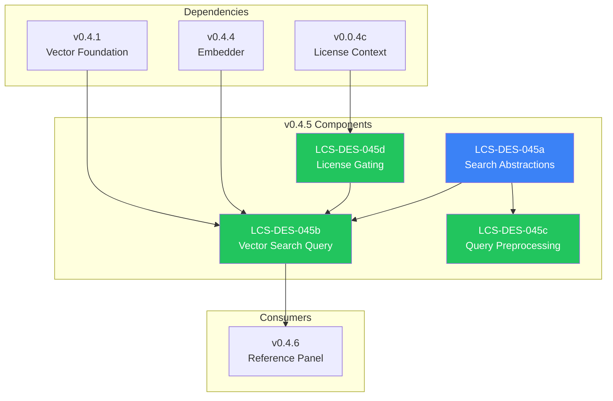

# LCS-DES-045-INDEX: Design Specification Index — The Searcher

## Document Control

| Field            | Value                                    |
| :--------------- | :--------------------------------------- |
| **Document ID**  | LCS-DES-045-INDEX                        |
| **Version**      | v0.4.5                                   |
| **Codename**     | The Searcher (Semantic Query)            |
| **Status**       | Draft                                    |
| **Last Updated** | 2026-01-27                               |
| **Owner**        | Lead Architect                           |

---

## 1. Overview

This index provides navigation to all design specifications for **v0.4.5: The Searcher**, which implements semantic search capabilities enabling natural language queries against the indexed document corpus.

---

## 2. Design Specifications

| Document ID    | Title                      | Description                                      | Status |
| :------------- | :------------------------- | :----------------------------------------------- | :----- |
| [LCS-DES-045a](./LCS-DES-045a.md) | Search Abstractions | Interfaces and records for semantic search | Draft |
| [LCS-DES-045b](./LCS-DES-045b.md) | Vector Search Query | pgvector cosine similarity implementation | Draft |
| [LCS-DES-045c](./LCS-DES-045c.md) | Query Preprocessing | Normalization, expansion, and caching | Draft |
| [LCS-DES-045d](./LCS-DES-045d.md) | License Gating | WriterPro tier enforcement | Draft |

---

## 3. Architecture Overview



---

## 4. Sub-Part Summary

### 4.1 LCS-DES-045a: Search Abstractions

**Purpose:** Defines the core interfaces and types for semantic search operations.

**Key Components:**

- `ISemanticSearchService` interface (`SearchAsync`)
- `SearchOptions` record (TopK, MinScore, DocumentFilter)
- `SearchResult` record (Hits, Duration, QueryEmbedding)
- `SearchHit` record (Chunk, Document, Score)

**Module:** `Lexichord.Abstractions`

---

### 4.2 LCS-DES-045b: Vector Search Query

**Purpose:** Implements vector similarity search using pgvector's cosine distance operator.

**Key Components:**

- `PgVectorSearchService` class
- Cosine similarity SQL query (`<=>` operator)
- Score calculation: `1 - cosine_distance`
- Document filtering support
- Result ranking and limiting

**SQL Pattern:**

```sql
SELECT *, 1 - (embedding <=> @query) AS score
FROM chunks
WHERE score >= @min_score
ORDER BY embedding <=> @query
LIMIT @top_k
```

**Module:** `Lexichord.Modules.RAG`

---

### 4.3 LCS-DES-045c: Query Preprocessing

**Purpose:** Normalizes query input and caches query embeddings.

**Key Components:**

- `IQueryPreprocessor` interface
- `QueryPreprocessor` implementation
- Whitespace normalization
- Unicode normalization (NFC)
- Abbreviation expansion (optional)
- 5-minute query embedding cache

**Abbreviation Examples:**

| Abbreviation | Expansion |
| :----------- | :-------- |
| API | Application Programming Interface |
| UI | User Interface |
| DB | Database |

**Module:** `Lexichord.Modules.RAG`

---

### 4.4 LCS-DES-045d: License Gating

**Purpose:** Enforces WriterPro license requirement for semantic search.

**Key Components:**

- `FeatureNotLicensedException` exception
- `SearchLicenseGuard` helper class
- `SearchDeniedEvent` for telemetry
- `SemanticSearchExecutedEvent` for analytics

**License Behavior:**

| Tier | Access |
| :--- | :----- |
| Core | Blocked |
| Writer | Blocked |
| WriterPro+ | Full access |

**Module:** `Lexichord.Modules.RAG`

---

## 5. Dependency Chain

```text
v0.4.5a (Abstractions)
    │
    ├── v0.4.5b (Vector Search) ────────────────┐
    │       │                                    │
    │       ├── v0.4.4a (Embedder) ─────────────┤
    │       ├── v0.4.1c (Repositories) ─────────┤
    │       └── v0.0.5b (Database) ─────────────┤
    │                                            │
    ├── v0.4.5c (Preprocessing) ────────────────┤
    │       │                                    │
    │       └── IMemoryCache ───────────────────┤
    │                                            │
    └── v0.4.5d (License Gating) ───────────────┘
            │
            └── v0.0.4c (LicenseContext)
```

---

## 6. Interface Dependencies

| Interface | Source | Used By |
| :-------- | :----- | :------ |
| `ISemanticSearchService` | v0.4.5a | UI, tests |
| `IQueryPreprocessor` | v0.4.5c | Search service |
| `IEmbeddingService` | v0.4.4a | Query embedding |
| `IDocumentRepository` | v0.4.1c | Document metadata |
| `IDbConnectionFactory` | v0.0.5b | Vector queries |
| `IMemoryCache` | v0.2.2b | Query cache |
| `ILicenseContext` | v0.0.4c | Tier checking |
| `IMediator` | v0.0.7a | Events |

---

## 7. New Types Introduced

### 7.1 Interfaces

| Interface | Methods | Purpose |
| :-------- | :------ | :------ |
| `ISemanticSearchService` | `SearchAsync` | Semantic search |
| `IQueryPreprocessor` | `Process`, `GetCachedEmbedding`, `CacheEmbedding` | Query preprocessing |

### 7.2 Records

| Record | Properties | Purpose |
| :----- | :--------- | :------ |
| `SearchOptions` | TopK, MinScore, DocumentFilter, ... | Search configuration |
| `SearchResult` | Hits, Duration, QueryEmbedding | Result container |
| `SearchHit` | Chunk, Document, Score | Individual match |
| `SearchDeniedEvent` | CurrentTier, RequiredTier | License denial event |
| `SemanticSearchExecutedEvent` | Query, ResultCount, Duration | Telemetry event |

### 7.3 Classes

| Class | Implements | Purpose |
| :---- | :--------- | :------ |
| `PgVectorSearchService` | `ISemanticSearchService` | pgvector search |
| `QueryPreprocessor` | `IQueryPreprocessor` | Query preprocessing |
| `SearchLicenseGuard` | — | License validation |

### 7.4 Exceptions

| Exception | Properties | Purpose |
| :-------- | :--------- | :------ |
| `FeatureNotLicensedException` | FeatureName, RequiredTier | License enforcement |

---

## 8. Testing Strategy

| Sub-Part | Unit Tests | Integration Tests |
| :------- | :--------- | :---------------- |
| v0.4.5a | Record validation | — |
| v0.4.5b | Mocked DB, query building | Real pgvector |
| v0.4.5c | Preprocessing, caching | — |
| v0.4.5d | License checks, events | — |

---

## 9. Related Documents

| Document | Relationship |
| :------- | :----------- |
| [LCS-SBD-045](./LCS-SBD-045.md) | Scope Breakdown for v0.4.5 |
| [LCS-SBD-044](../v0.4.4/LCS-SBD-044.md) | Predecessor (Embedder) |
| [LCS-SBD-046](../v0.4.6/LCS-SBD-046.md) | Successor (Reference Panel) |
| [roadmap-v0.4.x](../roadmap-v0.4.x.md) | Version roadmap |

---

## 10. Revision History

| Version | Date       | Author         | Changes                    |
| :------ | :--------- | :------------- | :------------------------- |
| 0.1     | 2026-01-27 | Lead Architect | Initial draft              |

---
