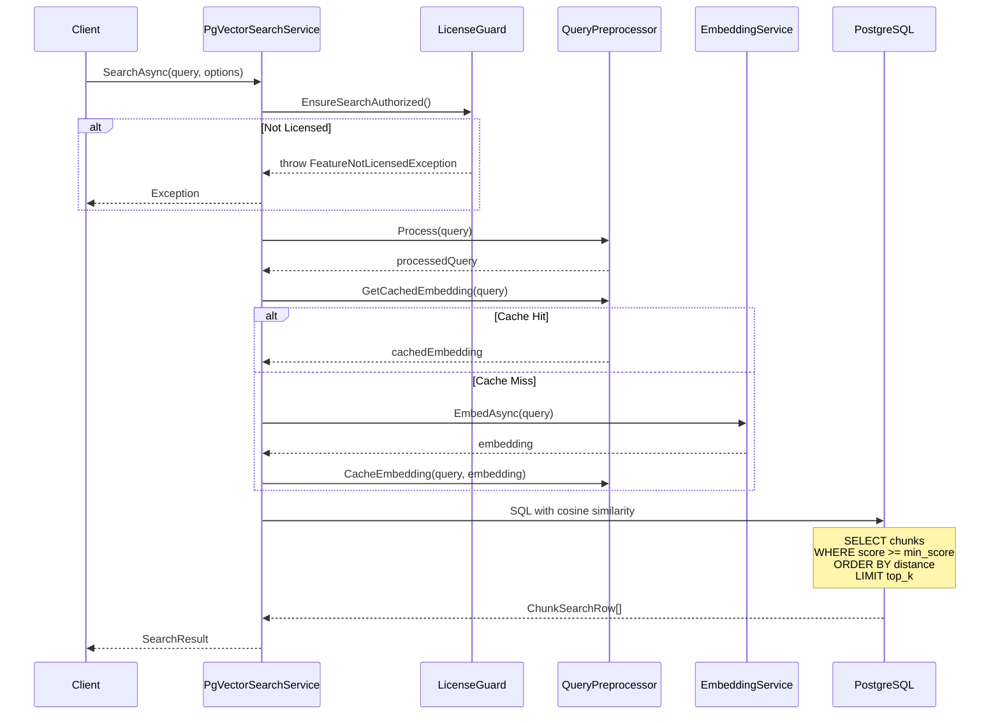
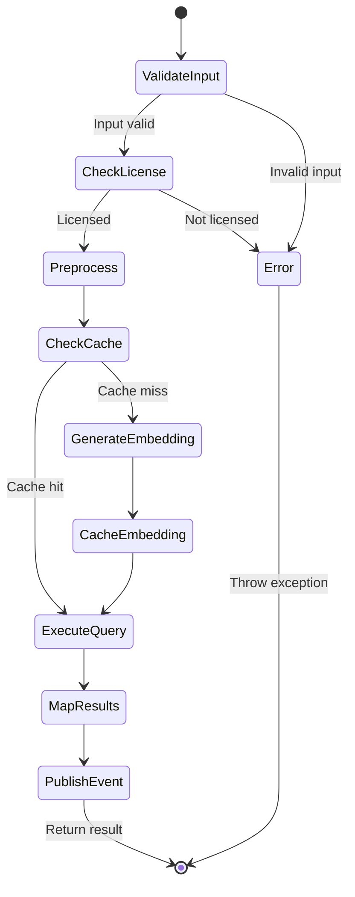

# LCS-DES-045b: Vector Search Query

## 1. Metadata & Categorization

| Field                | Value                             |
| :------------------- | :-------------------------------- |
| **Document ID**      | LCS-DES-045b                      |
| **Feature ID**       | RAG-045b                          |
| **Feature Name**     | Vector Search Query               |
| **Target Version**   | v0.4.5b                           |
| **Module Scope**     | `Lexichord.Modules.RAG`           |
| **Swimlane**         | Memory                            |
| **License Tier**     | WriterPro                         |
| **Feature Gate Key** | `FeatureFlags.RAG.SemanticSearch` |
| **Status**           | Draft                             |
| **Last Updated**     | 2026-01-27                        |

---

## 2. Executive Summary

### 2.1 The Requirement

Semantic search requires querying the pgvector-indexed chunks using cosine similarity to find content semantically related to the user's query. The search must be efficient, support filtering, and return results ranked by relevance.

### 2.2 The Proposed Solution

Implement `PgVectorSearchService` that converts the query to an embedding vector, then executes a SQL query using pgvector's `<=>` cosine distance operator. Results are filtered by minimum score threshold and optionally by document, then returned as ranked `SearchHit` objects.

---

## 3. Architecture & Modular Strategy

### 3.1 Dependencies

**Upstream Modules:**

- `Lexichord.Abstractions` (ISemanticSearchService interface)
- v0.4.4a: `IEmbeddingService` for query embedding
- v0.4.4d: `FeatureNotLicensedException` for license enforcement
- v0.4.1c: `IDocumentRepository` for document metadata
- v0.4.5c: `IQueryPreprocessor` for query normalization
- v0.4.5d: `SearchLicenseGuard` for license checks
- v0.0.5b: `IDbConnectionFactory` for database access

**NuGet Packages:**

- `Dapper` 2.1.x - SQL execution
- `Npgsql` 9.0.x - PostgreSQL driver
- `Npgsql.Pgvector` 0.2.x - Vector type mapping

### 3.2 Licensing Behavior

- **Load Behavior:** [x] Soft Gate - Service loads, throws on unlicensed use
- **Fallback Experience:** `FeatureNotLicensedException` with upgrade prompt

---

## 4. Data Contract (The API)

```csharp
namespace Lexichord.Modules.RAG.Search;

/// <summary>
/// Semantic search service using pgvector cosine similarity.
/// </summary>
public sealed class PgVectorSearchService : ISemanticSearchService
{
    private readonly IDbConnectionFactory _dbFactory;
    private readonly IEmbeddingService _embedder;
    private readonly IQueryPreprocessor _preprocessor;
    private readonly IDocumentRepository _docRepo;
    private readonly SearchLicenseGuard _licenseGuard;
    private readonly IMediator _mediator;
    private readonly ILogger<PgVectorSearchService> _logger;

    public PgVectorSearchService(
        IDbConnectionFactory dbFactory,
        IEmbeddingService embedder,
        IQueryPreprocessor preprocessor,
        IDocumentRepository docRepo,
        SearchLicenseGuard licenseGuard,
        IMediator mediator,
        ILogger<PgVectorSearchService> logger)
    {
        _dbFactory = dbFactory;
        _embedder = embedder;
        _preprocessor = preprocessor;
        _docRepo = docRepo;
        _licenseGuard = licenseGuard;
        _mediator = mediator;
        _logger = logger;
    }

    /// <inheritdoc />
    public async Task<SearchResult> SearchAsync(
        string query,
        SearchOptions options,
        CancellationToken ct = default)
    {
        // Validate inputs
        ArgumentException.ThrowIfNullOrWhiteSpace(query);
        ValidateOptions(options);

        // Check license
        _licenseGuard.EnsureSearchAuthorized();

        var stopwatch = Stopwatch.StartNew();

        try
        {
            // Preprocess query
            var processedQuery = _preprocessor.Process(query, options);

            // Get query embedding (with cache check)
            var queryEmbedding = await GetQueryEmbeddingAsync(processedQuery, options, ct);

            // Execute vector search
            var hits = await ExecuteVectorSearchAsync(queryEmbedding, options, ct);

            stopwatch.Stop();

            // Publish telemetry event
            await _mediator.Publish(new SemanticSearchExecutedEvent
            {
                Query = query,
                ResultCount = hits.Count,
                Duration = stopwatch.Elapsed,
                Timestamp = DateTimeOffset.UtcNow
            }, ct);

            _logger.LogInformation(
                "Search completed: {HitCount} hits for '{Query}' in {Duration}ms",
                hits.Count, query, stopwatch.ElapsedMilliseconds);

            return new SearchResult
            {
                Hits = hits,
                Duration = stopwatch.Elapsed,
                QueryEmbedding = queryEmbedding,
                Query = query,
                WasTruncated = hits.Count >= options.TopK
            };
        }
        catch (FeatureNotLicensedException)
        {
            throw; // Re-throw license exceptions
        }
        catch (Exception ex)
        {
            _logger.LogError(ex, "Search failed for query: '{Query}'", query);
            throw;
        }
    }

    private static void ValidateOptions(SearchOptions options)
    {
        if (options.TopK is < 1 or > 100)
            throw new ArgumentOutOfRangeException(nameof(options), "TopK must be between 1 and 100");

        if (options.MinScore is < 0.0f or > 1.0f)
            throw new ArgumentOutOfRangeException(nameof(options), "MinScore must be between 0.0 and 1.0");
    }

    private async Task<float[]> GetQueryEmbeddingAsync(
        string query,
        SearchOptions options,
        CancellationToken ct)
    {
        // Check cache first
        if (options.UseCache)
        {
            var cached = _preprocessor.GetCachedEmbedding(query);
            if (cached != null)
            {
                _logger.LogDebug("Using cached embedding for query: '{Query}'", query);
                return cached;
            }
        }

        // Generate new embedding
        var embedding = await _embedder.EmbedAsync(query, ct);

        // Cache it
        if (options.UseCache)
        {
            _preprocessor.CacheEmbedding(query, embedding);
        }

        return embedding;
    }

    private async Task<IReadOnlyList<SearchHit>> ExecuteVectorSearchAsync(
        float[] queryEmbedding,
        SearchOptions options,
        CancellationToken ct)
    {
        await using var connection = await _dbFactory.CreateConnectionAsync(ct);

        var sql = BuildSearchQuery(options);

        _logger.LogDebug(
            "Executing vector search: TopK={TopK}, MinScore={MinScore}, Filter={Filter}",
            options.TopK, options.MinScore, options.DocumentFilter);

        var parameters = new DynamicParameters();
        parameters.Add("query_embedding", queryEmbedding);
        parameters.Add("min_score", options.MinScore);
        parameters.Add("top_k", options.TopK);

        if (options.DocumentFilter.HasValue)
        {
            parameters.Add("document_filter", options.DocumentFilter.Value);
        }

        var rows = await connection.QueryAsync<ChunkSearchRow>(
            new CommandDefinition(sql, parameters, cancellationToken: ct));

        // Map rows to SearchHit objects
        var hits = new List<SearchHit>();
        var documentCache = new Dictionary<Guid, Document>();

        foreach (var row in rows)
        {
            // Cache document lookups
            if (!documentCache.TryGetValue(row.DocumentId, out var document))
            {
                document = await _docRepo.GetByIdAsync(row.DocumentId);
                if (document == null)
                {
                    _logger.LogWarning(
                        "Document {DocumentId} not found for chunk {ChunkId}",
                        row.DocumentId, row.Id);
                    continue;
                }
                documentCache[row.DocumentId] = document;
            }

            var metadata = string.IsNullOrEmpty(row.Metadata)
                ? new ChunkMetadata(row.ChunkIndex, null, 0)
                : JsonSerializer.Deserialize<ChunkMetadata>(row.Metadata)!;

            hits.Add(new SearchHit
            {
                Chunk = new TextChunk(
                    row.Content,
                    row.StartOffset,
                    row.EndOffset,
                    metadata),
                Document = document,
                Score = row.Score
            });
        }

        if (hits.Count == 0)
        {
            _logger.LogWarning("Search returned no results");
        }

        return hits;
    }

    private static string BuildSearchQuery(SearchOptions options)
    {
        var filterClause = options.DocumentFilter.HasValue
            ? "AND c.document_id = @document_filter"
            : "";

        // pgvector cosine distance: <=> operator
        // Score = 1 - distance (so higher is more similar)
        return $@"
            SELECT
                c.id AS Id,
                c.document_id AS DocumentId,
                c.content AS Content,
                c.chunk_index AS ChunkIndex,
                c.metadata AS Metadata,
                COALESCE(c.start_offset, 0) AS StartOffset,
                COALESCE(c.end_offset, 0) AS EndOffset,
                1 - (c.embedding <=> @query_embedding::vector) AS Score
            FROM chunks c
            WHERE 1 - (c.embedding <=> @query_embedding::vector) >= @min_score
            {filterClause}
            ORDER BY c.embedding <=> @query_embedding::vector ASC
            LIMIT @top_k";
    }
}

/// <summary>
/// Internal row type for Dapper mapping.
/// </summary>
internal sealed record ChunkSearchRow
{
    public Guid Id { get; init; }
    public Guid DocumentId { get; init; }
    public string Content { get; init; } = string.Empty;
    public int ChunkIndex { get; init; }
    public string? Metadata { get; init; }
    public int StartOffset { get; init; }
    public int EndOffset { get; init; }
    public float Score { get; init; }
}
```

---

## 5. Implementation Logic

### 5.1 Flow Diagram



### 5.2 SQL Query Logic

```sql
-- Cosine similarity search using pgvector
-- The <=> operator returns cosine distance (0 = identical, 2 = opposite)
-- Score = 1 - distance converts to similarity (1 = identical, -1 = opposite)

SELECT
    c.id,
    c.document_id,
    c.content,
    c.chunk_index,
    c.metadata,
    c.start_offset,
    c.end_offset,
    1 - (c.embedding <=> @query_embedding::vector) AS score
FROM chunks c
WHERE 1 - (c.embedding <=> @query_embedding::vector) >= @min_score
  AND (@document_filter IS NULL OR c.document_id = @document_filter)
ORDER BY c.embedding <=> @query_embedding::vector ASC
LIMIT @top_k;
```

### 5.3 Score Calculation

| Cosine Distance | Similarity Score | Interpretation              |
| :-------------- | :--------------- | :-------------------------- |
| 0.0             | 1.0              | Identical                   |
| 0.1             | 0.9              | Very similar                |
| 0.3             | 0.7              | Similar (default threshold) |
| 0.5             | 0.5              | Moderate                    |
| 1.0             | 0.0              | Orthogonal                  |

---

## 6. UI/UX Specifications

N/A - This sub-part is a backend service.

---

## 7. Decision Trees

### 7.1 Search Execution

```text
START: SearchAsync called
│
├── Is query null or whitespace?
│   └── YES → throw ArgumentException
│
├── Are options valid?
│   └── NO → throw ArgumentOutOfRangeException
│
├── Is user licensed for WriterPro?
│   └── NO → throw FeatureNotLicensedException
│
├── Preprocess query
│
├── Get embedding (cached or generate)
│
├── Build SQL query
│   ├── Add document filter if specified
│   └── Set parameters
│
├── Execute query
│
├── Map results to SearchHit[]
│
├── Publish telemetry event
│
└── Return SearchResult
```

---

## 8. User Stories

| ID    | Role      | Story                                                 | Acceptance Criteria              |
| :---- | :-------- | :---------------------------------------------------- | :------------------------------- |
| US-01 | Writer    | As a writer, I want semantic search for my documents. | Query returns relevant chunks.   |
| US-02 | Writer    | As a writer, I want results ranked by relevance.      | Hits sorted by score descending. |
| US-03 | Writer    | As a writer, I want to filter to one document.        | DocumentFilter limits results.   |
| US-04 | Developer | As a developer, I want efficient vector queries.      | Uses HNSW index for fast search. |

---

## 9. Use Cases

### UC-01: Semantic Search

**Preconditions:**

- User has WriterPro license
- Documents are indexed with embeddings

**Flow:**

1. User enters "writing tips for dialogue" query.
2. Service checks license (passes).
3. Service preprocesses query.
4. Service generates/retrieves query embedding.
5. Service executes vector search SQL.
6. Service maps results to SearchHit objects.
7. Service returns SearchResult with ranked hits.

**Postconditions:**

- User receives relevant document chunks

---

## 10. Unit Testing Requirements

```csharp
[Trait("Category", "Unit")]
[Trait("Feature", "v0.4.5b")]
public class PgVectorSearchServiceTests
{
    [Fact]
    public async Task SearchAsync_WithEmptyQuery_ThrowsArgumentException()
    {
        var service = CreateService();

        await service.Invoking(s => s.SearchAsync("", SearchOptions.Default))
            .Should().ThrowAsync<ArgumentException>();
    }

    [Fact]
    public async Task SearchAsync_WithInvalidTopK_ThrowsArgumentOutOfRangeException()
    {
        var service = CreateService();
        var options = new SearchOptions { TopK = 0 };

        await service.Invoking(s => s.SearchAsync("query", options))
            .Should().ThrowAsync<ArgumentOutOfRangeException>();
    }

    [Fact]
    public async Task SearchAsync_WithoutLicense_ThrowsFeatureNotLicensedException()
    {
        var service = CreateService(licensed: false);

        await service.Invoking(s => s.SearchAsync("query", SearchOptions.Default))
            .Should().ThrowAsync<FeatureNotLicensedException>();
    }

    [Fact]
    public async Task SearchAsync_WithValidQuery_ReturnsResults()
    {
        // Arrange
        var mockDb = CreateMockDatabase(CreateTestChunks());
        var service = CreateService(mockDb);

        // Act
        var result = await service.SearchAsync("test", SearchOptions.Default);

        // Assert
        result.Hits.Should().NotBeEmpty();
        result.Hits.Should().BeInDescendingOrder(h => h.Score);
    }

    [Fact]
    public async Task SearchAsync_WithDocumentFilter_FiltersResults()
    {
        // Arrange
        var targetDocId = Guid.NewGuid();
        var chunks = new[]
        {
            CreateChunk(targetDocId, 0.9f),
            CreateChunk(Guid.NewGuid(), 0.95f) // Higher score but different doc
        };
        var mockDb = CreateMockDatabase(chunks);
        var service = CreateService(mockDb);
        var options = new SearchOptions { DocumentFilter = targetDocId };

        // Act
        var result = await service.SearchAsync("test", options);

        // Assert
        result.Hits.Should().OnlyContain(h => h.Document.Id == targetDocId);
    }

    [Fact]
    public async Task SearchAsync_UsesCachedEmbedding()
    {
        // Arrange
        var preprocessor = new Mock<IQueryPreprocessor>();
        var cachedEmbedding = new float[1536];
        preprocessor.Setup(p => p.GetCachedEmbedding(It.IsAny<string>()))
            .Returns(cachedEmbedding);
        var embedder = new Mock<IEmbeddingService>();
        var service = CreateService(preprocessor: preprocessor.Object, embedder: embedder.Object);

        // Act
        await service.SearchAsync("test", SearchOptions.Default);

        // Assert
        embedder.Verify(e => e.EmbedAsync(It.IsAny<string>(), It.IsAny<CancellationToken>()), Times.Never);
    }
}
```

---

## 11. Observability & Logging

| Level   | Source                | Message Template                                                             |
| :------ | :-------------------- | :--------------------------------------------------------------------------- |
| Debug   | PgVectorSearchService | `Using cached embedding for query: '{Query}'`                                |
| Debug   | PgVectorSearchService | `Executing vector search: TopK={TopK}, MinScore={MinScore}, Filter={Filter}` |
| Info    | PgVectorSearchService | `Search completed: {HitCount} hits for '{Query}' in {Duration}ms`            |
| Warning | PgVectorSearchService | `Search returned no results`                                                 |
| Warning | PgVectorSearchService | `Document {DocumentId} not found for chunk {ChunkId}`                        |
| Error   | PgVectorSearchService | `Search failed for query: '{Query}'`                                         |

---

## 12. Workflows



---

## 13. Code Examples

### 13.1 DI Registration

```csharp
// In RAGModule.RegisterServices()
services.AddScoped<ISemanticSearchService, PgVectorSearchService>();
```

### 13.2 Integration Test

```csharp
[Trait("Category", "Integration")]
public class PgVectorSearchIntegrationTests : IClassFixture<DatabaseFixture>
{
    private readonly DatabaseFixture _fixture;

    public PgVectorSearchIntegrationTests(DatabaseFixture fixture)
    {
        _fixture = fixture;
    }

    [Fact]
    public async Task SearchAsync_WithRealDatabase_ReturnsResults()
    {
        // Arrange
        await SeedTestDocumentsAsync();
        var service = _fixture.GetService<ISemanticSearchService>();

        // Act
        var result = await service.SearchAsync(
            "character development",
            new SearchOptions { TopK = 5 });

        // Assert
        result.Hits.Should().NotBeEmpty();
        result.Hits.First().Score.Should().BeGreaterThan(0.7f);
    }
}
```

---

## 14. Acceptance Criteria (QA)

| #   | Criterion                                                |
| :-- | :------------------------------------------------------- |
| 1   | Search returns chunks ranked by cosine similarity score. |
| 2   | TopK parameter limits maximum results.                   |
| 3   | MinScore parameter filters low-relevance results.        |
| 4   | DocumentFilter limits results to specific document.      |
| 5   | Cached embeddings are reused for repeated queries.       |
| 6   | Unlicensed users receive FeatureNotLicensedException.    |
| 7   | SemanticSearchExecutedEvent published on success.        |
| 8   | Search latency < 200ms for 10K chunks.                   |

---

## 15. Deliverable Checklist

| #   | Deliverable                            | Status |
| :-- | :------------------------------------- | :----- |
| 1   | `PgVectorSearchService` class          | [ ]    |
| 2   | `ChunkSearchRow` internal record       | [ ]    |
| 3   | Cosine similarity SQL query            | [ ]    |
| 4   | Document caching during result mapping | [ ]    |
| 5   | Integration with IQueryPreprocessor    | [ ]    |
| 6   | Integration with SearchLicenseGuard    | [ ]    |
| 7   | Unit tests                             | [ ]    |
| 8   | Integration tests                      | [ ]    |

---

## 16. Verification Commands

```bash
# Run unit tests
dotnet test --filter "Feature=v0.4.5b&Category=Unit"

# Run integration tests
dotnet test --filter "Feature=v0.4.5b&Category=Integration"

# Verify SQL syntax (psql)
EXPLAIN ANALYZE
SELECT c.id, 1 - (c.embedding <=> '[0.1,0.2,...]'::vector) AS score
FROM chunks c
WHERE 1 - (c.embedding <=> '[0.1,0.2,...]'::vector) >= 0.7
ORDER BY c.embedding <=> '[0.1,0.2,...]'::vector
LIMIT 10;
```

---

## 17. Changelog Entry

```markdown
### Added (v0.4.5b)

- `PgVectorSearchService` for pgvector cosine similarity search
- SQL query using `<=>` operator for vector distance
- Document caching during result mapping
- Integration with query preprocessor and license guard
```

---

## 18. Deferred Features

| Feature                          | Deferred To | Reason                       |
| :------------------------------- | :---------- | :--------------------------- |
| Hybrid search (keyword + vector) | v0.6.x      | Requires additional indexing |
| Query rewriting/expansion        | v0.6.x      | AI-powered feature           |

---
