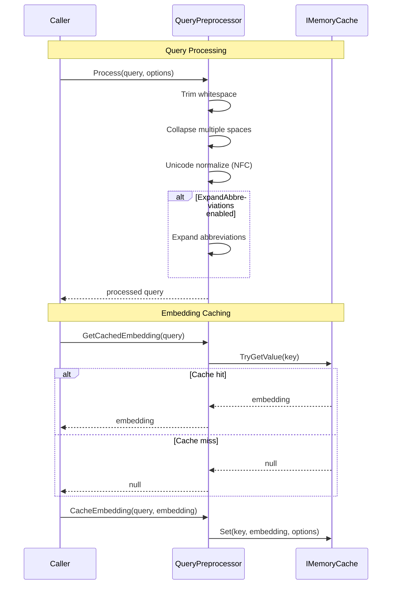
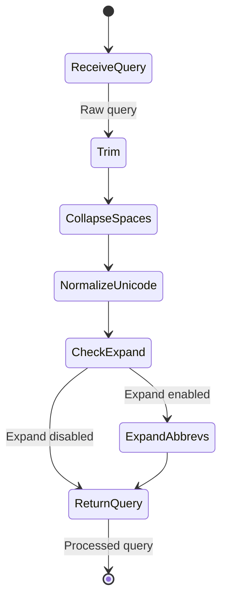

# LCS-DES-045c: Query Preprocessing

## 1. Metadata & Categorization

| Field | Value |
| :--- | :--- |
| **Document ID** | LCS-DES-045c |
| **Feature ID** | RAG-045c |
| **Feature Name** | Query Preprocessing |
| **Target Version** | v0.4.5c |
| **Module Scope** | `Lexichord.Modules.RAG` |
| **Swimlane** | Memory |
| **License Tier** | WriterPro |
| **Feature Gate Key** | `FeatureFlags.RAG.SemanticSearch` |
| **Status** | Draft |
| **Last Updated** | 2026-01-27 |

---

## 2. Executive Summary

### 2.1 The Requirement

Raw user queries may contain inconsistent whitespace, Unicode variations, or abbreviations that could affect embedding quality. Additionally, repeated identical queries should reuse cached embeddings to reduce API costs and latency.

### 2.2 The Proposed Solution

Implement `QueryPreprocessor` that normalizes queries (whitespace, Unicode), optionally expands common abbreviations, and maintains a short-lived cache for query embeddings. The cache uses a 5-minute sliding expiration to balance memory usage with performance.

---

## 3. Architecture & Modular Strategy

### 3.1 Dependencies

**Upstream Modules:**
- `Lexichord.Abstractions` (IQueryPreprocessor interface location)
- v0.4.5a: `SearchOptions` for configuration

**NuGet Packages:**
- `Microsoft.Extensions.Caching.Memory` 9.0.x - In-memory caching

### 3.2 Licensing Behavior

- **Load Behavior:** [x] Soft Gate - Preprocessing is used by licensed search
- **Fallback Experience:** N/A (internal component)

---

## 4. Data Contract (The API)

```csharp
namespace Lexichord.Modules.RAG.Search;

/// <summary>
/// Interface for query preprocessing operations.
/// </summary>
public interface IQueryPreprocessor
{
    /// <summary>
    /// Processes a raw query string for search.
    /// Applies normalization and optional abbreviation expansion.
    /// </summary>
    /// <param name="query">Raw query text.</param>
    /// <param name="options">Search options containing expansion settings.</param>
    /// <returns>Processed query string ready for embedding.</returns>
    string Process(string query, SearchOptions options);

    /// <summary>
    /// Attempts to retrieve a cached query embedding.
    /// </summary>
    /// <param name="query">Processed query text (after Process call).</param>
    /// <returns>Cached embedding array, or null if not cached.</returns>
    float[]? GetCachedEmbedding(string query);

    /// <summary>
    /// Stores a query embedding in the cache.
    /// </summary>
    /// <param name="query">Processed query text.</param>
    /// <param name="embedding">Embedding vector to cache.</param>
    void CacheEmbedding(string query, float[] embedding);

    /// <summary>
    /// Clears all cached embeddings.
    /// </summary>
    void ClearCache();
}

/// <summary>
/// Query preprocessor with normalization, expansion, and embedding caching.
/// </summary>
public sealed class QueryPreprocessor : IQueryPreprocessor
{
    private readonly IMemoryCache _cache;
    private readonly ILogger<QueryPreprocessor> _logger;
    private readonly MemoryCacheEntryOptions _cacheOptions;

    /// <summary>
    /// Cache key prefix for query embeddings.
    /// </summary>
    private const string CacheKeyPrefix = "query_embedding:";

    /// <summary>
    /// Default cache expiration time.
    /// </summary>
    private static readonly TimeSpan DefaultCacheExpiry = TimeSpan.FromMinutes(5);

    /// <summary>
    /// Common abbreviation expansions for technical writing.
    /// </summary>
    private static readonly Dictionary<string, string> Abbreviations = new(StringComparer.OrdinalIgnoreCase)
    {
        // Programming & Development
        ["API"] = "Application Programming Interface",
        ["SDK"] = "Software Development Kit",
        ["IDE"] = "Integrated Development Environment",
        ["CLI"] = "Command Line Interface",
        ["GUI"] = "Graphical User Interface",
        ["UI"] = "User Interface",
        ["UX"] = "User Experience",

        // Data & Databases
        ["DB"] = "Database",
        ["SQL"] = "Structured Query Language",
        ["NoSQL"] = "Not Only SQL",
        ["JSON"] = "JavaScript Object Notation",
        ["XML"] = "Extensible Markup Language",
        ["CSV"] = "Comma Separated Values",
        ["ORM"] = "Object Relational Mapping",
        ["CRUD"] = "Create Read Update Delete",

        // Web & Networking
        ["HTML"] = "HyperText Markup Language",
        ["CSS"] = "Cascading Style Sheets",
        ["HTTP"] = "HyperText Transfer Protocol",
        ["HTTPS"] = "HTTP Secure",
        ["REST"] = "Representational State Transfer",
        ["URL"] = "Uniform Resource Locator",
        ["DNS"] = "Domain Name System",

        // Architecture & Patterns
        ["DI"] = "Dependency Injection",
        ["IoC"] = "Inversion of Control",
        ["MVC"] = "Model View Controller",
        ["MVVM"] = "Model View ViewModel",
        ["SOLID"] = "Single responsibility Open closed Liskov substitution Interface segregation Dependency inversion",
        ["DRY"] = "Don't Repeat Yourself",

        // Process & Methodology
        ["TDD"] = "Test Driven Development",
        ["BDD"] = "Behavior Driven Development",
        ["CI"] = "Continuous Integration",
        ["CD"] = "Continuous Deployment",
        ["MVP"] = "Minimum Viable Product",
        ["POC"] = "Proof of Concept",
        ["QA"] = "Quality Assurance",

        // AI & ML
        ["AI"] = "Artificial Intelligence",
        ["ML"] = "Machine Learning",
        ["NLP"] = "Natural Language Processing",
        ["LLM"] = "Large Language Model",
        ["RAG"] = "Retrieval Augmented Generation"
    };

    public QueryPreprocessor(
        IMemoryCache cache,
        ILogger<QueryPreprocessor> logger)
    {
        _cache = cache;
        _logger = logger;
        _cacheOptions = new MemoryCacheEntryOptions
        {
            SlidingExpiration = DefaultCacheExpiry
        };
    }

    /// <inheritdoc />
    public string Process(string query, SearchOptions options)
    {
        if (string.IsNullOrWhiteSpace(query))
            return string.Empty;

        var original = query;

        // Step 1: Trim leading/trailing whitespace
        var processed = query.Trim();

        // Step 2: Collapse multiple spaces to single space
        processed = CollapseWhitespace(processed);

        // Step 3: Unicode normalization (NFC form)
        processed = processed.Normalize(NormalizationForm.FormC);

        // Step 4: Optional abbreviation expansion
        if (options.ExpandAbbreviations)
        {
            processed = ExpandAbbreviations(processed);
        }

        if (processed != original)
        {
            _logger.LogDebug(
                "Preprocessed query: '{Original}' -> '{Processed}'",
                original, processed);
        }

        return processed;
    }

    /// <inheritdoc />
    public float[]? GetCachedEmbedding(string query)
    {
        var key = GetCacheKey(query);

        if (_cache.TryGetValue(key, out float[]? embedding))
        {
            _logger.LogDebug("Cache hit for query: '{Query}'", TruncateForLog(query));
            return embedding;
        }

        return null;
    }

    /// <inheritdoc />
    public void CacheEmbedding(string query, float[] embedding)
    {
        var key = GetCacheKey(query);
        _cache.Set(key, embedding, _cacheOptions);

        _logger.LogDebug(
            "Cached embedding for query: '{Query}' ({Dimensions} dimensions)",
            TruncateForLog(query), embedding.Length);
    }

    /// <inheritdoc />
    public void ClearCache()
    {
        // IMemoryCache doesn't support clear, but we can use a new instance
        // In practice, entries expire automatically
        _logger.LogInformation("Cache clear requested (entries will expire naturally)");
    }

    /// <summary>
    /// Collapses multiple whitespace characters into single spaces.
    /// </summary>
    private static string CollapseWhitespace(string text)
    {
        return Regex.Replace(text, @"\s+", " ");
    }

    /// <summary>
    /// Expands known abbreviations with their full forms.
    /// Format: "ABBR (Full Form)"
    /// </summary>
    private static string ExpandAbbreviations(string text)
    {
        foreach (var (abbrev, expansion) in Abbreviations)
        {
            // Match whole words only using word boundaries
            var pattern = $@"\b{Regex.Escape(abbrev)}\b";

            // Only expand if not already expanded (avoid double expansion)
            if (!text.Contains($"({expansion})", StringComparison.OrdinalIgnoreCase))
            {
                text = Regex.Replace(
                    text,
                    pattern,
                    $"{abbrev} ({expansion})",
                    RegexOptions.IgnoreCase);
            }
        }

        return text;
    }

    /// <summary>
    /// Generates a cache key for a query.
    /// Uses lowercase hash for case-insensitive matching.
    /// </summary>
    private static string GetCacheKey(string query)
    {
        // Use stable hash code (not GetHashCode which varies by runtime)
        var hash = ComputeStableHash(query.ToLowerInvariant());
        return $"{CacheKeyPrefix}{hash}";
    }

    /// <summary>
    /// Computes a stable hash code for a string.
    /// </summary>
    private static string ComputeStableHash(string input)
    {
        using var sha256 = SHA256.Create();
        var bytes = Encoding.UTF8.GetBytes(input);
        var hash = sha256.ComputeHash(bytes);
        return Convert.ToHexString(hash)[..16]; // First 16 chars
    }

    /// <summary>
    /// Truncates a string for logging purposes.
    /// </summary>
    private static string TruncateForLog(string text, int maxLength = 50)
    {
        return text.Length <= maxLength
            ? text
            : text[..maxLength] + "...";
    }
}
```

---

## 5. Implementation Logic

### 5.1 Processing Pipeline



### 5.2 Abbreviation Expansion

| Input | Output (with expansion) |
| :---- | :---------------------- |
| "How does the API work?" | "How does the API (Application Programming Interface) work?" |
| "UI and UX best practices" | "UI (User Interface) and UX (User Experience) best practices" |
| "CI/CD pipeline setup" | "CI (Continuous Integration)/CD (Continuous Deployment) pipeline setup" |
| "Using RAG with LLMs" | "Using RAG (Retrieval Augmented Generation) with LLMs (Large Language Model)" |

---

## 6. UI/UX Specifications

N/A - This sub-part is a backend service.

---

## 7. Decision Trees

### 7.1 Query Processing

```text
START: Process(query)
│
├── Is query null or whitespace?
│   └── YES → return empty string
│
├── Trim leading/trailing whitespace
│
├── Collapse multiple spaces to single
│
├── Normalize Unicode to NFC form
│
├── Is ExpandAbbreviations enabled?
│   └── YES → Expand known abbreviations
│
└── Return processed query
```

### 7.2 Cache Lookup

```text
START: GetCachedEmbedding(query)
│
├── Compute cache key from query hash
│
├── Try get from IMemoryCache
│   ├── HIT → Return cached embedding
│   └── MISS → Return null
│
└── END
```

---

## 8. User Stories

| ID    | Role            | Story                                                       | Acceptance Criteria                    |
| :---- | :-------------- | :---------------------------------------------------------- | :------------------------------------- |
| US-01 | Writer          | As a writer, I want queries normalized.                     | Whitespace and Unicode normalized.     |
| US-02 | Writer          | As a writer, I want abbreviations expanded (optional).      | "API" becomes "API (Full Form)".       |
| US-03 | Developer       | As a developer, I want query embeddings cached.             | Repeated queries use cache.            |
| US-04 | Developer       | As a developer, I want cache to expire automatically.       | 5-minute sliding expiration.           |

---

## 9. Use Cases

### UC-01: Query Normalization

**Preconditions:**
- User enters query with extra whitespace

**Flow:**
1. User enters "  character   development  tips  ".
2. Preprocessor trims outer whitespace.
3. Preprocessor collapses inner whitespace.
4. Result: "character development tips".

**Postconditions:**
- Query is clean and normalized

### UC-02: Cache Hit

**Preconditions:**
- User previously searched for same query
- Cache entry not expired

**Flow:**
1. User searches "writing tips" again.
2. GetCachedEmbedding returns cached vector.
3. No API call needed.

**Postconditions:**
- Embedding returned from cache

---

## 10. Unit Testing Requirements

```csharp
[Trait("Category", "Unit")]
[Trait("Feature", "v0.4.5c")]
public class QueryPreprocessorTests
{
    private readonly QueryPreprocessor _sut;
    private readonly IMemoryCache _cache;

    public QueryPreprocessorTests()
    {
        _cache = new MemoryCache(new MemoryCacheOptions());
        _sut = new QueryPreprocessor(_cache, NullLogger<QueryPreprocessor>.Instance);
    }

    [Fact]
    public void Process_NullQuery_ReturnsEmpty()
    {
        _sut.Process(null!, SearchOptions.Default).Should().BeEmpty();
    }

    [Fact]
    public void Process_WhitespaceQuery_ReturnsEmpty()
    {
        _sut.Process("   ", SearchOptions.Default).Should().BeEmpty();
    }

    [Fact]
    public void Process_TrimsWhitespace()
    {
        var result = _sut.Process("  test query  ", SearchOptions.Default);
        result.Should().Be("test query");
    }

    [Fact]
    public void Process_CollapsesMultipleSpaces()
    {
        var result = _sut.Process("test    multiple    spaces", SearchOptions.Default);
        result.Should().Be("test multiple spaces");
    }

    [Fact]
    public void Process_NormalizesUnicode()
    {
        // é composed (e + combining accent) vs precomposed é
        var composed = "caf\u0065\u0301"; // e + combining acute
        var result = _sut.Process(composed, SearchOptions.Default);
        result.Should().Be("café"); // Precomposed form
    }

    [Fact]
    public void Process_WithoutExpansion_KeepsAbbreviations()
    {
        var options = new SearchOptions { ExpandAbbreviations = false };
        var result = _sut.Process("API documentation", options);
        result.Should().Be("API documentation");
        result.Should().NotContain("Application Programming Interface");
    }

    [Fact]
    public void Process_WithExpansion_ExpandsAbbreviations()
    {
        var options = new SearchOptions { ExpandAbbreviations = true };
        var result = _sut.Process("API documentation", options);
        result.Should().Contain("Application Programming Interface");
    }

    [Fact]
    public void Process_WithExpansion_PreservesOriginalAbbreviation()
    {
        var options = new SearchOptions { ExpandAbbreviations = true };
        var result = _sut.Process("API docs", options);
        result.Should().StartWith("API"); // Original still present
    }

    [Fact]
    public void Process_WithExpansion_HandlesMultipleAbbreviations()
    {
        var options = new SearchOptions { ExpandAbbreviations = true };
        var result = _sut.Process("UI and UX design", options);
        result.Should().Contain("User Interface");
        result.Should().Contain("User Experience");
    }

    [Fact]
    public void CacheEmbedding_StoresEmbedding()
    {
        var embedding = new float[] { 0.1f, 0.2f, 0.3f };

        _sut.CacheEmbedding("test query", embedding);
        var cached = _sut.GetCachedEmbedding("test query");

        cached.Should().BeEquivalentTo(embedding);
    }

    [Fact]
    public void GetCachedEmbedding_CacheMiss_ReturnsNull()
    {
        var cached = _sut.GetCachedEmbedding("uncached query");
        cached.Should().BeNull();
    }

    [Fact]
    public void GetCachedEmbedding_CaseInsensitive()
    {
        var embedding = new float[] { 0.1f, 0.2f };

        _sut.CacheEmbedding("Test Query", embedding);
        var cached = _sut.GetCachedEmbedding("test query");

        cached.Should().BeEquivalentTo(embedding);
    }
}
```

---

## 11. Observability & Logging

| Level   | Source                   | Message Template                                                       |
| :------ | :----------------------- | :--------------------------------------------------------------------- |
| Debug   | QueryPreprocessor        | `Preprocessed query: '{Original}' -> '{Processed}'`                    |
| Debug   | QueryPreprocessor        | `Cache hit for query: '{Query}'`                                       |
| Debug   | QueryPreprocessor        | `Cached embedding for query: '{Query}' ({Dimensions} dimensions)`      |
| Info    | QueryPreprocessor        | `Cache clear requested (entries will expire naturally)`                |

---

## 12. Workflows



---

## 13. Code Examples

### 13.1 Using the Preprocessor

```csharp
// In PgVectorSearchService
var processedQuery = _preprocessor.Process(query, options);

// Check cache
var cachedEmbedding = _preprocessor.GetCachedEmbedding(processedQuery);
if (cachedEmbedding != null)
{
    // Use cached embedding
    return cachedEmbedding;
}

// Generate new embedding
var embedding = await _embedder.EmbedAsync(processedQuery, ct);

// Cache it
_preprocessor.CacheEmbedding(processedQuery, embedding);
```

### 13.2 DI Registration

```csharp
// In RAGModule.RegisterServices()
services.AddMemoryCache();
services.AddSingleton<IQueryPreprocessor, QueryPreprocessor>();
```

---

## 14. Acceptance Criteria (QA)

| #   | Criterion                                                                    |
| :-- | :--------------------------------------------------------------------------- |
| 1   | Leading/trailing whitespace trimmed from queries.                            |
| 2   | Multiple spaces collapsed to single space.                                   |
| 3   | Unicode normalized to NFC form.                                              |
| 4   | Abbreviations expanded when option enabled.                                  |
| 5   | Abbreviations preserved when option disabled.                                |
| 6   | Cache stores embeddings with 5-minute sliding expiration.                    |
| 7   | Cache lookup is case-insensitive.                                            |
| 8   | Cache miss returns null.                                                     |

---

## 15. Deliverable Checklist

| #  | Deliverable                                                    | Status |
| :- | :------------------------------------------------------------- | :----- |
| 1  | `IQueryPreprocessor` interface                                 | [ ]    |
| 2  | `QueryPreprocessor` implementation                             | [ ]    |
| 3  | Whitespace normalization                                       | [ ]    |
| 4  | Unicode normalization (NFC)                                    | [ ]    |
| 5  | Abbreviation expansion dictionary                              | [ ]    |
| 6  | Query embedding cache                                          | [ ]    |
| 7  | Stable hash for cache keys                                     | [ ]    |
| 8  | Unit tests                                                     | [ ]    |

---

## 16. Verification Commands

```bash
# Run unit tests
dotnet test --filter "Feature=v0.4.5c"

# Verify cache behavior
# (Integration test or manual verification)
```

---

## 17. Changelog Entry

```markdown
### Added (v0.4.5c)

- `IQueryPreprocessor` interface for query preprocessing
- `QueryPreprocessor` with whitespace and Unicode normalization
- Abbreviation expansion for 30+ common technical terms
- Query embedding cache with 5-minute sliding expiration
```

---

## 18. Deferred Features

| Feature                      | Deferred To | Reason                                         |
| :--------------------------- | :---------- | :--------------------------------------------- |
| User-configurable abbreviations | v0.5.x   | Requires settings UI                           |
| Query spell correction       | v0.6.x      | Requires dictionary/ML model                   |
| Synonym expansion            | v0.6.x      | Requires thesaurus integration                 |

---
