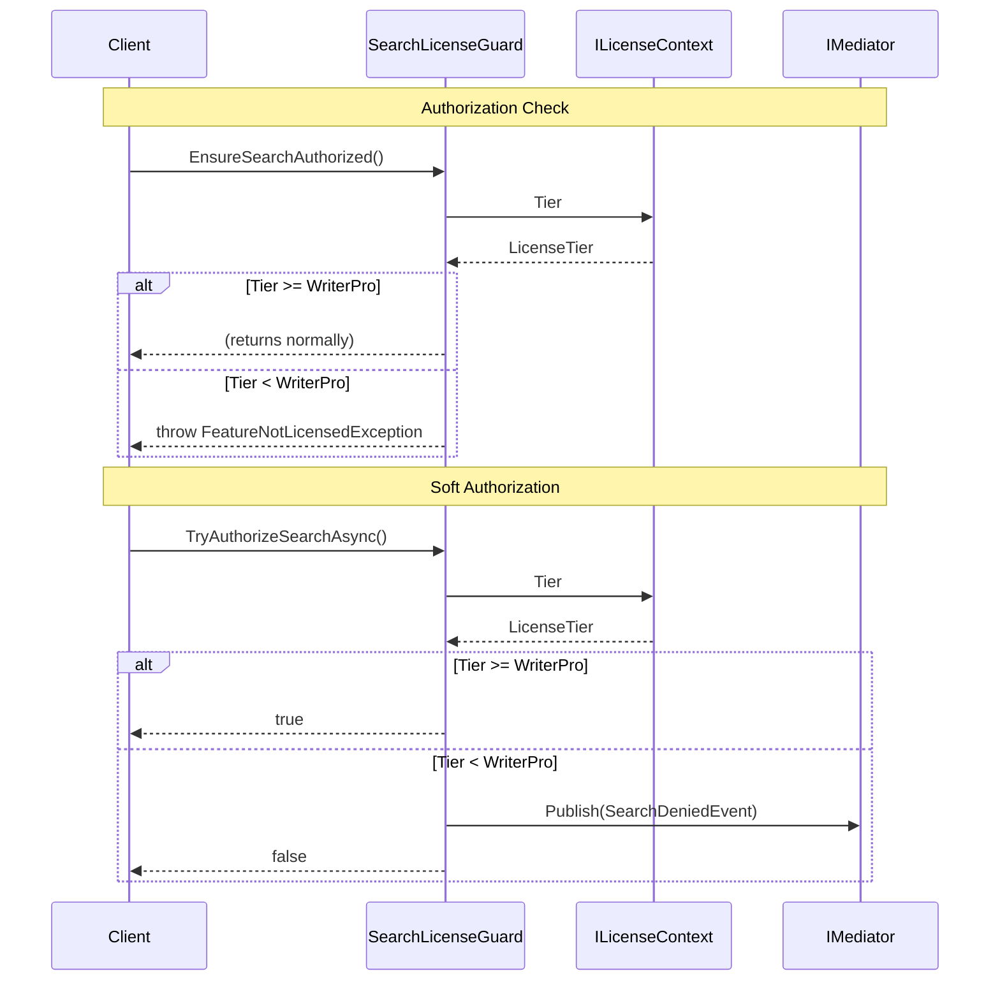
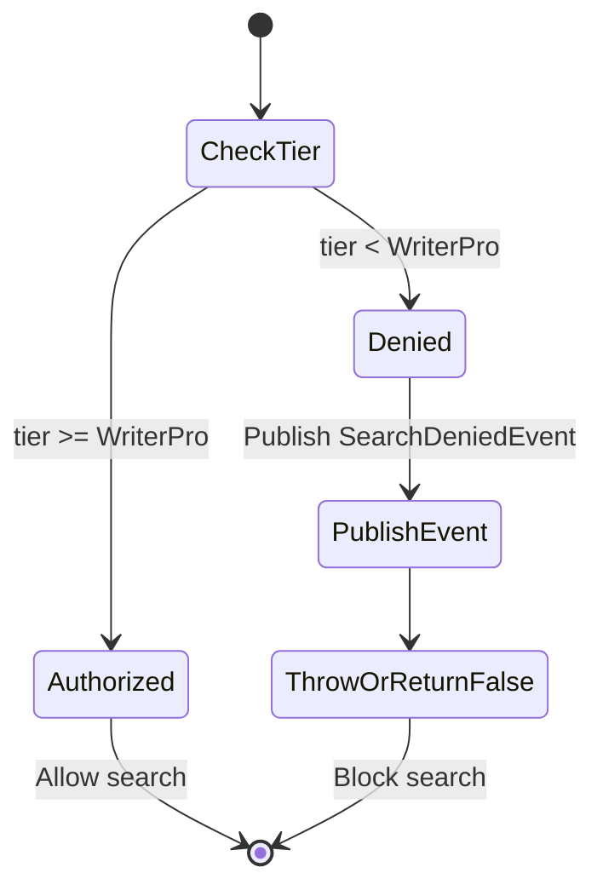

# LCS-DES-045d: License Gating

## 1. Metadata & Categorization

| Field | Value |
| :--- | :--- |
| **Document ID** | LCS-DES-045d |
| **Feature ID** | RAG-045d |
| **Feature Name** | License Gating |
| **Target Version** | v0.4.5d |
| **Module Scope** | `Lexichord.Modules.RAG` |
| **Swimlane** | Memory |
| **License Tier** | WriterPro |
| **Feature Gate Key** | `FeatureFlags.RAG.SemanticSearch` |
| **Status** | Draft |
| **Last Updated** | 2026-01-27 |

---

## 2. Executive Summary

### 2.1 The Requirement

Semantic search is a premium feature that requires external API access (embedding costs). Access must be restricted to WriterPro tier and above, with appropriate user feedback when unlicensed users attempt to use the feature.

### 2.2 The Proposed Solution

Implement `SearchLicenseGuard` helper class that integrates with `ILicenseContext` to validate tier. Create `FeatureNotLicensedException` for consistent error handling. Publish events for telemetry when searches are denied or executed.

---

## 3. Architecture & Modular Strategy

### 3.1 Dependencies

**Upstream Modules:**
- v0.0.4c: `ILicenseContext`, `LicenseTier`
- v0.0.7a: `IMediator` for events

**NuGet Packages:**
- `MediatR` 12.4.x - Event publishing

### 3.2 Licensing Behavior

- **Load Behavior:** [x] Hard enforcement - Exception thrown on unauthorized access
- **Fallback Experience:**
  - `FeatureNotLicensedException` thrown to caller
  - UI displays "Upgrade to WriterPro" modal
  - `SearchDeniedEvent` published for analytics

---

## 4. Data Contract (The API)

```csharp
namespace Lexichord.Modules.RAG.Search;

/// <summary>
/// Exception thrown when a feature requires a higher license tier.
/// </summary>
public sealed class FeatureNotLicensedException : Exception
{
    /// <summary>
    /// The name of the feature that was attempted.
    /// </summary>
    public string FeatureName { get; }

    /// <summary>
    /// The minimum tier required to use this feature.
    /// </summary>
    public LicenseTier RequiredTier { get; }

    /// <summary>
    /// The user's current license tier.
    /// </summary>
    public LicenseTier CurrentTier { get; }

    /// <summary>
    /// Creates a new FeatureNotLicensedException.
    /// </summary>
    /// <param name="featureName">Name of the feature.</param>
    /// <param name="requiredTier">Minimum required tier.</param>
    /// <param name="currentTier">User's current tier (optional).</param>
    public FeatureNotLicensedException(
        string featureName,
        LicenseTier requiredTier,
        LicenseTier? currentTier = null)
        : base($"Feature '{featureName}' requires {requiredTier} license or higher.")
    {
        FeatureName = featureName;
        RequiredTier = requiredTier;
        CurrentTier = currentTier ?? LicenseTier.Core;
    }

    /// <summary>
    /// Creates a new FeatureNotLicensedException with inner exception.
    /// </summary>
    public FeatureNotLicensedException(
        string featureName,
        LicenseTier requiredTier,
        Exception innerException)
        : base($"Feature '{featureName}' requires {requiredTier} license or higher.", innerException)
    {
        FeatureName = featureName;
        RequiredTier = requiredTier;
        CurrentTier = LicenseTier.Core;
    }
}

/// <summary>
/// Guard class for license-gated search operations.
/// Provides centralized license validation for semantic search features.
/// </summary>
public sealed class SearchLicenseGuard
{
    private readonly ILicenseContext _licenseContext;
    private readonly IMediator _mediator;
    private readonly ILogger<SearchLicenseGuard> _logger;

    /// <summary>
    /// The minimum tier required for semantic search.
    /// </summary>
    public const LicenseTier RequiredTier = LicenseTier.WriterPro;

    /// <summary>
    /// The feature name used in exceptions and events.
    /// </summary>
    public const string FeatureName = "Semantic Search";

    public SearchLicenseGuard(
        ILicenseContext licenseContext,
        IMediator mediator,
        ILogger<SearchLicenseGuard> logger)
    {
        _licenseContext = licenseContext;
        _mediator = mediator;
        _logger = logger;
    }

    /// <summary>
    /// Gets whether semantic search is available for the current license.
    /// </summary>
    public bool IsSearchAvailable => _licenseContext.Tier >= RequiredTier;

    /// <summary>
    /// Gets the user's current license tier.
    /// </summary>
    public LicenseTier CurrentTier => _licenseContext.Tier;

    /// <summary>
    /// Validates that the user is authorized for semantic search.
    /// Throws FeatureNotLicensedException if not authorized.
    /// </summary>
    /// <exception cref="FeatureNotLicensedException">
    /// Thrown when user's tier is below WriterPro.
    /// </exception>
    public void EnsureSearchAuthorized()
    {
        if (!IsSearchAvailable)
        {
            _logger.LogDebug(
                "Search authorization failed: current tier {CurrentTier}, required {RequiredTier}",
                CurrentTier, RequiredTier);

            throw new FeatureNotLicensedException(
                FeatureName,
                RequiredTier,
                CurrentTier);
        }

        _logger.LogTrace("Search authorized for tier: {Tier}", CurrentTier);
    }

    /// <summary>
    /// Attempts to authorize search without throwing.
    /// Publishes SearchDeniedEvent if authorization fails.
    /// </summary>
    /// <param name="ct">Cancellation token.</param>
    /// <returns>True if authorized, false otherwise.</returns>
    public async Task<bool> TryAuthorizeSearchAsync(CancellationToken ct = default)
    {
        if (IsSearchAvailable)
        {
            _logger.LogTrace("Search authorized for tier: {Tier}", CurrentTier);
            return true;
        }

        _logger.LogDebug(
            "Search denied: current tier {CurrentTier}, required {RequiredTier}",
            CurrentTier, RequiredTier);

        await _mediator.Publish(new SearchDeniedEvent
        {
            CurrentTier = CurrentTier,
            RequiredTier = RequiredTier,
            FeatureName = FeatureName,
            Timestamp = DateTimeOffset.UtcNow
        }, ct);

        return false;
    }

    /// <summary>
    /// Gets an upgrade message for the current tier.
    /// </summary>
    /// <returns>User-friendly upgrade message.</returns>
    public string GetUpgradeMessage()
    {
        return CurrentTier switch
        {
            LicenseTier.Core => "Upgrade to Writer Pro to unlock semantic search. " +
                               "Search your documents using natural language!",
            LicenseTier.Writer => "Upgrade to Writer Pro to unlock semantic search. " +
                                 "Your Writer license includes great features, but semantic search requires Writer Pro.",
            _ => "Semantic search is available with your license."
        };
    }
}

/// <summary>
/// Published when a search is denied due to license restrictions.
/// Used for analytics and upgrade prompt triggers.
/// </summary>
public record SearchDeniedEvent : INotification
{
    /// <summary>
    /// The user's current license tier.
    /// </summary>
    public required LicenseTier CurrentTier { get; init; }

    /// <summary>
    /// The tier required for this feature.
    /// </summary>
    public required LicenseTier RequiredTier { get; init; }

    /// <summary>
    /// The name of the denied feature.
    /// </summary>
    public required string FeatureName { get; init; }

    /// <summary>
    /// When the denial occurred.
    /// </summary>
    public DateTimeOffset Timestamp { get; init; }
}

/// <summary>
/// Published when a semantic search is successfully executed.
/// Used for analytics and usage tracking.
/// </summary>
public record SemanticSearchExecutedEvent : INotification
{
    /// <summary>
    /// The search query (may be truncated for privacy).
    /// </summary>
    public required string Query { get; init; }

    /// <summary>
    /// Number of results returned.
    /// </summary>
    public int ResultCount { get; init; }

    /// <summary>
    /// Total search duration.
    /// </summary>
    public TimeSpan Duration { get; init; }

    /// <summary>
    /// When the search occurred.
    /// </summary>
    public DateTimeOffset Timestamp { get; init; }

    /// <summary>
    /// Whether query embedding was cached.
    /// </summary>
    public bool UsedCachedEmbedding { get; init; }
}
```

---

## 5. Implementation Logic

### 5.1 Authorization Flow



### 5.2 License Tier Hierarchy

```text
Enterprise (highest)
    │
    ├── All features available
    │
Teams
    │
    ├── Semantic search ✓
    ├── Team collaboration ✓
    │
WriterPro
    │
    ├── Semantic search ✓ (minimum tier)
    ├── Document indexing ✓
    │
Writer
    │
    ├── Semantic search ✗
    │
Core (lowest)
    │
    └── Semantic search ✗
```

---

## 6. UI/UX Specifications

### 6.1 Upgrade Prompt

When an unlicensed user attempts search, the UI should display:

```text
┌─────────────────────────────────────────────────────────────┐
│  🔒 Upgrade to Writer Pro                                   │
├─────────────────────────────────────────────────────────────┤
│                                                             │
│  Semantic Search is a Writer Pro feature.                   │
│                                                             │
│  Search your documents using natural language to find       │
│  related content based on meaning, not just keywords.       │
│                                                             │
│  ┌─────────────────┐  ┌─────────────────┐                   │
│  │   Learn More    │  │    Upgrade      │                   │
│  └─────────────────┘  └─────────────────┘                   │
│                                                             │
└─────────────────────────────────────────────────────────────┘
```

### 6.2 Search Input State

| Tier | Search Input State |
| :--- | :----------------- |
| Core | Disabled with lock icon, "Upgrade to use search" tooltip |
| Writer | Disabled with lock icon, "Upgrade to use search" tooltip |
| WriterPro+ | Enabled, functional |

---

## 7. Decision Trees

### 7.1 Authorization Decision

```text
START: "User attempts search"
│
├── Get current license tier from ILicenseContext
│
├── Is tier >= WriterPro?
│   ├── YES → Allow search, continue
│   └── NO → Block search
│
├── If blocked:
│   ├── Log denial (Debug level)
│   ├── Publish SearchDeniedEvent
│   └── Throw FeatureNotLicensedException OR return false
│
└── END
```

---

## 8. User Stories

| ID    | Role            | Story                                                       | Acceptance Criteria                    |
| :---- | :-------------- | :---------------------------------------------------------- | :------------------------------------- |
| US-01 | Free User       | As a free user, I want to know why search is locked.        | Clear upgrade message displayed.       |
| US-02 | Free User       | As a free user, I want easy path to upgrade.                | Upgrade button in prompt.              |
| US-03 | WriterPro User  | As a WriterPro user, I can search freely.                   | No license prompts or blocks.          |
| US-04 | Developer       | As a developer, I want consistent license checking.         | Single guard class for all checks.     |
| US-05 | Analytics       | As analytics, I want to track denied searches.              | SearchDeniedEvent published.           |

---

## 9. Use Cases

### UC-01: Licensed User Search

**Preconditions:**
- User has WriterPro license

**Flow:**
1. User attempts search.
2. SearchLicenseGuard checks tier.
3. Tier is WriterPro (passes).
4. Search proceeds normally.

**Postconditions:**
- Search results returned

### UC-02: Unlicensed User Search

**Preconditions:**
- User has Core license

**Flow:**
1. User attempts search.
2. SearchLicenseGuard checks tier.
3. Tier is Core (fails).
4. FeatureNotLicensedException thrown.
5. UI catches exception, shows upgrade prompt.
6. SearchDeniedEvent published.

**Postconditions:**
- User sees upgrade prompt

---

## 10. Unit Testing Requirements

```csharp
[Trait("Category", "Unit")]
[Trait("Feature", "v0.4.5d")]
public class FeatureNotLicensedExceptionTests
{
    [Fact]
    public void Constructor_SetsProperties()
    {
        var ex = new FeatureNotLicensedException(
            "Test Feature",
            LicenseTier.WriterPro,
            LicenseTier.Core);

        ex.FeatureName.Should().Be("Test Feature");
        ex.RequiredTier.Should().Be(LicenseTier.WriterPro);
        ex.CurrentTier.Should().Be(LicenseTier.Core);
        ex.Message.Should().Contain("Test Feature");
        ex.Message.Should().Contain("WriterPro");
    }
}

[Trait("Category", "Unit")]
[Trait("Feature", "v0.4.5d")]
public class SearchLicenseGuardTests
{
    [Theory]
    [InlineData(LicenseTier.Core, false)]
    [InlineData(LicenseTier.Writer, false)]
    [InlineData(LicenseTier.WriterPro, true)]
    [InlineData(LicenseTier.Teams, true)]
    [InlineData(LicenseTier.Enterprise, true)]
    public void IsSearchAvailable_ReturnsCorrectValue(LicenseTier tier, bool expected)
    {
        var guard = CreateGuard(tier);
        guard.IsSearchAvailable.Should().Be(expected);
    }

    [Fact]
    public void EnsureSearchAuthorized_WhenAuthorized_DoesNotThrow()
    {
        var guard = CreateGuard(LicenseTier.WriterPro);

        guard.Invoking(g => g.EnsureSearchAuthorized())
            .Should().NotThrow();
    }

    [Fact]
    public void EnsureSearchAuthorized_WhenNotAuthorized_ThrowsException()
    {
        var guard = CreateGuard(LicenseTier.Core);

        guard.Invoking(g => g.EnsureSearchAuthorized())
            .Should().Throw<FeatureNotLicensedException>()
            .Where(ex => ex.RequiredTier == LicenseTier.WriterPro)
            .Where(ex => ex.CurrentTier == LicenseTier.Core);
    }

    [Fact]
    public async Task TryAuthorizeSearchAsync_WhenAuthorized_ReturnsTrue()
    {
        var guard = CreateGuard(LicenseTier.WriterPro);

        var result = await guard.TryAuthorizeSearchAsync();

        result.Should().BeTrue();
    }

    [Fact]
    public async Task TryAuthorizeSearchAsync_WhenNotAuthorized_ReturnsFalse()
    {
        var mediator = new Mock<IMediator>();
        var guard = CreateGuard(LicenseTier.Core, mediator.Object);

        var result = await guard.TryAuthorizeSearchAsync();

        result.Should().BeFalse();
    }

    [Fact]
    public async Task TryAuthorizeSearchAsync_WhenNotAuthorized_PublishesEvent()
    {
        var mediator = new Mock<IMediator>();
        var guard = CreateGuard(LicenseTier.Core, mediator.Object);

        await guard.TryAuthorizeSearchAsync();

        mediator.Verify(m => m.Publish(
            It.Is<SearchDeniedEvent>(e =>
                e.CurrentTier == LicenseTier.Core &&
                e.RequiredTier == LicenseTier.WriterPro),
            It.IsAny<CancellationToken>()),
            Times.Once);
    }

    [Fact]
    public void GetUpgradeMessage_ForCoreTier_ReturnsMessage()
    {
        var guard = CreateGuard(LicenseTier.Core);

        var message = guard.GetUpgradeMessage();

        message.Should().Contain("Upgrade to Writer Pro");
        message.Should().Contain("semantic search");
    }

    private static SearchLicenseGuard CreateGuard(
        LicenseTier tier,
        IMediator? mediator = null)
    {
        var licenseContext = new Mock<ILicenseContext>();
        licenseContext.Setup(c => c.Tier).Returns(tier);

        return new SearchLicenseGuard(
            licenseContext.Object,
            mediator ?? Mock.Of<IMediator>(),
            NullLogger<SearchLicenseGuard>.Instance);
    }
}

[Trait("Category", "Unit")]
[Trait("Feature", "v0.4.5d")]
public class SearchDeniedEventTests
{
    [Fact]
    public void Event_HasRequiredProperties()
    {
        var evt = new SearchDeniedEvent
        {
            CurrentTier = LicenseTier.Core,
            RequiredTier = LicenseTier.WriterPro,
            FeatureName = "Semantic Search",
            Timestamp = DateTimeOffset.UtcNow
        };

        evt.CurrentTier.Should().Be(LicenseTier.Core);
        evt.RequiredTier.Should().Be(LicenseTier.WriterPro);
        evt.FeatureName.Should().Be("Semantic Search");
        evt.Timestamp.Should().BeCloseTo(DateTimeOffset.UtcNow, TimeSpan.FromSeconds(1));
    }
}
```

---

## 11. Observability & Logging

| Level   | Source                   | Message Template                                                       |
| :------ | :----------------------- | :--------------------------------------------------------------------- |
| Trace   | SearchLicenseGuard       | `Search authorized for tier: {Tier}`                                   |
| Debug   | SearchLicenseGuard       | `Search authorization failed: current tier {CurrentTier}, required {RequiredTier}` |
| Debug   | SearchLicenseGuard       | `Search denied: current tier {CurrentTier}, required {RequiredTier}`   |

---

## 12. Workflows



---

## 13. Code Examples

### 13.1 Integration in Search Service

```csharp
public class PgVectorSearchService : ISemanticSearchService
{
    private readonly SearchLicenseGuard _licenseGuard;

    public async Task<SearchResult> SearchAsync(
        string query,
        SearchOptions options,
        CancellationToken ct)
    {
        // First thing: check license
        _licenseGuard.EnsureSearchAuthorized();

        // Continue with search...
    }
}
```

### 13.2 UI Integration

```csharp
// In ReferenceViewModel
public async Task ExecuteSearchAsync()
{
    var authorized = await _licenseGuard.TryAuthorizeSearchAsync();

    if (!authorized)
    {
        // Show upgrade dialog
        var message = _licenseGuard.GetUpgradeMessage();
        await _dialogService.ShowUpgradePromptAsync("Semantic Search", message);
        return;
    }

    // Proceed with search
    var result = await _searchService.SearchAsync(Query, Options);
    // ...
}
```

### 13.3 Event Handler for Analytics

```csharp
public class SearchAnalyticsHandler : INotificationHandler<SearchDeniedEvent>
{
    private readonly ITelemetryService _telemetry;

    public async Task Handle(
        SearchDeniedEvent notification,
        CancellationToken ct)
    {
        await _telemetry.TrackEventAsync("SearchDenied", new
        {
            notification.CurrentTier,
            notification.RequiredTier,
            notification.FeatureName
        });
    }
}
```

---

## 14. Acceptance Criteria (QA)

| #   | Criterion                                                                    |
| :-- | :--------------------------------------------------------------------------- |
| 1   | Core tier users cannot execute semantic search.                              |
| 2   | Writer tier users cannot execute semantic search.                            |
| 3   | WriterPro tier users can execute semantic search.                            |
| 4   | Teams tier users can execute semantic search.                                |
| 5   | Enterprise tier users can execute semantic search.                           |
| 6   | `FeatureNotLicensedException` includes feature name and tiers.               |
| 7   | `SearchDeniedEvent` published when search is blocked.                        |
| 8   | `GetUpgradeMessage()` returns appropriate message for tier.                  |

---

## 15. Deliverable Checklist

| #  | Deliverable                                                    | Status |
| :- | :------------------------------------------------------------- | :----- |
| 1  | `FeatureNotLicensedException` exception class                  | [ ]    |
| 2  | `SearchLicenseGuard` helper class                              | [ ]    |
| 3  | `SearchDeniedEvent` notification                               | [ ]    |
| 4  | `SemanticSearchExecutedEvent` notification                     | [ ]    |
| 5  | Unit tests for exception                                       | [ ]    |
| 6  | Unit tests for guard                                           | [ ]    |
| 7  | Unit tests for events                                          | [ ]    |

---

## 16. Verification Commands

```bash
# Run unit tests
dotnet test --filter "Feature=v0.4.5d"

# Verify license behavior manually:
# 1. Set license to Core tier
# 2. Attempt search - should show upgrade prompt
# 3. Set license to WriterPro tier
# 4. Attempt search - should work
```

---

## 17. Changelog Entry

```markdown
### Added (v0.4.5d)

- `FeatureNotLicensedException` for license enforcement
- `SearchLicenseGuard` helper class
- `SearchDeniedEvent` for analytics
- `SemanticSearchExecutedEvent` for usage tracking
- WriterPro tier requirement for semantic search
```

---

## 18. Deferred Features

| Feature                      | Deferred To | Reason                                         |
| :--------------------------- | :---------- | :--------------------------------------------- |
| Trial access period          | v0.5.x      | Requires trial license support                 |
| Search quota limits          | v0.5.x      | Requires usage tracking                        |
| Per-tier result limits       | v0.5.x      | Requires tiered feature config                 |

---
