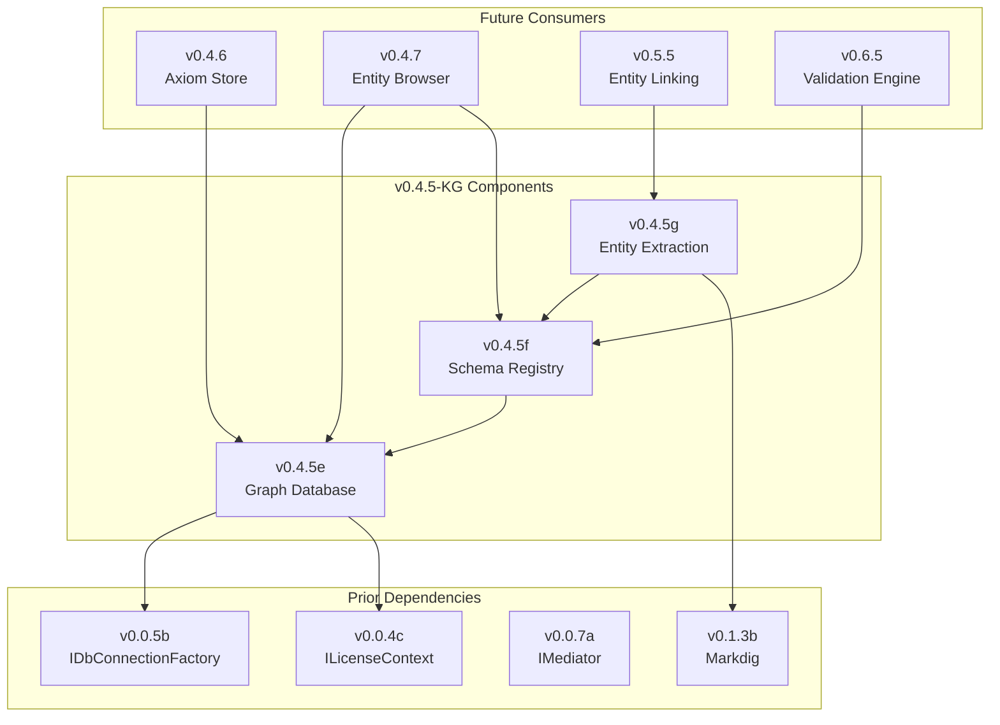

# LCS-DES-045-KG-INDEX: Knowledge Graph Foundation Specs Index

## Document Control

| Field | Value |
| :--- | :--- |
| **Document ID** | LCS-DES-045-KG-INDEX |
| **Version** | v0.4.5 |
| **Feature Set** | Knowledge Graph Foundation (CKVS Phase 1) |
| **Status** | Draft |
| **Last Updated** | 2026-01-31 |

---

## Overview

This index lists all specification documents for the **Knowledge Graph Foundation** feature set, which implements CKVS (Canonical Knowledge Validation System) Phase 1 within Lexichord v0.4.5.

The Knowledge Graph Foundation provides:

- **Neo4j Integration**: Graph database for structured knowledge storage
- **Schema Registry**: YAML-based entity and relationship type definitions
- **Entity Extraction**: Pattern-based extraction of entities from document text

---

## Specification Documents

### System Breakdown Document

| Document ID | Title | Description |
| :---------- | :---- | :---------- |
| [LCS-SBD-045-KG](./LCS-SBD-045-KG.md) | Knowledge Graph Foundation | Master specification covering all sub-parts, architecture, and implementation roadmap |

### Design Specifications

| Document ID | Sub-Part | Title | Module | License | Status |
| :---------- | :------- | :---- | :----- | :------ | :----- |
| [LCS-DES-045-KG-a](./LCS-DES-045-KG-a.md) | v0.4.5e | Graph Database Integration | `Lexichord.Modules.Knowledge` | Teams | ✅ Implemented |
| [LCS-DES-045-KG-b](./LCS-DES-045-KG-b.md) | v0.4.5f | Schema Registry Service | `Lexichord.Modules.Knowledge` | Teams | ✅ Implemented |
| [LCS-DES-045-KG-c](./LCS-DES-045-KG-c.md) | v0.4.5g | Entity Abstraction Layer | `Lexichord.Modules.Knowledge` | Teams | 🔜 Planned |

---

## Component Summary

### v0.4.5e: Graph Database Integration

**Purpose**: Integrate Neo4j graph database for storing knowledge graph entities and relationships.

**Key Interfaces**:
- `IGraphConnectionFactory` — Creates graph database sessions
- `IGraphSession` — Executes Cypher queries
- `IGraphTransaction` — Explicit transaction support

**Key Implementations**:
- `Neo4jConnectionFactory` — Neo4j driver wrapper with connection pooling
- `Neo4jGraphSession` — Query execution with timing and logging
- `Neo4jHealthCheck` — Application health monitoring

**Infrastructure**:
- Docker Compose Neo4j service
- PostgreSQL graph metadata table

---

### v0.4.5f: Schema Registry Service

**Purpose**: Define and enforce entity/relationship type schemas for knowledge graph governance.

**Key Interfaces**:
- `ISchemaRegistry` — Schema management and validation

**Key Records**:
- `EntityTypeSchema` — Entity type definition
- `RelationshipTypeSchema` — Relationship type definition
- `PropertySchema` — Property definition with constraints
- `SchemaValidationResult` — Validation outcome

**Built-In Schemas**:
- `technical-docs.yaml` — Product, Component, Endpoint, Parameter, Response, Concept

---

### v0.4.5g: Entity Abstraction Layer

**Purpose**: Extract entity mentions from document text using pattern matching.

**Key Interfaces**:
- `IEntityExtractor` — Single entity type extractor
- `IEntityExtractionPipeline` — Composite extraction coordinator

**Key Records**:
- `EntityMention` — Extracted entity mention with confidence
- `ExtractionContext` — Extraction parameters
- `ExtractionResult` — Aggregated extraction output
- `AggregatedEntity` — Deduplicated entity from mentions

**Built-In Extractors**:
- `EndpointExtractor` — API endpoint patterns (GET /path, etc.)
- `ParameterExtractor` — Parameters from paths, queries, code
- `ConceptExtractor` — Domain terms and definitions

---

## Dependency Graph



---

## Implementation Timeline

| Week | Tasks |
| :--- | :---- |
| 1 | Docker Compose + Neo4j connection factory |
| 2 | Graph session implementation + health checks |
| 3 | Schema YAML format + loader implementation |
| 4 | Schema validation + built-in technical-docs schema |
| 5 | Entity extraction interfaces + EndpointExtractor |
| 6 | ParameterExtractor + ConceptExtractor + aggregation |
| 7 | Integration tests + DI registration + documentation |

**Total Estimated Effort**: 39 hours (~7 days full-time)

---

## License Gating Summary

| Feature | Core | WriterPro | Teams | Enterprise |
| :------ | :--- | :-------- | :---- | :--------- |
| Graph Database Connection | — | Read-only | Full | Full |
| Schema Registry | — | Read-only | Full | Full |
| Entity Extraction | — | — | Full | Full |
| Custom Ontology Schemas | — | — | — | Full |

---

## Related Documents

### Existing v0.4.5 Specs (The Searcher)

| Document | Description |
| :------- | :---------- |
| [LCS-SBD-045](./LCS-SBD-045.md) | Semantic Search System Breakdown |
| [LCS-DES-045a](./LCS-DES-045a.md) | Search Abstractions |
| [LCS-DES-045b](./LCS-DES-045b.md) | Vector Search Query |
| [LCS-DES-045c](./LCS-DES-045c.md) | Query Preprocessing |
| [LCS-DES-045d](./LCS-DES-045d.md) | License Gating |

### CKVS Integration Strategy

| Document | Location |
| :------- | :------- |
| CKVS Integration Strategy | [`docs/roadmap/CKVS-INTEGRATION-STRATEGY.md`](../../roadmap/CKVS-INTEGRATION-STRATEGY.md) |

---

## Verification Commands

```bash
# Build all Knowledge module components
dotnet build src/Lexichord.Modules.Knowledge

# Run all Knowledge Graph tests
dotnet test --filter "Feature=v0.4.5e|Feature=v0.4.5f|Feature=v0.4.5g"

# Start infrastructure with Neo4j
docker-compose up -d

# Verify Neo4j connectivity
docker exec lexichord-neo4j cypher-shell "RETURN 1"

# Run integration tests
dotnet test --filter "Category=Integration&FullyQualifiedName~Knowledge"
```

---

## Changelog

| Date | Author | Changes |
| :--- | :----- | :------ |
| 2026-01-31 | Lead Architect | Initial creation of Knowledge Graph Foundation specs |

---
