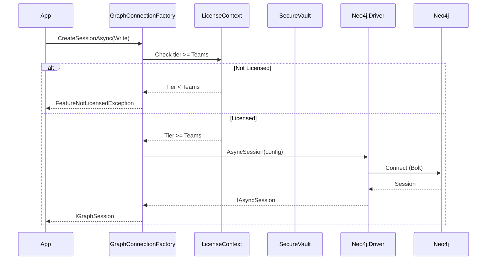
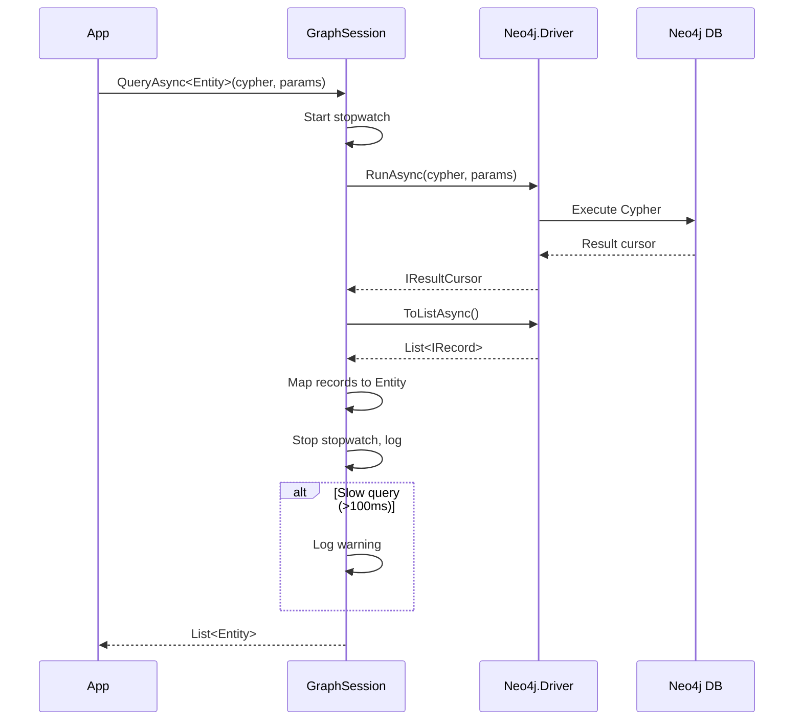

# LCS-DES-045-KG-a: Graph Database Integration

## 1. Metadata & Categorization

| Field | Value |
| :--- | :--- |
| **Document ID** | LCS-DES-045-KG-a |
| **Feature ID** | KG-045e |
| **Feature Name** | Graph Database Integration |
| **Target Version** | v0.4.5e |
| **Module Scope** | `Lexichord.Modules.Knowledge` |
| **Swimlane** | Memory |
| **License Tier** | Teams (full), WriterPro (read-only) |
| **Feature Gate Key** | `knowledge.graph.enabled` |
| **Status** | Draft |
| **Last Updated** | 2026-01-31 |

---

## 2. Executive Summary

### 2.1 The Requirement

The Knowledge Graph requires a dedicated graph database to store entities and their relationships. While PostgreSQL excels at relational data and pgvector handles embeddings, graph databases are optimized for traversing relationships and pattern matching — essential for knowledge validation.

### 2.2 The Proposed Solution

Integrate Neo4j 5.x Community Edition as the graph database:

- **Docker Compose**: Add Neo4j container alongside existing services.
- **Connection Factory**: Create `IGraphConnectionFactory` following existing `IDbConnectionFactory` pattern.
- **Session Management**: Implement `IGraphSession` for Cypher query execution.
- **Health Checks**: Integrate Neo4j into application health monitoring.
- **Metadata Storage**: Track graph connection config in PostgreSQL for consistency.

---

## 3. Architecture & Modular Strategy

### 3.1 Dependencies

**Upstream Modules:**
- `Lexichord.Abstractions` — Interface definitions
- `Lexichord.Infrastructure` — Base connection patterns
- v0.0.5b: `IDbConnectionFactory` — Pattern reference
- v0.0.3d: `IConfiguration` — Connection settings

**NuGet Packages:**
- `Neo4j.Driver` (5.x) — Official Neo4j Bolt driver

### 3.2 Module Placement

```
Lexichord.Abstractions/
├── Contracts/
│   ├── IGraphConnectionFactory.cs
│   ├── IGraphSession.cs
│   └── KnowledgeRecords.cs

Lexichord.Modules.Knowledge/
├── Graph/
│   ├── Neo4jConnectionFactory.cs
│   ├── Neo4jGraphSession.cs
│   ├── Neo4jHealthCheck.cs
│   └── GraphConfiguration.cs
├── Migrations/
│   └── Migration_005_GraphMetadata.cs
└── KnowledgeModule.cs
```

### 3.3 Licensing Behavior

- **Load Behavior:** [x] Conditional — Graph services only loaded at Teams+
- **Fallback Experience:** WriterPro gets read-only access; Core tier sees upgrade prompt

---

## 4. Data Contract (The API)

### 4.1 Core Interfaces

```csharp
namespace Lexichord.Abstractions.Contracts;

/// <summary>
/// Factory for creating graph database connections.
/// Follows same pattern as IDbConnectionFactory for consistency.
/// </summary>
public interface IGraphConnectionFactory
{
    /// <summary>
    /// Creates a new graph database session for query execution.
    /// Sessions should be disposed after use.
    /// </summary>
    /// <param name="accessMode">Read or Write access mode.</param>
    /// <param name="ct">Cancellation token.</param>
    /// <returns>A new graph session.</returns>
    Task<IGraphSession> CreateSessionAsync(
        GraphAccessMode accessMode = GraphAccessMode.Write,
        CancellationToken ct = default);

    /// <summary>
    /// Tests the graph database connection.
    /// </summary>
    /// <param name="ct">Cancellation token.</param>
    /// <returns>True if connection successful.</returns>
    Task<bool> TestConnectionAsync(CancellationToken ct = default);

    /// <summary>
    /// Gets the current database name.
    /// </summary>
    string DatabaseName { get; }
}

/// <summary>
/// Access mode for graph sessions.
/// </summary>
public enum GraphAccessMode
{
    /// <summary>Read-only queries (can use read replicas).</summary>
    Read,
    /// <summary>Read-write queries (requires primary).</summary>
    Write
}

/// <summary>
/// A session for executing graph queries.
/// Wraps Neo4j session with simplified interface.
/// </summary>
public interface IGraphSession : IAsyncDisposable
{
    /// <summary>
    /// Executes a Cypher query and returns typed results.
    /// </summary>
    /// <typeparam name="T">Result type (record or primitive).</typeparam>
    /// <param name="cypher">Cypher query string.</param>
    /// <param name="parameters">Optional query parameters.</param>
    /// <param name="ct">Cancellation token.</param>
    /// <returns>Query results.</returns>
    Task<IReadOnlyList<T>> QueryAsync<T>(
        string cypher,
        object? parameters = null,
        CancellationToken ct = default);

    /// <summary>
    /// Executes a Cypher query and returns raw records.
    /// </summary>
    /// <param name="cypher">Cypher query string.</param>
    /// <param name="parameters">Optional query parameters.</param>
    /// <param name="ct">Cancellation token.</param>
    /// <returns>Raw query records.</returns>
    Task<IReadOnlyList<IGraphRecord>> QueryRawAsync(
        string cypher,
        object? parameters = null,
        CancellationToken ct = default);

    /// <summary>
    /// Executes a Cypher write operation (CREATE, MERGE, DELETE, SET).
    /// </summary>
    /// <param name="cypher">Cypher statement.</param>
    /// <param name="parameters">Optional query parameters.</param>
    /// <param name="ct">Cancellation token.</param>
    /// <returns>Number of affected nodes/relationships.</returns>
    Task<GraphWriteResult> ExecuteAsync(
        string cypher,
        object? parameters = null,
        CancellationToken ct = default);

    /// <summary>
    /// Begins an explicit transaction.
    /// </summary>
    Task<IGraphTransaction> BeginTransactionAsync(CancellationToken ct = default);
}

/// <summary>
/// Result of a graph write operation.
/// </summary>
public record GraphWriteResult
{
    /// <summary>Number of nodes created.</summary>
    public int NodesCreated { get; init; }

    /// <summary>Number of nodes deleted.</summary>
    public int NodesDeleted { get; init; }

    /// <summary>Number of relationships created.</summary>
    public int RelationshipsCreated { get; init; }

    /// <summary>Number of relationships deleted.</summary>
    public int RelationshipsDeleted { get; init; }

    /// <summary>Number of properties set.</summary>
    public int PropertiesSet { get; init; }

    /// <summary>Total affected items.</summary>
    public int TotalAffected =>
        NodesCreated + NodesDeleted +
        RelationshipsCreated + RelationshipsDeleted +
        PropertiesSet;
}

/// <summary>
/// A raw record from graph query results.
/// </summary>
public interface IGraphRecord
{
    /// <summary>Gets a value by key.</summary>
    T Get<T>(string key);

    /// <summary>Tries to get a value by key.</summary>
    bool TryGet<T>(string key, out T? value);

    /// <summary>Gets all keys in the record.</summary>
    IReadOnlyList<string> Keys { get; }
}

/// <summary>
/// An explicit graph transaction.
/// </summary>
public interface IGraphTransaction : IAsyncDisposable
{
    /// <summary>Executes a query within the transaction.</summary>
    Task<IReadOnlyList<T>> QueryAsync<T>(string cypher, object? parameters = null, CancellationToken ct = default);

    /// <summary>Executes a write within the transaction.</summary>
    Task<GraphWriteResult> ExecuteAsync(string cypher, object? parameters = null, CancellationToken ct = default);

    /// <summary>Commits the transaction.</summary>
    Task CommitAsync(CancellationToken ct = default);

    /// <summary>Rolls back the transaction.</summary>
    Task RollbackAsync(CancellationToken ct = default);
}
```

### 4.2 Knowledge Entity Records

```csharp
namespace Lexichord.Abstractions.Contracts;

/// <summary>
/// A node in the knowledge graph.
/// </summary>
public record KnowledgeEntity
{
    /// <summary>Unique identifier (UUID).</summary>
    public Guid Id { get; init; } = Guid.NewGuid();

    /// <summary>Entity type (must match schema).</summary>
    public required string Type { get; init; }

    /// <summary>Display name.</summary>
    public required string Name { get; init; }

    /// <summary>Entity properties (key-value pairs).</summary>
    public Dictionary<string, object> Properties { get; init; } = new();

    /// <summary>Source document IDs that reference this entity.</summary>
    public List<Guid> SourceDocuments { get; init; } = new();

    /// <summary>When the entity was created.</summary>
    public DateTimeOffset CreatedAt { get; init; } = DateTimeOffset.UtcNow;

    /// <summary>When the entity was last modified.</summary>
    public DateTimeOffset ModifiedAt { get; init; } = DateTimeOffset.UtcNow;
}

/// <summary>
/// A relationship between two entities.
/// </summary>
public record KnowledgeRelationship
{
    /// <summary>Unique identifier.</summary>
    public Guid Id { get; init; } = Guid.NewGuid();

    /// <summary>Relationship type (must match schema).</summary>
    public required string Type { get; init; }

    /// <summary>Source entity ID.</summary>
    public required Guid FromEntityId { get; init; }

    /// <summary>Target entity ID.</summary>
    public required Guid ToEntityId { get; init; }

    /// <summary>Relationship properties.</summary>
    public Dictionary<string, object> Properties { get; init; } = new();

    /// <summary>When the relationship was created.</summary>
    public DateTimeOffset CreatedAt { get; init; } = DateTimeOffset.UtcNow;
}
```

### 4.3 Configuration

```csharp
namespace Lexichord.Modules.Knowledge.Graph;

/// <summary>
/// Configuration for Neo4j connection.
/// </summary>
public record GraphConfiguration
{
    /// <summary>Section name in appsettings.</summary>
    public const string SectionName = "Knowledge:Graph";

    /// <summary>Neo4j Bolt URI (e.g., "bolt://localhost:7687").</summary>
    public string Uri { get; init; } = "bolt://localhost:7687";

    /// <summary>Database name (default: "neo4j").</summary>
    public string Database { get; init; } = "neo4j";

    /// <summary>Username for authentication.</summary>
    public string Username { get; init; } = "neo4j";

    /// <summary>Password for authentication (from secure vault).</summary>
    public string? Password { get; init; }

    /// <summary>Connection pool size.</summary>
    public int MaxConnectionPoolSize { get; init; } = 100;

    /// <summary>Connection timeout in seconds.</summary>
    public int ConnectionTimeoutSeconds { get; init; } = 30;

    /// <summary>Query timeout in seconds.</summary>
    public int QueryTimeoutSeconds { get; init; } = 60;

    /// <summary>Whether to enable encrypted connections.</summary>
    public bool Encrypted { get; init; } = false;
}
```

---

## 5. Implementation Logic

### 5.1 Neo4jConnectionFactory

```csharp
namespace Lexichord.Modules.Knowledge.Graph;

/// <summary>
/// Factory for creating Neo4j graph sessions.
/// </summary>
public sealed class Neo4jConnectionFactory : IGraphConnectionFactory, IAsyncDisposable
{
    private readonly IDriver _driver;
    private readonly GraphConfiguration _config;
    private readonly ILicenseContext _licenseContext;
    private readonly ILogger<Neo4jConnectionFactory> _logger;

    public Neo4jConnectionFactory(
        IOptions<GraphConfiguration> config,
        ISecureVault vault,
        ILicenseContext licenseContext,
        ILogger<Neo4jConnectionFactory> logger)
    {
        _config = config.Value;
        _licenseContext = licenseContext;
        _logger = logger;

        // Get password from secure vault
        var password = vault.GetSecretAsync("neo4j:password").GetAwaiter().GetResult()
            ?? _config.Password
            ?? throw new InvalidOperationException("Neo4j password not configured");

        // Create driver with configuration
        _driver = GraphDatabase.Driver(
            _config.Uri,
            AuthTokens.Basic(_config.Username, password),
            builder => builder
                .WithMaxConnectionPoolSize(_config.MaxConnectionPoolSize)
                .WithConnectionTimeout(TimeSpan.FromSeconds(_config.ConnectionTimeoutSeconds))
                .WithDefaultReadBufferSize(64 * 1024)
                .WithEncryptionLevel(_config.Encrypted
                    ? EncryptionLevel.Encrypted
                    : EncryptionLevel.None));

        _logger.LogInformation("Neo4j driver created for {Uri}", _config.Uri);
    }

    public string DatabaseName => _config.Database;

    public async Task<IGraphSession> CreateSessionAsync(
        GraphAccessMode accessMode = GraphAccessMode.Write,
        CancellationToken ct = default)
    {
        // License check for write access
        if (accessMode == GraphAccessMode.Write &&
            _licenseContext.Tier < LicenseTier.Teams)
        {
            throw new FeatureNotLicensedException(
                "Knowledge Graph Write Access",
                LicenseTier.Teams);
        }

        // License check for read access
        if (_licenseContext.Tier < LicenseTier.WriterPro)
        {
            throw new FeatureNotLicensedException(
                "Knowledge Graph",
                LicenseTier.WriterPro);
        }

        var neo4jAccessMode = accessMode == GraphAccessMode.Read
            ? AccessMode.Read
            : AccessMode.Write;

        var session = _driver.AsyncSession(builder => builder
            .WithDatabase(_config.Database)
            .WithDefaultAccessMode(neo4jAccessMode));

        return new Neo4jGraphSession(session, _config.QueryTimeoutSeconds, _logger);
    }

    public async Task<bool> TestConnectionAsync(CancellationToken ct = default)
    {
        try
        {
            await _driver.VerifyConnectivityAsync();
            _logger.LogDebug("Neo4j connection verified");
            return true;
        }
        catch (Exception ex)
        {
            _logger.LogWarning(ex, "Neo4j connection test failed");
            return false;
        }
    }

    public async ValueTask DisposeAsync()
    {
        await _driver.DisposeAsync();
    }
}
```

### 5.2 Neo4jGraphSession

```csharp
namespace Lexichord.Modules.Knowledge.Graph;

/// <summary>
/// Neo4j session wrapper implementing IGraphSession.
/// </summary>
internal sealed class Neo4jGraphSession : IGraphSession
{
    private readonly IAsyncSession _session;
    private readonly int _queryTimeoutSeconds;
    private readonly ILogger _logger;

    public Neo4jGraphSession(
        IAsyncSession session,
        int queryTimeoutSeconds,
        ILogger logger)
    {
        _session = session;
        _queryTimeoutSeconds = queryTimeoutSeconds;
        _logger = logger;
    }

    public async Task<IReadOnlyList<T>> QueryAsync<T>(
        string cypher,
        object? parameters = null,
        CancellationToken ct = default)
    {
        var stopwatch = Stopwatch.StartNew();

        try
        {
            var result = await _session.RunAsync(cypher, parameters?.ToDictionary());

            var records = await result.ToListAsync(ct);

            stopwatch.Stop();

            _logger.LogDebug(
                "Cypher query completed in {Duration}ms, {Count} records",
                stopwatch.ElapsedMilliseconds, records.Count);

            if (stopwatch.ElapsedMilliseconds > 100)
            {
                _logger.LogWarning(
                    "Slow Cypher query ({Duration}ms): {Query}",
                    stopwatch.ElapsedMilliseconds, cypher[..Math.Min(200, cypher.Length)]);
            }

            return records.Select(r => MapRecord<T>(r)).ToList();
        }
        catch (Neo4jException ex)
        {
            _logger.LogError(ex, "Cypher query failed: {Query}", cypher);
            throw new GraphQueryException($"Graph query failed: {ex.Message}", ex);
        }
    }

    public async Task<IReadOnlyList<IGraphRecord>> QueryRawAsync(
        string cypher,
        object? parameters = null,
        CancellationToken ct = default)
    {
        var result = await _session.RunAsync(cypher, parameters?.ToDictionary());
        var records = await result.ToListAsync(ct);
        return records.Select(r => new Neo4jGraphRecord(r)).ToList();
    }

    public async Task<GraphWriteResult> ExecuteAsync(
        string cypher,
        object? parameters = null,
        CancellationToken ct = default)
    {
        var stopwatch = Stopwatch.StartNew();

        try
        {
            var result = await _session.RunAsync(cypher, parameters?.ToDictionary());
            var summary = await result.ConsumeAsync();

            stopwatch.Stop();

            _logger.LogDebug(
                "Cypher write completed in {Duration}ms",
                stopwatch.ElapsedMilliseconds);

            return new GraphWriteResult
            {
                NodesCreated = summary.Counters.NodesCreated,
                NodesDeleted = summary.Counters.NodesDeleted,
                RelationshipsCreated = summary.Counters.RelationshipsCreated,
                RelationshipsDeleted = summary.Counters.RelationshipsDeleted,
                PropertiesSet = summary.Counters.PropertiesSet
            };
        }
        catch (Neo4jException ex)
        {
            _logger.LogError(ex, "Cypher write failed: {Query}", cypher);
            throw new GraphQueryException($"Graph write failed: {ex.Message}", ex);
        }
    }

    public async Task<IGraphTransaction> BeginTransactionAsync(CancellationToken ct = default)
    {
        var tx = await _session.BeginTransactionAsync();
        return new Neo4jGraphTransaction(tx, _logger);
    }

    public async ValueTask DisposeAsync()
    {
        await _session.CloseAsync();
    }

    private static T MapRecord<T>(IRecord record)
    {
        // Handle primitive types
        if (typeof(T).IsPrimitive || typeof(T) == typeof(string))
        {
            return record[0].As<T>();
        }

        // Handle KnowledgeEntity
        if (typeof(T) == typeof(KnowledgeEntity))
        {
            var node = record[0].As<INode>();
            return (T)(object)new KnowledgeEntity
            {
                Id = Guid.Parse(node.Properties["id"].As<string>()),
                Type = node.Labels.First(),
                Name = node.Properties["name"].As<string>(),
                Properties = node.Properties
                    .Where(p => p.Key != "id" && p.Key != "name")
                    .ToDictionary(p => p.Key, p => p.Value),
                CreatedAt = node.Properties.TryGetValue("createdAt", out var ca)
                    ? DateTimeOffset.Parse(ca.As<string>())
                    : DateTimeOffset.UtcNow
            };
        }

        // Default: use first column value
        return record[0].As<T>();
    }
}
```

### 5.3 Docker Compose Update

```yaml
# docker-compose.yml (additions)
services:
  neo4j:
    image: neo4j:5.15-community
    container_name: lexichord-neo4j
    ports:
      - "7474:7474"  # HTTP
      - "7687:7687"  # Bolt
    environment:
      - NEO4J_AUTH=neo4j/lexichord_dev_password
      - NEO4J_PLUGINS=["apoc"]
      - NEO4J_dbms_memory_heap_initial__size=256m
      - NEO4J_dbms_memory_heap_max__size=512m
      - NEO4J_dbms_memory_pagecache_size=128m
    volumes:
      - neo4j_data:/data
      - neo4j_logs:/logs
    healthcheck:
      test: ["CMD", "wget", "-qO-", "http://localhost:7474"]
      interval: 10s
      timeout: 5s
      retries: 5
    networks:
      - lexichord-network

volumes:
  neo4j_data:
  neo4j_logs:
```

### 5.4 Health Check Integration

```csharp
namespace Lexichord.Modules.Knowledge.Graph;

/// <summary>
/// Health check for Neo4j connection.
/// </summary>
public sealed class Neo4jHealthCheck : IHealthCheck
{
    private readonly IGraphConnectionFactory _factory;

    public Neo4jHealthCheck(IGraphConnectionFactory factory)
    {
        _factory = factory;
    }

    public async Task<HealthCheckResult> CheckHealthAsync(
        HealthCheckContext context,
        CancellationToken ct = default)
    {
        try
        {
            var connected = await _factory.TestConnectionAsync(ct);

            return connected
                ? HealthCheckResult.Healthy("Neo4j connection successful")
                : HealthCheckResult.Unhealthy("Neo4j connection failed");
        }
        catch (Exception ex)
        {
            return HealthCheckResult.Unhealthy(
                "Neo4j health check exception",
                ex);
        }
    }
}
```

### 5.5 PostgreSQL Metadata Migration

```csharp
namespace Lexichord.Modules.Knowledge.Migrations;

/// <summary>
/// Creates metadata table for graph connection tracking.
/// </summary>
[Migration(5)]
public class Migration_005_GraphMetadata : Migration
{
    public override void Up()
    {
        Create.Table("graph_metadata")
            .WithColumn("id").AsGuid().PrimaryKey()
            .WithColumn("connection_uri").AsString(500).NotNullable()
            .WithColumn("database_name").AsString(100).NotNullable()
            .WithColumn("last_connected_at").AsDateTimeOffset().Nullable()
            .WithColumn("entity_count").AsInt32().WithDefaultValue(0)
            .WithColumn("relationship_count").AsInt32().WithDefaultValue(0)
            .WithColumn("schema_version").AsString(50).Nullable()
            .WithColumn("created_at").AsDateTimeOffset().NotNullable()
                .WithDefault(SystemMethods.CurrentUTCDateTime)
            .WithColumn("updated_at").AsDateTimeOffset().NotNullable()
                .WithDefault(SystemMethods.CurrentUTCDateTime);

        // Document-entity link table
        Create.Table("document_entities")
            .WithColumn("document_id").AsGuid().NotNullable()
            .WithColumn("entity_id").AsGuid().NotNullable()
            .WithColumn("mention_count").AsInt32().WithDefaultValue(1)
            .WithColumn("first_seen_at").AsDateTimeOffset().NotNullable()
            .WithColumn("last_seen_at").AsDateTimeOffset().NotNullable();

        Create.PrimaryKey("pk_document_entities")
            .OnTable("document_entities")
            .Columns("document_id", "entity_id");

        Create.Index("ix_document_entities_entity")
            .OnTable("document_entities")
            .OnColumn("entity_id");
    }

    public override void Down()
    {
        Delete.Table("document_entities");
        Delete.Table("graph_metadata");
    }
}
```

---

## 6. Flow Diagrams

### 6.1 Connection Creation Flow



### 6.2 Query Execution Flow



---

## 7. Decision Trees

### 7.1 Access Mode Selection

```text
START: "Application needs graph access"
│
├── What operation type?
│   ├── Read-only (queries, lookups)
│   │   └── Use GraphAccessMode.Read
│   │       └── Can use read replicas (future)
│   │
│   └── Write (create, update, delete)
│       └── Use GraphAccessMode.Write
│           └── Requires primary node
│
└── END
```

### 7.2 License Enforcement

```text
START: "Create graph session"
│
├── Access mode is Write?
│   └── YES → Check tier >= Teams
│       ├── NO → Throw FeatureNotLicensedException
│       └── YES → Continue
│
├── Check tier >= WriterPro
│   ├── NO → Throw FeatureNotLicensedException
│   └── YES → Continue
│
└── Create and return session
```

---

## 8. User Stories

| ID | Role | Story | Acceptance Criteria |
| :- | :--- | :---- | :------------------ |
| US-01 | Developer | As a developer, I want a clean interface for graph queries. | IGraphSession executes Cypher and returns typed results. |
| US-02 | Developer | As a developer, I want connection pooling. | Driver manages connection pool automatically. |
| US-03 | DevOps | As a DevOps engineer, I want Neo4j in Docker Compose. | `docker-compose up` starts Neo4j alongside other services. |
| US-04 | DevOps | As a DevOps engineer, I want health checks. | Health endpoint includes Neo4j status. |

---

## 9. Unit Testing Requirements

```csharp
[Trait("Category", "Integration")]
[Trait("Feature", "v0.4.5e")]
public class Neo4jConnectionFactoryTests : IAsyncLifetime
{
    private Neo4jConnectionFactory _factory = null!;

    public async Task InitializeAsync()
    {
        _factory = CreateFactoryWithTeamsLicense();
    }

    public async Task DisposeAsync()
    {
        await _factory.DisposeAsync();
    }

    [Fact]
    public async Task CreateSessionAsync_WithTeamsLicense_ReturnsSession()
    {
        // Act
        await using var session = await _factory.CreateSessionAsync();

        // Assert
        session.Should().NotBeNull();
    }

    [Fact]
    public async Task CreateSessionAsync_Write_WithWriterProLicense_Throws()
    {
        // Arrange
        var factory = CreateFactoryWithWriterProLicense();

        // Act & Assert
        await factory.Invoking(f => f.CreateSessionAsync(GraphAccessMode.Write))
            .Should().ThrowAsync<FeatureNotLicensedException>()
            .WithMessage("*Teams*");
    }

    [Fact]
    public async Task TestConnectionAsync_WhenNeo4jRunning_ReturnsTrue()
    {
        // Act
        var result = await _factory.TestConnectionAsync();

        // Assert
        result.Should().BeTrue();
    }
}

[Trait("Category", "Integration")]
[Trait("Feature", "v0.4.5e")]
public class Neo4jGraphSessionTests : IAsyncLifetime
{
    private IGraphSession _session = null!;

    public async Task InitializeAsync()
    {
        var factory = CreateFactoryWithTeamsLicense();
        _session = await factory.CreateSessionAsync();
    }

    public async Task DisposeAsync()
    {
        await _session.DisposeAsync();
    }

    [Fact]
    public async Task QueryAsync_SimpleQuery_ReturnsResults()
    {
        // Arrange
        var cypher = "RETURN 1 AS value";

        // Act
        var results = await _session.QueryAsync<int>(cypher);

        // Assert
        results.Should().ContainSingle().Which.Should().Be(1);
    }

    [Fact]
    public async Task ExecuteAsync_CreateNode_ReturnsWriteResult()
    {
        // Arrange
        var cypher = @"
            CREATE (n:TestEntity {id: $id, name: $name})
            RETURN n";
        var parameters = new { id = Guid.NewGuid().ToString(), name = "Test" };

        // Act
        var result = await _session.ExecuteAsync(cypher, parameters);

        // Assert
        result.NodesCreated.Should().Be(1);

        // Cleanup
        await _session.ExecuteAsync(
            "MATCH (n:TestEntity {id: $id}) DELETE n",
            new { id = parameters.id });
    }

    [Fact]
    public async Task QueryAsync_KnowledgeEntity_MapsCorrectly()
    {
        // Arrange
        var id = Guid.NewGuid().ToString();
        await _session.ExecuteAsync(
            "CREATE (n:Product {id: $id, name: $name, version: $version})",
            new { id, name = "TestProduct", version = "1.0" });

        // Act
        var results = await _session.QueryAsync<KnowledgeEntity>(
            "MATCH (n:Product {id: $id}) RETURN n",
            new { id });

        // Assert
        results.Should().ContainSingle();
        results[0].Type.Should().Be("Product");
        results[0].Name.Should().Be("TestProduct");
        results[0].Properties["version"].Should().Be("1.0");

        // Cleanup
        await _session.ExecuteAsync(
            "MATCH (n:Product {id: $id}) DELETE n",
            new { id });
    }
}
```

---

## 10. Observability & Logging

| Level | Source | Message Template |
| :---- | :----- | :--------------- |
| Info | Neo4jConnectionFactory | `Neo4j driver created for {Uri}` |
| Debug | Neo4jConnectionFactory | `Creating graph session: {AccessMode}` |
| Debug | Neo4jGraphSession | `Cypher query completed in {Duration}ms, {Count} records` |
| Warning | Neo4jGraphSession | `Slow Cypher query ({Duration}ms): {Query}` |
| Error | Neo4jGraphSession | `Cypher query failed: {Query}` |
| Warning | Neo4jConnectionFactory | `Neo4j connection test failed` |

---

## 11. Configuration Example

```json
// appsettings.json
{
  "Knowledge": {
    "Graph": {
      "Uri": "bolt://localhost:7687",
      "Database": "neo4j",
      "Username": "neo4j",
      "MaxConnectionPoolSize": 100,
      "ConnectionTimeoutSeconds": 30,
      "QueryTimeoutSeconds": 60,
      "Encrypted": false
    }
  }
}
```

```json
// appsettings.Production.json
{
  "Knowledge": {
    "Graph": {
      "Uri": "bolt://neo4j.internal:7687",
      "Encrypted": true
    }
  }
}
```

---

## 12. Acceptance Criteria (QA)

| # | Criterion |
| :- | :-------- |
| 1 | Neo4j container starts via `docker-compose up`. |
| 2 | `IGraphConnectionFactory.TestConnectionAsync()` returns true. |
| 3 | `IGraphSession.QueryAsync<T>()` executes Cypher and returns typed results. |
| 4 | `IGraphSession.ExecuteAsync()` returns write statistics. |
| 5 | Teams license grants full read/write access. |
| 6 | WriterPro license grants read-only access. |
| 7 | Core license throws `FeatureNotLicensedException`. |
| 8 | Health check endpoint includes Neo4j status. |
| 9 | Slow queries (>100ms) logged at Warning level. |
| 10 | Connection pool manages concurrent sessions. |

---

## 13. Deliverable Checklist

| # | Deliverable | Status |
| :- | :---------- | :----- |
| 1 | Docker Compose Neo4j service | [ ] |
| 2 | `IGraphConnectionFactory` interface | [ ] |
| 3 | `IGraphSession` interface | [ ] |
| 4 | `IGraphRecord` interface | [ ] |
| 5 | `IGraphTransaction` interface | [ ] |
| 6 | `GraphAccessMode` enum | [ ] |
| 7 | `GraphWriteResult` record | [ ] |
| 8 | `KnowledgeEntity` record | [ ] |
| 9 | `KnowledgeRelationship` record | [ ] |
| 10 | `Neo4jConnectionFactory` implementation | [ ] |
| 11 | `Neo4jGraphSession` implementation | [ ] |
| 12 | `Neo4jHealthCheck` implementation | [ ] |
| 13 | `GraphConfiguration` record | [ ] |
| 14 | `Migration_005_GraphMetadata` | [ ] |
| 15 | Integration tests | [ ] |

---

## 14. Verification Commands

```bash
# Start Neo4j
docker-compose up neo4j -d

# Verify Neo4j is accessible
docker exec lexichord-neo4j cypher-shell -u neo4j -p lexichord_dev_password "RETURN 1"

# Run integration tests
dotnet test --filter "Feature=v0.4.5e"

# Check health endpoint
curl http://localhost:5000/health
```

---

## 15. Changelog Entry

```markdown
### Added (v0.4.5e)

- `IGraphConnectionFactory` interface for Neo4j connections
- `IGraphSession` for Cypher query execution
- `Neo4jConnectionFactory` with connection pooling
- `Neo4jGraphSession` with query timing and logging
- `Neo4jHealthCheck` for application health monitoring
- Docker Compose Neo4j service configuration
- PostgreSQL graph metadata migration
```

---
