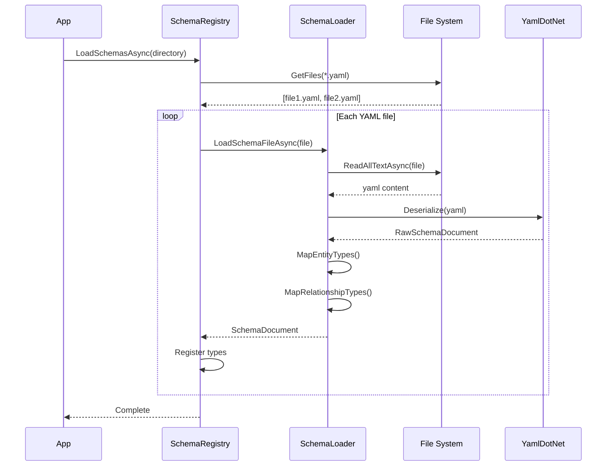
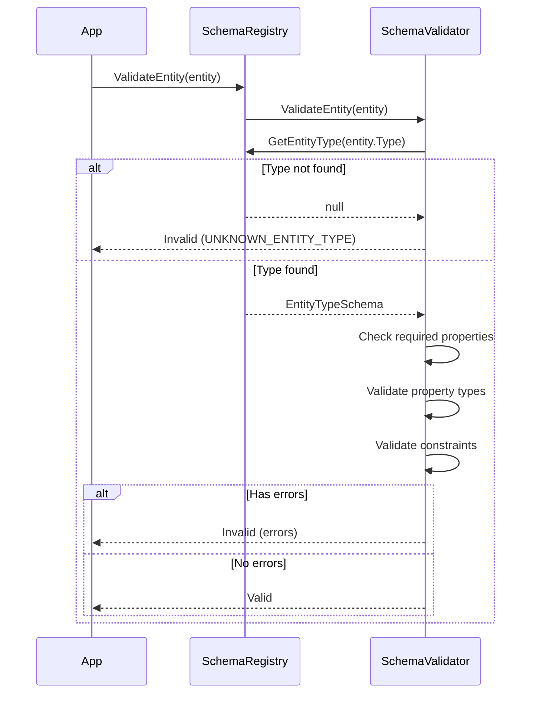

# LCS-DES-045-KG-b: Schema Registry Service

## 1. Metadata & Categorization

| Field | Value |
| :--- | :--- |
| **Document ID** | LCS-DES-045-KG-b |
| **Feature ID** | KG-045f |
| **Feature Name** | Schema Registry Service |
| **Target Version** | v0.4.5f |
| **Module Scope** | `Lexichord.Modules.Knowledge` |
| **Swimlane** | Governance |
| **License Tier** | Teams (full), Enterprise (custom schemas) |
| **Feature Gate Key** | `knowledge.schema.enabled` |
| **Status** | Draft |
| **Last Updated** | 2026-01-31 |

---

## 2. Executive Summary

### 2.1 The Requirement

The Knowledge Graph needs a governance layer that defines what entity types and relationships are valid. Without schema enforcement, the graph becomes an unstructured dumping ground of arbitrary nodes, making validation and querying unreliable.

### 2.2 The Proposed Solution

Implement a Schema Registry that:

- **Defines entity types** (Product, Component, Endpoint, Parameter, Response) via YAML.
- **Defines relationship types** (CONTAINS, EXPOSES, ACCEPTS, RETURNS) with source/target constraints.
- **Validates entities** before creation against their declared type schema.
- **Supports schema versioning** for evolution without breaking existing data.
- **Ships built-in schemas** for technical documentation (API docs).

---

## 3. Architecture & Modular Strategy

### 3.1 Dependencies

**Upstream Modules:**
- `Lexichord.Abstractions` — Interface definitions
- v0.1.6a: `ISettingsService` — Schema file location settings

**NuGet Packages:**
- `YamlDotNet` (15.x) — YAML parsing

### 3.2 Module Placement

```
Lexichord.Abstractions/
├── Contracts/
│   ├── ISchemaRegistry.cs
│   └── SchemaRecords.cs

Lexichord.Modules.Knowledge/
├── Schema/
│   ├── SchemaRegistry.cs
│   ├── SchemaLoader.cs
│   ├── SchemaValidator.cs
│   └── BuiltInSchemas/
│       └── technical-docs.yaml
└── KnowledgeModule.cs
```

### 3.3 Schema File Location

Schemas are stored in the workspace at `.lexichord/knowledge/schema/`:

```
.lexichord/
└── knowledge/
    └── schema/
        ├── technical-docs.yaml    # Built-in (copied on init)
        └── custom-domain.yaml     # User-defined (Enterprise)
```

---

## 4. Data Contract (The API)

### 4.1 Schema Registry Interface

```csharp
namespace Lexichord.Abstractions.Contracts;

/// <summary>
/// Registry for knowledge graph schemas.
/// Manages entity types, relationship types, and validation.
/// </summary>
public interface ISchemaRegistry
{
    /// <summary>
    /// Gets all registered entity type schemas.
    /// Key is the entity type name (e.g., "Product", "Endpoint").
    /// </summary>
    IReadOnlyDictionary<string, EntityTypeSchema> EntityTypes { get; }

    /// <summary>
    /// Gets all registered relationship type schemas.
    /// Key is the relationship type name (e.g., "CONTAINS", "ACCEPTS").
    /// </summary>
    IReadOnlyDictionary<string, RelationshipTypeSchema> RelationshipTypes { get; }

    /// <summary>
    /// Gets the current schema version.
    /// </summary>
    string SchemaVersion { get; }

    /// <summary>
    /// Gets an entity type schema by name.
    /// </summary>
    /// <param name="typeName">Entity type name.</param>
    /// <returns>Schema if found, null otherwise.</returns>
    EntityTypeSchema? GetEntityType(string typeName);

    /// <summary>
    /// Gets a relationship type schema by name.
    /// </summary>
    /// <param name="typeName">Relationship type name.</param>
    /// <returns>Schema if found, null otherwise.</returns>
    RelationshipTypeSchema? GetRelationshipType(string typeName);

    /// <summary>
    /// Validates an entity against its type schema.
    /// </summary>
    /// <param name="entity">Entity to validate.</param>
    /// <returns>Validation result with any errors.</returns>
    SchemaValidationResult ValidateEntity(KnowledgeEntity entity);

    /// <summary>
    /// Validates a relationship against its type schema.
    /// </summary>
    /// <param name="relationship">Relationship to validate.</param>
    /// <param name="fromEntity">Source entity.</param>
    /// <param name="toEntity">Target entity.</param>
    /// <returns>Validation result with any errors.</returns>
    SchemaValidationResult ValidateRelationship(
        KnowledgeRelationship relationship,
        KnowledgeEntity fromEntity,
        KnowledgeEntity toEntity);

    /// <summary>
    /// Loads schemas from a directory.
    /// </summary>
    /// <param name="schemaDirectory">Path to schema YAML files.</param>
    /// <param name="ct">Cancellation token.</param>
    Task LoadSchemasAsync(string schemaDirectory, CancellationToken ct = default);

    /// <summary>
    /// Reloads all schemas (useful after file changes).
    /// </summary>
    Task ReloadAsync(CancellationToken ct = default);

    /// <summary>
    /// Gets valid relationship types between two entity types.
    /// </summary>
    /// <param name="fromType">Source entity type.</param>
    /// <param name="toType">Target entity type.</param>
    /// <returns>List of valid relationship type names.</returns>
    IReadOnlyList<string> GetValidRelationships(string fromType, string toType);
}
```

### 4.2 Schema Records

```csharp
namespace Lexichord.Abstractions.Contracts;

/// <summary>
/// Schema definition for an entity type.
/// </summary>
public record EntityTypeSchema
{
    /// <summary>Entity type name (e.g., "Product", "Endpoint").</summary>
    public required string Name { get; init; }

    /// <summary>Human-readable description.</summary>
    public string? Description { get; init; }

    /// <summary>Property definitions for this entity type.</summary>
    public required IReadOnlyList<PropertySchema> Properties { get; init; }

    /// <summary>Names of required properties.</summary>
    public IReadOnlyList<string> RequiredProperties { get; init; } = Array.Empty<string>();

    /// <summary>Parent entity type for inheritance (optional).</summary>
    public string? Extends { get; init; }

    /// <summary>Whether this type is abstract (cannot be instantiated directly).</summary>
    public bool IsAbstract { get; init; } = false;

    /// <summary>Icon identifier for UI display.</summary>
    public string? Icon { get; init; }

    /// <summary>Color for UI display (hex code).</summary>
    public string? Color { get; init; }
}

/// <summary>
/// Schema definition for a property.
/// </summary>
public record PropertySchema
{
    /// <summary>Property name.</summary>
    public required string Name { get; init; }

    /// <summary>Data type (string, number, boolean, text, enum, array).</summary>
    public required PropertyType Type { get; init; }

    /// <summary>Human-readable description.</summary>
    public string? Description { get; init; }

    /// <summary>Whether this property is required.</summary>
    public bool Required { get; init; } = false;

    /// <summary>Default value (as string, parsed by type).</summary>
    public string? DefaultValue { get; init; }

    /// <summary>Valid values for enum type.</summary>
    public IReadOnlyList<string>? EnumValues { get; init; }

    /// <summary>Minimum value for number type.</summary>
    public double? MinValue { get; init; }

    /// <summary>Maximum value for number type.</summary>
    public double? MaxValue { get; init; }

    /// <summary>Maximum length for string type.</summary>
    public int? MaxLength { get; init; }

    /// <summary>Regex pattern for string validation.</summary>
    public string? Pattern { get; init; }

    /// <summary>Element type for array properties.</summary>
    public PropertyType? ArrayElementType { get; init; }
}

/// <summary>
/// Property data types.
/// </summary>
public enum PropertyType
{
    String,
    Text,       // Long text, no length limit
    Number,
    Boolean,
    Enum,
    Array,
    DateTime,
    Reference   // Reference to another entity
}

/// <summary>
/// Schema definition for a relationship type.
/// </summary>
public record RelationshipTypeSchema
{
    /// <summary>Relationship type name (e.g., "CONTAINS", "ACCEPTS").</summary>
    public required string Name { get; init; }

    /// <summary>Human-readable description.</summary>
    public string? Description { get; init; }

    /// <summary>Valid source entity types.</summary>
    public required IReadOnlyList<string> FromEntityTypes { get; init; }

    /// <summary>Valid target entity types.</summary>
    public required IReadOnlyList<string> ToEntityTypes { get; init; }

    /// <summary>Property definitions for this relationship.</summary>
    public IReadOnlyList<PropertySchema>? Properties { get; init; }

    /// <summary>Cardinality constraint (OneToOne, OneToMany, ManyToMany).</summary>
    public Cardinality Cardinality { get; init; } = Cardinality.ManyToMany;

    /// <summary>Whether the relationship is directional.</summary>
    public bool Directional { get; init; } = true;
}

/// <summary>
/// Relationship cardinality constraints.
/// </summary>
public enum Cardinality
{
    OneToOne,
    OneToMany,
    ManyToOne,
    ManyToMany
}

/// <summary>
/// Result of schema validation.
/// </summary>
public record SchemaValidationResult
{
    /// <summary>Whether validation passed.</summary>
    public bool IsValid => Errors.Count == 0;

    /// <summary>Validation errors (empty if valid).</summary>
    public IReadOnlyList<SchemaValidationError> Errors { get; init; } = Array.Empty<SchemaValidationError>();

    /// <summary>Validation warnings (non-blocking).</summary>
    public IReadOnlyList<SchemaValidationWarning> Warnings { get; init; } = Array.Empty<SchemaValidationWarning>();

    /// <summary>Creates a valid result.</summary>
    public static SchemaValidationResult Valid() => new();

    /// <summary>Creates an invalid result with errors.</summary>
    public static SchemaValidationResult Invalid(params SchemaValidationError[] errors) =>
        new() { Errors = errors };
}

/// <summary>
/// A schema validation error.
/// </summary>
public record SchemaValidationError
{
    /// <summary>Error code for programmatic handling.</summary>
    public required string Code { get; init; }

    /// <summary>Human-readable error message.</summary>
    public required string Message { get; init; }

    /// <summary>Property name that failed validation (if applicable).</summary>
    public string? PropertyName { get; init; }

    /// <summary>Actual value that was invalid (if applicable).</summary>
    public object? ActualValue { get; init; }
}

/// <summary>
/// A schema validation warning.
/// </summary>
public record SchemaValidationWarning
{
    /// <summary>Warning code.</summary>
    public required string Code { get; init; }

    /// <summary>Human-readable message.</summary>
    public required string Message { get; init; }

    /// <summary>Property name (if applicable).</summary>
    public string? PropertyName { get; init; }
}
```

---

## 5. Implementation Logic

### 5.1 SchemaRegistry Implementation

```csharp
namespace Lexichord.Modules.Knowledge.Schema;

/// <summary>
/// In-memory registry of knowledge graph schemas.
/// </summary>
public sealed class SchemaRegistry : ISchemaRegistry
{
    private readonly ILogger<SchemaRegistry> _logger;
    private readonly SchemaLoader _loader;
    private readonly SchemaValidator _validator;

    private readonly Dictionary<string, EntityTypeSchema> _entityTypes = new(StringComparer.OrdinalIgnoreCase);
    private readonly Dictionary<string, RelationshipTypeSchema> _relationshipTypes = new(StringComparer.OrdinalIgnoreCase);

    private string _schemaVersion = "0.0.0";
    private string? _schemaDirectory;

    public SchemaRegistry(ILogger<SchemaRegistry> logger)
    {
        _logger = logger;
        _loader = new SchemaLoader(logger);
        _validator = new SchemaValidator(this);
    }

    public IReadOnlyDictionary<string, EntityTypeSchema> EntityTypes => _entityTypes;
    public IReadOnlyDictionary<string, RelationshipTypeSchema> RelationshipTypes => _relationshipTypes;
    public string SchemaVersion => _schemaVersion;

    public EntityTypeSchema? GetEntityType(string typeName) =>
        _entityTypes.TryGetValue(typeName, out var schema) ? schema : null;

    public RelationshipTypeSchema? GetRelationshipType(string typeName) =>
        _relationshipTypes.TryGetValue(typeName, out var schema) ? schema : null;

    public SchemaValidationResult ValidateEntity(KnowledgeEntity entity) =>
        _validator.ValidateEntity(entity);

    public SchemaValidationResult ValidateRelationship(
        KnowledgeRelationship relationship,
        KnowledgeEntity fromEntity,
        KnowledgeEntity toEntity) =>
        _validator.ValidateRelationship(relationship, fromEntity, toEntity);

    public async Task LoadSchemasAsync(string schemaDirectory, CancellationToken ct = default)
    {
        _schemaDirectory = schemaDirectory;

        _logger.LogInformation("Loading schemas from {Directory}", schemaDirectory);

        // Clear existing schemas
        _entityTypes.Clear();
        _relationshipTypes.Clear();

        // Load all YAML files in directory
        var yamlFiles = Directory.GetFiles(schemaDirectory, "*.yaml", SearchOption.AllDirectories)
            .Concat(Directory.GetFiles(schemaDirectory, "*.yml", SearchOption.AllDirectories));

        foreach (var file in yamlFiles)
        {
            try
            {
                var schema = await _loader.LoadSchemaFileAsync(file, ct);

                foreach (var entityType in schema.EntityTypes)
                {
                    if (_entityTypes.TryAdd(entityType.Name, entityType))
                    {
                        _logger.LogDebug("Registered entity type: {Type}", entityType.Name);
                    }
                    else
                    {
                        _logger.LogWarning("Duplicate entity type ignored: {Type} in {File}", entityType.Name, file);
                    }
                }

                foreach (var relType in schema.RelationshipTypes)
                {
                    if (_relationshipTypes.TryAdd(relType.Name, relType))
                    {
                        _logger.LogDebug("Registered relationship type: {Type}", relType.Name);
                    }
                    else
                    {
                        _logger.LogWarning("Duplicate relationship type ignored: {Type} in {File}", relType.Name, file);
                    }
                }

                // Track highest schema version
                if (Version.TryParse(schema.SchemaVersion, out var version) &&
                    Version.TryParse(_schemaVersion, out var current) &&
                    version > current)
                {
                    _schemaVersion = schema.SchemaVersion;
                }
            }
            catch (Exception ex)
            {
                _logger.LogError(ex, "Failed to load schema file: {File}", file);
            }
        }

        _logger.LogInformation(
            "Schema loading complete: {EntityCount} entity types, {RelCount} relationship types",
            _entityTypes.Count, _relationshipTypes.Count);
    }

    public async Task ReloadAsync(CancellationToken ct = default)
    {
        if (_schemaDirectory != null)
        {
            await LoadSchemasAsync(_schemaDirectory, ct);
        }
    }

    public IReadOnlyList<string> GetValidRelationships(string fromType, string toType)
    {
        return _relationshipTypes.Values
            .Where(r => r.FromEntityTypes.Contains(fromType, StringComparer.OrdinalIgnoreCase) &&
                        r.ToEntityTypes.Contains(toType, StringComparer.OrdinalIgnoreCase))
            .Select(r => r.Name)
            .ToList();
    }
}
```

### 5.2 SchemaLoader (YAML Parsing)

```csharp
namespace Lexichord.Modules.Knowledge.Schema;

/// <summary>
/// Loads schema definitions from YAML files.
/// </summary>
internal sealed class SchemaLoader
{
    private readonly ILogger _logger;
    private readonly IDeserializer _deserializer;

    public SchemaLoader(ILogger logger)
    {
        _logger = logger;
        _deserializer = new DeserializerBuilder()
            .WithNamingConvention(UnderscoredNamingConvention.Instance)
            .IgnoreUnmatchedProperties()
            .Build();
    }

    public async Task<SchemaDocument> LoadSchemaFileAsync(string filePath, CancellationToken ct = default)
    {
        var yaml = await File.ReadAllTextAsync(filePath, ct);

        var rawDoc = _deserializer.Deserialize<RawSchemaDocument>(yaml);

        return new SchemaDocument
        {
            SchemaVersion = rawDoc.SchemaVersion ?? "1.0",
            Name = rawDoc.Name ?? Path.GetFileNameWithoutExtension(filePath),
            Description = rawDoc.Description,
            EntityTypes = rawDoc.EntityTypes?.Select(MapEntityType).ToList()
                ?? new List<EntityTypeSchema>(),
            RelationshipTypes = rawDoc.RelationshipTypes?.Select(MapRelationshipType).ToList()
                ?? new List<RelationshipTypeSchema>()
        };
    }

    private EntityTypeSchema MapEntityType(RawEntityType raw)
    {
        var properties = raw.Properties?.Select(MapProperty).ToList()
            ?? new List<PropertySchema>();

        return new EntityTypeSchema
        {
            Name = raw.Name,
            Description = raw.Description,
            Properties = properties,
            RequiredProperties = properties.Where(p => p.Required).Select(p => p.Name).ToList(),
            Extends = raw.Extends,
            IsAbstract = raw.IsAbstract,
            Icon = raw.Icon,
            Color = raw.Color
        };
    }

    private RelationshipTypeSchema MapRelationshipType(RawRelationshipType raw)
    {
        return new RelationshipTypeSchema
        {
            Name = raw.Name,
            Description = raw.Description,
            FromEntityTypes = raw.From is string s ? new[] { s } : (raw.From as List<object>)?.Select(x => x.ToString()!).ToList() ?? new List<string>(),
            ToEntityTypes = raw.To is string t ? new[] { t } : (raw.To as List<object>)?.Select(x => x.ToString()!).ToList() ?? new List<string>(),
            Properties = raw.Properties?.Select(MapProperty).ToList(),
            Cardinality = Enum.TryParse<Cardinality>(raw.Cardinality, true, out var c) ? c : Cardinality.ManyToMany,
            Directional = raw.Directional ?? true
        };
    }

    private PropertySchema MapProperty(RawProperty raw)
    {
        return new PropertySchema
        {
            Name = raw.Name,
            Type = Enum.TryParse<PropertyType>(raw.Type, true, out var t) ? t : PropertyType.String,
            Description = raw.Description,
            Required = raw.Required,
            DefaultValue = raw.Default?.ToString(),
            EnumValues = raw.Values?.ToList(),
            MinValue = raw.Min,
            MaxValue = raw.Max,
            MaxLength = raw.MaxLength,
            Pattern = raw.Pattern
        };
    }

    // Raw YAML mapping classes
    private class RawSchemaDocument
    {
        public string? SchemaVersion { get; set; }
        public string? Name { get; set; }
        public string? Description { get; set; }
        public List<RawEntityType>? EntityTypes { get; set; }
        public List<RawRelationshipType>? RelationshipTypes { get; set; }
    }

    private class RawEntityType
    {
        public string Name { get; set; } = "";
        public string? Description { get; set; }
        public List<RawProperty>? Properties { get; set; }
        public string? Extends { get; set; }
        public bool IsAbstract { get; set; }
        public string? Icon { get; set; }
        public string? Color { get; set; }
    }

    private class RawRelationshipType
    {
        public string Name { get; set; } = "";
        public string? Description { get; set; }
        public object? From { get; set; }  // string or list
        public object? To { get; set; }    // string or list
        public List<RawProperty>? Properties { get; set; }
        public string? Cardinality { get; set; }
        public bool? Directional { get; set; }
    }

    private class RawProperty
    {
        public string Name { get; set; } = "";
        public string Type { get; set; } = "string";
        public string? Description { get; set; }
        public bool Required { get; set; }
        public object? Default { get; set; }
        public List<string>? Values { get; set; }
        public double? Min { get; set; }
        public double? Max { get; set; }
        public int? MaxLength { get; set; }
        public string? Pattern { get; set; }
    }
}

/// <summary>
/// Parsed schema document.
/// </summary>
internal record SchemaDocument
{
    public string SchemaVersion { get; init; } = "1.0";
    public string Name { get; init; } = "";
    public string? Description { get; init; }
    public IReadOnlyList<EntityTypeSchema> EntityTypes { get; init; } = Array.Empty<EntityTypeSchema>();
    public IReadOnlyList<RelationshipTypeSchema> RelationshipTypes { get; init; } = Array.Empty<RelationshipTypeSchema>();
}
```

### 5.3 SchemaValidator

```csharp
namespace Lexichord.Modules.Knowledge.Schema;

/// <summary>
/// Validates entities and relationships against their schemas.
/// </summary>
internal sealed class SchemaValidator
{
    private readonly ISchemaRegistry _registry;

    public SchemaValidator(ISchemaRegistry registry)
    {
        _registry = registry;
    }

    public SchemaValidationResult ValidateEntity(KnowledgeEntity entity)
    {
        var errors = new List<SchemaValidationError>();
        var warnings = new List<SchemaValidationWarning>();

        // Check entity type exists
        var schema = _registry.GetEntityType(entity.Type);
        if (schema == null)
        {
            return SchemaValidationResult.Invalid(new SchemaValidationError
            {
                Code = "UNKNOWN_ENTITY_TYPE",
                Message = $"Entity type '{entity.Type}' is not defined in schema"
            });
        }

        // Check abstract
        if (schema.IsAbstract)
        {
            errors.Add(new SchemaValidationError
            {
                Code = "ABSTRACT_TYPE",
                Message = $"Cannot create instance of abstract type '{entity.Type}'"
            });
        }

        // Validate required properties
        foreach (var requiredProp in schema.RequiredProperties)
        {
            if (!entity.Properties.ContainsKey(requiredProp) ||
                entity.Properties[requiredProp] == null ||
                (entity.Properties[requiredProp] is string s && string.IsNullOrWhiteSpace(s)))
            {
                errors.Add(new SchemaValidationError
                {
                    Code = "REQUIRED_PROPERTY_MISSING",
                    Message = $"Required property '{requiredProp}' is missing or empty",
                    PropertyName = requiredProp
                });
            }
        }

        // Validate each provided property
        foreach (var (propName, propValue) in entity.Properties)
        {
            var propSchema = schema.Properties.FirstOrDefault(p =>
                p.Name.Equals(propName, StringComparison.OrdinalIgnoreCase));

            if (propSchema == null)
            {
                // Extra property not in schema
                warnings.Add(new SchemaValidationWarning
                {
                    Code = "UNKNOWN_PROPERTY",
                    Message = $"Property '{propName}' is not defined in schema for type '{entity.Type}'",
                    PropertyName = propName
                });
                continue;
            }

            // Type validation
            var typeErrors = ValidatePropertyType(propSchema, propValue);
            errors.AddRange(typeErrors);

            // Constraint validation
            var constraintErrors = ValidatePropertyConstraints(propSchema, propValue);
            errors.AddRange(constraintErrors);
        }

        // Check name property (always required for display)
        if (string.IsNullOrWhiteSpace(entity.Name))
        {
            errors.Add(new SchemaValidationError
            {
                Code = "NAME_REQUIRED",
                Message = "Entity 'name' is required",
                PropertyName = "name"
            });
        }

        return new SchemaValidationResult
        {
            Errors = errors,
            Warnings = warnings
        };
    }

    public SchemaValidationResult ValidateRelationship(
        KnowledgeRelationship relationship,
        KnowledgeEntity fromEntity,
        KnowledgeEntity toEntity)
    {
        var errors = new List<SchemaValidationError>();

        // Check relationship type exists
        var schema = _registry.GetRelationshipType(relationship.Type);
        if (schema == null)
        {
            return SchemaValidationResult.Invalid(new SchemaValidationError
            {
                Code = "UNKNOWN_RELATIONSHIP_TYPE",
                Message = $"Relationship type '{relationship.Type}' is not defined in schema"
            });
        }

        // Check from entity type is valid
        if (!schema.FromEntityTypes.Contains(fromEntity.Type, StringComparer.OrdinalIgnoreCase))
        {
            errors.Add(new SchemaValidationError
            {
                Code = "INVALID_FROM_TYPE",
                Message = $"Relationship '{relationship.Type}' cannot originate from entity type '{fromEntity.Type}'. " +
                          $"Valid types: {string.Join(", ", schema.FromEntityTypes)}"
            });
        }

        // Check to entity type is valid
        if (!schema.ToEntityTypes.Contains(toEntity.Type, StringComparer.OrdinalIgnoreCase))
        {
            errors.Add(new SchemaValidationError
            {
                Code = "INVALID_TO_TYPE",
                Message = $"Relationship '{relationship.Type}' cannot target entity type '{toEntity.Type}'. " +
                          $"Valid types: {string.Join(", ", schema.ToEntityTypes)}"
            });
        }

        // Validate relationship properties
        if (schema.Properties != null)
        {
            foreach (var propSchema in schema.Properties.Where(p => p.Required))
            {
                if (!relationship.Properties.ContainsKey(propSchema.Name))
                {
                    errors.Add(new SchemaValidationError
                    {
                        Code = "REQUIRED_PROPERTY_MISSING",
                        Message = $"Required relationship property '{propSchema.Name}' is missing",
                        PropertyName = propSchema.Name
                    });
                }
            }
        }

        return new SchemaValidationResult { Errors = errors };
    }

    private IEnumerable<SchemaValidationError> ValidatePropertyType(PropertySchema schema, object value)
    {
        var errors = new List<SchemaValidationError>();

        switch (schema.Type)
        {
            case PropertyType.String:
            case PropertyType.Text:
                if (value is not string)
                {
                    errors.Add(new SchemaValidationError
                    {
                        Code = "TYPE_MISMATCH",
                        Message = $"Property '{schema.Name}' must be a string",
                        PropertyName = schema.Name,
                        ActualValue = value
                    });
                }
                break;

            case PropertyType.Number:
                if (value is not (int or long or float or double or decimal))
                {
                    errors.Add(new SchemaValidationError
                    {
                        Code = "TYPE_MISMATCH",
                        Message = $"Property '{schema.Name}' must be a number",
                        PropertyName = schema.Name,
                        ActualValue = value
                    });
                }
                break;

            case PropertyType.Boolean:
                if (value is not bool)
                {
                    errors.Add(new SchemaValidationError
                    {
                        Code = "TYPE_MISMATCH",
                        Message = $"Property '{schema.Name}' must be a boolean",
                        PropertyName = schema.Name,
                        ActualValue = value
                    });
                }
                break;

            case PropertyType.Enum:
                if (schema.EnumValues != null &&
                    !schema.EnumValues.Contains(value?.ToString(), StringComparer.OrdinalIgnoreCase))
                {
                    errors.Add(new SchemaValidationError
                    {
                        Code = "INVALID_ENUM_VALUE",
                        Message = $"Property '{schema.Name}' must be one of: {string.Join(", ", schema.EnumValues)}",
                        PropertyName = schema.Name,
                        ActualValue = value
                    });
                }
                break;
        }

        return errors;
    }

    private IEnumerable<SchemaValidationError> ValidatePropertyConstraints(PropertySchema schema, object value)
    {
        var errors = new List<SchemaValidationError>();

        // String length
        if (schema.MaxLength.HasValue && value is string str && str.Length > schema.MaxLength.Value)
        {
            errors.Add(new SchemaValidationError
            {
                Code = "MAX_LENGTH_EXCEEDED",
                Message = $"Property '{schema.Name}' exceeds maximum length of {schema.MaxLength}",
                PropertyName = schema.Name,
                ActualValue = str.Length
            });
        }

        // Pattern matching
        if (!string.IsNullOrEmpty(schema.Pattern) && value is string s)
        {
            if (!Regex.IsMatch(s, schema.Pattern))
            {
                errors.Add(new SchemaValidationError
                {
                    Code = "PATTERN_MISMATCH",
                    Message = $"Property '{schema.Name}' does not match required pattern",
                    PropertyName = schema.Name,
                    ActualValue = s
                });
            }
        }

        // Numeric range
        if (value is IConvertible numeric)
        {
            var numValue = Convert.ToDouble(numeric);

            if (schema.MinValue.HasValue && numValue < schema.MinValue.Value)
            {
                errors.Add(new SchemaValidationError
                {
                    Code = "BELOW_MINIMUM",
                    Message = $"Property '{schema.Name}' is below minimum value of {schema.MinValue}",
                    PropertyName = schema.Name,
                    ActualValue = numValue
                });
            }

            if (schema.MaxValue.HasValue && numValue > schema.MaxValue.Value)
            {
                errors.Add(new SchemaValidationError
                {
                    Code = "ABOVE_MAXIMUM",
                    Message = $"Property '{schema.Name}' exceeds maximum value of {schema.MaxValue}",
                    PropertyName = schema.Name,
                    ActualValue = numValue
                });
            }
        }

        return errors;
    }
}
```

---

## 6. Built-In Schema: Technical Documentation

```yaml
# .lexichord/knowledge/schema/technical-docs.yaml
schema_version: "1.0"
name: "Technical Documentation"
description: "Schema for API and technical documentation entities"

entity_types:
  - name: Product
    description: "A software product or service"
    icon: "package"
    color: "#3b82f6"
    properties:
      - name: name
        type: string
        required: true
        max_length: 200
      - name: version
        type: string
        pattern: "^\\d+\\.\\d+(\\.\\d+)?(-[a-zA-Z0-9]+)?$"
      - name: description
        type: text

  - name: Component
    description: "A module or component within a product"
    icon: "puzzle"
    color: "#10b981"
    properties:
      - name: name
        type: string
        required: true
      - name: type
        type: enum
        values: [module, service, library, package]
      - name: description
        type: text

  - name: Endpoint
    description: "An API endpoint"
    icon: "link"
    color: "#f59e0b"
    properties:
      - name: path
        type: string
        required: true
        pattern: "^\\/[\\w\\-\\/\\{\\}]*$"
      - name: method
        type: enum
        values: [GET, POST, PUT, PATCH, DELETE, HEAD, OPTIONS]
        required: true
      - name: description
        type: text
      - name: deprecated
        type: boolean
        default: false
      - name: authentication
        type: enum
        values: [none, api_key, oauth2, bearer, basic]

  - name: Parameter
    description: "An API parameter (path, query, header, or body)"
    icon: "variable"
    color: "#8b5cf6"
    properties:
      - name: name
        type: string
        required: true
      - name: type
        type: string
        required: true
      - name: location
        type: enum
        values: [path, query, header, body]
        required: true
      - name: required
        type: boolean
        default: false
      - name: default_value
        type: string
      - name: description
        type: text
      - name: example
        type: string

  - name: Response
    description: "An API response definition"
    icon: "arrow-right"
    color: "#ec4899"
    properties:
      - name: status_code
        type: number
        required: true
        min: 100
        max: 599
      - name: description
        type: text
      - name: content_type
        type: string
        default: "application/json"

  - name: Concept
    description: "A domain concept or term"
    icon: "book"
    color: "#6366f1"
    properties:
      - name: name
        type: string
        required: true
      - name: definition
        type: text
        required: true
      - name: aliases
        type: array
      - name: category
        type: string

relationship_types:
  - name: CONTAINS
    description: "Parent contains child"
    from: [Product]
    to: [Component, Endpoint]
    cardinality: one_to_many

  - name: EXPOSES
    description: "Component exposes endpoint"
    from: [Component]
    to: [Endpoint]
    cardinality: one_to_many

  - name: ACCEPTS
    description: "Endpoint accepts parameter"
    from: [Endpoint]
    to: [Parameter]
    cardinality: one_to_many
    properties:
      - name: location
        type: enum
        values: [path, query, header, body]

  - name: RETURNS
    description: "Endpoint returns response"
    from: [Endpoint]
    to: [Response]
    cardinality: one_to_many

  - name: REQUIRES
    description: "Entity requires another entity"
    from: [Endpoint, Parameter]
    to: [Parameter, Concept]
    cardinality: many_to_many

  - name: RELATED_TO
    description: "General relationship between concepts"
    from: [Concept]
    to: [Concept]
    cardinality: many_to_many
    directional: false
```

---

## 7. Flow Diagrams

### 7.1 Schema Loading Flow



### 7.2 Entity Validation Flow



---

## 8. Unit Testing Requirements

```csharp
[Trait("Category", "Unit")]
[Trait("Feature", "v0.4.5f")]
public class SchemaRegistryTests
{
    private readonly SchemaRegistry _registry;

    public SchemaRegistryTests()
    {
        _registry = new SchemaRegistry(NullLogger<SchemaRegistry>.Instance);
    }

    [Fact]
    public async Task LoadSchemasAsync_WithValidYaml_LoadsEntityTypes()
    {
        // Arrange
        var tempDir = CreateTempSchemaDirectory();

        // Act
        await _registry.LoadSchemasAsync(tempDir);

        // Assert
        _registry.EntityTypes.Should().ContainKey("Product");
        _registry.EntityTypes.Should().ContainKey("Endpoint");
        _registry.EntityTypes["Endpoint"].Properties.Should().Contain(p => p.Name == "path");
    }

    [Fact]
    public void ValidateEntity_WithUnknownType_ReturnsInvalid()
    {
        // Arrange
        var entity = new KnowledgeEntity
        {
            Type = "UnknownType",
            Name = "Test"
        };

        // Act
        var result = _registry.ValidateEntity(entity);

        // Assert
        result.IsValid.Should().BeFalse();
        result.Errors.Should().Contain(e => e.Code == "UNKNOWN_ENTITY_TYPE");
    }

    [Fact]
    public async Task ValidateEntity_WithMissingRequiredProperty_ReturnsInvalid()
    {
        // Arrange
        await LoadTestSchema();
        var entity = new KnowledgeEntity
        {
            Type = "Endpoint",
            Name = "TestEndpoint",
            Properties = new() { ["path"] = "/test" }
            // Missing required "method" property
        };

        // Act
        var result = _registry.ValidateEntity(entity);

        // Assert
        result.IsValid.Should().BeFalse();
        result.Errors.Should().Contain(e =>
            e.Code == "REQUIRED_PROPERTY_MISSING" &&
            e.PropertyName == "method");
    }

    [Fact]
    public async Task ValidateEntity_WithInvalidEnumValue_ReturnsInvalid()
    {
        // Arrange
        await LoadTestSchema();
        var entity = new KnowledgeEntity
        {
            Type = "Endpoint",
            Name = "TestEndpoint",
            Properties = new()
            {
                ["path"] = "/test",
                ["method"] = "INVALID_METHOD"
            }
        };

        // Act
        var result = _registry.ValidateEntity(entity);

        // Assert
        result.IsValid.Should().BeFalse();
        result.Errors.Should().Contain(e => e.Code == "INVALID_ENUM_VALUE");
    }

    [Fact]
    public async Task ValidateEntity_WithValidEntity_ReturnsValid()
    {
        // Arrange
        await LoadTestSchema();
        var entity = new KnowledgeEntity
        {
            Type = "Endpoint",
            Name = "Get Users",
            Properties = new()
            {
                ["path"] = "/users",
                ["method"] = "GET",
                ["description"] = "Returns a list of users"
            }
        };

        // Act
        var result = _registry.ValidateEntity(entity);

        // Assert
        result.IsValid.Should().BeTrue();
        result.Errors.Should().BeEmpty();
    }

    [Fact]
    public async Task GetValidRelationships_ReturnsMatchingTypes()
    {
        // Arrange
        await LoadTestSchema();

        // Act
        var relationships = _registry.GetValidRelationships("Endpoint", "Parameter");

        // Assert
        relationships.Should().Contain("ACCEPTS");
    }
}
```

---

## 9. Acceptance Criteria (QA)

| # | Criterion |
| :- | :-------- |
| 1 | Schema YAML files load without errors. |
| 2 | Built-in technical-docs schema contains all expected entity types. |
| 3 | Entity validation rejects unknown types with clear error. |
| 4 | Entity validation rejects missing required properties. |
| 5 | Entity validation rejects invalid enum values. |
| 6 | Entity validation warns on unknown properties (non-blocking). |
| 7 | Relationship validation checks from/to entity type constraints. |
| 8 | Schema versioning tracks highest version loaded. |
| 9 | Schema reload updates registry with new definitions. |
| 10 | `GetValidRelationships()` returns correct relationship types. |

---

## 10. Deliverable Checklist

| # | Deliverable | Status |
| :- | :---------- | :----- |
| 1 | `ISchemaRegistry` interface | [ ] |
| 2 | `EntityTypeSchema` record | [ ] |
| 3 | `RelationshipTypeSchema` record | [ ] |
| 4 | `PropertySchema` record | [ ] |
| 5 | `SchemaValidationResult` record | [ ] |
| 6 | `SchemaRegistry` implementation | [ ] |
| 7 | `SchemaLoader` (YAML parsing) | [ ] |
| 8 | `SchemaValidator` implementation | [ ] |
| 9 | Built-in `technical-docs.yaml` schema | [ ] |
| 10 | Unit tests for validation | [ ] |
| 11 | Unit tests for YAML loading | [ ] |

---

## 11. Changelog Entry

```markdown
### Added (v0.4.5f)

- `ISchemaRegistry` interface for knowledge graph schemas
- Schema YAML format for entity and relationship type definitions
- Built-in technical documentation schema (Product, Component, Endpoint, Parameter, Response)
- Entity validation against type schemas
- Relationship validation with from/to type constraints
- Property type and constraint validation
```

---
