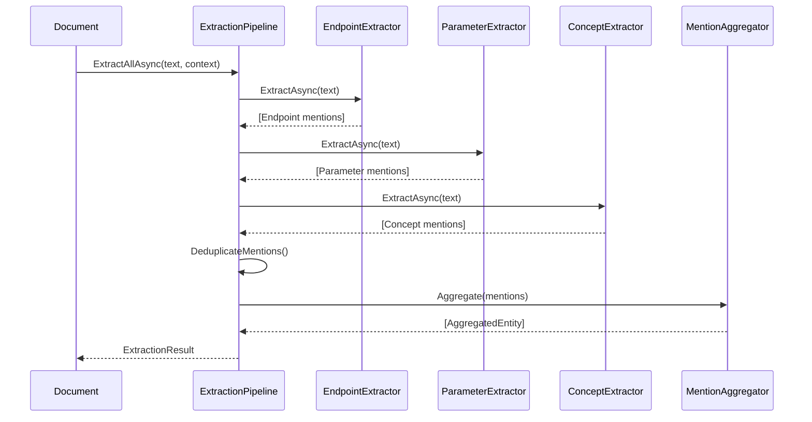

# LCS-DES-045-KG-c: Entity Abstraction Layer

## 1. Metadata & Categorization

| Field | Value |
| :--- | :--- |
| **Document ID** | LCS-DES-045-KG-c |
| **Feature ID** | KG-045g |
| **Feature Name** | Entity Abstraction Layer |
| **Target Version** | v0.4.5g |
| **Module Scope** | `Lexichord.Modules.Knowledge` |
| **Swimlane** | Extraction |
| **License Tier** | Teams |
| **Feature Gate Key** | `knowledge.extraction.enabled` |
| **Status** | Draft |
| **Last Updated** | 2026-01-31 |

---

## 2. Executive Summary

### 2.1 The Requirement

Documents contain implicit knowledge about entities (API endpoints, parameters, concepts) that should be extracted and stored in the knowledge graph. Without automated extraction, users would have to manually create all graph entities — an impractical approach for large documentation sets.

### 2.2 The Proposed Solution

Implement an Entity Extraction Pipeline that:

- **Defines `IEntityExtractor`** interface for pluggable extractors.
- **Provides three built-in extractors**: EndpointExtractor (API paths), ParameterExtractor (parameters from code), ConceptExtractor (domain terms).
- **Uses regex patterns** for high-precision extraction (v1.0 approach).
- **Scores confidence** for each extraction to enable human review of uncertain cases.
- **Aggregates mentions** across chunks for entity deduplication.

This provides a foundation for more advanced NLU-based extraction in v0.5.5.

---

## 3. Architecture & Modular Strategy

### 3.1 Dependencies

**Upstream Modules:**
- `Lexichord.Abstractions` — Interface definitions
- v0.4.5f: `ISchemaRegistry` — Validate extracted entity types
- v0.1.3b: `Markdig` — Parse Markdown for code blocks

**NuGet Packages:**
- `Markdig` (0.37.x) — Markdown parsing (existing)

### 3.2 Module Placement

```
Lexichord.Abstractions/
├── Contracts/
│   ├── IEntityExtractor.cs
│   ├── IEntityExtractionPipeline.cs
│   └── ExtractionRecords.cs

Lexichord.Modules.Knowledge/
├── Extraction/
│   ├── EntityExtractionPipeline.cs
│   ├── Extractors/
│   │   ├── EndpointExtractor.cs
│   │   ├── ParameterExtractor.cs
│   │   └── ConceptExtractor.cs
│   ├── MentionAggregator.cs
│   └── ExtractionContext.cs
└── KnowledgeModule.cs
```

---

## 4. Data Contract (The API)

### 4.1 Core Interfaces

```csharp
namespace Lexichord.Abstractions.Contracts;

/// <summary>
/// Extracts entity mentions from text.
/// Each extractor specializes in specific entity types.
/// </summary>
public interface IEntityExtractor
{
    /// <summary>
    /// Entity types this extractor can identify (e.g., "Endpoint", "Parameter").
    /// </summary>
    IReadOnlyList<string> SupportedTypes { get; }

    /// <summary>
    /// Priority for ordering extractors (higher runs first).
    /// </summary>
    int Priority { get; }

    /// <summary>
    /// Extracts entity mentions from text.
    /// </summary>
    /// <param name="text">Text content to analyze.</param>
    /// <param name="context">Extraction context with metadata.</param>
    /// <param name="ct">Cancellation token.</param>
    /// <returns>List of entity mentions found.</returns>
    Task<IReadOnlyList<EntityMention>> ExtractAsync(
        string text,
        ExtractionContext context,
        CancellationToken ct = default);
}

/// <summary>
/// Composite extractor that runs multiple extractors and aggregates results.
/// </summary>
public interface IEntityExtractionPipeline
{
    /// <summary>
    /// Registers an extractor in the pipeline.
    /// </summary>
    /// <param name="extractor">Extractor to register.</param>
    void Register(IEntityExtractor extractor);

    /// <summary>
    /// Gets all registered extractors.
    /// </summary>
    IReadOnlyList<IEntityExtractor> Extractors { get; }

    /// <summary>
    /// Extracts all entity mentions using registered extractors.
    /// Results are deduplicated and sorted by confidence.
    /// </summary>
    /// <param name="text">Text content to analyze.</param>
    /// <param name="context">Extraction context.</param>
    /// <param name="ct">Cancellation token.</param>
    /// <returns>Aggregated entity mentions.</returns>
    Task<ExtractionResult> ExtractAllAsync(
        string text,
        ExtractionContext context,
        CancellationToken ct = default);

    /// <summary>
    /// Extracts entities from a document's chunks.
    /// </summary>
    /// <param name="chunks">Document chunks to process.</param>
    /// <param name="documentId">Source document ID.</param>
    /// <param name="ct">Cancellation token.</param>
    /// <returns>Aggregated entities across all chunks.</returns>
    Task<ExtractionResult> ExtractFromChunksAsync(
        IReadOnlyList<TextChunk> chunks,
        Guid documentId,
        CancellationToken ct = default);
}
```

### 4.2 Data Records

```csharp
namespace Lexichord.Abstractions.Contracts;

/// <summary>
/// A mention of an entity in text.
/// </summary>
public record EntityMention
{
    /// <summary>The entity type (must match schema, e.g., "Endpoint").</summary>
    public required string EntityType { get; init; }

    /// <summary>The extracted text value (e.g., "/users").</summary>
    public required string Value { get; init; }

    /// <summary>Normalized/canonical form of the value.</summary>
    public string? NormalizedValue { get; init; }

    /// <summary>Character offset where mention starts in source text.</summary>
    public int StartOffset { get; init; }

    /// <summary>Character offset where mention ends in source text.</summary>
    public int EndOffset { get; init; }

    /// <summary>
    /// Confidence score (0.0 to 1.0).
    /// - 1.0: High confidence (explicit pattern match)
    /// - 0.8-0.9: Medium-high (strong heuristic)
    /// - 0.6-0.8: Medium (contextual match)
    /// - Below 0.6: Low (requires human review)
    /// </summary>
    public float Confidence { get; init; } = 1.0f;

    /// <summary>Additional properties extracted (e.g., method for endpoints).</summary>
    public Dictionary<string, object> Properties { get; init; } = new();

    /// <summary>Source chunk ID (if extracted from chunked content).</summary>
    public Guid? ChunkId { get; init; }

    /// <summary>Extractor that found this mention.</summary>
    public string? ExtractorName { get; init; }

    /// <summary>The original text snippet containing the mention.</summary>
    public string? SourceSnippet { get; init; }

    /// <summary>Gets the mention span length.</summary>
    public int Length => EndOffset - StartOffset;
}

/// <summary>
/// Context for entity extraction.
/// </summary>
public record ExtractionContext
{
    /// <summary>Source document ID.</summary>
    public Guid? DocumentId { get; init; }

    /// <summary>Source chunk ID.</summary>
    public Guid? ChunkId { get; init; }

    /// <summary>Document title for context.</summary>
    public string? DocumentTitle { get; init; }

    /// <summary>Current heading context (from Markdown).</summary>
    public string? Heading { get; init; }

    /// <summary>Heading level (1-6).</summary>
    public int? HeadingLevel { get; init; }

    /// <summary>Schema to validate against.</summary>
    public ISchemaRegistry? Schema { get; init; }

    /// <summary>Minimum confidence threshold (skip below this).</summary>
    public float MinConfidence { get; init; } = 0.5f;

    /// <summary>Entity types to extract (null = all).</summary>
    public IReadOnlyList<string>? TargetEntityTypes { get; init; }

    /// <summary>Whether extraction is in "discovery" mode (lower thresholds).</summary>
    public bool DiscoveryMode { get; init; } = false;
}

/// <summary>
/// Result of an extraction operation.
/// </summary>
public record ExtractionResult
{
    /// <summary>All extracted entity mentions.</summary>
    public required IReadOnlyList<EntityMention> Mentions { get; init; }

    /// <summary>Unique entities after aggregation.</summary>
    public IReadOnlyList<AggregatedEntity>? AggregatedEntities { get; init; }

    /// <summary>Processing duration.</summary>
    public TimeSpan Duration { get; init; }

    /// <summary>Number of chunks processed.</summary>
    public int ChunksProcessed { get; init; }

    /// <summary>Extraction statistics by type.</summary>
    public Dictionary<string, int> MentionCountByType { get; init; } = new();

    /// <summary>Average confidence score.</summary>
    public float AverageConfidence =>
        Mentions.Count > 0 ? Mentions.Average(m => m.Confidence) : 0f;
}

/// <summary>
/// An entity aggregated from multiple mentions.
/// </summary>
public record AggregatedEntity
{
    /// <summary>Entity type.</summary>
    public required string EntityType { get; init; }

    /// <summary>Canonical name/value.</summary>
    public required string CanonicalValue { get; init; }

    /// <summary>All mentions of this entity.</summary>
    public required IReadOnlyList<EntityMention> Mentions { get; init; }

    /// <summary>Highest confidence among mentions.</summary>
    public float MaxConfidence { get; init; }

    /// <summary>Merged properties from all mentions.</summary>
    public Dictionary<string, object> MergedProperties { get; init; } = new();

    /// <summary>Document IDs where this entity appears.</summary>
    public IReadOnlyList<Guid> SourceDocuments { get; init; } = Array.Empty<Guid>();
}
```

---

## 5. Implementation Logic

### 5.1 EntityExtractionPipeline

```csharp
namespace Lexichord.Modules.Knowledge.Extraction;

/// <summary>
/// Coordinates multiple extractors and aggregates results.
/// </summary>
public sealed class EntityExtractionPipeline : IEntityExtractionPipeline
{
    private readonly List<IEntityExtractor> _extractors = new();
    private readonly MentionAggregator _aggregator;
    private readonly ILogger<EntityExtractionPipeline> _logger;

    public EntityExtractionPipeline(ILogger<EntityExtractionPipeline> logger)
    {
        _logger = logger;
        _aggregator = new MentionAggregator();
    }

    public IReadOnlyList<IEntityExtractor> Extractors =>
        _extractors.OrderByDescending(e => e.Priority).ToList();

    public void Register(IEntityExtractor extractor)
    {
        _extractors.Add(extractor);
        _logger.LogDebug(
            "Registered extractor: {Name} for types [{Types}]",
            extractor.GetType().Name,
            string.Join(", ", extractor.SupportedTypes));
    }

    public async Task<ExtractionResult> ExtractAllAsync(
        string text,
        ExtractionContext context,
        CancellationToken ct = default)
    {
        var stopwatch = Stopwatch.StartNew();
        var allMentions = new List<EntityMention>();

        // Run extractors in priority order
        foreach (var extractor in Extractors)
        {
            // Skip if target types specified and extractor doesn't match
            if (context.TargetEntityTypes != null &&
                !extractor.SupportedTypes.Any(t =>
                    context.TargetEntityTypes.Contains(t, StringComparer.OrdinalIgnoreCase)))
            {
                continue;
            }

            try
            {
                var mentions = await extractor.ExtractAsync(text, context, ct);

                // Filter by confidence threshold
                var filtered = mentions
                    .Where(m => m.Confidence >= context.MinConfidence)
                    .Select(m => m with { ExtractorName = extractor.GetType().Name })
                    .ToList();

                allMentions.AddRange(filtered);

                _logger.LogDebug(
                    "Extractor {Name} found {Count} mentions (filtered from {Total})",
                    extractor.GetType().Name, filtered.Count, mentions.Count);
            }
            catch (Exception ex)
            {
                _logger.LogWarning(ex,
                    "Extractor {Name} failed",
                    extractor.GetType().Name);
            }
        }

        // Deduplicate overlapping mentions
        var deduplicated = DeduplicateMentions(allMentions);

        // Aggregate into unique entities
        var aggregated = _aggregator.Aggregate(deduplicated);

        stopwatch.Stop();

        _logger.LogDebug(
            "Extraction complete: {MentionCount} mentions, {EntityCount} entities in {Duration}ms",
            deduplicated.Count, aggregated.Count, stopwatch.ElapsedMilliseconds);

        return new ExtractionResult
        {
            Mentions = deduplicated,
            AggregatedEntities = aggregated,
            Duration = stopwatch.Elapsed,
            ChunksProcessed = 1,
            MentionCountByType = deduplicated
                .GroupBy(m => m.EntityType)
                .ToDictionary(g => g.Key, g => g.Count())
        };
    }

    public async Task<ExtractionResult> ExtractFromChunksAsync(
        IReadOnlyList<TextChunk> chunks,
        Guid documentId,
        CancellationToken ct = default)
    {
        var stopwatch = Stopwatch.StartNew();
        var allMentions = new List<EntityMention>();

        foreach (var chunk in chunks)
        {
            var context = new ExtractionContext
            {
                DocumentId = documentId,
                ChunkId = Guid.NewGuid(), // Would come from chunk storage
                Heading = chunk.Metadata?.Heading,
                HeadingLevel = chunk.Metadata?.Level
            };

            var result = await ExtractAllAsync(chunk.Content, context, ct);

            // Adjust offsets to document-level
            var adjusted = result.Mentions
                .Select(m => m with
                {
                    StartOffset = m.StartOffset + chunk.StartOffset,
                    EndOffset = m.EndOffset + chunk.StartOffset,
                    ChunkId = context.ChunkId
                });

            allMentions.AddRange(adjusted);
        }

        // Re-aggregate across all chunks
        var aggregated = _aggregator.Aggregate(allMentions);

        stopwatch.Stop();

        return new ExtractionResult
        {
            Mentions = allMentions,
            AggregatedEntities = aggregated,
            Duration = stopwatch.Elapsed,
            ChunksProcessed = chunks.Count,
            MentionCountByType = allMentions
                .GroupBy(m => m.EntityType)
                .ToDictionary(g => g.Key, g => g.Count())
        };
    }

    private static List<EntityMention> DeduplicateMentions(List<EntityMention> mentions)
    {
        // Sort by position, then by confidence (higher first)
        var sorted = mentions
            .OrderBy(m => m.StartOffset)
            .ThenByDescending(m => m.Confidence)
            .ToList();

        var result = new List<EntityMention>();
        int lastEnd = -1;

        foreach (var mention in sorted)
        {
            // Skip if overlaps with previous (keep higher confidence)
            if (mention.StartOffset < lastEnd)
            {
                continue;
            }

            result.Add(mention);
            lastEnd = mention.EndOffset;
        }

        return result;
    }
}
```

### 5.2 EndpointExtractor

```csharp
namespace Lexichord.Modules.Knowledge.Extraction.Extractors;

/// <summary>
/// Extracts API endpoint mentions from text.
/// </summary>
public sealed class EndpointExtractor : IEntityExtractor
{
    public IReadOnlyList<string> SupportedTypes => new[] { "Endpoint" };
    public int Priority => 100; // High priority

    // Patterns for endpoint detection
    private static readonly Regex MethodPathPattern = new(
        @"\b(GET|POST|PUT|PATCH|DELETE|HEAD|OPTIONS)\s+(\/[\w\-\/\{\}\?=&]+)",
        RegexOptions.Compiled | RegexOptions.IgnoreCase);

    private static readonly Regex PathOnlyPattern = new(
        @"(?<![\w\-])(\/[\w\-]+(?:\/[\w\-\{\}]+)*)\b",
        RegexOptions.Compiled);

    private static readonly Regex CodeBlockPathPattern = new(
        @"(?:endpoint|url|path|route)\s*[=:]\s*[""']?(\/[\w\-\/\{\}]+)[""']?",
        RegexOptions.Compiled | RegexOptions.IgnoreCase);

    public Task<IReadOnlyList<EntityMention>> ExtractAsync(
        string text,
        ExtractionContext context,
        CancellationToken ct = default)
    {
        var mentions = new List<EntityMention>();

        // Pattern 1: HTTP method + path (highest confidence)
        foreach (Match match in MethodPathPattern.Matches(text))
        {
            var method = match.Groups[1].Value.ToUpperInvariant();
            var path = NormalizePath(match.Groups[2].Value);

            mentions.Add(new EntityMention
            {
                EntityType = "Endpoint",
                Value = $"{method} {path}",
                NormalizedValue = path,
                StartOffset = match.Index,
                EndOffset = match.Index + match.Length,
                Confidence = 1.0f,
                Properties = new()
                {
                    ["method"] = method,
                    ["path"] = path
                },
                SourceSnippet = GetSnippet(text, match.Index, 50)
            });
        }

        // Pattern 2: Code block definitions (high confidence)
        foreach (Match match in CodeBlockPathPattern.Matches(text))
        {
            var path = NormalizePath(match.Groups[1].Value);

            // Skip if already found as method+path
            if (mentions.Any(m => m.Properties.TryGetValue("path", out var p) &&
                                 p?.ToString() == path))
            {
                continue;
            }

            mentions.Add(new EntityMention
            {
                EntityType = "Endpoint",
                Value = path,
                NormalizedValue = path,
                StartOffset = match.Index,
                EndOffset = match.Index + match.Length,
                Confidence = 0.9f,
                Properties = new() { ["path"] = path },
                SourceSnippet = GetSnippet(text, match.Index, 50)
            });
        }

        // Pattern 3: Standalone paths (medium confidence)
        foreach (Match match in PathOnlyPattern.Matches(text))
        {
            var path = NormalizePath(match.Groups[1].Value);

            // Skip if already found
            if (mentions.Any(m => m.Properties.TryGetValue("path", out var p) &&
                                 p?.ToString() == path))
            {
                continue;
            }

            // Skip common false positives
            if (IsLikelyFalsePositive(path, text, match.Index))
            {
                continue;
            }

            mentions.Add(new EntityMention
            {
                EntityType = "Endpoint",
                Value = path,
                NormalizedValue = path,
                StartOffset = match.Index,
                EndOffset = match.Index + match.Length,
                Confidence = 0.7f,
                Properties = new() { ["path"] = path },
                SourceSnippet = GetSnippet(text, match.Index, 50)
            });
        }

        return Task.FromResult<IReadOnlyList<EntityMention>>(mentions);
    }

    private static string NormalizePath(string path)
    {
        // Remove query parameters for canonical form
        var queryIndex = path.IndexOf('?');
        if (queryIndex > 0)
        {
            path = path[..queryIndex];
        }

        // Ensure leading slash
        if (!path.StartsWith('/'))
        {
            path = "/" + path;
        }

        // Remove trailing slash (unless root)
        if (path.Length > 1 && path.EndsWith('/'))
        {
            path = path[..^1];
        }

        return path.ToLowerInvariant();
    }

    private static bool IsLikelyFalsePositive(string path, string text, int index)
    {
        // Skip file paths (contain extensions)
        if (Regex.IsMatch(path, @"\.\w{2,4}$"))
        {
            return true;
        }

        // Skip paths that look like Unix file paths in code
        if (path.StartsWith("/home/") ||
            path.StartsWith("/usr/") ||
            path.StartsWith("/etc/") ||
            path.StartsWith("/var/"))
        {
            return true;
        }

        // Skip very short paths (likely false positives)
        if (path.Length < 4)
        {
            return true;
        }

        return false;
    }

    private static string GetSnippet(string text, int position, int contextLength)
    {
        var start = Math.Max(0, position - contextLength);
        var end = Math.Min(text.Length, position + contextLength);
        return text[start..end].Replace("\n", " ").Trim();
    }
}
```

### 5.3 ParameterExtractor

```csharp
namespace Lexichord.Modules.Knowledge.Extraction.Extractors;

/// <summary>
/// Extracts API parameter mentions from text.
/// </summary>
public sealed class ParameterExtractor : IEntityExtractor
{
    public IReadOnlyList<string> SupportedTypes => new[] { "Parameter" };
    public int Priority => 90;

    // Pattern for parameter definitions in text
    private static readonly Regex ParamDefinitionPattern = new(
        @"(?:parameter|param|argument|arg)\s+[`""]?(\w+)[`""]?\s*(?:\((\w+)\))?",
        RegexOptions.Compiled | RegexOptions.IgnoreCase);

    // Pattern for inline code parameters
    private static readonly Regex InlineCodeParamPattern = new(
        @"`(\w+)`\s+(?:parameter|param|argument|field)",
        RegexOptions.Compiled | RegexOptions.IgnoreCase);

    // Pattern for path parameters {param}
    private static readonly Regex PathParamPattern = new(
        @"\{(\w+)\}",
        RegexOptions.Compiled);

    // Pattern for query parameters ?param=value
    private static readonly Regex QueryParamPattern = new(
        @"[?&](\w+)=",
        RegexOptions.Compiled);

    // Pattern for JSON/code property definitions
    private static readonly Regex PropertyPattern = new(
        @"[""'](\w+)[""']\s*:\s*(?:[""']?[\w\s]+[""']?|[\d.]+|true|false|null|\{|\[)",
        RegexOptions.Compiled);

    public Task<IReadOnlyList<EntityMention>> ExtractAsync(
        string text,
        ExtractionContext context,
        CancellationToken ct = default)
    {
        var mentions = new List<EntityMention>();
        var seenParams = new HashSet<string>(StringComparer.OrdinalIgnoreCase);

        // Pattern 1: Explicit parameter definitions (highest confidence)
        foreach (Match match in ParamDefinitionPattern.Matches(text))
        {
            var name = match.Groups[1].Value;
            var type = match.Groups[2].Success ? match.Groups[2].Value : null;

            if (seenParams.Add(name))
            {
                mentions.Add(CreateMention(name, type, "body", 1.0f, match, text));
            }
        }

        // Pattern 2: Inline code parameters
        foreach (Match match in InlineCodeParamPattern.Matches(text))
        {
            var name = match.Groups[1].Value;

            if (seenParams.Add(name))
            {
                mentions.Add(CreateMention(name, null, "body", 0.9f, match, text));
            }
        }

        // Pattern 3: Path parameters {id}
        foreach (Match match in PathParamPattern.Matches(text))
        {
            var name = match.Groups[1].Value;

            if (seenParams.Add(name))
            {
                mentions.Add(CreateMention(name, "string", "path", 0.95f, match, text));
            }
        }

        // Pattern 4: Query parameters
        foreach (Match match in QueryParamPattern.Matches(text))
        {
            var name = match.Groups[1].Value;

            if (seenParams.Add(name))
            {
                mentions.Add(CreateMention(name, null, "query", 0.85f, match, text));
            }
        }

        // Pattern 5: JSON properties in code blocks (lower confidence)
        foreach (Match match in PropertyPattern.Matches(text))
        {
            var name = match.Groups[1].Value;

            // Skip common non-parameter properties
            if (IsCommonMetaProperty(name))
            {
                continue;
            }

            if (seenParams.Add(name))
            {
                mentions.Add(CreateMention(name, null, "body", 0.6f, match, text));
            }
        }

        return Task.FromResult<IReadOnlyList<EntityMention>>(mentions);
    }

    private static EntityMention CreateMention(
        string name,
        string? type,
        string location,
        float confidence,
        Match match,
        string text)
    {
        var properties = new Dictionary<string, object>
        {
            ["name"] = name,
            ["location"] = location
        };

        if (!string.IsNullOrEmpty(type))
        {
            properties["type"] = type;
        }

        return new EntityMention
        {
            EntityType = "Parameter",
            Value = name,
            NormalizedValue = name.ToLowerInvariant(),
            StartOffset = match.Index,
            EndOffset = match.Index + match.Length,
            Confidence = confidence,
            Properties = properties,
            SourceSnippet = GetSnippet(text, match.Index, 30)
        };
    }

    private static bool IsCommonMetaProperty(string name)
    {
        var commonProps = new HashSet<string>(StringComparer.OrdinalIgnoreCase)
        {
            "type", "name", "id", "version", "description", "title",
            "status", "code", "message", "error", "data", "result",
            "success", "count", "total", "items", "value", "key"
        };

        return commonProps.Contains(name);
    }

    private static string GetSnippet(string text, int position, int contextLength)
    {
        var start = Math.Max(0, position - contextLength);
        var end = Math.Min(text.Length, position + contextLength);
        return text[start..end].Replace("\n", " ").Trim();
    }
}
```

### 5.4 ConceptExtractor

```csharp
namespace Lexichord.Modules.Knowledge.Extraction.Extractors;

/// <summary>
/// Extracts domain concept mentions from text.
/// </summary>
public sealed class ConceptExtractor : IEntityExtractor
{
    public IReadOnlyList<string> SupportedTypes => new[] { "Concept" };
    public int Priority => 50; // Lower priority (runs after specific extractors)

    // Pattern for defined terms (in quotes or emphasis)
    private static readonly Regex DefinedTermPattern = new(
        @"(?:called|known as|referred to as|termed|defined as)\s+[""*_]?([A-Z][\w\s-]+)[""*_]?",
        RegexOptions.Compiled | RegexOptions.IgnoreCase);

    // Pattern for capitalized multi-word terms
    private static readonly Regex CapitalizedTermPattern = new(
        @"\b([A-Z][a-z]+(?:\s+[A-Z][a-z]+)+)\b",
        RegexOptions.Compiled);

    // Pattern for acronyms with definitions
    private static readonly Regex AcronymPattern = new(
        @"\b([A-Z]{2,6})\s*\(([^)]+)\)",
        RegexOptions.Compiled);

    // Glossary-style definitions
    private static readonly Regex GlossaryPattern = new(
        @"^\s*\*?\*?([A-Z][\w\s-]+)\*?\*?\s*[-:]\s+(.+)$",
        RegexOptions.Compiled | RegexOptions.Multiline);

    public Task<IReadOnlyList<EntityMention>> ExtractAsync(
        string text,
        ExtractionContext context,
        CancellationToken ct = default)
    {
        var mentions = new List<EntityMention>();
        var seenConcepts = new HashSet<string>(StringComparer.OrdinalIgnoreCase);

        // Pattern 1: Explicitly defined terms (highest confidence)
        foreach (Match match in DefinedTermPattern.Matches(text))
        {
            var term = match.Groups[1].Value.Trim();

            if (IsValidConcept(term) && seenConcepts.Add(term))
            {
                mentions.Add(CreateMention(term, null, 0.9f, match, text));
            }
        }

        // Pattern 2: Acronyms with definitions
        foreach (Match match in AcronymPattern.Matches(text))
        {
            var acronym = match.Groups[1].Value;
            var definition = match.Groups[2].Value.Trim();

            if (seenConcepts.Add(acronym))
            {
                mentions.Add(CreateMention(acronym, definition, 0.95f, match, text));
            }
        }

        // Pattern 3: Glossary-style definitions
        foreach (Match match in GlossaryPattern.Matches(text))
        {
            var term = match.Groups[1].Value.Trim();
            var definition = match.Groups[2].Value.Trim();

            if (IsValidConcept(term) && seenConcepts.Add(term))
            {
                mentions.Add(CreateMention(term, definition, 0.85f, match, text));
            }
        }

        // Pattern 4: Capitalized multi-word terms (lower confidence)
        if (context.DiscoveryMode)
        {
            foreach (Match match in CapitalizedTermPattern.Matches(text))
            {
                var term = match.Groups[1].Value.Trim();

                if (IsValidConcept(term) &&
                    !IsCommonPhrase(term) &&
                    seenConcepts.Add(term))
                {
                    mentions.Add(CreateMention(term, null, 0.5f, match, text));
                }
            }
        }

        return Task.FromResult<IReadOnlyList<EntityMention>>(mentions);
    }

    private static EntityMention CreateMention(
        string term,
        string? definition,
        float confidence,
        Match match,
        string text)
    {
        var properties = new Dictionary<string, object>
        {
            ["name"] = term
        };

        if (!string.IsNullOrEmpty(definition))
        {
            properties["definition"] = definition;
        }

        return new EntityMention
        {
            EntityType = "Concept",
            Value = term,
            NormalizedValue = term.ToLowerInvariant(),
            StartOffset = match.Index,
            EndOffset = match.Index + match.Length,
            Confidence = confidence,
            Properties = properties,
            SourceSnippet = GetSnippet(text, match.Index, 50)
        };
    }

    private static bool IsValidConcept(string term)
    {
        // Must be at least 3 characters
        if (term.Length < 3)
        {
            return false;
        }

        // Must not be all uppercase (likely acronym without definition)
        if (term.All(c => char.IsUpper(c) || !char.IsLetter(c)))
        {
            return false;
        }

        // Must not be a common word
        return !IsCommonWord(term);
    }

    private static bool IsCommonWord(string term)
    {
        var common = new HashSet<string>(StringComparer.OrdinalIgnoreCase)
        {
            "The", "This", "That", "These", "Those", "Here", "There",
            "What", "When", "Where", "Which", "Who", "How", "Why",
            "Note", "Example", "See", "Also", "Next", "Previous"
        };

        return common.Contains(term);
    }

    private static bool IsCommonPhrase(string term)
    {
        var common = new HashSet<string>(StringComparer.OrdinalIgnoreCase)
        {
            "For Example", "In Addition", "As Well", "On The Other",
            "New York", "Los Angeles", "San Francisco", "United States"
        };

        return common.Contains(term);
    }

    private static string GetSnippet(string text, int position, int contextLength)
    {
        var start = Math.Max(0, position - contextLength);
        var end = Math.Min(text.Length, position + contextLength);
        return text[start..end].Replace("\n", " ").Trim();
    }
}
```

### 5.5 MentionAggregator

```csharp
namespace Lexichord.Modules.Knowledge.Extraction;

/// <summary>
/// Aggregates entity mentions into unique entities.
/// </summary>
internal sealed class MentionAggregator
{
    public IReadOnlyList<AggregatedEntity> Aggregate(IEnumerable<EntityMention> mentions)
    {
        var grouped = mentions
            .GroupBy(m => GetGroupKey(m), StringComparer.OrdinalIgnoreCase)
            .Select(g => CreateAggregatedEntity(g))
            .OrderByDescending(e => e.Mentions.Count)
            .ThenByDescending(e => e.MaxConfidence)
            .ToList();

        return grouped;
    }

    private static string GetGroupKey(EntityMention mention)
    {
        // Group by type + normalized value
        return $"{mention.EntityType}::{mention.NormalizedValue ?? mention.Value}";
    }

    private static AggregatedEntity CreateAggregatedEntity(IGrouping<string, EntityMention> group)
    {
        var mentions = group.ToList();
        var bestMention = mentions.OrderByDescending(m => m.Confidence).First();

        // Merge properties from all mentions
        var mergedProperties = new Dictionary<string, object>();
        foreach (var mention in mentions)
        {
            foreach (var (key, value) in mention.Properties)
            {
                if (!mergedProperties.ContainsKey(key))
                {
                    mergedProperties[key] = value;
                }
            }
        }

        // Collect source documents
        var sourceDocuments = mentions
            .Select(m => m.ChunkId)
            .Where(id => id.HasValue)
            .Select(id => id!.Value)
            .Distinct()
            .ToList();

        return new AggregatedEntity
        {
            EntityType = bestMention.EntityType,
            CanonicalValue = bestMention.NormalizedValue ?? bestMention.Value,
            Mentions = mentions,
            MaxConfidence = mentions.Max(m => m.Confidence),
            MergedProperties = mergedProperties,
            SourceDocuments = sourceDocuments
        };
    }
}
```

---

## 6. Extraction Patterns Summary

| Extractor | Pattern | Confidence | Example |
| :-------- | :------ | :--------- | :------ |
| EndpointExtractor | `GET|POST... /path` | 1.0 | `GET /users/{id}` |
| EndpointExtractor | `endpoint: /path` | 0.9 | `endpoint: /api/orders` |
| EndpointExtractor | Standalone `/path` | 0.7 | `The /users endpoint...` |
| ParameterExtractor | `parameter \`name\`` | 1.0 | `parameter \`limit\`` |
| ParameterExtractor | Path param `{name}` | 0.95 | `/users/{userId}` |
| ParameterExtractor | Query param `?name=` | 0.85 | `?page=1&limit=20` |
| ParameterExtractor | JSON property | 0.6 | `"email": "test@..."` |
| ConceptExtractor | Defined term | 0.9 | `called "Rate Limiting"` |
| ConceptExtractor | Acronym (DEF) | 0.95 | `API (Application...)` |
| ConceptExtractor | Glossary entry | 0.85 | `**Term**: Definition` |
| ConceptExtractor | Capitalized term | 0.5 | `Service Mesh` |

---

## 7. Flow Diagram



---

## 8. Unit Testing Requirements

```csharp
[Trait("Category", "Unit")]
[Trait("Feature", "v0.4.5g")]
public class EndpointExtractorTests
{
    private readonly EndpointExtractor _sut = new();

    [Theory]
    [InlineData("GET /users", "/users", "GET", 1.0f)]
    [InlineData("POST /api/v1/orders", "/api/v1/orders", "POST", 1.0f)]
    [InlineData("DELETE /items/{id}", "/items/{id}", "DELETE", 1.0f)]
    public async Task ExtractAsync_WithMethodAndPath_ExtractsEndpoint(
        string text, string expectedPath, string expectedMethod, float expectedConfidence)
    {
        // Act
        var mentions = await _sut.ExtractAsync(text, new ExtractionContext());

        // Assert
        mentions.Should().ContainSingle();
        mentions[0].Properties["path"].Should().Be(expectedPath.ToLowerInvariant());
        mentions[0].Properties["method"].Should().Be(expectedMethod);
        mentions[0].Confidence.Should().Be(expectedConfidence);
    }

    [Fact]
    public async Task ExtractAsync_WithPathOnly_ExtractsWithLowerConfidence()
    {
        // Arrange
        var text = "The /users endpoint returns a list of all users.";

        // Act
        var mentions = await _sut.ExtractAsync(text, new ExtractionContext());

        // Assert
        mentions.Should().ContainSingle();
        mentions[0].Confidence.Should().BeLessThan(1.0f);
    }

    [Fact]
    public async Task ExtractAsync_WithFilePath_SkipsFalsePositive()
    {
        // Arrange
        var text = "The configuration file is at /etc/config.json";

        // Act
        var mentions = await _sut.ExtractAsync(text, new ExtractionContext());

        // Assert
        mentions.Should().BeEmpty();
    }
}

[Trait("Category", "Unit")]
[Trait("Feature", "v0.4.5g")]
public class ParameterExtractorTests
{
    private readonly ParameterExtractor _sut = new();

    [Fact]
    public async Task ExtractAsync_WithPathParameter_Extracts()
    {
        // Arrange
        var text = "GET /users/{userId}/orders/{orderId}";

        // Act
        var mentions = await _sut.ExtractAsync(text, new ExtractionContext());

        // Assert
        mentions.Should().HaveCount(2);
        mentions.Should().Contain(m => m.Value == "userId");
        mentions.Should().Contain(m => m.Value == "orderId");
    }

    [Fact]
    public async Task ExtractAsync_WithQueryParameter_Extracts()
    {
        // Arrange
        var text = "GET /users?page=1&limit=20&sort=name";

        // Act
        var mentions = await _sut.ExtractAsync(text, new ExtractionContext());

        // Assert
        mentions.Should().HaveCount(3);
        mentions.Select(m => m.Value).Should().Contain("page", "limit", "sort");
    }
}

[Trait("Category", "Unit")]
[Trait("Feature", "v0.4.5g")]
public class EntityExtractionPipelineTests
{
    [Fact]
    public async Task ExtractAllAsync_CombinesMultipleExtractors()
    {
        // Arrange
        var pipeline = new EntityExtractionPipeline(
            NullLogger<EntityExtractionPipeline>.Instance);
        pipeline.Register(new EndpointExtractor());
        pipeline.Register(new ParameterExtractor());

        var text = "GET /users/{userId}?include=orders";

        // Act
        var result = await pipeline.ExtractAllAsync(text, new ExtractionContext());

        // Assert
        result.Mentions.Should().Contain(m => m.EntityType == "Endpoint");
        result.Mentions.Should().Contain(m => m.EntityType == "Parameter");
        result.AggregatedEntities.Should().NotBeEmpty();
    }

    [Fact]
    public async Task ExtractAllAsync_DeduplicatesOverlappingMentions()
    {
        // Arrange
        var pipeline = new EntityExtractionPipeline(
            NullLogger<EntityExtractionPipeline>.Instance);
        pipeline.Register(new EndpointExtractor());

        var text = "GET /users - the /users endpoint returns users";

        // Act
        var result = await pipeline.ExtractAllAsync(text, new ExtractionContext());

        // Assert
        // Should not have duplicate /users mentions
        result.AggregatedEntities
            .Where(e => e.CanonicalValue == "/users")
            .Should().ContainSingle();
    }
}
```

---

## 9. Acceptance Criteria (QA)

| # | Criterion |
| :- | :-------- |
| 1 | EndpointExtractor identifies `GET /path` patterns with 1.0 confidence. |
| 2 | EndpointExtractor identifies standalone `/path` with lower confidence. |
| 3 | EndpointExtractor skips file paths as false positives. |
| 4 | ParameterExtractor identifies path parameters `{name}`. |
| 5 | ParameterExtractor identifies query parameters `?name=`. |
| 6 | ConceptExtractor identifies defined terms ("called X"). |
| 7 | ConceptExtractor identifies acronyms with definitions. |
| 8 | Pipeline combines results from multiple extractors. |
| 9 | Pipeline deduplicates overlapping mentions. |
| 10 | Aggregator groups mentions into unique entities. |
| 11 | Confidence threshold filters low-confidence mentions. |

---

## 10. Deliverable Checklist

| # | Deliverable | Status |
| :- | :---------- | :----- |
| 1 | `IEntityExtractor` interface | [ ] |
| 2 | `IEntityExtractionPipeline` interface | [ ] |
| 3 | `EntityMention` record | [ ] |
| 4 | `ExtractionContext` record | [ ] |
| 5 | `ExtractionResult` record | [ ] |
| 6 | `AggregatedEntity` record | [ ] |
| 7 | `EntityExtractionPipeline` implementation | [ ] |
| 8 | `EndpointExtractor` implementation | [ ] |
| 9 | `ParameterExtractor` implementation | [ ] |
| 10 | `ConceptExtractor` implementation | [ ] |
| 11 | `MentionAggregator` implementation | [ ] |
| 12 | Unit tests for all extractors | [ ] |
| 13 | Unit tests for pipeline | [ ] |

---

## 11. Changelog Entry

```markdown
### Added (v0.4.5g)

- `IEntityExtractor` interface for pluggable entity extraction
- `IEntityExtractionPipeline` for composite extraction
- `EndpointExtractor` for API endpoint patterns
- `ParameterExtractor` for parameter identification
- `ConceptExtractor` for domain term extraction
- Confidence scoring for extraction quality
- Mention aggregation for entity deduplication
```

---
