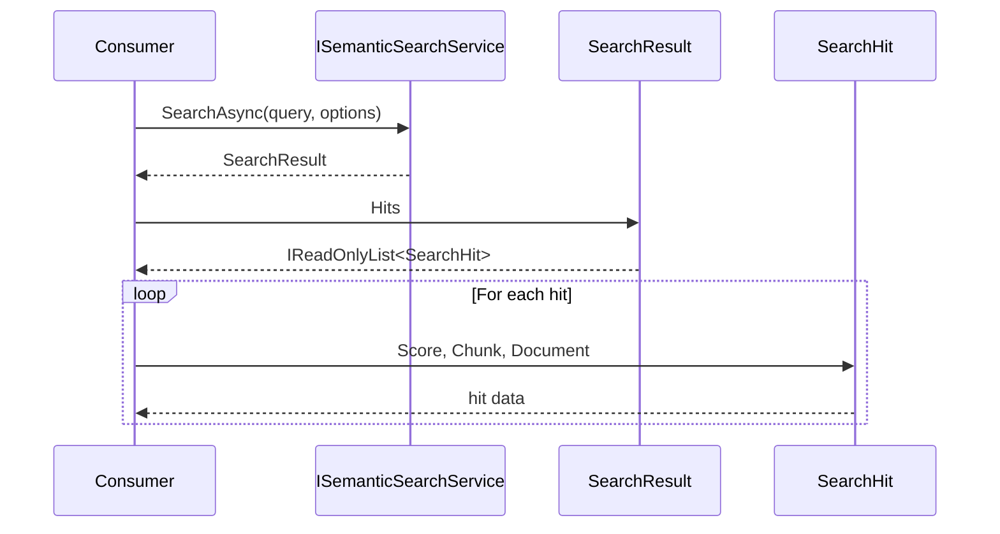
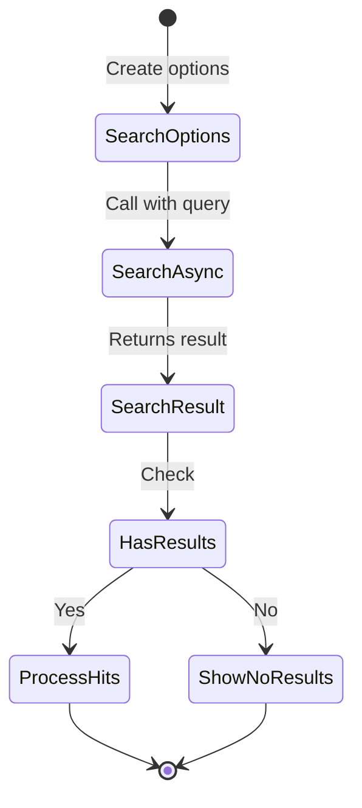

# LCS-DES-045a: Search Abstractions

## 1. Metadata & Categorization

| Field | Value |
| :--- | :--- |
| **Document ID** | LCS-DES-045a |
| **Feature ID** | RAG-045a |
| **Feature Name** | Search Abstractions |
| **Target Version** | v0.4.5a |
| **Module Scope** | `Lexichord.Abstractions` |
| **Swimlane** | Memory |
| **License Tier** | Core (interface only) |
| **Feature Gate Key** | N/A (abstractions) |
| **Status** | Implemented |
| **Last Updated** | 2026-02-01 |

---

## 2. Executive Summary

### 2.1 The Requirement

The semantic search system requires well-defined interfaces and data types that establish contracts between the search implementation and its consumers. These abstractions must be clear, flexible, and support common search patterns.

### 2.2 The Proposed Solution

Define `ISemanticSearchService` interface with `SearchAsync` method, along with supporting records: `SearchOptions` for configuration, `SearchResult` for results container, and `SearchHit` for individual matches. These types live in `Lexichord.Abstractions` for cross-module access.

---

## 3. Architecture & Modular Strategy

### 3.1 Dependencies

**Upstream Modules:**
- `Lexichord.Abstractions` (host for these interfaces)
- v0.4.3a: `TextChunk` record
- v0.4.1c: `Document` entity

**NuGet Packages:**
- None (pure interface definitions)

### 3.2 Licensing Behavior

- **Load Behavior:** [x] No gate - abstractions are always available
- **Fallback Experience:** N/A - implementation handles licensing

---

## 4. Data Contract (The API)

```csharp
namespace Lexichord.Abstractions.Contracts;

/// <summary>
/// Service for semantic search against indexed documents.
/// </summary>
public interface ISemanticSearchService
{
    /// <summary>
    /// Searches the indexed corpus for semantically similar content.
    /// </summary>
    /// <param name="query">Natural language query text.</param>
    /// <param name="options">Search configuration options.</param>
    /// <param name="ct">Cancellation token.</param>
    /// <returns>Search results ranked by similarity.</returns>
    /// <exception cref="FeatureNotLicensedException">
    /// Thrown when user lacks required license tier.
    /// </exception>
    /// <exception cref="ArgumentException">
    /// Thrown when query is empty or whitespace.
    /// </exception>
    Task<SearchResult> SearchAsync(
        string query,
        SearchOptions options,
        CancellationToken ct = default);
}

/// <summary>
/// Configuration options for semantic search.
/// </summary>
public record SearchOptions
{
    /// <summary>
    /// Maximum number of results to return.
    /// Must be between 1 and 100.
    /// Default: 10.
    /// </summary>
    public int TopK { get; init; } = 10;

    /// <summary>
    /// Minimum similarity score threshold (0.0 to 1.0).
    /// Results below this score are filtered out.
    /// Default: 0.7.
    /// </summary>
    public float MinScore { get; init; } = 0.7f;

    /// <summary>
    /// Optional filter to limit results to a specific document.
    /// When null, searches all indexed documents.
    /// </summary>
    public Guid? DocumentFilter { get; init; }

    /// <summary>
    /// Whether to expand abbreviations in query.
    /// For example, "API" becomes "API (Application Programming Interface)".
    /// Default: false.
    /// </summary>
    public bool ExpandAbbreviations { get; init; } = false;

    /// <summary>
    /// Whether to use cached query embeddings.
    /// Set to false to force re-embedding.
    /// Default: true.
    /// </summary>
    public bool UseCache { get; init; } = true;

    /// <summary>
    /// Creates default search options.
    /// </summary>
    public static SearchOptions Default => new();
}

/// <summary>
/// Container for search operation results.
/// </summary>
public record SearchResult
{
    /// <summary>
    /// Matching chunks ranked by similarity score (highest first).
    /// Empty list if no matches found.
    /// </summary>
    public required IReadOnlyList<SearchHit> Hits { get; init; }

    /// <summary>
    /// Total search duration including embedding and query time.
    /// </summary>
    public TimeSpan Duration { get; init; }

    /// <summary>
    /// The query embedding vector used for search.
    /// May be null if embedding failed or was not performed.
    /// </summary>
    public float[]? QueryEmbedding { get; init; }

    /// <summary>
    /// Original query text (before preprocessing).
    /// </summary>
    public string? Query { get; init; }

    /// <summary>
    /// Whether results were truncated at TopK limit.
    /// True indicates more matches may exist.
    /// </summary>
    public bool WasTruncated { get; init; }

    /// <summary>
    /// Number of hits returned.
    /// </summary>
    public int Count => Hits.Count;

    /// <summary>
    /// Whether any results were found.
    /// </summary>
    public bool HasResults => Hits.Count > 0;

    /// <summary>
    /// Creates an empty search result.
    /// </summary>
    public static SearchResult Empty(string? query = null) => new()
    {
        Hits = Array.Empty<SearchHit>(),
        Query = query
    };
}

/// <summary>
/// Individual search result with chunk and relevance score.
/// </summary>
public record SearchHit
{
    /// <summary>
    /// The matching text chunk with content and metadata.
    /// </summary>
    public required TextChunk Chunk { get; init; }

    /// <summary>
    /// Source document containing this chunk.
    /// </summary>
    public required Document Document { get; init; }

    /// <summary>
    /// Cosine similarity score between query and chunk (0.0 to 1.0).
    /// Higher scores indicate greater semantic similarity.
    /// </summary>
    public float Score { get; init; }

    /// <summary>
    /// Score formatted as percentage string (e.g., "87%").
    /// </summary>
    public string ScorePercent => $"{Score * 100:F0}%";

    /// <summary>
    /// Score formatted with decimal (e.g., "0.87").
    /// </summary>
    public string ScoreDecimal => $"{Score:F2}";

    /// <summary>
    /// Preview of chunk content (first N characters).
    /// </summary>
    /// <param name="maxLength">Maximum preview length.</param>
    /// <returns>Truncated content with ellipsis if needed.</returns>
    public string GetPreview(int maxLength = 200)
    {
        if (Chunk.Content.Length <= maxLength)
            return Chunk.Content;

        return Chunk.Content[..maxLength].TrimEnd() + "...";
    }
}
```

---

## 5. Implementation Logic

### 5.1 Flow Diagram



### 5.2 Options Validation

```text
VALIDATE SearchOptions:
│
├── TopK in range [1, 100]?
│   └── NO → ArgumentOutOfRangeException
│
├── MinScore in range [0.0, 1.0]?
│   └── NO → ArgumentOutOfRangeException
│
└── VALID
```

---

## 6. UI/UX Specifications

N/A - This sub-part defines interfaces only.

---

## 7. Decision Trees

### 7.1 Interface Usage

```text
START: "Consumer needs to search"
│
├── Get ISemanticSearchService from DI
│
├── Create SearchOptions
│   ├── Set TopK (default 10)
│   ├── Set MinScore (default 0.7)
│   └── Optional: Set DocumentFilter
│
├── Call SearchAsync(query, options)
│
├── Check SearchResult.HasResults?
│   ├── YES → Process SearchResult.Hits
│   └── NO → Show "No results" message
│
└── END
```

---

## 8. User Stories

| ID    | Role            | Story                                                       | Acceptance Criteria                    |
| :---- | :-------------- | :---------------------------------------------------------- | :------------------------------------- |
| US-01 | Developer       | As a developer, I want a clear search interface.            | ISemanticSearchService defines SearchAsync. |
| US-02 | Developer       | As a developer, I want configurable search options.         | SearchOptions has TopK, MinScore, etc. |
| US-03 | Developer       | As a developer, I want structured search results.           | SearchResult contains ranked SearchHits. |
| US-04 | Developer       | As a developer, I want score formatting helpers.            | SearchHit has ScorePercent property. |

---

## 9. Use Cases

### UC-01: Basic Search

**Preconditions:**
- Implementation of ISemanticSearchService registered in DI

**Flow:**
1. Consumer resolves ISemanticSearchService.
2. Consumer creates SearchOptions with defaults.
3. Consumer calls SearchAsync("query", options).
4. Consumer receives SearchResult.
5. Consumer iterates SearchResult.Hits.

**Postconditions:**
- Consumer has access to search results

---

## 10. Unit Testing Requirements

```csharp
[Trait("Category", "Unit")]
[Trait("Feature", "v0.4.5a")]
public class SearchOptionsTests
{
    [Fact]
    public void Default_HasExpectedValues()
    {
        var options = SearchOptions.Default;

        options.TopK.Should().Be(10);
        options.MinScore.Should().Be(0.7f);
        options.DocumentFilter.Should().BeNull();
        options.ExpandAbbreviations.Should().BeFalse();
        options.UseCache.Should().BeTrue();
    }

    [Theory]
    [InlineData(0)]
    [InlineData(101)]
    public void TopK_OutOfRange_Invalid(int topK)
    {
        // Validation happens in implementation
        var options = new SearchOptions { TopK = topK };
        options.TopK.Should().Be(topK); // Record allows it, impl validates
    }
}

[Trait("Category", "Unit")]
[Trait("Feature", "v0.4.5a")]
public class SearchResultTests
{
    [Fact]
    public void Empty_HasNoHits()
    {
        var result = SearchResult.Empty("test query");

        result.Hits.Should().BeEmpty();
        result.HasResults.Should().BeFalse();
        result.Count.Should().Be(0);
        result.Query.Should().Be("test query");
    }

    [Fact]
    public void HasResults_WhenHitsExist_ReturnsTrue()
    {
        var result = new SearchResult
        {
            Hits = new[] { CreateTestHit(0.9f) }
        };

        result.HasResults.Should().BeTrue();
        result.Count.Should().Be(1);
    }
}

[Trait("Category", "Unit")]
[Trait("Feature", "v0.4.5a")]
public class SearchHitTests
{
    [Theory]
    [InlineData(0.87f, "87%")]
    [InlineData(0.5f, "50%")]
    [InlineData(1.0f, "100%")]
    [InlineData(0.0f, "0%")]
    public void ScorePercent_FormatsCorrectly(float score, string expected)
    {
        var hit = CreateTestHit(score);
        hit.ScorePercent.Should().Be(expected);
    }

    [Fact]
    public void GetPreview_ShortContent_ReturnsFullContent()
    {
        var hit = CreateTestHit(0.9f, "Short content");
        hit.GetPreview(200).Should().Be("Short content");
    }

    [Fact]
    public void GetPreview_LongContent_Truncates()
    {
        var longContent = new string('x', 300);
        var hit = CreateTestHit(0.9f, longContent);

        var preview = hit.GetPreview(200);

        preview.Should().HaveLength(203); // 200 + "..."
        preview.Should().EndWith("...");
    }
}
```

---

## 11. Observability & Logging

N/A - Abstractions do not log.

---

## 12. Workflows



---

## 13. Code Examples

### 13.1 Basic Search Usage

```csharp
// Get service from DI
var searchService = services.GetRequiredService<ISemanticSearchService>();

// Create options
var options = new SearchOptions
{
    TopK = 20,
    MinScore = 0.75f
};

// Execute search
var result = await searchService.SearchAsync("character development", options);

// Process results
foreach (var hit in result.Hits)
{
    Console.WriteLine($"{hit.ScorePercent}: {hit.Document.Title}");
    Console.WriteLine($"  {hit.GetPreview(100)}");
}
```

### 13.2 Filtered Search

```csharp
// Search within specific document
var options = new SearchOptions
{
    DocumentFilter = documentId,
    TopK = 5
};

var result = await searchService.SearchAsync("plot twist", options);
```

---

## 14. Acceptance Criteria (QA)

| #   | Criterion                                                                    |
| :-- | :--------------------------------------------------------------------------- |
| 1   | `ISemanticSearchService` interface compiles and is accessible.               |
| 2   | `SearchOptions` record has all documented properties with correct defaults.  |
| 3   | `SearchResult` record provides `Hits`, `Duration`, `HasResults`, `Count`.    |
| 4   | `SearchHit` record provides `Score`, `ScorePercent`, `GetPreview()`.         |
| 5   | All types are in `Lexichord.Abstractions.Contracts` namespace.               |

---

## 15. Deliverable Checklist

| #  | Deliverable                                                    | Status |
| :- | :------------------------------------------------------------- | :----- |
| 1  | `ISemanticSearchService` interface                             | [x]    |
| 2  | `SearchOptions` record                                         | [x]    |
| 3  | `SearchResult` record                                          | [x]    |
| 4  | `SearchHit` record                                             | [x]    |
| 5  | Unit tests for SearchOptions                                   | [x]    |
| 6  | Unit tests for SearchResult                                    | [x]    |
| 7  | Unit tests for SearchHit                                       | [x]    |

---

## 16. Verification Commands

```bash
# Build abstractions
dotnet build src/Lexichord.Abstractions

# Run unit tests
dotnet test --filter "Feature=v0.4.5a"
```

---

## 17. Changelog Entry

```markdown
### Added (v0.4.5a)

- `ISemanticSearchService` interface for semantic search
- `SearchOptions` record for search configuration
- `SearchResult` record for result container
- `SearchHit` record for individual matches
```

---

## 18. Deferred Features

| Feature                      | Deferred To | Reason                                         |
| :--------------------------- | :---------- | :--------------------------------------------- |
| Pagination (offset/cursor)   | v0.5.x      | Initial version uses simple TopK               |
| Faceted search filters       | v0.5.x      | Requires metadata indexing                     |

---
