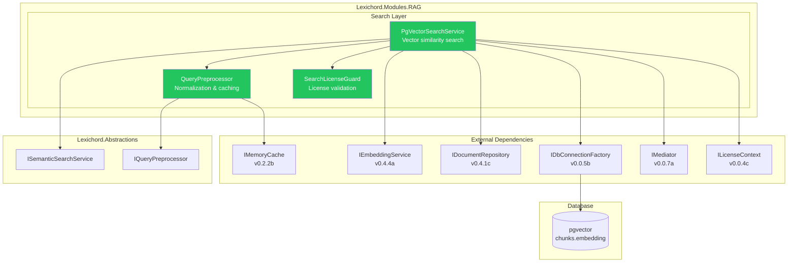
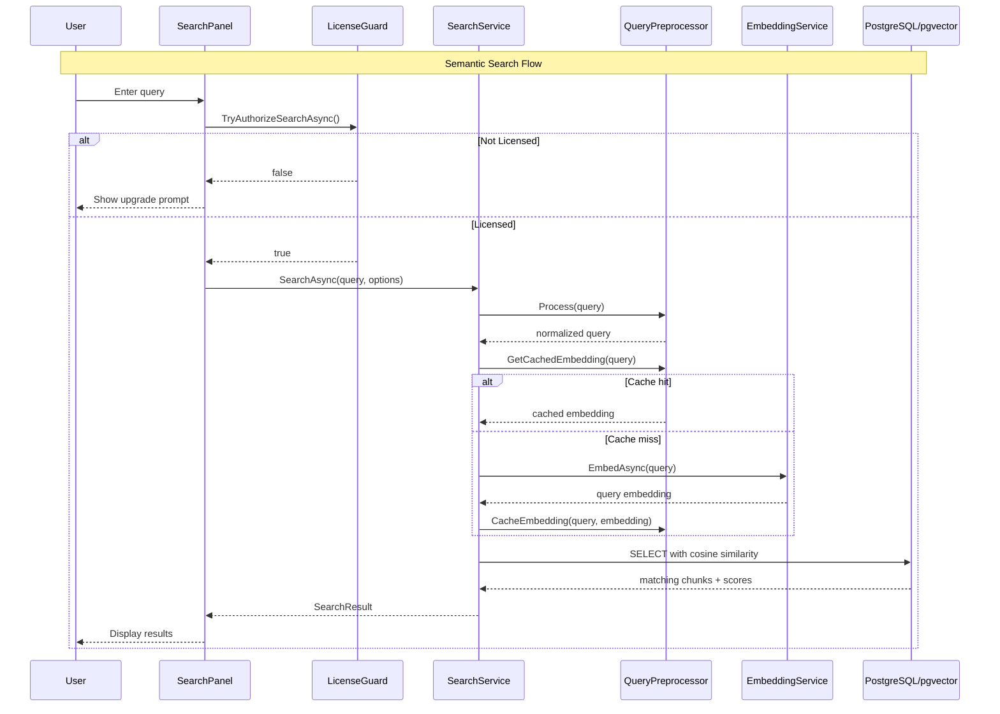

# LCS-SBD-045: Scope Breakdown — The Searcher

## Document Control

| Field            | Value                                                            |
| :--------------- | :--------------------------------------------------------------- |
| **Document ID**  | LCS-SBD-045                                                      |
| **Version**      | v0.4.5                                                           |
| **Codename**     | The Searcher (Semantic Query)                                    |
| **Status**       | Draft                                                            |
| **Last Updated** | 2026-01-27                                                       |
| **Owner**        | Lead Architect                                                   |
| **Depends On**   | v0.4.4 (Embedder), v0.4.1 (Vector Foundation), v0.0.4c (License) |

---

## 1. Executive Summary

### 1.1 The Vision

**v0.4.5** delivers **The Searcher** — the semantic query system that enables natural language queries against the indexed document corpus. This release unlocks the core value of the RAG infrastructure by allowing users to search for content based on meaning rather than exact keyword matches.

With The Searcher, writers can ask questions like "What did I write about character development?" and receive relevant document fragments ranked by semantic similarity. This transforms Lexichord from a traditional text editor into an intelligent knowledge retrieval system.

### 1.2 Business Value

- **Natural Language Search:** Query documents using everyday language.
- **Semantic Understanding:** Find conceptually related content, not just keyword matches.
- **Relevance Ranking:** Results sorted by cosine similarity scores.
- **Filtered Search:** Narrow results to specific documents or folders.
- **Query Optimization:** Preprocessing and caching for fast, accurate results.
- **Writer Pro Feature:** Premium semantic search differentiates paid tiers.

### 1.3 Success Criteria

This release succeeds when:

1. `ISemanticSearchService` provides a clean interface for semantic queries.
2. `PgVectorSearchService` executes vector similarity search via pgvector.
3. Query preprocessing normalizes and optionally expands input.
4. Results are ranked by cosine similarity with configurable thresholds.
5. Search is properly gated at WriterPro tier.

### 1.4 License Gating

Semantic search is a **Writer Pro** feature. Core tier users attempting to search will see:

- Search input disabled with "Upgrade to Writer Pro" tooltip
- Lock icon on the search panel
- Modal explaining the upgrade benefits when search is attempted

---

## 2. Dependencies on Prior Versions

| Component              | Source Version | Usage in v0.4.5                            |
| :--------------------- | :------------- | :----------------------------------------- |
| `IEmbeddingService`    | v0.4.4a        | Embed query text for similarity comparison |
| `IChunkRepository`     | v0.4.1c        | Query indexed chunks                       |
| `IDocumentRepository`  | v0.4.1c        | Retrieve source document metadata          |
| `IDbConnectionFactory` | v0.0.5b        | Database access for vector queries         |
| `IMediator`            | v0.0.7a        | Publish search events                      |
| `ILicenseContext`      | v0.0.4c        | Check WriterPro tier                       |
| `IConfiguration`       | v0.0.3d        | Search configuration                       |
| `ILogger<T>`           | v0.0.3b        | Structured logging                         |

---

## 3. Sub-Part Specifications

### 3.1 v0.4.5a: Search Abstractions

| Field            | Value                    |
| :--------------- | :----------------------- |
| **Sub-Part ID**  | RAG-045a                 |
| **Title**        | Search Abstractions      |
| **Module**       | `Lexichord.Abstractions` |
| **License Tier** | Core (interface only)    |

**Goal:** Define `ISemanticSearchService` interface and supporting types for semantic search operations.

**Key Deliverables:**

- `ISemanticSearchService` interface for search operations
- `SearchOptions` record for query configuration
- `SearchResult` record for result container
- `SearchHit` record for individual matches
- Unit tests for interface contracts

**Key Interfaces:**

```csharp
namespace Lexichord.Abstractions.Contracts;

/// <summary>
/// Service for semantic search against indexed documents.
/// </summary>
public interface ISemanticSearchService
{
    /// <summary>
    /// Searches the indexed corpus for semantically similar content.
    /// </summary>
    /// <param name="query">Natural language query text.</param>
    /// <param name="options">Search configuration options.</param>
    /// <param name="ct">Cancellation token.</param>
    /// <returns>Search results ranked by similarity.</returns>
    Task<SearchResult> SearchAsync(
        string query,
        SearchOptions options,
        CancellationToken ct = default);
}

/// <summary>
/// Configuration options for semantic search.
/// </summary>
public record SearchOptions
{
    /// <summary>Maximum number of results to return (default: 10).</summary>
    public int TopK { get; init; } = 10;

    /// <summary>Minimum similarity score threshold (default: 0.7).</summary>
    public float MinScore { get; init; } = 0.7f;

    /// <summary>Optional filter to specific document.</summary>
    public Guid? DocumentFilter { get; init; }

    /// <summary>Whether to expand abbreviations in query (default: false).</summary>
    public bool ExpandAbbreviations { get; init; } = false;

    /// <summary>Whether to use cached query embeddings (default: true).</summary>
    public bool UseCache { get; init; } = true;
}

/// <summary>
/// Container for search operation results.
/// </summary>
public record SearchResult
{
    /// <summary>Matching chunks ranked by similarity.</summary>
    public required IReadOnlyList<SearchHit> Hits { get; init; }

    /// <summary>Total search duration.</summary>
    public TimeSpan Duration { get; init; }

    /// <summary>The query embedding used for search.</summary>
    public float[]? QueryEmbedding { get; init; }

    /// <summary>Original query text.</summary>
    public string? Query { get; init; }

    /// <summary>Whether results were truncated at TopK.</summary>
    public bool WasTruncated { get; init; }
}

/// <summary>
/// Individual search result with chunk and score.
/// </summary>
public record SearchHit
{
    /// <summary>The matching text chunk.</summary>
    public required TextChunk Chunk { get; init; }

    /// <summary>Source document metadata.</summary>
    public required Document Document { get; init; }

    /// <summary>Cosine similarity score (0.0 to 1.0).</summary>
    public float Score { get; init; }

    /// <summary>Score as percentage string (e.g., "87%").</summary>
    public string ScorePercent => $"{Score * 100:F0}%";
}
```

**Dependencies:**

- v0.4.3a: `TextChunk` record
- v0.4.1c: `Document` entity

---

### 3.2 v0.4.5b: Vector Search Query

| Field            | Value                   |
| :--------------- | :---------------------- |
| **Sub-Part ID**  | RAG-045b                |
| **Title**        | Vector Search Query     |
| **Module**       | `Lexichord.Modules.RAG` |
| **License Tier** | WriterPro               |

**Goal:** Implement `PgVectorSearchService` using cosine similarity search via pgvector.

**Key Deliverables:**

- `PgVectorSearchService` implementation
- Cosine similarity SQL query using `<=>` operator
- Document filtering support
- Score threshold filtering
- Integration tests with pgvector

**Key Implementation:**

```csharp
namespace Lexichord.Modules.RAG.Search;

/// <summary>
/// Semantic search service using pgvector cosine similarity.
/// </summary>
public sealed class PgVectorSearchService : ISemanticSearchService
{
    private readonly IDbConnectionFactory _dbFactory;
    private readonly IEmbeddingService _embedder;
    private readonly IQueryPreprocessor _preprocessor;
    private readonly IDocumentRepository _docRepo;
    private readonly ILicenseContext _licenseContext;
    private readonly ILogger<PgVectorSearchService> _logger;

    public PgVectorSearchService(
        IDbConnectionFactory dbFactory,
        IEmbeddingService embedder,
        IQueryPreprocessor preprocessor,
        IDocumentRepository docRepo,
        ILicenseContext licenseContext,
        ILogger<PgVectorSearchService> logger)
    {
        _dbFactory = dbFactory;
        _embedder = embedder;
        _preprocessor = preprocessor;
        _docRepo = docRepo;
        _licenseContext = licenseContext;
        _logger = logger;
    }

    public async Task<SearchResult> SearchAsync(
        string query,
        SearchOptions options,
        CancellationToken ct = default)
    {
        // License check
        if (_licenseContext.Tier < LicenseTier.WriterPro)
        {
            throw new FeatureNotLicensedException("Semantic Search", LicenseTier.WriterPro);
        }

        var stopwatch = Stopwatch.StartNew();

        // Preprocess query
        var processedQuery = _preprocessor.Process(query, options);

        // Get query embedding
        var queryEmbedding = await GetQueryEmbeddingAsync(processedQuery, options, ct);

        // Execute vector search
        var hits = await ExecuteVectorSearchAsync(queryEmbedding, options, ct);

        stopwatch.Stop();

        _logger.LogInfo(
            "Search completed: {HitCount} hits for '{Query}' in {Duration}ms",
            hits.Count, query, stopwatch.ElapsedMilliseconds);

        return new SearchResult
        {
            Hits = hits,
            Duration = stopwatch.Elapsed,
            QueryEmbedding = queryEmbedding,
            Query = query,
            WasTruncated = hits.Count >= options.TopK
        };
    }

    private async Task<IReadOnlyList<SearchHit>> ExecuteVectorSearchAsync(
        float[] queryEmbedding,
        SearchOptions options,
        CancellationToken ct)
    {
        await using var connection = await _dbFactory.CreateConnectionAsync(ct);

        var sql = BuildSearchQuery(options);

        var parameters = new
        {
            query_embedding = queryEmbedding,
            min_score = options.MinScore,
            top_k = options.TopK,
            document_filter = options.DocumentFilter
        };

        var rows = await connection.QueryAsync<ChunkSearchRow>(sql, parameters);

        var hits = new List<SearchHit>();
        foreach (var row in rows)
        {
            var document = await _docRepo.GetByIdAsync(row.DocumentId);
            if (document == null) continue;

            hits.Add(new SearchHit
            {
                Chunk = new TextChunk(
                    row.Content,
                    row.StartOffset,
                    row.EndOffset,
                    JsonSerializer.Deserialize<ChunkMetadata>(row.Metadata)!),
                Document = document,
                Score = row.Score
            });
        }

        return hits;
    }

    private static string BuildSearchQuery(SearchOptions options)
    {
        var filterClause = options.DocumentFilter.HasValue
            ? "AND c.document_id = @document_filter"
            : "";

        return $@"
            SELECT
                c.id,
                c.document_id AS DocumentId,
                c.content AS Content,
                c.chunk_index AS ChunkIndex,
                c.metadata AS Metadata,
                c.start_offset AS StartOffset,
                c.end_offset AS EndOffset,
                1 - (c.embedding <=> @query_embedding::vector) AS Score
            FROM chunks c
            WHERE 1 - (c.embedding <=> @query_embedding::vector) >= @min_score
            {filterClause}
            ORDER BY c.embedding <=> @query_embedding::vector
            LIMIT @top_k";
    }

    private async Task<float[]> GetQueryEmbeddingAsync(
        string query,
        SearchOptions options,
        CancellationToken ct)
    {
        // Cache handled in QueryPreprocessor if enabled
        return await _embedder.EmbedAsync(query, ct);
    }
}

internal record ChunkSearchRow(
    Guid Id,
    Guid DocumentId,
    string Content,
    int ChunkIndex,
    string Metadata,
    int StartOffset,
    int EndOffset,
    float Score);
```

**Vector Search SQL:**

```sql
-- Cosine similarity search using pgvector <=> operator
-- Score = 1 - cosine_distance (so higher is more similar)
SELECT
    c.id,
    c.document_id,
    c.content,
    1 - (c.embedding <=> @query_embedding::vector) AS score
FROM chunks c
WHERE 1 - (c.embedding <=> @query_embedding::vector) >= @min_score
ORDER BY c.embedding <=> @query_embedding::vector
LIMIT @top_k;
```

**Dependencies:**

- v0.4.4a: `IEmbeddingService` for query embedding
- v0.4.1c: `IDocumentRepository` for document metadata
- v0.0.5b: `IDbConnectionFactory` for database access

---

### 3.3 v0.4.5c: Query Preprocessing

| Field            | Value                   |
| :--------------- | :---------------------- |
| **Sub-Part ID**  | RAG-045c                |
| **Title**        | Query Preprocessing     |
| **Module**       | `Lexichord.Modules.RAG` |
| **License Tier** | WriterPro               |

**Goal:** Implement `QueryPreprocessor` for input normalization, abbreviation expansion, and query embedding caching.

**Key Deliverables:**

- `IQueryPreprocessor` interface
- `QueryPreprocessor` implementation
- Unicode normalization
- Whitespace trimming and collapsing
- Abbreviation expansion lookup table
- Short-lived query embedding cache (5 minutes)
- Unit tests for preprocessing

**Key Implementation:**

```csharp
namespace Lexichord.Modules.RAG.Search;

/// <summary>
/// Interface for query preprocessing operations.
/// </summary>
public interface IQueryPreprocessor
{
    /// <summary>
    /// Processes a raw query string for search.
    /// </summary>
    /// <param name="query">Raw query text.</param>
    /// <param name="options">Search options.</param>
    /// <returns>Processed query string.</returns>
    string Process(string query, SearchOptions options);

    /// <summary>
    /// Gets a cached query embedding if available.
    /// </summary>
    /// <param name="query">Processed query text.</param>
    /// <returns>Cached embedding or null.</returns>
    float[]? GetCachedEmbedding(string query);

    /// <summary>
    /// Caches a query embedding.
    /// </summary>
    /// <param name="query">Processed query text.</param>
    /// <param name="embedding">Embedding to cache.</param>
    void CacheEmbedding(string query, float[] embedding);
}

/// <summary>
/// Query preprocessor with normalization, expansion, and caching.
/// </summary>
public sealed class QueryPreprocessor : IQueryPreprocessor
{
    private readonly IMemoryCache _cache;
    private readonly ILogger<QueryPreprocessor> _logger;
    private readonly TimeSpan _cacheExpiry = TimeSpan.FromMinutes(5);

    private static readonly Dictionary<string, string> Abbreviations = new(StringComparer.OrdinalIgnoreCase)
    {
        ["API"] = "Application Programming Interface",
        ["UI"] = "User Interface",
        ["UX"] = "User Experience",
        ["DB"] = "Database",
        ["SQL"] = "Structured Query Language",
        ["JSON"] = "JavaScript Object Notation",
        ["XML"] = "Extensible Markup Language",
        ["HTML"] = "HyperText Markup Language",
        ["CSS"] = "Cascading Style Sheets",
        ["HTTP"] = "HyperText Transfer Protocol",
        ["HTTPS"] = "HTTP Secure",
        ["REST"] = "Representational State Transfer",
        ["CRUD"] = "Create Read Update Delete",
        ["ORM"] = "Object Relational Mapping",
        ["DI"] = "Dependency Injection",
        ["IoC"] = "Inversion of Control",
        ["SOLID"] = "Single responsibility Open closed Liskov substitution Interface segregation Dependency inversion",
        ["TDD"] = "Test Driven Development",
        ["BDD"] = "Behavior Driven Development",
        ["CI"] = "Continuous Integration",
        ["CD"] = "Continuous Deployment",
        ["MVP"] = "Minimum Viable Product",
        ["POC"] = "Proof of Concept"
    };

    public QueryPreprocessor(
        IMemoryCache cache,
        ILogger<QueryPreprocessor> logger)
    {
        _cache = cache;
        _logger = logger;
    }

    public string Process(string query, SearchOptions options)
    {
        if (string.IsNullOrWhiteSpace(query))
            return string.Empty;

        // 1. Trim and collapse whitespace
        var processed = CollapseWhitespace(query.Trim());

        // 2. Unicode normalization (NFC)
        processed = processed.Normalize(NormalizationForm.FormC);

        // 3. Optional abbreviation expansion
        if (options.ExpandAbbreviations)
        {
            processed = ExpandAbbreviations(processed);
        }

        _logger.LogDebug(
            "Preprocessed query: '{Original}' -> '{Processed}'",
            query, processed);

        return processed;
    }

    public float[]? GetCachedEmbedding(string query)
    {
        var key = GetCacheKey(query);
        return _cache.TryGetValue(key, out float[]? embedding) ? embedding : null;
    }

    public void CacheEmbedding(string query, float[] embedding)
    {
        var key = GetCacheKey(query);
        _cache.Set(key, embedding, _cacheExpiry);

        _logger.LogDebug("Cached query embedding for: '{Query}'", query);
    }

    private static string CollapseWhitespace(string text)
    {
        return Regex.Replace(text, @"\s+", " ");
    }

    private static string ExpandAbbreviations(string text)
    {
        foreach (var (abbrev, expansion) in Abbreviations)
        {
            // Word boundary matching to avoid partial replacements
            var pattern = $@"\b{Regex.Escape(abbrev)}\b";
            text = Regex.Replace(text, pattern, $"{abbrev} ({expansion})", RegexOptions.IgnoreCase);
        }
        return text;
    }

    private static string GetCacheKey(string query)
    {
        return $"query_embedding:{query.ToLowerInvariant().GetHashCode()}";
    }
}
```

**Abbreviation Expansion Example:**

| Input                    | Output                                                       |
| :----------------------- | :----------------------------------------------------------- |
| "How does the API work?" | "How does the API (Application Programming Interface) work?" |
| "UI/UX best practices"   | "UI (User Interface)/UX (User Experience) best practices"    |

**Dependencies:**

- `Microsoft.Extensions.Caching.Memory` for query cache

---

### 3.4 v0.4.5d: License Gating

| Field            | Value                   |
| :--------------- | :---------------------- |
| **Sub-Part ID**  | RAG-045d                |
| **Title**        | License Gating          |
| **Module**       | `Lexichord.Modules.RAG` |
| **License Tier** | WriterPro               |

**Goal:** Wrap semantic search in license validation with appropriate user feedback.

**Key Deliverables:**

- License check integration in `PgVectorSearchService` using `FeatureNotLicensedException` (from v0.4.4d)
- `SearchLicenseGuard` helper class
- MediatR event for search attempts
- Unit tests for license enforcement

**Key Implementation:**

```csharp
namespace Lexichord.Modules.RAG.Search;

// FeatureNotLicensedException from v0.4.4d is reused.
// See LCS-DES-044d for full definition.

/// <summary>
/// Guard class for license-gated search operations.
/// </summary>
public sealed class SearchLicenseGuard
{
    private readonly ILicenseContext _licenseContext;
    private readonly IMediator _mediator;
    private readonly ILogger<SearchLicenseGuard> _logger;

    public SearchLicenseGuard(
        ILicenseContext licenseContext,
        IMediator mediator,
        ILogger<SearchLicenseGuard> logger)
    {
        _licenseContext = licenseContext;
        _mediator = mediator;
        _logger = logger;
    }

    /// <summary>
    /// Checks if semantic search is available for current license.
    /// </summary>
    public bool IsSearchAvailable => _licenseContext.Tier >= LicenseTier.WriterPro;

    /// <summary>
    /// Validates license for search operation.
    /// Throws if not authorized.
    /// </summary>
    public void EnsureSearchAuthorized()
    {
        if (!IsSearchAvailable)
        {
            _logger.LogDebug(
                "Search blocked: current tier {Tier}, required {Required}",
                _licenseContext.Tier, LicenseTier.WriterPro);

            throw new FeatureNotLicensedException("Semantic Search", LicenseTier.WriterPro);
        }
    }

    /// <summary>
    /// Attempts to authorize search, publishing event on denial.
    /// </summary>
    public async Task<bool> TryAuthorizeSearchAsync(CancellationToken ct = default)
    {
        if (IsSearchAvailable)
            return true;

        await _mediator.Publish(new SearchDeniedEvent
        {
            CurrentTier = _licenseContext.Tier,
            RequiredTier = LicenseTier.WriterPro,
            Timestamp = DateTimeOffset.UtcNow
        }, ct);

        return false;
    }
}

/// <summary>
/// Published when a search is denied due to license restrictions.
/// </summary>
public record SearchDeniedEvent : INotification
{
    public LicenseTier CurrentTier { get; init; }
    public LicenseTier RequiredTier { get; init; }
    public DateTimeOffset Timestamp { get; init; }
}

/// <summary>
/// Published when a semantic search is executed.
/// </summary>
public record SemanticSearchExecutedEvent : INotification
{
    public required string Query { get; init; }
    public int ResultCount { get; init; }
    public TimeSpan Duration { get; init; }
    public DateTimeOffset Timestamp { get; init; }
}
```

**License Behavior by Tier:**

| Tier       | Search Behavior             |
| :--------- | :-------------------------- |
| Core       | Blocked with upgrade prompt |
| Writer     | Blocked with upgrade prompt |
| WriterPro  | Full access                 |
| Teams      | Full access                 |
| Enterprise | Full access                 |

**Dependencies:**

- v0.0.4c: `ILicenseContext`, `LicenseTier`
- v0.0.7a: `IMediator` for events
- v0.4.4d: `FeatureNotLicensedException` for license enforcement

---

## 4. Implementation Checklist

| #         | Sub-Part | Task                                    | Est. Hours   |
| :-------- | :------- | :-------------------------------------- | :----------- |
| 1         | v0.4.5a  | Create ISemanticSearchService interface | 1            |
| 2         | v0.4.5a  | Create SearchOptions record             | 0.5          |
| 3         | v0.4.5a  | Create SearchResult record              | 0.5          |
| 4         | v0.4.5a  | Create SearchHit record                 | 0.5          |
| 5         | v0.4.5a  | Unit tests for record validation        | 1            |
| 6         | v0.4.5b  | Implement PgVectorSearchService         | 3            |
| 7         | v0.4.5b  | Implement cosine similarity SQL query   | 1.5          |
| 8         | v0.4.5b  | Implement document filtering            | 1            |
| 9         | v0.4.5b  | Implement score threshold filtering     | 0.5          |
| 10        | v0.4.5b  | Integration tests with pgvector         | 2            |
| 11        | v0.4.5c  | Create IQueryPreprocessor interface     | 0.5          |
| 12        | v0.4.5c  | Implement QueryPreprocessor             | 2            |
| 13        | v0.4.5c  | Implement abbreviation expansion        | 1            |
| 14        | v0.4.5c  | Implement query embedding cache         | 1.5          |
| 15        | v0.4.5c  | Unit tests for preprocessing            | 1.5          |
| 16        | v0.4.5d  | Implement SearchLicenseGuard            | 1            |
| 17        | v0.4.5d  | Create SearchDeniedEvent                | 0.5          |
| 18        | v0.4.5d  | Create SemanticSearchExecutedEvent      | 0.5          |
| 19        | v0.4.5d  | Unit tests for license enforcement      | 1.5          |
| 20        | All      | Integration tests for full search flow  | 2.5          |
| 21        | All      | DI registration in RAGModule.cs         | 1            |
| **Total** |          |                                         | **24 hours** |

---

## 5. Dependency Matrix

### 5.1 Required Interfaces (from earlier versions)

| Interface              | Source Version | Purpose                     |
| :--------------------- | :------------- | :-------------------------- |
| `IEmbeddingService`    | v0.4.4a        | Query embedding generation  |
| `IDocumentRepository`  | v0.4.1c        | Document metadata retrieval |
| `IChunkRepository`     | v0.4.1c        | Chunk query (via raw SQL)   |
| `IDbConnectionFactory` | v0.0.5b        | Database connection         |
| `IMediator`            | v0.0.7a        | Event publishing            |
| `ILicenseContext`      | v0.0.4c        | License tier checking       |
| `IMemoryCache`         | v0.2.2b        | Query embedding cache       |

### 5.2 New Interfaces (defined in v0.4.5)

| Interface                | Defined In | Module       | Purpose             |
| :----------------------- | :--------- | :----------- | :------------------ |
| `ISemanticSearchService` | v0.4.5a    | Abstractions | Semantic search     |
| `IQueryPreprocessor`     | v0.4.5c    | Modules.RAG  | Query preprocessing |

### 5.3 New Records/DTOs (defined in v0.4.5)

| Record                        | Defined In | Purpose                     |
| :---------------------------- | :--------- | :-------------------------- |
| `SearchOptions`               | v0.4.5a    | Search configuration        |
| `SearchResult`                | v0.4.5a    | Result container            |
| `SearchHit`                   | v0.4.5a    | Individual match result     |
| `SearchDeniedEvent`           | v0.4.5d    | License denial notification |
| `SemanticSearchExecutedEvent` | v0.4.5d    | Search execution telemetry  |

### 5.4 NuGet Packages

| Package                               | Version | Purpose             | New/Existing |
| :------------------------------------ | :------ | :------------------ | :----------- |
| `Microsoft.Extensions.Caching.Memory` | 9.0.x   | Query caching       | Existing     |
| `Npgsql`                              | 9.0.x   | PostgreSQL driver   | Existing     |
| `Dapper`                              | 2.1.x   | SQL query execution | Existing     |

---

## 6. Architecture Diagram



---

## 7. Data Flow Diagram



---

## 8. Risks & Mitigations

| Risk                               | Impact | Probability | Mitigation                      |
| :--------------------------------- | :----- | :---------- | :------------------------------ |
| Slow vector search on large corpus | High   | Medium      | HNSW index, limit TopK          |
| Query embedding API latency        | Medium | Medium      | Query embedding cache           |
| Cache memory usage                 | Low    | Low         | 5-minute TTL, bounded cache     |
| Low-quality search results         | Medium | Medium      | Configurable MinScore threshold |
| License bypass attempts            | High   | Low         | Server-side tier check          |
| SQL injection in query             | High   | Low         | Parameterized queries only      |

---

## 9. Success Metrics

| Metric                          | Target          | Measurement       |
| :------------------------------ | :-------------- | :---------------- |
| Search latency (10K chunks)     | < 200ms         | Stopwatch timing  |
| Cache hit rate                  | > 50%           | Cache statistics  |
| Result relevance (MinScore 0.7) | > 80% precision | Manual evaluation |
| License check latency           | < 5ms           | Stopwatch timing  |
| Query preprocessing             | < 10ms          | Stopwatch timing  |

---

## 10. What This Enables

After v0.4.5, Lexichord will support:

- **v0.4.6 (Reference Panel):** UI for search queries and result display.
- **v0.4.7 (Index Manager):** Search-powered index status monitoring.
- **v0.6.x (AI Agents):** RAG-powered context retrieval for AI features.
- **Future:** Multi-document search, faceted filtering, saved searches.

---

## 11. Decision Trees

### 11.1 Search Flow

```text
START: "User submits search query"
│
├── Is user licensed for WriterPro+?
│   ├── NO → Show upgrade prompt, END
│   └── YES → Continue
│
├── Is query empty or whitespace?
│   ├── YES → Return empty results, END
│   └── NO → Continue
│
├── Preprocess query (normalize, expand?)
│
├── Check query embedding cache
│   ├── HIT → Use cached embedding
│   └── MISS → Generate new embedding, cache it
│
├── Execute vector search
│   └── SELECT chunks WHERE score >= MinScore
│       ORDER BY score DESC LIMIT TopK
│
├── Filter by DocumentFilter if set
│
└── Return SearchResult with hits
```

### 11.2 Score Interpretation

```text
START: "Interpret similarity score"
│
├── Score >= 0.9 → "Very High" (near identical)
├── Score >= 0.8 → "High" (strongly related)
├── Score >= 0.7 → "Medium" (related)
├── Score >= 0.5 → "Low" (loosely related)
└── Score < 0.5 → "Very Low" (unlikely related)
```

---

## 12. User Stories

| ID    | Role      | Story                                                        | Acceptance Criteria                             |
| :---- | :-------- | :----------------------------------------------------------- | :---------------------------------------------- |
| US-01 | Writer    | As a writer, I want to search my documents by meaning.       | Natural language query returns relevant chunks. |
| US-02 | Writer    | As a writer, I want to see relevance scores for results.     | Results display percentage match score.         |
| US-03 | Writer    | As a writer, I want to filter search to a specific document. | DocumentFilter limits results to one document.  |
| US-04 | Developer | As a developer, I want query embeddings cached.              | Repeated queries use cached embeddings.         |
| US-05 | Developer | As a developer, I want search events for telemetry.          | SemanticSearchExecutedEvent published.          |
| US-06 | Free User | As a free user, I want to know how to unlock search.         | Upgrade prompt explains WriterPro benefits.     |

---

## 13. Use Cases

### UC-01: Basic Semantic Search

**Preconditions:**

- User has WriterPro license
- Documents are indexed with embeddings

**Flow:**

1. User enters "character development tips" in search box.
2. System preprocesses query (normalize, trim).
3. System generates query embedding via OpenAI.
4. System executes pgvector cosine similarity search.
5. System returns top 10 results above 0.7 score.
6. User sees ranked list with document names and scores.

**Postconditions:**

- SearchResult contains 0-10 SearchHit items
- SemanticSearchExecutedEvent published

### UC-02: Unlicensed Search Attempt

**Preconditions:**

- User has Core tier license
- User attempts search

**Flow:**

1. User enters query in search box.
2. System checks license tier.
3. License check fails (Core < WriterPro).
4. System shows "Upgrade to WriterPro" modal.
5. SearchDeniedEvent published.

**Postconditions:**

- No search executed
- User sees upgrade prompt

---

## 14. Unit Testing Requirements

### 14.1 SearchService Tests

```csharp
[Trait("Category", "Unit")]
[Trait("Feature", "v0.4.5b")]
public class PgVectorSearchServiceTests
{
    [Fact]
    public async Task SearchAsync_WithValidQuery_ReturnsResults()
    {
        // Arrange
        var embedder = CreateMockEmbedder();
        var dbFactory = CreateMockDbFactory(CreateTestChunks());
        var service = CreateService(embedder, dbFactory, LicenseTier.WriterPro);

        // Act
        var result = await service.SearchAsync("test query", new SearchOptions());

        // Assert
        result.Hits.Should().NotBeEmpty();
        result.Duration.Should().BePositive();
    }

    [Fact]
    public async Task SearchAsync_WithDocumentFilter_FiltersResults()
    {
        // Arrange
        var docId = Guid.NewGuid();
        var options = new SearchOptions { DocumentFilter = docId };
        var service = CreateService(LicenseTier.WriterPro);

        // Act
        var result = await service.SearchAsync("query", options);

        // Assert
        result.Hits.Should().OnlyContain(h => h.Document.Id == docId);
    }

    [Fact]
    public async Task SearchAsync_BelowMinScore_ExcludedFromResults()
    {
        // Arrange
        var options = new SearchOptions { MinScore = 0.8f };
        var service = CreateService(LicenseTier.WriterPro);

        // Act
        var result = await service.SearchAsync("query", options);

        // Assert
        result.Hits.Should().OnlyContain(h => h.Score >= 0.8f);
    }

    [Fact]
    public async Task SearchAsync_WithoutLicense_ThrowsException()
    {
        // Arrange
        var service = CreateService(LicenseTier.Core);

        // Act & Assert
        await service.Invoking(s => s.SearchAsync("query", new SearchOptions()))
            .Should().ThrowAsync<FeatureNotLicensedException>()
            .WithMessage("*Semantic Search*");
    }
}
```

### 14.2 QueryPreprocessor Tests

```csharp
[Trait("Category", "Unit")]
[Trait("Feature", "v0.4.5c")]
public class QueryPreprocessorTests
{
    private readonly QueryPreprocessor _sut;

    public QueryPreprocessorTests()
    {
        _sut = new QueryPreprocessor(
            new MemoryCache(new MemoryCacheOptions()),
            NullLogger<QueryPreprocessor>.Instance);
    }

    [Fact]
    public void Process_TrimsWhitespace()
    {
        var result = _sut.Process("  test query  ", new SearchOptions());
        result.Should().Be("test query");
    }

    [Fact]
    public void Process_CollapsesMultipleSpaces()
    {
        var result = _sut.Process("test    query", new SearchOptions());
        result.Should().Be("test query");
    }

    [Fact]
    public void Process_WithExpansion_ExpandsAbbreviations()
    {
        var options = new SearchOptions { ExpandAbbreviations = true };
        var result = _sut.Process("API documentation", options);
        result.Should().Contain("Application Programming Interface");
    }

    [Fact]
    public void CacheEmbedding_StoresAndRetrieves()
    {
        var embedding = new float[] { 0.1f, 0.2f, 0.3f };

        _sut.CacheEmbedding("query", embedding);
        var cached = _sut.GetCachedEmbedding("query");

        cached.Should().BeEquivalentTo(embedding);
    }
}
```

---

## 15. Observability & Logging

| Level   | Source                | Message Template                                                  |
| :------ | :-------------------- | :---------------------------------------------------------------- |
| Debug   | QueryPreprocessor     | `Preprocessed query: '{Original}' -> '{Processed}'`               |
| Debug   | QueryPreprocessor     | `Cached query embedding for: '{Query}'`                           |
| Debug   | QueryPreprocessor     | `Query embedding cache hit for: '{Query}'`                        |
| Debug   | PgVectorSearchService | `Executing vector search: TopK={TopK}, MinScore={MinScore}`       |
| Info    | PgVectorSearchService | `Search completed: {HitCount} hits for '{Query}' in {Duration}ms` |
| Warning | PgVectorSearchService | `Search returned no results for: '{Query}'`                       |
| Debug   | SearchLicenseGuard    | `Search blocked: current tier {Tier}, required {Required}`        |

---

## 16. UI/UX Specifications

**None.** v0.4.5 is a backend service release. The search UI will be implemented in v0.4.6 (Reference Panel).

---

## 17. Acceptance Criteria (QA)

| #   | Category            | Criterion                                                   |
| :-- | :------------------ | :---------------------------------------------------------- |
| 1   | **[Search]**        | Natural language query returns semantically related chunks. |
| 2   | **[Search]**        | Results sorted by descending similarity score.              |
| 3   | **[Search]**        | TopK parameter limits result count.                         |
| 4   | **[Search]**        | MinScore parameter filters low-relevance results.           |
| 5   | **[Search]**        | DocumentFilter limits results to specific document.         |
| 6   | **[Preprocessing]** | Query whitespace trimmed and collapsed.                     |
| 7   | **[Preprocessing]** | Abbreviations expanded when option enabled.                 |
| 8   | **[Caching]**       | Repeated queries use cached embeddings.                     |
| 9   | **[Caching]**       | Cache entries expire after 5 minutes.                       |
| 10  | **[License]**       | Core tier users receive FeatureNotLicensedException.        |
| 11  | **[License]**       | WriterPro tier users can execute search.                    |
| 12  | **[Events]**        | SemanticSearchExecutedEvent published on success.           |
| 13  | **[Events]**        | SearchDeniedEvent published on license denial.              |
| 14  | **[Performance]**   | Search latency < 200ms for 10K chunks.                      |

---

## 18. Verification Commands

```bash
# ═══════════════════════════════════════════════════════════════════════════
# v0.4.5 Verification
# ═══════════════════════════════════════════════════════════════════════════

# 1. Build solution
dotnet build

# 2. Run unit tests for v0.4.5 components
dotnet test --filter "Category=Unit&FullyQualifiedName~Search"
dotnet test --filter "Feature=v0.4.5"

# 3. Run integration tests (requires database)
dotnet test --filter "Category=Integration&FullyQualifiedName~Search"

# 4. Verify vector search SQL
# psql:
# SELECT c.id, 1 - (c.embedding <=> '[...]'::vector) AS score
# FROM chunks c
# ORDER BY score DESC LIMIT 10;

# 5. Manual verification:
# a) Configure WriterPro license
# b) Index test documents
# c) Execute search query
# d) Verify results ranked by relevance
```

---

## 19. Deliverable Checklist

| #   | Deliverable                                | Status |
| :-- | :----------------------------------------- | :----- |
| 1   | `ISemanticSearchService` interface         | [ ]    |
| 2   | `SearchOptions` record                     | [ ]    |
| 3   | `SearchResult` record                      | [ ]    |
| 4   | `SearchHit` record                         | [ ]    |
| 5   | `PgVectorSearchService` implementation     | [ ]    |
| 6   | `IQueryPreprocessor` interface             | [ ]    |
| 7   | `QueryPreprocessor` implementation         | [ ]    |
| 8   | Query embedding cache                      | [ ]    |
| 9   | `SearchLicenseGuard` helper                | [ ]    |
| 10  | `SearchDeniedEvent` notification           | [ ]    |
| 11  | `SemanticSearchExecutedEvent` notification | [ ]    |
| 12  | Unit tests for search service              | [ ]    |
| 13  | Unit tests for preprocessor                | [ ]    |
| 14  | Unit tests for license guard               | [ ]    |
| 15  | Integration tests for full search flow     | [ ]    |
| 16  | DI registration in RAGModule.cs            | [ ]    |

> **Note:** `FeatureNotLicensedException` is reused from v0.4.4d.

---

## 20. Deferred Features

| Feature                    | Deferred To | Reason                                |
| :------------------------- | :---------- | :------------------------------------ |
| Search UI                  | v0.4.6      | Separate UI specification             |
| Faceted search             | v0.5.x      | Requires additional metadata indexing |
| Multi-document search      | v0.5.x      | Need workspace-level search           |
| Saved searches             | v0.5.x      | User preference feature               |
| Search history persistence | v0.4.6      | UI-layer feature                      |
| Hybrid keyword + semantic  | v0.6.x      | Advanced search feature               |

---

## 21. Changelog Entry

Upon completion of v0.4.5, the following entry will be added to `CHANGELOG.md`:

```markdown
## [0.4.5] - YYYY-MM-DD

### Added

- **Semantic Search**: Natural language queries against indexed documents
- **Vector Similarity**: pgvector cosine similarity search
- **Query Preprocessing**: Normalization, abbreviation expansion
- **Query Caching**: 5-minute embedding cache for repeated queries

### Technical

- `ISemanticSearchService` interface for semantic search
- `PgVectorSearchService` using pgvector `<=>` operator
- `IQueryPreprocessor` for query normalization
- `QueryPreprocessor` with abbreviation expansion
- `SearchLicenseGuard` for WriterPro tier enforcement
- `SearchDeniedEvent` and `SemanticSearchExecutedEvent` MediatR notifications

### License Gating

- Semantic search requires WriterPro tier or higher
- Core/Writer users see upgrade prompt

### Performance

- Search latency: < 200ms for 10K chunks
- Query preprocessing: < 10ms
- Cache hit rate target: > 50%
```

---
