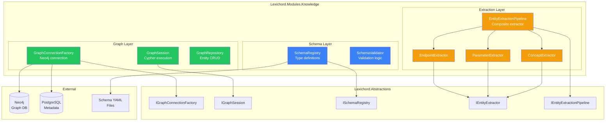
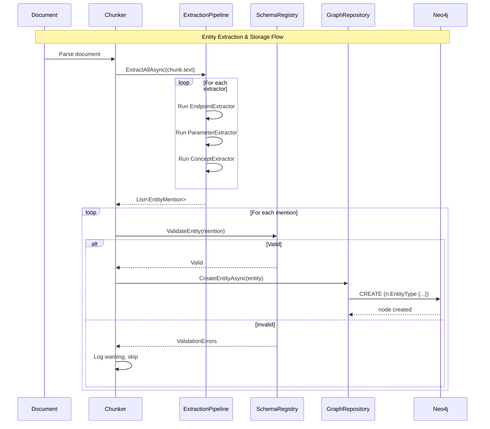

# LCS-SBD-045-KG: Scope Breakdown — Knowledge Graph Foundation

## Document Control

| Field            | Value                                                                        |
| :--------------- | :--------------------------------------------------------------------------- |
| **Document ID**  | LCS-SBD-045-KG                                                               |
| **Version**      | v0.4.5                                                                       |
| **Codename**     | Knowledge Graph Foundation (CKVS Phase 1)                                    |
| **Status**       | Draft                                                                        |
| **Last Updated** | 2026-01-31                                                                   |
| **Owner**        | Lead Architect                                                               |
| **Depends On**   | v0.4.4 (Embedder), v0.4.1 (Vector Foundation), v0.0.5b (DB), v0.0.4c (License) |

---

## 1. Executive Summary

### 1.1 The Vision

**v0.4.5-KG** delivers the **Knowledge Graph Foundation** — the first phase of CKVS (Canonical Knowledge Validation System) integration into Lexichord. This release establishes the infrastructure for structured knowledge representation alongside the existing RAG/vector storage system.

While The Searcher (v0.4.5) enables semantic similarity search over document chunks, the Knowledge Graph provides **structured, queryable facts** extracted from those documents. Together, they form a dual-knowledge architecture: RAG for prose retrieval, Knowledge Graph for formal entity relationships.

### 1.2 Business Value

- **Structured Knowledge:** Store entities (Products, Components, Endpoints, Parameters) and their relationships as graph nodes/edges.
- **Canonical Truth:** Establish a single source of truth for technical facts that can be validated against.
- **Schema Governance:** Define and enforce entity type schemas to ensure consistency.
- **Foundation for Validation:** Enable future validation of content against established knowledge (v0.6.5+).
- **Enterprise Differentiation:** Knowledge Graph is a premium Teams/Enterprise feature.

### 1.3 Success Criteria

This release succeeds when:

1. Neo4j graph database runs alongside PostgreSQL in Docker Compose.
2. Schema Registry defines and validates entity/relationship types.
3. Basic entity extraction identifies Endpoints, Parameters, and Concepts in text.
4. Entity Browser provides visual exploration of knowledge graph.
5. Graph queries average <100ms latency.
6. Can store and query 100+ entities with relationships.

### 1.4 License Gating

Knowledge Graph is a **Teams** feature (read-only access at WriterPro):

| Tier       | Graph Behavior                               |
| :--------- | :------------------------------------------- |
| Core       | Not available                                |
| WriterPro  | Read-only Entity Browser                     |
| Teams      | Full access (create, edit, delete entities)  |
| Enterprise | Full access + custom ontology schemas        |

---

## 2. CKVS Integration Context

### 2.1 Relationship to CKVS Design Proposal

This spec implements **CKVS Phase 1: Foundation** components:

| CKVS Component | Implementation | This Spec |
| :------------- | :------------- | :-------- |
| Knowledge Graph Database | Neo4j + Bolt driver | v0.4.5e (LCS-DES-045-KG-a) |
| Ontological Schema Layer | Schema Registry YAML + validation | v0.4.5f (LCS-DES-045-KG-b) |
| Entity Abstraction | IEntityExtractor interface + basic extractors | v0.4.5g (LCS-DES-045-KG-c) |

### 2.2 Deferred to Later Phases

| CKVS Component | Deferred To | Rationale |
| :------------- | :---------- | :-------- |
| Foundational Axioms Store | v0.4.6 | Separate concern, after graph foundation |
| Entity Linking (NLU) | v0.5.5 | Requires semantic search foundation |
| Claim Extraction | v0.5.6 | Requires entity linking |
| Validation Engine | v0.6.5 | Requires claims and axioms |
| Knowledge-Aware Agents | v0.6.6+ | Requires validation engine |

---

## 3. Dependencies on Prior Versions

| Component              | Source Version | Usage in v0.4.5-KG                         |
| :--------------------- | :------------- | :----------------------------------------- |
| `IDbConnectionFactory` | v0.0.5b        | Pattern for graph connection factory       |
| `FluentMigrator`       | v0.0.5c        | Schema management pattern (PostgreSQL metadata) |
| `IMediator`            | v0.0.7a        | Publish graph events                       |
| `ILicenseContext`      | v0.0.4c        | Check Teams tier                           |
| `IConfiguration`       | v0.0.3d        | Neo4j connection configuration             |
| `ILogger<T>`           | v0.0.3b        | Structured logging                         |
| `IDocumentRepository`  | v0.4.1c        | Link documents to graph entities           |
| `Markdig`              | v0.1.3b        | Parse Markdown for entity extraction       |

---

## 4. Sub-Part Specifications

### 4.1 v0.4.5e: Graph Database Integration

| Field            | Value                           |
| :--------------- | :------------------------------ |
| **Sub-Part ID**  | KG-045e                         |
| **Title**        | Graph Database Integration      |
| **Module**       | `Lexichord.Modules.Knowledge`   |
| **License Tier** | Teams (connection), WriterPro (read-only) |
| **Spec Doc**     | LCS-DES-045-KG-a.md             |

**Goal:** Integrate Neo4j graph database for storing knowledge graph entities and relationships.

**Key Deliverables:**

- Docker Compose configuration for Neo4j 5.x Community
- `IGraphConnectionFactory` interface and Neo4j implementation
- `IGraphRepository` for basic CRUD operations
- PostgreSQL metadata table for graph connection config
- Health check integration

**Key Interfaces:**

```csharp
namespace Lexichord.Abstractions.Contracts;

/// <summary>
/// Factory for creating graph database connections.
/// </summary>
public interface IGraphConnectionFactory
{
    /// <summary>
    /// Creates a new graph database session.
    /// </summary>
    Task<IGraphSession> CreateSessionAsync(CancellationToken ct = default);

    /// <summary>
    /// Tests the graph database connection.
    /// </summary>
    Task<bool> TestConnectionAsync(CancellationToken ct = default);
}

/// <summary>
/// A session for executing graph queries.
/// </summary>
public interface IGraphSession : IAsyncDisposable
{
    /// <summary>
    /// Executes a Cypher query and returns results.
    /// </summary>
    Task<IReadOnlyList<T>> QueryAsync<T>(
        string cypher,
        object? parameters = null,
        CancellationToken ct = default);

    /// <summary>
    /// Executes a Cypher write operation.
    /// </summary>
    Task<int> ExecuteAsync(
        string cypher,
        object? parameters = null,
        CancellationToken ct = default);
}
```

**Dependencies:**

- Neo4j.Driver NuGet package
- Docker Compose update

---

### 4.2 v0.4.5f: Schema Registry Service

| Field            | Value                           |
| :--------------- | :------------------------------ |
| **Sub-Part ID**  | KG-045f                         |
| **Title**        | Schema Registry Service         |
| **Module**       | `Lexichord.Modules.Knowledge`   |
| **License Tier** | Teams                           |
| **Spec Doc**     | LCS-DES-045-KG-b.md             |
| **Status**       | ✅ Implemented                   |
| **Changelog**    | [LCS-CL-v0.4.5f](../../changelogs/v0.4.x/LCS-CL-v0.4.5f.md) |

**Goal:** Define and enforce entity and relationship type schemas for the knowledge graph.

**Key Deliverables:**

- Schema YAML format specification
- `ISchemaRegistry` interface for schema management
- Built-in technical documentation schema (Product, Component, Endpoint, Parameter, Response)
- Schema validation on entity creation
- Schema versioning support

**Key Interfaces:**

```csharp
namespace Lexichord.Abstractions.Contracts;

/// <summary>
/// Registry for knowledge graph schemas.
/// </summary>
public interface ISchemaRegistry
{
    /// <summary>
    /// Gets all registered entity type schemas.
    /// </summary>
    IReadOnlyDictionary<string, EntityTypeSchema> EntityTypes { get; }

    /// <summary>
    /// Gets all registered relationship type schemas.
    /// </summary>
    IReadOnlyDictionary<string, RelationshipTypeSchema> RelationshipTypes { get; }

    /// <summary>
    /// Validates an entity against its schema.
    /// </summary>
    SchemaValidationResult ValidateEntity(KnowledgeEntity entity);

    /// <summary>
    /// Validates a relationship against its schema.
    /// </summary>
    SchemaValidationResult ValidateRelationship(KnowledgeRelationship relationship);

    /// <summary>
    /// Loads schemas from YAML files.
    /// </summary>
    Task LoadSchemasAsync(string schemaDirectory, CancellationToken ct = default);
}

/// <summary>
/// Schema definition for an entity type.
/// </summary>
public record EntityTypeSchema
{
    public required string Name { get; init; }
    public string? Description { get; init; }
    public required IReadOnlyList<PropertySchema> Properties { get; init; }
    public IReadOnlyList<string>? RequiredProperties { get; init; }
}

/// <summary>
/// Schema definition for a relationship type.
/// </summary>
public record RelationshipTypeSchema
{
    public required string Name { get; init; }
    public string? Description { get; init; }
    public required string FromEntityType { get; init; }
    public required string ToEntityType { get; init; }
    public IReadOnlyList<PropertySchema>? Properties { get; init; }
}
```

**Schema YAML Example:**

```yaml
# .lexichord/knowledge/schema/technical-docs.yaml
schema_version: "1.0"
name: "Technical Documentation"
description: "Schema for API and technical documentation entities"

entity_types:
  - name: Product
    description: "A software product or service"
    properties:
      - name: name
        type: string
        required: true
      - name: version
        type: string
      - name: description
        type: text

  - name: Endpoint
    description: "An API endpoint"
    properties:
      - name: path
        type: string
        required: true
      - name: method
        type: enum
        values: [GET, POST, PUT, PATCH, DELETE]
        required: true
      - name: description
        type: text

  - name: Parameter
    description: "An API parameter"
    properties:
      - name: name
        type: string
        required: true
      - name: type
        type: string
        required: true
      - name: required
        type: boolean
        default: false
      - name: default_value
        type: string

relationship_types:
  - name: CONTAINS
    from: Product
    to: [Component, Endpoint]

  - name: ACCEPTS
    from: Endpoint
    to: Parameter
    properties:
      - name: location
        type: enum
        values: [path, query, header, body]
```

**Dependencies:**

- YamlDotNet NuGet package
- Schema files in workspace

---

### 4.3 v0.4.5g: Entity Abstraction Layer

| Field            | Value                           |
| :--------------- | :------------------------------ |
| **Sub-Part ID**  | KG-045g                         |
| **Title**        | Entity Abstraction Layer        |
| **Module**       | `Lexichord.Modules.Knowledge`   |
| **License Tier** | Teams                           |
| **Spec Doc**     | LCS-DES-045-KG-c.md             |

**Goal:** Provide interfaces and basic implementations for extracting entities from document text.

**Key Deliverables:**

- `IEntityExtractor` interface for entity extraction
- `EndpointExtractor` for API endpoint patterns
- `ParameterExtractor` for parameter names from code blocks
- `ConceptExtractor` for domain-specific terms
- Confidence scoring for extraction quality
- Entity mention aggregation across chunks

**Key Interfaces:**

```csharp
namespace Lexichord.Abstractions.Contracts;

/// <summary>
/// Extracts entity mentions from text.
/// </summary>
public interface IEntityExtractor
{
    /// <summary>
    /// The entity types this extractor can identify.
    /// </summary>
    IReadOnlyList<string> SupportedTypes { get; }

    /// <summary>
    /// Extracts entity mentions from text.
    /// </summary>
    Task<IReadOnlyList<EntityMention>> ExtractAsync(
        string text,
        ExtractionContext context,
        CancellationToken ct = default);
}

/// <summary>
/// A mention of an entity in text.
/// </summary>
public record EntityMention
{
    /// <summary>The entity type (e.g., "Endpoint", "Parameter").</summary>
    public required string EntityType { get; init; }

    /// <summary>The extracted text value.</summary>
    public required string Value { get; init; }

    /// <summary>Character offset where mention starts.</summary>
    public int StartOffset { get; init; }

    /// <summary>Character offset where mention ends.</summary>
    public int EndOffset { get; init; }

    /// <summary>Confidence score (0.0 to 1.0).</summary>
    public float Confidence { get; init; } = 1.0f;

    /// <summary>Additional properties extracted.</summary>
    public IReadOnlyDictionary<string, object>? Properties { get; init; }
}

/// <summary>
/// Context for entity extraction.
/// </summary>
public record ExtractionContext
{
    /// <summary>Source document ID.</summary>
    public Guid? DocumentId { get; init; }

    /// <summary>Source chunk ID.</summary>
    public Guid? ChunkId { get; init; }

    /// <summary>Document heading context.</summary>
    public string? Heading { get; init; }

    /// <summary>Schema to validate against.</summary>
    public ISchemaRegistry? Schema { get; init; }
}

/// <summary>
/// Composite extractor that runs multiple extractors.
/// </summary>
public interface IEntityExtractionPipeline
{
    /// <summary>
    /// Registers an extractor in the pipeline.
    /// </summary>
    void Register(IEntityExtractor extractor);

    /// <summary>
    /// Extracts all entity mentions using registered extractors.
    /// </summary>
    Task<IReadOnlyList<EntityMention>> ExtractAllAsync(
        string text,
        ExtractionContext context,
        CancellationToken ct = default);
}
```

**Extraction Patterns:**

| Extractor | Pattern | Confidence |
| :-------- | :------ | :--------- |
| EndpointExtractor | Regex: `(GET|POST|PUT|DELETE|PATCH)\s+\/[\w\-\/\{\}]+` | 1.0 |
| EndpointExtractor | Regex: `\/[\w\-\/\{\}]+` (path only) | 0.8 |
| ParameterExtractor | Code block analysis: parameter names | 0.9 |
| ParameterExtractor | Inline code: `` `paramName` `` after "parameter" | 0.7 |
| ConceptExtractor | Capitalized terms, glossary matches | 0.6 |

**Dependencies:**

- `ISchemaRegistry` (v0.4.5f)
- `Markdig` for Markdown parsing

---

## 5. Implementation Checklist

| #         | Sub-Part | Task                                         | Est. Hours | Status        |
| :-------- | :------- | :------------------------------------------- | :--------- | :------------ |
| 1         | v0.4.5e  | Update Docker Compose for Neo4j              | 1          | ✅ Done       |
| 2         | v0.4.5e  | Create IGraphConnectionFactory interface     | 1          | ✅ Done       |
| 3         | v0.4.5e  | Implement Neo4jConnectionFactory             | 3          | ✅ Done       |
| 4         | v0.4.5e  | Create IGraphSession interface               | 1          | ✅ Done       |
| 5         | v0.4.5e  | Implement Neo4jGraphSession                  | 2          | ✅ Done       |
| 6         | v0.4.5e  | Add health check for Neo4j                   | 1          | ✅ Done       |
| 7         | v0.4.5e  | Create graph metadata PostgreSQL table       | 1          | ✅ Done       |
| 8         | v0.4.5e  | Integration tests for Neo4j connection       | 2          | ✅ Done       |
| 9         | v0.4.5f  | Create ISchemaRegistry interface             | 1          | ✅ Done       |
| 10        | v0.4.5f  | Define schema YAML format                    | 1          | ✅ Done       |
| 11        | v0.4.5f  | Implement SchemaRegistry                     | 3          | ✅ Done       |
| 12        | v0.4.5f  | Create technical-docs base schema            | 1          | ✅ Done       |
| 13        | v0.4.5f  | Implement schema validation                  | 2          | ✅ Done       |
| 14        | v0.4.5f  | Unit tests for schema validation             | 2          | ✅ Done       |
| 15        | v0.4.5g  | Create IEntityExtractor interface            | 1            |
| 16        | v0.4.5g  | Implement EndpointExtractor                  | 2            |
| 17        | v0.4.5g  | Implement ParameterExtractor                 | 2            |
| 18        | v0.4.5g  | Implement ConceptExtractor                   | 2            |
| 19        | v0.4.5g  | Create IEntityExtractionPipeline             | 1            |
| 20        | v0.4.5g  | Implement EntityExtractionPipeline           | 2            |
| 21        | v0.4.5g  | Unit tests for extractors                    | 3            |
| 22        | All      | DI registration in KnowledgeModule.cs        | 1            |
| 23        | All      | End-to-end integration tests                 | 3            |
| **Total** |          |                                              | **39 hours** |

---

## 6. Dependency Matrix

### 6.1 Required Interfaces (from earlier versions)

| Interface              | Source Version | Purpose                        |
| :--------------------- | :------------- | :----------------------------- |
| `IDbConnectionFactory` | v0.0.5b        | Pattern for connection factory |
| `IMediator`            | v0.0.7a        | Event publishing               |
| `ILicenseContext`      | v0.0.4c        | License tier checking          |
| `IDocumentRepository`  | v0.4.1c        | Document-entity linking        |
| `IConfiguration`       | v0.0.3d        | Neo4j configuration            |

### 6.2 New Interfaces (defined in v0.4.5-KG)

| Interface                   | Defined In | Module          | Purpose                |
| :-------------------------- | :--------- | :-------------- | :--------------------- |
| `IGraphConnectionFactory`   | v0.4.5e    | Abstractions    | Graph DB connections   |
| `IGraphSession`             | v0.4.5e    | Abstractions    | Graph query execution  |
| `ISchemaRegistry`           | v0.4.5f    | Abstractions    | Schema management      |
| `IEntityExtractor`          | v0.4.5g    | Abstractions    | Entity extraction      |
| `IEntityExtractionPipeline` | v0.4.5g    | Abstractions    | Composite extraction   |

### 6.3 New Records/DTOs (defined in v0.4.5-KG)

| Record                     | Defined In | Purpose                     |
| :------------------------- | :--------- | :-------------------------- |
| `EntityTypeSchema`         | v0.4.5f    | Entity type definition      |
| `RelationshipTypeSchema`   | v0.4.5f    | Relationship type definition|
| `PropertySchema`           | v0.4.5f    | Property definition         |
| `SchemaValidationResult`   | v0.4.5f    | Validation outcome          |
| `EntityMention`            | v0.4.5g    | Extracted entity mention    |
| `ExtractionContext`        | v0.4.5g    | Extraction parameters       |
| `KnowledgeEntity`          | v0.4.5e    | Graph entity record         |
| `KnowledgeRelationship`    | v0.4.5e    | Graph relationship record   |

### 6.4 NuGet Packages

| Package                | Version | Purpose                  | New/Existing |
| :--------------------- | :------ | :----------------------- | :----------- |
| `Neo4j.Driver`         | 5.x     | Neo4j Bolt driver        | New          |
| `YamlDotNet`           | 15.x    | Schema YAML parsing      | New          |
| `Markdig`              | 0.37.x  | Markdown parsing         | Existing     |

---

## 7. Architecture Diagram



---

## 8. Data Flow Diagram



---

## 9. Risks & Mitigations

| Risk                                  | Impact | Probability | Mitigation                          |
| :------------------------------------ | :----- | :---------- | :---------------------------------- |
| Neo4j performance at scale            | High   | Medium      | HNSW indexing, query optimization   |
| Schema evolution breaking changes     | Medium | Medium      | Schema versioning, migration tools  |
| Regex-based extraction low recall     | Medium | High        | LLM-based extraction in v0.5.5      |
| Dual database complexity              | Medium | Low         | Clear documentation, unified facade |
| Docker resource consumption           | Low    | Medium      | Neo4j memory limits in compose      |
| License bypass attempts               | High   | Low         | Server-side tier validation         |

---

## 10. Success Metrics

| Metric                         | Target          | Measurement           |
| :----------------------------- | :-------------- | :-------------------- |
| Neo4j query latency            | < 100ms avg     | Stopwatch timing      |
| Entity creation latency        | < 50ms          | Stopwatch timing      |
| Schema validation latency      | < 10ms          | Stopwatch timing      |
| Endpoint extraction precision  | > 95%           | Test corpus           |
| Parameter extraction precision | > 85%           | Test corpus           |
| Neo4j container memory         | < 512MB         | Docker stats          |

---

## 11. What This Enables

After v0.4.5-KG, Lexichord will support:

- **v0.4.6 (Axiom Store):** Store foundational truths that constrain the knowledge graph.
- **v0.4.7 (Entity Browser):** Visual exploration of knowledge graph entities.
- **v0.5.5 (Entity Linking):** Connect document mentions to canonical graph entities.
- **v0.5.6 (Claim Extraction):** Parse prose into formal claims about entities.
- **v0.6.5 (Validation Engine):** Validate content against graph and axioms.
- **v0.6.6+ (Knowledge-Aware Agents):** AI agents grounded in knowledge graph facts.

---

## 12. Decision Trees

### 12.1 Entity Extraction Flow

```text
START: "Process document chunk"
│
├── Is chunk empty or whitespace?
│   ├── YES → Return empty list, END
│   └── NO → Continue
│
├── Run EndpointExtractor
│   └── Collect mentions with confidence >= 0.7
│
├── Run ParameterExtractor
│   └── Collect mentions with confidence >= 0.7
│
├── Run ConceptExtractor
│   └── Collect mentions with confidence >= 0.6
│
├── Deduplicate mentions by (type, value, offset)
│
├── For each mention:
│   ├── Schema validates entity type exists?
│   │   ├── NO → Log warning, skip
│   │   └── YES → Continue
│   │
│   └── Create or merge entity in graph
│
└── Return all processed mentions
```

### 12.2 Schema Validation Flow

```text
START: "Validate entity"
│
├── Entity type registered in schema?
│   ├── NO → Return Invalid (unknown type)
│   └── YES → Continue
│
├── Get EntityTypeSchema
│
├── For each required property:
│   ├── Property present in entity?
│   │   ├── NO → Add validation error
│   │   └── YES → Continue
│
├── For each provided property:
│   ├── Property defined in schema?
│   │   ├── NO → Add warning (extra property)
│   │   └── YES → Validate type
│
├── Any errors?
│   ├── YES → Return Invalid with errors
│   └── NO → Return Valid
```

---

## 13. User Stories

| ID    | Role       | Story                                                              | Acceptance Criteria                               |
| :---- | :--------- | :----------------------------------------------------------------- | :------------------------------------------------ |
| US-01 | Writer     | As a writer, I want my API endpoints automatically identified.     | Endpoints extracted from docs appear in graph.    |
| US-02 | Writer     | As a writer, I want to see entity types defined for my domain.     | Schema shows Product, Endpoint, Parameter types.  |
| US-03 | Developer  | As a developer, I want a clean interface for graph queries.        | IGraphSession executes Cypher queries.            |
| US-04 | Developer  | As a developer, I want entities validated against schemas.         | Invalid entities rejected with clear errors.      |
| US-05 | Admin      | As an admin, I want to define custom entity types.                 | YAML schema files loaded and enforced.            |
| US-06 | Free User  | As a free user, I want to know how to unlock knowledge features.   | Upgrade prompt explains Teams benefits.           |

---

## 14. Use Cases

### UC-01: Extract Entities from Document

**Preconditions:**
- User has Teams license
- Document is indexed

**Flow:**
1. Document chunked by v0.4.3 Splitter.
2. Each chunk passed to EntityExtractionPipeline.
3. Pipeline runs registered extractors.
4. Mentions validated against schema.
5. Valid entities created in Neo4j graph.
6. EntityExtractedEvent published.

**Postconditions:**
- Graph contains entities linked to document
- Extraction metrics logged

### UC-02: Validate Entity Against Schema

**Preconditions:**
- Schema loaded from YAML
- Entity creation requested

**Flow:**
1. SchemaRegistry receives entity for validation.
2. Registry looks up EntityTypeSchema by type name.
3. Required properties checked for presence.
4. Property types validated.
5. Validation result returned.

**Postconditions:**
- Valid entities proceed to storage
- Invalid entities rejected with errors

---

## 15. Unit Testing Requirements

### 15.1 GraphConnectionFactory Tests

```csharp
[Trait("Category", "Integration")]
[Trait("Feature", "v0.4.5e")]
public class Neo4jConnectionFactoryTests
{
    [Fact]
    public async Task CreateSessionAsync_ReturnsValidSession()
    {
        // Arrange
        var factory = CreateFactory();

        // Act
        await using var session = await factory.CreateSessionAsync();

        // Assert
        session.Should().NotBeNull();
    }

    [Fact]
    public async Task TestConnectionAsync_WhenNeo4jRunning_ReturnsTrue()
    {
        // Arrange
        var factory = CreateFactory();

        // Act
        var result = await factory.TestConnectionAsync();

        // Assert
        result.Should().BeTrue();
    }
}
```

### 15.2 SchemaRegistry Tests

```csharp
[Trait("Category", "Unit")]
[Trait("Feature", "v0.4.5f")]
public class SchemaRegistryTests
{
    [Fact]
    public void ValidateEntity_WithRequiredPropertyMissing_ReturnsInvalid()
    {
        // Arrange
        var registry = CreateRegistryWithEndpointSchema();
        var entity = new KnowledgeEntity { Type = "Endpoint", Properties = new() };

        // Act
        var result = registry.ValidateEntity(entity);

        // Assert
        result.IsValid.Should().BeFalse();
        result.Errors.Should().Contain(e => e.Contains("path"));
    }

    [Fact]
    public async Task LoadSchemasAsync_WithValidYaml_LoadsAllTypes()
    {
        // Arrange
        var registry = new SchemaRegistry();

        // Act
        await registry.LoadSchemasAsync("./schemas");

        // Assert
        registry.EntityTypes.Should().ContainKey("Product");
        registry.EntityTypes.Should().ContainKey("Endpoint");
    }
}
```

### 15.3 EntityExtractor Tests

```csharp
[Trait("Category", "Unit")]
[Trait("Feature", "v0.4.5g")]
public class EndpointExtractorTests
{
    private readonly EndpointExtractor _sut = new();

    [Theory]
    [InlineData("GET /users", "/users", "GET")]
    [InlineData("POST /api/v1/orders", "/api/v1/orders", "POST")]
    [InlineData("DELETE /items/{id}", "/items/{id}", "DELETE")]
    public async Task ExtractAsync_WithMethodAndPath_ExtractsEndpoint(
        string text, string expectedPath, string expectedMethod)
    {
        // Act
        var mentions = await _sut.ExtractAsync(text, new ExtractionContext());

        // Assert
        mentions.Should().ContainSingle();
        mentions[0].EntityType.Should().Be("Endpoint");
        mentions[0].Properties["path"].Should().Be(expectedPath);
        mentions[0].Properties["method"].Should().Be(expectedMethod);
        mentions[0].Confidence.Should().Be(1.0f);
    }

    [Fact]
    public async Task ExtractAsync_WithPathOnly_ExtractsWithLowerConfidence()
    {
        // Arrange
        var text = "The /users endpoint returns a list.";

        // Act
        var mentions = await _sut.ExtractAsync(text, new ExtractionContext());

        // Assert
        mentions.Should().ContainSingle();
        mentions[0].Confidence.Should().Be(0.8f);
    }
}
```

---

## 16. Observability & Logging

| Level   | Source                | Message Template                                                      |
| :------ | :-------------------- | :-------------------------------------------------------------------- |
| Info    | GraphConnectionFactory| `Neo4j connection established: {Uri}`                                 |
| Debug   | GraphSession          | `Executing Cypher: {Query}`                                           |
| Debug   | GraphSession          | `Cypher completed in {Duration}ms, {RecordCount} records`             |
| Warning | GraphSession          | `Cypher query slow: {Query} took {Duration}ms`                        |
| Info    | SchemaRegistry        | `Loaded {Count} entity types from {Path}`                             |
| Warning | SchemaRegistry        | `Schema validation failed for {EntityType}: {Errors}`                 |
| Debug   | EntityExtractor       | `Extracted {Count} mentions from chunk {ChunkId}`                     |
| Info    | ExtractionPipeline    | `Extraction complete: {TotalMentions} entities from {ChunkCount} chunks` |

---

## 17. UI/UX Specifications

**None.** v0.4.5-KG is a backend infrastructure release. The Entity Browser UI will be implemented in v0.4.7.

---

## 18. Acceptance Criteria (QA)

| #   | Category         | Criterion                                                        |
| :-- | :--------------- | :--------------------------------------------------------------- |
| 1   | **[Graph]**      | Neo4j container starts with Docker Compose.                      |
| 2   | **[Graph]**      | IGraphSession executes Cypher queries successfully.              |
| 3   | **[Graph]**      | Graph queries average <100ms latency.                            |
| 4   | **[Schema]**     | Schema YAML files load without errors.                           |
| 5   | **[Schema]**     | Invalid entities rejected with clear error messages.             |
| 6   | **[Schema]**     | Built-in technical-docs schema includes all entity types.        |
| 7   | **[Extraction]** | EndpointExtractor identifies API endpoints with >95% precision.  |
| 8   | **[Extraction]** | ParameterExtractor identifies parameters with >85% precision.    |
| 9   | **[Extraction]** | ExtractionPipeline aggregates results from all extractors.       |
| 10  | **[License]**    | Teams tier users have full access.                               |
| 11  | **[License]**    | WriterPro users have read-only access.                           |
| 12  | **[License]**    | Core users cannot access knowledge features.                     |

---

## 19. Verification Commands

```bash
# ═══════════════════════════════════════════════════════════════════════════
# v0.4.5-KG Verification
# ═══════════════════════════════════════════════════════════════════════════

# 1. Start infrastructure (includes Neo4j)
docker-compose up -d

# 2. Verify Neo4j is running
docker exec lexichord-neo4j cypher-shell "RETURN 1"

# 3. Build solution
dotnet build

# 4. Run unit tests for v0.4.5-KG components
dotnet test --filter "Feature=v0.4.5e|Feature=v0.4.5f|Feature=v0.4.5g"

# 5. Run integration tests (requires Neo4j)
dotnet test --filter "Category=Integration&FullyQualifiedName~Knowledge"

# 6. Manual verification:
# a) Configure Teams license
# b) Load test schema YAML
# c) Process test document
# d) Query graph for extracted entities
# e) Verify schema validation rejects invalid entities
```

---

## 20. Deliverable Checklist

| #   | Deliverable                                   | Status |
| :-- | :-------------------------------------------- | :----- |
| 1   | Docker Compose with Neo4j                     | [x]    |
| 2   | `IGraphConnectionFactory` interface           | [x]    |
| 3   | `Neo4jConnectionFactory` implementation       | [x]    |
| 4   | `IGraphSession` interface                     | [x]    |
| 5   | `Neo4jGraphSession` implementation            | [x]    |
| 6   | Graph metadata PostgreSQL migration           | [x]    |
| 7   | `ISchemaRegistry` interface                   | [ ]    |
| 8   | `SchemaRegistry` implementation               | [ ]    |
| 9   | Schema YAML format specification              | [ ]    |
| 10  | Built-in technical-docs.yaml schema           | [ ]    |
| 11  | `IEntityExtractor` interface                  | [ ]    |
| 12  | `EndpointExtractor` implementation            | [ ]    |
| 13  | `ParameterExtractor` implementation           | [ ]    |
| 14  | `ConceptExtractor` implementation             | [ ]    |
| 15  | `IEntityExtractionPipeline` interface         | [ ]    |
| 16  | `EntityExtractionPipeline` implementation     | [ ]    |
| 17  | Unit tests for all components                 | [x]    |
| 18  | Integration tests for Neo4j                   | [x]    |
| 19  | DI registration in KnowledgeModule.cs         | [x]    |
| 20  | License gating implementation                 | [x]    |

---

## 21. Deferred Features

| Feature                        | Deferred To | Reason                                        |
| :----------------------------- | :---------- | :-------------------------------------------- |
| Axiom Store                    | v0.4.6      | Separate scope after graph foundation         |
| Entity Browser UI              | v0.4.7      | UI follows infrastructure                     |
| NLU-based entity recognition   | v0.5.5      | Requires more sophisticated ML pipeline       |
| Claim extraction               | v0.5.6      | Requires entity linking foundation            |
| Validation engine              | v0.6.5      | Requires claims and axioms                    |
| Worldbuilding entity types     | v0.10.x+    | Focus on technical docs for v1.0              |
| Custom ontology designer       | v0.10.x+    | Enterprise feature, post-v1.0                 |

---

## 22. Changelog Entry

Upon completion of v0.4.5-KG, the following entry will be added to `CHANGELOG.md`:

```markdown
## [0.4.5] - YYYY-MM-DD

### Added (Knowledge Graph Foundation - CKVS Phase 1)

- **Neo4j Integration**: Graph database for structured knowledge storage
- **Schema Registry**: YAML-based entity and relationship type definitions
- **Entity Extraction**: Basic extractors for Endpoints, Parameters, Concepts
- **Extraction Pipeline**: Composite extractor for running multiple extractors

### Technical

- `IGraphConnectionFactory` interface for graph database connections
- `IGraphSession` for Cypher query execution
- `ISchemaRegistry` for schema management and validation
- `IEntityExtractor` and `IEntityExtractionPipeline` for entity extraction
- Built-in technical documentation schema (Product, Component, Endpoint, Parameter, Response)

### Infrastructure

- Docker Compose updated with Neo4j 5.x Community container
- PostgreSQL metadata table for graph connection configuration

### License Gating

- Knowledge Graph requires Teams tier (read-only at WriterPro)
- Core users see upgrade prompt

### Performance

- Graph query latency: < 100ms average
- Entity extraction: < 50ms per chunk
- Schema validation: < 10ms
```

---
