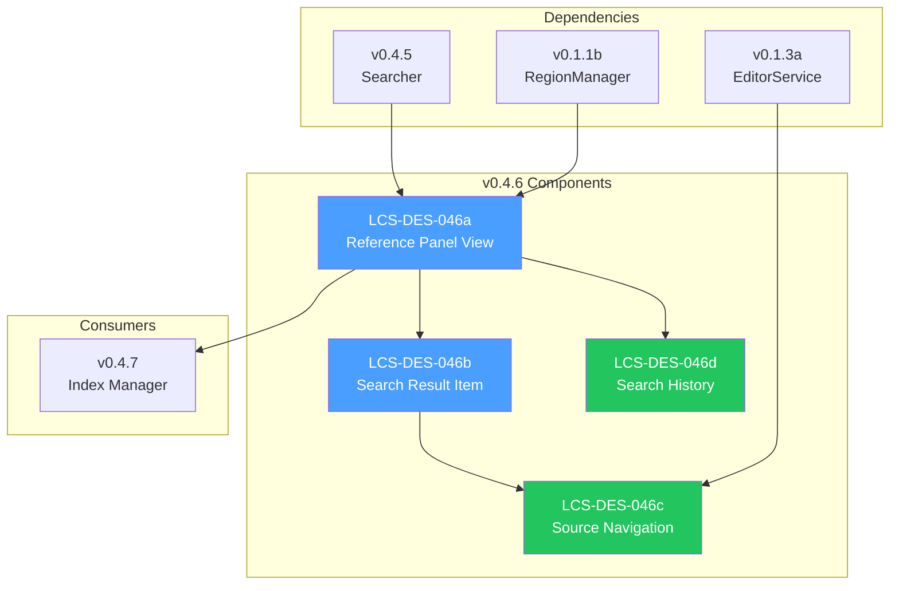

# LCS-DES-046-INDEX: Design Specification Index — The Reference Panel

## Document Control

| Field            | Value                           |
| :--------------- | :------------------------------ |
| **Document ID**  | LCS-DES-046-INDEX               |
| **Version**      | v0.4.6                          |
| **Codename**     | The Reference Panel (Search UI) |
| **Status**       | Draft                           |
| **Last Updated** | 2026-01-27                      |
| **Owner**        | Lead Architect                  |

---

## 1. Overview

This index provides navigation to all design specifications for **v0.4.6: The Reference Panel**, which implements the user-facing interface for semantic search integrated into the workspace.

---

## 2. Design Specifications

| Document ID                       | Title                | Description                 | Status |
| :-------------------------------- | :------------------- | :-------------------------- | :----- |
| [LCS-DES-046a](./LCS-DES-046a.md) | Reference Panel View | Main search panel UI        | Draft  |
| [LCS-DES-046b](./LCS-DES-046b.md) | Search Result Item   | Individual result display   | Draft  |
| [LCS-DES-046c](./LCS-DES-046c.md) | Source Navigation    | Click-to-open functionality | Draft  |
| [LCS-DES-046d](./LCS-DES-046d.md) | Search History       | Recent queries management   | Draft  |

---

## 3. Architecture Overview



---

## 4. Sub-Part Summary

### 4.1 LCS-DES-046a: Reference Panel View

**Purpose:** Main search panel UI registered in the Right shell region.

**Key Components:**

- `ReferenceView.axaml` UserControl
- `ReferenceViewModel` with search command
- Search input with history dropdown
- Virtualized results list
- Loading indicator
- License-gated UI states

**Module:** `Lexichord.Modules.RAG`

---

### 4.2 LCS-DES-046b: Search Result Item

**Purpose:** Display individual search results with preview and metadata.

**Key Components:**

- `SearchResultItemView.axaml` UserControl
- `SearchResultItemViewModel` for result data
- Document name and score badge
- Content preview with query highlighting
- Section heading display
- Double-click navigation handler

**Module:** `Lexichord.Modules.RAG`

---

### 4.3 LCS-DES-046c: Source Navigation

**Purpose:** Navigate from search results to source documents.

**Key Components:**

- `IReferenceNavigationService` interface
- `ReferenceNavigationService` implementation
- `IEditorService` integration
- Scroll to offset functionality
- Text span highlighting
- `ReferenceNavigatedEvent` for telemetry

**Module:** `Lexichord.Modules.RAG`

---

### 4.4 LCS-DES-046d: Search History

**Purpose:** Store and recall recent search queries.

**Key Components:**

- `ISearchHistoryService` interface
- `SearchHistoryService` implementation
- In-memory storage (last 10 queries)
- Optional persistence to settings
- History dropdown UI
- Clear history action

**Module:** `Lexichord.Modules.RAG`

---

## 5. Dependency Chain

```text
v0.4.6a (Reference Panel View)
    │
    ├── v0.4.6b (Search Result Item) ──────────┐
    │       │                                   │
    │       └── v0.4.6c (Source Navigation) ───┤
    │               │                           │
    │               └── v0.1.3a (EditorService) │
    │                                           │
    ├── v0.4.6d (Search History) ──────────────┘
    │       │
    │       └── v0.0.3d (IConfiguration)
    │
    ├── v0.4.5a (SearchService) ───────────────
    │
    └── v0.1.1b (RegionManager) ───────────────
```

---

## 6. Interface Dependencies

| Interface                | Source  | Used By             |
| :----------------------- | :------ | :------------------ |
| `ISemanticSearchService` | v0.4.5a | ReferenceViewModel  |
| `SearchLicenseGuard`     | v0.4.5d | ReferenceViewModel  |
| `IRegionManager`         | v0.1.1b | Module registration |
| `IEditorService`         | v0.1.3a | Navigation service  |
| `IMediator`              | v0.0.7a | Events              |
| `IConfiguration`         | v0.0.3d | History persistence |

---

## 7. New Types Introduced

### 7.1 Interfaces

| Interface                     | Methods                                 | Purpose           |
| :---------------------------- | :-------------------------------------- | :---------------- |
| `IReferenceNavigationService` | `NavigateToHitAsync`                    | Result navigation |
| `ISearchHistoryService`       | `AddQuery`, `ClearHistory`, `SaveAsync` | Query history     |

### 7.2 ViewModels

| ViewModel                   | Base            | Purpose           |
| :-------------------------- | :-------------- | :---------------- |
| `ReferenceViewModel`        | `ViewModelBase` | Panel state       |
| `SearchResultItemViewModel` | `ViewModelBase` | Result item state |

### 7.3 Events

| Event                     | Properties                  | Purpose              |
| :------------------------ | :-------------------------- | :------------------- |
| `ReferenceNavigatedEvent` | DocumentPath, Offset, Score | Navigation telemetry |

### 7.4 Views

| View                   | Type        | Purpose      |
| :--------------------- | :---------- | :----------- |
| `ReferenceView`        | UserControl | Search panel |
| `SearchResultItemView` | UserControl | Result item  |

---

## 8. Testing Strategy

| Sub-Part | Unit Tests                | UI Tests              |
| :------- | :------------------------ | :-------------------- |
| v0.4.6a  | ViewModel commands, state | Panel rendering       |
| v0.4.6b  | ViewModel properties      | Item rendering        |
| v0.4.6c  | Navigation service        | End-to-end navigation |
| v0.4.6d  | History CRUD, persistence | Dropdown behavior     |

---

## 9. Related Documents

| Document                                | Relationship               |
| :-------------------------------------- | :------------------------- |
| [LCS-SBD-046](./LCS-SBD-046.md)         | Scope Breakdown for v0.4.6 |
| [LCS-SBD-045](../v0.4.5/LCS-SBD-045.md) | Predecessor (Searcher)     |
| [LCS-SBD-047](../v0.4.7/LCS-SBD-047.md) | Successor (Index Manager)  |
| [roadmap-v0.4.x](../roadmap-v0.4.x.md)  | Version roadmap            |

---

## 10. Revision History

| Version | Date       | Author         | Changes       |
| :------ | :--------- | :------------- | :------------ |
| 0.1     | 2026-01-27 | Lead Architect | Initial draft |

---
