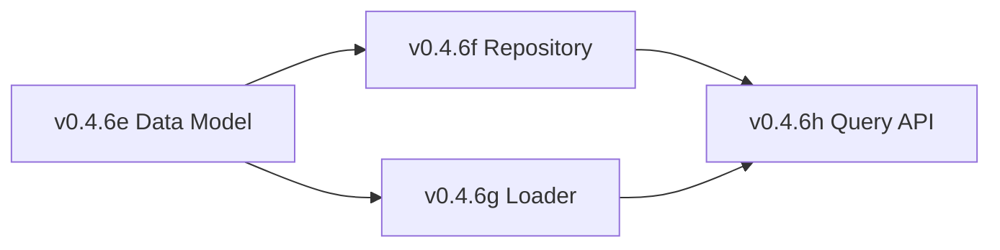

# LCS-DES-046-KG Index: Axiom Store Design Specifications

## Document Control

| Field | Value |
| :--- | :--- |
| **System Breakdown** | LCS-SBD-046-KG |
| **Version** | v0.4.6 |
| **Codename** | Axiom Store (CKVS Phase 1b) |
| **Total Sub-Parts** | 4 |
| **Total Estimated Hours** | 19 hours |
| **Status** | Draft |
| **Last Updated** | 2026-01-31 |

---

## Sub-Part Overview

| ID | Document | Title | Hours | Description |
| :- | :------- | :---- | :---- | :---------- |
| v0.4.6e | [LCS-DES-046-KG-e](LCS-DES-046-KG-e.md) | Axiom Data Model | 4 | Core data types: `Axiom`, `AxiomRule`, `AxiomViolation`, enums |
| v0.4.6f | [LCS-DES-046-KG-f](LCS-DES-046-KG-f.md) | Axiom Repository | 6 | PostgreSQL storage with caching and versioning |
| v0.4.6g | [LCS-DES-046-KG-g](LCS-DES-046-KG-g.md) | Axiom Loader | 5 | YAML parsing, validation, file watching |
| v0.4.6h | [LCS-DES-046-KG-h](LCS-DES-046-KG-h.md) | Axiom Query API | 4 | `IAxiomStore` interface for validation engine |

---

## Architecture Summary

```
┌─────────────────────────────────────────────────────────────────┐
│                     v0.4.6-KG Axiom Store                       │
├─────────────────────────────────────────────────────────────────┤
│                                                                 │
│  ┌─────────────────┐    ┌─────────────────┐                    │
│  │   v0.4.6e       │    │   v0.4.6f       │                    │
│  │   Data Model    │    │   Repository    │                    │
│  │   ───────────   │    │   ───────────   │                    │
│  │   Axiom         │    │   PostgreSQL    │                    │
│  │   AxiomRule     │◄──►│   Caching       │                    │
│  │   AxiomViolation│    │   Versioning    │                    │
│  └─────────────────┘    └─────────────────┘                    │
│           ▲                      ▲                              │
│           │                      │                              │
│  ┌─────────────────┐    ┌─────────────────┐                    │
│  │   v0.4.6g       │    │   v0.4.6h       │                    │
│  │   Loader        │───►│   Query API     │                    │
│  │   ───────────   │    │   ───────────   │                    │
│  │   YAML Parser   │    │   IAxiomStore   │──► Validation      │
│  │   File Watcher  │    │   Evaluator     │    Engine          │
│  │   Built-in      │    │   Events        │    (v0.6.5)        │
│  └─────────────────┘    └─────────────────┘                    │
│                                                                 │
└─────────────────────────────────────────────────────────────────┘
```

---

## Key Interfaces

| Interface | Module | Purpose |
| :-------- | :----- | :------ |
| `IAxiomStore` | v0.4.6h | Primary API for querying and validating against axioms |
| `IAxiomRepository` | v0.4.6f | Persistence operations for axioms |
| `IAxiomLoader` | v0.4.6g | File loading and YAML parsing |
| `IAxiomEvaluator` | v0.4.6h | Rule evaluation logic |

---

## Dependencies

### Upstream (Required)

| Component | Version | Usage |
| :-------- | :------ | :---- |
| Schema Registry | v0.4.5f | Validate axiom target types |
| Knowledge Entity | v0.4.5-KG | Validation targets |
| DB Connection Factory | v0.0.5b | PostgreSQL access |

### Downstream (Consumers)

| Component | Version | Usage |
| :-------- | :------ | :---- |
| Entity Browser | v0.4.7-KG | Axiom Viewer tab |
| Validation Engine | v0.6.5-KG | Core validation |
| Co-pilot | v0.6.6-KG | Pre-generation validation |

---

## License Gating

| Tier | Data Model | Repository | Loader | Query API |
| :--- | :--------- | :--------- | :----- | :-------- |
| Core | Types only | ✗ | ✗ | ✗ |
| WriterPro | ✓ | Read-only | Built-in only | Read + basic validation |
| Teams | ✓ | Full CRUD | Custom axioms | Full validation |
| Enterprise | ✓ | Full | Full + editor | Full + custom evaluators |

---

## Constraint Types Supported

| Type | Description | Example |
| :--- | :---------- | :------ |
| `Required` | Property must be present | `method` required on Endpoint |
| `OneOf` | Value must be in list | `method` one of GET, POST, etc. |
| `NotOneOf` | Value must not be in list | Forbidden values |
| `Range` | Numeric bounds | Status code 100-599 |
| `Pattern` | Regex match | Path starts with `/` |
| `Cardinality` | Collection size | At least 1 parameter |
| `NotBoth` | Mutually exclusive | Can't have both required + default |
| `RequiresTogether` | Co-dependent | If A then B |
| `Equals` | Exact match | Type must equal X |
| `NotEquals` | Exclusion | Type must not equal X |
| `Unique` | No duplicates | Unique endpoint paths |
| `ReferenceExists` | FK constraint | Referenced entity exists |
| `TypeValid` | Type checking | Property type matches schema |
| `Custom` | Extension point | User-defined logic |

---

## Implementation Order



1. **v0.4.6e**: Define all data types first (no dependencies)
2. **v0.4.6f**: Implement persistence (depends on data model)
3. **v0.4.6g**: Implement loading (depends on data model)
4. **v0.4.6h**: Implement query API (depends on repository + loader)

---

## Testing Strategy

| Sub-Part | Unit Tests | Integration Tests |
| :------- | :--------- | :---------------- |
| v0.4.6e | Record creation, enum coverage | — |
| v0.4.6f | CRUD operations | PostgreSQL persistence |
| v0.4.6g | YAML parsing, validation | File system, resources |
| v0.4.6h | All constraint evaluators | Full validation flow |

---

## Changelog

| Version | Date | Author | Changes |
| :------ | :--- | :----- | :------ |
| 1.0 | 2026-01-31 | Lead Architect | Initial creation |

---
