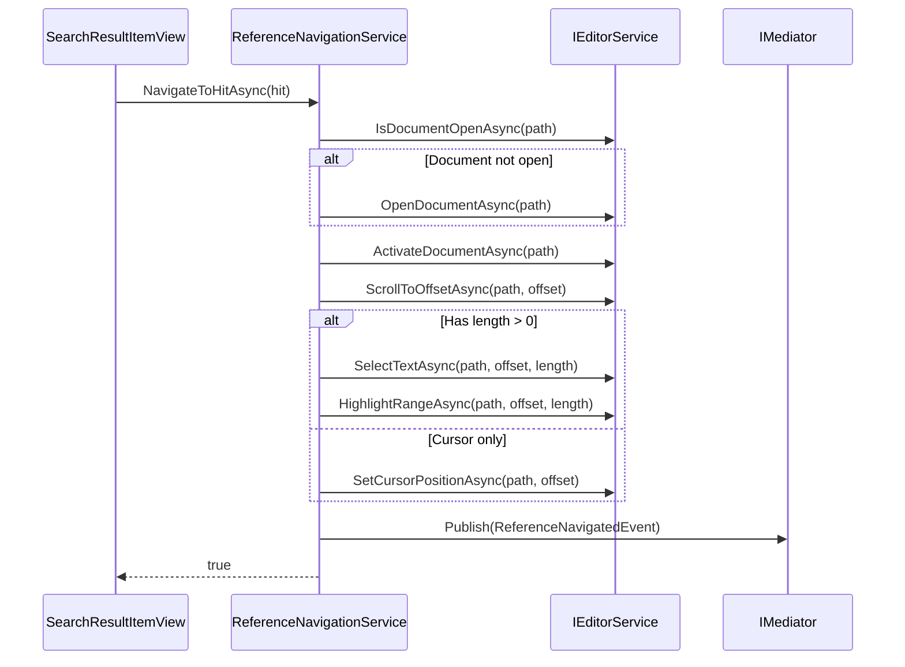

# LCS-DES-046c: Source Navigation

## Document Control

| Field            | Value                   |
| :--------------- | :---------------------- |
| **Document ID**  | LCS-DES-046c            |
| **Version**      | v0.4.6c                 |
| **Title**        | Source Navigation       |
| **Status**       | Draft                   |
| **Last Updated** | 2026-01-27              |
| **Owner**        | Lead Architect          |
| **Module**       | `Lexichord.Modules.RAG` |
| **License Tier** | WriterPro               |

---

## 1. Overview

### 1.1 Purpose

This specification defines `IReferenceNavigationService` and `ReferenceNavigationService`, which handle navigation from search results to their source locations in open documents. The service integrates with `IEditorService` to open documents, scroll to offsets, and highlight matched text spans.

### 1.2 Goals

- Define `IReferenceNavigationService` interface
- Implement navigation from `SearchHit` to source document
- Integrate with `IEditorService` for document opening
- Scroll to and highlight matched text
- Publish `ReferenceNavigatedEvent` for telemetry
- Handle edge cases (closed documents, invalid offsets)

### 1.3 Non-Goals

- Split-view navigation (future)
- Navigation history/back button (future)
- Multiple highlight regions (future)

---

## 2. Design

### 2.1 IReferenceNavigationService Interface

```csharp
namespace Lexichord.Abstractions.Contracts;

/// <summary>
/// Service for navigating from search results to source documents.
/// </summary>
public interface IReferenceNavigationService
{
    /// <summary>
    /// Navigates to the source location of a search hit.
    /// Opens the document if not already open, scrolls to the match location,
    /// and highlights the matched text span.
    /// </summary>
    /// <param name="hit">The search hit containing location information.</param>
    /// <param name="ct">Cancellation token.</param>
    /// <returns>True if navigation succeeded, false otherwise.</returns>
    Task<bool> NavigateToHitAsync(SearchHit hit, CancellationToken ct = default);

    /// <summary>
    /// Navigates to a specific offset in a document.
    /// </summary>
    /// <param name="documentPath">Path to the document.</param>
    /// <param name="offset">Character offset from start of document.</param>
    /// <param name="length">Length of text to highlight (0 for cursor only).</param>
    /// <param name="ct">Cancellation token.</param>
    /// <returns>True if navigation succeeded, false otherwise.</returns>
    Task<bool> NavigateToOffsetAsync(
        string documentPath,
        int offset,
        int length = 0,
        CancellationToken ct = default);
}
```

### 2.2 ReferenceNavigationService Implementation

```csharp
namespace Lexichord.Modules.RAG.Services;

/// <summary>
/// Implementation of reference navigation using the editor service.
/// </summary>
public sealed class ReferenceNavigationService : IReferenceNavigationService
{
    private readonly IEditorService _editorService;
    private readonly IMediator _mediator;
    private readonly ILogger<ReferenceNavigationService> _logger;

    public ReferenceNavigationService(
        IEditorService editorService,
        IMediator mediator,
        ILogger<ReferenceNavigationService> logger)
    {
        _editorService = editorService;
        _mediator = mediator;
        _logger = logger;
    }

    public async Task<bool> NavigateToHitAsync(SearchHit hit, CancellationToken ct = default)
    {
        if (hit == null)
        {
            _logger.LogWarning("NavigateToHitAsync called with null hit");
            return false;
        }

        var documentPath = hit.Document?.Path;
        if (string.IsNullOrEmpty(documentPath))
        {
            _logger.LogWarning("SearchHit has no document path");
            return false;
        }

        var offset = hit.Chunk?.Metadata?.StartOffset ?? 0;
        var length = (hit.Chunk?.Metadata?.EndOffset ?? 0) - offset;
        if (length < 0) length = 0;

        _logger.LogDebug(
            "Navigating to hit: Document={Document}, Offset={Offset}, Length={Length}",
            documentPath, offset, length);

        var result = await NavigateToOffsetAsync(documentPath, offset, length, ct);

        if (result)
        {
            // Publish telemetry event
            await _mediator.Publish(new ReferenceNavigatedEvent
            {
                DocumentPath = documentPath,
                Offset = offset,
                Length = length,
                Score = hit.Score
            }, ct);
        }

        return result;
    }

    public async Task<bool> NavigateToOffsetAsync(
        string documentPath,
        int offset,
        int length = 0,
        CancellationToken ct = default)
    {
        if (string.IsNullOrEmpty(documentPath))
        {
            _logger.LogWarning("NavigateToOffsetAsync called with empty path");
            return false;
        }

        if (offset < 0)
        {
            _logger.LogWarning("Invalid negative offset: {Offset}", offset);
            offset = 0;
        }

        try
        {
            // Step 1: Ensure document is open
            var isOpen = await _editorService.IsDocumentOpenAsync(documentPath, ct);
            if (!isOpen)
            {
                _logger.LogDebug("Opening document: {Path}", documentPath);
                var opened = await _editorService.OpenDocumentAsync(documentPath, ct);
                if (!opened)
                {
                    _logger.LogWarning("Failed to open document: {Path}", documentPath);
                    return false;
                }
            }

            // Step 2: Activate the document tab
            await _editorService.ActivateDocumentAsync(documentPath, ct);

            // Step 3: Scroll to offset
            await _editorService.ScrollToOffsetAsync(documentPath, offset, ct);

            // Step 4: Highlight the text span (if length > 0)
            if (length > 0)
            {
                await _editorService.SelectTextAsync(documentPath, offset, length, ct);

                // Apply temporary highlight
                await _editorService.HighlightRangeAsync(
                    documentPath,
                    offset,
                    length,
                    HighlightStyle.SearchResult,
                    TimeSpan.FromSeconds(3),
                    ct);
            }
            else
            {
                // Just place cursor
                await _editorService.SetCursorPositionAsync(documentPath, offset, ct);
            }

            _logger.LogInformation(
                "Navigation successful: {Path}:{Offset}",
                documentPath, offset);

            return true;
        }
        catch (FileNotFoundException ex)
        {
            _logger.LogWarning(ex, "Document not found: {Path}", documentPath);
            return false;
        }
        catch (Exception ex)
        {
            _logger.LogError(ex, "Navigation failed: {Path}:{Offset}", documentPath, offset);
            return false;
        }
    }
}
```

### 2.3 ReferenceNavigatedEvent

```csharp
namespace Lexichord.Modules.RAG.Events;

using MediatR;

/// <summary>
/// Event published when user navigates from a search result to its source.
/// Used for telemetry and analytics.
/// </summary>
public record ReferenceNavigatedEvent : INotification
{
    /// <summary>
    /// Path to the navigated document.
    /// </summary>
    public required string DocumentPath { get; init; }

    /// <summary>
    /// Character offset in the document.
    /// </summary>
    public int Offset { get; init; }

    /// <summary>
    /// Length of the highlighted text span.
    /// </summary>
    public int Length { get; init; }

    /// <summary>
    /// Relevance score of the search hit.
    /// </summary>
    public float Score { get; init; }

    /// <summary>
    /// Timestamp of the navigation.
    /// </summary>
    public DateTimeOffset Timestamp { get; init; } = DateTimeOffset.UtcNow;
}
```

### 2.4 HighlightStyle Enum

```csharp
namespace Lexichord.Abstractions.Contracts;

/// <summary>
/// Styles for text highlighting in the editor.
/// </summary>
public enum HighlightStyle
{
    /// <summary>
    /// Standard search result highlight (yellow background).
    /// </summary>
    SearchResult,

    /// <summary>
    /// Error highlight (red underline).
    /// </summary>
    Error,

    /// <summary>
    /// Warning highlight (orange underline).
    /// </summary>
    Warning,

    /// <summary>
    /// Reference highlight (blue background).
    /// </summary>
    Reference
}
```

### 2.5 DI Registration

```csharp
// In RAGModule.cs
services.AddSingleton<IReferenceNavigationService, ReferenceNavigationService>();
```

---

## 3. IEditorService Integration

### 3.1 Required IEditorService Methods

The navigation service depends on these `IEditorService` methods (defined in v0.1.3a):

```csharp
public interface IEditorService
{
    /// <summary>
    /// Checks if a document is currently open.
    /// </summary>
    Task<bool> IsDocumentOpenAsync(string path, CancellationToken ct = default);

    /// <summary>
    /// Opens a document in the editor.
    /// </summary>
    Task<bool> OpenDocumentAsync(string path, CancellationToken ct = default);

    /// <summary>
    /// Activates (brings to front) an open document.
    /// </summary>
    Task ActivateDocumentAsync(string path, CancellationToken ct = default);

    /// <summary>
    /// Scrolls the document view to show the specified offset.
    /// </summary>
    Task ScrollToOffsetAsync(string path, int offset, CancellationToken ct = default);

    /// <summary>
    /// Selects a text range in the document.
    /// </summary>
    Task SelectTextAsync(string path, int offset, int length, CancellationToken ct = default);

    /// <summary>
    /// Sets the cursor position in the document.
    /// </summary>
    Task SetCursorPositionAsync(string path, int offset, CancellationToken ct = default);

    /// <summary>
    /// Applies a temporary highlight to a text range.
    /// </summary>
    Task HighlightRangeAsync(
        string path,
        int offset,
        int length,
        HighlightStyle style,
        TimeSpan duration,
        CancellationToken ct = default);
}
```

### 3.2 Navigation Flow



---

## 4. Unit Tests

```csharp
[Trait("Category", "Unit")]
[Trait("Feature", "v0.4.6c")]
public class ReferenceNavigationServiceTests
{
    private readonly Mock<IEditorService> _editorMock;
    private readonly Mock<IMediator> _mediatorMock;
    private readonly ReferenceNavigationService _sut;

    public ReferenceNavigationServiceTests()
    {
        _editorMock = new Mock<IEditorService>();
        _mediatorMock = new Mock<IMediator>();

        // Default: document not open
        _editorMock.Setup(e => e.IsDocumentOpenAsync(It.IsAny<string>(), It.IsAny<CancellationToken>()))
            .ReturnsAsync(false);

        // Default: open succeeds
        _editorMock.Setup(e => e.OpenDocumentAsync(It.IsAny<string>(), It.IsAny<CancellationToken>()))
            .ReturnsAsync(true);

        _sut = new ReferenceNavigationService(
            _editorMock.Object,
            _mediatorMock.Object,
            NullLogger<ReferenceNavigationService>.Instance);
    }

    [Fact]
    public async Task NavigateToHitAsync_NullHit_ReturnsFalse()
    {
        var result = await _sut.NavigateToHitAsync(null!);
        result.Should().BeFalse();
    }

    [Fact]
    public async Task NavigateToHitAsync_NoDocumentPath_ReturnsFalse()
    {
        var hit = new SearchHit
        {
            Score = 0.9f,
            Chunk = CreateChunk(0, 100),
            Document = null
        };

        var result = await _sut.NavigateToHitAsync(hit);
        result.Should().BeFalse();
    }

    [Fact]
    public async Task NavigateToHitAsync_OpensClosedDocument()
    {
        var hit = CreateHit("/docs/test.md", 50, 100);

        await _sut.NavigateToHitAsync(hit);

        _editorMock.Verify(e => e.OpenDocumentAsync("/docs/test.md", It.IsAny<CancellationToken>()), Times.Once);
    }

    [Fact]
    public async Task NavigateToHitAsync_SkipsOpenForOpenDocument()
    {
        _editorMock.Setup(e => e.IsDocumentOpenAsync("/docs/test.md", It.IsAny<CancellationToken>()))
            .ReturnsAsync(true);

        var hit = CreateHit("/docs/test.md", 50, 100);

        await _sut.NavigateToHitAsync(hit);

        _editorMock.Verify(e => e.OpenDocumentAsync(It.IsAny<string>(), It.IsAny<CancellationToken>()), Times.Never);
    }

    [Fact]
    public async Task NavigateToHitAsync_ActivatesDocument()
    {
        var hit = CreateHit("/docs/test.md", 50, 100);

        await _sut.NavigateToHitAsync(hit);

        _editorMock.Verify(e => e.ActivateDocumentAsync("/docs/test.md", It.IsAny<CancellationToken>()), Times.Once);
    }

    [Fact]
    public async Task NavigateToHitAsync_ScrollsToOffset()
    {
        var hit = CreateHit("/docs/test.md", 50, 100);

        await _sut.NavigateToHitAsync(hit);

        _editorMock.Verify(e => e.ScrollToOffsetAsync("/docs/test.md", 50, It.IsAny<CancellationToken>()), Times.Once);
    }

    [Fact]
    public async Task NavigateToHitAsync_SelectsTextSpan()
    {
        var hit = CreateHit("/docs/test.md", 50, 100);

        await _sut.NavigateToHitAsync(hit);

        _editorMock.Verify(e => e.SelectTextAsync("/docs/test.md", 50, 50, It.IsAny<CancellationToken>()), Times.Once);
    }

    [Fact]
    public async Task NavigateToHitAsync_HighlightsRange()
    {
        var hit = CreateHit("/docs/test.md", 50, 100);

        await _sut.NavigateToHitAsync(hit);

        _editorMock.Verify(e => e.HighlightRangeAsync(
            "/docs/test.md",
            50,
            50,
            HighlightStyle.SearchResult,
            It.IsAny<TimeSpan>(),
            It.IsAny<CancellationToken>()), Times.Once);
    }

    [Fact]
    public async Task NavigateToHitAsync_PublishesTelemetryEvent()
    {
        var hit = CreateHit("/docs/test.md", 50, 100, score: 0.85f);

        await _sut.NavigateToHitAsync(hit);

        _mediatorMock.Verify(m => m.Publish(
            It.Is<ReferenceNavigatedEvent>(e =>
                e.DocumentPath == "/docs/test.md" &&
                e.Offset == 50 &&
                e.Length == 50 &&
                e.Score == 0.85f),
            It.IsAny<CancellationToken>()), Times.Once);
    }

    [Fact]
    public async Task NavigateToHitAsync_OpenFails_ReturnsFalse()
    {
        _editorMock.Setup(e => e.OpenDocumentAsync(It.IsAny<string>(), It.IsAny<CancellationToken>()))
            .ReturnsAsync(false);

        var hit = CreateHit("/docs/test.md", 50, 100);

        var result = await _sut.NavigateToHitAsync(hit);

        result.Should().BeFalse();
        _mediatorMock.Verify(m => m.Publish(It.IsAny<ReferenceNavigatedEvent>(), It.IsAny<CancellationToken>()), Times.Never);
    }

    [Fact]
    public async Task NavigateToOffsetAsync_NegativeOffset_ClampsToZero()
    {
        await _sut.NavigateToOffsetAsync("/docs/test.md", -10, 50);

        _editorMock.Verify(e => e.ScrollToOffsetAsync("/docs/test.md", 0, It.IsAny<CancellationToken>()), Times.Once);
    }

    [Fact]
    public async Task NavigateToOffsetAsync_ZeroLength_SetsCursorOnly()
    {
        await _sut.NavigateToOffsetAsync("/docs/test.md", 50, 0);

        _editorMock.Verify(e => e.SetCursorPositionAsync("/docs/test.md", 50, It.IsAny<CancellationToken>()), Times.Once);
        _editorMock.Verify(e => e.SelectTextAsync(It.IsAny<string>(), It.IsAny<int>(), It.IsAny<int>(), It.IsAny<CancellationToken>()), Times.Never);
    }

    [Fact]
    public async Task NavigateToOffsetAsync_FileNotFound_ReturnsFalse()
    {
        _editorMock.Setup(e => e.OpenDocumentAsync(It.IsAny<string>(), It.IsAny<CancellationToken>()))
            .ThrowsAsync(new FileNotFoundException());

        var result = await _sut.NavigateToOffsetAsync("/docs/missing.md", 50, 100);

        result.Should().BeFalse();
    }

    private static SearchHit CreateHit(string path, int startOffset, int endOffset, float score = 0.9f)
    {
        return new SearchHit
        {
            Score = score,
            Chunk = CreateChunk(startOffset, endOffset),
            Document = new Document
            {
                Id = Guid.NewGuid(),
                Name = Path.GetFileName(path),
                Path = path
            }
        };
    }

    private static TextChunk CreateChunk(int startOffset, int endOffset)
    {
        return new TextChunk
        {
            Content = "Sample chunk content",
            Metadata = new ChunkMetadata
            {
                Index = 0,
                StartOffset = startOffset,
                EndOffset = endOffset
            }
        };
    }
}
```

---

## 5. Error Handling

| Scenario              | Behavior                  |
| :-------------------- | :------------------------ |
| Null hit              | Return false, log warning |
| Missing document path | Return false, log warning |
| Document open fails   | Return false, log warning |
| File not found        | Return false, log warning |
| Invalid offset        | Clamp to 0, proceed       |
| Editor service error  | Return false, log error   |

---

## 6. Logging

| Level       | Message                                                   | Context                 |
| :---------- | :-------------------------------------------------------- | :---------------------- |
| Debug       | "Navigating to hit: Document={Document}, Offset={Offset}" | Before navigation       |
| Debug       | "Opening document: {Path}"                                | When opening closed doc |
| Information | "Navigation successful: {Path}:{Offset}"                  | After success           |
| Warning     | "NavigateToHitAsync called with null hit"                 | Null input              |
| Warning     | "SearchHit has no document path"                          | Missing path            |
| Warning     | "Failed to open document: {Path}"                         | Open failed             |
| Warning     | "Document not found: {Path}"                              | FileNotFoundException   |
| Error       | "Navigation failed: {Path}:{Offset}"                      | Unexpected exception    |

---

## 7. File Locations

| File           | Path                                                                            |
| :------------- | :------------------------------------------------------------------------------ |
| Interface      | `src/Lexichord.Abstractions/Contracts/IReferenceNavigationService.cs`           |
| Implementation | `src/Lexichord.Modules.RAG/Services/ReferenceNavigationService.cs`              |
| Event          | `src/Lexichord.Modules.RAG/Events/ReferenceNavigatedEvent.cs`                   |
| HighlightStyle | `src/Lexichord.Abstractions/Contracts/HighlightStyle.cs`                        |
| Unit tests     | `tests/Lexichord.Modules.RAG.Tests/Services/ReferenceNavigationServiceTests.cs` |

---

## 8. Acceptance Criteria

| #   | Criterion                                               | Status |
| :-- | :------------------------------------------------------ | :----- |
| 1   | NavigateToHitAsync opens closed documents               | [ ]    |
| 2   | NavigateToHitAsync activates document tab               | [ ]    |
| 3   | NavigateToHitAsync scrolls to correct offset            | [ ]    |
| 4   | NavigateToHitAsync highlights text span                 | [ ]    |
| 5   | NavigateToHitAsync publishes telemetry event            | [ ]    |
| 6   | NavigateToOffsetAsync works with cursor-only (length=0) | [ ]    |
| 7   | Handles missing/invalid paths gracefully                | [ ]    |
| 8   | Handles file not found gracefully                       | [ ]    |
| 9   | All unit tests pass                                     | [ ]    |

---

## 9. Revision History

| Version | Date       | Author         | Changes       |
| :------ | :--------- | :------------- | :------------ |
| 0.1     | 2026-01-27 | Lead Architect | Initial draft |

---
