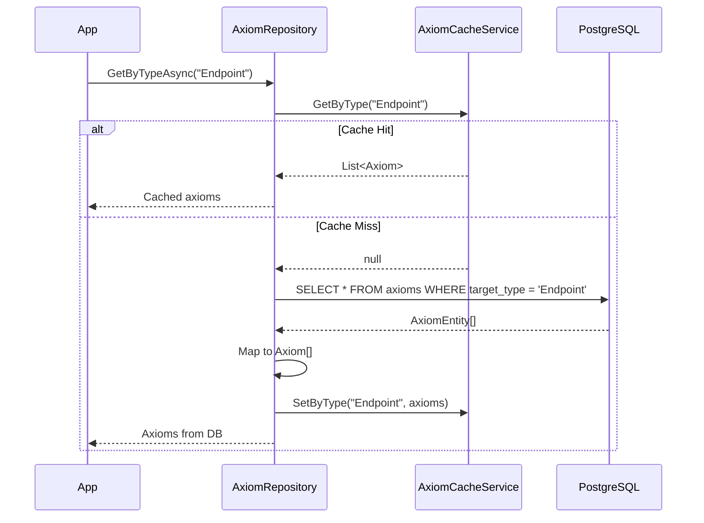
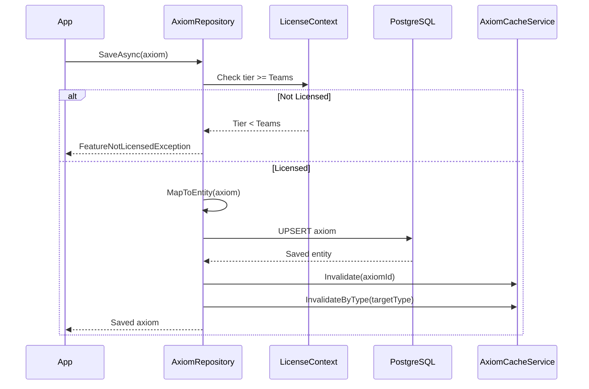

# LCS-DES-046-KG-f: Axiom Repository

## 1. Metadata & Categorization

| Field | Value |
| :--- | :--- |
| **Document ID** | LCS-DES-046-KG-f |
| **Feature ID** | KG-046f |
| **Feature Name** | Axiom Repository |
| **Target Version** | v0.4.6f |
| **Module Scope** | `Lexichord.Modules.Knowledge` |
| **Swimlane** | Memory |
| **License Tier** | WriterPro (read), Teams (write) |
| **Feature Gate Key** | `knowledge.axioms.enabled` |
| **Status** | Draft |
| **Last Updated** | 2026-01-31 |

---

## 2. Executive Summary

### 2.1 The Requirement

Axioms need persistent storage with versioning support. The repository must efficiently query axioms by type, category, and tags while supporting both built-in axioms and user-defined workspace axioms.

### 2.2 The Proposed Solution

Implement `IAxiomRepository` with PostgreSQL storage:

- **Axiom Table**: Stores axiom metadata with JSON rules.
- **Versioning**: Track axiom versions for workspace compatibility.
- **Caching**: In-memory cache for frequently accessed axioms.
- **Bulk Operations**: Efficient upsert for axiom file loading.

---

## 3. Architecture & Modular Strategy

### 3.1 Dependencies

**Upstream Modules:**
- v0.4.6e: `Axiom`, `AxiomRule` — Data model
- v0.0.5b: `IDbConnectionFactory` — PostgreSQL access
- v0.0.3d: `IConfiguration` — Settings

**NuGet Packages:**
- `Dapper` (2.x) — Micro ORM
- `System.Text.Json` — JSON serialization

### 3.2 Module Placement

```
Lexichord.Modules.Knowledge/
├── Axioms/
│   ├── IAxiomRepository.cs
│   ├── AxiomRepository.cs
│   └── AxiomCacheService.cs
├── Migrations/
│   └── Migration_006_AxiomTables.cs
```

### 3.3 Licensing Behavior

- **Load Behavior:** [x] Conditional — Only at WriterPro+
- **Fallback Experience:** Core tier sees upgrade prompt

---

## 4. Data Contract (The API)

### 4.1 Repository Interface

```csharp
namespace Lexichord.Modules.Knowledge.Axioms;

/// <summary>
/// Repository for persisting and querying axioms.
/// </summary>
public interface IAxiomRepository
{
    /// <summary>
    /// Gets all axioms for a specific entity type.
    /// </summary>
    /// <param name="entityType">Entity type name (e.g., "Endpoint").</param>
    /// <param name="ct">Cancellation token.</param>
    /// <returns>Axioms targeting this type.</returns>
    Task<IReadOnlyList<Axiom>> GetByTypeAsync(
        string entityType,
        CancellationToken ct = default);

    /// <summary>
    /// Gets all axioms matching the filter criteria.
    /// </summary>
    /// <param name="filter">Filter options.</param>
    /// <param name="ct">Cancellation token.</param>
    /// <returns>Matching axioms.</returns>
    Task<IReadOnlyList<Axiom>> GetAsync(
        AxiomFilter filter,
        CancellationToken ct = default);

    /// <summary>
    /// Gets a single axiom by ID.
    /// </summary>
    /// <param name="axiomId">Axiom identifier.</param>
    /// <param name="ct">Cancellation token.</param>
    /// <returns>Axiom if found, null otherwise.</returns>
    Task<Axiom?> GetByIdAsync(
        string axiomId,
        CancellationToken ct = default);

    /// <summary>
    /// Gets all axioms.
    /// </summary>
    /// <param name="ct">Cancellation token.</param>
    /// <returns>All stored axioms.</returns>
    Task<IReadOnlyList<Axiom>> GetAllAsync(
        CancellationToken ct = default);

    /// <summary>
    /// Saves an axiom (insert or update).
    /// </summary>
    /// <param name="axiom">Axiom to save.</param>
    /// <param name="ct">Cancellation token.</param>
    /// <returns>Saved axiom with any generated fields.</returns>
    Task<Axiom> SaveAsync(
        Axiom axiom,
        CancellationToken ct = default);

    /// <summary>
    /// Saves multiple axioms in a batch.
    /// </summary>
    /// <param name="axioms">Axioms to save.</param>
    /// <param name="ct">Cancellation token.</param>
    /// <returns>Number of axioms saved.</returns>
    Task<int> SaveBatchAsync(
        IEnumerable<Axiom> axioms,
        CancellationToken ct = default);

    /// <summary>
    /// Deletes an axiom by ID.
    /// </summary>
    /// <param name="axiomId">Axiom identifier.</param>
    /// <param name="ct">Cancellation token.</param>
    /// <returns>True if deleted, false if not found.</returns>
    Task<bool> DeleteAsync(
        string axiomId,
        CancellationToken ct = default);

    /// <summary>
    /// Deletes all axioms from a source file.
    /// </summary>
    /// <param name="sourceFile">Source file path.</param>
    /// <param name="ct">Cancellation token.</param>
    /// <returns>Number of axioms deleted.</returns>
    Task<int> DeleteBySourceAsync(
        string sourceFile,
        CancellationToken ct = default);

    /// <summary>
    /// Gets axiom statistics.
    /// </summary>
    /// <param name="ct">Cancellation token.</param>
    /// <returns>Statistics about stored axioms.</returns>
    Task<AxiomStatistics> GetStatisticsAsync(
        CancellationToken ct = default);
}

/// <summary>
/// Filter criteria for querying axioms.
/// </summary>
public record AxiomFilter
{
    /// <summary>Filter by target type.</summary>
    public string? TargetType { get; init; }

    /// <summary>Filter by target kind.</summary>
    public AxiomTargetKind? TargetKind { get; init; }

    /// <summary>Filter by category.</summary>
    public string? Category { get; init; }

    /// <summary>Filter by severity.</summary>
    public AxiomSeverity? Severity { get; init; }

    /// <summary>Filter by tags (any match).</summary>
    public IReadOnlyList<string>? Tags { get; init; }

    /// <summary>Filter by enabled status.</summary>
    public bool? IsEnabled { get; init; }

    /// <summary>Filter by source file.</summary>
    public string? SourceFile { get; init; }

    /// <summary>Search in name/description.</summary>
    public string? SearchText { get; init; }

    /// <summary>Skip N results.</summary>
    public int? Skip { get; init; }

    /// <summary>Take N results.</summary>
    public int? Take { get; init; }
}

/// <summary>
/// Statistics about stored axioms.
/// </summary>
public record AxiomStatistics
{
    /// <summary>Total axiom count.</summary>
    public int TotalCount { get; init; }

    /// <summary>Enabled axiom count.</summary>
    public int EnabledCount { get; init; }

    /// <summary>Count by target type.</summary>
    public IReadOnlyDictionary<string, int> ByTargetType { get; init; } = new Dictionary<string, int>();

    /// <summary>Count by severity.</summary>
    public IReadOnlyDictionary<AxiomSeverity, int> BySeverity { get; init; } = new Dictionary<AxiomSeverity, int>();

    /// <summary>Count by category.</summary>
    public IReadOnlyDictionary<string, int> ByCategory { get; init; } = new Dictionary<string, int>();

    /// <summary>Source file count.</summary>
    public int SourceFileCount { get; init; }
}
```

### 4.2 Database Entity

```csharp
namespace Lexichord.Modules.Knowledge.Axioms;

/// <summary>
/// Database entity for axiom storage.
/// </summary>
internal record AxiomEntity
{
    public string Id { get; init; } = "";
    public string Name { get; init; } = "";
    public string? Description { get; init; }
    public string TargetType { get; init; } = "";
    public string TargetKind { get; init; } = "Entity";
    public string RulesJson { get; init; } = "[]";
    public string Severity { get; init; } = "Error";
    public string? Category { get; init; }
    public string TagsJson { get; init; } = "[]";
    public bool IsEnabled { get; init; } = true;
    public string? SourceFile { get; init; }
    public string SchemaVersion { get; init; } = "1.0";
    public DateTimeOffset CreatedAt { get; init; }
    public DateTimeOffset UpdatedAt { get; init; }
    public int Version { get; init; } = 1;
}
```

---

## 5. Implementation Logic

### 5.1 AxiomRepository

```csharp
namespace Lexichord.Modules.Knowledge.Axioms;

/// <summary>
/// PostgreSQL implementation of IAxiomRepository.
/// </summary>
public sealed class AxiomRepository : IAxiomRepository
{
    private readonly IDbConnectionFactory _connectionFactory;
    private readonly IAxiomCacheService _cache;
    private readonly ILicenseContext _licenseContext;
    private readonly ILogger<AxiomRepository> _logger;

    public AxiomRepository(
        IDbConnectionFactory connectionFactory,
        IAxiomCacheService cache,
        ILicenseContext licenseContext,
        ILogger<AxiomRepository> logger)
    {
        _connectionFactory = connectionFactory;
        _cache = cache;
        _licenseContext = licenseContext;
        _logger = logger;
    }

    public async Task<IReadOnlyList<Axiom>> GetByTypeAsync(
        string entityType,
        CancellationToken ct = default)
    {
        // Check cache first
        var cached = _cache.GetByType(entityType);
        if (cached != null)
        {
            return cached;
        }

        await using var connection = await _connectionFactory.CreateConnectionAsync(ct);

        const string sql = @"
            SELECT * FROM axioms
            WHERE target_type = @TargetType AND is_enabled = true
            ORDER BY name";

        var entities = await connection.QueryAsync<AxiomEntity>(
            sql,
            new { TargetType = entityType });

        var axioms = entities.Select(MapToAxiom).ToList();

        _cache.SetByType(entityType, axioms);

        return axioms;
    }

    public async Task<IReadOnlyList<Axiom>> GetAsync(
        AxiomFilter filter,
        CancellationToken ct = default)
    {
        await using var connection = await _connectionFactory.CreateConnectionAsync(ct);

        var sql = new StringBuilder("SELECT * FROM axioms WHERE 1=1");
        var parameters = new DynamicParameters();

        if (filter.TargetType != null)
        {
            sql.Append(" AND target_type = @TargetType");
            parameters.Add("TargetType", filter.TargetType);
        }

        if (filter.TargetKind != null)
        {
            sql.Append(" AND target_kind = @TargetKind");
            parameters.Add("TargetKind", filter.TargetKind.ToString());
        }

        if (filter.Category != null)
        {
            sql.Append(" AND category = @Category");
            parameters.Add("Category", filter.Category);
        }

        if (filter.Severity != null)
        {
            sql.Append(" AND severity = @Severity");
            parameters.Add("Severity", filter.Severity.ToString());
        }

        if (filter.IsEnabled != null)
        {
            sql.Append(" AND is_enabled = @IsEnabled");
            parameters.Add("IsEnabled", filter.IsEnabled.Value);
        }

        if (filter.SourceFile != null)
        {
            sql.Append(" AND source_file = @SourceFile");
            parameters.Add("SourceFile", filter.SourceFile);
        }

        if (filter.Tags?.Any() == true)
        {
            sql.Append(" AND tags_json::jsonb ?| @Tags");
            parameters.Add("Tags", filter.Tags.ToArray());
        }

        if (!string.IsNullOrEmpty(filter.SearchText))
        {
            sql.Append(" AND (name ILIKE @Search OR description ILIKE @Search)");
            parameters.Add("Search", $"%{filter.SearchText}%");
        }

        sql.Append(" ORDER BY name");

        if (filter.Skip.HasValue)
        {
            sql.Append(" OFFSET @Skip");
            parameters.Add("Skip", filter.Skip.Value);
        }

        if (filter.Take.HasValue)
        {
            sql.Append(" LIMIT @Take");
            parameters.Add("Take", filter.Take.Value);
        }

        var entities = await connection.QueryAsync<AxiomEntity>(sql.ToString(), parameters);
        return entities.Select(MapToAxiom).ToList();
    }

    public async Task<Axiom?> GetByIdAsync(string axiomId, CancellationToken ct = default)
    {
        // Check cache
        var cached = _cache.GetById(axiomId);
        if (cached != null)
        {
            return cached;
        }

        await using var connection = await _connectionFactory.CreateConnectionAsync(ct);

        var entity = await connection.QueryFirstOrDefaultAsync<AxiomEntity>(
            "SELECT * FROM axioms WHERE id = @Id",
            new { Id = axiomId });

        if (entity == null)
        {
            return null;
        }

        var axiom = MapToAxiom(entity);
        _cache.Set(axiom);
        return axiom;
    }

    public async Task<IReadOnlyList<Axiom>> GetAllAsync(CancellationToken ct = default)
    {
        var cached = _cache.GetAll();
        if (cached != null)
        {
            return cached;
        }

        await using var connection = await _connectionFactory.CreateConnectionAsync(ct);

        var entities = await connection.QueryAsync<AxiomEntity>(
            "SELECT * FROM axioms ORDER BY target_type, name");

        var axioms = entities.Select(MapToAxiom).ToList();

        _cache.SetAll(axioms);

        return axioms;
    }

    public async Task<Axiom> SaveAsync(Axiom axiom, CancellationToken ct = default)
    {
        // License check for write operations
        if (_licenseContext.Tier < LicenseTier.Teams)
        {
            throw new FeatureNotLicensedException("Axiom Management", LicenseTier.Teams);
        }

        await using var connection = await _connectionFactory.CreateConnectionAsync(ct);

        var entity = MapToEntity(axiom);

        const string sql = @"
            INSERT INTO axioms (
                id, name, description, target_type, target_kind, rules_json,
                severity, category, tags_json, is_enabled, source_file,
                schema_version, created_at, updated_at, version
            ) VALUES (
                @Id, @Name, @Description, @TargetType, @TargetKind, @RulesJson::jsonb,
                @Severity, @Category, @TagsJson::jsonb, @IsEnabled, @SourceFile,
                @SchemaVersion, @CreatedAt, @UpdatedAt, @Version
            )
            ON CONFLICT (id) DO UPDATE SET
                name = EXCLUDED.name,
                description = EXCLUDED.description,
                target_type = EXCLUDED.target_type,
                target_kind = EXCLUDED.target_kind,
                rules_json = EXCLUDED.rules_json,
                severity = EXCLUDED.severity,
                category = EXCLUDED.category,
                tags_json = EXCLUDED.tags_json,
                is_enabled = EXCLUDED.is_enabled,
                source_file = EXCLUDED.source_file,
                schema_version = EXCLUDED.schema_version,
                updated_at = @UpdatedAt,
                version = axioms.version + 1
            RETURNING *";

        var saved = await connection.QuerySingleAsync<AxiomEntity>(sql, entity);

        _logger.LogInformation("Saved axiom {AxiomId}", axiom.Id);

        // Invalidate cache
        _cache.Invalidate(axiom.Id);
        _cache.InvalidateByType(axiom.TargetType);

        return MapToAxiom(saved);
    }

    public async Task<int> SaveBatchAsync(IEnumerable<Axiom> axioms, CancellationToken ct = default)
    {
        if (_licenseContext.Tier < LicenseTier.Teams)
        {
            throw new FeatureNotLicensedException("Axiom Management", LicenseTier.Teams);
        }

        await using var connection = await _connectionFactory.CreateConnectionAsync(ct);
        await using var transaction = await connection.BeginTransactionAsync(ct);

        var count = 0;
        foreach (var axiom in axioms)
        {
            var entity = MapToEntity(axiom);

            const string sql = @"
                INSERT INTO axioms (
                    id, name, description, target_type, target_kind, rules_json,
                    severity, category, tags_json, is_enabled, source_file,
                    schema_version, created_at, updated_at, version
                ) VALUES (
                    @Id, @Name, @Description, @TargetType, @TargetKind, @RulesJson::jsonb,
                    @Severity, @Category, @TagsJson::jsonb, @IsEnabled, @SourceFile,
                    @SchemaVersion, @CreatedAt, @UpdatedAt, @Version
                )
                ON CONFLICT (id) DO UPDATE SET
                    name = EXCLUDED.name,
                    description = EXCLUDED.description,
                    target_type = EXCLUDED.target_type,
                    target_kind = EXCLUDED.target_kind,
                    rules_json = EXCLUDED.rules_json,
                    severity = EXCLUDED.severity,
                    category = EXCLUDED.category,
                    tags_json = EXCLUDED.tags_json,
                    is_enabled = EXCLUDED.is_enabled,
                    source_file = EXCLUDED.source_file,
                    updated_at = @UpdatedAt,
                    version = axioms.version + 1";

            await connection.ExecuteAsync(sql, entity, transaction);
            count++;
        }

        await transaction.CommitAsync(ct);

        _logger.LogInformation("Saved {Count} axioms in batch", count);

        // Invalidate all cache
        _cache.InvalidateAll();

        return count;
    }

    public async Task<bool> DeleteAsync(string axiomId, CancellationToken ct = default)
    {
        if (_licenseContext.Tier < LicenseTier.Teams)
        {
            throw new FeatureNotLicensedException("Axiom Management", LicenseTier.Teams);
        }

        await using var connection = await _connectionFactory.CreateConnectionAsync(ct);

        var rows = await connection.ExecuteAsync(
            "DELETE FROM axioms WHERE id = @Id",
            new { Id = axiomId });

        if (rows > 0)
        {
            _cache.Invalidate(axiomId);
            _logger.LogInformation("Deleted axiom {AxiomId}", axiomId);
        }

        return rows > 0;
    }

    public async Task<int> DeleteBySourceAsync(string sourceFile, CancellationToken ct = default)
    {
        if (_licenseContext.Tier < LicenseTier.Teams)
        {
            throw new FeatureNotLicensedException("Axiom Management", LicenseTier.Teams);
        }

        await using var connection = await _connectionFactory.CreateConnectionAsync(ct);

        var rows = await connection.ExecuteAsync(
            "DELETE FROM axioms WHERE source_file = @SourceFile",
            new { SourceFile = sourceFile });

        if (rows > 0)
        {
            _cache.InvalidateAll();
            _logger.LogInformation("Deleted {Count} axioms from source {Source}", rows, sourceFile);
        }

        return rows;
    }

    public async Task<AxiomStatistics> GetStatisticsAsync(CancellationToken ct = default)
    {
        await using var connection = await _connectionFactory.CreateConnectionAsync(ct);

        const string sql = @"
            SELECT
                COUNT(*) AS total_count,
                COUNT(*) FILTER (WHERE is_enabled) AS enabled_count,
                COUNT(DISTINCT source_file) AS source_file_count
            FROM axioms;

            SELECT target_type, COUNT(*) AS count
            FROM axioms
            GROUP BY target_type;

            SELECT severity, COUNT(*) AS count
            FROM axioms
            GROUP BY severity;

            SELECT category, COUNT(*) AS count
            FROM axioms
            WHERE category IS NOT NULL
            GROUP BY category";

        using var multi = await connection.QueryMultipleAsync(sql);

        var totals = await multi.ReadSingleAsync<dynamic>();
        var byType = (await multi.ReadAsync<dynamic>())
            .ToDictionary(x => (string)x.target_type, x => (int)x.count);
        var bySeverity = (await multi.ReadAsync<dynamic>())
            .ToDictionary(
                x => Enum.Parse<AxiomSeverity>((string)x.severity),
                x => (int)x.count);
        var byCategory = (await multi.ReadAsync<dynamic>())
            .ToDictionary(x => (string)x.category, x => (int)x.count);

        return new AxiomStatistics
        {
            TotalCount = (int)totals.total_count,
            EnabledCount = (int)totals.enabled_count,
            SourceFileCount = (int)totals.source_file_count,
            ByTargetType = byType,
            BySeverity = bySeverity,
            ByCategory = byCategory
        };
    }

    private static Axiom MapToAxiom(AxiomEntity entity)
    {
        return new Axiom
        {
            Id = entity.Id,
            Name = entity.Name,
            Description = entity.Description,
            TargetType = entity.TargetType,
            TargetKind = Enum.Parse<AxiomTargetKind>(entity.TargetKind),
            Rules = JsonSerializer.Deserialize<List<AxiomRule>>(entity.RulesJson) ?? new(),
            Severity = Enum.Parse<AxiomSeverity>(entity.Severity),
            Category = entity.Category,
            Tags = JsonSerializer.Deserialize<List<string>>(entity.TagsJson) ?? new(),
            IsEnabled = entity.IsEnabled,
            SourceFile = entity.SourceFile,
            SchemaVersion = entity.SchemaVersion,
            CreatedAt = entity.CreatedAt
        };
    }

    private static AxiomEntity MapToEntity(Axiom axiom)
    {
        return new AxiomEntity
        {
            Id = axiom.Id,
            Name = axiom.Name,
            Description = axiom.Description,
            TargetType = axiom.TargetType,
            TargetKind = axiom.TargetKind.ToString(),
            RulesJson = JsonSerializer.Serialize(axiom.Rules),
            Severity = axiom.Severity.ToString(),
            Category = axiom.Category,
            TagsJson = JsonSerializer.Serialize(axiom.Tags),
            IsEnabled = axiom.IsEnabled,
            SourceFile = axiom.SourceFile,
            SchemaVersion = axiom.SchemaVersion,
            CreatedAt = axiom.CreatedAt,
            UpdatedAt = DateTimeOffset.UtcNow,
            Version = 1
        };
    }
}
```

### 5.2 Database Migration

```csharp
namespace Lexichord.Modules.Knowledge.Migrations;

/// <summary>
/// Creates axiom storage tables.
/// </summary>
[Migration(6)]
public class Migration_006_AxiomTables : Migration
{
    public override void Up()
    {
        Create.Table("axioms")
            .WithColumn("id").AsString(100).PrimaryKey()
            .WithColumn("name").AsString(200).NotNullable()
            .WithColumn("description").AsString(1000).Nullable()
            .WithColumn("target_type").AsString(100).NotNullable().Indexed()
            .WithColumn("target_kind").AsString(50).NotNullable().WithDefaultValue("Entity")
            .WithColumn("rules_json").AsCustom("jsonb").NotNullable()
            .WithColumn("severity").AsString(50).NotNullable().WithDefaultValue("Error")
            .WithColumn("category").AsString(100).Nullable().Indexed()
            .WithColumn("tags_json").AsCustom("jsonb").NotNullable().WithDefaultValue("[]")
            .WithColumn("is_enabled").AsBoolean().NotNullable().WithDefaultValue(true)
            .WithColumn("source_file").AsString(500).Nullable().Indexed()
            .WithColumn("schema_version").AsString(20).NotNullable().WithDefaultValue("1.0")
            .WithColumn("created_at").AsDateTimeOffset().NotNullable()
            .WithColumn("updated_at").AsDateTimeOffset().NotNullable()
            .WithColumn("version").AsInt32().NotNullable().WithDefaultValue(1);

        // Composite index for common queries
        Create.Index("ix_axioms_type_enabled")
            .OnTable("axioms")
            .OnColumn("target_type")
            .OnColumn("is_enabled");

        // GIN index for tag search
        Execute.Sql("CREATE INDEX ix_axioms_tags ON axioms USING GIN (tags_json)");
    }

    public override void Down()
    {
        Delete.Table("axioms");
    }
}
```

### 5.3 Cache Service

```csharp
namespace Lexichord.Modules.Knowledge.Axioms;

/// <summary>
/// In-memory cache for axioms.
/// </summary>
public interface IAxiomCacheService
{
    Axiom? GetById(string axiomId);
    IReadOnlyList<Axiom>? GetByType(string targetType);
    IReadOnlyList<Axiom>? GetAll();
    void Set(Axiom axiom);
    void SetByType(string targetType, IReadOnlyList<Axiom> axioms);
    void SetAll(IReadOnlyList<Axiom> axioms);
    void Invalidate(string axiomId);
    void InvalidateByType(string targetType);
    void InvalidateAll();
}

/// <summary>
/// Memory cache implementation for axioms.
/// </summary>
public sealed class AxiomCacheService : IAxiomCacheService
{
    private readonly IMemoryCache _cache;
    private readonly MemoryCacheEntryOptions _options;
    private readonly ILogger<AxiomCacheService> _logger;

    private const string AllKey = "axioms:all";
    private const string ByTypePrefix = "axioms:type:";
    private const string ByIdPrefix = "axioms:id:";

    public AxiomCacheService(IMemoryCache cache, ILogger<AxiomCacheService> logger)
    {
        _cache = cache;
        _logger = logger;
        _options = new MemoryCacheEntryOptions()
            .SetSlidingExpiration(TimeSpan.FromMinutes(30))
            .SetAbsoluteExpiration(TimeSpan.FromHours(2));
    }

    public Axiom? GetById(string axiomId) =>
        _cache.TryGetValue<Axiom>($"{ByIdPrefix}{axiomId}", out var axiom) ? axiom : null;

    public IReadOnlyList<Axiom>? GetByType(string targetType) =>
        _cache.TryGetValue<IReadOnlyList<Axiom>>($"{ByTypePrefix}{targetType}", out var axioms) ? axioms : null;

    public IReadOnlyList<Axiom>? GetAll() =>
        _cache.TryGetValue<IReadOnlyList<Axiom>>(AllKey, out var axioms) ? axioms : null;

    public void Set(Axiom axiom) =>
        _cache.Set($"{ByIdPrefix}{axiom.Id}", axiom, _options);

    public void SetByType(string targetType, IReadOnlyList<Axiom> axioms)
    {
        _cache.Set($"{ByTypePrefix}{targetType}", axioms, _options);
        foreach (var axiom in axioms)
        {
            Set(axiom);
        }
    }

    public void SetAll(IReadOnlyList<Axiom> axioms)
    {
        _cache.Set(AllKey, axioms, _options);
        foreach (var axiom in axioms)
        {
            Set(axiom);
        }
    }

    public void Invalidate(string axiomId)
    {
        _cache.Remove($"{ByIdPrefix}{axiomId}");
        _cache.Remove(AllKey);
        _logger.LogDebug("Invalidated cache for axiom {AxiomId}", axiomId);
    }

    public void InvalidateByType(string targetType)
    {
        _cache.Remove($"{ByTypePrefix}{targetType}");
        _cache.Remove(AllKey);
    }

    public void InvalidateAll()
    {
        // Memory cache doesn't support prefix clearing, so we just remove known keys
        _cache.Remove(AllKey);
        _logger.LogDebug("Invalidated all axiom cache");
    }
}
```

---

## 6. Flow Diagrams

### 6.1 Get Axioms by Type Flow



### 6.2 Save Axiom Flow



---

## 7. Unit Testing Requirements

```csharp
[Trait("Category", "Integration")]
[Trait("Feature", "v0.4.6f")]
public class AxiomRepositoryTests : IAsyncLifetime
{
    private AxiomRepository _repository = null!;
    private IDbConnectionFactory _connectionFactory = null!;

    public async Task InitializeAsync()
    {
        _connectionFactory = CreateTestConnectionFactory();
        var cache = new AxiomCacheService(new MemoryCache(new MemoryCacheOptions()), NullLogger<AxiomCacheService>.Instance);
        var license = CreateTeamsLicenseContext();
        _repository = new AxiomRepository(_connectionFactory, cache, license, NullLogger<AxiomRepository>.Instance);
    }

    [Fact]
    public async Task SaveAsync_NewAxiom_InsertsSuccessfully()
    {
        // Arrange
        var axiom = CreateTestAxiom("test-axiom-1");

        // Act
        var saved = await _repository.SaveAsync(axiom);

        // Assert
        saved.Id.Should().Be("test-axiom-1");

        var retrieved = await _repository.GetByIdAsync("test-axiom-1");
        retrieved.Should().NotBeNull();
    }

    [Fact]
    public async Task GetByTypeAsync_WithMatchingAxioms_ReturnsFiltered()
    {
        // Arrange
        await _repository.SaveAsync(CreateTestAxiom("endpoint-1", "Endpoint"));
        await _repository.SaveAsync(CreateTestAxiom("endpoint-2", "Endpoint"));
        await _repository.SaveAsync(CreateTestAxiom("parameter-1", "Parameter"));

        // Act
        var results = await _repository.GetByTypeAsync("Endpoint");

        // Assert
        results.Should().HaveCount(2);
        results.Should().AllSatisfy(a => a.TargetType.Should().Be("Endpoint"));
    }

    [Fact]
    public async Task SaveBatchAsync_MultipleAxioms_SavesAll()
    {
        // Arrange
        var axioms = Enumerable.Range(1, 10)
            .Select(i => CreateTestAxiom($"batch-axiom-{i}"))
            .ToList();

        // Act
        var count = await _repository.SaveBatchAsync(axioms);

        // Assert
        count.Should().Be(10);
    }

    [Fact]
    public async Task DeleteBySourceAsync_RemovesMatchingAxioms()
    {
        // Arrange
        var axiom1 = CreateTestAxiom("source-1") with { SourceFile = "test.yaml" };
        var axiom2 = CreateTestAxiom("source-2") with { SourceFile = "test.yaml" };
        var axiom3 = CreateTestAxiom("source-3") with { SourceFile = "other.yaml" };

        await _repository.SaveBatchAsync(new[] { axiom1, axiom2, axiom3 });

        // Act
        var deleted = await _repository.DeleteBySourceAsync("test.yaml");

        // Assert
        deleted.Should().Be(2);
        (await _repository.GetByIdAsync("source-3")).Should().NotBeNull();
    }
}
```

---

## 8. Acceptance Criteria (QA)

| # | Criterion |
| :- | :-------- |
| 1 | `GetByTypeAsync` returns only axioms for specified type. |
| 2 | `GetAsync` correctly applies all filter criteria. |
| 3 | `SaveAsync` inserts new axioms and updates existing ones. |
| 4 | `SaveBatchAsync` handles 100+ axioms efficiently. |
| 5 | `DeleteBySourceAsync` removes all axioms from a source file. |
| 6 | Cache hit rate >80% for repeated queries. |
| 7 | WriterPro tier can read but not write axioms. |
| 8 | Teams tier has full CRUD access. |

---

## 9. Deliverable Checklist

| # | Deliverable | Status |
| :- | :---------- | :----- |
| 1 | `IAxiomRepository` interface | [ ] |
| 2 | `AxiomRepository` implementation | [ ] |
| 3 | `AxiomFilter` record | [ ] |
| 4 | `AxiomStatistics` record | [ ] |
| 5 | `IAxiomCacheService` interface | [ ] |
| 6 | `AxiomCacheService` implementation | [ ] |
| 7 | `Migration_006_AxiomTables` | [ ] |
| 8 | Integration tests | [ ] |

---

## 10. Changelog Entry

```markdown
### Added (v0.4.6f)

- `IAxiomRepository` for axiom CRUD operations
- `AxiomRepository` with PostgreSQL storage and JSON rules
- `AxiomCacheService` for in-memory axiom caching
- `AxiomFilter` for flexible axiom queries
- `AxiomStatistics` for reporting
- Database migration for `axioms` table with GIN index
```

---
