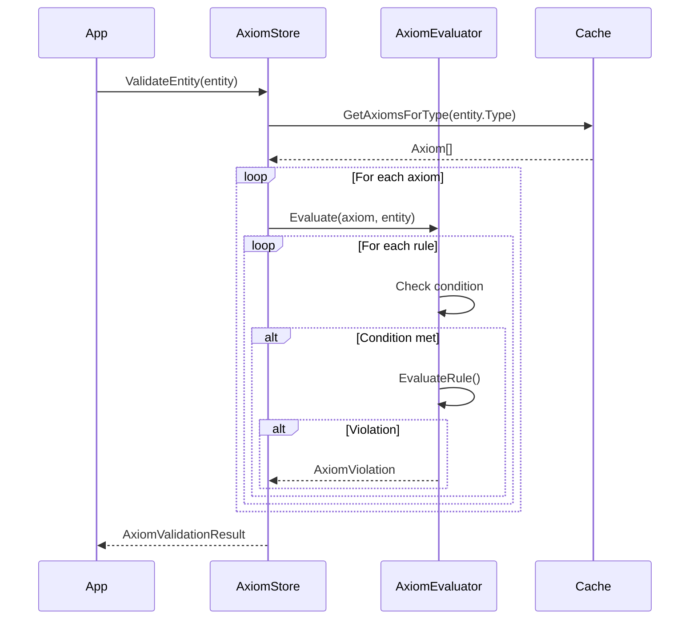

# LCS-DES-046-KG-h: Axiom Query API

## 1. Metadata & Categorization

| Field | Value |
| :--- | :--- |
| **Document ID** | LCS-DES-046-KG-h |
| **Feature ID** | KG-046h |
| **Feature Name** | Axiom Query API |
| **Target Version** | v0.4.6h |
| **Module Scope** | `Lexichord.Modules.Knowledge` |
| **Swimlane** | Memory |
| **License Tier** | WriterPro (read), Teams (full) |
| **Feature Gate Key** | `knowledge.axioms.enabled` |
| **Status** | Draft |
| **Last Updated** | 2026-01-31 |

---

## 2. Executive Summary

### 2.1 The Requirement

The Validation Engine (v0.6.5) and other consumers need a high-level API for querying applicable axioms and validating entities/relationships against them. This API should abstract the underlying repository and provide efficient, cached access.

### 2.2 The Proposed Solution

Implement `IAxiomStore` as the primary public interface for axiom consumers:

- **Type-Based Queries**: Get axioms for specific entity/relationship types.
- **Entity Validation**: Validate entities against all applicable axioms.
- **Relationship Validation**: Validate relationships against applicable axioms.
- **Caching Layer**: Efficient in-memory access with background refresh.
- **Event Publishing**: Notify consumers when axioms change.

---

## 3. Architecture & Modular Strategy

### 3.1 Dependencies

**Upstream Modules:**
- v0.4.6e: `Axiom`, `AxiomValidationResult` — Data model
- v0.4.6f: `IAxiomRepository` — Persistence
- v0.4.6g: `IAxiomLoader` — File loading
- v0.4.5-KG: `KnowledgeEntity`, `KnowledgeRelationship` — Validation targets
- v0.4.5f: `ISchemaRegistry` — Type metadata

**NuGet Packages:**
- `MediatR` — Event publishing

### 3.2 Module Placement

```
Lexichord.Modules.Knowledge/
├── Axioms/
│   ├── IAxiomStore.cs
│   ├── AxiomStore.cs
│   ├── AxiomEvaluator.cs
│   └── Events/
│       ├── AxiomsLoadedEvent.cs
│       └── AxiomValidationCompletedEvent.cs
```

### 3.3 Licensing Behavior

- **Load Behavior:** [x] Conditional
- **WriterPro**: Read axioms, basic validation
- **Teams+**: Full validation with all constraint types

---

## 4. Data Contract (The API)

### 4.1 Axiom Store Interface

```csharp
namespace Lexichord.Modules.Knowledge.Axioms;

/// <summary>
/// High-level API for querying and validating against axioms.
/// This is the primary interface consumed by the Validation Engine.
/// </summary>
public interface IAxiomStore
{
    /// <summary>
    /// Gets all axioms applicable to an entity type.
    /// Results are cached for performance.
    /// </summary>
    /// <param name="entityType">Entity type name.</param>
    /// <returns>Applicable axioms.</returns>
    IReadOnlyList<Axiom> GetAxiomsForType(string entityType);

    /// <summary>
    /// Gets all axioms applicable to a relationship type.
    /// </summary>
    /// <param name="relationshipType">Relationship type name.</param>
    /// <returns>Applicable axioms.</returns>
    IReadOnlyList<Axiom> GetAxiomsForRelationship(string relationshipType);

    /// <summary>
    /// Gets all axioms applicable to claims.
    /// </summary>
    /// <returns>Claim-targeting axioms.</returns>
    IReadOnlyList<Axiom> GetAxiomsForClaims();

    /// <summary>
    /// Gets an axiom by ID.
    /// </summary>
    /// <param name="axiomId">Axiom identifier.</param>
    /// <returns>Axiom if found.</returns>
    Axiom? GetAxiom(string axiomId);

    /// <summary>
    /// Gets all loaded axioms.
    /// </summary>
    /// <returns>All axioms.</returns>
    IReadOnlyList<Axiom> GetAllAxioms();

    /// <summary>
    /// Validates an entity against all applicable axioms.
    /// </summary>
    /// <param name="entity">Entity to validate.</param>
    /// <returns>Validation result with any violations.</returns>
    AxiomValidationResult ValidateEntity(KnowledgeEntity entity);

    /// <summary>
    /// Validates a relationship against applicable axioms.
    /// </summary>
    /// <param name="relationship">Relationship to validate.</param>
    /// <param name="fromEntity">Source entity.</param>
    /// <param name="toEntity">Target entity.</param>
    /// <returns>Validation result with any violations.</returns>
    AxiomValidationResult ValidateRelationship(
        KnowledgeRelationship relationship,
        KnowledgeEntity fromEntity,
        KnowledgeEntity toEntity);

    /// <summary>
    /// Validates multiple entities in batch.
    /// </summary>
    /// <param name="entities">Entities to validate.</param>
    /// <returns>Combined validation result.</returns>
    AxiomValidationResult ValidateEntities(IEnumerable<KnowledgeEntity> entities);

    /// <summary>
    /// Loads or reloads all axioms.
    /// </summary>
    /// <param name="ct">Cancellation token.</param>
    Task LoadAxiomsAsync(CancellationToken ct = default);

    /// <summary>
    /// Loads axioms from a specific directory.
    /// </summary>
    /// <param name="axiomDirectory">Directory path.</param>
    /// <param name="ct">Cancellation token.</param>
    Task LoadAxiomsAsync(string axiomDirectory, CancellationToken ct = default);

    /// <summary>
    /// Gets statistics about loaded axioms.
    /// </summary>
    AxiomStoreStatistics Statistics { get; }

    /// <summary>
    /// Event raised when axioms are loaded or reloaded.
    /// </summary>
    event EventHandler<AxiomsLoadedEventArgs>? AxiomsLoaded;
}

/// <summary>
/// Statistics about the axiom store.
/// </summary>
public record AxiomStoreStatistics
{
    /// <summary>Total axiom count.</summary>
    public int TotalAxioms { get; init; }

    /// <summary>Enabled axiom count.</summary>
    public int EnabledAxioms { get; init; }

    /// <summary>Entity type count with axioms.</summary>
    public int TypesWithAxioms { get; init; }

    /// <summary>Last load timestamp.</summary>
    public DateTimeOffset? LastLoadedAt { get; init; }

    /// <summary>Last load duration.</summary>
    public TimeSpan? LastLoadDuration { get; init; }

    /// <summary>Source files loaded.</summary>
    public int SourceFilesLoaded { get; init; }
}

/// <summary>
/// Event args for axioms loaded event.
/// </summary>
public record AxiomsLoadedEventArgs
{
    /// <summary>Number of axioms loaded.</summary>
    public int AxiomCount { get; init; }

    /// <summary>Load result.</summary>
    public required AxiomLoadResult LoadResult { get; init; }

    /// <summary>Whether this was a reload (vs initial load).</summary>
    public bool IsReload { get; init; }
}
```

### 4.2 Axiom Evaluator Interface

```csharp
namespace Lexichord.Modules.Knowledge.Axioms;

/// <summary>
/// Evaluates axiom rules against entities and relationships.
/// </summary>
public interface IAxiomEvaluator
{
    /// <summary>
    /// Evaluates an axiom against an entity.
    /// </summary>
    /// <param name="axiom">Axiom to evaluate.</param>
    /// <param name="entity">Entity to validate.</param>
    /// <returns>List of violations (empty if valid).</returns>
    IReadOnlyList<AxiomViolation> Evaluate(Axiom axiom, KnowledgeEntity entity);

    /// <summary>
    /// Evaluates an axiom against a relationship.
    /// </summary>
    /// <param name="axiom">Axiom to evaluate.</param>
    /// <param name="relationship">Relationship to validate.</param>
    /// <param name="fromEntity">Source entity.</param>
    /// <param name="toEntity">Target entity.</param>
    /// <returns>List of violations (empty if valid).</returns>
    IReadOnlyList<AxiomViolation> Evaluate(
        Axiom axiom,
        KnowledgeRelationship relationship,
        KnowledgeEntity fromEntity,
        KnowledgeEntity toEntity);

    /// <summary>
    /// Evaluates a single rule against property values.
    /// </summary>
    /// <param name="rule">Rule to evaluate.</param>
    /// <param name="properties">Property values.</param>
    /// <returns>Violation if rule failed, null otherwise.</returns>
    AxiomViolation? EvaluateRule(
        AxiomRule rule,
        IReadOnlyDictionary<string, object?> properties);
}
```

---

## 5. Implementation Logic

### 5.1 AxiomStore

```csharp
namespace Lexichord.Modules.Knowledge.Axioms;

/// <summary>
/// Primary axiom store implementation.
/// </summary>
public sealed class AxiomStore : IAxiomStore
{
    private readonly IAxiomRepository _repository;
    private readonly IAxiomLoader _loader;
    private readonly IAxiomEvaluator _evaluator;
    private readonly ILicenseContext _licenseContext;
    private readonly IMediator _mediator;
    private readonly ILogger<AxiomStore> _logger;

    private IReadOnlyList<Axiom> _cachedAxioms = Array.Empty<Axiom>();
    private IReadOnlyDictionary<string, IReadOnlyList<Axiom>> _byEntityType =
        new Dictionary<string, IReadOnlyList<Axiom>>();
    private IReadOnlyDictionary<string, IReadOnlyList<Axiom>> _byRelationshipType =
        new Dictionary<string, IReadOnlyList<Axiom>>();
    private IReadOnlyDictionary<string, Axiom> _byId =
        new Dictionary<string, Axiom>();

    private readonly SemaphoreSlim _loadLock = new(1, 1);
    private AxiomStoreStatistics _statistics = new();

    public event EventHandler<AxiomsLoadedEventArgs>? AxiomsLoaded;

    public AxiomStore(
        IAxiomRepository repository,
        IAxiomLoader loader,
        IAxiomEvaluator evaluator,
        ILicenseContext licenseContext,
        IMediator mediator,
        ILogger<AxiomStore> logger)
    {
        _repository = repository;
        _loader = loader;
        _evaluator = evaluator;
        _licenseContext = licenseContext;
        _mediator = mediator;
        _logger = logger;

        // Subscribe to loader events
        _loader.AxiomsReloaded += OnAxiomsReloaded;
    }

    public AxiomStoreStatistics Statistics => _statistics;

    public IReadOnlyList<Axiom> GetAxiomsForType(string entityType)
    {
        EnsureLoaded();

        return _byEntityType.TryGetValue(entityType, out var axioms)
            ? axioms
            : Array.Empty<Axiom>();
    }

    public IReadOnlyList<Axiom> GetAxiomsForRelationship(string relationshipType)
    {
        EnsureLoaded();

        return _byRelationshipType.TryGetValue(relationshipType, out var axioms)
            ? axioms
            : Array.Empty<Axiom>();
    }

    public IReadOnlyList<Axiom> GetAxiomsForClaims()
    {
        EnsureLoaded();

        return _cachedAxioms
            .Where(a => a.TargetKind == AxiomTargetKind.Claim && a.IsEnabled)
            .ToList();
    }

    public Axiom? GetAxiom(string axiomId)
    {
        EnsureLoaded();

        return _byId.TryGetValue(axiomId, out var axiom) ? axiom : null;
    }

    public IReadOnlyList<Axiom> GetAllAxioms()
    {
        EnsureLoaded();
        return _cachedAxioms;
    }

    public AxiomValidationResult ValidateEntity(KnowledgeEntity entity)
    {
        var stopwatch = Stopwatch.StartNew();
        var violations = new List<AxiomViolation>();
        var axioms = GetAxiomsForType(entity.Type);

        foreach (var axiom in axioms.Where(a => a.IsEnabled))
        {
            var axiomViolations = _evaluator.Evaluate(axiom, entity);
            violations.AddRange(axiomViolations);
        }

        stopwatch.Stop();

        var result = new AxiomValidationResult
        {
            Violations = violations,
            AxiomsEvaluated = axioms.Count,
            RulesEvaluated = axioms.Sum(a => a.Rules.Count),
            Duration = stopwatch.Elapsed
        };

        if (violations.Any())
        {
            _logger.LogDebug(
                "Entity {EntityId} ({Type}) has {Count} axiom violations",
                entity.Id, entity.Type, violations.Count);
        }

        return result;
    }

    public AxiomValidationResult ValidateRelationship(
        KnowledgeRelationship relationship,
        KnowledgeEntity fromEntity,
        KnowledgeEntity toEntity)
    {
        var stopwatch = Stopwatch.StartNew();
        var violations = new List<AxiomViolation>();
        var axioms = GetAxiomsForRelationship(relationship.Type);

        foreach (var axiom in axioms.Where(a => a.IsEnabled))
        {
            var axiomViolations = _evaluator.Evaluate(axiom, relationship, fromEntity, toEntity);
            violations.AddRange(axiomViolations);
        }

        stopwatch.Stop();

        return new AxiomValidationResult
        {
            Violations = violations,
            AxiomsEvaluated = axioms.Count,
            RulesEvaluated = axioms.Sum(a => a.Rules.Count),
            Duration = stopwatch.Elapsed
        };
    }

    public AxiomValidationResult ValidateEntities(IEnumerable<KnowledgeEntity> entities)
    {
        var stopwatch = Stopwatch.StartNew();
        var allViolations = new List<AxiomViolation>();
        var totalAxioms = 0;
        var totalRules = 0;

        foreach (var entity in entities)
        {
            var result = ValidateEntity(entity);
            allViolations.AddRange(result.Violations);
            totalAxioms += result.AxiomsEvaluated;
            totalRules += result.RulesEvaluated;
        }

        stopwatch.Stop();

        return new AxiomValidationResult
        {
            Violations = allViolations,
            AxiomsEvaluated = totalAxioms,
            RulesEvaluated = totalRules,
            Duration = stopwatch.Elapsed
        };
    }

    public async Task LoadAxiomsAsync(CancellationToken ct = default)
    {
        await _loadLock.WaitAsync(ct);
        try
        {
            var stopwatch = Stopwatch.StartNew();
            var isReload = _cachedAxioms.Any();

            var loadResult = await _loader.LoadAllAsync(ct);

            RebuildCache(loadResult.Axioms);

            stopwatch.Stop();

            _statistics = new AxiomStoreStatistics
            {
                TotalAxioms = _cachedAxioms.Count,
                EnabledAxioms = _cachedAxioms.Count(a => a.IsEnabled),
                TypesWithAxioms = _byEntityType.Count,
                LastLoadedAt = DateTimeOffset.UtcNow,
                LastLoadDuration = stopwatch.Elapsed,
                SourceFilesLoaded = loadResult.FilesProcessed.Count
            };

            _logger.LogInformation(
                "Loaded {Count} axioms for {Types} entity types in {Duration}ms",
                _cachedAxioms.Count, _byEntityType.Count, stopwatch.ElapsedMilliseconds);

            var eventArgs = new AxiomsLoadedEventArgs
            {
                AxiomCount = _cachedAxioms.Count,
                LoadResult = loadResult,
                IsReload = isReload
            };

            AxiomsLoaded?.Invoke(this, eventArgs);

            await _mediator.Publish(new AxiomsLoadedEvent(eventArgs), ct);
        }
        finally
        {
            _loadLock.Release();
        }
    }

    public async Task LoadAxiomsAsync(string axiomDirectory, CancellationToken ct = default)
    {
        await _loadLock.WaitAsync(ct);
        try
        {
            var loadResult = await _loader.LoadWorkspaceAsync(axiomDirectory, ct);

            // Merge with existing axioms
            var existingBuiltIn = _cachedAxioms
                .Where(a => a.SourceFile?.StartsWith("builtin:") == true);
            var allAxioms = existingBuiltIn.Concat(loadResult.Axioms).ToList();

            RebuildCache(allAxioms);

            _logger.LogInformation(
                "Loaded {Count} workspace axioms from {Dir}",
                loadResult.Axioms.Count, axiomDirectory);
        }
        finally
        {
            _loadLock.Release();
        }
    }

    private void EnsureLoaded()
    {
        if (!_cachedAxioms.Any())
        {
            // Synchronously load - this should have been done at startup
            _loadLock.Wait();
            try
            {
                if (!_cachedAxioms.Any())
                {
                    var axioms = _repository.GetAllAsync().GetAwaiter().GetResult();
                    RebuildCache(axioms);
                }
            }
            finally
            {
                _loadLock.Release();
            }
        }
    }

    private void RebuildCache(IReadOnlyList<Axiom> axioms)
    {
        _cachedAxioms = axioms;

        _byId = axioms.ToDictionary(a => a.Id);

        _byEntityType = axioms
            .Where(a => a.TargetKind == AxiomTargetKind.Entity)
            .GroupBy(a => a.TargetType)
            .ToDictionary(g => g.Key, g => (IReadOnlyList<Axiom>)g.ToList());

        _byRelationshipType = axioms
            .Where(a => a.TargetKind == AxiomTargetKind.Relationship)
            .GroupBy(a => a.TargetType)
            .ToDictionary(g => g.Key, g => (IReadOnlyList<Axiom>)g.ToList());
    }

    private async void OnAxiomsReloaded(object? sender, AxiomLoadResult result)
    {
        _logger.LogInformation("Axioms reloaded: {Count} axioms", result.Axioms.Count);

        await _loadLock.WaitAsync();
        try
        {
            // Refresh from repository which should have updated data
            var allAxioms = await _repository.GetAllAsync();
            RebuildCache(allAxioms);
        }
        finally
        {
            _loadLock.Release();
        }

        AxiomsLoaded?.Invoke(this, new AxiomsLoadedEventArgs
        {
            AxiomCount = _cachedAxioms.Count,
            LoadResult = result,
            IsReload = true
        });
    }
}
```

### 5.2 Axiom Evaluator

```csharp
namespace Lexichord.Modules.Knowledge.Axioms;

/// <summary>
/// Evaluates axiom rules against entities.
/// </summary>
public sealed class AxiomEvaluator : IAxiomEvaluator
{
    private readonly ILogger<AxiomEvaluator> _logger;

    public AxiomEvaluator(ILogger<AxiomEvaluator> logger)
    {
        _logger = logger;
    }

    public IReadOnlyList<AxiomViolation> Evaluate(Axiom axiom, KnowledgeEntity entity)
    {
        var violations = new List<AxiomViolation>();

        // Build property dictionary including standard fields
        var properties = new Dictionary<string, object?>(entity.Properties)
        {
            ["id"] = entity.Id,
            ["name"] = entity.Name,
            ["type"] = entity.Type
        };

        foreach (var rule in axiom.Rules)
        {
            // Check condition first
            if (rule.When != null && !EvaluateCondition(rule.When, properties))
            {
                continue; // Skip rule if condition not met
            }

            var violation = EvaluateRule(rule, properties);
            if (violation != null)
            {
                violations.Add(violation with
                {
                    Axiom = axiom,
                    ViolatedRule = rule,
                    EntityId = entity.Id,
                    Severity = axiom.Severity
                });
            }
        }

        return violations;
    }

    public IReadOnlyList<AxiomViolation> Evaluate(
        Axiom axiom,
        KnowledgeRelationship relationship,
        KnowledgeEntity fromEntity,
        KnowledgeEntity toEntity)
    {
        var violations = new List<AxiomViolation>();

        var properties = new Dictionary<string, object?>(relationship.Properties)
        {
            ["id"] = relationship.Id,
            ["type"] = relationship.Type,
            ["from_entity_id"] = fromEntity.Id,
            ["from_entity_type"] = fromEntity.Type,
            ["from_entity_name"] = fromEntity.Name,
            ["to_entity_id"] = toEntity.Id,
            ["to_entity_type"] = toEntity.Type,
            ["to_entity_name"] = toEntity.Name
        };

        foreach (var rule in axiom.Rules)
        {
            if (rule.When != null && !EvaluateCondition(rule.When, properties))
            {
                continue;
            }

            var violation = EvaluateRule(rule, properties);
            if (violation != null)
            {
                violations.Add(violation with
                {
                    Axiom = axiom,
                    ViolatedRule = rule,
                    RelationshipId = relationship.Id,
                    Severity = axiom.Severity
                });
            }
        }

        return violations;
    }

    public AxiomViolation? EvaluateRule(
        AxiomRule rule,
        IReadOnlyDictionary<string, object?> properties)
    {
        try
        {
            return rule.Constraint switch
            {
                AxiomConstraintType.Required => EvaluateRequired(rule, properties),
                AxiomConstraintType.OneOf => EvaluateOneOf(rule, properties),
                AxiomConstraintType.NotOneOf => EvaluateNotOneOf(rule, properties),
                AxiomConstraintType.Range => EvaluateRange(rule, properties),
                AxiomConstraintType.Pattern => EvaluatePattern(rule, properties),
                AxiomConstraintType.Cardinality => EvaluateCardinality(rule, properties),
                AxiomConstraintType.NotBoth => EvaluateNotBoth(rule, properties),
                AxiomConstraintType.RequiresTogether => EvaluateRequiresTogether(rule, properties),
                AxiomConstraintType.Equals => EvaluateEquals(rule, properties),
                AxiomConstraintType.NotEquals => EvaluateNotEquals(rule, properties),
                _ => null // Unknown constraints pass
            };
        }
        catch (Exception ex)
        {
            _logger.LogWarning(ex, "Error evaluating rule {Constraint}", rule.Constraint);
            return null;
        }
    }

    private AxiomViolation? EvaluateRequired(
        AxiomRule rule,
        IReadOnlyDictionary<string, object?> properties)
    {
        var property = rule.Property!;
        var hasValue = properties.TryGetValue(property, out var value) &&
                       value != null &&
                       (value is not string s || !string.IsNullOrWhiteSpace(s));

        if (!hasValue)
        {
            return CreateViolation(rule, property, null, "non-null value",
                rule.ErrorMessage ?? $"Property '{property}' is required");
        }

        return null;
    }

    private AxiomViolation? EvaluateOneOf(
        AxiomRule rule,
        IReadOnlyDictionary<string, object?> properties)
    {
        if (rule.Values == null || !rule.Values.Any()) return null;

        var property = rule.Property!;
        if (!properties.TryGetValue(property, out var value) || value == null)
        {
            return null; // Let Required handle missing values
        }

        var stringValue = value.ToString();
        var validValues = rule.Values.Select(v => v?.ToString()).ToList();

        if (!validValues.Contains(stringValue, StringComparer.OrdinalIgnoreCase))
        {
            return CreateViolation(rule, property, value, validValues,
                rule.ErrorMessage ?? $"'{property}' must be one of: {string.Join(", ", validValues)}");
        }

        return null;
    }

    private AxiomViolation? EvaluateNotOneOf(
        AxiomRule rule,
        IReadOnlyDictionary<string, object?> properties)
    {
        if (rule.Values == null || !rule.Values.Any()) return null;

        var property = rule.Property!;
        if (!properties.TryGetValue(property, out var value) || value == null)
        {
            return null;
        }

        var stringValue = value.ToString();
        var invalidValues = rule.Values.Select(v => v?.ToString()).ToList();

        if (invalidValues.Contains(stringValue, StringComparer.OrdinalIgnoreCase))
        {
            return CreateViolation(rule, property, value, $"not one of: {string.Join(", ", invalidValues)}",
                rule.ErrorMessage ?? $"'{property}' must not be: {stringValue}");
        }

        return null;
    }

    private AxiomViolation? EvaluateRange(
        AxiomRule rule,
        IReadOnlyDictionary<string, object?> properties)
    {
        var property = rule.Property!;
        if (!properties.TryGetValue(property, out var value) || value == null)
        {
            return null;
        }

        if (!double.TryParse(value.ToString(), out var numValue))
        {
            return null;
        }

        if (rule.Min != null && double.TryParse(rule.Min.ToString(), out var min) && numValue < min)
        {
            return CreateViolation(rule, property, value, $">= {min}",
                rule.ErrorMessage ?? $"'{property}' must be >= {min}");
        }

        if (rule.Max != null && double.TryParse(rule.Max.ToString(), out var max) && numValue > max)
        {
            return CreateViolation(rule, property, value, $"<= {max}",
                rule.ErrorMessage ?? $"'{property}' must be <= {max}");
        }

        return null;
    }

    private AxiomViolation? EvaluatePattern(
        AxiomRule rule,
        IReadOnlyDictionary<string, object?> properties)
    {
        if (string.IsNullOrEmpty(rule.Pattern)) return null;

        var property = rule.Property!;
        if (!properties.TryGetValue(property, out var value) || value == null)
        {
            return null;
        }

        var stringValue = value.ToString() ?? "";
        var regex = new Regex(rule.Pattern, RegexOptions.None, TimeSpan.FromSeconds(1));

        if (!regex.IsMatch(stringValue))
        {
            return CreateViolation(rule, property, value, $"match pattern: {rule.Pattern}",
                rule.ErrorMessage ?? $"'{property}' must match pattern: {rule.Pattern}");
        }

        return null;
    }

    private AxiomViolation? EvaluateCardinality(
        AxiomRule rule,
        IReadOnlyDictionary<string, object?> properties)
    {
        var property = rule.Property!;
        if (!properties.TryGetValue(property, out var value) || value == null)
        {
            if (rule.MinCount > 0)
            {
                return CreateViolation(rule, property, 0, $">= {rule.MinCount} items",
                    rule.ErrorMessage ?? $"'{property}' must have at least {rule.MinCount} items");
            }
            return null;
        }

        var count = value switch
        {
            ICollection c => c.Count,
            IEnumerable e => e.Cast<object>().Count(),
            string s => 1,
            _ => 1
        };

        if (rule.MinCount.HasValue && count < rule.MinCount.Value)
        {
            return CreateViolation(rule, property, count, $">= {rule.MinCount}",
                rule.ErrorMessage ?? $"'{property}' must have at least {rule.MinCount} items");
        }

        if (rule.MaxCount.HasValue && count > rule.MaxCount.Value)
        {
            return CreateViolation(rule, property, count, $"<= {rule.MaxCount}",
                rule.ErrorMessage ?? $"'{property}' must have at most {rule.MaxCount} items");
        }

        return null;
    }

    private AxiomViolation? EvaluateNotBoth(
        AxiomRule rule,
        IReadOnlyDictionary<string, object?> properties)
    {
        if (rule.Properties == null || rule.Properties.Count < 2) return null;

        var hasValues = rule.Properties
            .Select(p => properties.TryGetValue(p, out var v) && v != null)
            .ToList();

        if (hasValues.Count(h => h) > 1)
        {
            return CreateViolation(rule, string.Join(", ", rule.Properties), "both present", "only one",
                rule.ErrorMessage ?? $"Cannot have both: {string.Join(" and ", rule.Properties)}");
        }

        return null;
    }

    private AxiomViolation? EvaluateRequiresTogether(
        AxiomRule rule,
        IReadOnlyDictionary<string, object?> properties)
    {
        if (rule.Properties == null || rule.Properties.Count < 2) return null;

        var hasValues = rule.Properties
            .Select(p => properties.TryGetValue(p, out var v) && v != null)
            .ToList();

        var anyPresent = hasValues.Any(h => h);
        var allPresent = hasValues.All(h => h);

        if (anyPresent && !allPresent)
        {
            var missing = rule.Properties.Where((p, i) => !hasValues[i]);
            return CreateViolation(rule, string.Join(", ", missing), "missing", "required",
                rule.ErrorMessage ?? $"If one is present, all must be: {string.Join(", ", rule.Properties)}");
        }

        return null;
    }

    private AxiomViolation? EvaluateEquals(
        AxiomRule rule,
        IReadOnlyDictionary<string, object?> properties)
    {
        if (rule.Values == null || !rule.Values.Any()) return null;

        var property = rule.Property!;
        if (!properties.TryGetValue(property, out var value))
        {
            return null;
        }

        var expected = rule.Values.First()?.ToString();
        var actual = value?.ToString();

        if (!string.Equals(actual, expected, StringComparison.OrdinalIgnoreCase))
        {
            return CreateViolation(rule, property, actual, expected,
                rule.ErrorMessage ?? $"'{property}' must equal '{expected}'");
        }

        return null;
    }

    private AxiomViolation? EvaluateNotEquals(
        AxiomRule rule,
        IReadOnlyDictionary<string, object?> properties)
    {
        if (rule.Values == null || !rule.Values.Any()) return null;

        var property = rule.Property!;
        if (!properties.TryGetValue(property, out var value))
        {
            return null;
        }

        var forbidden = rule.Values.First()?.ToString();
        var actual = value?.ToString();

        if (string.Equals(actual, forbidden, StringComparison.OrdinalIgnoreCase))
        {
            return CreateViolation(rule, property, actual, $"not '{forbidden}'",
                rule.ErrorMessage ?? $"'{property}' must not equal '{forbidden}'");
        }

        return null;
    }

    private bool EvaluateCondition(
        AxiomCondition condition,
        IReadOnlyDictionary<string, object?> properties)
    {
        if (!properties.TryGetValue(condition.Property, out var actual))
        {
            return condition.Operator == ConditionOperator.IsNull;
        }

        var expected = condition.Value;

        return condition.Operator switch
        {
            ConditionOperator.Equals => Equals(actual?.ToString(), expected?.ToString()),
            ConditionOperator.NotEquals => !Equals(actual?.ToString(), expected?.ToString()),
            ConditionOperator.Contains => actual?.ToString()?.Contains(expected?.ToString() ?? "") == true,
            ConditionOperator.StartsWith => actual?.ToString()?.StartsWith(expected?.ToString() ?? "") == true,
            ConditionOperator.EndsWith => actual?.ToString()?.EndsWith(expected?.ToString() ?? "") == true,
            ConditionOperator.IsNull => actual == null,
            ConditionOperator.IsNotNull => actual != null,
            ConditionOperator.GreaterThan => CompareNumeric(actual, expected) > 0,
            ConditionOperator.LessThan => CompareNumeric(actual, expected) < 0,
            _ => true
        };
    }

    private static int CompareNumeric(object? a, object? b)
    {
        if (double.TryParse(a?.ToString(), out var da) &&
            double.TryParse(b?.ToString(), out var db))
        {
            return da.CompareTo(db);
        }
        return 0;
    }

    private static AxiomViolation CreateViolation(
        AxiomRule rule,
        string property,
        object? actual,
        object? expected,
        string message)
    {
        return new AxiomViolation
        {
            Axiom = null!, // Will be set by caller
            ViolatedRule = rule,
            PropertyName = property,
            ActualValue = actual,
            ExpectedValue = expected,
            Message = message
        };
    }
}
```

---

## 6. Flow Diagrams

### 6.1 Entity Validation Flow



---

## 7. Unit Testing Requirements

```csharp
[Trait("Category", "Unit")]
[Trait("Feature", "v0.4.6h")]
public class AxiomStoreTests
{
    [Fact]
    public void ValidateEntity_WithNoViolations_ReturnsValid()
    {
        // Arrange
        var store = CreateStoreWithAxioms(CreateEndpointAxioms());
        var entity = CreateValidEndpoint();

        // Act
        var result = store.ValidateEntity(entity);

        // Assert
        result.IsValid.Should().BeTrue();
    }

    [Fact]
    public void ValidateEntity_MissingRequiredProperty_ReturnsViolation()
    {
        // Arrange
        var store = CreateStoreWithAxioms(CreateEndpointAxioms());
        var entity = CreateEndpointWithoutMethod();

        // Act
        var result = store.ValidateEntity(entity);

        // Assert
        result.IsValid.Should().BeFalse();
        result.Violations.Should().ContainSingle(v =>
            v.ViolatedRule.Constraint == AxiomConstraintType.Required);
    }
}

[Trait("Category", "Unit")]
[Trait("Feature", "v0.4.6h")]
public class AxiomEvaluatorTests
{
    [Theory]
    [InlineData(null, false)]
    [InlineData("", false)]
    [InlineData("  ", false)]
    [InlineData("value", true)]
    public void EvaluateRequired_VariousInputs_ReturnsCorrectResult(
        string? value, bool shouldPass)
    {
        // Arrange
        var evaluator = new AxiomEvaluator(NullLogger<AxiomEvaluator>.Instance);
        var rule = new AxiomRule { Property = "test", Constraint = AxiomConstraintType.Required };
        var props = new Dictionary<string, object?> { ["test"] = value };

        // Act
        var violation = evaluator.EvaluateRule(rule, props);

        // Assert
        if (shouldPass)
            violation.Should().BeNull();
        else
            violation.Should().NotBeNull();
    }

    [Fact]
    public void EvaluateOneOf_WithValidValue_ReturnsNull()
    {
        // Arrange
        var evaluator = new AxiomEvaluator(NullLogger<AxiomEvaluator>.Instance);
        var rule = new AxiomRule
        {
            Property = "method",
            Constraint = AxiomConstraintType.OneOf,
            Values = new object[] { "GET", "POST", "PUT" }
        };
        var props = new Dictionary<string, object?> { ["method"] = "GET" };

        // Act
        var violation = evaluator.EvaluateRule(rule, props);

        // Assert
        violation.Should().BeNull();
    }

    [Fact]
    public void EvaluateRange_ValueTooLow_ReturnsViolation()
    {
        // Arrange
        var evaluator = new AxiomEvaluator(NullLogger<AxiomEvaluator>.Instance);
        var rule = new AxiomRule
        {
            Property = "status_code",
            Constraint = AxiomConstraintType.Range,
            Min = 100,
            Max = 599
        };
        var props = new Dictionary<string, object?> { ["status_code"] = 50 };

        // Act
        var violation = evaluator.EvaluateRule(rule, props);

        // Assert
        violation.Should().NotBeNull();
        violation!.Message.Should().Contain(">= 100");
    }
}
```

---

## 8. Acceptance Criteria (QA)

| # | Criterion |
| :- | :-------- |
| 1 | `GetAxiomsForType` returns only axioms for the specified type. |
| 2 | `ValidateEntity` evaluates all applicable axioms. |
| 3 | Conditional rules only evaluated when condition is met. |
| 4 | All constraint types evaluate correctly. |
| 5 | Cache is used for repeated queries. |
| 6 | `AxiomsLoaded` event fires on load/reload. |
| 7 | Statistics accurately reflect loaded axioms. |
| 8 | Batch validation aggregates results correctly. |

---

## 9. Deliverable Checklist

| # | Deliverable | Status |
| :- | :---------- | :----- |
| 1 | `IAxiomStore` interface | [ ] |
| 2 | `AxiomStore` implementation | [ ] |
| 3 | `IAxiomEvaluator` interface | [ ] |
| 4 | `AxiomEvaluator` implementation | [ ] |
| 5 | `AxiomStoreStatistics` record | [ ] |
| 6 | `AxiomsLoadedEvent` | [ ] |
| 7 | Unit tests for all constraint types | [ ] |

---

## 10. Changelog Entry

```markdown
### Added (v0.4.6h)

- `IAxiomStore` high-level API for axiom queries and validation
- `AxiomStore` with caching and event publishing
- `IAxiomEvaluator` for rule evaluation
- `AxiomEvaluator` supporting all 14 constraint types
- `AxiomStoreStatistics` for monitoring
- `AxiomsLoadedEvent` for cache invalidation
```

---
