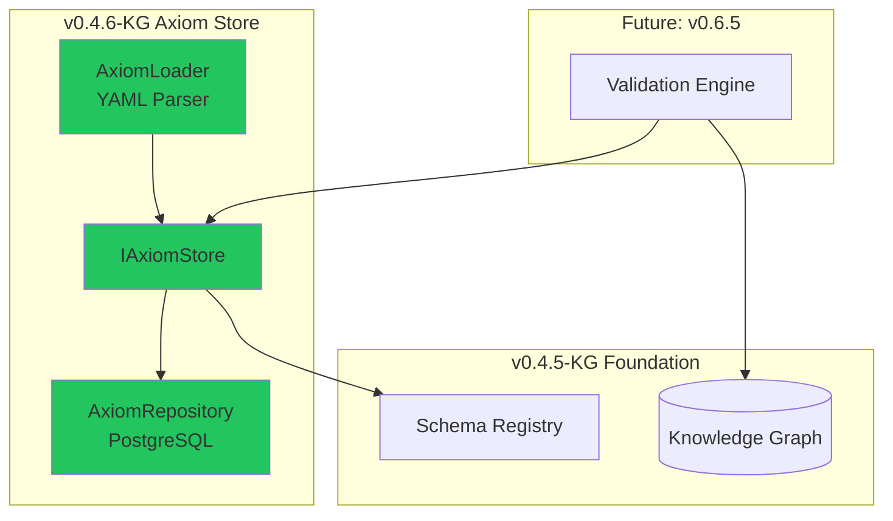

# LCS-SBD-046-KG: Scope Overview — Axiom Store

## Document Control

| Field            | Value                                                    |
| :--------------- | :------------------------------------------------------- |
| **Document ID**  | LCS-SBD-046-KG                                           |
| **Version**      | v0.4.6                                                   |
| **Codename**     | Axiom Store (CKVS Phase 1b)                              |
| **Status**       | Draft                                                    |
| **Last Updated** | 2026-01-31                                               |
| **Owner**        | Lead Architect                                           |
| **Depends On**   | v0.4.5-KG (Graph Foundation), v0.4.5f (Schema Registry)  |

---

## 1. Executive Summary

### 1.1 The Vision

**v0.4.6-KG** delivers the **Axiom Store** — the foundational truths layer of CKVS that constrains what can exist in the Knowledge Graph. While the Schema Registry (v0.4.5f) defines *what types of entities can exist*, the Axiom Store defines *what facts are always true* about those entities.

Axioms are immutable domain rules that content must satisfy. For example:
- "All API endpoints must have exactly one HTTP method"
- "A parameter cannot be both required and have a default value"
- "Response status codes must be in the range 100-599"

### 1.2 Business Value

- **Canonical Truth:** Establish non-negotiable facts that validate against document content.
- **Contradiction Detection:** Automatically flag content that violates established rules.
- **Domain Integrity:** Prevent impossible states in the knowledge graph.
- **Foundation for Validation:** Enable the Validation Engine (v0.6.5) to check content.
- **Expert Knowledge Capture:** Codify domain expertise as machine-readable rules.

### 1.3 Success Criteria

1. Axioms stored in dedicated PostgreSQL table with versioning.
2. Axiom YAML format supports logical constraints (equality, range, cardinality).
3. Axiom loading from workspace `.lexichord/knowledge/axioms/` directory.
4. Axiom validation integrated with entity creation.
5. Built-in axioms for technical documentation domain.
6. Axiom query API for validation engine consumption.

---

## 2. Relationship to Existing v0.4.6

The existing v0.4.6 spec (LCS-SBD-046) covers the **Reference Panel** for RAG search results. The Axiom Store is developed in parallel and integrates via:

- **Settings Integration:** Axiom management accessible from Settings dialog.
- **Shared UI Framework:** Uses same panel infrastructure.
- **Independent Module:** Lives in `Lexichord.Modules.Knowledge`, not RAG.

---

## 3. Key Deliverables

### 3.1 Sub-Parts

| Sub-Part | Title | Description | Est. Hours |
|:---------|:------|:------------|:-----------|
| v0.4.6e | Axiom Data Model | `Axiom`, `AxiomRule`, `AxiomViolation` records | 4 |
| v0.4.6f | Axiom Repository | PostgreSQL storage with versioning | 6 |
| v0.4.6g | Axiom Loader | YAML parsing and validation | 5 |
| v0.4.6h | Axiom Query API | `IAxiomStore` interface for validation | 4 |
| **Total** | | | **19 hours** |

### 3.2 Key Interfaces

```csharp
/// <summary>
/// Store for foundational axioms (immutable domain truths).
/// </summary>
public interface IAxiomStore
{
    /// <summary>Gets all axioms for an entity type.</summary>
    IReadOnlyList<Axiom> GetAxiomsForType(string entityType);

    /// <summary>Validates an entity against all applicable axioms.</summary>
    AxiomValidationResult ValidateEntity(KnowledgeEntity entity);

    /// <summary>Validates a relationship against applicable axioms.</summary>
    AxiomValidationResult ValidateRelationship(
        KnowledgeRelationship relationship,
        KnowledgeEntity from,
        KnowledgeEntity to);

    /// <summary>Loads axioms from directory.</summary>
    Task LoadAxiomsAsync(string axiomDirectory, CancellationToken ct = default);
}

/// <summary>
/// A foundational axiom (immutable domain rule).
/// </summary>
public record Axiom
{
    public required string Id { get; init; }
    public required string Name { get; init; }
    public string? Description { get; init; }
    public required string TargetType { get; init; }  // Entity or relationship type
    public required IReadOnlyList<AxiomRule> Rules { get; init; }
    public AxiomSeverity Severity { get; init; } = AxiomSeverity.Error;
}

public enum AxiomSeverity { Error, Warning, Info }
```

### 3.3 Axiom YAML Format

```yaml
# .lexichord/knowledge/axioms/api-docs.yaml
axiom_version: "1.0"
name: "API Documentation Axioms"

axioms:
  - id: "endpoint-must-have-method"
    name: "Endpoint Method Required"
    description: "Every endpoint must specify exactly one HTTP method"
    target_type: Endpoint
    severity: error
    rules:
      - property: method
        constraint: required
      - property: method
        constraint: one_of
        values: [GET, POST, PUT, PATCH, DELETE, HEAD, OPTIONS]

  - id: "parameter-required-no-default"
    name: "Required Parameter Cannot Have Default"
    description: "A required parameter should not have a default value"
    target_type: Parameter
    severity: warning
    rules:
      - constraint: not_both
        properties: [required, default_value]
        when:
          required: true

  - id: "response-status-range"
    name: "Valid HTTP Status Code"
    description: "Response status codes must be valid HTTP codes"
    target_type: Response
    severity: error
    rules:
      - property: status_code
        constraint: range
        min: 100
        max: 599
```

---

## 4. Architecture Integration



---

## 5. Dependencies

| Component | Source | Usage |
|:----------|:-------|:------|
| `ISchemaRegistry` | v0.4.5f | Validate axiom target types exist |
| `IDbConnectionFactory` | v0.0.5b | PostgreSQL access |
| `YamlDotNet` | NuGet | Axiom YAML parsing |

---

## 6. License Gating

| Tier | Axiom Store Access |
|:-----|:-------------------|
| Core | Not available |
| WriterPro | Read-only (view axioms) |
| Teams | Full (load custom axioms) |
| Enterprise | Full + axiom editor UI |

---

## 7. Risks & Mitigations

| Risk | Mitigation |
|:-----|:-----------|
| Axiom complexity overwhelming users | Ship minimal built-in axioms, document well |
| Over-restrictive axioms block valid content | Severity levels (error vs warning) |
| Performance impact of axiom checking | Lazy loading, caching |

---

## 8. What This Enables

- **v0.6.5 Validation Engine:** Axiom-based content validation.
- **v0.6.6 Co-pilot:** Pre-generation axiom awareness.
- **Future:** Custom axiom editor for Enterprise users.

---
