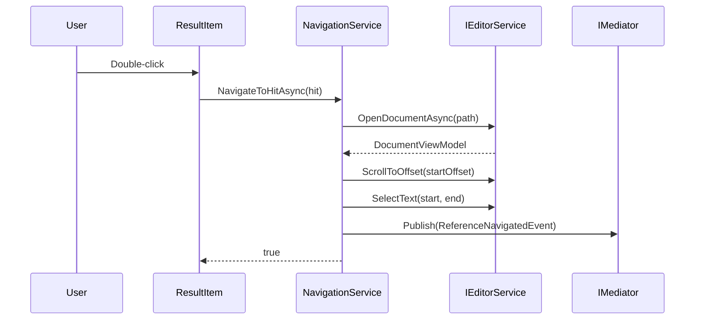
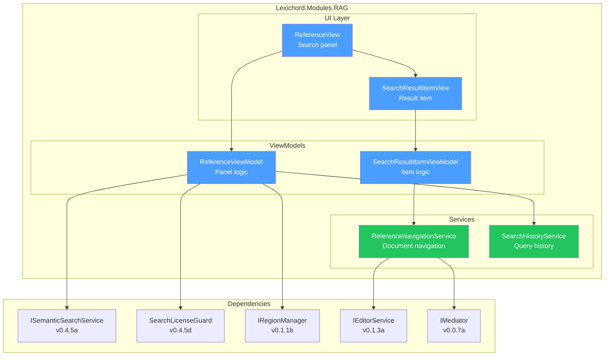
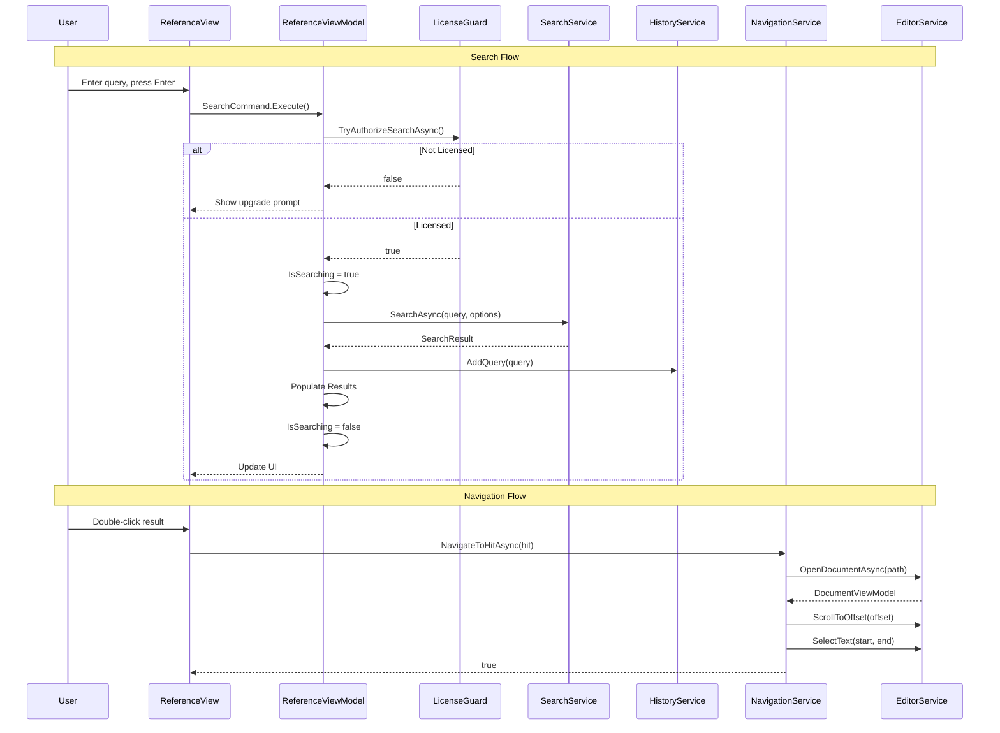

# LCS-SBD-046: Scope Breakdown — The Reference Panel

## Document Control

| Field            | Value                                                               |
| :--------------- | :------------------------------------------------------------------ |
| **Document ID**  | LCS-SBD-046                                                         |
| **Version**      | v0.4.6                                                              |
| **Codename**     | The Reference Panel (Search UI)                                     |
| **Status**       | Draft                                                               |
| **Last Updated** | 2026-01-27                                                          |
| **Owner**        | Lead Architect                                                      |
| **Depends On**   | v0.4.5 (Searcher), v0.1.1b (RegionManager), v0.1.3a (EditorService) |

---

## 1. Executive Summary

### 1.1 The Vision

**v0.4.6** delivers **The Reference Panel** — the user-facing interface for semantic search integrated into the workspace. This release completes the RAG user experience by providing a dedicated panel where writers can query their documents and navigate to relevant content.

With The Reference Panel, writers can type natural language questions like "What did I write about character motivation?" and instantly see ranked results from their indexed documents. Clicking a result opens the source document and highlights the matching text.

### 1.2 Business Value

- **Natural Discovery:** Writers find related content across documents effortlessly.
- **Contextual Results:** See relevance scores and document context.
- **Quick Navigation:** One-click to open source and scroll to location.
- **Query History:** Recent searches saved for quick re-execution.
- **Integrated Experience:** Panel fits seamlessly in workspace layout.
- **Premium Feature:** Differentiates WriterPro tier with visible value.

### 1.3 Success Criteria

This release succeeds when:

1. `ReferenceView` panel registers in the Right shell region.
2. Users can enter queries and see ranked results.
3. Result items display preview, document name, and score.
4. Clicking a result opens the document and highlights text.
5. Recent queries are stored and accessible via dropdown.

### 1.4 License Gating

The Reference Panel is visible to all users, but search functionality requires **Writer Pro**:

- Core/Writer users see disabled search with upgrade prompt
- WriterPro+ users have full functionality
- Panel still shows to encourage upgrades

---

## 2. Dependencies on Prior Versions

| Component                | Source Version | Usage in v0.4.6                |
| :----------------------- | :------------- | :----------------------------- |
| `ISemanticSearchService` | v0.4.5a        | Execute search queries         |
| `SearchOptions`          | v0.4.5a        | Configure search parameters    |
| `SearchResult`           | v0.4.5a        | Process search results         |
| `SearchHit`              | v0.4.5a        | Display individual results     |
| `SearchLicenseGuard`     | v0.4.5d        | Check license before search    |
| `IRegionManager`         | v0.1.1b        | Register panel in Right region |
| `IEditorService`         | v0.1.3a        | Open documents from results    |
| `IMediator`              | v0.0.7a        | Publish navigation events      |
| `IConfiguration`         | v0.0.3d        | App configuration access       |

---

## 3. Sub-Part Specifications

### 3.1 v0.4.6a: Reference Panel View

| Field            | Value                                  |
| :--------------- | :------------------------------------- |
| **Sub-Part ID**  | RAG-046a                               |
| **Title**        | Reference Panel View                   |
| **Module**       | `Lexichord.Modules.RAG`                |
| **License Tier** | Core (visible), WriterPro (functional) |

**Goal:** Create `ReferenceView.axaml` with search input, results list, and loading indicator.

**Key Deliverables:**

- `ReferenceView.axaml` UserControl
- `ReferenceViewModel` with search command
- Search TextBox with placeholder text
- Virtualized results ItemsControl
- Loading spinner during search
- Empty state message
- Registration in `ShellRegion.Right`

**Key UI Components:**

```text
┌─────────────────────────────────────────────┐
│  🔍 Reference                          [⟳]  │ ← Header with refresh
├─────────────────────────────────────────────┤
│  ┌─────────────────────────────────────┐    │
│  │ Ask your documents...          [▼]  │    │ ← Search input + history
│  └─────────────────────────────────────┘    │
├─────────────────────────────────────────────┤
│                                             │
│  ┌─────────────────────────────────────┐    │
│  │ 📄 chapter-3.md              87%    │    │ ← Result item
│  │ "The character's motivation stems   │    │
│  │ from her childhood experiences..."  │    │
│  └─────────────────────────────────────┘    │
│                                             │
│  ┌─────────────────────────────────────┐    │
│  │ 📄 notes.md                  82%    │    │
│  │ "Consider the underlying motives    │    │
│  │ that drive each character..."       │    │
│  └─────────────────────────────────────┘    │
│                                             │
│  [More results below...]                    │
│                                             │
└─────────────────────────────────────────────┘
```

**Key Interfaces:**

```csharp
namespace Lexichord.Modules.RAG.ViewModels;

/// <summary>
/// ViewModel for the Reference search panel.
/// </summary>
public partial class ReferenceViewModel : ViewModelBase
{
    [ObservableProperty]
    private string _searchQuery = string.Empty;

    [ObservableProperty]
    private bool _isSearching;

    [ObservableProperty]
    private bool _hasResults;

    [ObservableProperty]
    private string? _errorMessage;

    public ObservableCollection<SearchResultItemViewModel> Results { get; } = new();
    public ObservableCollection<string> RecentQueries { get; } = new();

    [RelayCommand]
    private async Task SearchAsync();

    [RelayCommand]
    private void ClearSearch();

    [RelayCommand]
    private void SelectRecentQuery(string query);
}
```

**Dependencies:**

- v0.1.1b: `IRegionManager` for registration
- v0.4.5d: `SearchLicenseGuard` for authorization

---

### 3.2 v0.4.6b: Search Result Item

| Field            | Value                   |
| :--------------- | :---------------------- |
| **Sub-Part ID**  | RAG-046b                |
| **Title**        | Search Result Item      |
| **Module**       | `Lexichord.Modules.RAG` |
| **License Tier** | WriterPro               |

**Goal:** Create `SearchResultItemView` UserControl for displaying individual search results.

**Key Deliverables:**

- `SearchResultItemView.axaml` UserControl
- `SearchResultItemViewModel` for result data
- Chunk preview (first 200 chars)
- Document name with icon
- Relevance score badge
- Section heading if available
- Query term highlighting in preview
- Double-click to navigate handler

**Key UI Components:**

```text
┌─────────────────────────────────────────────────────┐
│ 📄 document-name.md                          92%    │ ← Score badge
├─────────────────────────────────────────────────────┤
│ § Character Development                              │ ← Section heading
├─────────────────────────────────────────────────────┤
│ "The protagonist's **motivation** comes from her    │ ← Preview with
│ desire to reconnect with her estranged family..."   │    highlights
└─────────────────────────────────────────────────────┘
```

**Key Interfaces:**

```csharp
namespace Lexichord.Modules.RAG.ViewModels;

/// <summary>
/// ViewModel for a single search result item.
/// </summary>
public partial class SearchResultItemViewModel : ViewModelBase
{
    /// <summary>Source document path.</summary>
    public string DocumentPath { get; init; } = string.Empty;

    /// <summary>Document display name.</summary>
    public string DocumentName { get; init; } = string.Empty;

    /// <summary>Preview text (truncated content).</summary>
    public string Preview { get; init; } = string.Empty;

    /// <summary>Section heading if available.</summary>
    public string? SectionHeading { get; init; }

    /// <summary>Relevance score (0.0 to 1.0).</summary>
    public float Score { get; init; }

    /// <summary>Score as percentage string.</summary>
    public string ScoreDisplay => $"{Score * 100:F0}%";

    /// <summary>Chunk start offset for navigation.</summary>
    public int StartOffset { get; init; }

    /// <summary>Chunk end offset for highlighting.</summary>
    public int EndOffset { get; init; }

    /// <summary>Original SearchHit for full data access.</summary>
    public SearchHit SourceHit { get; init; } = null!;

    [RelayCommand]
    private void Navigate();
}
```

**Dependencies:**

- v0.4.5a: `SearchHit` record

---

### 3.3 v0.4.6c: Source Navigation

| Field            | Value                   |
| :--------------- | :---------------------- |
| **Sub-Part ID**  | RAG-046c                |
| **Title**        | Source Navigation       |
| **Module**       | `Lexichord.Modules.RAG` |
| **License Tier** | WriterPro               |

**Goal:** Implement click-to-open functionality that navigates to the source document and highlights the text span.

**Key Deliverables:**

- Double-click handler on result items
- `IEditorService.OpenDocumentAsync()` integration
- Scroll to `StartOffset` position
- Highlight text span (`StartOffset` to `EndOffset`)
- `ReferenceNavigatedEvent` for telemetry
- Focus transfer to editor

**Key Implementation:**

```csharp
namespace Lexichord.Modules.RAG.Services;

/// <summary>
/// Service for navigating from search results to source documents.
/// </summary>
public interface IReferenceNavigationService
{
    /// <summary>
    /// Navigates to a search result in the editor.
    /// </summary>
    /// <param name="hit">The search hit to navigate to.</param>
    /// <param name="ct">Cancellation token.</param>
    /// <returns>True if navigation succeeded.</returns>
    Task<bool> NavigateToHitAsync(SearchHit hit, CancellationToken ct = default);
}

/// <summary>
/// Published when user navigates to a search result.
/// </summary>
public record ReferenceNavigatedEvent : INotification
{
    /// <summary>Path to the opened document.</summary>
    public required string DocumentPath { get; init; }

    /// <summary>Character offset navigated to.</summary>
    public int Offset { get; init; }

    /// <summary>Length of highlighted span.</summary>
    public int Length { get; init; }

    /// <summary>Relevance score of the selected result.</summary>
    public float Score { get; init; }

    /// <summary>When navigation occurred.</summary>
    public DateTimeOffset Timestamp { get; init; }
}
```

**Navigation Flow:**



**Dependencies:**

- v0.1.3a: `IEditorService` for document opening
- v0.0.7a: `IMediator` for events

---

### 3.4 v0.4.6d: Search History

| Field            | Value                   |
| :--------------- | :---------------------- |
| **Sub-Part ID**  | RAG-046d                |
| **Title**        | Search History          |
| **Module**       | `Lexichord.Modules.RAG` |
| **License Tier** | WriterPro               |

**Goal:** Store recent queries for quick re-execution via dropdown.

**Key Deliverables:**

- In-memory recent queries list (last 10)
- Dropdown history on search input
- Click to re-execute past query
- Optional persistence to user settings
- Clear history action
- Deduplication (same query not added twice)

**Key UI Components:**

```text
Search input with dropdown:
┌─────────────────────────────────────────────┐
│ Ask your documents...                  [▼]  │
└─────────────────────────────────────────────┘
                      │
                      ▼
         ┌────────────────────────────────┐
         │ character motivation           │ ← Recent query 1
         │ plot structure                 │ ← Recent query 2
         │ dialogue tips                  │ ← Recent query 3
         ├────────────────────────────────┤
         │ Clear History                  │ ← Clear action
         └────────────────────────────────┘
```

**Key Implementation:**

```csharp
namespace Lexichord.Modules.RAG.Services;

/// <summary>
/// Service for managing search history.
/// </summary>
public interface ISearchHistoryService
{
    /// <summary>
    /// Gets recent search queries (most recent first).
    /// </summary>
    IReadOnlyList<string> RecentQueries { get; }

    /// <summary>
    /// Maximum number of queries to retain.
    /// </summary>
    int MaxHistorySize { get; }

    /// <summary>
    /// Adds a query to history.
    /// Duplicates are moved to front.
    /// </summary>
    void AddQuery(string query);

    /// <summary>
    /// Removes a specific query from history.
    /// </summary>
    void RemoveQuery(string query);

    /// <summary>
    /// Clears all history.
    /// </summary>
    void ClearHistory();

    /// <summary>
    /// Persists history to settings (if enabled).
    /// </summary>
    Task SaveAsync(CancellationToken ct = default);

    /// <summary>
    /// Loads history from settings.
    /// </summary>
    Task LoadAsync(CancellationToken ct = default);
}

/// <summary>
/// In-memory search history with optional persistence.
/// </summary>
public sealed class SearchHistoryService : ISearchHistoryService
{
    private readonly List<string> _queries = new();
    private readonly IConfiguration _configuration;
    private readonly ILogger<SearchHistoryService> _logger;

    public int MaxHistorySize { get; } = 10;
    public IReadOnlyList<string> RecentQueries => _queries.AsReadOnly();

    public void AddQuery(string query)
    {
        if (string.IsNullOrWhiteSpace(query))
            return;

        // Remove if exists (move to front)
        _queries.Remove(query);

        // Add at front
        _queries.Insert(0, query);

        // Trim to max size
        while (_queries.Count > MaxHistorySize)
        {
            _queries.RemoveAt(_queries.Count - 1);
        }
    }

    public void ClearHistory()
    {
        _queries.Clear();
    }

    // ... persistence methods
}
```

**Storage Location:**

- Windows: `%APPDATA%/Lexichord/settings/search-history.json`
- macOS: `~/Library/Application Support/Lexichord/settings/search-history.json`
- Linux: `~/.config/Lexichord/settings/search-history.json`

**Dependencies:**

- v0.0.3d: `IConfiguration` for settings access

---

## 4. Implementation Checklist

| #         | Sub-Part | Task                                 | Est. Hours   |
| :-------- | :------- | :----------------------------------- | :----------- |
| 1         | v0.4.6a  | Create ReferenceView.axaml layout    | 2            |
| 2         | v0.4.6a  | Create ReferenceViewModel            | 2            |
| 3         | v0.4.6a  | Implement search command             | 1.5          |
| 4         | v0.4.6a  | Add loading indicator                | 0.5          |
| 5         | v0.4.6a  | Add empty state and error handling   | 1            |
| 6         | v0.4.6a  | Register in ShellRegion.Right        | 0.5          |
| 7         | v0.4.6a  | Unit tests for ViewModel             | 1.5          |
| 8         | v0.4.6b  | Create SearchResultItemView.axaml    | 1.5          |
| 9         | v0.4.6b  | Create SearchResultItemViewModel     | 1            |
| 10        | v0.4.6b  | Implement preview truncation         | 0.5          |
| 11        | v0.4.6b  | Implement query term highlighting    | 2            |
| 12        | v0.4.6b  | Style score badge                    | 0.5          |
| 13        | v0.4.6b  | Unit tests for ViewModel             | 1            |
| 14        | v0.4.6c  | Create IReferenceNavigationService   | 0.5          |
| 15        | v0.4.6c  | Implement ReferenceNavigationService | 2            |
| 16        | v0.4.6c  | Integrate with IEditorService        | 1.5          |
| 17        | v0.4.6c  | Create ReferenceNavigatedEvent       | 0.5          |
| 18        | v0.4.6c  | Unit tests for navigation            | 1.5          |
| 19        | v0.4.6d  | Create ISearchHistoryService         | 0.5          |
| 20        | v0.4.6d  | Implement SearchHistoryService       | 1.5          |
| 21        | v0.4.6d  | Add history dropdown to UI           | 1            |
| 22        | v0.4.6d  | Implement persistence                | 1            |
| 23        | v0.4.6d  | Unit tests for history               | 1            |
| 24        | All      | Integration tests                    | 2            |
| 25        | All      | DI registration in RAGModule.cs      | 0.5          |
| **Total** |          |                                      | **28 hours** |

---

## 5. Dependency Matrix

### 5.1 Required Interfaces (from earlier versions)

| Interface                | Source Version | Purpose             |
| :----------------------- | :------------- | :------------------ |
| `ISemanticSearchService` | v0.4.5a        | Execute searches    |
| `SearchLicenseGuard`     | v0.4.5d        | License validation  |
| `IRegionManager`         | v0.1.1b        | Panel registration  |
| `IEditorService`         | v0.1.3a        | Document navigation |
| `IMediator`              | v0.0.7a        | Event publishing    |
| `IConfiguration`         | v0.0.3d        | Settings access     |

### 5.2 New Interfaces (defined in v0.4.6)

| Interface                     | Defined In | Module      | Purpose           |
| :---------------------------- | :--------- | :---------- | :---------------- |
| `IReferenceNavigationService` | v0.4.6c    | Modules.RAG | Result navigation |
| `ISearchHistoryService`       | v0.4.6d    | Modules.RAG | Query history     |

### 5.3 New Records/DTOs (defined in v0.4.6)

| Record                    | Defined In | Purpose              |
| :------------------------ | :--------- | :------------------- |
| `ReferenceNavigatedEvent` | v0.4.6c    | Navigation telemetry |

### 5.4 New ViewModels (defined in v0.4.6)

| ViewModel                   | Defined In | Purpose                |
| :-------------------------- | :--------- | :--------------------- |
| `ReferenceViewModel`        | v0.4.6a    | Panel state management |
| `SearchResultItemViewModel` | v0.4.6b    | Result item display    |

---

## 6. Architecture Diagram



---

## 7. Data Flow Diagram



---

## 8. Risks & Mitigations

| Risk                              | Impact | Probability | Mitigation                         |
| :-------------------------------- | :----- | :---------- | :--------------------------------- |
| Large result lists cause UI lag   | Medium | Medium      | Virtualized ItemsControl           |
| Document not found for navigation | Low    | Low         | Graceful error message             |
| Search takes too long             | Medium | Medium      | Loading indicator, cancellation    |
| History file corruption           | Low    | Low         | JSON validation, fallback to empty |
| Memory leak in result items       | Medium | Low         | Proper disposal pattern            |

---

## 9. Success Metrics

| Metric             | Target      | Measurement              |
| :----------------- | :---------- | :----------------------- |
| Panel render time  | < 100ms     | Stopwatch timing         |
| Result item render | < 20ms each | Stopwatch timing         |
| Navigation time    | < 500ms     | User action to highlight |
| History load time  | < 50ms      | Startup timing           |
| Search to results  | < 1s        | End-to-end timing        |

---

## 10. What This Enables

After v0.4.6, Lexichord will support:

- **v0.4.7 (Index Manager):** Status view can link to search for testing.
- **v0.4.8 (Hardening):** UI benchmarks and performance tests.
- **v0.5.x (Enhanced Search):** Faceted search, saved searches.
- **v0.6.x (AI Agents):** Agents can reference search results.

---

## 11. Decision Trees

### 11.1 Search Execution

```text
START: "User presses Enter in search box"
│
├── Is query empty?
│   └── YES → Do nothing, END
│
├── Is user licensed?
│   └── NO → Show upgrade prompt, END
│
├── Set IsSearching = true
│
├── Execute SearchAsync
│   ├── SUCCESS → Populate Results
│   └── ERROR → Show error message
│
├── Add query to history
│
├── Set IsSearching = false
│
└── END
```

### 11.2 Result Navigation

```text
START: "User double-clicks result"
│
├── Get SearchHit from ViewModel
│
├── Call NavigationService.NavigateToHitAsync
│   │
│   ├── Open document via IEditorService
│   │   └── FAILED → Show error toast, END
│   │
│   ├── Scroll to chunk offset
│   │
│   ├── Select/highlight text span
│   │
│   └── Publish ReferenceNavigatedEvent
│
└── END
```

---

## 12. User Stories

| ID    | Role      | Story                                                    | Acceptance Criteria                      |
| :---- | :-------- | :------------------------------------------------------- | :--------------------------------------- |
| US-01 | Writer    | As a writer, I want to search my documents by meaning.   | Can enter query and see results.         |
| US-02 | Writer    | As a writer, I want to see relevance scores.             | Results show percentage scores.          |
| US-03 | Writer    | As a writer, I want to open results in editor.           | Double-click opens document at location. |
| US-04 | Writer    | As a writer, I want to re-run previous searches.         | Dropdown shows recent queries.           |
| US-05 | Writer    | As a writer, I want to see loading feedback.             | Spinner shows during search.             |
| US-06 | Free User | As a free user, I want to know about the search feature. | Panel visible with upgrade prompt.       |

---

## 13. Use Cases

### UC-01: Execute Search

**Preconditions:**

- User has WriterPro license
- Documents are indexed

**Flow:**

1. User opens Reference panel.
2. User enters "character development" in search box.
3. User presses Enter.
4. Loading spinner appears.
5. Results appear ranked by score.
6. User sees previews and document names.

**Postconditions:**

- Results displayed in panel
- Query added to history

### UC-02: Navigate to Result

**Preconditions:**

- Search results displayed

**Flow:**

1. User double-clicks result item.
2. Source document opens in editor.
3. Editor scrolls to chunk location.
4. Text span is highlighted.

**Postconditions:**

- Document open with highlight

---

## 14. Unit Testing Requirements

### 14.1 ReferenceViewModel Tests

```csharp
[Trait("Category", "Unit")]
[Trait("Feature", "v0.4.6a")]
public class ReferenceViewModelTests
{
    [Fact]
    public async Task SearchAsync_WithValidQuery_PopulatesResults()
    {
        // Arrange
        var searchService = CreateMockSearchService(CreateTestResults(5));
        var viewModel = CreateViewModel(searchService);
        viewModel.SearchQuery = "test query";

        // Act
        await viewModel.SearchCommand.ExecuteAsync(null);

        // Assert
        viewModel.Results.Should().HaveCount(5);
        viewModel.HasResults.Should().BeTrue();
    }

    [Fact]
    public async Task SearchAsync_WhenSearching_SetsIsSearching()
    {
        // Arrange
        var viewModel = CreateViewModel();
        viewModel.SearchQuery = "test";

        // Act
        var task = viewModel.SearchCommand.ExecuteAsync(null);

        // Assert (during)
        viewModel.IsSearching.Should().BeTrue();

        await task;

        // Assert (after)
        viewModel.IsSearching.Should().BeFalse();
    }

    [Fact]
    public async Task SearchAsync_WithEmptyQuery_DoesNotSearch()
    {
        // Arrange
        var searchService = new Mock<ISemanticSearchService>();
        var viewModel = CreateViewModel(searchService.Object);
        viewModel.SearchQuery = "";

        // Act
        await viewModel.SearchCommand.ExecuteAsync(null);

        // Assert
        searchService.Verify(s => s.SearchAsync(
            It.IsAny<string>(),
            It.IsAny<SearchOptions>(),
            It.IsAny<CancellationToken>()),
            Times.Never);
    }
}
```

---

## 15. Observability & Logging

| Level   | Source                     | Message Template                                          |
| :------ | :------------------------- | :-------------------------------------------------------- |
| Debug   | ReferenceViewModel         | `Search started: '{Query}'`                               |
| Info    | ReferenceViewModel         | `Search completed: {ResultCount} results in {Duration}ms` |
| Warning | ReferenceViewModel         | `Search returned no results for: '{Query}'`               |
| Error   | ReferenceViewModel         | `Search failed: {Error}`                                  |
| Debug   | ReferenceNavigationService | `Navigating to {DocumentPath} at offset {Offset}`         |
| Info    | ReferenceNavigationService | `Navigated to result in {DocumentPath}`                   |
| Debug   | SearchHistoryService       | `Added query to history: '{Query}'`                       |
| Debug   | SearchHistoryService       | `Loaded {Count} queries from history`                     |

---

## 16. UI/UX Specifications

### 16.1 Reference Panel Layout

```text
┌─────────────────────────────────────────────────────────────────┐
│  🔍 Reference                                              [⟳]  │
├─────────────────────────────────────────────────────────────────┤
│                                                                 │
│  ┌───────────────────────────────────────────────────────┐     │
│  │ Ask your documents...                             [▼] │     │
│  └───────────────────────────────────────────────────────┘     │
│                                                                 │
├─────────────────────────────────────────────────────────────────┤
│                                                                 │
│  ● 5 results                                     Clear results  │
│                                                                 │
│  ┌───────────────────────────────────────────────────────────┐ │
│  │ 📄 chapter-3.md                                     92%   │ │
│  │ § Character Development                                    │ │
│  │ "The protagonist's **motivation** comes from..."          │ │
│  └───────────────────────────────────────────────────────────┘ │
│                                                                 │
│  ┌───────────────────────────────────────────────────────────┐ │
│  │ 📄 notes.md                                         87%   │ │
│  │ "Consider the underlying **motives** that drive..."       │ │
│  └───────────────────────────────────────────────────────────┘ │
│                                                                 │
│  [Scrollable area for more results]                             │
│                                                                 │
└─────────────────────────────────────────────────────────────────┘
```

### 16.2 Component Styling

| Component        | Theme Resource            | Notes                         |
| :--------------- | :------------------------ | :---------------------------- |
| Panel background | `Brush.Surface.Secondary` | Matches shell regions         |
| Search input     | `LexTextBox` theme        | Standard input styling        |
| Result item      | `Brush.Surface.Tertiary`  | Subtle card background        |
| Result hover     | `Brush.Surface.Hover`     | Interactive feedback          |
| Score badge      | `Brush.Accent.Primary`    | Green gradient based on score |
| Preview text     | `Brush.Text.Secondary`    | Dimmer than title             |
| Highlight        | `Brush.Accent.Yellow`     | Bold for query terms          |

### 16.3 Accessibility

- Search input has `AutomationProperties.Name="Search documents"`
- Results list is keyboard navigable
- Result items have screen reader descriptions
- Loading spinner has `AutomationProperties.Name="Searching"`
- Focus returns to search input after navigation

---

## 17. Acceptance Criteria (QA)

| #   | Category         | Criterion                                   |
| :-- | :--------------- | :------------------------------------------ |
| 1   | **[UI]**         | Reference panel appears in Right region.    |
| 2   | **[UI]**         | Search input has placeholder text.          |
| 3   | **[UI]**         | Loading spinner shows during search.        |
| 4   | **[Search]**     | Enter key triggers search.                  |
| 5   | **[Search]**     | Results display with preview and score.     |
| 6   | **[Search]**     | Results sorted by score descending.         |
| 7   | **[Navigation]** | Double-click opens source document.         |
| 8   | **[Navigation]** | Editor scrolls to chunk location.           |
| 9   | **[Navigation]** | Text span is highlighted.                   |
| 10  | **[History]**    | Recent queries appear in dropdown.          |
| 11  | **[History]**    | Clicking history item populates search box. |
| 12  | **[License]**    | Unlicensed users see upgrade prompt.        |
| 13  | **[A11y]**       | Panel is keyboard navigable.                |

---

## 18. Verification Commands

```bash
# ═══════════════════════════════════════════════════════════════════════════
# v0.4.6 Verification
# ═══════════════════════════════════════════════════════════════════════════

# 1. Build solution
dotnet build

# 2. Run unit tests for v0.4.6 components
dotnet test --filter "Feature=v0.4.6"

# 3. Run UI tests (if available)
dotnet test --filter "Category=UI&FullyQualifiedName~Reference"

# 4. Manual verification:
# a) Launch application with WriterPro license
# b) Open Reference panel
# c) Enter search query
# d) Verify results display
# e) Double-click result
# f) Verify document opens at correct location
# g) Verify history dropdown
```

---

## 19. Deliverable Checklist

| #   | Deliverable                                 | Status |
| :-- | :------------------------------------------ | :----- |
| 1   | `ReferenceView.axaml` layout                | [x]    |
| 2   | `ReferenceViewModel` implementation         | [x]    |
| 3   | `SearchResultItemView.axaml` layout         | [x]    |
| 4   | `SearchResultItemViewModel` implementation  | [x]    |
| 5   | Query term highlighting in preview          | [x]    |
| 6   | `IReferenceNavigationService` interface     | [x]    |
| 7   | `ReferenceNavigationService` implementation | [x]    |
| 8   | `ReferenceNavigatedEvent` notification      | [x]    |
| 9   | `ISearchHistoryService` interface           | [ ]    |
| 10  | `SearchHistoryService` implementation       | [ ]    |
| 11  | History dropdown UI                         | [ ]    |
| 12  | History persistence                         | [ ]    |
| 13  | Unit tests for ViewModels                   | [x]    |
| 14  | Unit tests for services                     | [x]    |
| 15  | Integration tests                           | [ ]    |
| 16  | DI registration                             | [x]    |

---

## 20. Deferred Features

| Feature                     | Deferred To | Reason                           |
| :-------------------------- | :---------- | :------------------------------- |
| Drag result to editor       | v0.5.x      | Complex drag-drop implementation |
| Result pinning/favorites    | v0.5.x      | Requires persistence model       |
| Search filters (date, type) | v0.5.x      | Requires metadata indexing       |
| Export search results       | v0.5.x      | Requires export framework        |
| Keyboard shortcuts (Cmd+K)  | v0.5.x      | Requires keybinding integration  |

---

## 21. Changelog Entry

Upon completion of v0.4.6, the following entry will be added to `CHANGELOG.md`:

```markdown
## [0.4.6] - YYYY-MM-DD

### Added

- **Reference Panel**: Semantic search UI in workspace
- **Search Results**: Preview, score, and document context
- **Result Navigation**: Click to open source and highlight
- **Search History**: Recent queries with quick re-execution

### UI/UX

- Reference panel in Right region
- Virtualized result list for performance
- Query term highlighting in previews
- Loading indicator during search
- Keyboard navigation support

### Technical

- `ReferenceView` and `ReferenceViewModel` for panel
- `SearchResultItemView` and `SearchResultItemViewModel` for results
- `IReferenceNavigationService` for document navigation
- `ISearchHistoryService` for query history
- `ReferenceNavigatedEvent` for telemetry
```

---
