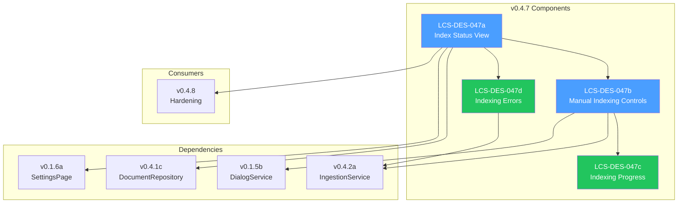

# LCS-DES-047-INDEX: Design Specification Index — The Index Manager

## Document Control

| Field            | Value                                    |
| :--------------- | :--------------------------------------- |
| **Document ID**  | LCS-DES-047-INDEX                        |
| **Version**      | v0.4.7                                   |
| **Codename**     | The Index Manager (Corpus Administration)|
| **Status**       | Draft                                    |
| **Last Updated** | 2026-01-27                               |
| **Owner**        | Lead Architect                           |

---

## 1. Overview

This index provides navigation to all design specifications for **v0.4.7: The Index Manager**, which delivers user-facing tools for viewing and managing the indexed document corpus.

---

## 2. Design Specifications

| Document ID    | Title                      | Description                                      | Status |
| :------------- | :------------------------- | :----------------------------------------------- | :----- |
| [LCS-DES-047a](./LCS-DES-047a.md) | Index Status View | Document list with status badges | Draft |
| [LCS-DES-047b](./LCS-DES-047b.md) | Manual Indexing Controls | Re-index and remove actions | Draft |
| [LCS-DES-047c](./LCS-DES-047c.md) | Indexing Progress | Progress toast overlay | Draft |
| [LCS-DES-047d](./LCS-DES-047d.md) | Indexing Errors | Error handling and retry | Draft |

---

## 3. Architecture Overview



---

## 4. Sub-Part Summary

### 4.1 LCS-DES-047a: Index Status View

**Purpose:** Display comprehensive status of all indexed documents in Settings.

**Key Components:**

- `IndexStatusView.axaml` UserControl
- `IndexStatusViewModel` with document collection
- `IIndexStatusService` interface
- Status badges (Indexed/Pending/Stale/Failed)
- Summary statistics display
- Settings dialog registration

**Module:** `Lexichord.Modules.RAG`

---

### 4.2 LCS-DES-047b: Manual Indexing Controls

**Purpose:** Allow manual management of document indexing.

**Key Components:**

- `IIndexManagementService` interface
- Re-index Document command
- Remove from Index command
- Re-index All command
- Confirmation dialog integration
- `IndexOperationRequestedEvent` MediatR event

**Module:** `Lexichord.Modules.RAG`

---

### 4.3 LCS-DES-047c: Indexing Progress

**Purpose:** Show real-time progress during indexing operations.

**Key Components:**

- `IndexingProgressView.axaml` toast overlay
- `IndexingProgressViewModel` with progress state
- `IngestionProgressEventArgs` binding
- Cancellation token support
- Auto-dismiss behavior
- Progress bar with percentage

**Module:** `Lexichord.Modules.RAG`

---

### 4.4 LCS-DES-047d: Indexing Errors

**Purpose:** Handle and display indexing failures with recovery options.

**Key Components:**

- `IndexingErrorInfo` record
- Migration for `error_message` column
- Failed document display
- Retry action implementation
- Error logging with context
- `DocumentIndexingFailedEvent` handling

**Module:** `Lexichord.Modules.RAG`

---

## 5. Dependency Chain

```text
v0.4.7a (Index Status View)
    │
    ├── v0.4.7b (Manual Indexing Controls) ──┐
    │       │                                 │
    │       └── v0.4.7c (Indexing Progress) ─┤
    │               │                         │
    │               └── v0.4.2a (Ingestion)  │
    │                                         │
    ├── v0.4.7d (Indexing Errors) ───────────┘
    │       │
    │       └── v0.4.1c (Repositories)
    │
    ├── v0.1.6a (SettingsPage) ───────────────
    │
    └── v0.1.5b (DialogService) ──────────────
```

---

## 6. Interface Dependencies

| Interface | Source | Used By |
| :-------- | :----- | :------ |
| `IIngestionService` | v0.4.2a | IndexManagementService |
| `IDocumentRepository` | v0.4.1c | IndexStatusService |
| `IChunkRepository` | v0.4.1c | IndexStatusService |
| `ISettingsPage` | v0.1.6a | Module registration |
| `IDialogService` | v0.1.5b | Confirmation dialogs |
| `IMediator` | v0.0.7a | Events |

---

## 7. New Types Introduced

### 7.1 Interfaces

| Interface | Methods | Purpose |
| :-------- | :------ | :------ |
| `IIndexStatusService` | `GetStatusAsync`, `GetStatisticsAsync` | Index status aggregation |
| `IIndexManagementService` | `ReindexAsync`, `RemoveAsync`, `ReindexAllAsync` | Manual operations |

### 7.2 ViewModels

| ViewModel | Base | Purpose |
| :-------- | :--- | :------ |
| `IndexStatusViewModel` | `ViewModelBase` | Document list state |
| `IndexedDocumentViewModel` | `ViewModelBase` | Individual document state |
| `IndexingProgressViewModel` | `ViewModelBase` | Progress state |

### 7.3 Records

| Record | Properties | Purpose |
| :----- | :--------- | :------ |
| `IndexStatistics` | DocumentCount, ChunkCount, StorageBytes | Summary stats |
| `IndexingErrorInfo` | DocumentId, Path, Message, Timestamp | Error details |

### 7.4 Events

| Event | Properties | Purpose |
| :---- | :--------- | :------ |
| `IndexOperationRequestedEvent` | OperationType, DocumentId | Manual operation request |
| `IndexOperationCompletedEvent` | OperationType, Success, Error | Operation result |

### 7.5 Views

| View | Type | Purpose |
| :--- | :--- | :------ |
| `IndexStatusView` | UserControl | Document list |
| `IndexingProgressView` | UserControl | Progress toast |

---

## 8. Testing Strategy

| Sub-Part | Unit Tests | UI Tests |
| :------- | :--------- | :------- |
| v0.4.7a | ViewModel loading, statistics | View rendering |
| v0.4.7b | Command execution, confirmation | Button behavior |
| v0.4.7c | Progress binding, cancellation | Toast visibility |
| v0.4.7d | Error handling, retry logic | Error display |

---

## 9. Related Documents

| Document | Relationship |
| :------- | :----------- |
| [LCS-SBD-047](./LCS-SBD-047.md) | Scope Breakdown for v0.4.7 |
| [LCS-SBD-046](../v0.4.6/LCS-SBD-046.md) | Predecessor (Reference Panel) |
| [LCS-SBD-048](../v0.4.8/LCS-SBD-048.md) | Successor (Hardening) |
| [roadmap-v0.4.x](../roadmap-v0.4.x.md) | Version roadmap |

---

## 10. Revision History

| Version | Date       | Author         | Changes                    |
| :------ | :--------- | :------------- | :------------------------- |
| 0.1     | 2026-01-27 | Lead Architect | Initial draft              |

---
