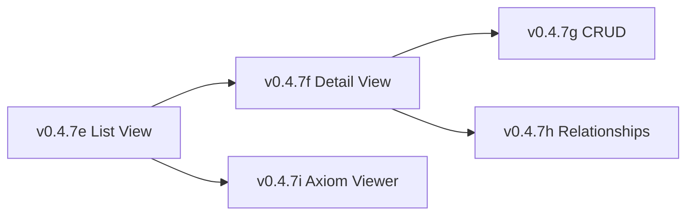

# LCS-DES-047-KG Index: Entity Browser Design Specifications

## Document Control

| Field | Value |
| :--- | :--- |
| **System Breakdown** | LCS-SBD-047-KG |
| **Version** | v0.4.7 |
| **Codename** | Entity Browser (CKVS Phase 1c) |
| **Total Sub-Parts** | 5 |
| **Total Estimated Hours** | 28 hours |
| **Status** | Draft |
| **Last Updated** | 2026-01-31 |

---

## Sub-Part Overview

| ID | Document | Title | Hours | Description |
| :- | :------- | :---- | :---- | :---------- |
| v0.4.7e | [LCS-DES-047-KG-e](LCS-DES-047-KG-e.md) | Entity List View | 6 | Filterable entity list with virtual scrolling |
| v0.4.7f | [LCS-DES-047-KG-f](LCS-DES-047-KG-f.md) | Entity Detail View | 5 | Properties, relationships, source documents |
| v0.4.7g | [LCS-DES-047-KG-g](LCS-DES-047-KG-g.md) | Entity CRUD Operations | 6 | Create, edit, merge, delete entities |
| v0.4.7h | [LCS-DES-047-KG-h](LCS-DES-047-KG-h.md) | Relationship Viewer | 8 | Tree and graph visualization |
| v0.4.7i | [LCS-DES-047-KG-i](LCS-DES-047-KG-i.md) | Axiom Viewer | 3 | Read-only axiom browsing |

---

## Architecture Summary

```
┌─────────────────────────────────────────────────────────────────┐
│                 Index Manager Panel (v0.4.7)                    │
├─────────────────────────────────────────────────────────────────┤
│ [Documents] [Progress] [Entities] [Axioms]                      │
├─────────────────────────────────────────────────────────────────┤
│                                                                 │
│  ┌─────────────────┐    ┌─────────────────────────────────────┐ │
│  │  Entity List    │    │  Entity Detail                      │ │
│  │  (v0.4.7e)      │    │  (v0.4.7f)                          │ │
│  │                 │    │                                     │ │
│  │  ┌───────────┐  │    │  ┌────────────────────────────────┐ │ │
│  │  │ Filters   │  │    │  │ Properties                     │ │ │
│  │  ├───────────┤  │    │  ├────────────────────────────────┤ │ │
│  │  │ Entity 1  │──┼───►│  │ Relationships (v0.4.7h)        │ │ │
│  │  │ Entity 2  │  │    │  ├────────────────────────────────┤ │ │
│  │  │ Entity 3  │  │    │  │ Source Documents               │ │ │
│  │  │ ...       │  │    │  ├────────────────────────────────┤ │ │
│  │  └───────────┘  │    │  │ Actions (v0.4.7g)              │ │ │
│  │                 │    │  │ [Edit] [Merge] [Delete]        │ │ │
│  └─────────────────┘    │  └────────────────────────────────┘ │ │
│                         └─────────────────────────────────────┘ │
│                                                                 │
│  ┌─────────────────────────────────────────────────────────────┐│
│  │  Axiom Viewer (v0.4.7i)                                     ││
│  │  ├── Built-in axioms                                        ││
│  │  └── Custom axioms                                          ││
│  └─────────────────────────────────────────────────────────────┘│
│                                                                 │
└─────────────────────────────────────────────────────────────────┘
```

---

## Key Interfaces

| Interface | Module | Purpose |
| :-------- | :----- | :------ |
| `EntityListViewModel` | v0.4.7e | Entity list with filtering |
| `EntityDetailViewModel` | v0.4.7f | Entity detail display |
| `IEntityCrudService` | v0.4.7g | CRUD operations |
| `RelationshipViewerViewModel` | v0.4.7h | Relationship visualization |
| `AxiomViewerViewModel` | v0.4.7i | Axiom browsing |

---

## Dependencies

### Upstream (Required)

| Component | Version | Usage |
| :-------- | :------ | :---- |
| Graph Repository | v0.4.5e | Entity and relationship queries |
| Schema Registry | v0.4.5f | Type metadata (icons, colors) |
| Axiom Store | v0.4.6-KG | Axiom queries and validation |
| Index Manager | v0.4.7 | Tab container integration |

### Downstream (Consumers)

| Component | Version | Usage |
| :-------- | :------ | :---- |
| Entity Linking | v0.5.5-KG | Review linking quality |
| Validation Engine | v0.6.5-KG | Show validation per entity |

---

## License Gating

| Tier | List | Detail | CRUD | Graph View | Axioms |
| :--- | :--- | :----- | :--- | :--------- | :----- |
| Core | ✗ | ✗ | ✗ | ✗ | ✗ |
| WriterPro | Read | Read | ✗ | Tree only | Read |
| Teams | ✓ | ✓ | Full | Full | Read |
| Enterprise | ✓ | ✓ | Bulk ops | Full | Read |

---

## UI Components

| Component | Type | Description |
| :-------- | :--- | :---------- |
| `EntityListView` | UserControl | Filterable entity list with virtual scrolling |
| `EntityDetailView` | UserControl | Entity properties and relationships |
| `RelationshipTreeView` | UserControl | Hierarchical relationship display |
| `RelationshipGraphView` | UserControl | Node-link diagram (Teams+) |
| `AxiomViewerView` | UserControl | Axiom list and detail |

---

## Implementation Order



1. **v0.4.7e**: List view first (main navigation)
2. **v0.4.7f**: Detail view (driven by list selection)
3. **v0.4.7g**: CRUD operations (actions in detail view)
4. **v0.4.7h**: Relationship viewer (embedded in detail)
5. **v0.4.7i**: Axiom viewer (separate tab, can parallel)

---

## Testing Strategy

| Sub-Part | Unit Tests | Integration Tests |
| :------- | :--------- | :---------------- |
| v0.4.7e | Filtering, virtual scrolling | Data loading |
| v0.4.7f | Property display | Navigation |
| v0.4.7g | All CRUD operations | Audit trail |
| v0.4.7h | Tree building, cycle detection | Graph rendering |
| v0.4.7i | Filtering, formatting | Axiom loading |

---

## Changelog

| Version | Date | Author | Changes |
| :------ | :--- | :----- | :------ |
| 1.0 | 2026-01-31 | Lead Architect | Initial creation |

---
