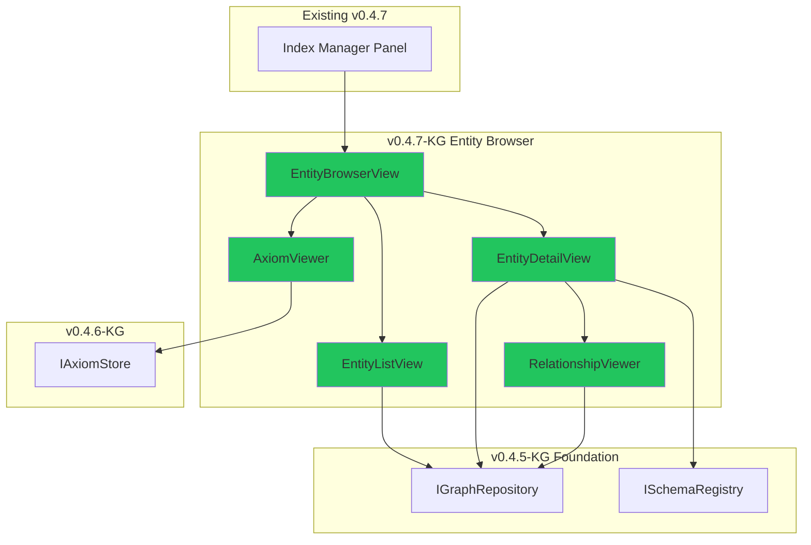

# LCS-SBD-047-KG: Scope Overview — Entity Browser

## Document Control

| Field            | Value                                                        |
| :--------------- | :----------------------------------------------------------- |
| **Document ID**  | LCS-SBD-047-KG                                               |
| **Version**      | v0.4.7                                                       |
| **Codename**     | Entity Browser (CKVS Phase 1c)                               |
| **Status**       | Draft                                                        |
| **Last Updated** | 2026-01-31                                                   |
| **Owner**        | Lead Architect                                               |
| **Depends On**   | v0.4.5-KG (Graph Foundation), v0.4.6-KG (Axiom Store)        |

---

## 1. Executive Summary

### 1.1 The Vision

**v0.4.7-KG** delivers the **Entity Browser** — a visual interface for exploring and managing the Knowledge Graph. Users can browse entities, view relationships, and understand how their documentation maps to structured knowledge.

This is integrated as a tab within the existing Index Manager (v0.4.7) so users have a unified view of both RAG index status and Knowledge Graph contents.

### 1.2 Business Value

- **Knowledge Visibility:** See what entities exist and how they relate.
- **Manual Curation:** Edit, merge, or delete incorrectly extracted entities.
- **Relationship Exploration:** Navigate from entity to related entities.
- **Extraction Quality Review:** Identify low-confidence extractions for review.
- **Document Linking:** See which documents contribute to each entity.

### 1.3 Success Criteria

1. Entity Browser tab integrated into Index Manager panel.
2. Entity list with filtering by type, confidence, source document.
3. Entity detail view showing properties and relationships.
4. Basic CRUD operations for entities (Teams+ tier).
5. Relationship visualization (graph view or tree view).
6. Navigation from entity to source document location.

---

## 2. Relationship to Existing v0.4.7

The existing v0.4.7 spec (LCS-SBD-047) covers the **Index Manager** for RAG corpus administration. The Entity Browser is developed in parallel:

| Panel | Existing Feature | CKVS Addition |
|:------|:-----------------|:--------------|
| Index Manager | Document index status | Entity Browser tab |
| Tab 1 | Indexed Documents | (unchanged) |
| Tab 2 | Indexing Progress | (unchanged) |
| **Tab 3** | — | **Entity Browser** (new) |
| **Tab 4** | — | **Axiom Viewer** (new) |

---

## 3. Key Deliverables

### 3.1 Sub-Parts

| Sub-Part | Title | Description | Est. Hours |
|:---------|:------|:------------|:-----------|
| v0.4.7e | Entity List View | Filterable list of graph entities | 6 |
| v0.4.7f | Entity Detail View | Properties, relationships, source docs | 5 |
| v0.4.7g | Entity CRUD Operations | Create, edit, merge, delete entities | 6 |
| v0.4.7h | Relationship Viewer | Visual graph/tree of relationships | 8 |
| v0.4.7i | Axiom Viewer | Read-only view of loaded axioms | 3 |
| **Total** | | | **28 hours** |

### 3.2 Key Interfaces

```csharp
/// <summary>
/// ViewModel for Entity Browser.
/// </summary>
public class EntityBrowserViewModel : ViewModelBase
{
    public ObservableCollection<EntityListItem> Entities { get; }
    public EntityListItem? SelectedEntity { get; set; }
    public EntityDetailViewModel? EntityDetail { get; }

    // Filters
    public string? TypeFilter { get; set; }
    public float MinConfidenceFilter { get; set; } = 0.0f;
    public Guid? DocumentFilter { get; set; }

    // Commands
    public ICommand RefreshCommand { get; }
    public ICommand CreateEntityCommand { get; }
    public ICommand EditEntityCommand { get; }
    public ICommand DeleteEntityCommand { get; }
    public ICommand MergeEntitiesCommand { get; }
    public ICommand NavigateToSourceCommand { get; }
}

/// <summary>
/// List item for entity display.
/// </summary>
public record EntityListItem
{
    public Guid Id { get; init; }
    public string Type { get; init; }
    public string Name { get; init; }
    public float Confidence { get; init; }
    public int RelationshipCount { get; init; }
    public int MentionCount { get; init; }
    public string? Icon { get; init; }
    public string? Color { get; init; }
}
```

### 3.3 UI Wireframe

```
┌─────────────────────────────────────────────────────────────────┐
│ Index Manager                                          [×]      │
├─────────────────────────────────────────────────────────────────┤
│ [Documents] [Progress] [Entities] [Axioms]                      │
├─────────────────────────────────────────────────────────────────┤
│ ┌─────────────────────┐ ┌─────────────────────────────────────┐ │
│ │ Filter: [All Types▼]│ │ Entity: GET /users                  │ │
│ │ Min Conf: [0.7    ] │ │ Type: Endpoint                      │ │
│ │ Document: [All    ▼]│ │                                     │ │
│ ├─────────────────────┤ │ Properties:                         │ │
│ │ ⚡ GET /users    98% │ │   path: /users                     │ │
│ │ ⚡ POST /orders  95% │ │   method: GET                      │ │
│ │ 📦 Product API   92% │ │   description: Returns all users   │ │
│ │ 🔧 userId        88% │ │                                     │ │
│ │ 🔧 limit         85% │ │ Relationships (3):                  │ │
│ │ 📖 Rate Limit    72% │ │   → ACCEPTS: userId (Parameter)    │ │
│ │ ...                  │ │   → ACCEPTS: limit (Parameter)     │ │
│ │                      │ │   → RETURNS: 200 OK (Response)     │ │
│ │                      │ │                                     │ │
│ │                      │ │ Source Documents (2):               │ │
│ │                      │ │   📄 api-reference.md (3 mentions) │ │
│ │                      │ │   📄 getting-started.md (1 mention)│ │
│ │                      │ │                                     │ │
│ │                      │ │ [Edit] [Merge] [Delete] [Go to Doc]│ │
│ └─────────────────────┘ └─────────────────────────────────────┘ │
└─────────────────────────────────────────────────────────────────┘
```

---

## 4. Architecture Integration



---

## 5. Dependencies

| Component | Source | Usage |
|:----------|:-------|:------|
| `IGraphRepository` | v0.4.5e | Query entities and relationships |
| `ISchemaRegistry` | v0.4.5f | Entity type metadata (icons, colors) |
| `IAxiomStore` | v0.4.6-KG | Display axiom list |
| `IRegionManager` | v0.1.1b | Panel registration |
| Index Manager | v0.4.7 | Tab container integration |

---

## 6. License Gating

| Tier | Entity Browser Access |
|:-----|:----------------------|
| Core | Not available |
| WriterPro | Read-only (browse, view) |
| Teams | Full CRUD (create, edit, delete, merge) |
| Enterprise | Full + bulk operations |

---

## 7. User Stories

| ID | Role | Story | Acceptance |
|:---|:-----|:------|:-----------|
| US-01 | Writer | Browse extracted entities | Entity list loads with filtering |
| US-02 | Writer | View entity details | Properties and relationships shown |
| US-03 | Writer | Navigate to source | Click opens document at mention |
| US-04 | Writer | Fix extraction error | Can edit/delete incorrect entities |
| US-05 | Writer | Merge duplicates | Can merge two entities into one |

---

## 8. Risks & Mitigations

| Risk | Mitigation |
|:-----|:-----------|
| Large graph performance | Virtual scrolling, pagination |
| Relationship visualization complexity | Start with tree view, graph view later |
| Entity merge complexity | Simple merge (keep newer), advanced later |

---

## 9. What This Enables

- **v0.5.5 Entity Linking:** Visual review of linking quality.
- **v0.6.5 Validation:** View validation results per entity.
- **Future:** Visual graph designer for Enterprise.

---
