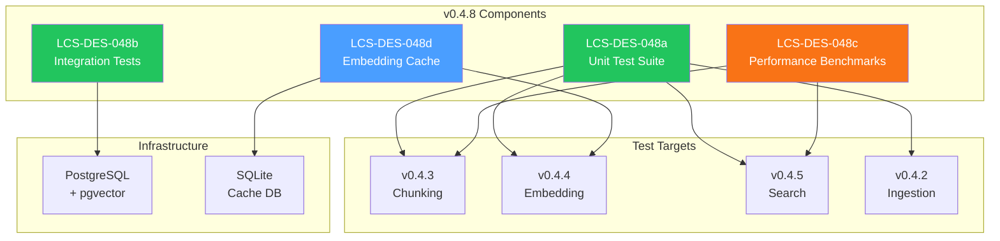

# LCS-DES-048-INDEX: Design Specification Index — The Hardening

## Document Control

| Field            | Value                                    |
| :--------------- | :--------------------------------------- |
| **Document ID**  | LCS-DES-048-INDEX                        |
| **Version**      | v0.4.8                                   |
| **Codename**     | The Hardening (Performance & Testing)    |
| **Status**       | Draft                                    |
| **Last Updated** | 2026-01-27                               |
| **Owner**        | Lead Architect                           |

---

## 1. Overview

This index provides navigation to all design specifications for **v0.4.8: The Hardening**, which ensures the RAG system is production-ready through comprehensive testing, performance benchmarking, and optimization.

---

## 2. Design Specifications

| Document ID    | Title                      | Description                                      | Status |
| :------------- | :------------------------- | :----------------------------------------------- | :----- |
| [LCS-DES-048a](./LCS-DES-048a.md) | Unit Test Suite | Comprehensive unit tests | Draft |
| [LCS-DES-048b](./LCS-DES-048b.md) | Integration Tests | End-to-end flow testing | Draft |
| [LCS-DES-048c](./LCS-DES-048c.md) | Performance Benchmarks | Latency and throughput baselines | Draft |
| [LCS-DES-048d](./LCS-DES-048d.md) | Embedding Cache | Local SQLite cache | Draft |

---

## 3. Architecture Overview



---

## 4. Sub-Part Summary

### 4.1 LCS-DES-048a: Unit Test Suite

**Purpose:** Comprehensive unit tests ensuring correctness of RAG components.

**Key Components:**

- `ChunkingStrategyTests` for all strategies
- `EmbeddingServiceTests` with HTTP mocking
- `SearchServiceTests` for scoring logic
- `TokenCounterTests` for edge cases
- `IngestionServiceTests` for pipeline
- Coverage reporting with Coverlet

**Module:** `Lexichord.Modules.RAG.Tests`

---

### 4.2 LCS-DES-048b: Integration Tests

**Purpose:** Test end-to-end flows with real infrastructure.

**Key Components:**

- Testcontainers for PostgreSQL + pgvector
- Ingestion pipeline tests
- Search roundtrip tests
- Change detection tests
- Deletion cascade tests
- Concurrent access tests

**Module:** `Lexichord.Modules.RAG.IntegrationTests`

---

### 4.3 LCS-DES-048c: Performance Benchmarks

**Purpose:** Establish baseline performance metrics.

**Key Components:**

- BenchmarkDotNet project
- Chunking benchmarks
- Token counting benchmarks
- Vector search benchmarks
- Full indexing benchmarks
- Memory usage profiling

**Module:** `Lexichord.Benchmarks`

---

### 4.4 LCS-DES-048d: Embedding Cache

**Purpose:** Cache embeddings locally to reduce API costs.

**Key Components:**

- `IEmbeddingCache` interface
- `SqliteEmbeddingCache` implementation
- Content hash keying (SHA-256)
- LRU eviction policy
- Configuration options
- Cache statistics

**Module:** `Lexichord.Modules.RAG`

---

## 5. Dependency Chain

```text
v0.4.8a (Unit Test Suite)
    │
    ├── Chunking Strategies (v0.4.3)
    ├── Embedding Service (v0.4.4)
    ├── Search Service (v0.4.5)
    └── Ingestion Service (v0.4.2)

v0.4.8b (Integration Tests)
    │
    ├── Testcontainers (PostgreSQL + pgvector)
    └── All RAG components (v0.4.1-v0.4.7)

v0.4.8c (Performance Benchmarks)
    │
    ├── BenchmarkDotNet
    └── All RAG components (v0.4.1-v0.4.7)

v0.4.8d (Embedding Cache)
    │
    ├── Microsoft.Data.Sqlite
    └── IEmbeddingService (v0.4.4a)
```

---

## 6. Interface Dependencies

| Interface | Source | Used By |
| :-------- | :----- | :------ |
| `IChunkingStrategy` | v0.4.3a | Unit tests, benchmarks |
| `IEmbeddingService` | v0.4.4a | Unit tests, benchmarks, cache |
| `ISemanticSearchService` | v0.4.5a | Unit tests, benchmarks |
| `IDocumentRepository` | v0.4.1c | Integration tests |
| `IChunkRepository` | v0.4.1c | Integration tests |

---

## 7. New Types Introduced

### 7.1 Interfaces

| Interface | Methods | Purpose |
| :-------- | :------ | :------ |
| `IEmbeddingCache` | `TryGet`, `Set`, `GetStats`, `Clear` | Cache abstraction |

### 7.2 Classes

| Class | Purpose |
| :---- | :------ |
| `SqliteEmbeddingCache` | SQLite-based cache implementation |
| `EmbeddingCacheStatistics` | Cache hit/miss metrics |

### 7.3 Configuration

| Setting | Type | Default | Purpose |
| :------ | :--- | :------ | :------ |
| `EmbeddingCacheEnabled` | bool | true | Enable/disable cache |
| `EmbeddingCacheMaxSizeMB` | int | 100 | Maximum cache size |
| `EmbeddingCachePath` | string | ~/.lexichord/cache | Cache file location |

---

## 8. Testing Strategy

| Sub-Part | Focus | Tools |
| :------- | :---- | :---- |
| v0.4.8a | Unit correctness | xUnit, Moq, FluentAssertions |
| v0.4.8b | Integration flows | Testcontainers, xUnit |
| v0.4.8c | Performance baselines | BenchmarkDotNet |
| v0.4.8d | Cache behavior | xUnit, SQLite in-memory |

---

## 9. Performance Baselines

| Metric | Target | Notes |
| :----- | :----- | :---- |
| Chunking (100KB) | < 100ms | FixedSize strategy |
| Token counting (10K chars) | < 10ms | cl100k_base encoding |
| Vector search (10K chunks) | < 200ms | Cosine similarity |
| Indexing throughput | > 10 docs/min | Limited by API |
| Memory (1K docs) | < 50MB | Metadata only |
| Cache hit latency | < 1ms | SQLite lookup |

---

## 10. Related Documents

| Document | Relationship |
| :------- | :----------- |
| [LCS-SBD-048](./LCS-SBD-048.md) | Scope Breakdown for v0.4.8 |
| [LCS-SBD-047](../v0.4.7/LCS-SBD-047.md) | Predecessor (Index Manager) |
| [roadmap-v0.4.x](../roadmap-v0.4.x.md) | Version roadmap |

---

## 11. Revision History

| Version | Date       | Author         | Changes                    |
| :------ | :--------- | :------------- | :------------------------- |
| 0.1     | 2026-01-27 | Lead Architect | Initial draft              |

---
