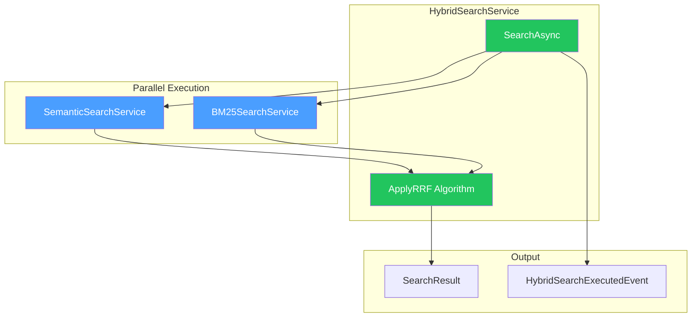

# LCS-DES-051c: Hybrid Fusion Algorithm

## Document Control

| Field              | Value                                                          |
| :----------------- | :------------------------------------------------------------- |
| **Document ID**    | LCS-DES-051c                                                   |
| **Feature ID**     | INF-051c                                                       |
| **Feature Name**   | Hybrid Fusion Algorithm                                        |
| **Target Version** | v0.5.1c                                                        |
| **Module**         | Lexichord.Modules.RAG                                          |
| **License Tier**   | WriterPro                                                      |
| **Status**         | Draft                                                          |
| **Last Updated**   | 2026-01-27                                                     |
| **Depends On**     | v0.5.1b (IBM25SearchService), v0.4.5a (ISemanticSearchService) |

---

## 1. Executive Summary

### 1.1 Problem Statement

With both BM25 (v0.5.1b) and Semantic Search (v0.4.5a) available, we need a fusion algorithm to combine their results. The challenge is merging two ranked lists where the same chunk may appear at different positions with incomparable scores.

### 1.2 Solution

Implement `IHybridSearchService` using **Reciprocal Rank Fusion (RRF)**, the industry-standard algorithm for merging ranked lists. RRF assigns scores based on rank position rather than raw scores, making it robust when combining heterogeneous ranking systems.

---

## 2. Dependencies

| Interface                | Source Version | Purpose                |
| :----------------------- | :------------- | :--------------------- |
| `IBM25SearchService`     | v0.5.1b        | Keyword search         |
| `ISemanticSearchService` | v0.4.5a        | Vector semantic search |
| `SearchResult`           | v0.4.5a        | Result container       |
| `SearchHit`              | v0.4.5a        | Individual hit model   |
| `IMediator`              | v0.0.7a        | Event publishing       |

---

## 3. Data Contract

### 3.1 Interface

```csharp
namespace Lexichord.Abstractions.Contracts;

/// <summary>
/// Combines BM25 and semantic search for hybrid retrieval.
/// </summary>
public interface IHybridSearchService
{
    /// <summary>
    /// Executes hybrid search combining semantic and keyword matching.
    /// </summary>
    Task<SearchResult> SearchAsync(
        string query,
        SearchOptions options,
        CancellationToken ct = default);
}
```

### 3.2 Configuration Record

```csharp
/// <summary>
/// Configuration options for hybrid search.
/// </summary>
public record HybridSearchOptions
{
    /// <summary>Weight for semantic results. Default 0.7.</summary>
    public float SemanticWeight { get; init; } = 0.7f;

    /// <summary>Weight for BM25 results. Default 0.3.</summary>
    public float BM25Weight { get; init; } = 0.3f;

    /// <summary>RRF constant k. Default 60.</summary>
    public int RRFConstant { get; init; } = 60;
}
```

### 3.3 MediatR Event

```csharp
namespace Lexichord.Modules.RAG.Events;

/// <summary>
/// Published when hybrid search completes.
/// </summary>
public record HybridSearchExecutedEvent(
    string Query,
    int SemanticHitCount,
    int BM25HitCount,
    int FusedResultCount,
    TimeSpan Duration,
    HybridSearchOptions Options) : INotification;
```

---

## 4. Reciprocal Rank Fusion Algorithm

### 4.1 Formula

```
RRF_score(chunk) = Σ (weight_i / (k + rank_i))
```

Where:

- `weight_i` = Weight for ranking system (SemanticWeight or BM25Weight)
- `k` = RRF constant (default 60)
- `rank_i` = 1-based position (∞ if not present → contributes 0)

### 4.2 Example

| Chunk   | Semantic Rank | BM25 Rank | Semantic (0.7) | BM25 (0.3) | RRF Total |
| :------ | :------------ | :-------- | :------------- | :--------- | :-------- |
| chunk_A | 1             | —         | 0.0115         | 0          | 0.0115    |
| chunk_B | 2             | 1         | 0.0113         | 0.0049     | 0.0162    |
| chunk_C | —             | 2         | 0              | 0.0048     | 0.0048    |

**Result:** chunk_B ranks first (appears in both lists).

---

## 5. Implementation

```csharp
namespace Lexichord.Modules.RAG.Services;

public sealed class HybridSearchService : IHybridSearchService
{
    private readonly ISemanticSearchService _semanticSearch;
    private readonly IBM25SearchService _bm25Search;
    private readonly IChunkRepository _chunkRepository;
    private readonly IOptions<HybridSearchOptions> _options;
    private readonly IMediator _mediator;
    private readonly ILogger<HybridSearchService> _logger;

    public HybridSearchService(
        ISemanticSearchService semanticSearch,
        IBM25SearchService bm25Search,
        IChunkRepository chunkRepository,
        IOptions<HybridSearchOptions> options,
        IMediator mediator,
        ILogger<HybridSearchService> logger)
    {
        _semanticSearch = semanticSearch;
        _bm25Search = bm25Search;
        _chunkRepository = chunkRepository;
        _options = options;
        _mediator = mediator;
        _logger = logger;
    }

    public async Task<SearchResult> SearchAsync(
        string query, SearchOptions options, CancellationToken ct = default)
    {
        _logger.LogDebug("Hybrid search starting: query='{Query}'", query);
        var stopwatch = Stopwatch.StartNew();

        var expandedTopK = options.TopK * 2;

        // Execute both searches in parallel
        var semanticTask = _semanticSearch.SearchAsync(
            query, options with { TopK = expandedTopK }, ct);
        var bm25Task = _bm25Search.SearchAsync(query, expandedTopK, ct);

        await Task.WhenAll(semanticTask, bm25Task);

        var semanticResult = semanticTask.Result;
        var bm25Hits = bm25Task.Result;

        // Apply RRF
        var fusedHits = ApplyRRF(semanticResult.Hits, bm25Hits, _options.Value);
        var finalHits = fusedHits.Take(options.TopK).ToList();

        stopwatch.Stop();

        _logger.LogInformation(
            "Hybrid search completed: semantic={SemanticHits}, bm25={BM25Hits}, fused={FusedCount} in {ElapsedMs}ms",
            semanticResult.Hits.Count, bm25Hits.Count, finalHits.Count, stopwatch.ElapsedMilliseconds);

        await _mediator.Publish(new HybridSearchExecutedEvent(
            query, semanticResult.Hits.Count, bm25Hits.Count,
            finalHits.Count, stopwatch.Elapsed, _options.Value), ct);

        return new SearchResult(finalHits, stopwatch.Elapsed);
    }

    private IEnumerable<SearchHit> ApplyRRF(
        IReadOnlyList<SearchHit> semanticHits,
        IReadOnlyList<BM25Hit> bm25Hits,
        HybridSearchOptions opts)
    {
        var k = opts.RRFConstant;
        var scores = new Dictionary<Guid, (float Score, SearchHit? Hit)>();

        // Score from semantic ranking
        for (int i = 0; i < semanticHits.Count; i++)
        {
            var hit = semanticHits[i];
            var rrfScore = opts.SemanticWeight / (k + i + 1);
            scores[hit.Chunk.Id] = (rrfScore, hit);
        }

        // Add score from BM25 ranking
        for (int i = 0; i < bm25Hits.Count; i++)
        {
            var chunkId = bm25Hits[i].ChunkId;
            var rrfScore = opts.BM25Weight / (k + i + 1);

            if (scores.TryGetValue(chunkId, out var existing))
            {
                scores[chunkId] = (existing.Score + rrfScore, existing.Hit);
            }
            // Note: BM25-only hits would need chunk lookup (deferred)
        }

        return scores
            .Where(kvp => kvp.Value.Hit != null)
            .OrderByDescending(kvp => kvp.Value.Score)
            .Select(kvp => kvp.Value.Hit!);
    }
}
```

---

## 6. Architecture Diagram



---

## 7. Acceptance Criteria

| #   | Criterion                                         |
| :-- | :------------------------------------------------ |
| 1   | Parallel execution of semantic and BM25 search    |
| 2   | Chunks in both lists rank higher than single-list |
| 3   | Configurable weights affect ranking               |
| 4   | HybridSearchExecutedEvent published on completion |
| 5   | Search completes < 300ms for 50K chunks           |

---

## 8. Unit Tests

```csharp
[Trait("Category", "Unit")]
[Trait("Version", "v0.5.1c")]
public class HybridSearchServiceTests
{
    [Fact]
    public async Task SearchAsync_ExecutesBothSearchesInParallel()
    {
        var stopwatch = Stopwatch.StartNew();
        var results = await _sut.SearchAsync("query", new SearchOptions());
        stopwatch.Stop();

        // Parallel: ~100ms, Sequential: ~200ms
        stopwatch.ElapsedMilliseconds.Should().BeLessThan(150);
    }

    [Fact]
    public async Task SearchAsync_ChunksInBothListsRankHigher()
    {
        // Arrange: chunk2 appears in both lists
        SetupMockResults(
            semantic: new[] { ("chunk1", 1), ("chunk2", 2) },
            bm25: new[] { ("chunk2", 1), ("chunk3", 2) });

        // Act
        var results = await _sut.SearchAsync("query", new SearchOptions());

        // Assert: chunk2 should be first
        results.Hits[0].Chunk.Id.Should().Be("chunk2");
    }
}
```

---

## 9. Deliverable Checklist

| #   | Deliverable                                      | Status |
| :-- | :----------------------------------------------- | :----- |
| 1   | `IHybridSearchService` interface in Abstractions | [ ]    |
| 2   | `HybridSearchOptions` record                     | [ ]    |
| 3   | `HybridSearchService` with RRF implementation    | [ ]    |
| 4   | Parallel search execution                        | [ ]    |
| 5   | `HybridSearchExecutedEvent` MediatR notification | [ ]    |
| 6   | Unit tests for RRF accuracy                      | [ ]    |
| 7   | DI registration in RAGModule.cs                  | [ ]    |

---

## Document History

| Version | Date       | Author         | Changes       |
| :------ | :--------- | :------------- | :------------ |
| 1.0     | 2026-01-27 | Lead Architect | Initial draft |
