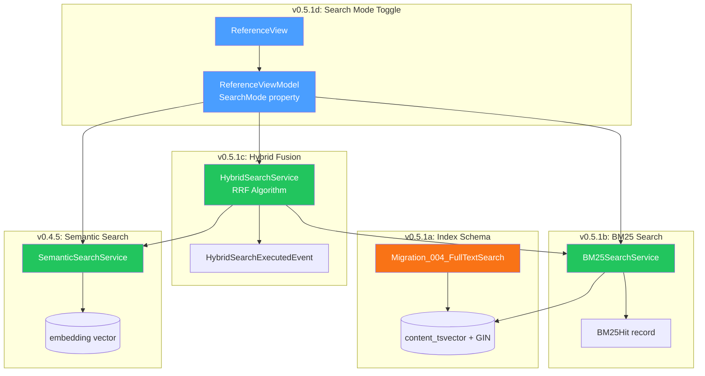
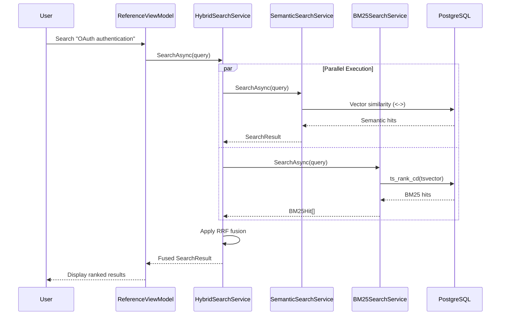

# LCS-DES-051: Design Specification Index — The Hybrid Engine

## Document Control

| Field                | Value                               |
| :------------------- | :---------------------------------- |
| **Document ID**      | LCS-DES-051-INDEX                   |
| **Feature ID**       | RAG-051                             |
| **Feature Name**     | The Hybrid Engine (BM25 + Semantic) |
| **Target Version**   | v0.5.1                              |
| **Module Scope**     | Lexichord.Modules.RAG               |
| **Swimlane**         | Memory                              |
| **License Tier**     | WriterPro (Hybrid); Core (BM25)     |
| **Feature Gate Key** | `FeatureFlags.RAG.HybridSearch`     |
| **Status**           | Draft                               |
| **Last Updated**     | 2026-01-27                          |

---

## 1. Executive Summary

**v0.5.1** delivers the **Hybrid Engine** — a sophisticated retrieval system that combines keyword-based (BM25) and semantic (vector) search for superior retrieval quality. This release transforms Lexichord's search capabilities from pure semantic matching into a hybrid system that captures both exact keyword matches and conceptual similarity.

### 1.1 The Problem

Pure semantic search excels at finding conceptually similar content but can miss exact technical terms, API names, and identifiers. Conversely, pure keyword search finds exact matches but misses synonyms and related concepts. Writers searching technical documentation need both: precise matches for code references AND conceptual matches for related topics.

### 1.2 The Solution

Implement a Hybrid Search Engine that:

- **BM25 Search**: PostgreSQL full-text search with tf-idf ranking for keyword matching
- **Semantic Search**: Existing vector similarity search from v0.4.5
- **Reciprocal Rank Fusion**: Algorithm to merge ranked lists from both search types
- **User Control**: Toggle between Semantic, Keyword, and Hybrid modes

### 1.3 Business Value

| Value                   | Description                                                     |
| :---------------------- | :-------------------------------------------------------------- |
| **Superior Retrieval**  | Combines keyword precision with conceptual understanding        |
| **Typo Resilience**     | Semantic catches conceptual matches even with query typos       |
| **Technical Precision** | BM25 ensures exact API names and identifiers are found          |
| **Industry Standard**   | RRF hybrid search is state-of-the-art in production RAG systems |
| **Foundation**          | Enables Citation Engine (v0.5.2) and Context Window (v0.5.3)    |

---

## 2. Related Documents

### 2.1 Scope Breakdown Document

The detailed scope breakdown for v0.5.1, including all sub-parts, implementation checklists, user stories, and acceptance criteria:

| Document                            | Description                         |
| :---------------------------------- | :---------------------------------- |
| **[LCS-SBD-051](./LCS-SBD-051.md)** | Scope Breakdown — The Hybrid Engine |

### 2.2 Sub-Part Design Specifications

Each sub-part has its own detailed design specification following the LDS-01 template:

| Sub-Part | Document                              | Title                      | Description                              | Status      |
| :------- | :------------------------------------ | :------------------------- | :--------------------------------------- | :---------- |
| v0.5.1a  | **[LCS-DES-051a](./LCS-DES-051a.md)** | BM25 Index Schema          | PostgreSQL tsvector column and GIN index | ✅ Complete |
| v0.5.1b  | **[LCS-DES-051b](./LCS-DES-051b.md)** | BM25 Search Implementation | Full-text search service with ranking    | ✅ Complete |
| v0.5.1c  | **[LCS-DES-051c](./LCS-DES-051c.md)** | Hybrid Fusion Algorithm    | RRF implementation combining both types  | ✅ Complete |
| v0.5.1d  | **[LCS-DES-051d](./LCS-DES-051d.md)** | Search Mode Toggle         | UI toggle and license gating             | 🔜 Planned  |

---

## 3. Architecture Overview

### 3.1 Component Diagram



### 3.2 Data Flow



---

## 4. Dependencies

### 4.1 Upstream Dependencies (Required)

| Interface                | Source Version | Purpose                     |
| :----------------------- | :------------- | :-------------------------- |
| `ISemanticSearchService` | v0.4.5a        | Vector similarity search    |
| `SearchHit`              | v0.4.5a        | Search result model         |
| `SearchResult`           | v0.4.5a        | Aggregate result container  |
| `SearchOptions`          | v0.4.5a        | Search configuration        |
| `IChunkRepository`       | v0.4.1c        | Chunk data access           |
| `ILicenseContext`        | v0.0.4c        | License tier checking       |
| `ISettingsService`       | v0.1.6a        | User preference persistence |
| `IDbConnectionFactory`   | v0.0.5b        | PostgreSQL connection       |
| `IMediator`              | v0.0.7a        | Event publishing            |

### 4.2 NuGet Packages

| Package          | Version | Purpose                             |
| :--------------- | :------ | :---------------------------------- |
| `Npgsql`         | 9.0.x   | PostgreSQL full-text search support |
| `FluentMigrator` | 6.2.x   | Schema migrations                   |
| `Dapper`         | 2.1.x   | Database query execution            |

### 4.3 Downstream Consumers (Future)

| Version | Feature         | Consumes                                       |
| :------ | :-------------- | :--------------------------------------------- |
| v0.5.2  | Citation Engine | `SearchResult`, `SearchHit` with source info   |
| v0.5.3  | Context Window  | Chunk retrieval based on search results        |
| v0.5.4  | Relevance Tuner | Query preprocessing before hybrid search       |
| v0.5.5  | Filter System   | Filter application combined with hybrid search |

---

## 5. License Gating Strategy

The Hybrid Engine uses a **tiered gating** strategy.

### 5.1 Behavior by License Tier

| Tier       | Semantic Search | BM25 Search | Hybrid Search | Default Mode |
| :--------- | :-------------- | :---------- | :------------ | :----------- |
| Core       | ✓               | ✓           | 🔒 Locked     | Semantic     |
| WriterPro  | ✓               | ✓           | ✓             | Hybrid       |
| Teams      | ✓               | ✓           | ✓             | Hybrid       |
| Enterprise | ✓               | ✓           | ✓             | Hybrid       |

### 5.2 Implementation Pattern

```csharp
public SearchMode GetEffectiveSearchMode(SearchMode requested)
{
    if (requested == SearchMode.Hybrid &&
        !_licenseContext.HasFeature(FeatureFlags.RAG.HybridSearch))
    {
        _logger.LogWarning("Hybrid search denied: license tier insufficient");
        return SearchMode.Semantic; // Fall back
    }
    return requested;
}
```

---

## 6. Reciprocal Rank Fusion Algorithm

### 6.1 Formula

For each unique chunk appearing in any result set:

```
RRF_score(chunk) = Σ (weight_i / (k + rank_i))
```

Where:

- `weight_i` = Weight for that ranking system (SemanticWeight or BM25Weight)
- `k` = RRF constant (default 60, higher = ranks matter less)
- `rank_i` = 1-based position in that ranking (∞ if not present)

### 6.2 Example Calculation

| Chunk   | Semantic Rank | BM25 Rank | Semantic Score (0.7) | BM25 Score (0.3)    | RRF Total |
| :------ | :------------ | :-------- | :------------------- | :------------------ | :-------- |
| chunk_A | 1             | —         | 0.7/(60+1) = 0.0115  | 0                   | 0.0115    |
| chunk_B | 2             | 1         | 0.7/(60+2) = 0.0113  | 0.3/(60+1) = 0.0049 | 0.0162    |
| chunk_C | —             | 2         | 0                    | 0.3/(60+2) = 0.0048 | 0.0048    |

**Result:** chunk_B ranks first (appears in both lists).

### 6.3 Configuration Options

```csharp
public record HybridSearchOptions
{
    /// <summary>Weight for semantic results. Default 0.7.</summary>
    public float SemanticWeight { get; init; } = 0.7f;

    /// <summary>Weight for BM25 results. Default 0.3.</summary>
    public float BM25Weight { get; init; } = 0.3f;

    /// <summary>RRF constant k. Default 60.</summary>
    public int RRFConstant { get; init; } = 60;
}
```

---

## 7. Key Interfaces Summary

| Interface              | Defined In | Purpose                  |
| :--------------------- | :--------- | :----------------------- |
| `IBM25SearchService`   | v0.5.1b    | BM25 full-text search    |
| `IHybridSearchService` | v0.5.1c    | Combined search with RRF |

| Record/DTO                  | Defined In | Purpose              |
| :-------------------------- | :--------- | :------------------- |
| `BM25Hit`                   | v0.5.1b    | BM25 search result   |
| `HybridSearchOptions`       | v0.5.1c    | Fusion configuration |
| `HybridSearchExecutedEvent` | v0.5.1c    | Telemetry event      |
| `SearchMode`                | v0.5.1d    | Search strategy enum |

---

## 8. Implementation Checklist Summary

| Sub-Part    | Tasks                      | Est. Hours   |
| :---------- | :------------------------- | :----------- |
| v0.5.1a     | BM25 Index Schema          | 3            |
| v0.5.1b     | BM25 Search Implementation | 8            |
| v0.5.1c     | Hybrid Fusion Algorithm    | 6.5          |
| v0.5.1d     | Search Mode Toggle         | 6.5          |
| Integration | DI, Events, Tests          | 4            |
| **Total**   |                            | **28 hours** |

See [LCS-SBD-051](./LCS-SBD-051.md) Section 4 for the detailed task breakdown.

---

## 9. Success Criteria Summary

| Category        | Criterion                      | Target           |
| :-------------- | :----------------------------- | :--------------- |
| **Performance** | Hybrid search latency (50K)    | < 300ms          |
| **Performance** | BM25 search latency (50K)      | < 100ms          |
| **Accuracy**    | Retrieval MRR                  | > 0.7            |
| **Accuracy**    | Hybrid vs Semantic improvement | +15% Precision@5 |
| **UX**          | Mode switch latency            | < 50ms           |

See [LCS-SBD-051](./LCS-SBD-051.md) Section 9 for full success metrics.

---

## 10. Test Coverage Summary

| Sub-Part | Unit Tests                               | Integration Tests          |
| :------- | :--------------------------------------- | :------------------------- |
| v0.5.1a  | Migration up/down verification           | -                          |
| v0.5.1b  | BM25 accuracy, phrase search, edge cases | Full-text search with data |
| v0.5.1c  | RRF algorithm, parallel execution        | End-to-end hybrid pipeline |
| v0.5.1d  | Mode switching, license enforcement      | UI interaction flow        |

See individual design specs for detailed test scenarios.

---

## 11. What This Enables

| Version | Feature         | Uses From v0.5.1                             |
| :------ | :-------------- | :------------------------------------------- |
| v0.5.2  | Citation Engine | Extends SearchHit with citation metadata     |
| v0.5.3  | Context Window  | Uses search results for context expansion    |
| v0.5.4  | Relevance Tuner | Preprocesses queries before hybrid search    |
| v0.5.5  | Filter System   | Applies filters before/after hybrid fusion   |
| v0.5.8  | Hardening       | Caches hybrid search results for performance |

---

## Document History

| Version | Date       | Author         | Changes       |
| :------ | :--------- | :------------- | :------------ |
| 1.0     | 2026-01-27 | Lead Architect | Initial draft |
