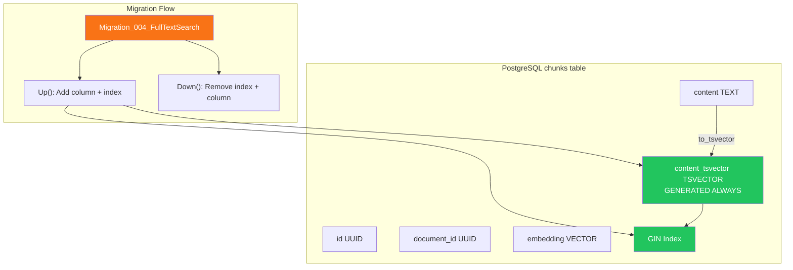

# LCS-DES-051a: BM25 Index Schema

## Document Control

| Field              | Value                         |
| :----------------- | :---------------------------- |
| **Document ID**    | LCS-DES-051a                  |
| **Feature ID**     | INF-051a                      |
| **Feature Name**   | BM25 Index Schema             |
| **Target Version** | v0.5.1a                       |
| **Module**         | Lexichord.Modules.RAG         |
| **Status**         | Draft                         |
| **Last Updated**   | 2026-01-27                    |
| **Depends On**     | v0.4.1b (chunks table schema) |

---

## 1. Executive Summary

### 1.1 Problem Statement

The current `chunks` table supports only vector similarity search via the `embedding` column. To enable keyword-based BM25 search, we need PostgreSQL full-text search capabilities on the chunk content. Without a dedicated tsvector column and GIN index, full-text queries would require expensive on-the-fly conversion with `to_tsvector()`.

### 1.2 Solution

Extend the `chunks` table with a `content_tsvector` column that is automatically generated and maintained by PostgreSQL. Create a GIN index to enable fast full-text search queries.

**Key deliverables:**

- FluentMigrator migration: `Migration_004_FullTextSearch.cs`
- Generated `content_tsvector TSVECTOR` column
- GIN index on `content_tsvector`
- English language configuration

---

## 2. Dependencies

### 2.1 Upstream Dependencies

| Interface/Component | Source Version | Purpose                   |
| :------------------ | :------------- | :------------------------ |
| `chunks` table      | v0.4.1b        | Base table being extended |
| FluentMigrator      | v0.0.5c        | Migration framework       |
| Npgsql              | v0.0.5b        | PostgreSQL driver         |

### 2.2 NuGet Dependencies

| Package                          | Version | Purpose              |
| :------------------------------- | :------ | :------------------- |
| `FluentMigrator`                 | 6.2.x   | Migration definition |
| `FluentMigrator.Runner.Postgres` | 6.2.x   | PostgreSQL execution |

---

## 3. Data Contract

### 3.1 Extended Schema

```sql
-- Existing chunks table (from v0.4.1b)
CREATE TABLE chunks (
    id UUID PRIMARY KEY DEFAULT gen_random_uuid(),
    document_id UUID NOT NULL REFERENCES documents(id) ON DELETE CASCADE,
    content TEXT NOT NULL,
    embedding VECTOR(1536),  -- pgvector for semantic search
    chunk_index INTEGER NOT NULL,
    token_count INTEGER NOT NULL,
    created_at TIMESTAMPTZ DEFAULT NOW(),
    updated_at TIMESTAMPTZ DEFAULT NOW()
);

-- v0.5.1a: Add full-text search support
ALTER TABLE chunks ADD COLUMN content_tsvector TSVECTOR
    GENERATED ALWAYS AS (to_tsvector('english', content)) STORED;

CREATE INDEX idx_chunks_content_tsvector ON chunks USING GIN(content_tsvector);
```

### 3.2 Column Details

| Column             | Type       | Generation                       | Purpose                  |
| :----------------- | :--------- | :------------------------------- | :----------------------- |
| `content_tsvector` | `TSVECTOR` | `GENERATED ALWAYS AS ... STORED` | Pre-computed text tokens |

**Key Characteristics:**

- **GENERATED ALWAYS**: Column is automatically computed, cannot be directly updated
- **STORED**: Value is physically stored, not computed on access
- **English config**: Uses default English stemmer, stop words, and normalization

### 3.3 Index Details

| Index Name                    | Type | Columns            | Purpose               |
| :---------------------------- | :--- | :----------------- | :-------------------- |
| `idx_chunks_content_tsvector` | GIN  | `content_tsvector` | Fast full-text search |

**GIN Index Benefits:**

- Efficient for multi-key values (tsvectors contain multiple lexemes)
- Supports `@@` (match) and `@>` (containment) operators
- Better for read-heavy workloads
- Slightly slower writes vs GiST, but faster reads

---

## 4. Implementation Logic

### 4.1 Migration Class

```csharp
namespace Lexichord.Modules.RAG.Migrations;

/// <summary>
/// Adds full-text search support to the chunks table.
/// </summary>
/// <remarks>
/// <para>Creates a generated tsvector column that auto-updates when content changes.</para>
/// <para>Creates a GIN index for fast full-text search queries.</para>
/// </remarks>
[Migration(202601271400)]
public class Migration_004_FullTextSearch : Migration
{
    /// <inheritdoc />
    public override void Up()
    {
        // Add generated tsvector column
        Execute.Sql(@"
            ALTER TABLE chunks
            ADD COLUMN content_tsvector TSVECTOR
            GENERATED ALWAYS AS (to_tsvector('english', content)) STORED;
        ");

        // Create GIN index for fast full-text queries
        Execute.Sql(@"
            CREATE INDEX CONCURRENTLY idx_chunks_content_tsvector
            ON chunks USING GIN(content_tsvector);
        ");
    }

    /// <inheritdoc />
    public override void Down()
    {
        Execute.Sql("DROP INDEX IF EXISTS idx_chunks_content_tsvector;");
        Execute.Sql("ALTER TABLE chunks DROP COLUMN IF EXISTS content_tsvector;");
    }
}
```

### 4.2 Architecture Diagram



### 4.3 Decision Tree: Migration Execution

```text
START: "Apply Migration_004_FullTextSearch"
│
├── Does 'chunks' table exist?
│   │
│   ├── YES → Continue
│   │
│   └── NO → FAIL: Prerequisite migration v0.4.1b not applied
│
├── Does 'content_tsvector' column exist?
│   │
│   ├── YES → SKIP: Migration already applied
│   │
│   └── NO → Execute ALTER TABLE ADD COLUMN
│
├── Column added successfully?
│   │
│   ├── YES → Execute CREATE INDEX CONCURRENTLY
│   │
│   └── NO → FAIL: Check PostgreSQL error log
│
├── Index created successfully?
│   │
│   ├── YES → Migration complete
│   │
│   └── NO → FAIL: Possible disk space or lock issue
│
└── END: "Migration applied"
```

---

## 5. PostgreSQL Full-Text Concepts

### 5.1 tsvector Format

A tsvector stores normalized lexemes with position information:

```sql
-- Example: Converting text to tsvector
SELECT to_tsvector('english', 'The quick brown fox jumps over the lazy dog');
-- Result: 'brown':3 'dog':9 'fox':4 'jump':5 'lazi':8 'quick':2
```

**Key transformations:**

- Stop words removed ("the", "over")
- Stems applied ("jumps" → "jump", "lazy" → "lazi")
- Positions preserved for phrase queries

### 5.2 Language Configuration

The migration uses `'english'` configuration which includes:

| Feature       | Behavior                                |
| :------------ | :-------------------------------------- |
| Stemmer       | Porter stemmer (English morphological)  |
| Stop words    | Common English words excluded           |
| Normalization | Lowercase, accent removal, Unicode norm |

**Limitation:** v0.5.1 supports English only. Multi-language support deferred to v0.5.9.

---

## 6. Performance Considerations

### 6.1 Storage Impact

| Metric                    | Estimate                           |
| :------------------------ | :--------------------------------- |
| tsvector size per chunk   | ~50-200 bytes (depends on content) |
| GIN index size (50K rows) | ~20-40 MB                          |
| Total overhead (50K)      | ~50 MB                             |

### 6.2 Write Impact

| Operation           | Impact                                            |
| :------------------ | :------------------------------------------------ |
| INSERT              | +5-10ms (tsvector generation + index update)      |
| UPDATE (content)    | +5-10ms (tsvector regeneration + index update)    |
| UPDATE (other cols) | No impact (content unchanged, tsvector unchanged) |

### 6.3 Read Benefits

| Query Type             | Without Index     | With GIN Index |
| :--------------------- | :---------------- | :------------- |
| Full-text search (50K) | ~500ms (seq scan) | ~10-50ms       |
| Phrase search (50K)    | ~700ms (seq scan) | ~20-80ms       |

---

## 7. Observability

### 7.1 Logging Requirements

| Level | Source                       | Message Template                                    |
| :---- | :--------------------------- | :-------------------------------------------------- |
| Info  | Migration_004_FullTextSearch | `"Adding content_tsvector column to chunks table"`  |
| Info  | Migration_004_FullTextSearch | `"Creating GIN index on content_tsvector"`          |
| Info  | Migration_004_FullTextSearch | `"Migration complete: full-text search enabled"`    |
| Warn  | Migration_004_FullTextSearch | `"Rolling back: removing full-text search support"` |

---

## 8. Acceptance Criteria

| #   | Criterion                                                              | Verification                             |
| :-- | :--------------------------------------------------------------------- | :--------------------------------------- |
| 1   | `content_tsvector` column exists on `chunks` table                     | Query information_schema.columns         |
| 2   | Column is GENERATED ALWAYS AS (to_tsvector('english', content)) STORED | Check column definition                  |
| 3   | GIN index `idx_chunks_content_tsvector` exists                         | Query pg_indexes                         |
| 4   | Inserting a chunk auto-populates content_tsvector                      | Insert test row, verify tsvector         |
| 5   | Updating chunk content auto-updates content_tsvector                   | Update test row, verify tsvector changes |
| 6   | Migration down removes column and index cleanly                        | Execute Down(), verify removal           |
| 7   | Existing chunks (if any) have tsvector populated                       | Query for NULL tsvectors                 |

---

## 9. Unit Testing Requirements

### 9.1 Migration Tests

```csharp
[Trait("Category", "Integration")]
[Trait("Version", "v0.5.1a")]
public class Migration_004_FullTextSearchTests : IClassFixture<PostgresFixture>
{
    private readonly PostgresFixture _fixture;

    [Fact]
    public async Task Up_CreatesContentTsvectorColumn()
    {
        // Arrange
        await ApplyMigration();

        // Act
        var columns = await _fixture.GetColumns("chunks");

        // Assert
        columns.Should().Contain(c => c.Name == "content_tsvector" && c.DataType == "tsvector");
    }

    [Fact]
    public async Task Up_CreatesGinIndex()
    {
        // Arrange
        await ApplyMigration();

        // Act
        var indexes = await _fixture.GetIndexes("chunks");

        // Assert
        indexes.Should().Contain(i =>
            i.Name == "idx_chunks_content_tsvector" &&
            i.Type == "gin");
    }

    [Fact]
    public async Task Up_PopulatesTsvectorOnInsert()
    {
        // Arrange
        await ApplyMigration();

        // Act
        await _fixture.ExecuteAsync(@"
            INSERT INTO chunks (document_id, content, chunk_index, token_count)
            VALUES (@docId, 'The quick brown fox jumps over the lazy dog', 0, 9)
        ", new { docId = Guid.NewGuid() });

        var tsvector = await _fixture.ScalarAsync<string>(
            "SELECT content_tsvector::text FROM chunks ORDER BY created_at DESC LIMIT 1");

        // Assert
        tsvector.Should().Contain("quick");
        tsvector.Should().Contain("brown");
        tsvector.Should().Contain("fox");
    }

    [Fact]
    public async Task Down_RemovesColumnAndIndex()
    {
        // Arrange
        await ApplyMigration();
        await RollbackMigration();

        // Act
        var columns = await _fixture.GetColumns("chunks");
        var indexes = await _fixture.GetIndexes("chunks");

        // Assert
        columns.Should().NotContain(c => c.Name == "content_tsvector");
        indexes.Should().NotContain(i => i.Name == "idx_chunks_content_tsvector");
    }
}
```

---

## 10. Verification Commands

```bash
# ═══════════════════════════════════════════════════════════════════════════
# v0.5.1a Verification
# ═══════════════════════════════════════════════════════════════════════════

# 1. Run the migration
dotnet run --project src/Lexichord.Host -- migrate

# 2. Verify column exists
psql -d lexichord -c "
SELECT column_name, data_type, is_generated, generation_expression
FROM information_schema.columns
WHERE table_name = 'chunks' AND column_name = 'content_tsvector';"

# Expected output:
# column_name       | data_type | is_generated | generation_expression
# ------------------+-----------+--------------+-----------------------
# content_tsvector  | tsvector  | ALWAYS       | to_tsvector('english'::regconfig, content)

# 3. Verify GIN index exists
psql -d lexichord -c "
SELECT indexname, indexdef
FROM pg_indexes
WHERE tablename = 'chunks' AND indexname LIKE '%tsvector%';"

# Expected output:
# indexname                      | indexdef
# -------------------------------+------------------------------------------
# idx_chunks_content_tsvector    | CREATE INDEX idx_chunks_content_tsvector ON chunks USING gin (content_tsvector)

# 4. Test auto-population by inserting a test chunk
psql -d lexichord -c "
INSERT INTO chunks (document_id, content, chunk_index, token_count)
VALUES (gen_random_uuid(), 'Testing full-text search capability', 0, 5)
RETURNING id, content_tsvector::text;"

# 5. Test that full-text search works
psql -d lexichord -c "
SELECT id, ts_rank_cd(content_tsvector, query) as rank
FROM chunks, plainto_tsquery('english', 'full-text search') AS query
WHERE content_tsvector @@ query
ORDER BY rank DESC
LIMIT 5;"
```

---

## 11. Deliverable Checklist

| #   | Deliverable                                                   | Status |
| :-- | :------------------------------------------------------------ | :----- |
| 1   | `Migration_004_FullTextSearch.cs` in RAG.Migrations namespace | [ ]    |
| 2   | Migration number `202601271400` with correct timestamp        | [ ]    |
| 3   | `content_tsvector` column as GENERATED ALWAYS STORED          | [ ]    |
| 4   | GIN index `idx_chunks_content_tsvector` on content_tsvector   | [ ]    |
| 5   | Proper Down() method for rollback                             | [ ]    |
| 6   | Integration tests for migration up/down                       | [ ]    |
| 7   | Verification that existing data gets tsvector populated       | [ ]    |

---

## 12. Code Examples

### 12.1 Migration Registration

Add to `RAGModule.cs` in the DI configuration:

```csharp
public static class RAGModule
{
    public static IServiceCollection AddRAGModule(this IServiceCollection services)
    {
        // ... existing registrations ...

        // Migrations are auto-discovered by FluentMigrator
        // No explicit registration needed for Migration_004_FullTextSearch

        return services;
    }
}
```

### 12.2 Verifying tsvector in Application Code

```csharp
public async Task<bool> HasFullTextSupportAsync(CancellationToken ct = default)
{
    await using var connection = await _connectionFactory.CreateConnectionAsync(ct);

    var columnExists = await connection.ExecuteScalarAsync<bool>(@"
        SELECT EXISTS (
            SELECT 1 FROM information_schema.columns
            WHERE table_name = 'chunks' AND column_name = 'content_tsvector'
        )");

    return columnExists;
}
```

---

## Document History

| Version | Date       | Author         | Changes       |
| :------ | :--------- | :------------- | :------------ |
| 1.0     | 2026-01-27 | Lead Architect | Initial draft |
