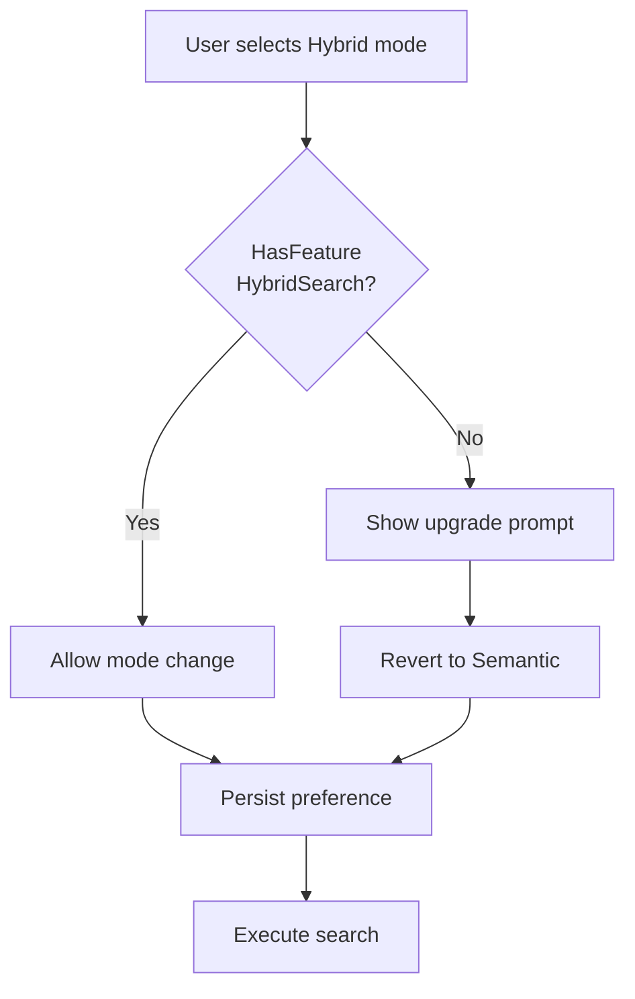

# LCS-DES-051d: Search Mode Toggle

## Document Control

| Field              | Value                                                        |
| :----------------- | :----------------------------------------------------------- |
| **Document ID**    | LCS-DES-051d                                                 |
| **Feature ID**     | INF-051d                                                     |
| **Feature Name**   | Search Mode Toggle                                           |
| **Target Version** | v0.5.1d                                                      |
| **Module**         | Lexichord.Modules.RAG                                        |
| **License Tier**   | Core (Semantic/Keyword), WriterPro (Hybrid)                  |
| **Status**         | Complete                                                     |
| **Last Updated**   | 2026-02-02                                                   |
| **Depends On**     | v0.5.1c (IHybridSearchService), v0.4.6a (ReferenceViewModel) |

---

## 1. Executive Summary

### 1.1 Problem Statement

With three search strategies available (Semantic, Keyword, Hybrid), users need a way to switch between them. Additionally, Hybrid mode must be gated to WriterPro+ licenses.

### 1.2 Solution

Add a `SearchMode` enum and UI toggle to the Reference Panel. Implement license gating that redirects Core users attempting to use Hybrid mode.

---

## 2. Dependencies

| Interface              | Source Version | Purpose                 |
| :--------------------- | :------------- | :---------------------- |
| `IHybridSearchService` | v0.5.1c        | Hybrid search execution |
| `ReferenceViewModel`   | v0.4.6a        | Panel ViewModel         |
| `ILicenseContext`      | v0.0.4c        | License checking        |
| `ISettingsService`     | v0.1.6a        | Preference persistence  |

---

## 3. Data Contract

### 3.1 SearchMode Enum

```csharp
namespace Lexichord.Abstractions.Contracts;

/// <summary>
/// Defines the search strategy for document retrieval.
/// </summary>
public enum SearchMode
{
    /// <summary>Vector similarity search using embeddings.</summary>
    Semantic,

    /// <summary>BM25 keyword search using PostgreSQL full-text.</summary>
    Keyword,

    /// <summary>Combined search using RRF. Requires WriterPro.</summary>
    Hybrid
}
```

---

## 4. UI Specification

### 4.1 Search Mode Dropdown

```text
┌────────────────────────────────────────────────────────────┐
│  [🔍 Search reference documents...]  [Semantic ▾]  [⚙️]    │
├────────────────────────────────────────────────────────────┤
│  Dropdown expanded:                                        │
│  ┌─────────────────────────────┐                           │
│  │ ○ Semantic                  │  ← Vector similarity      │
│  │ ○ Keyword                   │  ← BM25 exact match       │
│  │ ● Hybrid            🔒 Pro  │  ← Combined (WriterPro)   │
│  └─────────────────────────────┘                           │
└────────────────────────────────────────────────────────────┘
```

### 4.2 Component Styling

| Component     | Theme Resource         | Width |
| :------------ | :--------------------- | :---- |
| Mode dropdown | `LexDropdownSecondary` | 100px |
| Lock icon     | `Icon.Lock.Small`      | 16px  |
| Tooltip       | `LexTooltipPrimary`    | auto  |

---

## 5. ViewModel Updates

```csharp
namespace Lexichord.Modules.RAG.ViewModels;

public partial class ReferenceViewModel : ViewModelBase
{
    private readonly ILicenseContext _licenseContext;
    private readonly ISettingsService _settingsService;
    private readonly IHybridSearchService _hybridSearch;
    private readonly ISemanticSearchService _semanticSearch;
    private readonly IBM25SearchService _bm25Search;

    [ObservableProperty]
    private SearchMode _selectedSearchMode;

    [ObservableProperty]
    private bool _isHybridLocked;

    partial void OnSelectedSearchModeChanged(SearchMode value)
    {
        if (value == SearchMode.Hybrid && !CanUseHybrid())
        {
            _logger.LogWarning("Hybrid search denied: license tier insufficient");
            ShowUpgradePrompt();
            SelectedSearchMode = SearchMode.Semantic;
            return;
        }

        _settingsService.Set("Search.DefaultMode", value.ToString());
        _logger.LogDebug("Search mode changed: {Mode}", value);
    }

    private bool CanUseHybrid()
    {
        return _licenseContext.HasFeature(FeatureFlags.RAG.HybridSearch);
    }

    public void InitializeSearchMode()
    {
        IsHybridLocked = !CanUseHybrid();

        var saved = _settingsService.Get<string>("Search.DefaultMode");
        if (Enum.TryParse<SearchMode>(saved, out var mode) &&
            (mode != SearchMode.Hybrid || CanUseHybrid()))
        {
            SelectedSearchMode = mode;
        }
        else
        {
            SelectedSearchMode = CanUseHybrid() ? SearchMode.Hybrid : SearchMode.Semantic;
        }
    }

    [RelayCommand]
    private async Task ExecuteSearchAsync(string query)
    {
        var results = SelectedSearchMode switch
        {
            SearchMode.Semantic => await _semanticSearch.SearchAsync(query, _options),
            SearchMode.Keyword => await ExecuteKeywordSearchAsync(query),
            SearchMode.Hybrid => await _hybridSearch.SearchAsync(query, _options),
            _ => throw new InvalidOperationException()
        };

        SearchResults = results.Hits;
    }

    private async Task<SearchResult> ExecuteKeywordSearchAsync(string query)
    {
        var hits = await _bm25Search.SearchAsync(query, _options.TopK);
        // Convert BM25Hits to SearchHits
        var searchHits = await ConvertToSearchHitsAsync(hits);
        return new SearchResult(searchHits, TimeSpan.Zero);
    }
}
```

---

## 6. License Gating Flow



---

## 7. Acceptance Criteria

| #   | Criterion                                                    |
| :-- | :----------------------------------------------------------- |
| 1   | Search mode dropdown shows Semantic, Keyword, Hybrid options |
| 2   | Core users see lock icon on Hybrid option                    |
| 3   | Selecting Hybrid as Core shows upgrade prompt                |
| 4   | WriterPro users can select Hybrid with no prompt             |
| 5   | Search mode preference persists across sessions              |
| 6   | Default mode is Hybrid for WriterPro, Semantic for Core      |

---

## 8. Unit Tests

```csharp
[Trait("Category", "Unit")]
[Trait("Version", "v0.5.1d")]
public class ReferenceViewModelSearchModeTests
{
    [Fact]
    public void OnSearchModeChanged_HybridWithoutLicense_RevertsToSemantic()
    {
        // Arrange
        _licenseContext.Setup(l => l.HasFeature(It.IsAny<string>())).Returns(false);

        // Act
        _sut.SelectedSearchMode = SearchMode.Hybrid;

        // Assert
        _sut.SelectedSearchMode.Should().Be(SearchMode.Semantic);
    }

    [Fact]
    public void OnSearchModeChanged_HybridWithLicense_Allowed()
    {
        // Arrange
        _licenseContext.Setup(l => l.HasFeature(It.IsAny<string>())).Returns(true);

        // Act
        _sut.SelectedSearchMode = SearchMode.Hybrid;

        // Assert
        _sut.SelectedSearchMode.Should().Be(SearchMode.Hybrid);
    }

    [Fact]
    public void InitializeSearchMode_WriterPro_DefaultsToHybrid()
    {
        _licenseContext.Setup(l => l.HasFeature(It.IsAny<string>())).Returns(true);
        _settingsService.Setup(s => s.Get<string>(It.IsAny<string>())).Returns((string?)null);

        _sut.InitializeSearchMode();

        _sut.SelectedSearchMode.Should().Be(SearchMode.Hybrid);
    }

    [Fact]
    public void InitializeSearchMode_Core_DefaultsToSemantic()
    {
        _licenseContext.Setup(l => l.HasFeature(It.IsAny<string>())).Returns(false);
        _settingsService.Setup(s => s.Get<string>(It.IsAny<string>())).Returns((string?)null);

        _sut.InitializeSearchMode();

        _sut.SelectedSearchMode.Should().Be(SearchMode.Semantic);
    }
}
```

---

## 9. Deliverable Checklist

| #   | Deliverable                                         | Status |
| :-- | :-------------------------------------------------- | :----- |
| 1   | `SearchMode` enum in Lexichord.Abstractions         | [ ]    |
| 2   | `SelectedSearchMode` property in ReferenceViewModel | [ ]    |
| 3   | Search mode dropdown in ReferenceView AXAML         | [ ]    |
| 4   | License check for Hybrid mode                       | [ ]    |
| 5   | Upgrade prompt for Core users                       | [ ]    |
| 6   | Preference persistence via ISettingsService         | [ ]    |
| 7   | Lock icon display for unlicensed Hybrid             | [ ]    |
| 8   | Unit tests for mode switching                       | [ ]    |
| 9   | Unit tests for license enforcement                  | [ ]    |

---

## 10. AXAML View Example

```xml
<!-- ReferenceView.axaml - Search Mode Toggle -->
<ComboBox x:Name="SearchModeComboBox"
          Width="100"
          SelectedItem="{Binding SelectedSearchMode}"
          Classes="secondary">
    <ComboBox.ItemTemplate>
        <DataTemplate>
            <StackPanel Orientation="Horizontal" Spacing="8">
                <TextBlock Text="{Binding ., Converter={StaticResource SearchModeConverter}}" />
                <PathIcon Data="{StaticResource Icon.Lock.Small}"
                          IsVisible="{Binding ., Converter={StaticResource HybridLockConverter}}"
                          Foreground="{DynamicResource TextMutedBrush}" />
            </StackPanel>
        </DataTemplate>
    </ComboBox.ItemTemplate>
    <x:Static Member="contracts:SearchMode.Semantic" />
    <x:Static Member="contracts:SearchMode.Keyword" />
    <x:Static Member="contracts:SearchMode.Hybrid" />
</ComboBox>
```

---

## Document History

| Version | Date       | Author         | Changes       |
| :------ | :--------- | :------------- | :------------ |
| 1.0     | 2026-01-27 | Lead Architect | Initial draft |
