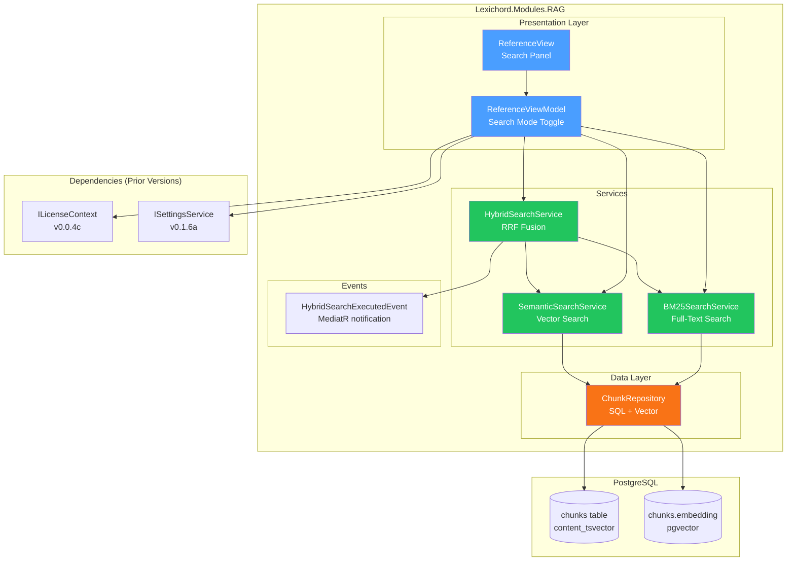
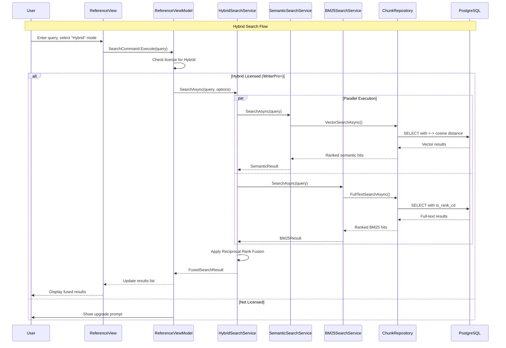

# LCS-SBD-051: Scope Breakdown — The Hybrid Engine

## Document Control

| Field            | Value                                                |
| :--------------- | :--------------------------------------------------- |
| **Document ID**  | LCS-SBD-051                                          |
| **Version**      | v0.5.1                                               |
| **Codename**     | The Hybrid Engine (BM25 + Semantic)                  |
| **Status**       | Complete                                             |
| **Last Updated** | 2026-02-02                                           |
| **Owner**        | Lead Architect                                       |
| **Depends On**   | v0.4.5 (Semantic Search), v0.4.1 (Vector Foundation) |

---

## 1. Executive Summary

### 1.1 The Vision

**v0.5.1** delivers the **Hybrid Engine** — a sophisticated retrieval system that combines keyword-based (BM25) and semantic (vector) search for superior retrieval quality. This release transforms Lexichord's search capabilities from pure semantic matching into a hybrid retrieval system that captures both exact keyword matches and conceptual similarity.

While v0.4.x established the foundational RAG pipeline (vector storage, document ingestion, and basic semantic search), the Hybrid Engine addresses a critical limitation: pure semantic search can miss exact technical terms while pure keyword search lacks conceptual understanding. By combining both approaches using Reciprocal Rank Fusion (RRF), writers get the best of both worlds.

### 1.2 Business Value

- **Superior Retrieval:** Combines exact keyword matches (BM25) with conceptual similarity (semantic) for comprehensive results.
- **Typo Resilience:** Semantic search catches conceptual matches even when keywords contain typos.
- **Technical Precision:** BM25 ensures exact technical terms, API names, and identifiers are found.
- **Industry Standard:** Hybrid search is the state-of-the-art approach used in production RAG systems.
- **Configurable Weights:** Users can tune the balance between semantic and keyword relevance.
- **Foundation:** Enables Citation Engine (v0.5.2), Context Window (v0.5.3), and advanced retrieval features.

### 1.3 Success Criteria

This release succeeds when:

1. BM25 search returns relevant results for exact keyword queries with PostgreSQL full-text search.
2. Hybrid search combines results using Reciprocal Rank Fusion with configurable weights.
3. Search mode toggle allows users to switch between Semantic, Keyword, and Hybrid modes.
4. Hybrid search completes in <300ms for 50K chunks.
5. All features respect license gating (WriterPro+ for Hybrid search).

### 1.4 License Gating

The Hybrid Engine is a **WriterPro** feature. Lower tiers will see:

- Core users retain access to basic semantic search (from v0.4.5)
- BM25 keyword search available to all tiers
- Hybrid fusion mode requires WriterPro+
- Search mode toggle shows "Upgrade" prompt for Hybrid mode on Core tier

---

## 2. Dependencies on Prior Versions

| Component                | Source Version | Usage in v0.5.1                        |
| :----------------------- | :------------- | :------------------------------------- |
| `ISemanticSearchService` | v0.4.5a        | Base semantic search for hybrid fusion |
| `IChunkRepository`       | v0.4.1c        | Chunk retrieval and BM25 queries       |
| `IDocumentRepository`    | v0.4.1c        | Document metadata access               |
| `SearchHit`              | v0.4.5a        | Search result models (extended)        |
| `SearchResult`           | v0.4.5a        | Aggregate search result container      |
| `SearchOptions`          | v0.4.5a        | Search configuration (TopK, filters)   |
| `ReferenceView`          | v0.4.6a        | UI foundation for search mode toggle   |
| `ILicenseContext`        | v0.0.4c        | Feature gating (Hybrid = WriterPro)    |
| `IDbConnectionFactory`   | v0.0.5b        | PostgreSQL connection for full-text    |
| `IMediator`              | v0.0.7a        | Event publishing                       |
| `IConfiguration`         | v0.0.3d        | Search weight configuration            |
| `ILogger<T>`             | v0.0.3b        | Structured logging                     |

---

## 3. Sub-Part Specifications

### 3.1 v0.5.1a: BM25 Index Schema

| Field            | Value                   |
| :--------------- | :---------------------- |
| **Sub-Part ID**  | INF-051a                |
| **Title**        | BM25 Index Schema       |
| **Module**       | `Lexichord.Modules.RAG` |
| **License Tier** | Core                    |

**Goal:** Extend the `chunks` table with full-text search support using PostgreSQL tsvector.

**Key Deliverables:**

- Add `content_tsvector TSVECTOR` column to chunks table
- Create GIN index on content_tsvector for fast full-text search
- Create trigger to auto-update tsvector on INSERT/UPDATE
- FluentMigrator migration: `Migration_004_FullTextSearch.cs`
- Support for English language configuration
- Unit tests for migration verification

**Key Interfaces:**

```csharp
namespace Lexichord.Modules.RAG.Migrations;

/// <summary>
/// Migration to add full-text search support to the chunks table.
/// </summary>
[Migration(202601271400)]
public class Migration_004_FullTextSearch : Migration
{
    public override void Up()
    {
        Execute.Sql(@"
            ALTER TABLE chunks
            ADD COLUMN content_tsvector TSVECTOR
            GENERATED ALWAYS AS (to_tsvector('english', content)) STORED;
        ");

        Execute.Sql(@"
            CREATE INDEX idx_chunks_content_tsvector
            ON chunks USING GIN(content_tsvector);
        ");
    }

    public override void Down()
    {
        Execute.Sql("DROP INDEX IF EXISTS idx_chunks_content_tsvector;");
        Execute.Sql("ALTER TABLE chunks DROP COLUMN IF EXISTS content_tsvector;");
    }
}
```

**Storage Schema:**

```sql
-- Extended chunks table
ALTER TABLE chunks ADD COLUMN content_tsvector TSVECTOR
    GENERATED ALWAYS AS (to_tsvector('english', content)) STORED;

-- GIN index for fast full-text search
CREATE INDEX idx_chunks_content_tsvector ON chunks USING GIN(content_tsvector);
```

**Dependencies:**

- v0.4.1b: chunks table schema
- FluentMigrator (v0.0.5c)

---

### 3.2 v0.5.1b: BM25 Search Implementation

| Field            | Value                      |
| :--------------- | :------------------------- |
| **Sub-Part ID**  | INF-051b                   |
| **Title**        | BM25 Search Implementation |
| **Module**       | `Lexichord.Modules.RAG`    |
| **License Tier** | Core                       |

**Goal:** Implement `IBM25SearchService` that executes PostgreSQL full-text search with ranking.

**Key Deliverables:**

- `IBM25SearchService` interface in `Lexichord.Abstractions`
- `BM25SearchService` implementation using PostgreSQL `ts_rank_cd()`
- `BM25Hit` record capturing chunk ID, score, and matched terms
- Support for phrase queries with `plainto_tsquery()` and `phraseto_tsquery()`
- Query normalization and stemming via PostgreSQL
- Unit tests for BM25 search accuracy

**Key Interfaces:**

```csharp
namespace Lexichord.Abstractions.Contracts;

/// <summary>
/// Executes BM25 (keyword) search against indexed document chunks.
/// </summary>
/// <remarks>
/// <para>Uses PostgreSQL full-text search with ts_rank_cd for scoring.</para>
/// <para>Supports both simple and phrase queries.</para>
/// </remarks>
public interface IBM25SearchService
{
    /// <summary>
    /// Searches for chunks matching the query using BM25 ranking.
    /// </summary>
    /// <param name="query">The search query (keywords or phrase).</param>
    /// <param name="topK">Maximum number of results to return.</param>
    /// <param name="ct">Cancellation token.</param>
    /// <returns>Ranked list of matching chunks.</returns>
    Task<IReadOnlyList<BM25Hit>> SearchAsync(
        string query,
        int topK,
        CancellationToken ct = default);

    /// <summary>
    /// Searches with phrase matching for exact sequences.
    /// </summary>
    Task<IReadOnlyList<BM25Hit>> SearchPhraseAsync(
        string phrase,
        int topK,
        CancellationToken ct = default);
}

/// <summary>
/// A single hit from BM25 search.
/// </summary>
/// <param name="ChunkId">The ID of the matching chunk.</param>
/// <param name="Score">The ts_rank_cd score (higher = more relevant).</param>
/// <param name="MatchedTerms">Terms from the query that matched.</param>
public record BM25Hit(
    Guid ChunkId,
    float Score,
    IReadOnlyList<string> MatchedTerms);
```

**Search Query Pattern:**

```sql
SELECT
    id AS chunk_id,
    ts_rank_cd(content_tsvector, query) AS score,
    ts_headline('english', content, query, 'MaxFragments=3') AS headline
FROM chunks, plainto_tsquery('english', @query) query
WHERE content_tsvector @@ query
ORDER BY score DESC
LIMIT @topK;
```

**Dependencies:**

- v0.5.1a: content_tsvector column and GIN index
- v0.4.1c: IChunkRepository (chunk metadata)

---

### 3.3 v0.5.1c: Hybrid Fusion Algorithm

| Field            | Value                   |
| :--------------- | :---------------------- |
| **Sub-Part ID**  | INF-051c                |
| **Title**        | Hybrid Fusion Algorithm |
| **Module**       | `Lexichord.Modules.RAG` |
| **License Tier** | WriterPro               |

**Goal:** Implement `IHybridSearchService` that combines BM25 and semantic results using Reciprocal Rank Fusion (RRF).

**Key Deliverables:**

- `IHybridSearchService` interface in `Lexichord.Abstractions`
- `HybridSearchService` implementation with parallel search execution
- `HybridSearchOptions` record with configurable weights
- Reciprocal Rank Fusion (RRF) algorithm implementation
- `HybridSearchExecutedEvent` MediatR notification
- Unit tests with fusion accuracy verification

**Key Interfaces:**

```csharp
namespace Lexichord.Abstractions.Contracts;

/// <summary>
/// Combines BM25 and semantic search for hybrid retrieval.
/// </summary>
/// <remarks>
/// <para>Executes both search types in parallel for performance.</para>
/// <para>Uses Reciprocal Rank Fusion to merge ranked result lists.</para>
/// <para>Configurable weights control the balance between semantic and keyword relevance.</para>
/// </remarks>
public interface IHybridSearchService
{
    /// <summary>
    /// Executes hybrid search combining semantic and keyword matching.
    /// </summary>
    /// <param name="query">The search query.</param>
    /// <param name="options">Search configuration.</param>
    /// <param name="ct">Cancellation token.</param>
    /// <returns>Fused search results ranked by combined score.</returns>
    Task<SearchResult> SearchAsync(
        string query,
        SearchOptions options,
        CancellationToken ct = default);
}

/// <summary>
/// Configuration options for hybrid search.
/// </summary>
public record HybridSearchOptions
{
    /// <summary>Weight for semantic (vector) search results. Default: 0.7.</summary>
    public float SemanticWeight { get; init; } = 0.7f;

    /// <summary>Weight for BM25 (keyword) search results. Default: 0.3.</summary>
    public float BM25Weight { get; init; } = 0.3f;

    /// <summary>RRF constant k. Higher values reduce the impact of rank differences. Default: 60.</summary>
    public int RRFConstant { get; init; } = 60;
}
```

**Reciprocal Rank Fusion Algorithm:**

```text
FOR each unique chunk across both result sets:
│
├── Calculate RRF score:
│   RRF_score = Σ (weight_i / (k + rank_i)) for each ranking system
│
│   Where:
│   - weight_i = SemanticWeight or BM25Weight
│   - k = RRF constant (default 60)
│   - rank_i = 1-based position in that ranking (or ∞ if not present)
│
├── Example:
│   - Chunk appears at rank 1 in semantic, rank 5 in BM25
│   - SemanticWeight = 0.7, BM25Weight = 0.3, k = 60
│   - RRF = 0.7/(60+1) + 0.3/(60+5) = 0.0115 + 0.0046 = 0.0161
│
└── Sort all chunks by RRF_score descending
```

**MediatR Event:**

```csharp
namespace Lexichord.Modules.RAG.Events;

/// <summary>
/// Published when a hybrid search completes.
/// </summary>
public record HybridSearchExecutedEvent(
    string Query,
    int SemanticHitCount,
    int BM25HitCount,
    int FusedResultCount,
    TimeSpan Duration,
    HybridSearchOptions Options) : INotification;
```

**Dependencies:**

- v0.5.1b: IBM25SearchService (keyword search)
- v0.4.5a: ISemanticSearchService (vector search)
- v0.4.5a: SearchResult, SearchHit records

---

### 3.4 v0.5.1d: Search Mode Toggle

| Field            | Value                                 |
| :--------------- | :------------------------------------ |
| **Sub-Part ID**  | INF-051d                              |
| **Title**        | Search Mode Toggle                    |
| **Module**       | `Lexichord.Modules.RAG`               |
| **License Tier** | Core (Hybrid mode requires WriterPro) |

**Goal:** Add `SearchMode` enum and UI toggle to allow users to switch between search strategies.

**Key Deliverables:**

- `SearchMode` enum (Semantic, Keyword, Hybrid)
- Update `ReferenceViewModel` with search mode property
- Search mode toggle UI in Reference Panel toolbar
- License gating for Hybrid mode (WriterPro+)
- Default mode per license tier (Hybrid for WriterPro, Semantic for Core)
- User preference persistence via ISettingsService
- Unit tests for mode switching and license enforcement

**Key Interfaces:**

```csharp
namespace Lexichord.Abstractions.Contracts;

/// <summary>
/// Defines the search strategy for document retrieval.
/// </summary>
public enum SearchMode
{
    /// <summary>Vector similarity search using embeddings.</summary>
    Semantic,

    /// <summary>BM25 keyword search using PostgreSQL full-text.</summary>
    Keyword,

    /// <summary>Combined search using Reciprocal Rank Fusion. Requires WriterPro.</summary>
    Hybrid
}
```

**Key UI Components (Search Mode Toggle):**

```text
┌────────────────────────────────────────────────────────────────┐
│  [🔍 Search reference documents...]  [Semantic ▾] [⚙️]         │
├────────────────────────────────────────────────────────────────┤
│                                                                │
│  Search mode dropdown:                                         │
│  ┌─────────────────────┐                                       │
│  │ ○ Semantic          │ ← Vector similarity                   │
│  │ ○ Keyword           │ ← BM25 exact match                    │
│  │ ● Hybrid      🔒    │ ← Combined (WriterPro)                │
│  └─────────────────────┘                                       │
│                                                                │
└────────────────────────────────────────────────────────────────┘
```

**License Gating Logic:**

```text
ON search mode change:
│
├── If mode = Hybrid:
│   ├── Check ILicenseContext.HasFeature(FeatureFlags.RAG.HybridSearch)
│   │   ├── YES → Allow mode change
│   │   └── NO → Show upgrade prompt, revert to previous mode
│   │
│   └── Log mode change event
│
├── If mode = Keyword or Semantic:
│   └── Allow (available to all tiers)
│
└── Persist selection to ISettingsService
```

**Dependencies:**

- v0.5.1c: IHybridSearchService
- v0.4.6a: ReferenceViewModel
- v0.1.6a: ISettingsService (preference persistence)
- v0.0.4c: ILicenseContext (feature gating)

---

## 4. Implementation Checklist

| #         | Sub-Part | Task                                                  | Est. Hours   |
| :-------- | :------- | :---------------------------------------------------- | :----------- |
| 1         | v0.5.1a  | Create Migration_004_FullTextSearch.cs                | 1            |
| 2         | v0.5.1a  | Add content_tsvector column with GENERATED ALWAYS     | 0.5          |
| 3         | v0.5.1a  | Create GIN index on content_tsvector                  | 0.5          |
| 4         | v0.5.1a  | Unit tests for migration up/down                      | 1            |
| 5         | v0.5.1b  | Create IBM25SearchService interface in Abstractions   | 0.5          |
| 6         | v0.5.1b  | Create BM25Hit record                                 | 0.5          |
| 7         | v0.5.1b  | Implement BM25SearchService with ts_rank_cd           | 3            |
| 8         | v0.5.1b  | Implement phrase search with phraseto_tsquery         | 1            |
| 9         | v0.5.1b  | Query normalization and sanitization                  | 1            |
| 10        | v0.5.1b  | Unit tests for BM25 search accuracy                   | 2            |
| 11        | v0.5.1c  | Create IHybridSearchService interface in Abstractions | 0.5          |
| 12        | v0.5.1c  | Create HybridSearchOptions record                     | 0.5          |
| 13        | v0.5.1c  | Implement parallel search execution (Task.WhenAll)    | 1            |
| 14        | v0.5.1c  | Implement Reciprocal Rank Fusion algorithm            | 2            |
| 15        | v0.5.1c  | Create HybridSearchExecutedEvent                      | 0.5          |
| 16        | v0.5.1c  | Unit tests for RRF accuracy                           | 2            |
| 17        | v0.5.1d  | Create SearchMode enum in Abstractions                | 0.5          |
| 18        | v0.5.1d  | Update ReferenceViewModel with SearchMode property    | 1            |
| 19        | v0.5.1d  | Add search mode toggle dropdown to Reference Panel    | 2            |
| 20        | v0.5.1d  | Implement license gating for Hybrid mode              | 1            |
| 21        | v0.5.1d  | Persist search mode preference                        | 1            |
| 22        | v0.5.1d  | Unit tests for mode switching and license enforcement | 1.5          |
| 23        | All      | Integration tests for hybrid search pipeline          | 2            |
| 24        | All      | DI registration in RAGModule.cs                       | 0.5          |
| 25        | All      | Performance benchmarks (50K chunks target)            | 1            |
| **Total** |          |                                                       | **28 hours** |

---

## 5. Dependency Matrix

### 5.1 Required Interfaces (from earlier versions)

| Interface                | Source Version | Purpose                     |
| :----------------------- | :------------- | :-------------------------- |
| `ISemanticSearchService` | v0.4.5a        | Vector similarity search    |
| `IChunkRepository`       | v0.4.1c        | Chunk data access           |
| `IDocumentRepository`    | v0.4.1c        | Document metadata           |
| `SearchHit`              | v0.4.5a        | Search result model         |
| `SearchResult`           | v0.4.5a        | Aggregate result container  |
| `SearchOptions`          | v0.4.5a        | Search configuration        |
| `ILicenseContext`        | v0.0.4c        | License tier checking       |
| `ISettingsService`       | v0.1.6a        | User preference persistence |
| `IDbConnectionFactory`   | v0.0.5b        | PostgreSQL connection       |

### 5.2 New Interfaces (defined in v0.5.1)

| Interface              | Defined In | Module       | Purpose                  |
| :--------------------- | :--------- | :----------- | :----------------------- |
| `IBM25SearchService`   | v0.5.1b    | Abstractions | BM25 full-text search    |
| `IHybridSearchService` | v0.5.1c    | Abstractions | Combined search with RRF |

### 5.3 New Records/DTOs (defined in v0.5.1)

| Record                      | Defined In | Purpose                     |
| :-------------------------- | :--------- | :-------------------------- |
| `BM25Hit`                   | v0.5.1b    | BM25 search result          |
| `HybridSearchOptions`       | v0.5.1c    | Hybrid search configuration |
| `HybridSearchExecutedEvent` | v0.5.1c    | MediatR hybrid search event |
| `SearchMode`                | v0.5.1d    | Search strategy enum        |

### 5.4 NuGet Packages

| Package           | Version | Purpose                     | New/Existing |
| :---------------- | :------ | :-------------------------- | :----------- |
| `Npgsql`          | 9.0.x   | PostgreSQL full-text search | Existing     |
| `FluentMigrator`  | 6.2.x   | Schema migration            | Existing     |
| (No new packages) | —       | —                           | —            |

---

## 6. Architecture Diagram



---

## 7. Data Flow Diagram



---

## 8. Risks & Mitigations

| Risk                                              | Impact | Probability | Mitigation                                                  |
| :------------------------------------------------ | :----- | :---------- | :---------------------------------------------------------- |
| BM25 returns no results for semantic-only queries | Medium | Medium      | Fall back to semantic-only if BM25 returns empty            |
| RRF weights not optimal for all content types     | Medium | Medium      | User-configurable weights, document recommended defaults    |
| Full-text index increases storage requirements    | Low    | High        | Acceptable trade-off; GIN index is space-efficient          |
| Parallel search increases latency variance        | Low    | Medium      | Use Task.WhenAll with timeout; return partial results       |
| Migration fails on existing large chunks tables   | High   | Low         | Test on production-like dataset; provide rollback migration |
| Stemming/language mismatch for non-English        | Medium | Medium      | Document English-only limitation; plan i18n in v0.5.x+      |

---

## 9. Success Metrics

| Metric                         | Target           | Measurement                    |
| :----------------------------- | :--------------- | :----------------------------- |
| Hybrid search latency (50K)    | < 300ms          | Stopwatch timing end-to-end    |
| BM25 search latency (50K)      | < 100ms          | PostgreSQL EXPLAIN ANALYZE     |
| Semantic search latency (50K)  | < 200ms          | Baseline from v0.4.5           |
| Retrieval accuracy (MRR)       | > 0.7            | Test corpus with gold answers  |
| Hybrid vs Semantic improvement | +15% Precision@5 | A/B comparison on test queries |
| Memory overhead                | < 10MB           | Memory profiler during search  |

---

## 10. What This Enables

After v0.5.1, Lexichord will support:

- **v0.5.2 (Citation Engine):** Source attribution with precise document location.
- **v0.5.3 (Context Window):** Expand retrieved chunks with surrounding context.
- **v0.5.4 (Relevance Tuner):** Query analysis, synonym expansion, suggestions.
- **v0.5.5 (Filter System):** Scoped search by path, extension, date range.
- **Future:** AI-powered answer generation using hybrid-retrieved context.

---

## 11. Decision Trees

### 11.1 Which Search Mode Should Execute?

```text
START: "User initiates search"
│
├── What is the selected SearchMode?
│   │
│   ├── Semantic → Execute SemanticSearchService only
│   │
│   ├── Keyword → Execute BM25SearchService only
│   │
│   └── Hybrid → Check license
│       │
│       ├── HasFeature(FeatureFlags.RAG.HybridSearch)?
│       │   ├── YES → Execute HybridSearchService (parallel)
│       │   └── NO → Show upgrade prompt, fall back to Semantic
│       │
│       └── Return fused results
│
└── Display results in ReferenceView
```

### 11.2 How Should RRF Handle Missing Chunks?

```text
START: "Merging results from Semantic and BM25"
│
├── For each unique ChunkId across both result sets:
│   │
│   ├── Is ChunkId in Semantic results?
│   │   ├── YES → Get semantic_rank (1-based position)
│   │   └── NO → semantic_rank = infinity → semantic_contribution = 0
│   │
│   ├── Is ChunkId in BM25 results?
│   │   ├── YES → Get bm25_rank (1-based position)
│   │   └── NO → bm25_rank = infinity → bm25_contribution = 0
│   │
│   └── Calculate RRF score = semantic_contribution + bm25_contribution
│
├── Sort by RRF score descending
│
└── Return top K results
```

---

## 12. User Stories

| ID    | Role             | Story                                                                                                                | Acceptance Criteria                                                      |
| :---- | :--------------- | :------------------------------------------------------------------------------------------------------------------- | :----------------------------------------------------------------------- |
| US-01 | Technical Writer | As a writer, I want to search my documents using both keywords and concepts so that I don't miss relevant content.   | Hybrid search returns results matching exact terms AND similar concepts. |
| US-02 | Developer        | As a developer, I want to find exact API references by name so that I get precise matches.                           | BM25 mode returns exact keyword matches ranked by relevance.             |
| US-03 | Core User        | As a Core user, I want to continue using basic search so that I'm not blocked.                                       | Core users can use Semantic and Keyword modes without upgrade.           |
| US-04 | WriterPro User   | As a WriterPro user, I want Hybrid search as my default so that I get the best results.                              | Hybrid mode is default for WriterPro; preference persists.               |
| US-05 | Power User       | As a power user, I want to adjust the balance between semantic and keyword search so that I can tune for my content. | Settings allow adjusting SemanticWeight and BM25Weight.                  |

---

## 13. Use Cases

### UC-01: Execute Hybrid Search

**Preconditions:**

- User has WriterPro license
- Documents have been indexed (chunks table populated)
- Full-text index exists (content_tsvector)

**Flow:**

1. User opens Reference Panel.
2. User selects "Hybrid" from search mode dropdown.
3. User enters query "authentication OAuth flow".
4. System executes semantic search (conceptual matches).
5. System executes BM25 search (keyword matches) in parallel.
6. System applies RRF to merge and rank results.
7. System displays fused results with relevance scores.
8. User clicks a result to navigate to source document.

**Postconditions:**

- Results include both exact "OAuth" matches and conceptually similar "login" content
- HybridSearchExecutedEvent published for telemetry

---

### UC-02: Core User Attempts Hybrid Search

**Preconditions:**

- User has Core license (free tier)
- User is on Reference Panel with search mode visible

**Flow:**

1. User clicks search mode dropdown.
2. User selects "Hybrid" mode.
3. System checks ILicenseContext for Hybrid feature.
4. System displays upgrade prompt: "Hybrid Search requires WriterPro."
5. User clicks "Maybe Later".
6. System reverts to previous search mode (Semantic).

**Postconditions:**

- Search mode remains Semantic
- User is not blocked from using the application

---

## 14. Unit Testing Requirements

### 14.1 BM25SearchService Tests

```csharp
[Trait("Category", "Unit")]
[Trait("Version", "v0.5.1b")]
public class BM25SearchServiceTests
{
    private readonly BM25SearchService _sut;
    private readonly Mock<IDbConnectionFactory> _connectionFactory;

    [Fact]
    public async Task SearchAsync_WithExactKeyword_ReturnsMatchingChunks()
    {
        // Arrange
        const string query = "authentication";

        // Act
        var results = await _sut.SearchAsync(query, topK: 10);

        // Assert
        results.Should().NotBeEmpty();
        results.All(r => r.MatchedTerms.Contains("authent")).Should().BeTrue();
    }

    [Theory]
    [InlineData("OAuth flow", 5)]
    [InlineData("API reference", 10)]
    public async Task SearchAsync_WithMultipleKeywords_ReturnsRankedResults(
        string query, int topK)
    {
        // Act
        var results = await _sut.SearchAsync(query, topK);

        // Assert
        results.Should().HaveCountLessOrEqualTo(topK);
        results.Should().BeInDescendingOrder(r => r.Score);
    }

    [Fact]
    public async Task SearchAsync_WithNoMatches_ReturnsEmptyList()
    {
        // Arrange
        const string query = "xyznonexistentterm123";

        // Act
        var results = await _sut.SearchAsync(query, topK: 10);

        // Assert
        results.Should().BeEmpty();
    }
}
```

### 14.2 HybridSearchService Tests

```csharp
[Trait("Category", "Unit")]
[Trait("Version", "v0.5.1c")]
public class HybridSearchServiceTests
{
    private readonly HybridSearchService _sut;
    private readonly Mock<ISemanticSearchService> _semanticSearch;
    private readonly Mock<IBM25SearchService> _bm25Search;

    [Fact]
    public async Task SearchAsync_ExecutesBothSearchesInParallel()
    {
        // Arrange
        var semanticTask = SetupSemanticResults(delay: 100);
        var bm25Task = SetupBM25Results(delay: 100);

        // Act
        var stopwatch = Stopwatch.StartNew();
        var results = await _sut.SearchAsync("query", new SearchOptions());
        stopwatch.Stop();

        // Assert - parallel execution should take ~100ms, not ~200ms
        stopwatch.ElapsedMilliseconds.Should().BeLessThan(150);
    }

    [Fact]
    public async Task SearchAsync_AppliesRRFCorrectly()
    {
        // Arrange
        var semanticHits = new[] { MockHit("chunk1", rank: 1), MockHit("chunk2", rank: 2) };
        var bm25Hits = new[] { MockHit("chunk2", rank: 1), MockHit("chunk3", rank: 2) };

        // Act
        var results = await _sut.SearchAsync("query", new SearchOptions());

        // Assert - chunk2 should rank first (appears in both)
        results.Hits[0].Chunk.Id.Should().Be("chunk2");
    }

    [Theory]
    [InlineData(1.0f, 0.0f)]  // Semantic only
    [InlineData(0.0f, 1.0f)]  // BM25 only
    [InlineData(0.5f, 0.5f)]  // Equal weights
    public async Task SearchAsync_RespectsWeightConfiguration(
        float semanticWeight, float bm25Weight)
    {
        // Arrange
        var options = new HybridSearchOptions
        {
            SemanticWeight = semanticWeight,
            BM25Weight = bm25Weight
        };

        // Act & Assert based on weight configuration
    }
}
```

---

## 15. Observability & Logging

| Level   | Source              | Message Template                                                                                           |
| :------ | :------------------ | :--------------------------------------------------------------------------------------------------------- |
| Debug   | BM25SearchService   | `"BM25 search starting: query='{Query}', topK={TopK}"`                                                     |
| Debug   | BM25SearchService   | `"BM25 search completed: {HitCount} hits in {ElapsedMs}ms"`                                                |
| Debug   | HybridSearchService | `"Hybrid search starting: query='{Query}'"`                                                                |
| Info    | HybridSearchService | `"Hybrid search completed: semantic={SemanticHits}, bm25={BM25Hits}, fused={FusedCount} in {ElapsedMs}ms"` |
| Debug   | HybridSearchService | `"RRF fusion applied: k={K}, weights={{semantic:{SemanticWeight}, bm25:{BM25Weight}}}"`                    |
| Warning | ReferenceViewModel  | `"Hybrid search denied: license tier {Tier} insufficient"`                                                 |
| Debug   | ReferenceViewModel  | `"Search mode changed: {OldMode} → {NewMode}"`                                                             |
| Error   | BM25SearchService   | `"BM25 search failed: {Error}"`                                                                            |

---

## 16. UI/UX Specifications

### 16.1 Search Mode Toggle

```text
┌──────────────────────────────────────────────────────────────────────────┐
│  Reference Panel                                                   [×]   │
├──────────────────────────────────────────────────────────────────────────┤
│  [🔍 Search your documents...]         Mode: [Hybrid ▾]    [⚙️]          │
├──────────────────────────────────────────────────────────────────────────┤
│                                                                          │
│  Dropdown expanded:                                                      │
│  ┌───────────────────────────────┐                                       │
│  │ ○ Semantic                    │  ← Vector similarity (default Core)  │
│  │ ○ Keyword                     │  ← BM25 exact match                  │
│  │ ● Hybrid               🔒 Pro │  ← Combined (WriterPro default)      │
│  └───────────────────────────────┘                                       │
│                                                                          │
└──────────────────────────────────────────────────────────────────────────┘
```

### 16.2 Component Styling Requirements

| Component         | Theme Resource         | Notes                              |
| :---------------- | :--------------------- | :--------------------------------- |
| Mode dropdown     | `LexDropdownSecondary` | Compact style, 100px width         |
| Lock icon (Pro)   | `Icon.Lock.Small`      | Show next to Hybrid for Core users |
| Tooltip (upgrade) | `LexTooltipPrimary`    | "Upgrade to WriterPro for Hybrid"  |
| Search input      | `LexTextBoxSearch`     | Existing from v0.4.6               |

---

## 17. Acceptance Criteria (QA)

| #   | Category           | Criterion                                                       |
| :-- | :----------------- | :-------------------------------------------------------------- |
| 1   | **Functional**     | BM25 search returns chunks containing exact query terms         |
| 2   | **Functional**     | Semantic search returns conceptually similar chunks             |
| 3   | **Functional**     | Hybrid search combines results from both strategies             |
| 4   | **Functional**     | RRF correctly ranks chunks appearing in both result sets higher |
| 5   | **Functional**     | Search mode toggle persists across sessions                     |
| 6   | **License Gate**   | Core users cannot select Hybrid mode                            |
| 7   | **License Gate**   | WriterPro users default to Hybrid mode                          |
| 8   | **Performance**    | Hybrid search completes in < 300ms for 50K chunks               |
| 9   | **Performance**    | BM25 search completes in < 100ms for 50K chunks                 |
| 10  | **Error Handling** | Empty query returns empty results without error                 |
| 11  | **Error Handling** | Database connection failure shows user-friendly error           |
| 12  | **Migration**      | content_tsvector column created successfully on upgrade         |

---

## 18. Verification Commands

```bash
# ═══════════════════════════════════════════════════════════════════════════
# v0.5.1 Verification
# ═══════════════════════════════════════════════════════════════════════════

# 1. Run database migration
dotnet run --project src/Lexichord.Host -- migrate

# 2. Verify tsvector column exists
psql -d lexichord -c "SELECT column_name, data_type FROM information_schema.columns WHERE table_name = 'chunks' AND column_name = 'content_tsvector';"

# 3. Verify GIN index exists
psql -d lexichord -c "SELECT indexname FROM pg_indexes WHERE tablename = 'chunks' AND indexname LIKE '%tsvector%';"

# 4. Build solution
dotnet build

# 5. Run unit tests for v0.5.1 components
dotnet test --filter "Category=Unit&FullyQualifiedName~v0.5.1"

# 6. Run BM25 search tests
dotnet test --filter "FullyQualifiedName~BM25SearchService"

# 7. Run Hybrid search tests
dotnet test --filter "FullyQualifiedName~HybridSearchService"

# 8. Manual verification:
# a) Open Reference Panel
# b) Verify search mode dropdown shows Semantic/Keyword/Hybrid
# c) Select Hybrid (should work with WriterPro license)
# d) Search "authentication login" - should return both exact and similar matches
# e) Compare Semantic-only vs Hybrid results
```

---

## 19. Deliverable Checklist

| #   | Deliverable                                            | Status |
| :-- | :----------------------------------------------------- | :----- |
| 1   | `Migration_004_FullTextSearch.cs` with tsvector column | [x]    |
| 2   | `IBM25SearchService` interface in Abstractions         | [x]    |
| 3   | `BM25Hit` record                                       | [x] *  |
| 4   | `BM25SearchService` implementation                     | [x]    |
| 5   | `IHybridSearchService` interface in Abstractions       | [x]    |
| 6   | `HybridSearchOptions` record                           | [x]    |
| 7   | `HybridSearchService` with RRF implementation          | [x]    |
| 8   | `HybridSearchExecutedEvent` MediatR notification       | [x]    |
| 9   | `SearchMode` enum                                      | [ ]    |
| 10  | `ReferenceViewModel` updated with SearchMode property  | [ ]    |
| 11  | Search mode toggle UI in Reference Panel               | [ ]    |
| 12  | License gating for Hybrid mode                         | [ ]    |
| 13  | Unit tests for BM25SearchService                       | [x]    |
| 14  | Unit tests for HybridSearchService                     | [x]    |
| 15  | Integration tests for hybrid pipeline                  | [ ]    |
| 16  | DI registration in RAGModule.cs                        | [x]    |

> \* `BM25Hit` adapted to use existing `SearchHit` record per project convention.
> \*\* BM25 and Hybrid registrations added (v0.5.1b, v0.5.1c).

---

## 20. Code Examples

### 20.1 BM25SearchService Implementation

```csharp
namespace Lexichord.Modules.RAG.Services;

/// <summary>
/// Implements BM25 search using PostgreSQL full-text search.
/// </summary>
public sealed class BM25SearchService : IBM25SearchService
{
    private readonly IDbConnectionFactory _connectionFactory;
    private readonly ILogger<BM25SearchService> _logger;

    public BM25SearchService(
        IDbConnectionFactory connectionFactory,
        ILogger<BM25SearchService> logger)
    {
        _connectionFactory = connectionFactory;
        _logger = logger;
    }

    /// <inheritdoc />
    public async Task<IReadOnlyList<BM25Hit>> SearchAsync(
        string query,
        int topK,
        CancellationToken ct = default)
    {
        if (string.IsNullOrWhiteSpace(query))
        {
            return Array.Empty<BM25Hit>();
        }

        _logger.LogDebug("BM25 search starting: query='{Query}', topK={TopK}", query, topK);
        var stopwatch = Stopwatch.StartNew();

        await using var connection = await _connectionFactory.CreateConnectionAsync(ct);

        const string sql = @"
            SELECT
                c.id AS chunk_id,
                ts_rank_cd(c.content_tsvector, query) AS score,
                ARRAY(SELECT DISTINCT unnest(tsvector_to_array(query))) AS matched_terms
            FROM chunks c, plainto_tsquery('english', @query) query
            WHERE c.content_tsvector @@ query
            ORDER BY score DESC
            LIMIT @topK;
        ";

        var results = await connection.QueryAsync<BM25HitDto>(
            sql,
            new { query, topK },
            commandTimeout: 30);

        var hits = results.Select(r => new BM25Hit(
            r.ChunkId,
            r.Score,
            r.MatchedTerms ?? Array.Empty<string>()
        )).ToList();

        stopwatch.Stop();
        _logger.LogDebug(
            "BM25 search completed: {HitCount} hits in {ElapsedMs}ms",
            hits.Count,
            stopwatch.ElapsedMilliseconds);

        return hits.AsReadOnly();
    }

    /// <inheritdoc />
    public async Task<IReadOnlyList<BM25Hit>> SearchPhraseAsync(
        string phrase,
        int topK,
        CancellationToken ct = default)
    {
        // Use phraseto_tsquery for exact phrase matching
        const string sql = @"
            SELECT
                c.id AS chunk_id,
                ts_rank_cd(c.content_tsvector, query) AS score,
                ARRAY(SELECT DISTINCT unnest(tsvector_to_array(query))) AS matched_terms
            FROM chunks c, phraseto_tsquery('english', @phrase) query
            WHERE c.content_tsvector @@ query
            ORDER BY score DESC
            LIMIT @topK;
        ";

        await using var connection = await _connectionFactory.CreateConnectionAsync(ct);
        var results = await connection.QueryAsync<BM25HitDto>(sql, new { phrase, topK });

        return results.Select(r => new BM25Hit(
            r.ChunkId,
            r.Score,
            r.MatchedTerms ?? Array.Empty<string>()
        )).ToList().AsReadOnly();
    }

    private record BM25HitDto(Guid ChunkId, float Score, string[]? MatchedTerms);
}
```

### 20.2 HybridSearchService Implementation

```csharp
namespace Lexichord.Modules.RAG.Services;

/// <summary>
/// Combines semantic and BM25 search using Reciprocal Rank Fusion.
/// </summary>
public sealed class HybridSearchService : IHybridSearchService
{
    private readonly ISemanticSearchService _semanticSearch;
    private readonly IBM25SearchService _bm25Search;
    private readonly IChunkRepository _chunkRepository;
    private readonly IOptions<HybridSearchOptions> _options;
    private readonly IMediator _mediator;
    private readonly ILogger<HybridSearchService> _logger;

    public HybridSearchService(
        ISemanticSearchService semanticSearch,
        IBM25SearchService bm25Search,
        IChunkRepository chunkRepository,
        IOptions<HybridSearchOptions> options,
        IMediator mediator,
        ILogger<HybridSearchService> logger)
    {
        _semanticSearch = semanticSearch;
        _bm25Search = bm25Search;
        _chunkRepository = chunkRepository;
        _options = options;
        _mediator = mediator;
        _logger = logger;
    }

    /// <inheritdoc />
    public async Task<SearchResult> SearchAsync(
        string query,
        SearchOptions options,
        CancellationToken ct = default)
    {
        _logger.LogDebug("Hybrid search starting: query='{Query}'", query);
        var stopwatch = Stopwatch.StartNew();

        // Fetch more results than needed for better fusion
        var expandedTopK = options.TopK * 2;

        // Execute both searches in parallel
        var semanticTask = _semanticSearch.SearchAsync(
            query,
            options with { TopK = expandedTopK },
            ct);
        var bm25Task = _bm25Search.SearchAsync(query, expandedTopK, ct);

        await Task.WhenAll(semanticTask, bm25Task);

        var semanticResult = semanticTask.Result;
        var bm25Hits = bm25Task.Result;

        // Apply Reciprocal Rank Fusion
        var fusedHits = ApplyRRF(
            semanticResult.Hits,
            bm25Hits,
            _options.Value);

        // Take top K after fusion
        var finalHits = fusedHits.Take(options.TopK).ToList();

        stopwatch.Stop();

        _logger.LogInformation(
            "Hybrid search completed: semantic={SemanticHits}, bm25={BM25Hits}, fused={FusedCount} in {ElapsedMs}ms",
            semanticResult.Hits.Count,
            bm25Hits.Count,
            finalHits.Count,
            stopwatch.ElapsedMilliseconds);

        // Publish event for telemetry
        await _mediator.Publish(new HybridSearchExecutedEvent(
            query,
            semanticResult.Hits.Count,
            bm25Hits.Count,
            finalHits.Count,
            stopwatch.Elapsed,
            _options.Value), ct);

        return new SearchResult(finalHits, stopwatch.Elapsed);
    }

    private IEnumerable<SearchHit> ApplyRRF(
        IReadOnlyList<SearchHit> semanticHits,
        IReadOnlyList<BM25Hit> bm25Hits,
        HybridSearchOptions opts)
    {
        var k = opts.RRFConstant;
        var scores = new Dictionary<Guid, (float Score, SearchHit? Hit)>();

        _logger.LogDebug(
            "RRF fusion applied: k={K}, weights={{semantic:{SemanticWeight}, bm25:{BM25Weight}}}",
            k, opts.SemanticWeight, opts.BM25Weight);

        // Score from semantic ranking
        for (int i = 0; i < semanticHits.Count; i++)
        {
            var hit = semanticHits[i];
            var rrfScore = opts.SemanticWeight / (k + i + 1);
            scores[hit.Chunk.Id] = (rrfScore, hit);
        }

        // Add score from BM25 ranking
        for (int i = 0; i < bm25Hits.Count; i++)
        {
            var chunkId = bm25Hits[i].ChunkId;
            var rrfScore = opts.BM25Weight / (k + i + 1);

            if (scores.TryGetValue(chunkId, out var existing))
            {
                scores[chunkId] = (existing.Score + rrfScore, existing.Hit);
            }
            else
            {
                // Chunk only in BM25 - need to fetch full hit
                // For now, create placeholder; ideally batch fetch
                scores[chunkId] = (rrfScore, null);
            }
        }

        // Return merged results sorted by fused score
        return scores
            .Where(kvp => kvp.Value.Hit != null)
            .OrderByDescending(kvp => kvp.Value.Score)
            .Select(kvp => kvp.Value.Hit!);
    }
}
```

---

## 21. Deferred Features

| Feature                            | Deferred To | Reason                                 |
| :--------------------------------- | :---------- | :------------------------------------- |
| Multi-language full-text search    | v0.5.9      | Requires language detection and config |
| Dynamic weight learning            | v0.6.x      | Requires user feedback loop            |
| Semantic + BM25 filter combination | v0.5.5      | Part of Filter System scope            |
| Query expansion for BM25           | v0.5.4      | Part of Relevance Tuner scope          |
| Cached RRF results                 | v0.5.8      | Part of Hardening scope                |

---

## 22. Changelog Entry

Upon completion of v0.5.1, the following entry will be added to `CHANGELOG.md`:

```markdown
## [0.5.1] - 2026-XX-XX

### Added

- **Hybrid Search Engine**: Combines BM25 keyword search with semantic vector search using Reciprocal Rank Fusion (RRF) for superior retrieval quality.
- **BM25 Full-Text Search**: PostgreSQL-based keyword search with ts_rank_cd scoring and phrase matching support.
- **Search Mode Toggle**: Users can switch between Semantic, Keyword, and Hybrid search modes in the Reference Panel.
- **License Gating**: Hybrid search mode requires WriterPro license; Semantic and Keyword available to all tiers.

### Changed

- Extended chunks table with `content_tsvector` column and GIN index for full-text search.
- Reference Panel toolbar now includes search mode dropdown.
- Default search mode for WriterPro users changed to Hybrid.

### Technical

- `IBM25SearchService` interface for BM25 search abstraction
- `IHybridSearchService` interface for hybrid fusion abstraction
- `BM25Hit` record for BM25 search results
- `HybridSearchOptions` record for fusion configuration
- `SearchMode` enum for search strategy selection
- `HybridSearchExecutedEvent` MediatR notification for telemetry

### Dependencies

- No new NuGet packages (uses existing Npgsql full-text capabilities)
```

---
