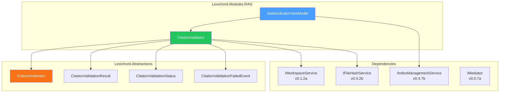
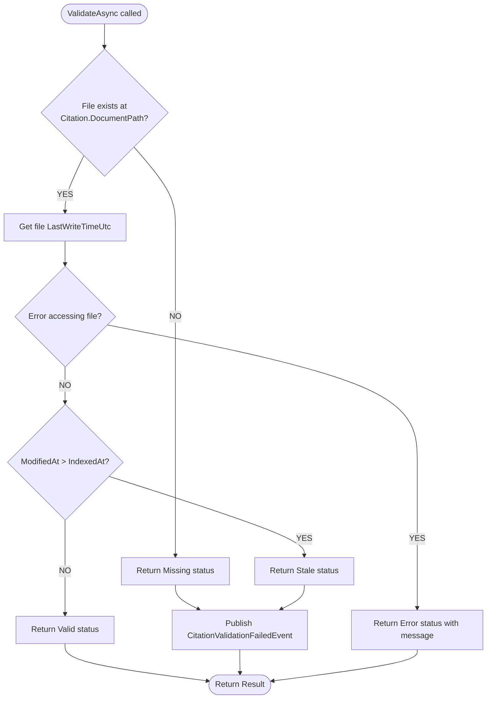

# LCS-DES-052c: Stale Citation Detection

## 1. Metadata & Categorization

| Field                 | Value                                                              |
| :-------------------- | :----------------------------------------------------------------- |
| **Feature ID**        | RAG-052c                                                           |
| **Feature Name**      | Stale Citation Detection                                           |
| **Target Version**    | v0.5.2c                                                            |
| **Module**            | `Lexichord.Modules.RAG`                                            |
| **Interfaces Module** | `Lexichord.Abstractions`                                           |
| **Swimlane**          | Memory                                                             |
| **License Tier**      | Writer Pro                                                         |
| **Feature Gate Key**  | `FeatureFlags.RAG.CitationValidation`                              |
| **Status**            | Draft                                                              |
| **Related Documents** | [LCS-SBD-052](./LCS-SBD-052.md), [LCS-DES-052a](./LCS-DES-052a.md) |

---

## 2. Executive Summary

### 2.1 The Requirement

Citations are only valuable if they point to current content. When source files are modified after indexing, citations become stale—the retrieved chunk may no longer match the actual file content. Writers need to know when their citations might be outdated so they can:

- Verify information is still accurate
- Re-index documents to get fresh content
- Update citations with new line numbers or headings

### 2.2 The Proposed Solution

Implement a **Stale Citation Detection** system that:

1. **Compares timestamps**: Checks if file's modification time exceeds citation's IndexedAt
2. **Provides validation interface**: `ICitationValidator` with single and batch operations
3. **Returns detailed results**: `CitationValidationResult` with status and metadata
4. **Publishes events**: `CitationValidationFailedEvent` for stale/missing citations
5. **Integrates with UI**: Stale indicator component with "Re-verify" action

---

## 3. Architecture & Modular Strategy

### 3.1 Component Relationships



### 3.2 Dependencies

| Dependency                | Source Version | Usage                            |
| :------------------------ | :------------- | :------------------------------- |
| `Citation`                | v0.5.2a        | Citation data to validate        |
| `IWorkspaceService`       | v0.1.2a        | File system access               |
| `IFileHashService`        | v0.4.2b        | Optional content hash comparison |
| `IIndexManagementService` | v0.4.7b        | Re-index stale documents         |
| `IMediator`               | v0.0.7a        | Event publishing                 |
| `ILogger<T>`              | v0.0.3b        | Structured logging               |

### 3.3 Licensing Behavior

Stale detection is a **Writer Pro** feature:

- **Core Users**: Stale indicator hidden, no validation performed
- **Writer Pro+**: Full stale detection with re-verify action

```csharp
public async Task<CitationValidationResult?> ValidateIfLicensedAsync(
    Citation citation, CancellationToken ct)
{
    if (!_licenseContext.HasFeature(FeatureFlags.RAG.CitationValidation))
    {
        return null; // Validation skipped for unlicensed users
    }

    return await ValidateAsync(citation, ct);
}
```

---

## 4. Data Contract

### 4.1 CitationValidationStatus Enum

```csharp
namespace Lexichord.Abstractions.Contracts;

/// <summary>
/// Status of citation validation.
/// </summary>
public enum CitationValidationStatus
{
    /// <summary>
    /// Source file unchanged since indexing. Citation is current.
    /// </summary>
    Valid,

    /// <summary>
    /// Source file has been modified since indexing. Content may differ.
    /// </summary>
    Stale,

    /// <summary>
    /// Source file no longer exists at the specified path.
    /// </summary>
    Missing,

    /// <summary>
    /// Validation could not complete due to an error (e.g., permission denied).
    /// </summary>
    Error
}
```

### 4.2 CitationValidationResult Record

```csharp
namespace Lexichord.Abstractions.Contracts;

/// <summary>
/// Result of validating a citation against its source file.
/// </summary>
/// <param name="Citation">The citation that was validated.</param>
/// <param name="IsValid">True if the source is unchanged; false otherwise.</param>
/// <param name="Status">Detailed validation status.</param>
/// <param name="CurrentModifiedAt">Current file modification timestamp, if available.</param>
/// <param name="ErrorMessage">Error details if Status is Error.</param>
public record CitationValidationResult(
    Citation Citation,
    bool IsValid,
    CitationValidationStatus Status,
    DateTime? CurrentModifiedAt,
    string? ErrorMessage)
{
    /// <summary>
    /// Gets whether the citation is stale (source modified after indexing).
    /// </summary>
    public bool IsStale => Status == CitationValidationStatus.Stale;

    /// <summary>
    /// Gets whether the source file is missing.
    /// </summary>
    public bool IsMissing => Status == CitationValidationStatus.Missing;

    /// <summary>
    /// Gets whether validation encountered an error.
    /// </summary>
    public bool HasError => Status == CitationValidationStatus.Error;

    /// <summary>
    /// Gets a user-friendly status message.
    /// </summary>
    public string StatusMessage => Status switch
    {
        CitationValidationStatus.Valid => "Citation is current",
        CitationValidationStatus.Stale => $"Source modified {FormatModifiedAt()}",
        CitationValidationStatus.Missing => "Source file not found",
        CitationValidationStatus.Error => ErrorMessage ?? "Validation failed",
        _ => "Unknown status"
    };

    private string FormatModifiedAt() => CurrentModifiedAt?.ToString("g") ?? "recently";
}
```

### 4.3 ICitationValidator Interface

```csharp
namespace Lexichord.Abstractions.Contracts;

/// <summary>
/// Validates citations against current file state to detect staleness.
/// </summary>
public interface ICitationValidator
{
    /// <summary>
    /// Validates a single citation against its source file.
    /// </summary>
    /// <param name="citation">The citation to validate.</param>
    /// <param name="ct">Cancellation token.</param>
    /// <returns>Validation result with status and metadata.</returns>
    Task<CitationValidationResult> ValidateAsync(
        Citation citation,
        CancellationToken ct = default);

    /// <summary>
    /// Validates multiple citations in parallel.
    /// </summary>
    /// <param name="citations">The citations to validate.</param>
    /// <param name="ct">Cancellation token.</param>
    /// <returns>Validation results in same order as input.</returns>
    Task<IReadOnlyList<CitationValidationResult>> ValidateBatchAsync(
        IEnumerable<Citation> citations,
        CancellationToken ct = default);

    /// <summary>
    /// Validates a citation only if the user has a valid license.
    /// Returns null for unlicensed users.
    /// </summary>
    Task<CitationValidationResult?> ValidateIfLicensedAsync(
        Citation citation,
        CancellationToken ct = default);
}
```

### 4.4 CitationValidationFailedEvent

```csharp
namespace Lexichord.Abstractions.Events;

/// <summary>
/// Published when a citation validation detects a stale or missing source.
/// </summary>
/// <param name="Result">The validation result.</param>
/// <param name="Timestamp">When the validation occurred.</param>
public record CitationValidationFailedEvent(
    CitationValidationResult Result,
    DateTime Timestamp) : INotification;
```

---

## 5. Implementation Logic

### 5.1 Validation Flow



### 5.2 CitationValidator Implementation

```csharp
namespace Lexichord.Modules.RAG.Services;

/// <summary>
/// Validates citations against current file state.
/// </summary>
public sealed class CitationValidator(
    IWorkspaceService workspace,
    ILicenseContext licenseContext,
    IMediator mediator,
    ILogger<CitationValidator> logger) : ICitationValidator
{
    private const int MaxParallelValidations = 10;

    /// <inheritdoc />
    public async Task<CitationValidationResult> ValidateAsync(
        Citation citation,
        CancellationToken ct = default)
    {
        ArgumentNullException.ThrowIfNull(citation);

        logger.LogDebug(
            "Validating citation for {DocumentPath}",
            citation.DocumentPath);

        try
        {
            // Check file existence
            if (!File.Exists(citation.DocumentPath))
            {
                logger.LogWarning(
                    "Citation invalid: {DocumentPath} not found",
                    citation.DocumentPath);

                var missingResult = new CitationValidationResult(
                    Citation: citation,
                    IsValid: false,
                    Status: CitationValidationStatus.Missing,
                    CurrentModifiedAt: null,
                    ErrorMessage: null);

                await PublishFailedEventAsync(missingResult, ct);
                return missingResult;
            }

            // Get current modification time
            var fileInfo = new FileInfo(citation.DocumentPath);
            var currentModifiedAt = fileInfo.LastWriteTimeUtc;

            // Compare with indexed timestamp
            if (currentModifiedAt > citation.IndexedAt)
            {
                logger.LogWarning(
                    "Citation stale: {DocumentPath} modified at {ModifiedAt}, indexed at {IndexedAt}",
                    citation.DocumentPath,
                    currentModifiedAt,
                    citation.IndexedAt);

                var staleResult = new CitationValidationResult(
                    Citation: citation,
                    IsValid: false,
                    Status: CitationValidationStatus.Stale,
                    CurrentModifiedAt: currentModifiedAt,
                    ErrorMessage: null);

                await PublishFailedEventAsync(staleResult, ct);
                return staleResult;
            }

            logger.LogDebug(
                "Citation valid: {DocumentPath}",
                citation.DocumentPath);

            return new CitationValidationResult(
                Citation: citation,
                IsValid: true,
                Status: CitationValidationStatus.Valid,
                CurrentModifiedAt: currentModifiedAt,
                ErrorMessage: null);
        }
        catch (Exception ex) when (ex is UnauthorizedAccessException or IOException)
        {
            logger.LogError(ex,
                "Error validating citation for {DocumentPath}",
                citation.DocumentPath);

            return new CitationValidationResult(
                Citation: citation,
                IsValid: false,
                Status: CitationValidationStatus.Error,
                CurrentModifiedAt: null,
                ErrorMessage: ex.Message);
        }
    }

    /// <inheritdoc />
    public async Task<IReadOnlyList<CitationValidationResult>> ValidateBatchAsync(
        IEnumerable<Citation> citations,
        CancellationToken ct = default)
    {
        ArgumentNullException.ThrowIfNull(citations);

        var citationList = citations.ToList();

        logger.LogDebug(
            "Batch validating {Count} citations",
            citationList.Count);

        // Use parallel execution with throttling
        var semaphore = new SemaphoreSlim(MaxParallelValidations);
        var tasks = citationList.Select(async citation =>
        {
            await semaphore.WaitAsync(ct);
            try
            {
                return await ValidateAsync(citation, ct);
            }
            finally
            {
                semaphore.Release();
            }
        });

        var results = await Task.WhenAll(tasks);

        var staleCount = results.Count(r => r.IsStale);
        var missingCount = results.Count(r => r.IsMissing);

        if (staleCount > 0 || missingCount > 0)
        {
            logger.LogInformation(
                "Batch validation complete: {Stale} stale, {Missing} missing of {Total}",
                staleCount, missingCount, citationList.Count);
        }

        return results;
    }

    /// <inheritdoc />
    public async Task<CitationValidationResult?> ValidateIfLicensedAsync(
        Citation citation,
        CancellationToken ct = default)
    {
        if (!licenseContext.HasFeature(FeatureFlags.RAG.CitationValidation))
        {
            logger.LogDebug(
                "Citation validation skipped: feature not licensed");
            return null;
        }

        return await ValidateAsync(citation, ct);
    }

    private async Task PublishFailedEventAsync(
        CitationValidationResult result,
        CancellationToken ct)
    {
        var evt = new CitationValidationFailedEvent(result, DateTime.UtcNow);
        await mediator.Publish(evt, ct);
    }
}
```

---

## 6. UI/UX Specifications

### 6.1 Stale Indicator Component

The stale indicator appears on search result items when validation detects staleness:

```text
┌──────────────────────────────────────────────────────────────────┐
│  OAuth Configuration Guide                                ⚠️     │
│  /docs/guides/oauth-config.md • Line 42                          │
│  ─────────────────────────────────────────────────────────────   │
│  "Configure the OAuth client with the following..."              │
└──────────────────────────────────────────────────────────────────┘

[Hover over ⚠️]
┌─────────────────────────────────────────────────────────────────┐
│  ⚠️ Source may have changed                                     │
│                                                                  │
│  Indexed:   Jan 25, 2026 at 10:15 AM                            │
│  Modified:  Jan 27, 2026 at 2:30 PM                             │
│                                                                  │
│  The source file has been modified since this content was       │
│  indexed. The citation may not reflect current content.         │
│                                                                  │
│  ┌─────────────┐  ┌─────────────┐                               │
│  │  Re-verify  │  │   Dismiss   │                               │
│  └─────────────┘  └─────────────┘                               │
└─────────────────────────────────────────────────────────────────┘
```

### 6.2 Missing File Indicator

```text
┌──────────────────────────────────────────────────────────────────┐
│  Deleted Document                                         ❌     │
│  /docs/old/deprecated.md • Line 15                               │
│  ─────────────────────────────────────────────────────────────   │
│  "This content is no longer available..."                        │
└──────────────────────────────────────────────────────────────────┘

[Hover over ❌]
┌─────────────────────────────────────────────────────────┐
│  ❌ Source file not found                                │
│                                                          │
│  The file at this path no longer exists.                 │
│  This citation cannot be verified.                       │
│                                                          │
│  ┌─────────────┐                                        │
│  │   Dismiss   │                                        │
│  └─────────────┘                                        │
└─────────────────────────────────────────────────────────┘
```

### 6.3 StaleIndicatorViewModel

```csharp
namespace Lexichord.Modules.RAG.ViewModels;

/// <summary>
/// ViewModel for the stale citation indicator component.
/// </summary>
public partial class StaleIndicatorViewModel : ViewModelBase
{
    private readonly ICitationValidator _validator;
    private readonly IIndexManagementService _indexService;

    [ObservableProperty]
    private CitationValidationResult? _validationResult;

    [ObservableProperty]
    private bool _isVisible;

    [ObservableProperty]
    private bool _isVerifying;

    /// <summary>
    /// Gets whether the citation is stale.
    /// </summary>
    public bool IsStale => ValidationResult?.IsStale ?? false;

    /// <summary>
    /// Gets whether the source file is missing.
    /// </summary>
    public bool IsMissing => ValidationResult?.IsMissing ?? false;

    /// <summary>
    /// Gets the status icon (⚠️ for stale, ❌ for missing).
    /// </summary>
    public string StatusIcon => IsMissing ? "❌" : "⚠️";

    /// <summary>
    /// Gets the status message for display.
    /// </summary>
    public string StatusMessage => ValidationResult?.StatusMessage ?? string.Empty;

    /// <summary>
    /// Validates the citation and updates display state.
    /// </summary>
    [RelayCommand]
    private async Task ValidateAsync(Citation citation)
    {
        var result = await _validator.ValidateIfLicensedAsync(citation);

        if (result is null)
        {
            IsVisible = false; // Not licensed
            return;
        }

        ValidationResult = result;
        IsVisible = !result.IsValid; // Show only for stale/missing
    }

    /// <summary>
    /// Re-indexes the source document and re-validates.
    /// </summary>
    [RelayCommand]
    private async Task ReverifyAsync()
    {
        if (ValidationResult is null)
            return;

        IsVerifying = true;

        try
        {
            // Re-index the document
            await _indexService.ReindexDocumentAsync(
                ValidationResult.Citation.DocumentPath);

            // Re-validate
            await ValidateAsync(ValidationResult.Citation);
        }
        finally
        {
            IsVerifying = false;
        }
    }

    /// <summary>
    /// Dismisses the stale indicator.
    /// </summary>
    [RelayCommand]
    private void Dismiss()
    {
        IsVisible = false;
    }
}
```

### 6.4 Component Styling

| Element            | Theme Resource             | Notes                    |
| :----------------- | :------------------------- | :----------------------- |
| Stale icon (⚠️)    | `Brush.Warning.Foreground` | Amber/orange color       |
| Missing icon (❌)  | `Brush.Error.Foreground`   | Red color                |
| Tooltip background | `Brush.Surface.Secondary`  | Semi-transparent overlay |
| Re-verify button   | `LexButtonSecondary`       | Standard secondary style |
| Dismiss button     | `LexButtonGhost`           | Text-only button         |

---

## 7. Observability & Logging

| Level   | Message Template                                                                    |
| :------ | :---------------------------------------------------------------------------------- |
| Debug   | `"Validating citation for {DocumentPath}"`                                          |
| Debug   | `"Citation valid: {DocumentPath}"`                                                  |
| Debug   | `"Citation validation skipped: feature not licensed"`                               |
| Debug   | `"Batch validating {Count} citations"`                                              |
| Warning | `"Citation invalid: {DocumentPath} not found"`                                      |
| Warning | `"Citation stale: {DocumentPath} modified at {ModifiedAt}, indexed at {IndexedAt}"` |
| Info    | `"Batch validation complete: {Stale} stale, {Missing} missing of {Total}"`          |
| Error   | `"Error validating citation for {DocumentPath}"`                                    |

---

## 8. Acceptance Criteria

| #   | Category        | Criterion                                                  |
| :-- | :-------------- | :--------------------------------------------------------- |
| 1   | **Functional**  | Valid status returned when file unchanged since indexing   |
| 2   | **Functional**  | Stale status returned when file modified after indexing    |
| 3   | **Functional**  | Missing status returned when file no longer exists         |
| 4   | **Functional**  | Error status returned when file cannot be accessed         |
| 5   | **Functional**  | Batch validation processes citations in parallel           |
| 6   | **Functional**  | CitationValidationFailedEvent published for stale/missing  |
| 7   | **Functional**  | Re-verify action triggers re-index and re-validation       |
| 8   | **Performance** | Single validation completes in < 50ms                      |
| 9   | **Performance** | Batch of 20 validations completes in < 200ms               |
| 10  | **License**     | Unlicensed users receive null from ValidateIfLicensedAsync |
| 11  | **UI**          | Stale indicator appears for stale citations                |
| 12  | **UI**          | Missing indicator appears for missing files                |

---

## 9. Test Scenarios

```csharp
namespace Lexichord.Modules.RAG.Tests.Services;

[Trait("Category", "Unit")]
[Trait("Feature", "v0.5.2c")]
public class CitationValidatorTests
{
    private readonly Mock<ILicenseContext> _licenseMock = new();
    private readonly Mock<IMediator> _mediatorMock = new();
    private readonly Mock<ILogger<CitationValidator>> _loggerMock = new();

    [Fact]
    public async Task ValidateAsync_FileUnchanged_ReturnsValid()
    {
        // Arrange
        var tempFile = CreateTempFile();
        var citation = CreateCitation(
            documentPath: tempFile,
            indexedAt: DateTime.UtcNow); // Indexed after file created

        var sut = CreateValidator();

        // Act
        var result = await sut.ValidateAsync(citation);

        // Assert
        result.IsValid.Should().BeTrue();
        result.Status.Should().Be(CitationValidationStatus.Valid);
    }

    [Fact]
    public async Task ValidateAsync_FileModified_ReturnsStale()
    {
        // Arrange
        var tempFile = CreateTempFile();
        var citation = CreateCitation(
            documentPath: tempFile,
            indexedAt: DateTime.UtcNow.AddHours(-2)); // Indexed before file modified

        // Modify file after citation creation
        await Task.Delay(100);
        File.AppendAllText(tempFile, "modified");

        var sut = CreateValidator();

        // Act
        var result = await sut.ValidateAsync(citation);

        // Assert
        result.IsValid.Should().BeFalse();
        result.Status.Should().Be(CitationValidationStatus.Stale);
        result.IsStale.Should().BeTrue();
    }

    [Fact]
    public async Task ValidateAsync_FileMissing_ReturnsMissing()
    {
        // Arrange
        var citation = CreateCitation(
            documentPath: "/nonexistent/file.md");

        var sut = CreateValidator();

        // Act
        var result = await sut.ValidateAsync(citation);

        // Assert
        result.IsValid.Should().BeFalse();
        result.Status.Should().Be(CitationValidationStatus.Missing);
        result.IsMissing.Should().BeTrue();
    }

    [Fact]
    public async Task ValidateAsync_Stale_PublishesEvent()
    {
        // Arrange
        var tempFile = CreateTempFile();
        var citation = CreateCitation(
            documentPath: tempFile,
            indexedAt: DateTime.UtcNow.AddHours(-2));

        await Task.Delay(100);
        File.AppendAllText(tempFile, "modified");

        var sut = CreateValidator();

        // Act
        await sut.ValidateAsync(citation);

        // Assert
        _mediatorMock.Verify(m => m.Publish(
            It.Is<CitationValidationFailedEvent>(e => e.Result.IsStale),
            It.IsAny<CancellationToken>()), Times.Once);
    }

    [Fact]
    public async Task ValidateBatchAsync_MultipleFiles_ValidatesInParallel()
    {
        // Arrange
        var citations = Enumerable.Range(0, 10)
            .Select(_ => CreateCitation(documentPath: CreateTempFile()))
            .ToList();

        var sut = CreateValidator();

        // Act
        var results = await sut.ValidateBatchAsync(citations);

        // Assert
        results.Should().HaveCount(10);
        results.Should().OnlyContain(r => r.IsValid);
    }

    [Fact]
    public async Task ValidateIfLicensedAsync_Unlicensed_ReturnsNull()
    {
        // Arrange
        _licenseMock.Setup(l => l.HasFeature(FeatureFlags.RAG.CitationValidation))
            .Returns(false);

        var citation = CreateCitation();
        var sut = CreateValidator();

        // Act
        var result = await sut.ValidateIfLicensedAsync(citation);

        // Assert
        result.Should().BeNull();
    }
}
```

---

## 10. DI Registration

```csharp
// In RAGModule.cs
services.AddSingleton<ICitationValidator, CitationValidator>();
services.AddTransient<StaleIndicatorViewModel>();
```

---

## 11. Deliverable Checklist

| #   | Deliverable                                          | Status |
| :-- | :--------------------------------------------------- | :----- |
| 1   | `CitationValidationStatus` enum                      | [ ]    |
| 2   | `CitationValidationResult` record                    | [ ]    |
| 3   | `ICitationValidator` interface                       | [ ]    |
| 4   | `CitationValidator` implementation                   | [ ]    |
| 5   | Batch validation with parallel execution             | [ ]    |
| 6   | `CitationValidationFailedEvent` MediatR notification | [ ]    |
| 7   | `StaleIndicatorViewModel` component                  | [ ]    |
| 8   | Stale indicator AXAML view                           | [ ]    |
| 9   | "Re-verify" action implementation                    | [ ]    |
| 10  | Unit tests for validator                             | [ ]    |
| 11  | Unit tests for batch validation                      | [ ]    |
| 12  | DI registration                                      | [ ]    |

---

## Document History

| Version | Date       | Author         | Changes       |
| :------ | :--------- | :------------- | :------------ |
| 1.0     | 2026-01-27 | Lead Architect | Initial draft |
