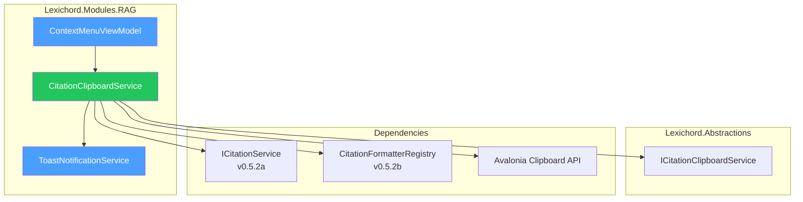

# LCS-DES-052d: Citation Copy Actions

## 1. Metadata & Categorization

| Field                 | Value                                                                                                 |
| :-------------------- | :---------------------------------------------------------------------------------------------------- |
| **Feature ID**        | RAG-052d                                                                                              |
| **Feature Name**      | Citation Copy Actions                                                                                 |
| **Target Version**    | v0.5.2d                                                                                               |
| **Module**            | `Lexichord.Modules.RAG`                                                                               |
| **Interfaces Module** | `Lexichord.Abstractions`                                                                              |
| **Swimlane**          | Memory                                                                                                |
| **License Tier**      | Writer Pro                                                                                            |
| **Feature Gate Key**  | `FeatureFlags.RAG.CitationClipboard`                                                                  |
| **Status**            | Draft                                                                                                 |
| **Related Documents** | [LCS-SBD-052](./LCS-SBD-052.md), [LCS-DES-052a](./LCS-DES-052a.md), [LCS-DES-052b](./LCS-DES-052b.md) |

---

## 2. Executive Summary

### 2.1 The Requirement

Writers frequently need to copy citations from search results into their documents. Currently, this requires manual typing or multiple copy-paste operations. Users need:

- Quick one-click copy to clipboard
- Format options matching their document type
- Keyboard shortcuts for power users
- Visual feedback confirming successful copy

### 2.2 The Proposed Solution

Implement **Citation Copy Actions** that provide:

1. **`ICitationClipboardService`**: Interface for clipboard operations
2. **Context Menu Integration**: Right-click options on search results
3. **Multiple Copy Formats**: Markdown link, formatted citation, raw text
4. **Keyboard Shortcuts**: Standard hotkeys for common actions
5. **Toast Notification**: Visual feedback on copy success

---

## 3. Architecture & Modular Strategy

### 3.1 Component Relationships



### 3.2 Dependencies

| Dependency                  | Source Version | Usage                       |
| :-------------------------- | :------------- | :-------------------------- |
| `Citation`                  | v0.5.2a        | Citation data to copy       |
| `ICitationService`          | v0.5.2a        | Citation creation from hits |
| `CitationFormatterRegistry` | v0.5.2b        | Format selection            |
| `ILicenseContext`           | v0.0.4c        | License tier checking       |
| Avalonia `IClipboard`       | External       | System clipboard access     |

### 3.3 Licensing Behavior

Copy actions follow a **Partial Gate** pattern:

| Action                    | Core | Writer Pro |
| :------------------------ | :--: | :--------: |
| Copy raw chunk text       |  ✅  |     ✅     |
| Copy as Markdown Link     |  ❌  |     ✅     |
| Copy as Citation (styled) |  ❌  |     ✅     |
| View source path          |  ✅  |     ✅     |

```csharp
public async Task CopyAsCitationAsync(Citation citation)
{
    if (!_licenseContext.HasFeature(FeatureFlags.RAG.CitationClipboard))
    {
        await ShowUpgradePromptAsync("formatted citations");
        return;
    }

    await CopyFormattedCitationAsync(citation);
}
```

---

## 4. Data Contract

### 4.1 ICitationClipboardService Interface

```csharp
namespace Lexichord.Abstractions.Contracts;

/// <summary>
/// Clipboard operations for citations.
/// </summary>
public interface ICitationClipboardService
{
    /// <summary>
    /// Copies the citation as a Markdown link format.
    /// Example: [Title](file:///path#L42)
    /// </summary>
    /// <param name="citation">The citation to copy.</param>
    /// <returns>True if copy succeeded, false otherwise.</returns>
    Task<bool> CopyAsMarkdownLinkAsync(Citation citation);

    /// <summary>
    /// Copies the citation in the user's preferred style.
    /// </summary>
    /// <param name="citation">The citation to copy.</param>
    /// <returns>True if copy succeeded, false otherwise.</returns>
    Task<bool> CopyAsCitationAsync(Citation citation);

    /// <summary>
    /// Copies the citation in a specific style.
    /// </summary>
    /// <param name="citation">The citation to copy.</param>
    /// <param name="style">The citation style to use.</param>
    /// <returns>True if copy succeeded, false otherwise.</returns>
    Task<bool> CopyAsCitationAsync(Citation citation, CitationStyle style);

    /// <summary>
    /// Copies the raw chunk text content.
    /// </summary>
    /// <param name="chunkText">The text content to copy.</param>
    /// <returns>True if copy succeeded, false otherwise.</returns>
    Task<bool> CopyChunkTextAsync(string chunkText);

    /// <summary>
    /// Copies the document path only.
    /// </summary>
    /// <param name="citation">The citation containing the path.</param>
    /// <returns>True if copy succeeded, false otherwise.</returns>
    Task<bool> CopyPathAsync(Citation citation);
}
```

### 4.2 CopyResult Record

```csharp
namespace Lexichord.Abstractions.Contracts;

/// <summary>
/// Result of a clipboard copy operation.
/// </summary>
/// <param name="Success">Whether the copy succeeded.</param>
/// <param name="CopiedText">The text that was copied (for display).</param>
/// <param name="ErrorMessage">Error details if copy failed.</param>
public record CopyResult(
    bool Success,
    string? CopiedText,
    string? ErrorMessage);
```

---

## 5. Implementation Logic

### 5.1 CitationClipboardService Implementation

```csharp
namespace Lexichord.Modules.RAG.Services;

/// <summary>
/// Implements clipboard operations for citations.
/// </summary>
public sealed class CitationClipboardService(
    ICitationService citationService,
    CitationFormatterRegistry formatterRegistry,
    ILicenseContext licenseContext,
    IToastNotificationService toastService,
    ILogger<CitationClipboardService> logger) : ICitationClipboardService
{
    /// <inheritdoc />
    public async Task<bool> CopyAsMarkdownLinkAsync(Citation citation)
    {
        ArgumentNullException.ThrowIfNull(citation);

        if (!await CheckLicenseAsync("Markdown links"))
            return false;

        var formatted = citationService.FormatCitation(
            citation, CitationStyle.Markdown);

        return await CopyToClipboardAsync(formatted, "Markdown link");
    }

    /// <inheritdoc />
    public async Task<bool> CopyAsCitationAsync(Citation citation)
    {
        ArgumentNullException.ThrowIfNull(citation);

        if (!await CheckLicenseAsync("formatted citations"))
            return false;

        var style = formatterRegistry.GetPreferredStyle();
        return await CopyAsCitationAsync(citation, style);
    }

    /// <inheritdoc />
    public async Task<bool> CopyAsCitationAsync(Citation citation, CitationStyle style)
    {
        ArgumentNullException.ThrowIfNull(citation);

        if (!await CheckLicenseAsync("formatted citations"))
            return false;

        logger.LogDebug(
            "Copying citation as {Style} format",
            style);

        var formatter = formatterRegistry.GetFormatter(style);
        var formatted = formatter.FormatForClipboard(citation);

        return await CopyToClipboardAsync(formatted, formatter.DisplayName);
    }

    /// <inheritdoc />
    public async Task<bool> CopyChunkTextAsync(string chunkText)
    {
        if (string.IsNullOrEmpty(chunkText))
        {
            logger.LogWarning("Attempted to copy empty chunk text");
            return false;
        }

        // Raw text copy is available to all tiers
        return await CopyToClipboardAsync(chunkText, "chunk text", showPreview: false);
    }

    /// <inheritdoc />
    public async Task<bool> CopyPathAsync(Citation citation)
    {
        ArgumentNullException.ThrowIfNull(citation);

        // Path copy is available to all tiers
        return await CopyToClipboardAsync(citation.DocumentPath, "path");
    }

    private async Task<bool> CheckLicenseAsync(string featureName)
    {
        if (licenseContext.HasFeature(FeatureFlags.RAG.CitationClipboard))
            return true;

        logger.LogDebug(
            "Copy {Feature} blocked: feature not licensed",
            featureName);

        await toastService.ShowAsync(new ToastNotification
        {
            Type = ToastType.Warning,
            Title = "Upgrade Required",
            Message = $"Copying {featureName} requires Writer Pro",
            Action = new ToastAction("Upgrade", () => ShowUpgradeDialog())
        });

        return false;
    }

    private async Task<bool> CopyToClipboardAsync(
        string text,
        string formatName,
        bool showPreview = true)
    {
        try
        {
            var clipboard = Application.Current?.Clipboard;
            if (clipboard is null)
            {
                logger.LogError("Clipboard service unavailable");
                await toastService.ShowAsync(new ToastNotification
                {
                    Type = ToastType.Error,
                    Title = "Copy Failed",
                    Message = "Clipboard service unavailable"
                });
                return false;
            }

            await clipboard.SetTextAsync(text);

            logger.LogInfo(
                "Citation copied to clipboard: {Length} characters as {Format}",
                text.Length, formatName);

            // Show success toast
            var preview = showPreview
                ? TruncateForPreview(text)
                : null;

            await toastService.ShowAsync(new ToastNotification
            {
                Type = ToastType.Success,
                Title = $"Copied {formatName}",
                Message = preview
            });

            return true;
        }
        catch (Exception ex)
        {
            logger.LogError(ex, "Clipboard operation failed");

            await toastService.ShowAsync(new ToastNotification
            {
                Type = ToastType.Error,
                Title = "Copy Failed",
                Message = ex.Message
            });

            return false;
        }
    }

    private static string TruncateForPreview(string text, int maxLength = 50)
    {
        if (text.Length <= maxLength)
            return text;

        return text[..(maxLength - 3)] + "...";
    }
}
```

### 5.2 Context Menu Integration

```csharp
namespace Lexichord.Modules.RAG.ViewModels;

/// <summary>
/// ViewModel for search result context menu.
/// </summary>
public partial class SearchResultContextMenuViewModel : ViewModelBase
{
    private readonly ICitationClipboardService _clipboardService;
    private readonly ICitationService _citationService;
    private readonly ILicenseContext _licenseContext;

    [ObservableProperty]
    private SearchHit? _searchHit;

    /// <summary>
    /// Gets whether formatted citation actions are available.
    /// </summary>
    public bool CanCopyFormattedCitation =>
        _licenseContext.HasFeature(FeatureFlags.RAG.CitationClipboard);

    /// <summary>
    /// Copy as Markdown link command.
    /// </summary>
    [RelayCommand]
    private async Task CopyAsMarkdownLinkAsync()
    {
        if (SearchHit is null) return;

        var citation = _citationService.CreateCitation(SearchHit);
        await _clipboardService.CopyAsMarkdownLinkAsync(citation);
    }

    /// <summary>
    /// Copy as citation using default style.
    /// </summary>
    [RelayCommand]
    private async Task CopyAsCitationAsync()
    {
        if (SearchHit is null) return;

        var citation = _citationService.CreateCitation(SearchHit);
        await _clipboardService.CopyAsCitationAsync(citation);
    }

    /// <summary>
    /// Copy as citation with specific style.
    /// </summary>
    [RelayCommand]
    private async Task CopyAsCitationStyleAsync(CitationStyle style)
    {
        if (SearchHit is null) return;

        var citation = _citationService.CreateCitation(SearchHit);
        await _clipboardService.CopyAsCitationAsync(citation, style);
    }

    /// <summary>
    /// Copy chunk text.
    /// </summary>
    [RelayCommand]
    private async Task CopyChunkTextAsync()
    {
        if (SearchHit is null) return;

        await _clipboardService.CopyChunkTextAsync(SearchHit.Chunk.Content);
    }

    /// <summary>
    /// Open source file in default application.
    /// </summary>
    [RelayCommand]
    private async Task OpenSourceFileAsync()
    {
        if (SearchHit is null) return;

        var path = SearchHit.Document.FilePath;
        Process.Start(new ProcessStartInfo(path) { UseShellExecute = true });
    }
}
```

---

## 6. UI/UX Specifications

### 6.1 Context Menu Structure

```text
[Right-click on search result]
┌────────────────────────────────────────────────────────────────┐
│  📋 Copy as Markdown Link              Ctrl+M                  │
│  📋 Copy as Citation                   Ctrl+Shift+C            │
│  📋 Copy as...                                           ▶     │
│     ├── 📋 Inline           [doc.md, §Auth]                    │
│     ├── 📋 Footnote         [^1a2b]: /path:42                  │
│     └── 📋 Markdown Link    [Title](file://...)                │
│  📋 Copy Chunk Text                    Ctrl+C                  │
│  ─────────────────────────────────────────────────────────────  │
│  📂 Open Source File                   Enter                   │
│  📋 Copy Path                          Ctrl+Shift+P            │
│  🔄 Re-index Document                  Ctrl+R                  │
└────────────────────────────────────────────────────────────────┘
```

### 6.2 Keyboard Shortcuts

| Shortcut       | Action                | Notes                   |
| :------------- | :-------------------- | :---------------------- |
| `Ctrl+C`       | Copy chunk text       | Standard copy           |
| `Ctrl+M`       | Copy as Markdown link | Custom shortcut         |
| `Ctrl+Shift+C` | Copy as citation      | Uses preferred style    |
| `Ctrl+Shift+P` | Copy path             | Path only               |
| `Enter`        | Open source file      | Navigate to source      |
| `Ctrl+R`       | Re-index document     | Refresh indexed content |

### 6.3 Toast Notification

```text
Success Toast:
┌──────────────────────────────────────┐
│  ✓ Copied citation                   │
│  [doc.md, §Authentication]           │
└──────────────────────────────────────┘
  (Auto-dismiss after 2 seconds)

Error Toast:
┌──────────────────────────────────────┐
│  ✗ Copy failed                       │
│  Clipboard access denied             │
└──────────────────────────────────────┘
  (Auto-dismiss after 4 seconds)

Upgrade Toast:
┌──────────────────────────────────────┐
│  ⚠ Upgrade Required                  │
│  Formatted citations require Pro     │
│  [Upgrade]                           │
└──────────────────────────────────────┘
  (Dismiss on click)
```

### 6.4 Toast Notification Service

```csharp
namespace Lexichord.Abstractions.Services;

/// <summary>
/// Types of toast notifications.
/// </summary>
public enum ToastType
{
    Success,
    Warning,
    Error,
    Info
}

/// <summary>
/// A toast notification message.
/// </summary>
public record ToastNotification
{
    /// <summary>
    /// Type of notification (affects styling).
    /// </summary>
    public required ToastType Type { get; init; }

    /// <summary>
    /// Title text (bold).
    /// </summary>
    public required string Title { get; init; }

    /// <summary>
    /// Optional detail message.
    /// </summary>
    public string? Message { get; init; }

    /// <summary>
    /// Optional action button.
    /// </summary>
    public ToastAction? Action { get; init; }

    /// <summary>
    /// Duration before auto-dismiss (null for no auto-dismiss).
    /// </summary>
    public TimeSpan? Duration { get; init; } = TimeSpan.FromSeconds(2);
}

/// <summary>
/// Action button for a toast notification.
/// </summary>
public record ToastAction(string Label, Action OnClick);

/// <summary>
/// Service for displaying toast notifications.
/// </summary>
public interface IToastNotificationService
{
    /// <summary>
    /// Shows a toast notification.
    /// </summary>
    Task ShowAsync(ToastNotification notification);

    /// <summary>
    /// Dismisses all visible toasts.
    /// </summary>
    void DismissAll();
}
```

### 6.5 Component Styling

| Element          | Theme Resource             | Notes           |
| :--------------- | :------------------------- | :-------------- |
| Success icon (✓) | `Brush.Success.Foreground` | Green checkmark |
| Error icon (✗)   | `Brush.Error.Foreground`   | Red X           |
| Warning icon (⚠) | `Brush.Warning.Foreground` | Amber triangle  |
| Toast background | `Brush.Surface.Overlay`    | 90% opacity     |
| Toast border     | `Brush.Border.Subtle`      | Subtle border   |
| Action button    | `LexButtonLink`            | Text link style |

---

## 7. Observability & Logging

| Level   | Message Template                                                  |
| :------ | :---------------------------------------------------------------- |
| Debug   | `"Copying citation as {Style} format"`                            |
| Debug   | `"Copy {Feature} blocked: feature not licensed"`                  |
| Info    | `"Citation copied to clipboard: {Length} characters as {Format}"` |
| Warning | `"Attempted to copy empty chunk text"`                            |
| Error   | `"Clipboard service unavailable"`                                 |
| Error   | `"Clipboard operation failed"`                                    |

---

## 8. Acceptance Criteria

| #   | Category          | Criterion                                                  |
| :-- | :---------------- | :--------------------------------------------------------- |
| 1   | **Functional**    | "Copy as Markdown Link" places valid Markdown on clipboard |
| 2   | **Functional**    | "Copy as Citation" uses user's preferred style             |
| 3   | **Functional**    | "Copy Chunk Text" copies raw content                       |
| 4   | **Functional**    | Context menu displays all copy options                     |
| 5   | **Functional**    | Keyboard shortcuts trigger correct actions                 |
| 6   | **Functional**    | Toast notification shows on successful copy                |
| 7   | **Functional**    | Toast notification shows on copy failure                   |
| 8   | **Performance**   | Clipboard copy completes in < 50ms                         |
| 9   | **License**       | Core users can copy raw text only                          |
| 10  | **License**       | Core users see upgrade prompt for formatted citations      |
| 11  | **Error**         | Graceful handling when clipboard unavailable               |
| 12  | **Accessibility** | Screen reader announces toast notifications                |

---

## 9. Test Scenarios

```csharp
namespace Lexichord.Modules.RAG.Tests.Services;

[Trait("Category", "Unit")]
[Trait("Feature", "v0.5.2d")]
public class CitationClipboardServiceTests
{
    private readonly Mock<ICitationService> _citationServiceMock = new();
    private readonly Mock<CitationFormatterRegistry> _formatterRegistryMock = new();
    private readonly Mock<ILicenseContext> _licenseMock = new();
    private readonly Mock<IToastNotificationService> _toastMock = new();
    private readonly Mock<IClipboard> _clipboardMock = new();

    [Fact]
    public async Task CopyAsMarkdownLinkAsync_Licensed_CopiesToClipboard()
    {
        // Arrange
        SetupLicensed();
        var citation = CreateCitation();
        _citationServiceMock.Setup(c => c.FormatCitation(
            citation, CitationStyle.Markdown))
            .Returns("[Title](file:///path)");

        var sut = CreateService();

        // Act
        var result = await sut.CopyAsMarkdownLinkAsync(citation);

        // Assert
        result.Should().BeTrue();
        _clipboardMock.Verify(c => c.SetTextAsync("[Title](file:///path)"));
    }

    [Fact]
    public async Task CopyAsCitationAsync_Unlicensed_ShowsUpgradePrompt()
    {
        // Arrange
        SetupUnlicensed();
        var citation = CreateCitation();
        var sut = CreateService();

        // Act
        var result = await sut.CopyAsCitationAsync(citation);

        // Assert
        result.Should().BeFalse();
        _toastMock.Verify(t => t.ShowAsync(It.Is<ToastNotification>(
            n => n.Type == ToastType.Warning &&
                 n.Title.Contains("Upgrade"))));
    }

    [Fact]
    public async Task CopyChunkTextAsync_Unlicensed_StillWorks()
    {
        // Arrange
        SetupUnlicensed();
        var sut = CreateService();

        // Act
        var result = await sut.CopyChunkTextAsync("Some chunk content");

        // Assert
        result.Should().BeTrue();
        _clipboardMock.Verify(c => c.SetTextAsync("Some chunk content"));
    }

    [Fact]
    public async Task CopyAsCitationAsync_UsesPreferredStyle()
    {
        // Arrange
        SetupLicensed();
        var citation = CreateCitation();
        _formatterRegistryMock.Setup(f => f.GetPreferredStyle())
            .Returns(CitationStyle.Footnote);

        var sut = CreateService();

        // Act
        await sut.CopyAsCitationAsync(citation);

        // Assert
        _formatterRegistryMock.Verify(f => f.GetFormatter(CitationStyle.Footnote));
    }

    [Fact]
    public async Task CopyAsync_ClipboardFails_ReturnsError()
    {
        // Arrange
        SetupLicensed();
        _clipboardMock.Setup(c => c.SetTextAsync(It.IsAny<string>()))
            .ThrowsAsync(new InvalidOperationException("Access denied"));

        var citation = CreateCitation();
        var sut = CreateService();

        // Act
        var result = await sut.CopyAsMarkdownLinkAsync(citation);

        // Assert
        result.Should().BeFalse();
        _toastMock.Verify(t => t.ShowAsync(It.Is<ToastNotification>(
            n => n.Type == ToastType.Error)));
    }

    [Fact]
    public async Task CopyAsync_Success_ShowsToastWithPreview()
    {
        // Arrange
        SetupLicensed();
        var citation = CreateCitation(title: "OAuth Guide");
        _citationServiceMock.Setup(c => c.FormatCitation(
            citation, CitationStyle.Markdown))
            .Returns("[OAuth Guide](file:///docs/auth.md)");

        var sut = CreateService();

        // Act
        await sut.CopyAsMarkdownLinkAsync(citation);

        // Assert
        _toastMock.Verify(t => t.ShowAsync(It.Is<ToastNotification>(
            n => n.Type == ToastType.Success &&
                 n.Message!.Contains("OAuth Guide"))));
    }
}

[Trait("Category", "Unit")]
[Trait("Feature", "v0.5.2d")]
public class SearchResultContextMenuViewModelTests
{
    [Fact]
    public async Task CopyAsCitationAsyncCommand_InvokesClipboardService()
    {
        // Arrange
        var clipboardMock = new Mock<ICitationClipboardService>();
        var citationMock = new Mock<ICitationService>();
        var hit = CreateSearchHit();
        var citation = CreateCitation();

        citationMock.Setup(c => c.CreateCitation(hit)).Returns(citation);

        var sut = CreateViewModel(clipboardMock.Object, citationMock.Object);
        sut.SearchHit = hit;

        // Act
        await sut.CopyAsCitationCommand.ExecuteAsync(null);

        // Assert
        clipboardMock.Verify(c => c.CopyAsCitationAsync(citation));
    }
}
```

---

## 10. DI Registration

```csharp
// In RAGModule.cs
services.AddSingleton<ICitationClipboardService, CitationClipboardService>();
services.AddSingleton<IToastNotificationService, ToastNotificationService>();
services.AddTransient<SearchResultContextMenuViewModel>();
```

---

## 11. AXAML View Example

```xml
<!-- SearchResultContextMenu.axaml -->
<ContextMenu x:Class="Lexichord.Modules.RAG.Views.SearchResultContextMenu"
             xmlns="https://github.com/avaloniaui"
             xmlns:x="http://schemas.microsoft.com/winfx/2006/xaml">

    <MenuItem Header="Copy as Markdown Link"
              InputGesture="Ctrl+M"
              Command="{Binding CopyAsMarkdownLinkCommand}"
              IsEnabled="{Binding CanCopyFormattedCitation}">
        <MenuItem.Icon>
            <PathIcon Data="{StaticResource IconCopy}" />
        </MenuItem.Icon>
    </MenuItem>

    <MenuItem Header="Copy as Citation"
              InputGesture="Ctrl+Shift+C"
              Command="{Binding CopyAsCitationCommand}"
              IsEnabled="{Binding CanCopyFormattedCitation}">
        <MenuItem.Icon>
            <PathIcon Data="{StaticResource IconCite}" />
        </MenuItem.Icon>
    </MenuItem>

    <MenuItem Header="Copy as...">
        <MenuItem Header="Inline"
                  Command="{Binding CopyAsCitationStyleCommand}"
                  CommandParameter="{x:Static contracts:CitationStyle.Inline}"/>
        <MenuItem Header="Footnote"
                  Command="{Binding CopyAsCitationStyleCommand}"
                  CommandParameter="{x:Static contracts:CitationStyle.Footnote}"/>
        <MenuItem Header="Markdown Link"
                  Command="{Binding CopyAsCitationStyleCommand}"
                  CommandParameter="{x:Static contracts:CitationStyle.Markdown}"/>
    </MenuItem>

    <MenuItem Header="Copy Chunk Text"
              InputGesture="Ctrl+C"
              Command="{Binding CopyChunkTextCommand}">
        <MenuItem.Icon>
            <PathIcon Data="{StaticResource IconText}" />
        </MenuItem.Icon>
    </MenuItem>

    <Separator />

    <MenuItem Header="Open Source File"
              InputGesture="Enter"
              Command="{Binding OpenSourceFileCommand}">
        <MenuItem.Icon>
            <PathIcon Data="{StaticResource IconOpenFile}" />
        </MenuItem.Icon>
    </MenuItem>

    <MenuItem Header="Copy Path"
              InputGesture="Ctrl+Shift+P"
              Command="{Binding CopyPathCommand}"/>

    <MenuItem Header="Re-index Document"
              InputGesture="Ctrl+R"
              Command="{Binding ReindexCommand}">
        <MenuItem.Icon>
            <PathIcon Data="{StaticResource IconRefresh}" />
        </MenuItem.Icon>
    </MenuItem>

</ContextMenu>
```

---

## 12. Deliverable Checklist

| #   | Deliverable                               | Status |
| :-- | :---------------------------------------- | :----- |
| 1   | `ICitationClipboardService` interface     | [ ]    |
| 2   | `CitationClipboardService` implementation | [ ]    |
| 3   | `IToastNotificationService` interface     | [ ]    |
| 4   | `ToastNotificationService` implementation | [ ]    |
| 5   | `ToastNotification` record                | [ ]    |
| 6   | `SearchResultContextMenuViewModel`        | [ ]    |
| 7   | Context menu AXAML view                   | [ ]    |
| 8   | Keyboard shortcut bindings                | [ ]    |
| 9   | Toast notification UI component           | [ ]    |
| 10  | Unit tests for clipboard service          | [ ]    |
| 11  | Unit tests for context menu ViewModel     | [ ]    |
| 12  | DI registration                           | [ ]    |

---

## Document History

| Version | Date       | Author         | Changes       |
| :------ | :--------- | :------------- | :------------ |
| 1.0     | 2026-01-27 | Lead Architect | Initial draft |
