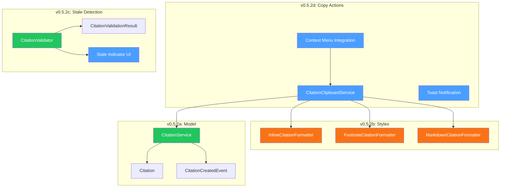
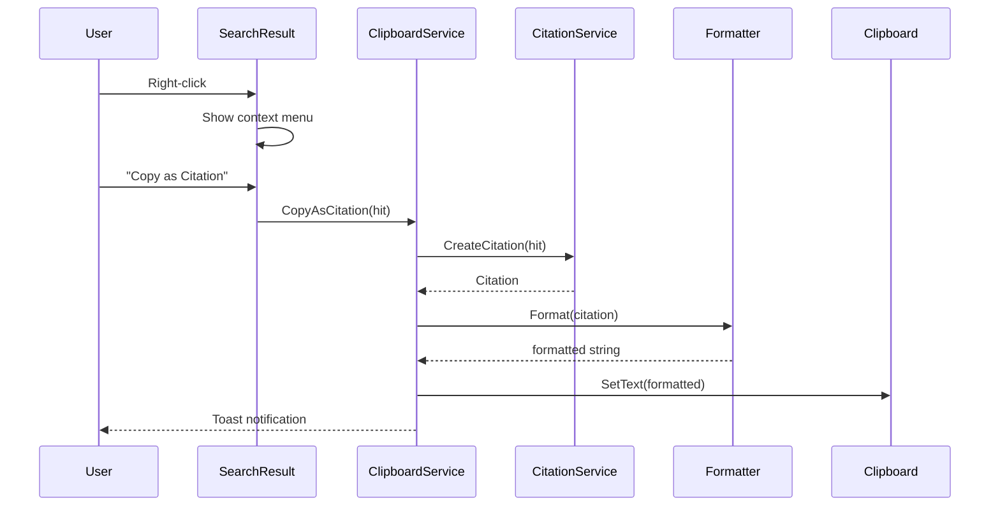

# LCS-DES-052: Design Specification Index — The Citation Engine

## Document Control

| Field                | Value                                    |
| :------------------- | :--------------------------------------- |
| **Document ID**      | LCS-DES-052-INDEX                        |
| **Feature ID**       | RAG-052                                  |
| **Feature Name**     | The Citation Engine (Source Attribution) |
| **Target Version**   | v0.5.2                                   |
| **Module Scope**     | Lexichord.Modules.RAG                    |
| **Swimlane**         | Memory                                   |
| **License Tier**     | Writer Pro                               |
| **Feature Gate Key** | `FeatureFlags.RAG.Citation`              |
| **Status**           | In Progress                              |
| **Last Updated**     | 2026-02-02                               |

---

## 1. Executive Summary

**v0.5.2** delivers the **Citation Engine** — comprehensive source attribution for every retrieved chunk. This release transforms Lexichord's RAG system from a simple search tool into a trustworthy knowledge retrieval platform, enabling writers to trace every piece of information back to its exact source location.

### 1.1 The Problem

Writers using RAG-assisted search need to cite their sources. Without proper attribution, retrieved information cannot be trusted, verified, or used in formal documents. Currently, users must manually track which documents contributed to their work—a tedious and error-prone process.

### 1.2 The Solution

Implement a Citation Engine that:

- **Creates citations** with complete provenance (document, heading, line number)
- **Formats citations** in multiple styles (Inline, Footnote, Markdown)
- **Detects stale citations** when source files change after indexing
- **Provides copy actions** for quick clipboard operations

### 1.3 Business Value

| Value                      | Description                                                  |
| :------------------------- | :----------------------------------------------------------- |
| **Source Traceability**    | Every chunk links to exact location in source document       |
| **Citation Formatting**    | Multiple styles for different publishing contexts            |
| **Freshness Verification** | Automatic stale detection when sources change                |
| **Workflow Efficiency**    | One-click copy reduces manual citation work                  |
| **Trust & Compliance**     | Enterprise users can verify AI-assisted content              |
| **Foundation**             | Enables Context Window (v0.5.3) and Relevance Tuner (v0.5.4) |

---

## 2. Related Documents

### 2.1 Scope Breakdown Document

The detailed scope breakdown for v0.5.2, including all sub-parts, implementation checklists, user stories, and acceptance criteria:

| Document                            | Description                           |
| :---------------------------------- | :------------------------------------ |
| **[LCS-SBD-052](./LCS-SBD-052.md)** | Scope Breakdown — The Citation Engine |

### 2.2 Sub-Part Design Specifications

Each sub-part has its own detailed design specification following the LDS-01 template:

| Sub-Part | Document                              | Title                    | Description                          |
| :------- | :------------------------------------ | :----------------------- | :----------------------------------- |
| v0.5.2a  | **[LCS-DES-052a](./LCS-DES-052a.md)** | Citation Model           | Citation record and ICitationService |
| v0.5.2b  | **[LCS-DES-052b](./LCS-DES-052b.md)** | Citation Styles          | Multiple formatting options          |
| v0.5.2c  | **[LCS-DES-052c](./LCS-DES-052c.md)** | Stale Citation Detection | Freshness validation logic           |
| v0.5.2d  | **[LCS-DES-052d](./LCS-DES-052d.md)** | Citation Copy Actions    | Clipboard operations                 |

---

## 3. Architecture Overview

### 3.1 Component Diagram



### 3.2 Data Flow



---

## 4. Dependencies

### 4.1 Upstream Dependencies (Required)

| Interface                 | Source Version | Purpose                  |
| :------------------------ | :------------- | :----------------------- |
| `ISemanticSearchService`  | v0.4.5a        | Search result source     |
| `SearchHit`               | v0.4.5a        | Search result container  |
| `IDocumentRepository`     | v0.4.1c        | Document metadata access |
| `IChunkRepository`        | v0.4.1c        | Chunk content retrieval  |
| `IFileHashService`        | v0.4.2b        | File change detection    |
| `IIndexManagementService` | v0.4.7b        | Re-index operations      |
| `ISettingsService`        | v0.1.6a        | User preference storage  |
| `ILicenseContext`         | v0.0.4c        | License tier checking    |

### 4.2 NuGet Packages

| Package                 | Version | Purpose                |
| :---------------------- | :------ | :--------------------- |
| `MediatR`               | 12.x    | Event publishing       |
| `CommunityToolkit.Mvvm` | 8.x     | MVVM source generators |

### 4.3 Downstream Consumers (Future)

| Version | Feature         | Consumes                          |
| :------ | :-------------- | :-------------------------------- |
| v0.5.3  | Context Window  | `Citation`, citation metadata     |
| v0.5.4  | Relevance Tuner | Citation patterns for query hints |
| v0.5.5  | Filter System   | Filter by cited documents         |

---

## 5. License Gating Strategy

The Citation Engine is a **Writer Pro** feature using a **Soft Gate** strategy.

### 5.1 Behavior by License Tier

| Tier       | Citation Display | Format Options | Copy Actions  | Stale Detection |
| :--------- | :--------------- | :------------- | :------------ | :-------------- |
| Core       | Path only        | None           | Raw text only | Hidden          |
| Writer Pro | Full citation    | All styles     | All actions   | Yes             |
| Teams      | Full + custom    | All + custom   | All actions   | Yes             |
| Enterprise | Full + custom    | All + custom   | All + audit   | Yes + logged    |

### 5.2 Implementation Pattern

```csharp
if (!_licenseContext.HasFeature(FeatureFlags.RAG.Citation))
{
    // Show basic path only
    IsFormattedCitationAvailable = false;
    ShowUpgradePrompt = true;
    return;
}
```

---

## 6. Citation Formats

### 6.1 Inline Format

```
[document.md, §Heading]
```

**Example:** `[auth-guide.md, §Authentication]`

**Use Case:** Academic papers, inline references in technical docs.

### 6.2 Footnote Format

```
[^XXXXXXXX]: /path/to/document.md:line
```

**Example:** `[^1a2b3c4d]: /docs/api/auth.md:42`

**Use Case:** Formal documents with footnote references.

### 6.3 Markdown Format

```
[Title](file:///path#Lline)
```

**Example:** `[OAuth Guide](file:///docs/api/auth.md#L42)`

**Use Case:** Markdown documents, wiki-style linking.

---

## 7. Key Interfaces Summary

| Interface                   | Defined In | Purpose                   |
| :-------------------------- | :--------- | :------------------------ |
| `ICitationService`          | v0.5.2a    | Creation and formatting   |
| `ICitationFormatter`        | v0.5.2b    | Style-specific formatting |
| `ICitationValidator`        | v0.5.2c    | Freshness validation      |
| `ICitationClipboardService` | v0.5.2d    | Clipboard operations      |

| Record/DTO                      | Defined In | Purpose                 |
| :------------------------------ | :--------- | :---------------------- |
| `Citation`                      | v0.5.2a    | Source attribution data |
| `CitationValidationResult`      | v0.5.2c    | Validation outcome      |
| `CitationCreatedEvent`          | v0.5.2a    | MediatR notification    |
| `CitationValidationFailedEvent` | v0.5.2c    | Stale notification      |

| Enum                       | Defined In | Purpose                   |
| :------------------------- | :--------- | :------------------------ |
| `CitationStyle`            | v0.5.2a    | Inline/Footnote/Markdown  |
| `CitationValidationStatus` | v0.5.2c    | Valid/Stale/Missing/Error |

---

## 8. Implementation Checklist Summary

| Sub-Part    | Tasks             | Est. Hours   |
| :---------- | :---------------- | :----------- |
| v0.5.2a ✅  | Citation Model    | 9.75         |
| v0.5.2b ✅  | Citation Styles   | 7.25         |
| v0.5.2c ✅  | Stale Detection   | 8.5          |
| v0.5.2d     | Copy Actions      | 6            |
| Integration | DI, Events, Tests | 2.5          |
| **Total**   |                   | **34 hours** |

See [LCS-SBD-052](./LCS-SBD-052.md) Section 4 for the detailed task breakdown.

---

## 9. Success Criteria Summary

| Category        | Criterion               | Target       |
| :-------------- | :---------------------- | :----------- |
| **Performance** | Citation creation       | < 10ms       |
| **Performance** | Citation formatting     | < 1ms        |
| **Performance** | Single file validation  | < 50ms       |
| **Performance** | Batch validation (20)   | < 200ms      |
| **Performance** | Clipboard copy          | < 50ms       |
| **Accuracy**    | Line number calculation | 100% correct |

See [LCS-SBD-052](./LCS-SBD-052.md) Section 9 for full success metrics.

---

## 10. Test Coverage Summary

| Sub-Part | Unit Tests                                 | Integration Tests   |
| :------- | :----------------------------------------- | :------------------ |
| v0.5.2a  | Citation creation, line number calculation | End-to-end creation |
| v0.5.2b  | Each formatter style output                | -                   |
| v0.5.2c  | Valid/Stale/Missing scenarios              | File system changes |
| v0.5.2d  | Clipboard operations, format selection     | UI integration      |

See individual design specs for detailed test scenarios.

---

## 11. What This Enables

| Version | Feature         | Uses From v0.5.2                        |
| :------ | :-------------- | :-------------------------------------- |
| v0.5.3  | Context Window  | Citation metadata for context expansion |
| v0.5.4  | Relevance Tuner | Citation patterns for query refinement  |
| v0.5.5  | Filter System   | Filter by previously cited documents    |
| v0.5.6  | Snippet Gen     | Citation for snippet attribution        |

---

## Document History

| Version | Date       | Author         | Changes       |
| :------ | :--------- | :------------- | :------------ |
| 1.0     | 2026-01-27 | Lead Architect | Initial draft |
