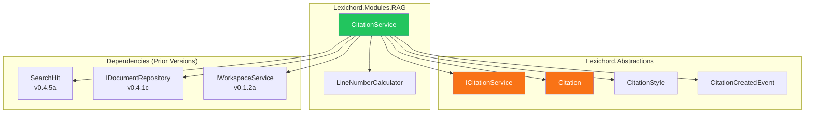
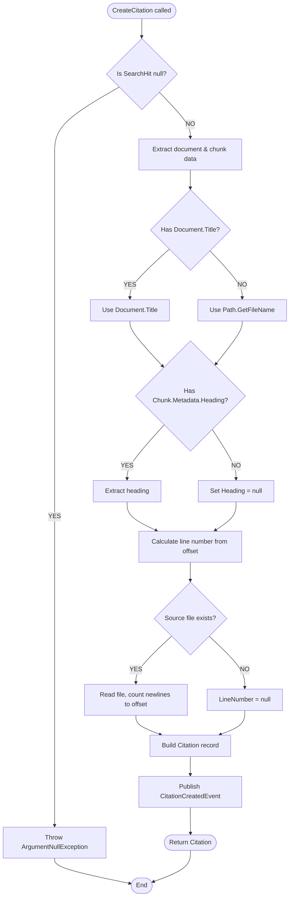

# LCS-DES-052a: Citation Model

## 1. Metadata & Categorization

| Field                 | Value                                                                        |
| :-------------------- | :--------------------------------------------------------------------------- |
| **Feature ID**        | RAG-052a                                                                     |
| **Feature Name**      | Citation Model                                                               |
| **Target Version**    | v0.5.2a                                                                      |
| **Module**            | `Lexichord.Modules.RAG`                                                      |
| **Interfaces Module** | `Lexichord.Abstractions`                                                     |
| **Swimlane**          | Memory                                                                       |
| **License Tier**      | Writer Pro                                                                   |
| **Feature Gate Key**  | `FeatureFlags.RAG.Citation`                                                  |
| **Status**            | Complete                                                                     |
| **Related Documents** | [LCS-SBD-052](./LCS-SBD-052.md), [LCS-DES-052-INDEX](./LCS-DES-052-INDEX.md) |

---

## 2. Executive Summary

### 2.1 The Requirement

Writers using Lexichord's semantic search need to know exactly where retrieved information comes from. Currently, search results show chunk content but lack precise provenance—document path, heading context, and line number. Without this, users cannot:

- Create proper citations in their documents
- Navigate to the exact source location
- Verify the accuracy of retrieved information
- Track which sources contributed to their work

### 2.2 The Proposed Solution

Implement a **Citation Model** that captures complete provenance information for every retrieved chunk:

1. **`Citation` Record**: Immutable data structure with all attribution fields
2. **`ICitationService` Interface**: Service contract for creating and formatting citations
3. **`CitationService` Implementation**: Creates citations from search hits, calculates line numbers
4. **`CitationCreatedEvent`**: MediatR notification for citation tracking

---

## 3. Architecture & Modular Strategy

### 3.1 Component Relationships



### 3.2 Dependencies

| Dependency            | Source Version | Usage                               |
| :-------------------- | :------------- | :---------------------------------- |
| `SearchHit`           | v0.4.5a        | Source data for citation creation   |
| `IDocumentRepository` | v0.4.1c        | Document metadata retrieval         |
| `IWorkspaceService`   | v0.1.2a        | File system access for line numbers |
| `IMediator`           | v0.0.7a        | Event publishing                    |
| `ILogger<T>`          | v0.0.3b        | Structured logging                  |

### 3.3 Licensing Behavior

The Citation Model follows a **Soft Gate** pattern:

- **Core Users**: Can access basic path information but not formatted citations
- **Writer Pro+**: Full access to all citation features

```csharp
public Citation CreateCitation(SearchHit hit)
{
    // Citation creation is always performed
    // License check occurs at formatting/display layer
    return BuildCitation(hit);
}

public string FormatCitation(Citation citation, CitationStyle style)
{
    if (!_licenseContext.HasFeature(FeatureFlags.RAG.Citation))
    {
        return citation.DocumentPath; // Basic path only
    }

    return FormatWithStyle(citation, style);
}
```

---

## 4. Data Contract

### 4.1 Citation Record

```csharp
namespace Lexichord.Abstractions.Contracts;

/// <summary>
/// Represents attribution information for a retrieved chunk.
/// Contains all data needed to trace content back to its source document.
/// </summary>
/// <param name="ChunkId">Unique identifier of the source chunk.</param>
/// <param name="DocumentPath">Absolute path to the source document.</param>
/// <param name="DocumentTitle">Display title (filename if no frontmatter title).</param>
/// <param name="StartOffset">Character offset where chunk begins in source.</param>
/// <param name="EndOffset">Character offset where chunk ends in source.</param>
/// <param name="Heading">Parent heading context from chunk metadata, if available.</param>
/// <param name="LineNumber">Starting line number in source document (1-indexed).</param>
/// <param name="IndexedAt">UTC timestamp when document was last indexed.</param>
public record Citation(
    Guid ChunkId,
    string DocumentPath,
    string DocumentTitle,
    int StartOffset,
    int EndOffset,
    string? Heading,
    int? LineNumber,
    DateTime IndexedAt)
{
    /// <summary>
    /// Gets the filename portion of the document path.
    /// </summary>
    public string FileName => Path.GetFileName(DocumentPath);

    /// <summary>
    /// Gets or sets the relative path from workspace root, if available.
    /// </summary>
    public string? RelativePath { get; init; }

    /// <summary>
    /// Gets whether this citation has heading context.
    /// </summary>
    public bool HasHeading => !string.IsNullOrEmpty(Heading);

    /// <summary>
    /// Gets whether this citation has a line number.
    /// </summary>
    public bool HasLineNumber => LineNumber.HasValue && LineNumber > 0;
}
```

### 4.2 CitationStyle Enum

```csharp
namespace Lexichord.Abstractions.Contracts;

/// <summary>
/// Citation formatting styles.
/// </summary>
public enum CitationStyle
{
    /// <summary>
    /// Inline format: "[document.md, §Heading]"
    /// Best for academic papers and inline references.
    /// </summary>
    Inline,

    /// <summary>
    /// Footnote format: "[^1]: /path/to/doc.md:42"
    /// Best for formal documents with footnote references.
    /// </summary>
    Footnote,

    /// <summary>
    /// Markdown link format: "[Title](file:///path#L42)"
    /// Best for Markdown documents and wiki-style linking.
    /// </summary>
    Markdown
}
```

### 4.3 ICitationService Interface

```csharp
namespace Lexichord.Abstractions.Contracts;

/// <summary>
/// Service for creating, formatting, and validating citations.
/// </summary>
public interface ICitationService
{
    /// <summary>
    /// Creates a citation from a search result hit.
    /// </summary>
    /// <param name="hit">The search hit containing chunk and document data.</param>
    /// <returns>A citation with complete provenance information.</returns>
    /// <exception cref="ArgumentNullException">Thrown if hit is null.</exception>
    Citation CreateCitation(SearchHit hit);

    /// <summary>
    /// Creates citations for multiple search hits.
    /// </summary>
    /// <param name="hits">The search hits to create citations for.</param>
    /// <returns>Citations in the same order as input hits.</returns>
    IReadOnlyList<Citation> CreateCitations(IEnumerable<SearchHit> hits);

    /// <summary>
    /// Formats a citation according to the specified style.
    /// </summary>
    /// <param name="citation">The citation to format.</param>
    /// <param name="style">The desired citation style.</param>
    /// <returns>The formatted citation string.</returns>
    string FormatCitation(Citation citation, CitationStyle style);

    /// <summary>
    /// Validates that the citation's source has not changed since indexing.
    /// </summary>
    /// <param name="citation">The citation to validate.</param>
    /// <param name="ct">Cancellation token.</param>
    /// <returns>True if the source is unchanged; false if stale or missing.</returns>
    Task<bool> ValidateCitationAsync(Citation citation, CancellationToken ct = default);
}
```

### 4.4 CitationCreatedEvent

```csharp
namespace Lexichord.Abstractions.Events;

/// <summary>
/// Published when a new citation is created.
/// </summary>
/// <param name="Citation">The created citation.</param>
/// <param name="Timestamp">When the citation was created.</param>
public record CitationCreatedEvent(
    Citation Citation,
    DateTime Timestamp) : INotification;
```

---

## 5. Implementation Logic

### 5.1 Citation Creation Flow



### 5.2 Line Number Calculation

The line number is calculated by counting newline characters from the start of the file to the chunk's start offset:

```csharp
private int? CalculateLineNumber(string filePath, int charOffset)
{
    try
    {
        if (!File.Exists(filePath))
        {
            _logger.LogWarning(
                "Cannot calculate line number: file not found at {FilePath}",
                filePath);
            return null;
        }

        // Read file content
        var content = File.ReadAllText(filePath);

        if (charOffset >= content.Length)
        {
            _logger.LogWarning(
                "Offset {Offset} exceeds file length {Length} for {FilePath}",
                charOffset, content.Length, filePath);
            return null;
        }

        // Count newlines up to offset (1-indexed line numbers)
        var lineNumber = 1;
        for (var i = 0; i < charOffset && i < content.Length; i++)
        {
            if (content[i] == '\n')
                lineNumber++;
        }

        _logger.LogDebug(
            "Calculated line number {LineNumber} from offset {Offset} for {FilePath}",
            lineNumber, charOffset, filePath);

        return lineNumber;
    }
    catch (Exception ex)
    {
        _logger.LogWarning(ex,
            "Failed to calculate line number for {FilePath} at offset {Offset}",
            filePath, charOffset);
        return null;
    }
}
```

### 5.3 Citation Formatting

```csharp
public string FormatCitation(Citation citation, CitationStyle style)
{
    ArgumentNullException.ThrowIfNull(citation);

    _logger.LogDebug(
        "Formatting citation for {DocumentPath} as {Style}",
        citation.DocumentPath, style);

    return style switch
    {
        CitationStyle.Inline => FormatInline(citation),
        CitationStyle.Footnote => FormatFootnote(citation),
        CitationStyle.Markdown => FormatMarkdown(citation),
        _ => throw new ArgumentOutOfRangeException(nameof(style), style, null)
    };
}

private static string FormatInline(Citation citation)
{
    // Format: [document.md, §Heading] or [document.md]
    var heading = citation.HasHeading
        ? $", §{citation.Heading}"
        : string.Empty;
    return $"[{citation.FileName}{heading}]";
}

private static string FormatFootnote(Citation citation)
{
    // Format: [^XXXXXXXX]: /path/to/doc.md:line or [^XXXXXXXX]: /path/to/doc.md
    var line = citation.HasLineNumber
        ? $":{citation.LineNumber}"
        : string.Empty;
    var shortId = citation.ChunkId.ToString("N")[..8];
    return $"[^{shortId}]: {citation.DocumentPath}{line}";
}

private static string FormatMarkdown(Citation citation)
{
    // Format: [Title](file:///path#Lline) or [Title](file:///path)
    var fragment = citation.HasLineNumber
        ? $"#L{citation.LineNumber}"
        : string.Empty;
    var escapedPath = citation.DocumentPath.Replace(" ", "%20");
    return $"[{citation.DocumentTitle}](file://{escapedPath}{fragment})";
}
```

---

## 6. Data Persistence

The `Citation` record is **transient** and does not persist to the database. Citations are created on-demand from search results and cached in memory during a search session.

**Future consideration (v0.5.5+):** Store citation history for analytics and "recently cited" features.

---

## 7. UI/UX Specifications

The Citation Model itself has no UI components. UI integration is handled by:

- **v0.5.2b**: Citation style settings panel
- **v0.5.2c**: Stale indicator component
- **v0.5.2d**: Context menu and toast notification

---

## 8. Observability & Logging

| Level   | Message Template                                                  |
| :------ | :---------------------------------------------------------------- |
| Debug   | `"Creating citation for chunk {ChunkId} from {DocumentPath}"`     |
| Debug   | `"Calculated line number {LineNumber} from offset {Offset}"`      |
| Info    | `"Citation created for {DocumentTitle} in {ElapsedMs}ms"`         |
| Debug   | `"Formatting citation for {DocumentPath} as {Style}"`             |
| Warning | `"Cannot calculate line number: file not found at {FilePath}"`    |
| Warning | `"Offset {Offset} exceeds file length {Length} for {FilePath}"`   |
| Error   | `"Failed to create citation for chunk {ChunkId}: {ErrorMessage}"` |

### Structured Logging Example

```csharp
using var scope = _logger.BeginScope(new Dictionary<string, object>
{
    ["ChunkId"] = hit.Chunk.Id,
    ["DocumentPath"] = hit.Document.FilePath
});

_logger.LogDebug("Creating citation for chunk {ChunkId} from {DocumentPath}",
    hit.Chunk.Id, hit.Document.FilePath);
```

---

## 9. Security & Safety

| Concern               | Mitigation                                         |
| :-------------------- | :------------------------------------------------- |
| Path traversal        | Citation only stores paths from indexed documents  |
| PII in paths          | Paths are user-controlled, displayed as-is         |
| Unicode normalization | Use ordinal string comparison for paths            |
| Large file reads      | File reading for line numbers uses synchronous I/O |

---

## 10. Acceptance Criteria

| #   | Category        | Criterion                                                   |
| :-- | :-------------- | :---------------------------------------------------------- |
| 1   | **Functional**  | `CreateCitation` returns Citation with correct DocumentPath |
| 2   | **Functional**  | `CreateCitation` extracts ChunkId from SearchHit            |
| 3   | **Functional**  | Line number is correctly calculated from chunk offset       |
| 4   | **Functional**  | Heading is extracted from chunk metadata when present       |
| 5   | **Functional**  | DocumentTitle falls back to filename when title is null     |
| 6   | **Functional**  | `FormatCitation` produces correct Inline format             |
| 7   | **Functional**  | `FormatCitation` produces correct Footnote format           |
| 8   | **Functional**  | `FormatCitation` produces correct Markdown format           |
| 9   | **Performance** | Citation creation completes in < 10ms                       |
| 10  | **Resilience**  | Missing file returns null LineNumber, not exception         |
| 11  | **Logging**     | Each citation creation logs debug-level entry               |

---

## 11. Test Scenarios

### 11.1 Unit Tests

```csharp
namespace Lexichord.Modules.RAG.Tests.Services;

[Trait("Category", "Unit")]
[Trait("Feature", "v0.5.2a")]
public class CitationServiceTests
{
    private readonly Mock<IDocumentRepository> _documentRepoMock = new();
    private readonly Mock<IMediator> _mediatorMock = new();
    private readonly Mock<ILogger<CitationService>> _loggerMock = new();

    [Fact]
    public void CreateCitation_FromSearchHit_ReturnsCompleteCitation()
    {
        // Arrange
        var hit = CreateSearchHit(
            documentPath: "/docs/test.md",
            documentTitle: "Test Document",
            chunkId: Guid.NewGuid(),
            startOffset: 100);
        var sut = CreateService();

        // Act
        var citation = sut.CreateCitation(hit);

        // Assert
        citation.DocumentPath.Should().Be("/docs/test.md");
        citation.DocumentTitle.Should().Be("Test Document");
        citation.ChunkId.Should().Be(hit.Chunk.Id);
    }

    [Fact]
    public void CreateCitation_WithNullHit_ThrowsArgumentNullException()
    {
        // Arrange
        var sut = CreateService();

        // Act & Assert
        var act = () => sut.CreateCitation(null!);
        act.Should().Throw<ArgumentNullException>();
    }

    [Fact]
    public void CreateCitation_WithoutTitle_UsesFileName()
    {
        // Arrange
        var hit = CreateSearchHit(
            documentPath: "/docs/my-guide.md",
            documentTitle: null);
        var sut = CreateService();

        // Act
        var citation = sut.CreateCitation(hit);

        // Assert
        citation.DocumentTitle.Should().Be("my-guide.md");
        citation.FileName.Should().Be("my-guide.md");
    }

    [Fact]
    public void CreateCitation_WithHeading_IncludesHeading()
    {
        // Arrange
        var hit = CreateSearchHit(heading: "Authentication");
        var sut = CreateService();

        // Act
        var citation = sut.CreateCitation(hit);

        // Assert
        citation.Heading.Should().Be("Authentication");
        citation.HasHeading.Should().BeTrue();
    }

    [Theory]
    [InlineData(CitationStyle.Inline, "[test.md, §Intro]")]
    [InlineData(CitationStyle.Footnote, "[^")]
    [InlineData(CitationStyle.Markdown, "[Test Document](file://")]
    public void FormatCitation_WithStyle_ContainsExpectedPattern(
        CitationStyle style, string expectedPattern)
    {
        // Arrange
        var citation = CreateCitation(
            fileName: "test.md",
            title: "Test Document",
            heading: "Intro");
        var sut = CreateService();

        // Act
        var result = sut.FormatCitation(citation, style);

        // Assert
        result.Should().Contain(expectedPattern);
    }

    [Fact]
    public void FormatCitation_InlineWithoutHeading_OmitsHeading()
    {
        // Arrange
        var citation = CreateCitation(heading: null);
        var sut = CreateService();

        // Act
        var result = sut.FormatCitation(citation, CitationStyle.Inline);

        // Assert
        result.Should().NotContain("§");
    }

    [Fact]
    public void FormatCitation_MarkdownWithLineNumber_IncludesFragment()
    {
        // Arrange
        var citation = CreateCitation(lineNumber: 42);
        var sut = CreateService();

        // Act
        var result = sut.FormatCitation(citation, CitationStyle.Markdown);

        // Assert
        result.Should().Contain("#L42");
    }

    [Fact]
    public void FormatCitation_FootnoteWithLineNumber_IncludesLine()
    {
        // Arrange
        var citation = CreateCitation(lineNumber: 42);
        var sut = CreateService();

        // Act
        var result = sut.FormatCitation(citation, CitationStyle.Footnote);

        // Assert
        result.Should().Contain(":42");
    }
}
```

### 11.2 Line Number Calculation Tests

```csharp
[Trait("Category", "Unit")]
[Trait("Feature", "v0.5.2a")]
public class LineNumberCalculatorTests
{
    [Theory]
    [InlineData("Line 1\nLine 2\nLine 3", 0, 1)]  // Start of file
    [InlineData("Line 1\nLine 2\nLine 3", 7, 2)]  // Start of line 2
    [InlineData("Line 1\nLine 2\nLine 3", 14, 3)] // Start of line 3
    public void CalculateLineNumber_ReturnsCorrectLine(
        string content, int offset, int expectedLine)
    {
        // Arrange
        var tempFile = Path.GetTempFileName();
        File.WriteAllText(tempFile, content);
        var sut = CreateService();

        try
        {
            // Act
            var result = sut.CalculateLineNumber(tempFile, offset);

            // Assert
            result.Should().Be(expectedLine);
        }
        finally
        {
            File.Delete(tempFile);
        }
    }

    [Fact]
    public void CalculateLineNumber_MissingFile_ReturnsNull()
    {
        // Arrange
        var sut = CreateService();

        // Act
        var result = sut.CalculateLineNumber("/nonexistent/file.md", 0);

        // Assert
        result.Should().BeNull();
    }
}
```

---

## 12. DI Registration

```csharp
// In RAGModule.cs
services.AddSingleton<ICitationService, CitationService>();
```

---

## 13. Deliverable Checklist

| #   | Deliverable                                    | Status |
| :-- | :--------------------------------------------- | :----- |
| 1   | `Citation` record in Abstractions/Contracts    | [x]    |
| 2   | `CitationStyle` enum in Abstractions/Contracts | [x]    |
| 3   | `ICitationService` interface                   | [x]    |
| 4   | `CitationService` implementation               | [x]    |
| 5   | Line number calculation from offset            | [x]    |
| 6   | `CitationCreatedEvent` MediatR notification    | [x]    |
| 7   | All three format methods (Inline/Footnote/MD)  | [x]    |
| 8   | Unit tests for CreateCitation                  | [x]    |
| 9   | Unit tests for FormatCitation                  | [x]    |
| 10  | Unit tests for line number calculation         | [x]    |
| 11  | DI registration in RAGModule.cs                | [x]    |

---

## Document History

| Version | Date       | Author         | Changes       |
| :------ | :--------- | :------------- | :------------ |
| 1.0     | 2026-01-27 | Lead Architect | Initial draft |
