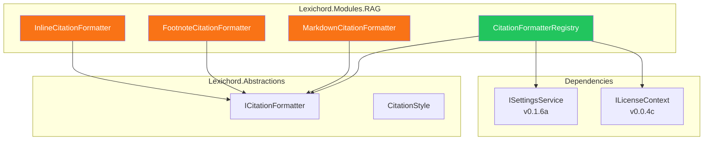

# LCS-DES-052b: Citation Styles

## 1. Metadata & Categorization

| Field                 | Value                                                              |
| :-------------------- | :----------------------------------------------------------------- |
| **Feature ID**        | RAG-052b                                                           |
| **Feature Name**      | Citation Styles                                                    |
| **Target Version**    | v0.5.2b                                                            |
| **Module**            | `Lexichord.Modules.RAG`                                            |
| **Interfaces Module** | `Lexichord.Abstractions`                                           |
| **Swimlane**          | Memory                                                             |
| **License Tier**      | Writer Pro (Custom styles: Teams+)                                 |
| **Feature Gate Key**  | `FeatureFlags.RAG.CitationStyles`                                  |
| **Status**            | Complete                                                           |
| **Related Documents** | [LCS-SBD-052](./LCS-SBD-052.md), [LCS-DES-052a](./LCS-DES-052a.md) |

---

## 2. Executive Summary

### 2.1 The Requirement

Writers work in different contexts—academic papers require formal citations, technical documentation uses inline references, and Markdown documents prefer link syntax. A single citation format cannot serve all use cases effectively.

Users need to:

- Choose their preferred citation format
- Preview how citations will appear
- Have their preference persist across sessions
- Access format selection quickly during workflow

### 2.2 The Proposed Solution

Implement a **Citation Styles** system with:

1. **`ICitationFormatter` Interface**: Abstraction for style-specific formatters
2. **Three Built-in Formatters**: Inline, Footnote, and Markdown styles
3. **User Preference Storage**: Default style saved via `ISettingsService`
4. **Settings UI Integration**: Style selection in the Tuning Room settings panel

---

## 3. Architecture & Modular Strategy

### 3.1 Component Relationships



### 3.2 Dependencies

| Dependency         | Source Version | Usage                          |
| :----------------- | :------------- | :----------------------------- |
| `Citation`         | v0.5.2a        | Citation data to format        |
| `CitationStyle`    | v0.5.2a        | Style enum for selection       |
| `ISettingsService` | v0.1.6a        | User preference persistence    |
| `ILicenseContext`  | v0.0.4c        | License tier for custom styles |

### 3.3 Licensing Behavior

| Feature                | Writer Pro | Teams | Enterprise |
| :--------------------- | :--------: | :---: | :--------: |
| Inline format          |     ✅     |  ✅   |     ✅     |
| Footnote format        |     ✅     |  ✅   |     ✅     |
| Markdown format        |     ✅     |  ✅   |     ✅     |
| Custom format template |     ❌     |  ✅   |     ✅     |
| Team default override  |     ❌     |  ✅   |     ✅     |

---

## 4. Data Contract

### 4.1 ICitationFormatter Interface

```csharp
namespace Lexichord.Abstractions.Contracts;

/// <summary>
/// Formatter for a specific citation style.
/// </summary>
public interface ICitationFormatter
{
    /// <summary>
    /// Gets the style this formatter produces.
    /// </summary>
    CitationStyle Style { get; }

    /// <summary>
    /// Gets the display name for the style (used in UI).
    /// </summary>
    string DisplayName { get; }

    /// <summary>
    /// Gets a short description of the format.
    /// </summary>
    string Description { get; }

    /// <summary>
    /// Gets an example of the format output.
    /// </summary>
    string Example { get; }

    /// <summary>
    /// Formats a citation for display in the UI.
    /// </summary>
    /// <param name="citation">The citation to format.</param>
    /// <returns>The formatted citation string.</returns>
    string Format(Citation citation);

    /// <summary>
    /// Formats a citation for clipboard copy (may differ from display).
    /// </summary>
    /// <param name="citation">The citation to format.</param>
    /// <returns>The clipboard-ready citation string.</returns>
    string FormatForClipboard(Citation citation);
}
```

### 4.2 Settings Keys

```csharp
namespace Lexichord.Abstractions.Settings;

public static class CitationSettingsKeys
{
    /// <summary>
    /// User's preferred default citation style.
    /// Values: "Inline", "Footnote", "Markdown"
    /// </summary>
    public const string DefaultStyle = "Citation.DefaultStyle";

    /// <summary>
    /// Whether to include line numbers in citations.
    /// </summary>
    public const string IncludeLineNumbers = "Citation.IncludeLineNumbers";

    /// <summary>
    /// Whether to use relative paths in citations.
    /// </summary>
    public const string UseRelativePaths = "Citation.UseRelativePaths";
}
```

---

## 5. Implementation Logic

### 5.1 InlineCitationFormatter

```csharp
namespace Lexichord.Modules.RAG.Formatters;

/// <summary>
/// Formats citations in inline style: [document.md, §Heading]
/// </summary>
public sealed class InlineCitationFormatter : ICitationFormatter
{
    /// <inheritdoc />
    public CitationStyle Style => CitationStyle.Inline;

    /// <inheritdoc />
    public string DisplayName => "Inline";

    /// <inheritdoc />
    public string Description => "Compact reference in brackets";

    /// <inheritdoc />
    public string Example => "[document.md, §Heading]";

    /// <inheritdoc />
    public string Format(Citation citation)
    {
        ArgumentNullException.ThrowIfNull(citation);

        var heading = citation.HasHeading
            ? $", §{citation.Heading}"
            : string.Empty;

        return $"[{citation.FileName}{heading}]";
    }

    /// <inheritdoc />
    public string FormatForClipboard(Citation citation) => Format(citation);
}
```

### 5.2 FootnoteCitationFormatter

```csharp
namespace Lexichord.Modules.RAG.Formatters;

/// <summary>
/// Formats citations in footnote style: [^id]: /path:line
/// </summary>
public sealed class FootnoteCitationFormatter : ICitationFormatter
{
    /// <inheritdoc />
    public CitationStyle Style => CitationStyle.Footnote;

    /// <inheritdoc />
    public string DisplayName => "Footnote";

    /// <inheritdoc />
    public string Description => "Markdown footnote format";

    /// <inheritdoc />
    public string Example => "[^1a2b3c4d]: /docs/file.md:42";

    /// <inheritdoc />
    public string Format(Citation citation)
    {
        ArgumentNullException.ThrowIfNull(citation);

        var shortId = citation.ChunkId.ToString("N")[..8];
        var line = citation.HasLineNumber
            ? $":{citation.LineNumber}"
            : string.Empty;

        return $"[^{shortId}]: {citation.DocumentPath}{line}";
    }

    /// <inheritdoc />
    public string FormatForClipboard(Citation citation) => Format(citation);
}
```

### 5.3 MarkdownCitationFormatter

```csharp
namespace Lexichord.Modules.RAG.Formatters;

/// <summary>
/// Formats citations as Markdown links: [Title](file:///path#L42)
/// </summary>
public sealed class MarkdownCitationFormatter : ICitationFormatter
{
    /// <inheritdoc />
    public CitationStyle Style => CitationStyle.Markdown;

    /// <inheritdoc />
    public string DisplayName => "Markdown Link";

    /// <inheritdoc />
    public string Description => "Clickable file link with line anchor";

    /// <inheritdoc />
    public string Example => "[My Document](file:///docs/file.md#L42)";

    /// <inheritdoc />
    public string Format(Citation citation)
    {
        ArgumentNullException.ThrowIfNull(citation);

        var fragment = citation.HasLineNumber
            ? $"#L{citation.LineNumber}"
            : string.Empty;

        // Escape spaces in path for URL
        var escapedPath = citation.DocumentPath.Replace(" ", "%20");

        return $"[{citation.DocumentTitle}](file://{escapedPath}{fragment})";
    }

    /// <inheritdoc />
    public string FormatForClipboard(Citation citation) => Format(citation);
}
```

### 5.4 CitationFormatterRegistry

```csharp
namespace Lexichord.Modules.RAG.Services;

/// <summary>
/// Registry for citation formatters with user preference support.
/// </summary>
public sealed class CitationFormatterRegistry(
    IEnumerable<ICitationFormatter> formatters,
    ISettingsService settings,
    ILogger<CitationFormatterRegistry> logger)
{
    private readonly IReadOnlyDictionary<CitationStyle, ICitationFormatter> _formatters =
        formatters.ToDictionary(f => f.Style);

    /// <summary>
    /// Gets all available formatters.
    /// </summary>
    public IReadOnlyCollection<ICitationFormatter> All => _formatters.Values.ToList();

    /// <summary>
    /// Gets the user's preferred citation style.
    /// </summary>
    public CitationStyle GetPreferredStyle()
    {
        var styleName = settings.Get(CitationSettingsKeys.DefaultStyle, "Inline");

        if (Enum.TryParse<CitationStyle>(styleName, out var style))
        {
            return style;
        }

        logger.LogWarning(
            "Invalid citation style preference '{StyleName}', using Inline",
            styleName);
        return CitationStyle.Inline;
    }

    /// <summary>
    /// Sets the user's preferred citation style.
    /// </summary>
    public async Task SetPreferredStyleAsync(CitationStyle style)
    {
        await settings.SetAsync(CitationSettingsKeys.DefaultStyle, style.ToString());

        logger.LogDebug("Citation style preference set to {Style}", style);
    }

    /// <summary>
    /// Gets formatter for the specified style.
    /// </summary>
    public ICitationFormatter GetFormatter(CitationStyle style)
    {
        if (_formatters.TryGetValue(style, out var formatter))
        {
            return formatter;
        }

        throw new ArgumentException($"No formatter registered for style {style}", nameof(style));
    }

    /// <summary>
    /// Gets the formatter for the user's preferred style.
    /// </summary>
    public ICitationFormatter GetPreferredFormatter() => GetFormatter(GetPreferredStyle());
}
```

---

## 6. UI/UX Specifications

### 6.1 Settings Panel

The citation style setting appears in the **Tuning Room → Memory** section:

```text
┌──────────────────────────────────────────────────────────────────┐
│  MEMORY SETTINGS                                                 │
├──────────────────────────────────────────────────────────────────┤
│                                                                  │
│  Citation Format                                                 │
│  ┌──────────────────────────────────────────────────────┐       │
│  │  ○ Inline           [document.md, §Heading]          │       │
│  │  ● Footnote         [^1a2b]: /path/file.md:42        │       │
│  │  ○ Markdown Link    [Title](file:///path#L42)        │       │
│  └──────────────────────────────────────────────────────┘       │
│                                                                  │
│  ☑ Include line numbers in citations                             │
│  ☐ Use relative paths (when possible)                            │
│                                                                  │
└──────────────────────────────────────────────────────────────────┘
```

### 6.2 Quick Format Selector

In the search results context menu, users can override their default style:

```text
[Right-click on search result]
┌────────────────────────────────────────────────────────────────┐
│  📋 Copy as...                                           ▶     │
│     ├── Inline           [doc.md, §Auth]                       │
│     ├── Footnote         [^1a2b]: /path:42                     │
│     └── Markdown Link    [Title](file://...)                   │
│  ─────────────────────────────────────────────────────────────  │
│  📋 Copy (Default)                    Ctrl+Shift+C             │
└────────────────────────────────────────────────────────────────┘
```

### 6.3 Preview Tooltip

When selecting a format style, show a live preview:

```text
┌─────────────────────────────────────────────┐
│  Preview                                     │
│  ─────────────────────────────────────────   │
│  [OAuth Guide](file:///docs/auth.md#L42)     │
│                                              │
│  Markdown link format with line anchor.      │
│  Click to navigate to source.                │
└─────────────────────────────────────────────┘
```

---

## 7. Observability & Logging

| Level   | Message Template                                                  |
| :------ | :---------------------------------------------------------------- |
| Debug   | `"Formatting citation for {DocumentPath} as {Style}"`             |
| Debug   | `"Citation style preference set to {Style}"`                      |
| Debug   | `"Retrieved preferred style: {Style}"`                            |
| Warning | `"Invalid citation style preference '{StyleName}', using Inline"` |

---

## 8. Acceptance Criteria

| #   | Category        | Criterion                                                     |
| :-- | :-------------- | :------------------------------------------------------------ |
| 1   | **Functional**  | Inline format produces "[filename, §Heading]" pattern         |
| 2   | **Functional**  | Footnote format produces "[^id]: path:line" pattern           |
| 3   | **Functional**  | Markdown format produces "[Title](file://path#Lline)" pattern |
| 4   | **Functional**  | User preference persists across sessions                      |
| 5   | **Functional**  | Settings UI displays all three format options                 |
| 6   | **Functional**  | Live preview shows formatted example                          |
| 7   | **Performance** | Formatting completes in < 1ms                                 |
| 8   | **Edge Case**   | Spaces in paths are URL-encoded in Markdown format            |
| 9   | **Edge Case**   | Missing heading gracefully omits heading portion              |
| 10  | **Edge Case**   | Missing line number gracefully omits line anchor              |

---

## 9. Test Scenarios

```csharp
namespace Lexichord.Modules.RAG.Tests.Formatters;

[Trait("Category", "Unit")]
[Trait("Feature", "v0.5.2b")]
public class InlineCitationFormatterTests
{
    [Fact]
    public void Format_WithHeading_IncludesHeadingSection()
    {
        // Arrange
        var citation = CreateCitation(
            fileName: "guide.md",
            heading: "Authentication");
        var sut = new InlineCitationFormatter();

        // Act
        var result = sut.Format(citation);

        // Assert
        result.Should().Be("[guide.md, §Authentication]");
    }

    [Fact]
    public void Format_WithoutHeading_OmitsHeadingSection()
    {
        // Arrange
        var citation = CreateCitation(
            fileName: "guide.md",
            heading: null);
        var sut = new InlineCitationFormatter();

        // Act
        var result = sut.Format(citation);

        // Assert
        result.Should().Be("[guide.md]");
    }
}

[Trait("Category", "Unit")]
[Trait("Feature", "v0.5.2b")]
public class MarkdownCitationFormatterTests
{
    [Fact]
    public void Format_WithLineNumber_IncludesLineAnchor()
    {
        // Arrange
        var citation = CreateCitation(
            title: "OAuth Guide",
            path: "/docs/auth.md",
            lineNumber: 42);
        var sut = new MarkdownCitationFormatter();

        // Act
        var result = sut.Format(citation);

        // Assert
        result.Should().Be("[OAuth Guide](file:///docs/auth.md#L42)");
    }

    [Fact]
    public void Format_WithSpacesInPath_UrlEncodesSpaces()
    {
        // Arrange
        var citation = CreateCitation(
            path: "/docs/my guide.md");
        var sut = new MarkdownCitationFormatter();

        // Act
        var result = sut.Format(citation);

        // Assert
        result.Should().Contain("/docs/my%20guide.md");
    }
}

[Trait("Category", "Unit")]
[Trait("Feature", "v0.5.2b")]
public class CitationFormatterRegistryTests
{
    [Fact]
    public async Task SetPreferredStyleAsync_PersistsToSettings()
    {
        // Arrange
        var settingsMock = new Mock<ISettingsService>();
        var sut = CreateRegistry(settingsMock.Object);

        // Act
        await sut.SetPreferredStyleAsync(CitationStyle.Markdown);

        // Assert
        settingsMock.Verify(s => s.SetAsync(
            CitationSettingsKeys.DefaultStyle,
            "Markdown"), Times.Once);
    }

    [Fact]
    public void GetPreferredStyle_InvalidSetting_ReturnsInline()
    {
        // Arrange
        var settingsMock = new Mock<ISettingsService>();
        settingsMock.Setup(s => s.Get(
            CitationSettingsKeys.DefaultStyle,
            It.IsAny<string>())).Returns("InvalidStyle");
        var sut = CreateRegistry(settingsMock.Object);

        // Act
        var result = sut.GetPreferredStyle();

        // Assert
        result.Should().Be(CitationStyle.Inline);
    }
}
```

---

## 10. DI Registration

```csharp
// In RAGModule.cs
services.AddSingleton<ICitationFormatter, InlineCitationFormatter>();
services.AddSingleton<ICitationFormatter, FootnoteCitationFormatter>();
services.AddSingleton<ICitationFormatter, MarkdownCitationFormatter>();
services.AddSingleton<CitationFormatterRegistry>();
```

---

## 11. Deliverable Checklist

| #   | Deliverable                                | Status |
| :-- | :----------------------------------------- | :----- |
| 1   | `ICitationFormatter` interface             | [x]    |
| 2   | `InlineCitationFormatter` implementation   | [x]    |
| 3   | `FootnoteCitationFormatter` implementation | [x]    |
| 4   | `MarkdownCitationFormatter` implementation | [x]    |
| 5   | `CitationFormatterRegistry` service        | [x]    |
| 6   | `CitationSettingsKeys` constants           | [x]    |
| 7   | Settings UI for citation style selection   | [ ]    |
| 8   | Context menu "Copy as..." submenu          | [ ]    |
| 9   | Unit tests for each formatter              | [x]    |
| 10  | Unit tests for registry                    | [x]    |
| 11  | DI registration                            | [x]    |

---

## Document History

| Version | Date       | Author         | Changes       |
| :------ | :--------- | :------------- | :------------ |
| 1.0     | 2026-01-27 | Lead Architect | Initial draft |
