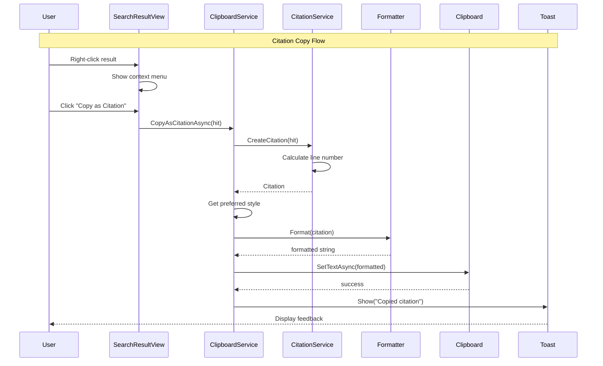

# LCS-SBD-052: Scope Breakdown — The Citation Engine

## Document Control

| Field            | Value                                                                            |
| :--------------- | :------------------------------------------------------------------------------- |
| **Document ID**  | LCS-SBD-052                                                                      |
| **Version**      | v0.5.2                                                                           |
| **Codename**     | The Citation Engine (Source Attribution)                                         |
| **Status**       | In Progress                                                                      |
| **Last Updated** | 2026-01-27                                                                       |
| **Owner**        | Lead Architect                                                                   |
| **Depends On**   | v0.5.1 (The Hybrid Engine), v0.4.5 (Semantic Search), v0.4.1 (Vector Foundation) |

---

## 1. Executive Summary

### 1.1 The Vision

**v0.5.2** delivers the **Citation Engine** — comprehensive source attribution for every retrieved chunk. This release transforms Lexichord's RAG system from a simple search tool into a trustworthy knowledge retrieval platform, enabling writers to trace every piece of information back to its exact source location.

While v0.5.1 delivered hybrid search combining BM25 and semantic matching, the Citation Engine ensures that every search result carries complete provenance information. Writers can now confidently cite their sources, verify information currency, and quickly navigate to original documents—essential for academic writing, technical documentation, and enterprise compliance.

### 1.2 Business Value

- **Source Traceability:** Every retrieved chunk is linked to its exact location (file, heading, line number).
- **Citation Formatting:** Multiple citation styles (inline, footnote, Markdown) for different publishing contexts.
- **Freshness Verification:** Automatic detection of stale citations when source documents change.
- **Workflow Efficiency:** One-click copy actions for different citation formats reduce manual work.
- **Trust & Compliance:** Enterprise users can verify AI-assisted content against original sources.
- **Foundation:** Enables the Context Window (v0.5.3) and Relevance Tuner (v0.5.4) to build on citation infrastructure.

### 1.3 Success Criteria

This release succeeds when:

1. Citations include accurate document path, heading, and line number for all search results.
2. Users can format citations in at least 3 styles (Inline, Footnote, Markdown).
3. Stale citation detection identifies when source files have changed since indexing.
4. Copy actions place correctly formatted citations on the clipboard in < 50ms.
5. All citation features respect license gating (WriterPro+ for full features).

### 1.4 License Gating

The Citation Engine is a **Writer Pro** feature. Lower tiers will see:

- Basic source path display (no formatted citations)
- "Upgrade to Writer Pro" prompt when clicking citation format buttons
- Copy actions limited to raw chunk text (no formatted citations)
- Stale detection indicator hidden with upgrade CTA

---

## 2. Dependencies on Prior Versions

| Component                | Source Version        | Usage in v0.5.2                            |
| :----------------------- | :-------------------- | :----------------------------------------- |
| `ISemanticSearchService` | v0.4.5a               | Search result source for citation creation |
| `SearchHit`              | v0.4.5a               | Contains chunk and document references     |
| `IDocumentRepository`    | v0.4.1c               | Document metadata retrieval for citations  |
| `IChunkRepository`       | v0.4.1c               | Chunk retrieval for context                |
| `Document`               | v0.4.1c               | Document entity with IndexedAt timestamp   |
| `IWorkspaceService`      | v0.1.2a               | File system access for stale detection     |
| `ISettingsService`       | v0.1.6a               | User preference for citation style         |
| `ILicenseContext`        | v0.0.4c               | License tier checking                      |
| `IMediator`              | v0.0.7a               | Event publishing                           |
| `ILogger<T>`             | v0.0.3b               | Structured logging                         |
| `IConfiguration`         | v0.0.3d               | Configuration access                       |
| `ViewModelBase`          | CommunityToolkit.Mvvm | Observable ViewModel base (external NuGet) |

---

## 3. Sub-Part Specifications

### 3.1 v0.5.2a: Citation Model

| Field            | Value                    |
| :--------------- | :----------------------- |
| **Sub-Part ID**  | RAG-052a                 |
| **Title**        | Citation Data Structures |
| **Module**       | `Lexichord.Modules.RAG`  |
| **License Tier** | Writer Pro               |

**Goal:** Define the `Citation` record and `ICitationService` interface that enables creation, formatting, and validation of source citations.

**Key Deliverables:**

- `Citation` record in `Lexichord.Abstractions` with all provenance fields
- `CitationStyle` enum (Inline, Footnote, Markdown)
- `ICitationService` interface in `Lexichord.Abstractions`
- `CitationService` implementation in `Modules.RAG`
- `CitationCreatedEvent` MediatR notification
- Unit tests for citation creation from search hits

**Key Interfaces:**

```csharp
namespace Lexichord.Abstractions.Contracts;

/// <summary>
/// Represents attribution information for a retrieved chunk.
/// </summary>
/// <param name="ChunkId">Unique identifier of the source chunk.</param>
/// <param name="DocumentPath">Absolute path to the source document.</param>
/// <param name="DocumentTitle">Display title (filename if no frontmatter title).</param>
/// <param name="StartOffset">Character offset where chunk begins.</param>
/// <param name="EndOffset">Character offset where chunk ends.</param>
/// <param name="Heading">Parent heading context, if any.</param>
/// <param name="LineNumber">Starting line number in source document.</param>
/// <param name="IndexedAt">Timestamp when document was last indexed.</param>
public record Citation(
    Guid ChunkId,
    string DocumentPath,
    string DocumentTitle,
    int StartOffset,
    int EndOffset,
    string? Heading,
    int? LineNumber,
    DateTime IndexedAt);

/// <summary>
/// Citation formatting styles.
/// </summary>
public enum CitationStyle
{
    /// <summary>Inline: "[auth-guide.md, §Authentication]"</summary>
    Inline,

    /// <summary>Footnote: "[^1]: /path/to/doc.md:42"</summary>
    Footnote,

    /// <summary>Markdown: "[Title](file:///path#L42)"</summary>
    Markdown
}

/// <summary>
/// Service for creating, formatting, and validating citations.
/// </summary>
public interface ICitationService
{
    /// <summary>
    /// Creates a citation from a search result hit.
    /// </summary>
    Citation CreateCitation(SearchHit hit);

    /// <summary>
    /// Formats a citation according to the specified style.
    /// </summary>
    string FormatCitation(Citation citation, CitationStyle style);

    /// <summary>
    /// Validates that the citation's source has not changed since indexing.
    /// </summary>
    Task<bool> ValidateCitationAsync(Citation citation, CancellationToken ct = default);
}
```

**Dependencies:**

- v0.4.5a: `SearchHit` (source data for citation creation)
- v0.4.1c: `IDocumentRepository` (document metadata)
- v0.1.2a: `IWorkspaceService` (file system access)

---

### 3.2 v0.5.2b: Citation Styles

| Field            | Value                       |
| :--------------- | :-------------------------- |
| **Sub-Part ID**  | RAG-052b                    |
| **Title**        | Citation Formatting Options |
| **Module**       | `Lexichord.Modules.RAG`     |
| **License Tier** | Teams (Custom styles)       |

**Goal:** Implement multiple citation formatting options with user preference storage and preview capabilities.

**Key Deliverables:**

- `InlineCitationFormatter` - "[doc.md, §Heading]" format
- `FootnoteCitationFormatter` - "[^1]: path:line" format
- `MarkdownCitationFormatter` - "[Title](file:///path#L42)" format
- `ICitationFormatter` interface for extensibility
- User preference storage via `ISettingsService`
- Settings UI for citation style selection
- Unit tests for each format style

**Key Interfaces:**

```csharp
namespace Lexichord.Abstractions.Contracts;

/// <summary>
/// Formatter for a specific citation style.
/// </summary>
public interface ICitationFormatter
{
    /// <summary>
    /// The style this formatter produces.
    /// </summary>
    CitationStyle Style { get; }

    /// <summary>
    /// Formats a citation to a display string.
    /// </summary>
    string Format(Citation citation);

    /// <summary>
    /// Formats a citation for clipboard copy (may differ from display).
    /// </summary>
    string FormatForClipboard(Citation citation);
}
```

**Format Examples:**

```text
INLINE FORMAT:
  Input:  Citation for chunk in "auth-guide.md" under "Authentication" heading
  Output: [auth-guide.md, §Authentication]

FOOTNOTE FORMAT:
  Input:  Citation for chunk at line 42 in "/docs/api/auth.md"
  Output: [^1]: /docs/api/auth.md:42

MARKDOWN FORMAT:
  Input:  Citation for "OAuth Guide" document
  Output: [OAuth Guide](file:///docs/api/auth.md#L42)
```

**User Preference Storage:**

- Storage Location: User settings via `ISettingsService`
- Key: `Citation.DefaultStyle`
- Values: `Inline` | `Footnote` | `Markdown`
- Default: `Inline`

**Dependencies:**

- v0.5.2a: `Citation` record, `ICitationService`
- v0.1.6a: `ISettingsService` (preference storage)

---

### 3.3 v0.5.2c: Stale Citation Detection

| Field            | Value                         |
| :--------------- | :---------------------------- |
| **Sub-Part ID**  | RAG-052c                      |
| **Title**        | Citation Freshness Validation |
| **Module**       | `Lexichord.Modules.RAG`       |
| **License Tier** | Writer Pro                    |

**Goal:** Implement validation logic that compares citation timestamps against current file state to detect stale references.

**Key Deliverables:**

- `ICitationValidator` interface in `Lexichord.Abstractions`
- `CitationValidator` implementation using file hash comparison
- `CitationValidationResult` record with validation status
- `CitationValidationFailedEvent` MediatR notification
- Stale indicator UI component with warning styling
- "Re-verify" action to re-index and update citation
- Unit tests for validation scenarios

**Key Interfaces:**

```csharp
namespace Lexichord.Abstractions.Contracts;

/// <summary>
/// Result of citation validation.
/// </summary>
public record CitationValidationResult(
    Citation Citation,
    bool IsValid,
    CitationValidationStatus Status,
    DateTime? CurrentModifiedAt,
    string? ErrorMessage);

/// <summary>
/// Status of citation validation.
/// </summary>
public enum CitationValidationStatus
{
    /// <summary>Source unchanged since indexing.</summary>
    Valid,

    /// <summary>Source file has been modified.</summary>
    Stale,

    /// <summary>Source file no longer exists.</summary>
    Missing,

    /// <summary>Validation could not complete.</summary>
    Error
}

/// <summary>
/// Validates citations against current file state.
/// </summary>
public interface ICitationValidator
{
    /// <summary>
    /// Validates a single citation.
    /// </summary>
    Task<CitationValidationResult> ValidateAsync(
        Citation citation,
        CancellationToken ct = default);

    /// <summary>
    /// Validates multiple citations in batch.
    /// </summary>
    Task<IReadOnlyList<CitationValidationResult>> ValidateBatchAsync(
        IEnumerable<Citation> citations,
        CancellationToken ct = default);
}
```

**Stale Detection Logic:**

```text
VALIDATE citation:
│
├── Does source file exist at Citation.DocumentPath?
│   ├── NO → Return Missing status
│   └── YES → Continue
│
├── Get file's current LastWriteTime
│
├── Is LastWriteTime > Citation.IndexedAt?
│   ├── YES → Return Stale status (file modified after indexing)
│   └── NO → Continue
│
├── (Optional) Compute current file hash
│   ├── Hash matches indexed hash? → Return Valid
│   └── Hash differs? → Return Stale
│
└── Return Valid status
```

**Key UI Components (Stale Indicator):**

```text
┌──────────────────────────────────────────────────────────┐
│  ⚠️ Citation may be stale                                │
│  Source modified: Jan 27, 2026 at 2:30 PM                │
│  Indexed: Jan 25, 2026 at 10:15 AM                       │
│                                                          │
│  [Re-verify]  [Dismiss]                                  │
└──────────────────────────────────────────────────────────┘
```

**Dependencies:**

- v0.5.2a: `Citation` record
- v0.4.2b: `IFileHashService` (hash comparison)
- v0.4.7b: `IIndexManagementService` (re-index action)

---

### 3.4 v0.5.2d: Citation Copy Actions

| Field            | Value                         |
| :--------------- | :---------------------------- |
| **Sub-Part ID**  | RAG-052d                      |
| **Title**        | Clipboard Citation Operations |
| **Module**       | `Lexichord.Modules.RAG`       |
| **License Tier** | Writer Pro                    |

**Goal:** Add clipboard operations for copying citations in various formats directly from search results.

**Key Deliverables:**

- `ICitationClipboardService` interface
- `CitationClipboardService` implementation
- Context menu integration for search result items
- "Copy as Markdown Link" action
- "Copy as Citation" action (uses default style)
- "Copy Chunk Text" action (raw content)
- Keyboard shortcuts (Ctrl+Shift+C for citation, Ctrl+C for text)
- Toast/feedback notification on successful copy
- Unit tests for clipboard operations

**Key Interfaces:**

```csharp
namespace Lexichord.Abstractions.Contracts;

/// <summary>
/// Clipboard operations for citations.
/// </summary>
public interface ICitationClipboardService
{
    /// <summary>
    /// Copies citation as a Markdown link.
    /// </summary>
    Task CopyAsMarkdownLinkAsync(Citation citation);

    /// <summary>
    /// Copies citation in the user's preferred style.
    /// </summary>
    Task CopyAsCitationAsync(Citation citation);

    /// <summary>
    /// Copies citation in a specific style.
    /// </summary>
    Task CopyAsCitationAsync(Citation citation, CitationStyle style);

    /// <summary>
    /// Copies the raw chunk text.
    /// </summary>
    Task CopyChunkTextAsync(string chunkText);
}
```

**Context Menu Structure:**

```text
[Right-click on search result]
┌────────────────────────────────────┐
│  Copy as Markdown Link   Ctrl+M    │
│  Copy as Citation        Ctrl+Shift+C │
│  Copy Chunk Text         Ctrl+C    │
│  ─────────────────────────────────  │
│  Open Source File        Enter     │
│  Re-index Document       Ctrl+R    │
└────────────────────────────────────┘
```

**Toast Notification:**

```text
┌──────────────────────────────────────┐
│  ✓ Copied citation to clipboard      │
│  "[auth-guide.md, §Authentication]"  │
└──────────────────────────────────────┘
  (Auto-dismiss after 2 seconds)
```

**Dependencies:**

- v0.5.2a: `Citation` record, `ICitationService`
- v0.5.2b: `ICitationFormatter`, citation styles
- v0.4.6b: `SearchResultItemViewModel` (context menu host)
- Avalonia Clipboard API

---

## 4. Implementation Checklist

| #         | Sub-Part | Task                                                | Est. Hours   |
| :-------- | :------- | :-------------------------------------------------- | :----------- |
| 1 ✅      | v0.5.2a  | Create `Citation` record in Abstractions            | 0.5          |
| 2 ✅      | v0.5.2a  | Create `CitationStyle` enum                         | 0.25         |
| 3 ✅      | v0.5.2a  | Create `ICitationService` interface                 | 0.5          |
| 4 ✅      | v0.5.2a  | Implement `CitationService.CreateCitation()`        | 2            |
| 5 ✅      | v0.5.2a  | Implement line number calculation from chunk offset | 1.5          |
| 6 ✅      | v0.5.2a  | Implement `FormatCitation()` with all styles        | 1.5          |
| 7 ✅      | v0.5.2a  | Implement `ValidateCitationAsync()` basic check     | 1            |
| 8 ✅      | v0.5.2a  | Create `CitationCreatedEvent` MediatR notification  | 0.5          |
| 9 ✅      | v0.5.2a  | Unit tests for citation creation                    | 2            |
| 10        | v0.5.2b  | Create `ICitationFormatter` interface               | 0.25         |
| 11        | v0.5.2b  | Implement `InlineCitationFormatter`                 | 1            |
| 12        | v0.5.2b  | Implement `FootnoteCitationFormatter`               | 1            |
| 13        | v0.5.2b  | Implement `MarkdownCitationFormatter`               | 1            |
| 14        | v0.5.2b  | Add citation style setting to `ISettingsService`    | 1            |
| 15        | v0.5.2b  | Create settings UI for citation style selection     | 1.5          |
| 16        | v0.5.2b  | Unit tests for all formatters                       | 1.5          |
| 17        | v0.5.2c  | Create `CitationValidationResult` record            | 0.25         |
| 18        | v0.5.2c  | Create `CitationValidationStatus` enum              | 0.25         |
| 19        | v0.5.2c  | Create `ICitationValidator` interface               | 0.5          |
| 20        | v0.5.2c  | Implement `CitationValidator` with file checks      | 2            |
| 21        | v0.5.2c  | Implement batch validation with parallelism         | 1            |
| 22        | v0.5.2c  | Create `CitationValidationFailedEvent`              | 0.5          |
| 23        | v0.5.2c  | Create stale indicator UI component                 | 1.5          |
| 24        | v0.5.2c  | Implement "Re-verify" action                        | 1            |
| 25        | v0.5.2c  | Unit tests for validation scenarios                 | 2            |
| 26        | v0.5.2d  | Create `ICitationClipboardService` interface        | 0.5          |
| 27        | v0.5.2d  | Implement `CitationClipboardService`                | 1.5          |
| 28        | v0.5.2d  | Integrate context menu with search results          | 1.5          |
| 29        | v0.5.2d  | Implement keyboard shortcuts                        | 1            |
| 30        | v0.5.2d  | Create toast notification component                 | 1            |
| 31        | v0.5.2d  | Unit tests for clipboard operations                 | 1.5          |
| 32        | All      | Integration tests for citation workflow             | 2            |
| 33        | All      | DI registration in `RAGModule.cs`                   | 0.5          |
| **Total** |          |                                                     | **34 hours** |

---

## 5. Dependency Matrix

### 5.1 Required Interfaces (from earlier versions)

| Interface                 | Source Version | Purpose                         |
| :------------------------ | :------------- | :------------------------------ |
| `ISemanticSearchService`  | v0.4.5a        | Search result source            |
| `SearchHit`               | v0.4.5a        | Search result container         |
| `IDocumentRepository`     | v0.4.1c        | Document metadata access        |
| `IChunkRepository`        | v0.4.1c        | Chunk content retrieval         |
| `Document`                | v0.4.1c        | Document entity with timestamps |
| `IFileHashService`        | v0.4.2b        | File change detection           |
| `IIndexManagementService` | v0.4.7b        | Re-index operations             |
| `IWorkspaceService`       | v0.1.2a        | File system access              |
| `ISettingsService`        | v0.1.6a        | User preference storage         |
| `ILicenseContext`         | v0.0.4c        | License tier checking           |

### 5.2 New Interfaces (defined in v0.5.2)

| Interface                   | Defined In | Module       | Purpose                      |
| :-------------------------- | :--------- | :----------- | :--------------------------- |
| `ICitationService`          | v0.5.2a    | Abstractions | Citation creation/formatting |
| `ICitationFormatter`        | v0.5.2b    | Abstractions | Style-specific formatting    |
| `ICitationValidator`        | v0.5.2c    | Abstractions | Freshness validation         |
| `ICitationClipboardService` | v0.5.2d    | Abstractions | Clipboard operations         |

### 5.3 New Records/DTOs (defined in v0.5.2)

| Record                          | Defined In | Purpose                       |
| :------------------------------ | :--------- | :---------------------------- |
| `Citation`                      | v0.5.2a    | Source attribution data       |
| `CitationValidationResult`      | v0.5.2c    | Validation outcome            |
| `CitationCreatedEvent`          | v0.5.2a    | Citation created notification |
| `CitationValidationFailedEvent` | v0.5.2c    | Stale citation notification   |

### 5.4 New Enums (defined in v0.5.2)

| Enum                       | Defined In | Purpose                   |
| :------------------------- | :--------- | :------------------------ |
| `CitationStyle`            | v0.5.2a    | Inline/Footnote/Markdown  |
| `CitationValidationStatus` | v0.5.2c    | Valid/Stale/Missing/Error |

### 5.5 NuGet Packages

| Package                 | Version | Purpose                | New/Existing |
| :---------------------- | :------ | :--------------------- | :----------- |
| `MediatR`               | 12.x    | Event publishing       | Existing     |
| `CommunityToolkit.Mvvm` | 8.x     | MVVM source generators | Existing     |

---

## 6. Architecture Diagram

```mermaid
graph TB
    subgraph "Lexichord.Modules.RAG"
        subgraph "Presentation Layer"
            SRV[SearchResultItemView<br/>Context menu host]
            TOAST[ToastNotification<br/>Copy feedback]
        end

        subgraph "Services"
            CS[CitationService<br/>Create & format]
            CV[CitationValidator<br/>Freshness check]
            CCS[CitationClipboardService<br/>Copy operations]
        end

        subgraph "Formatters"
            ILF[InlineCitationFormatter]
            FNF[FootnoteCitationFormatter]
            MDF[MarkdownCitationFormatter]
        end

        subgraph "Events"
            CCE[CitationCreatedEvent]
            CVF[CitationValidationFailedEvent]
        end
    end

    subgraph "Lexichord.Abstractions"
        ICS[ICitationService]
        ICF[ICitationFormatter]
        ICV[ICitationValidator]
        ICC[ICitationClipboardService]
        CIT[Citation]
        CVR[CitationValidationResult]
    end

    subgraph "Dependencies (Prior Versions)"
        SEARCH[SearchHit<br/>v0.4.5a]
        DOC[IDocumentRepository<br/>v0.4.1c]
        FHS[IFileHashService<br/>v0.4.2b]
        SET[ISettingsService<br/>v0.1.6a]
    end

    SRV --> CCS
    CCS --> CS
    CS --> ICS
    CS --> ILF
    CS --> FNF
    CS --> MDF

    CV --> ICV
    CV --> FHS
    CV --> DOC

    CS --> SEARCH
    CS --> DOC
    CCS --> SET

    CS --> CCE
    CV --> CVF

    style SRV fill:#4a9eff,color:#fff
    style TOAST fill:#4a9eff,color:#fff
    style CS fill:#22c55e,color:#fff
    style CV fill:#22c55e,color:#fff
    style CCS fill:#22c55e,color:#fff
    style ILF fill:#f97316,color:#fff
    style FNF fill:#f97316,color:#fff
    style MDF fill:#f97316,color:#fff
```



---

## 7. Data Flow Diagram



---

## 8. Risks & Mitigations

| Risk                                          | Impact | Probability | Mitigation                                              |
| :-------------------------------------------- | :----- | :---------- | :------------------------------------------------------ |
| Line number calculation inaccurate for chunks | Medium | Medium      | Use stored offset + file content to calculate precisely |
| Stale detection false positives on saves      | Low    | Medium      | Compare content hash, not just timestamp                |
| Clipboard access fails on Linux               | Medium | Low         | Graceful fallback with error toast                      |
| Citation style preference not persisted       | Low    | Low         | Use ISettingsService with sensible defaults             |
| Performance impact with batch validation      | Medium | Low         | Limit concurrent checks, use cancellation token         |
| File renamed breaks citation path             | High   | Low         | Track by file hash in addition to path (future v0.5.x)  |

---

## 9. Success Metrics

| Metric                   | Target  | Measurement                         |
| :----------------------- | :------ | :---------------------------------- |
| Citation creation time   | < 10ms  | Stopwatch timing                    |
| Citation formatting time | < 1ms   | Stopwatch timing                    |
| Validation (single file) | < 50ms  | Includes file stat call             |
| Validation (batch of 20) | < 200ms | Parallel execution                  |
| Clipboard copy           | < 50ms  | End-to-end timing                   |
| Line number accuracy     | 100%    | Compare against manual verification |

---

## 10. What This Enables

After v0.5.2, Lexichord will support:

- **v0.5.3 (Context Window):** Expand citations to show surrounding context from same document.
- **v0.5.4 (Relevance Tuner):** Use citation metadata for query refinement.
- **v0.5.5 (Filter System):** Filter search by documents already cited.
- **Future:** Citation bibliography generation, export to reference managers.

---

## 11. Decision Trees

### 11.1 Should Citation Be Created?

```text
START: "Create citation from search hit?"
│
├── Is SearchHit null?
│   ├── YES → Return null, log warning
│   └── NO → Continue
│
├── Is Document available?
│   ├── NO → Create citation with path only
│   └── YES → Continue
│
├── Calculate line number from offset
│   ├── File accessible? → Calculate from content
│   └── File not accessible → Use stored offset only
│
├── Extract heading from chunk metadata
│
└── Create and return Citation
```

### 11.2 How to Validate Citation?

```text
START: "Validate citation freshness"
│
├── Does file exist at DocumentPath?
│   ├── NO → Return Missing status
│   └── YES → Continue
│
├── Get file modification timestamp
│
├── Is ModifiedAt > IndexedAt?
│   ├── NO → Return Valid (unchanged)
│   └── YES → Continue (potentially stale)
│
├── (Optional) Compute file hash
│   └── Compare with stored hash
│       ├── Match → Return Valid (save timestamp changed, content same)
│       └── Differ → Return Stale
│
└── Return Stale status
```

---

## 12. User Stories

| ID    | Role            | Story                                                                           | Acceptance Criteria                        |
| :---- | :-------------- | :------------------------------------------------------------------------------ | :----------------------------------------- |
| US-01 | Writer Pro User | As a writer, I want to copy citations from search results so I can cite sources | Click context menu, citation on clipboard  |
| US-02 | Writer Pro User | As a writer, I want to choose citation format so it matches my document         | Settings panel allows format selection     |
| US-03 | Writer Pro User | As a writer, I want to know if a citation is stale so I verify information      | Warning icon appears on modified sources   |
| US-04 | Writer Pro User | As a writer, I want to re-verify citations so I can update stale references     | Re-verify action re-indexes source file    |
| US-05 | Core User       | As a free user, I want to see source paths so I know where info came from       | Basic path shown, formatted citation gated |
| US-06 | Teams User      | As a team lead, I want consistent citation styles across my team                | Team settings override personal preference |

---

## 13. Use Cases

### UC-01: Copy Citation to Clipboard

**Preconditions:**

- User has Writer Pro license
- User has performed a semantic search
- Search results are displayed

**Flow:**

1. User right-clicks on a search result item.
2. System displays context menu with citation options.
3. User clicks "Copy as Citation".
4. System creates Citation from SearchHit.
5. System formats citation using user's preferred style.
6. System copies formatted string to clipboard.
7. System displays toast notification confirming copy.

**Postconditions:**

- Clipboard contains formatted citation
- CitationCreatedEvent published

---

### UC-02: Detect Stale Citation

**Preconditions:**

- User has Writer Pro license
- Citation was created from a search result
- Source file has been modified since indexing

**Flow:**

1. System automatically validates citation on display.
2. System detects file modification timestamp > IndexedAt.
3. System displays warning icon next to result.
4. User hovers over warning to see details.
5. User clicks "Re-verify" action.
6. System re-indexes the source document.
7. System updates citation with new IndexedAt.
8. Warning icon is removed.

**Postconditions:**

- Citation is current with source
- CitationValidationFailedEvent was published

---

## 14. Unit Testing Requirements

### 14.1 CitationService Tests

```csharp
[Trait("Category", "Unit")]
[Trait("Feature", "v0.5.2a")]
public class CitationServiceTests
{
    [Fact]
    public void CreateCitation_FromSearchHit_ReturnsCompleteCitation()
    {
        // Arrange
        var hit = CreateTestSearchHit();
        var sut = new CitationService(_documentRepoMock.Object, _workspaceMock.Object);

        // Act
        var citation = sut.CreateCitation(hit);

        // Assert
        citation.DocumentPath.Should().Be("/docs/test.md");
        citation.ChunkId.Should().Be(hit.Chunk.Id);
        citation.LineNumber.Should().BePositive();
    }

    [Theory]
    [InlineData(CitationStyle.Inline, "[test.md, §Introduction]")]
    [InlineData(CitationStyle.Markdown, "[Test Document](file:///docs/test.md#L10)")]
    public void FormatCitation_WithStyle_ReturnsCorrectFormat(
        CitationStyle style, string expectedPattern)
    {
        var citation = CreateTestCitation();
        var sut = new CitationService(...);

        var result = sut.FormatCitation(citation, style);

        result.Should().Contain(expectedPattern);
    }
}
```

### 14.2 CitationValidator Tests

```csharp
[Trait("Category", "Unit")]
[Trait("Feature", "v0.5.2c")]
public class CitationValidatorTests
{
    [Fact]
    public async Task ValidateAsync_FileUnchanged_ReturnsValid()
    {
        // Arrange
        var citation = CreateCitationIndexedAt(DateTime.UtcNow.AddHours(-1));
        _fileSystemMock.SetupFileModifiedAt(DateTime.UtcNow.AddHours(-2));

        var sut = new CitationValidator(_fileSystemMock.Object);

        // Act
        var result = await sut.ValidateAsync(citation);

        // Assert
        result.Status.Should().Be(CitationValidationStatus.Valid);
    }

    [Fact]
    public async Task ValidateAsync_FileModified_ReturnsStale()
    {
        var citation = CreateCitationIndexedAt(DateTime.UtcNow.AddHours(-2));
        _fileSystemMock.SetupFileModifiedAt(DateTime.UtcNow.AddHours(-1));

        var sut = new CitationValidator(_fileSystemMock.Object);

        var result = await sut.ValidateAsync(citation);

        result.Status.Should().Be(CitationValidationStatus.Stale);
    }

    [Fact]
    public async Task ValidateAsync_FileMissing_ReturnsMissing()
    {
        var citation = CreateTestCitation();
        _fileSystemMock.SetupFileNotExists();

        var sut = new CitationValidator(_fileSystemMock.Object);

        var result = await sut.ValidateAsync(citation);

        result.Status.Should().Be(CitationValidationStatus.Missing);
    }
}
```

---

## 15. Observability & Logging

| Level   | Source            | Message Template                                               |
| :------ | :---------------- | :------------------------------------------------------------- |
| Debug   | CitationService   | `"Creating citation for chunk {ChunkId} from {DocumentPath}"`  |
| Debug   | CitationService   | `"Calculated line number {LineNumber} from offset {Offset}"`   |
| Info    | CitationService   | `"Citation created for {DocumentTitle} in {ElapsedMs}ms"`      |
| Debug   | CitationValidator | `"Validating citation for {DocumentPath}"`                     |
| Warning | CitationValidator | `"Citation stale: {DocumentPath} modified at {ModifiedAt}"`    |
| Warning | CitationValidator | `"Citation invalid: {DocumentPath} not found"`                 |
| Debug   | ClipboardService  | `"Copying citation as {Style} format"`                         |
| Info    | ClipboardService  | `"Citation copied to clipboard: {FormattedLength} characters"` |
| Error   | ClipboardService  | `"Clipboard operation failed: {ErrorMessage}"`                 |

---

## 16. UI/UX Specifications

### 16.1 Search Result Context Menu

```text
┌────────────────────────────────────────────────────────────────┐
│  📋 Copy as Markdown Link              Ctrl+M                  │
│  📋 Copy as Citation                   Ctrl+Shift+C            │
│  📋 Copy Chunk Text                    Ctrl+C                  │
│  ─────────────────────────────────────────────────────────────  │
│  📂 Open Source File                   Enter                   │
│  🔄 Re-index Document                  Ctrl+R                  │
└────────────────────────────────────────────────────────────────┘
```

### 16.2 Stale Citation Indicator

```text
┌──────────────────────────────────────────────────────────────────┐
│  [Search Result Title]                                    ⚠️     │
│  /path/to/document.md • Line 42                                  │
│  ─────────────────────────────────────────────────────────────   │
│  "The matching text from the chunk content..."                   │
└──────────────────────────────────────────────────────────────────┘

[Hover over ⚠️]
┌─────────────────────────────────────────────┐
│  Source may have changed                     │
│  Indexed: Jan 25, 2026                       │
│  Modified: Jan 27, 2026                      │
│  [Re-verify] [Dismiss]                       │
└─────────────────────────────────────────────┘
```

### 16.3 Toast Notification

```text
┌──────────────────────────────────────┐
│  ✓ Citation copied                   │
│  [doc.md, §Authentication]           │
└──────────────────────────────────────┘
  (2 second auto-dismiss)
```

### 16.4 Component Styling Requirements

| Component             | Theme Resource             | Notes                   |
| :-------------------- | :------------------------- | :---------------------- |
| Context menu          | `LexContextMenu` theme     | Standard context menu   |
| Stale indicator (⚠️)  | `Brush.Warning.Foreground` | Amber warning color     |
| Toast background      | `Brush.Surface.Overlay`    | 90% opacity overlay     |
| Toast success icon    | `Brush.Success.Foreground` | Green checkmark         |
| Copy button (primary) | `LexButtonPrimary` theme   | Standard primary button |

---

## 17. Acceptance Criteria (QA)

| #   | Category           | Criterion                                                     |
| :-- | :----------------- | :------------------------------------------------------------ |
| 1   | **Functional**     | Citation contains correct document path from search hit       |
| 2   | **Functional**     | Line number accurately reflects chunk position in source file |
| 3   | **Functional**     | All three citation styles produce valid, copyable text        |
| 4   | **Functional**     | Stale detection correctly identifies modified files           |
| 5   | **Functional**     | Copy action places text on clipboard successfully             |
| 6   | **Functional**     | Context menu displays all citation options                    |
| 7   | **Performance**    | Citation creation completes in < 10ms                         |
| 8   | **Performance**    | Clipboard copy completes in < 50ms                            |
| 9   | **License Gate**   | Core users see basic path but cannot copy formatted citations |
| 10  | **License Gate**   | Upgrade prompt shown when Core user clicks citation action    |
| 11  | **Accessibility**  | Keyboard shortcuts work for all copy actions                  |
| 12  | **Accessibility**  | Toast notification is screen-reader friendly                  |
| 13  | **Error Handling** | Graceful handling when source file is missing                 |
| 14  | **Error Handling** | Clipboard failure shows user-friendly error                   |

---

## 18. Verification Commands

```bash
# ═══════════════════════════════════════════════════════════════════════════
# v0.5.2 Verification
# ═══════════════════════════════════════════════════════════════════════════

# 1. Build solution
dotnet build

# 2. Run unit tests for v0.5.2 components
dotnet test --filter "Category=Unit&FullyQualifiedName~Citation"

# 3. Run all v0.5.2 tests
dotnet test --filter "Feature=v0.5.2"

# 4. Verify DI registration
grep -r "ICitationService" src/Lexichord.Modules.RAG/RAGModule.cs

# 5. Verify interface exists in Abstractions
ls src/Lexichord.Abstractions/Contracts/ICitation*.cs

# 6. Manual verification:
# a) Perform semantic search
# b) Right-click a result → "Copy as Citation"
# c) Paste into editor, verify format
# d) Modify source file, verify stale indicator appears
# e) Click "Re-verify", confirm indicator clears
```

---

## 19. Deliverable Checklist

| #   | Deliverable                                     | Status |
| :-- | :---------------------------------------------- | :----- |
| 1   | `Citation` record with all provenance fields    | [x]    |
| 2   | `CitationStyle` enum (Inline/Footnote/Markdown) | [x]    |
| 3   | `ICitationService` interface                    | [x]    |
| 4   | `CitationService` implementation                | [x]    |
| 5   | `CitationCreatedEvent` MediatR notification     | [x]    |
| 6   | `ICitationFormatter` interface                  | [ ]    |
| 7   | `InlineCitationFormatter` implementation        | [ ]    |
| 8   | `FootnoteCitationFormatter` implementation      | [ ]    |
| 9   | `MarkdownCitationFormatter` implementation      | [ ]    |
| 10  | Citation style user preference in settings      | [ ]    |
| 11  | `ICitationValidator` interface                  | [ ]    |
| 12  | `CitationValidator` implementation              | [ ]    |
| 13  | `CitationValidationResult` record               | [ ]    |
| 14  | `CitationValidationFailedEvent` notification    | [ ]    |
| 15  | Stale indicator UI component                    | [ ]    |
| 16  | `ICitationClipboardService` interface           | [ ]    |
| 17  | `CitationClipboardService` implementation       | [ ]    |
| 18  | Context menu integration                        | [ ]    |
| 19  | Toast notification component                    | [ ]    |
| 20  | Unit tests for all components                   | [~]    |
| 21  | Integration tests for citation workflow         | [ ]    |
| 22  | DI registration in RAGModule.cs                 | [x]    |

---

## 20. Code Examples

### 20.1 Citation Record

```csharp
namespace Lexichord.Abstractions.Contracts;

/// <summary>
/// Represents attribution information for a retrieved chunk.
/// Contains all data needed to trace content back to its source.
/// </summary>
/// <param name="ChunkId">Unique identifier of the source chunk.</param>
/// <param name="DocumentPath">Absolute path to the source document.</param>
/// <param name="DocumentTitle">Display title (filename if no frontmatter title).</param>
/// <param name="StartOffset">Character offset where chunk begins in source.</param>
/// <param name="EndOffset">Character offset where chunk ends in source.</param>
/// <param name="Heading">Parent heading context from chunk metadata, if available.</param>
/// <param name="LineNumber">Starting line number in source document (1-indexed).</param>
/// <param name="IndexedAt">UTC timestamp when document was last indexed.</param>
public record Citation(
    Guid ChunkId,
    string DocumentPath,
    string DocumentTitle,
    int StartOffset,
    int EndOffset,
    string? Heading,
    int? LineNumber,
    DateTime IndexedAt)
{
    /// <summary>
    /// The filename portion of the document path.
    /// </summary>
    public string FileName => Path.GetFileName(DocumentPath);

    /// <summary>
    /// Relative path from workspace root, if available.
    /// </summary>
    public string? RelativePath { get; init; }
}
```

### 20.2 CitationService Implementation

```csharp
namespace Lexichord.Modules.RAG.Services;

/// <summary>
/// Creates, formats, and validates source citations.
/// </summary>
public sealed class CitationService(
    IDocumentRepository documentRepository,
    IWorkspaceService workspace,
    ILogger<CitationService> logger) : ICitationService
{
    /// <inheritdoc />
    public Citation CreateCitation(SearchHit hit)
    {
        ArgumentNullException.ThrowIfNull(hit);

        var document = hit.Document;
        var chunk = hit.Chunk;

        logger.LogDebug(
            "Creating citation for chunk {ChunkId} from {DocumentPath}",
            chunk.Id, document.FilePath);

        var lineNumber = CalculateLineNumber(document.FilePath, chunk.StartOffset);

        logger.LogDebug(
            "Calculated line number {LineNumber} from offset {Offset}",
            lineNumber, chunk.StartOffset);

        return new Citation(
            ChunkId: chunk.Id,
            DocumentPath: document.FilePath,
            DocumentTitle: document.Title ?? Path.GetFileName(document.FilePath),
            StartOffset: chunk.StartOffset,
            EndOffset: chunk.EndOffset,
            Heading: chunk.Metadata?.Heading,
            LineNumber: lineNumber,
            IndexedAt: document.IndexedAt);
    }

    /// <inheritdoc />
    public string FormatCitation(Citation citation, CitationStyle style) => style switch
    {
        CitationStyle.Inline => FormatInline(citation),
        CitationStyle.Footnote => FormatFootnote(citation),
        CitationStyle.Markdown => FormatMarkdown(citation),
        _ => throw new ArgumentOutOfRangeException(nameof(style))
    };

    /// <inheritdoc />
    public async Task<bool> ValidateCitationAsync(Citation citation, CancellationToken ct)
    {
        if (!File.Exists(citation.DocumentPath))
        {
            logger.LogWarning(
                "Citation invalid: {DocumentPath} not found",
                citation.DocumentPath);
            return false;
        }

        var fileInfo = new FileInfo(citation.DocumentPath);
        var isValid = fileInfo.LastWriteTimeUtc <= citation.IndexedAt;

        if (!isValid)
        {
            logger.LogWarning(
                "Citation stale: {DocumentPath} modified at {ModifiedAt}",
                citation.DocumentPath, fileInfo.LastWriteTimeUtc);
        }

        return isValid;
    }

    private int? CalculateLineNumber(string filePath, int charOffset)
    {
        try
        {
            if (!File.Exists(filePath))
                return null;

            var content = File.ReadAllText(filePath);
            if (charOffset >= content.Length)
                return null;

            var lineNumber = 1;
            for (var i = 0; i < charOffset && i < content.Length; i++)
            {
                if (content[i] == '\n')
                    lineNumber++;
            }

            return lineNumber;
        }
        catch (Exception ex)
        {
            logger.LogWarning(ex,
                "Failed to calculate line number for {FilePath}", filePath);
            return null;
        }
    }

    private static string FormatInline(Citation citation)
    {
        var heading = citation.Heading is not null
            ? $", §{citation.Heading}"
            : string.Empty;
        return $"[{citation.FileName}{heading}]";
    }

    private static string FormatFootnote(Citation citation)
    {
        var line = citation.LineNumber.HasValue
            ? $":{citation.LineNumber}"
            : string.Empty;
        return $"[^{citation.ChunkId:N8}]: {citation.DocumentPath}{line}";
    }

    private static string FormatMarkdown(Citation citation)
    {
        var fragment = citation.LineNumber.HasValue
            ? $"#L{citation.LineNumber}"
            : string.Empty;
        return $"[{citation.DocumentTitle}](file://{citation.DocumentPath}{fragment})";
    }
}
```

---

## 21. Deferred Features

| Feature                       | Deferred To | Reason                                     |
| :---------------------------- | :---------- | :----------------------------------------- |
| Custom citation templates     | v0.5.7      | Requires template engine infrastructure    |
| Citation bibliography export  | v0.6.x      | Depends on document assembly features      |
| Reference manager integration | v0.7.x      | Requires external API integration          |
| File rename tracking          | v0.5.5      | Needs enhanced file watcher infrastructure |
| Citation count analytics      | v0.5.8      | Depends on telemetry infrastructure        |

---

## 22. Changelog Entry

Upon completion of v0.5.2, the following entry will be added to `CHANGELOG.md`:

```markdown
## [0.5.2] - 2026-XX-XX

### Added

- **Citation Model**: `Citation` record with complete source attribution (path, heading, line number)
- **Citation Formatting**: Three citation styles (Inline, Footnote, Markdown) with user preference
- **Stale Detection**: Automatic validation of citation freshness against source file timestamps
- **Copy Actions**: Context menu with "Copy as Markdown Link", "Copy as Citation", "Copy Chunk Text"
- **Toast Notifications**: Visual feedback for clipboard operations

### Changed

- Search results now display stale indicator when source files have been modified
- Context menu expanded with citation copy options

### Technical

- `ICitationService` interface for citation creation and formatting
- `ICitationValidator` interface for freshness validation
- `ICitationClipboardService` interface for clipboard operations
- `CitationCreatedEvent` and `CitationValidationFailedEvent` MediatR notifications
```

---
