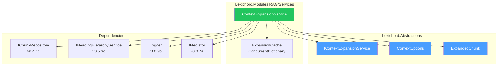
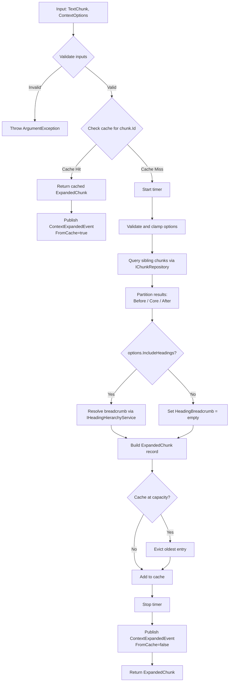

# LCS-DES-053a: Design Specification — Context Expansion Service

## 1. Metadata & Categorization

| Field                | Value                            |
| :------------------- | :------------------------------- |
| **Document ID**      | LCS-DES-053a                     |
| **Feature ID**       | RAG-053a                         |
| **Feature Name**     | Context Expansion Service        |
| **Parent Feature**   | v0.5.3 — The Context Window      |
| **Module Scope**     | Lexichord.Modules.RAG            |
| **Swimlane**         | Memory                           |
| **License Tier**     | Writer Pro                       |
| **Feature Gate Key** | `FeatureFlags.RAG.ContextWindow` |
| **Status**           | Draft                            |
| **Last Updated**     | 2026-01-27                       |

---

## 2. Executive Summary

### 2.1 Problem Statement

When users retrieve search results via semantic or hybrid search, they receive isolated text chunks without surrounding context. This makes it difficult to:

- Understand what comes before and after the excerpt
- Evaluate whether the result is truly relevant
- Navigate to the correct section in the source document

### 2.2 Solution Overview

Implement `IContextExpansionService` that aggregates a retrieved chunk with its surrounding chunks and heading hierarchy. The service provides:

- **Adjacent chunk retrieval** via sibling indices
- **Heading breadcrumb resolution** for document structure
- **LRU caching** to avoid repeated database queries
- **Configurable expansion options** for flexibility

### 2.3 Key Deliverables

| Deliverable                | Description                             |
| :------------------------- | :-------------------------------------- |
| `IContextExpansionService` | Interface in Lexichord.Abstractions     |
| `ContextExpansionService`  | Implementation in Modules.RAG/Services  |
| `ContextOptions`           | Configuration record                    |
| `ExpandedChunk`            | Result record with before/after context |
| `ContextExpandedEvent`     | MediatR event for analytics             |
| Unit tests                 | 90%+ coverage of expansion logic        |

---

## 3. Architecture & Modular Strategy

### 3.1 Component Diagram



### 3.2 Module Location

```text
src/
├── Lexichord.Abstractions/
│   └── Contracts/
│       ├── IContextExpansionService.cs     ← Interface
│       └── ContextModels.cs                ← ContextOptions, ExpandedChunk
│
└── Lexichord.Modules.RAG/
    ├── Services/
    │   └── ContextExpansionService.cs      ← Implementation
    └── Events/
        └── ContextExpandedEvent.cs         ← MediatR event
```

---

## 4. Data Contract (The API)

### 4.1 IContextExpansionService Interface

```csharp
namespace Lexichord.Abstractions.Contracts;

/// <summary>
/// Expands a retrieved chunk with surrounding context from the same document.
/// </summary>
/// <remarks>
/// <para>Context expansion retrieves adjacent chunks (before/after) based on chunk_index.</para>
/// <para>The service also resolves the parent heading hierarchy for document structure.</para>
/// <para>Results are cached per-session to minimize database queries.</para>
/// </remarks>
/// <example>
/// <code>
/// var options = new ContextOptions(PrecedingChunks: 2, FollowingChunks: 1);
/// var expanded = await contextService.ExpandAsync(chunk, options);
/// // expanded.Before contains 2 chunks, expanded.After contains 1 chunk
/// </code>
/// </example>
public interface IContextExpansionService
{
    /// <summary>
    /// Expands a chunk with its surrounding context.
    /// </summary>
    /// <param name="chunk">The core chunk to expand. MUST NOT be null.</param>
    /// <param name="options">Expansion configuration options. If null, uses defaults.</param>
    /// <param name="cancellationToken">Cancellation token for async operation.</param>
    /// <returns>Expanded chunk with before/after context and heading hierarchy.</returns>
    /// <exception cref="ArgumentNullException">Thrown when <paramref name="chunk"/> is null.</exception>
    Task<ExpandedChunk> ExpandAsync(
        TextChunk chunk,
        ContextOptions? options = null,
        CancellationToken cancellationToken = default);

    /// <summary>
    /// Clears the context cache for a specific document.
    /// </summary>
    /// <param name="documentId">Document ID to clear from cache.</param>
    /// <remarks>Call this when a document is re-indexed to prevent stale context.</remarks>
    void InvalidateCache(Guid documentId);

    /// <summary>
    /// Clears the entire context cache.
    /// </summary>
    /// <remarks>Use sparingly; primarily for testing or memory pressure scenarios.</remarks>
    void ClearCache();
}
```

### 4.2 ContextOptions Record

```csharp
namespace Lexichord.Abstractions.Contracts;

/// <summary>
/// Configuration options for context expansion.
/// </summary>
/// <param name="PrecedingChunks">
/// Number of chunks to retrieve before the core chunk.
/// Defaults to 1. Maximum is 5.
/// </param>
/// <param name="FollowingChunks">
/// Number of chunks to retrieve after the core chunk.
/// Defaults to 1. Maximum is 5.
/// </param>
/// <param name="IncludeHeadings">
/// Whether to include heading hierarchy breadcrumb.
/// Defaults to true.
/// </param>
/// <example>
/// <code>
/// // Default expansion: 1 before, 1 after, with headings
/// var options = new ContextOptions();
///
/// // Custom expansion: 2 before, 3 after, no headings
/// var options = new ContextOptions(
///     PrecedingChunks: 2,
///     FollowingChunks: 3,
///     IncludeHeadings: false);
/// </code>
/// </example>
public record ContextOptions(
    int PrecedingChunks = 1,
    int FollowingChunks = 1,
    bool IncludeHeadings = true)
{
    /// <summary>
    /// Maximum allowed value for PrecedingChunks and FollowingChunks.
    /// </summary>
    public const int MaxChunkWindow = 5;

    /// <summary>
    /// Validates options and clamps values to allowed range.
    /// </summary>
    /// <returns>A validated ContextOptions instance.</returns>
    public ContextOptions Validated() => this with
    {
        PrecedingChunks = Math.Clamp(PrecedingChunks, 0, MaxChunkWindow),
        FollowingChunks = Math.Clamp(FollowingChunks, 0, MaxChunkWindow)
    };
}
```

### 4.3 ExpandedChunk Record

```csharp
namespace Lexichord.Abstractions.Contracts;

/// <summary>
/// A chunk with its expanded context.
/// </summary>
/// <param name="Core">
/// The original retrieved chunk. Never null.
/// </param>
/// <param name="Before">
/// Chunks preceding the core chunk, ordered by ascending chunk_index.
/// Empty if no preceding chunks exist or were requested.
/// </param>
/// <param name="After">
/// Chunks following the core chunk, ordered by ascending chunk_index.
/// Empty if no following chunks exist or were requested.
/// </param>
/// <param name="ParentHeading">
/// The immediate parent heading text, if available.
/// Null if no heading context or IncludeHeadings was false.
/// </param>
/// <param name="HeadingBreadcrumb">
/// Full heading hierarchy as breadcrumb trail, from root to immediate parent.
/// Example: ["Authentication", "OAuth", "Token Refresh"]
/// Empty if no heading context or IncludeHeadings was false.
/// </param>
/// <example>
/// <code>
/// var expanded = await contextService.ExpandAsync(chunk, options);
///
/// Console.WriteLine($"Before: {expanded.Before.Count} chunks");
/// Console.WriteLine($"Core: {expanded.Core.Content}");
/// Console.WriteLine($"After: {expanded.After.Count} chunks");
/// Console.WriteLine($"Breadcrumb: {string.Join(" > ", expanded.HeadingBreadcrumb)}");
/// </code>
/// </example>
public record ExpandedChunk(
    TextChunk Core,
    IReadOnlyList<TextChunk> Before,
    IReadOnlyList<TextChunk> After,
    string? ParentHeading,
    IReadOnlyList<string> HeadingBreadcrumb)
{
    /// <summary>
    /// Whether preceding context is available.
    /// </summary>
    public bool HasBefore => Before.Count > 0;

    /// <summary>
    /// Whether following context is available.
    /// </summary>
    public bool HasAfter => After.Count > 0;

    /// <summary>
    /// Whether heading breadcrumb is available.
    /// </summary>
    public bool HasBreadcrumb => HeadingBreadcrumb.Count > 0;

    /// <summary>
    /// Total number of chunks in the expanded context (including core).
    /// </summary>
    public int TotalChunks => 1 + Before.Count + After.Count;

    /// <summary>
    /// Formats the breadcrumb as a display string.
    /// </summary>
    /// <param name="separator">Separator between heading levels. Default is " > ".</param>
    /// <returns>Formatted breadcrumb string, or empty if no breadcrumb.</returns>
    public string FormatBreadcrumb(string separator = " > ") =>
        string.Join(separator, HeadingBreadcrumb);
}
```

### 4.4 ContextExpandedEvent

```csharp
namespace Lexichord.Modules.RAG.Events;

/// <summary>
/// Published when context expansion completes successfully.
/// </summary>
/// <param name="ChunkId">The ID of the expanded chunk.</param>
/// <param name="DocumentId">The document containing the chunk.</param>
/// <param name="BeforeCount">Number of preceding chunks retrieved.</param>
/// <param name="AfterCount">Number of following chunks retrieved.</param>
/// <param name="HasBreadcrumb">Whether heading breadcrumb was resolved.</param>
/// <param name="ElapsedMilliseconds">Time taken for expansion.</param>
/// <param name="FromCache">Whether the result came from cache.</param>
public record ContextExpandedEvent(
    Guid ChunkId,
    Guid DocumentId,
    int BeforeCount,
    int AfterCount,
    bool HasBreadcrumb,
    long ElapsedMilliseconds,
    bool FromCache) : INotification;
```

---

## 5. Implementation Logic

### 5.1 Algorithm Flow Diagram



### 5.2 Decision Tree: Cache Strategy

```text
CACHE DECISION for chunk expansion:
│
├── Is chunk.Id in cache?
│   ├── YES → Return cached result immediately
│   └── NO → Continue to expand
│
├── After expansion, is cache at MaxCacheSize (100)?
│   ├── YES → Evict oldest entry (FIFO)
│   └── NO → Proceed to add
│
├── Add ExpandedChunk to cache keyed by chunk.Id
│
├── On DocumentIndexedEvent for chunk.DocumentId:
│   └── Remove all cached entries for that document
│
└── On DocumentRemovedFromIndexEvent:
    └── Remove all cached entries for that document
```

### 5.3 Implementation

```csharp
namespace Lexichord.Modules.RAG.Services;

/// <summary>
/// Expands retrieved chunks with surrounding context and heading hierarchy.
/// Uses LRU-style caching to minimize database queries.
/// </summary>
/// <remarks>
/// <para>Cache key is the chunk ID. Cache is invalidated when documents are re-indexed.</para>
/// <para>Thread-safe via ConcurrentDictionary.</para>
/// </remarks>
public sealed class ContextExpansionService : IContextExpansionService
{
    private readonly IChunkRepository _chunkRepository;
    private readonly IHeadingHierarchyService _headingService;
    private readonly IMediator _mediator;
    private readonly ILogger<ContextExpansionService> _logger;

    private readonly ConcurrentDictionary<Guid, CacheEntry> _cache = new();
    private const int MaxCacheSize = 100;

    /// <summary>
    /// Initializes a new instance of the <see cref="ContextExpansionService"/> class.
    /// </summary>
    /// <param name="chunkRepository">Repository for chunk retrieval.</param>
    /// <param name="headingService">Service for heading breadcrumb resolution.</param>
    /// <param name="mediator">MediatR mediator for event publishing.</param>
    /// <param name="logger">Logger instance.</param>
    public ContextExpansionService(
        IChunkRepository chunkRepository,
        IHeadingHierarchyService headingService,
        IMediator mediator,
        ILogger<ContextExpansionService> logger)
    {
        _chunkRepository = chunkRepository ?? throw new ArgumentNullException(nameof(chunkRepository));
        _headingService = headingService ?? throw new ArgumentNullException(nameof(headingService));
        _mediator = mediator ?? throw new ArgumentNullException(nameof(mediator));
        _logger = logger ?? throw new ArgumentNullException(nameof(logger));
    }

    /// <inheritdoc />
    public async Task<ExpandedChunk> ExpandAsync(
        TextChunk chunk,
        ContextOptions? options = null,
        CancellationToken cancellationToken = default)
    {
        // Validate input
        ArgumentNullException.ThrowIfNull(chunk);

        var validatedOptions = (options ?? new ContextOptions()).Validated();

        _logger.LogDebug(
            "Expanding context for chunk {ChunkId} with options: Before={Before}, After={After}, Headings={Headings}",
            chunk.Id, validatedOptions.PrecedingChunks, validatedOptions.FollowingChunks, validatedOptions.IncludeHeadings);

        // Check cache first
        if (_cache.TryGetValue(chunk.Id, out var cached))
        {
            _logger.LogDebug("Cache hit for chunk {ChunkId}", chunk.Id);

            await _mediator.Publish(new ContextExpandedEvent(
                ChunkId: chunk.Id,
                DocumentId: chunk.DocumentId,
                BeforeCount: cached.Expanded.Before.Count,
                AfterCount: cached.Expanded.After.Count,
                HasBreadcrumb: cached.Expanded.HasBreadcrumb,
                ElapsedMilliseconds: 0,
                FromCache: true), cancellationToken);

            return cached.Expanded;
        }

        var stopwatch = Stopwatch.StartNew();

        // Query sibling chunks
        var siblings = await _chunkRepository.GetSiblingsAsync(
            chunk.DocumentId,
            chunk.Metadata.ChunkIndex,
            validatedOptions.PrecedingChunks,
            validatedOptions.FollowingChunks,
            cancellationToken);

        // Partition into before/after
        var coreIndex = chunk.Metadata.ChunkIndex;
        var before = siblings
            .Where(c => c.Metadata.ChunkIndex < coreIndex)
            .OrderBy(c => c.Metadata.ChunkIndex)
            .ToList();
        var after = siblings
            .Where(c => c.Metadata.ChunkIndex > coreIndex)
            .OrderBy(c => c.Metadata.ChunkIndex)
            .ToList();

        // Resolve heading breadcrumb if requested
        IReadOnlyList<string> breadcrumb = Array.Empty<string>();
        string? parentHeading = null;

        if (validatedOptions.IncludeHeadings)
        {
            try
            {
                breadcrumb = await _headingService.GetBreadcrumbAsync(
                    chunk.DocumentId,
                    coreIndex,
                    cancellationToken);

                parentHeading = breadcrumb.LastOrDefault();
            }
            catch (Exception ex)
            {
                _logger.LogWarning(ex, "Failed to resolve heading breadcrumb for chunk {ChunkId}", chunk.Id);
                // Continue without breadcrumb - graceful degradation
            }
        }

        var expanded = new ExpandedChunk(
            Core: chunk,
            Before: before.AsReadOnly(),
            After: after.AsReadOnly(),
            ParentHeading: parentHeading,
            HeadingBreadcrumb: breadcrumb);

        // Cache the result
        AddToCache(chunk.Id, expanded);

        stopwatch.Stop();

        _logger.LogInformation(
            "Context expanded for chunk {ChunkId}: {BeforeCount} before, {AfterCount} after, breadcrumb={HasBreadcrumb}, elapsed={ElapsedMs}ms",
            chunk.Id, before.Count, after.Count, expanded.HasBreadcrumb, stopwatch.ElapsedMilliseconds);

        await _mediator.Publish(new ContextExpandedEvent(
            ChunkId: chunk.Id,
            DocumentId: chunk.DocumentId,
            BeforeCount: before.Count,
            AfterCount: after.Count,
            HasBreadcrumb: expanded.HasBreadcrumb,
            ElapsedMilliseconds: stopwatch.ElapsedMilliseconds,
            FromCache: false), cancellationToken);

        return expanded;
    }

    /// <inheritdoc />
    public void InvalidateCache(Guid documentId)
    {
        var keysToRemove = _cache
            .Where(kvp => kvp.Value.Expanded.Core.DocumentId == documentId)
            .Select(kvp => kvp.Key)
            .ToList();

        foreach (var key in keysToRemove)
        {
            _cache.TryRemove(key, out _);
        }

        _logger.LogDebug(
            "Invalidated {Count} cached expansions for document {DocumentId}",
            keysToRemove.Count, documentId);
    }

    /// <inheritdoc />
    public void ClearCache()
    {
        var count = _cache.Count;
        _cache.Clear();
        _logger.LogDebug("Context expansion cache cleared ({Count} entries removed)", count);
    }

    /// <summary>
    /// Adds an expanded chunk to the cache, evicting oldest if at capacity.
    /// </summary>
    private void AddToCache(Guid chunkId, ExpandedChunk expanded)
    {
        // Evict if at capacity (simple FIFO eviction)
        if (_cache.Count >= MaxCacheSize)
        {
            var oldest = _cache
                .OrderBy(kvp => kvp.Value.CachedAt)
                .FirstOrDefault();

            if (oldest.Key != default)
            {
                _cache.TryRemove(oldest.Key, out _);
                _logger.LogDebug("Evicted oldest cache entry for chunk {ChunkId}", oldest.Key);
            }
        }

        _cache.TryAdd(chunkId, new CacheEntry(expanded, DateTime.UtcNow));
    }

    /// <summary>
    /// Internal cache entry with timestamp for LRU eviction.
    /// </summary>
    private record CacheEntry(ExpandedChunk Expanded, DateTime CachedAt);
}
```

---

## 6. Data Persistence

This sub-part does not introduce new database tables. It uses existing chunk data from v0.4.1.

### 6.1 Cache Persistence

The expansion cache is **in-memory only** and does not persist across application restarts. This is intentional:

- Cache is session-specific for user context
- Document re-indexing invalidates cached expansions
- Memory footprint is bounded at 100 entries

---

## 7. UI/UX Specifications

This sub-part does not define UI components. See [LCS-DES-053d](./LCS-DES-053d.md) for UI specifications.

---

## 8. Observability & Logging

### 8.1 Log Events

| Level   | Event                      | Template                                                                                                                              |
| :------ | :------------------------- | :------------------------------------------------------------------------------------------------------------------------------------ |
| Debug   | Expansion started          | `"Expanding context for chunk {ChunkId} with options: Before={Before}, After={After}, Headings={Headings}"`                           |
| Debug   | Cache hit                  | `"Cache hit for chunk {ChunkId}"`                                                                                                     |
| Info    | Expansion completed        | `"Context expanded for chunk {ChunkId}: {BeforeCount} before, {AfterCount} after, breadcrumb={HasBreadcrumb}, elapsed={ElapsedMs}ms"` |
| Debug   | Cache invalidation         | `"Invalidated {Count} cached expansions for document {DocumentId}"`                                                                   |
| Debug   | Cache cleared              | `"Context expansion cache cleared ({Count} entries removed)"`                                                                         |
| Warning | Breadcrumb resolution fail | `"Failed to resolve heading breadcrumb for chunk {ChunkId}"`                                                                          |

### 8.2 Metrics (Future v0.6+)

| Metric                         | Type      | Description               |
| :----------------------------- | :-------- | :------------------------ |
| `context.expansion.latency_ms` | Histogram | Time to expand context    |
| `context.expansion.cache_hit`  | Counter   | Cache hit count           |
| `context.expansion.cache_miss` | Counter   | Cache miss count          |
| `context.expansion.cache_size` | Gauge     | Current cache entry count |

---

## 9. Security & Safety

### 9.1 License Enforcement

The service itself does not enforce licensing. License checking is performed at the ViewModel layer before calling `ExpandAsync()`. See [LCS-DES-053d](./LCS-DES-053d.md).

### 9.2 Input Validation

- `TextChunk` parameter validated as non-null
- `ContextOptions` values clamped to [0, 5] range
- Document boundary conditions handled (first/last chunks)

### 9.3 Error Handling

- Heading breadcrumb failures are logged and gracefully degraded
- Database query failures propagate as exceptions (caller handles)
- Cache operations are thread-safe via ConcurrentDictionary

---

## 10. Acceptance Criteria

| #   | Category        | Criterion                                                    | Verification            |
| :-- | :-------------- | :----------------------------------------------------------- | :---------------------- |
| 1   | **Functional**  | `ExpandAsync` returns adjacent chunks ordered by index       | Unit test               |
| 2   | **Functional**  | `ExpandAsync` includes heading breadcrumb when requested     | Unit test               |
| 3   | **Functional**  | First chunk has empty `Before`, last chunk has empty `After` | Unit test               |
| 4   | **Performance** | Cached expansion returns in < 5ms                            | Performance test        |
| 5   | **Performance** | Cold expansion completes in < 200ms                          | Performance test        |
| 6   | **Caching**     | Second call for same chunk uses cache                        | Unit test (verify mock) |
| 7   | **Caching**     | Cache evicts oldest entry at capacity                        | Unit test               |
| 8   | **Caching**     | `InvalidateCache` removes all entries for document           | Unit test               |
| 9   | **Events**      | `ContextExpandedEvent` published with correct data           | Unit test               |
| 10  | **Edge Case**   | Options with 0 before/after returns core only                | Unit test               |

---

## 11. Code Examples

### 11.1 Basic Usage

```csharp
// Inject the service
public class MyViewModel
{
    private readonly IContextExpansionService _contextService;

    public MyViewModel(IContextExpansionService contextService)
    {
        _contextService = contextService;
    }

    public async Task ExpandSearchResultAsync(SearchHit hit)
    {
        // Use default options (1 before, 1 after, with headings)
        var expanded = await _contextService.ExpandAsync(hit.Chunk);

        Console.WriteLine($"Before: {expanded.Before.Count} chunks");
        Console.WriteLine($"Core: {expanded.Core.Content}");
        Console.WriteLine($"After: {expanded.After.Count} chunks");

        if (expanded.HasBreadcrumb)
        {
            Console.WriteLine($"Location: {expanded.FormatBreadcrumb()}");
        }
    }
}
```

### 11.2 Custom Options

```csharp
// Expand with more context and no headings
var options = new ContextOptions(
    PrecedingChunks: 3,
    FollowingChunks: 2,
    IncludeHeadings: false);

var expanded = await _contextService.ExpandAsync(chunk, options);
```

### 11.3 Cache Invalidation Handler

```csharp
// Handle document re-indexing
public class DocumentIndexedHandler : INotificationHandler<DocumentIndexedEvent>
{
    private readonly IContextExpansionService _contextService;

    public DocumentIndexedHandler(IContextExpansionService contextService)
    {
        _contextService = contextService;
    }

    public Task Handle(DocumentIndexedEvent notification, CancellationToken cancellationToken)
    {
        // Invalidate any cached expansions for this document
        _contextService.InvalidateCache(notification.DocumentId);
        return Task.CompletedTask;
    }
}
```

---

## 12. Unit Testing Requirements

### 12.1 Test Scenarios

```csharp
[Trait("Category", "Unit")]
[Trait("Feature", "v0.5.3a")]
public class ContextExpansionServiceTests
{
    private readonly Mock<IChunkRepository> _chunkRepoMock;
    private readonly Mock<IHeadingHierarchyService> _headingServiceMock;
    private readonly Mock<IMediator> _mediatorMock;
    private readonly Mock<ILogger<ContextExpansionService>> _loggerMock;
    private readonly ContextExpansionService _sut;

    public ContextExpansionServiceTests()
    {
        _chunkRepoMock = new Mock<IChunkRepository>();
        _headingServiceMock = new Mock<IHeadingHierarchyService>();
        _mediatorMock = new Mock<IMediator>();
        _loggerMock = new Mock<ILogger<ContextExpansionService>>();

        _sut = new ContextExpansionService(
            _chunkRepoMock.Object,
            _headingServiceMock.Object,
            _mediatorMock.Object,
            _loggerMock.Object);
    }

    [Fact]
    public async Task ExpandAsync_WithSiblings_ReturnsCorrectPartitioning()
    {
        // Arrange
        var coreChunk = CreateTestChunk(index: 5);
        var siblings = new[]
        {
            CreateTestChunk(index: 3),
            CreateTestChunk(index: 4),
            coreChunk,
            CreateTestChunk(index: 6),
            CreateTestChunk(index: 7)
        };

        _chunkRepoMock
            .Setup(r => r.GetSiblingsAsync(It.IsAny<Guid>(), 5, 2, 2, default))
            .ReturnsAsync(siblings);

        _headingServiceMock
            .Setup(h => h.GetBreadcrumbAsync(It.IsAny<Guid>(), 5, default))
            .ReturnsAsync(new[] { "Section", "Topic" });

        var options = new ContextOptions(PrecedingChunks: 2, FollowingChunks: 2);

        // Act
        var result = await _sut.ExpandAsync(coreChunk, options);

        // Assert
        result.Should().NotBeNull();
        result.Core.Should().Be(coreChunk);
        result.Before.Should().HaveCount(2);
        result.Before[0].Metadata.ChunkIndex.Should().Be(3);
        result.Before[1].Metadata.ChunkIndex.Should().Be(4);
        result.After.Should().HaveCount(2);
        result.After[0].Metadata.ChunkIndex.Should().Be(6);
        result.After[1].Metadata.ChunkIndex.Should().Be(7);
        result.HeadingBreadcrumb.Should().BeEquivalentTo(new[] { "Section", "Topic" });
    }

    [Fact]
    public async Task ExpandAsync_FirstChunk_HasEmptyBefore()
    {
        // Arrange
        var firstChunk = CreateTestChunk(index: 0);
        var siblings = new[] { firstChunk, CreateTestChunk(index: 1) };

        _chunkRepoMock
            .Setup(r => r.GetSiblingsAsync(It.IsAny<Guid>(), 0, 1, 1, default))
            .ReturnsAsync(siblings);

        _headingServiceMock
            .Setup(h => h.GetBreadcrumbAsync(It.IsAny<Guid>(), 0, default))
            .ReturnsAsync(Array.Empty<string>());

        // Act
        var result = await _sut.ExpandAsync(firstChunk);

        // Assert
        result.Before.Should().BeEmpty();
        result.After.Should().HaveCount(1);
    }

    [Fact]
    public async Task ExpandAsync_CacheHit_DoesNotQueryDatabase()
    {
        // Arrange
        var chunk = CreateTestChunk(index: 5);
        SetupMocksForChunk(chunk);

        // First call populates cache
        await _sut.ExpandAsync(chunk);

        // Act - Second call should use cache
        await _sut.ExpandAsync(chunk);

        // Assert
        _chunkRepoMock.Verify(
            r => r.GetSiblingsAsync(It.IsAny<Guid>(), It.IsAny<int>(), It.IsAny<int>(), It.IsAny<int>(), default),
            Times.Once); // Only called once
    }

    [Fact]
    public void InvalidateCache_RemovesEntriesForDocument()
    {
        // Arrange
        var docId = Guid.NewGuid();
        var chunk1 = CreateTestChunk(index: 0, documentId: docId);
        var chunk2 = CreateTestChunk(index: 1, documentId: docId);
        var otherChunk = CreateTestChunk(index: 0, documentId: Guid.NewGuid());

        SetupMocksForChunk(chunk1);
        SetupMocksForChunk(chunk2);
        SetupMocksForChunk(otherChunk);

        _sut.ExpandAsync(chunk1).Wait();
        _sut.ExpandAsync(chunk2).Wait();
        _sut.ExpandAsync(otherChunk).Wait();

        // Act
        _sut.InvalidateCache(docId);

        // After invalidation, chunk1/chunk2 should query again, otherChunk should use cache
        _sut.ExpandAsync(chunk1).Wait();
        _sut.ExpandAsync(otherChunk).Wait();

        // Assert
        _chunkRepoMock.Verify(
            r => r.GetSiblingsAsync(docId, It.IsAny<int>(), It.IsAny<int>(), It.IsAny<int>(), default),
            Times.Exactly(3)); // chunk1 twice (initial + after invalidate), chunk2 once

        _chunkRepoMock.Verify(
            r => r.GetSiblingsAsync(otherChunk.DocumentId, It.IsAny<int>(), It.IsAny<int>(), It.IsAny<int>(), default),
            Times.Once); // Only once (still cached)
    }

    [Fact]
    public async Task ExpandAsync_PublishesContextExpandedEvent()
    {
        // Arrange
        var chunk = CreateTestChunk(index: 5);
        SetupMocksForChunk(chunk);

        // Act
        await _sut.ExpandAsync(chunk);

        // Assert
        _mediatorMock.Verify(m => m.Publish(
            It.Is<ContextExpandedEvent>(e =>
                e.ChunkId == chunk.Id &&
                !e.FromCache),
            default), Times.Once);
    }

    // Helper methods
    private TextChunk CreateTestChunk(int index, Guid? documentId = null)
    {
        return new TextChunk(
            Id: Guid.NewGuid(),
            DocumentId: documentId ?? Guid.NewGuid(),
            Content: $"Content for chunk {index}",
            Metadata: new ChunkMetadata(index, null, 0));
    }

    private void SetupMocksForChunk(TextChunk chunk)
    {
        _chunkRepoMock
            .Setup(r => r.GetSiblingsAsync(chunk.DocumentId, chunk.Metadata.ChunkIndex, It.IsAny<int>(), It.IsAny<int>(), default))
            .ReturnsAsync(new[] { chunk });

        _headingServiceMock
            .Setup(h => h.GetBreadcrumbAsync(chunk.DocumentId, chunk.Metadata.ChunkIndex, default))
            .ReturnsAsync(Array.Empty<string>());
    }
}
```

---

## 13. Deliverable Checklist

| #   | Deliverable                                          | Status |
| :-- | :--------------------------------------------------- | :----- |
| 1   | `IContextExpansionService` interface in Abstractions | [ ]    |
| 2   | `ContextOptions` record with validation              | [ ]    |
| 3   | `ExpandedChunk` record with helper properties        | [ ]    |
| 4   | `ContextExpansionService` implementation             | [ ]    |
| 5   | `ContextExpandedEvent` MediatR notification          | [ ]    |
| 6   | LRU cache with eviction and invalidation             | [ ]    |
| 7   | Unit tests with 90%+ coverage                        | [ ]    |
| 8   | XML documentation on all public members              | [ ]    |
| 9   | DI registration in RAGModule.cs                      | [ ]    |

---

## Document History

| Version | Date       | Author         | Changes       |
| :------ | :--------- | :------------- | :------------ |
| 1.0     | 2026-01-27 | Lead Architect | Initial draft |
