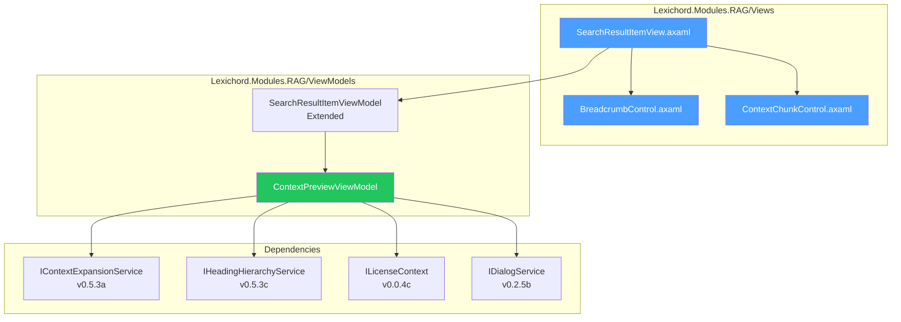
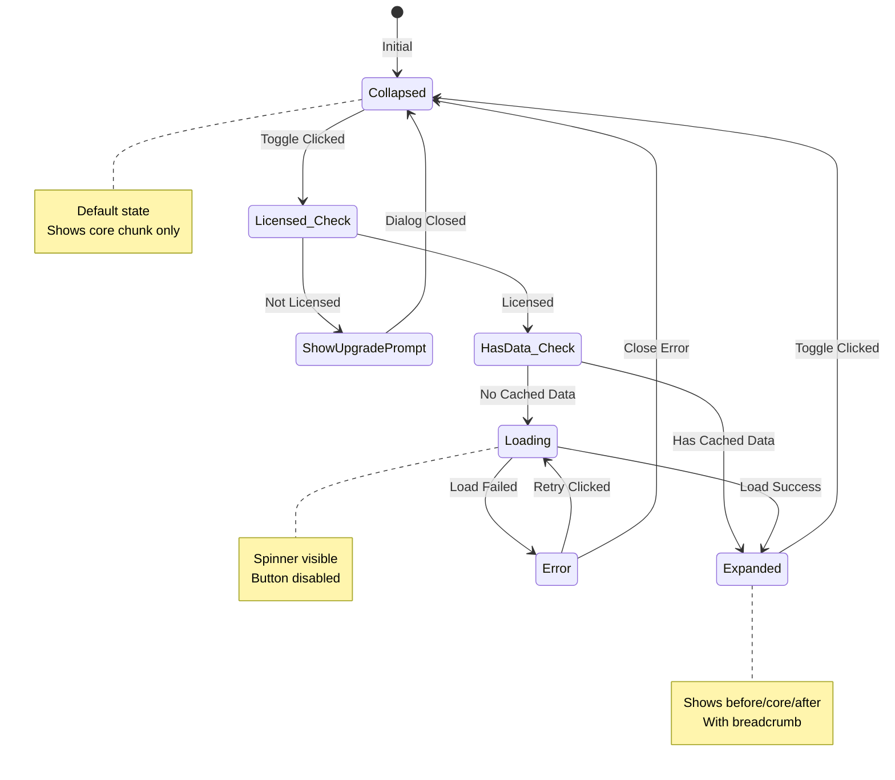

# LCS-DES-053d: Design Specification — Context Preview UI

## 1. Metadata & Categorization

| Field                | Value                            |
| :------------------- | :------------------------------- |
| **Document ID**      | LCS-DES-053d                     |
| **Feature ID**       | RAG-053d                         |
| **Feature Name**     | Context Preview UI               |
| **Parent Feature**   | v0.5.3 — The Context Window      |
| **Module Scope**     | Lexichord.Modules.RAG            |
| **Swimlane**         | Memory                           |
| **License Tier**     | Writer Pro                       |
| **Feature Gate Key** | `FeatureFlags.RAG.ContextWindow` |
| **Status**           | Draft                            |
| **Last Updated**     | 2026-01-27                       |

---

## 2. Executive Summary

### 2.1 Problem Statement

Search results currently display isolated text chunks without visual context. Users cannot:

- See what comes before/after the matched excerpt
- Understand where the excerpt fits in the document structure
- Evaluate context relevance without opening the source document

### 2.2 Solution Overview

Update `SearchResultItemView` with expandable context preview functionality:

- **Breadcrumb display** showing heading hierarchy
- **Expand/collapse button** for context reveal
- **Visual separators** between context chunks
- **Fade effects** for context boundaries
- **License gating** with upgrade prompts for Core users

### 2.3 Key Deliverables

| Deliverable                   | Description                              |
| :---------------------------- | :--------------------------------------- |
| `ContextPreviewViewModel`     | ViewModel for expansion state management |
| `SearchResultItemView` update | AXAML with context expander              |
| `BreadcrumbControl`           | Heading hierarchy display component      |
| `ContextChunkControl`         | Before/after context display             |
| Animations                    | Smooth expand/collapse transitions       |
| License gate UI               | Upgrade prompt for Core users            |

---

## 3. Architecture & Modular Strategy

### 3.1 Component Diagram



### 3.2 Module Location

```text
src/Lexichord.Modules.RAG/
├── ViewModels/
│   ├── SearchResultItemViewModel.cs      ← Extended
│   └── ContextPreviewViewModel.cs        ← NEW
└── Views/
    ├── SearchResultItemView.axaml        ← Updated
    ├── Controls/
    │   ├── BreadcrumbControl.axaml       ← NEW
    │   └── ContextChunkControl.axaml     ← NEW
    └── Styles/
        └── ContextPreviewStyles.axaml    ← NEW
```

---

## 4. Data Contract (The API)

### 4.1 ContextPreviewViewModel

```csharp
namespace Lexichord.Modules.RAG.ViewModels;

/// <summary>
/// ViewModel for context preview functionality within search results.
/// Manages expansion state, loading, and license checking.
/// </summary>
/// <remarks>
/// <para>Uses CommunityToolkit.Mvvm source generators for INotifyPropertyChanged.</para>
/// <para>Expansion is lazy-loaded on first toggle to minimize initial load time.</para>
/// </remarks>
public partial class ContextPreviewViewModel : ViewModelBase
{
    private readonly IContextExpansionService _contextService;
    private readonly ILicenseContext _licenseContext;
    private readonly IDialogService _dialogService;
    private readonly ILogger<ContextPreviewViewModel> _logger;

    private readonly TextChunk _chunk;
    private readonly ContextOptions _defaultOptions;

    [ObservableProperty]
    [NotifyPropertyChangedFor(nameof(ExpandButtonIcon))]
    [NotifyPropertyChangedFor(nameof(ExpandButtonText))]
    private bool _isExpanded;

    [ObservableProperty]
    private bool _isLoading;

    [ObservableProperty]
    private bool _isLicensed;

    [ObservableProperty]
    private ExpandedChunk? _expandedChunk;

    [ObservableProperty]
    private string _breadcrumb = string.Empty;

    [ObservableProperty]
    private string? _errorMessage;

    /// <summary>
    /// Initializes a new instance of the <see cref="ContextPreviewViewModel"/> class.
    /// </summary>
    /// <param name="chunk">The core chunk to manage context for.</param>
    /// <param name="contextService">Context expansion service.</param>
    /// <param name="licenseContext">License checking service.</param>
    /// <param name="dialogService">Dialog service for upgrade prompts.</param>
    /// <param name="logger">Logger instance.</param>
    public ContextPreviewViewModel(
        TextChunk chunk,
        IContextExpansionService contextService,
        ILicenseContext licenseContext,
        IDialogService dialogService,
        ILogger<ContextPreviewViewModel> logger)
    {
        _chunk = chunk ?? throw new ArgumentNullException(nameof(chunk));
        _contextService = contextService ?? throw new ArgumentNullException(nameof(contextService));
        _licenseContext = licenseContext ?? throw new ArgumentNullException(nameof(licenseContext));
        _dialogService = dialogService ?? throw new ArgumentNullException(nameof(dialogService));
        _logger = logger ?? throw new ArgumentNullException(nameof(logger));

        _defaultOptions = new ContextOptions(PrecedingChunks: 1, FollowingChunks: 1, IncludeHeadings: true);

        // Check license on construction
        IsLicensed = _licenseContext.HasFeature(FeatureFlags.RAG.ContextWindow);

        // Set initial breadcrumb if available from chunk metadata
        if (!string.IsNullOrEmpty(chunk.Metadata.Heading))
        {
            Breadcrumb = chunk.Metadata.Heading;
        }
    }

    /// <summary>
    /// Whether preceding context is available.
    /// </summary>
    public bool HasPrecedingContext => ExpandedChunk?.Before.Count > 0;

    /// <summary>
    /// Whether following context is available.
    /// </summary>
    public bool HasFollowingContext => ExpandedChunk?.After.Count > 0;

    /// <summary>
    /// Icon for expand button based on state.
    /// </summary>
    public string ExpandButtonIcon => IsExpanded ? "chevron_up" : "chevron_down";

    /// <summary>
    /// Text for expand button based on state.
    /// </summary>
    public string ExpandButtonText => IsExpanded ? "Hide Context" : "Show More Context";

    /// <summary>
    /// Whether the expand button should show a lock icon.
    /// </summary>
    public bool ShowLockIcon => !IsLicensed;

    /// <summary>
    /// Toggles the expanded state, loading context if needed.
    /// </summary>
    [RelayCommand]
    private async Task ToggleExpandedAsync()
    {
        // Check license first
        if (!IsLicensed)
        {
            _logger.LogDebug("Context expansion denied - user not licensed");
            await ShowUpgradePromptAsync();
            return;
        }

        // If currently expanded, collapse
        if (IsExpanded)
        {
            IsExpanded = false;
            _logger.LogDebug("Context collapsed for chunk {ChunkId}", _chunk.Id);
            return;
        }

        // If already have expanded data, just expand
        if (ExpandedChunk != null)
        {
            IsExpanded = true;
            _logger.LogDebug("Context expanded (cached) for chunk {ChunkId}", _chunk.Id);
            return;
        }

        // Load context for first time
        await LoadContextAsync();
    }

    /// <summary>
    /// Loads context from the expansion service.
    /// </summary>
    private async Task LoadContextAsync()
    {
        IsLoading = true;
        ErrorMessage = null;

        try
        {
            _logger.LogDebug("Loading context for chunk {ChunkId}", _chunk.Id);

            ExpandedChunk = await _contextService.ExpandAsync(_chunk, _defaultOptions);

            // Update breadcrumb
            if (ExpandedChunk.HasBreadcrumb)
            {
                Breadcrumb = ExpandedChunk.FormatBreadcrumb();
            }

            IsExpanded = true;

            _logger.LogDebug(
                "Context loaded for chunk {ChunkId}: {Before} before, {After} after",
                _chunk.Id, ExpandedChunk.Before.Count, ExpandedChunk.After.Count);
        }
        catch (Exception ex)
        {
            _logger.LogError(ex, "Failed to load context for chunk {ChunkId}", _chunk.Id);
            ErrorMessage = "Unable to load context. Please try again.";
        }
        finally
        {
            IsLoading = false;
        }
    }

    /// <summary>
    /// Shows upgrade prompt dialog for Core users.
    /// </summary>
    private async Task ShowUpgradePromptAsync()
    {
        var result = await _dialogService.ShowConfirmationAsync(
            title: "Upgrade to Writer Pro",
            message: "Context expansion helps you understand search results by showing surrounding content. " +
                     "This feature is available with Writer Pro and above.",
            confirmText: "Learn More",
            cancelText: "Not Now");

        if (result)
        {
            // Navigate to upgrade page (implementation detail)
            _logger.LogInformation("User requested upgrade information from context preview");
        }
    }

    /// <summary>
    /// Refreshes context data (e.g., after document re-indexing).
    /// </summary>
    [RelayCommand]
    private async Task RefreshContextAsync()
    {
        if (!IsLicensed) return;

        ExpandedChunk = null;
        await LoadContextAsync();
    }
}
```

### 4.2 View-to-ViewModel Binding Properties

| ViewModel Property     | View Binding              | Purpose                    |
| :--------------------- | :------------------------ | :------------------------- |
| `IsExpanded`           | Expander.IsExpanded       | Controls expansion state   |
| `IsLoading`            | LoadingSpinner.IsVisible  | Shows loading indicator    |
| `IsLicensed`           | ExpandButton.IsEnabled    | Enables/disables expansion |
| `ShowLockIcon`         | LockIcon.IsVisible        | Shows lock for Core users  |
| `ExpandedChunk`        | ContextPanel.DataContext  | Provides context data      |
| `ExpandedChunk.Before` | BeforeContext.ItemsSource | Preceding chunks           |
| `ExpandedChunk.After`  | AfterContext.ItemsSource  | Following chunks           |
| `Breadcrumb`           | BreadcrumbText.Text       | Heading hierarchy display  |
| `HasPrecedingContext`  | BeforeSection.IsVisible   | Shows before section       |
| `HasFollowingContext`  | AfterSection.IsVisible    | Shows after section        |
| `ErrorMessage`         | ErrorBanner.Text          | Error display              |
| `ExpandButtonText`     | ExpandButton.Content      | Button label               |
| `ExpandButtonIcon`     | ExpandButton.Icon         | Chevron direction          |

---

## 5. Implementation Logic

### 5.1 Expansion State Machine



### 5.2 Animation Specifications

```csharp
/// <summary>
/// Animation definitions for context preview expansion.
/// </summary>
public static class ContextPreviewAnimations
{
    /// <summary>
    /// Expansion animation for revealing context.
    /// </summary>
    public static Animation ExpandAnimation { get; } = new()
    {
        Duration = TimeSpan.FromMilliseconds(250),
        Easing = new CubicEaseOut(),
        Children =
        {
            new KeyFrame
            {
                Cue = new Cue(0),
                Setters = { new Setter(Visual.OpacityProperty, 0.0) }
            },
            new KeyFrame
            {
                Cue = new Cue(1),
                Setters = { new Setter(Visual.OpacityProperty, 1.0) }
            }
        }
    };

    /// <summary>
    /// Collapse animation for hiding context.
    /// </summary>
    public static Animation CollapseAnimation { get; } = new()
    {
        Duration = TimeSpan.FromMilliseconds(200),
        Easing = new CubicEaseIn(),
        Children =
        {
            new KeyFrame
            {
                Cue = new Cue(0),
                Setters = { new Setter(Visual.OpacityProperty, 1.0) }
            },
            new KeyFrame
            {
                Cue = new Cue(1),
                Setters = { new Setter(Visual.OpacityProperty, 0.0) }
            }
        }
    };

    /// <summary>
    /// Fade effect for context boundaries.
    /// </summary>
    public static Animation FadeInAnimation { get; } = new()
    {
        Duration = TimeSpan.FromMilliseconds(150),
        Children =
        {
            new KeyFrame
            {
                Cue = new Cue(0),
                Setters = { new Setter(Visual.OpacityProperty, 0.5) }
            },
            new KeyFrame
            {
                Cue = new Cue(1),
                Setters = { new Setter(Visual.OpacityProperty, 1.0) }
            }
        }
    };
}
```

---

## 6. Data Persistence

This sub-part does not persist data. Expansion state is session-only.

---

## 7. UI/UX Specifications

### 7.1 Collapsed State Layout

```text
┌─────────────────────────────────────────────────────────────────────────────────────┐
│  Header                                                                             │
│  ┌──────────────────────────────────────────────────────────────────────────────┐   │
│  │  📄 document-name.md                                            Score: 0.89  │   │
│  └──────────────────────────────────────────────────────────────────────────────┘   │
│                                                                                     │
│  Breadcrumb (if available)                                                          │
│  ┌──────────────────────────────────────────────────────────────────────────────┐   │
│  │  🔖 Authentication > OAuth > Token Refresh                                    │   │
│  └──────────────────────────────────────────────────────────────────────────────┘   │
│                                                                                     │
│  Core Chunk                                                                         │
│  ┌──────────────────────────────────────────────────────────────────────────────┐   │
│  │  "The refresh token is valid for 30 days. When expired, the user must       │   │
│  │  re-authenticate using their credentials. Refresh tokens can be revoked..."  │   │
│  └──────────────────────────────────────────────────────────────────────────────┘   │
│                                                                                     │
│  Actions                                                                            │
│  ┌──────────────────────────────────────────────────────────────────────────────┐   │
│  │  [▼ Show More Context]                            [📋 Copy]  [→ Navigate]    │   │
│  └──────────────────────────────────────────────────────────────────────────────┘   │
└─────────────────────────────────────────────────────────────────────────────────────┘
```

### 7.2 Expanded State Layout

```text
┌─────────────────────────────────────────────────────────────────────────────────────┐
│  Header                                                                             │
│  ┌──────────────────────────────────────────────────────────────────────────────┐   │
│  │  📄 document-name.md                                            Score: 0.89  │   │
│  └──────────────────────────────────────────────────────────────────────────────┘   │
│                                                                                     │
│  Breadcrumb                                                                         │
│  ┌──────────────────────────────────────────────────────────────────────────────┐   │
│  │  🔖 Authentication > OAuth > Token Refresh                                    │   │
│  └──────────────────────────────────────────────────────────────────────────────┘   │
│                                                                                     │
│  Context Panel (Expanded)                                                           │
│  ┌──────────────────────────────────────────────────────────────────────────────┐   │
│  │                                                                              │   │
│  │  ┄┄┄┄┄┄┄┄┄┄┄┄┄┄┄┄┄┄┄┄┄ PRECEDING CONTEXT ┄┄┄┄┄┄┄┄┄┄┄┄┄┄┄┄┄┄┄┄┄              │   │
│  │  ┌────────────────────────────────────────────────────────────────────────┐  │   │
│  │  │  [Muted/Faded Text]                                                    │  │   │
│  │  │  "Access tokens are short-lived and expire after 1 hour. For long-    │  │   │
│  │  │  running sessions, applications should use refresh tokens to obtain   │  │   │
│  │  │  new access tokens without requiring user re-authentication."          │  │   │
│  │  └────────────────────────────────────────────────────────────────────────┘  │   │
│  │                                                                              │   │
│  │  ─────────────────────────── ● ──────────────────────────────               │   │ ← Separator
│  │                                                                              │   │
│  │  ┌────────────────────────────────────────────────────────────────────────┐  │   │
│  │  │  [Highlighted Background - Core Chunk]                                 │  │   │
│  │  │  "The refresh token is valid for 30 days. When expired, the user      │  │   │
│  │  │  must re-authenticate using their credentials. Refresh tokens can      │  │   │
│  │  │  be revoked by administrators for security purposes."                   │  │   │
│  │  └────────────────────────────────────────────────────────────────────────┘  │   │
│  │                                                                              │   │
│  │  ─────────────────────────── ● ──────────────────────────────               │   │
│  │                                                                              │   │
│  │  ┌────────────────────────────────────────────────────────────────────────┐  │   │
│  │  │  [Muted/Faded Text]                                                    │  │   │
│  │  │  "To refresh an access token, send a POST request to /oauth/token     │  │   │
│  │  │  with grant_type=refresh_token and include your refresh token in      │  │   │
│  │  │  the request body."                                                     │  │   │
│  │  └────────────────────────────────────────────────────────────────────────┘  │   │
│  │  ┄┄┄┄┄┄┄┄┄┄┄┄┄┄┄┄┄┄┄┄┄ FOLLOWING CONTEXT ┄┄┄┄┄┄┄┄┄┄┄┄┄┄┄┄┄┄┄┄┄              │   │
│  │                                                                              │   │
│  └──────────────────────────────────────────────────────────────────────────────┘   │
│                                                                                     │
│  Actions                                                                            │
│  ┌──────────────────────────────────────────────────────────────────────────────┐   │
│  │  [▲ Hide Context]                                 [📋 Copy]  [→ Navigate]    │   │
│  └──────────────────────────────────────────────────────────────────────────────┘   │
└─────────────────────────────────────────────────────────────────────────────────────┘
```

### 7.3 License Gated State (Core User)

```text
┌─────────────────────────────────────────────────────────────────────────────────────┐
│  Header                                                                             │
│  ┌──────────────────────────────────────────────────────────────────────────────┐   │
│  │  📄 document-name.md                                            Score: 0.89  │   │
│  └──────────────────────────────────────────────────────────────────────────────┘   │
│                                                                                     │
│  Core Chunk                                                                         │
│  ┌──────────────────────────────────────────────────────────────────────────────┐   │
│  │  "The refresh token is valid for 30 days. When expired, the user must       │   │
│  │  re-authenticate using their credentials..."                                  │   │
│  └──────────────────────────────────────────────────────────────────────────────┘   │
│                                                                                     │
│  Actions (Gated)                                                                    │
│  ┌──────────────────────────────────────────────────────────────────────────────┐   │
│  │  [🔒 Show More Context  ⓘ]                                    [→ Navigate]   │   │
│  │   └─ Tooltip: "Upgrade to Writer Pro to expand context"                      │   │
│  └──────────────────────────────────────────────────────────────────────────────┘   │
└─────────────────────────────────────────────────────────────────────────────────────┘
```

### 7.4 Component Styling

#### 7.4.1 Colors and Themes

| Element           | Light Theme            | Dark Theme             |
| :---------------- | :--------------------- | :--------------------- |
| Breadcrumb text   | `#6B7280` (Gray 500)   | `#9CA3AF` (Gray 400)   |
| Breadcrumb icon   | `#3B82F6` (Blue 500)   | `#60A5FA` (Blue 400)   |
| Preceding context | `Opacity: 0.7`         | `Opacity: 0.7`         |
| Core chunk bg     | `#EFF6FF` (Blue 50)    | `#1E3A5F` (Blue 900)   |
| Following context | `Opacity: 0.7`         | `Opacity: 0.7`         |
| Separator line    | `#E5E7EB` (Gray 200)   | `#374151` (Gray 700)   |
| Separator dot     | `#3B82F6` (Blue 500)   | `#60A5FA` (Blue 400)   |
| Expand button     | Secondary button style | Secondary button style |
| Lock icon         | `#9CA3AF` (Gray 400)   | `#6B7280` (Gray 500)   |

#### 7.4.2 Typography

| Element         | Font  | Size | Weight   |
| :-------------- | :---- | :--- | :------- |
| Breadcrumb      | Inter | 12px | Regular  |
| Context text    | Inter | 14px | Regular  |
| Core chunk text | Inter | 14px | Regular  |
| Expand button   | Inter | 13px | Medium   |
| Section label   | Inter | 10px | Semibold |

#### 7.4.3 Spacing

| Element               | Value | Token                 |
| :-------------------- | :---- | :-------------------- |
| Breadcrumb padding    | 8px   | `Spacing.Sm`          |
| Context panel padding | 12px  | `Spacing.Md`          |
| Separator margin      | 8px 0 | `Spacing.Sm` vertical |
| Button gap            | 8px   | `Spacing.Sm`          |
| Card border radius    | 8px   | `Radius.Md`           |

### 7.5 SearchResultItemView AXAML Update

```xml
<UserControl xmlns="https://github.com/avaloniaui"
             xmlns:x="http://schemas.microsoft.com/winfx/2006/xaml"
             xmlns:vm="using:Lexichord.Modules.RAG.ViewModels"
             xmlns:controls="using:Lexichord.Modules.RAG.Views.Controls"
             x:Class="Lexichord.Modules.RAG.Views.SearchResultItemView"
             x:DataType="vm:SearchResultItemViewModel">

    <Border Classes="search-result-card"
            CornerRadius="{StaticResource RadiusMd}"
            Padding="{StaticResource SpacingMd}">

        <StackPanel Spacing="{StaticResource SpacingSm}">

            <!-- Header: Document Name and Score -->
            <Grid ColumnDefinitions="*, Auto">
                <StackPanel Orientation="Horizontal" Spacing="{StaticResource SpacingXs}">
                    <PathIcon Data="{StaticResource DocumentIcon}"
                              Width="16" Height="16"
                              Foreground="{StaticResource TextMuted}"/>
                    <TextBlock Text="{Binding DocumentName}"
                               Classes="text-sm text-secondary"
                               TextTrimming="CharacterEllipsis"/>
                </StackPanel>

                <TextBlock Grid.Column="1"
                           Text="{Binding ScoreDisplay}"
                           Classes="text-xs text-muted"/>
            </Grid>

            <!-- Breadcrumb (if available) -->
            <controls:BreadcrumbControl
                Breadcrumb="{Binding ContextPreview.Breadcrumb}"
                IsVisible="{Binding ContextPreview.Breadcrumb, Converter={x:Static StringConverters.IsNotNullOrEmpty}}"/>

            <!-- Context Preview Panel -->
            <Panel>
                <!-- Expanded Context (animated) -->
                <StackPanel IsVisible="{Binding ContextPreview.IsExpanded}"
                            x:Name="ExpandedContext"
                            Spacing="{StaticResource SpacingSm}">

                    <!-- Preceding Context -->
                    <StackPanel IsVisible="{Binding ContextPreview.HasPrecedingContext}">
                        <TextBlock Text="PRECEDING CONTEXT"
                                   Classes="text-xs text-muted uppercase"
                                   Margin="0 0 0 4"/>
                        <ItemsControl ItemsSource="{Binding ContextPreview.ExpandedChunk.Before}">
                            <ItemsControl.ItemTemplate>
                                <DataTemplate>
                                    <controls:ContextChunkControl
                                        Content="{Binding Content}"
                                        IsMuted="True"/>
                                </DataTemplate>
                            </ItemsControl.ItemTemplate>
                        </ItemsControl>
                    </StackPanel>

                    <!-- Separator Before Core -->
                    <Border Classes="context-separator"
                            IsVisible="{Binding ContextPreview.HasPrecedingContext}"/>

                    <!-- Core Chunk (Highlighted) -->
                    <Border Classes="core-chunk-highlight"
                            CornerRadius="{StaticResource RadiusSm}"
                            Padding="{StaticResource SpacingSm}">
                        <TextBlock Text="{Binding ChunkContent}"
                                   TextWrapping="Wrap"/>
                    </Border>

                    <!-- Separator After Core -->
                    <Border Classes="context-separator"
                            IsVisible="{Binding ContextPreview.HasFollowingContext}"/>

                    <!-- Following Context -->
                    <StackPanel IsVisible="{Binding ContextPreview.HasFollowingContext}">
                        <ItemsControl ItemsSource="{Binding ContextPreview.ExpandedChunk.After}">
                            <ItemsControl.ItemTemplate>
                                <DataTemplate>
                                    <controls:ContextChunkControl
                                        Content="{Binding Content}"
                                        IsMuted="True"/>
                                </DataTemplate>
                            </ItemsControl.ItemTemplate>
                        </ItemsControl>
                        <TextBlock Text="FOLLOWING CONTEXT"
                                   Classes="text-xs text-muted uppercase"
                                   Margin="0 4 0 0"/>
                    </StackPanel>
                </StackPanel>

                <!-- Collapsed Core Chunk -->
                <TextBlock IsVisible="{Binding !ContextPreview.IsExpanded}"
                           Text="{Binding ChunkContent}"
                           TextWrapping="Wrap"
                           MaxLines="3"
                           TextTrimming="CharacterEllipsis"/>

                <!-- Loading Spinner -->
                <StackPanel IsVisible="{Binding ContextPreview.IsLoading}"
                            HorizontalAlignment="Center"
                            VerticalAlignment="Center"
                            Spacing="{StaticResource SpacingSm}">
                    <ProgressRing IsIndeterminate="True" Width="24" Height="24"/>
                    <TextBlock Text="Loading context..." Classes="text-xs text-muted"/>
                </StackPanel>
            </Panel>

            <!-- Error Message -->
            <Border IsVisible="{Binding ContextPreview.ErrorMessage, Converter={x:Static StringConverters.IsNotNullOrEmpty}}"
                    Classes="error-banner"
                    Padding="{StaticResource SpacingXs}">
                <TextBlock Text="{Binding ContextPreview.ErrorMessage}"
                           Classes="text-sm text-error"/>
            </Border>

            <!-- Action Bar -->
            <Grid ColumnDefinitions="*, Auto">
                <!-- Expand Button -->
                <Button Command="{Binding ContextPreview.ToggleExpandedCommand}"
                        IsEnabled="{Binding !ContextPreview.IsLoading}"
                        Classes="btn-secondary btn-sm">
                    <StackPanel Orientation="Horizontal" Spacing="{StaticResource SpacingXs}">
                        <PathIcon Data="{Binding ContextPreview.ExpandButtonIcon, Converter={StaticResource IconConverter}}"
                                  Width="14" Height="14"/>
                        <PathIcon Data="{StaticResource LockIcon}"
                                  Width="12" Height="12"
                                  IsVisible="{Binding ContextPreview.ShowLockIcon}"
                                  Foreground="{StaticResource TextMuted}"/>
                        <TextBlock Text="{Binding ContextPreview.ExpandButtonText}"/>
                    </StackPanel>

                    <ToolTip.Tip>
                        <TextBlock>
                            <TextBlock.Text>
                                <MultiBinding StringFormat="{}{0}">
                                    <Binding Path="ContextPreview.IsLicensed"
                                             Converter="{StaticResource LicenseTooltipConverter}"/>
                                </MultiBinding>
                            </TextBlock.Text>
                        </TextBlock>
                    </ToolTip.Tip>
                </Button>

                <!-- Other Actions -->
                <StackPanel Grid.Column="1"
                            Orientation="Horizontal"
                            Spacing="{StaticResource SpacingXs}">
                    <Button Command="{Binding CopyCommand}"
                            Classes="btn-ghost btn-sm"
                            ToolTip.Tip="Copy to clipboard">
                        <PathIcon Data="{StaticResource CopyIcon}" Width="14" Height="14"/>
                    </Button>
                    <Button Command="{Binding NavigateCommand}"
                            Classes="btn-ghost btn-sm"
                            ToolTip.Tip="Navigate to source">
                        <PathIcon Data="{StaticResource NavigateIcon}" Width="14" Height="14"/>
                    </Button>
                </StackPanel>
            </Grid>

        </StackPanel>
    </Border>

</UserControl>
```

### 7.6 BreadcrumbControl

```xml
<UserControl xmlns="https://github.com/avaloniaui"
             xmlns:x="http://schemas.microsoft.com/winfx/2006/xaml"
             x:Class="Lexichord.Modules.RAG.Views.Controls.BreadcrumbControl"
             x:Name="root">

    <Border Classes="breadcrumb-container"
            Padding="8 4">
        <StackPanel Orientation="Horizontal" Spacing="4">
            <PathIcon Data="{StaticResource BookmarkIcon}"
                      Width="12" Height="12"
                      Foreground="{StaticResource PrimaryColor}"/>
            <TextBlock Text="{Binding Breadcrumb, ElementName=root}"
                       Classes="text-xs text-secondary"
                       VerticalAlignment="Center"/>
        </StackPanel>
    </Border>

</UserControl>
```

---

## 8. Observability & Logging

### 8.1 Log Events

| Level | Event             | Template                                                               |
| :---- | :---------------- | :--------------------------------------------------------------------- |
| Debug | Expansion denied  | `"Context expansion denied - user not licensed"`                       |
| Debug | Collapse          | `"Context collapsed for chunk {ChunkId}"`                              |
| Debug | Expand (cached)   | `"Context expanded (cached) for chunk {ChunkId}"`                      |
| Debug | Loading start     | `"Loading context for chunk {ChunkId}"`                                |
| Debug | Loading complete  | `"Context loaded for chunk {ChunkId}: {Before} before, {After} after"` |
| Error | Loading failed    | `"Failed to load context for chunk {ChunkId}"`                         |
| Info  | Upgrade requested | `"User requested upgrade information from context preview"`            |

### 8.2 UI Telemetry Events (Future)

| Event                    | Properties                               |
| :----------------------- | :--------------------------------------- |
| `context_expanded`       | `chunk_id`, `from_cache`, `duration_ms`  |
| `context_collapsed`      | `chunk_id`, `time_expanded_ms`           |
| `context_upgrade_prompt` | `chunk_id`, `result` (learn_more/cancel) |

---

## 9. Security & Safety

### 9.1 License Enforcement

License is checked in ViewModel before expansion:

```csharp
if (!IsLicensed)
{
    await ShowUpgradePromptAsync();
    return;
}
```

### 9.2 Error Handling

- Loading errors display user-friendly message
- Exception details logged, not shown to user
- UI remains interactive during error state

### 9.3 Accessibility

| Feature             | Implementation                        |
| :------------------ | :------------------------------------ |
| Keyboard navigation | Expand button is focusable, Enter key |
| Screen reader       | Expand button has accessible name     |
| Motion reduction    | Respect `prefers-reduced-motion`      |
| Color contrast      | WCAG AA compliant text contrast       |

---

## 10. Acceptance Criteria

| #   | Category          | Criterion                                                     | Verification      |
| :-- | :---------------- | :------------------------------------------------------------ | :---------------- |
| 1   | **Functional**    | Clicking expand button reveals context when licensed          | UI test           |
| 2   | **Functional**    | Clicking expand button shows upgrade prompt when not licensed | UI test           |
| 3   | **Functional**    | Collapse button hides expanded context                        | UI test           |
| 4   | **Functional**    | Breadcrumb displays heading hierarchy                         | UI test           |
| 5   | **Visual**        | Core chunk has highlighted background                         | Visual inspection |
| 6   | **Visual**        | Context chunks are muted/faded                                | Visual inspection |
| 7   | **Visual**        | Separators display between chunks                             | Visual inspection |
| 8   | **Animation**     | Expand animation is smooth (60fps)                            | Frame profiling   |
| 9   | **Animation**     | Collapse animation is smooth (60fps)                          | Frame profiling   |
| 10  | **Loading**       | Loading spinner shows during expansion                        | UI test           |
| 11  | **Error**         | Error banner shows on load failure                            | Unit test         |
| 12  | **Caching**       | Second expansion uses cached data                             | Unit test         |
| 13  | **Accessibility** | Expand button is keyboard accessible                          | Manual test       |

---

## 11. Code Examples

### 11.1 ViewModel Factory Pattern

```csharp
// Factory for creating ContextPreviewViewModel
public interface IContextPreviewViewModelFactory
{
    ContextPreviewViewModel Create(TextChunk chunk);
}

public class ContextPreviewViewModelFactory : IContextPreviewViewModelFactory
{
    private readonly IContextExpansionService _contextService;
    private readonly ILicenseContext _licenseContext;
    private readonly IDialogService _dialogService;
    private readonly ILogger<ContextPreviewViewModel> _logger;

    public ContextPreviewViewModel Create(TextChunk chunk)
    {
        return new ContextPreviewViewModel(
            chunk,
            _contextService,
            _licenseContext,
            _dialogService,
            _logger);
    }
}

// Usage in SearchResultItemViewModel
public class SearchResultItemViewModel : ViewModelBase
{
    public SearchResultItemViewModel(
        SearchHit hit,
        IContextPreviewViewModelFactory contextPreviewFactory)
    {
        ContextPreview = contextPreviewFactory.Create(hit.Chunk);
        // ... other initialization
    }

    public ContextPreviewViewModel ContextPreview { get; }
}
```

### 11.2 Animation Trigger in Code-Behind

```csharp
public partial class SearchResultItemView : UserControl
{
    public SearchResultItemView()
    {
        InitializeComponent();
    }

    protected override void OnDataContextChanged(EventArgs e)
    {
        base.OnDataContextChanged(e);

        if (DataContext is SearchResultItemViewModel vm)
        {
            vm.ContextPreview.PropertyChanged += OnContextPreviewPropertyChanged;
        }
    }

    private async void OnContextPreviewPropertyChanged(object? sender, PropertyChangedEventArgs e)
    {
        if (e.PropertyName == nameof(ContextPreviewViewModel.IsExpanded))
        {
            var vm = (ContextPreviewViewModel)sender!;

            if (vm.IsExpanded)
            {
                await ContextPreviewAnimations.ExpandAnimation.RunAsync(ExpandedContext);
            }
            else
            {
                await ContextPreviewAnimations.CollapseAnimation.RunAsync(ExpandedContext);
            }
        }
    }
}
```

---

## 12. Unit Testing Requirements

### 12.1 ViewModel Tests

```csharp
[Trait("Category", "Unit")]
[Trait("Feature", "v0.5.3d")]
public class ContextPreviewViewModelTests
{
    [Fact]
    public async Task ToggleExpandedAsync_WhenNotLicensed_ShowsUpgradePrompt()
    {
        // Arrange
        var licenseMock = new Mock<ILicenseContext>();
        licenseMock.Setup(l => l.HasFeature(FeatureFlags.RAG.ContextWindow)).Returns(false);

        var dialogMock = new Mock<IDialogService>();

        var sut = CreateViewModel(licenseContext: licenseMock.Object, dialogService: dialogMock.Object);

        // Act
        await sut.ToggleExpandedCommand.ExecuteAsync(null);

        // Assert
        sut.IsExpanded.Should().BeFalse();
        dialogMock.Verify(d => d.ShowConfirmationAsync(
            It.IsAny<string>(),
            It.IsAny<string>(),
            It.IsAny<string>(),
            It.IsAny<string>()), Times.Once);
    }

    [Fact]
    public async Task ToggleExpandedAsync_WhenLicensed_ExpandsContext()
    {
        // Arrange
        var licenseMock = new Mock<ILicenseContext>();
        licenseMock.Setup(l => l.HasFeature(FeatureFlags.RAG.ContextWindow)).Returns(true);

        var contextMock = new Mock<IContextExpansionService>();
        contextMock.Setup(c => c.ExpandAsync(It.IsAny<TextChunk>(), It.IsAny<ContextOptions>(), default))
            .ReturnsAsync(CreateExpandedChunk());

        var sut = CreateViewModel(
            contextService: contextMock.Object,
            licenseContext: licenseMock.Object);

        // Act
        await sut.ToggleExpandedCommand.ExecuteAsync(null);

        // Assert
        sut.IsExpanded.Should().BeTrue();
        sut.ExpandedChunk.Should().NotBeNull();
    }

    [Fact]
    public async Task ToggleExpandedAsync_WhenExpanded_Collapses()
    {
        // Arrange
        var sut = CreateLicensedAndExpandedViewModel();

        // Act
        await sut.ToggleExpandedCommand.ExecuteAsync(null);

        // Assert
        sut.IsExpanded.Should().BeFalse();
    }

    [Fact]
    public async Task ToggleExpandedAsync_WhenHasCachedData_DoesNotCallService()
    {
        // Arrange
        var contextMock = new Mock<IContextExpansionService>();
        contextMock.Setup(c => c.ExpandAsync(It.IsAny<TextChunk>(), It.IsAny<ContextOptions>(), default))
            .ReturnsAsync(CreateExpandedChunk());

        var sut = CreateViewModel(contextService: contextMock.Object);

        // First expansion loads data
        await sut.ToggleExpandedCommand.ExecuteAsync(null);
        await sut.ToggleExpandedCommand.ExecuteAsync(null); // Collapse

        // Act - Second expansion should use cached data
        await sut.ToggleExpandedCommand.ExecuteAsync(null);

        // Assert
        contextMock.Verify(
            c => c.ExpandAsync(It.IsAny<TextChunk>(), It.IsAny<ContextOptions>(), default),
            Times.Once); // Only called once
    }

    [Fact]
    public async Task ToggleExpandedAsync_OnLoadError_SetsErrorMessage()
    {
        // Arrange
        var contextMock = new Mock<IContextExpansionService>();
        contextMock.Setup(c => c.ExpandAsync(It.IsAny<TextChunk>(), It.IsAny<ContextOptions>(), default))
            .ThrowsAsync(new Exception("Network error"));

        var sut = CreateViewModel(contextService: contextMock.Object);

        // Act
        await sut.ToggleExpandedCommand.ExecuteAsync(null);

        // Assert
        sut.IsExpanded.Should().BeFalse();
        sut.ErrorMessage.Should().NotBeNullOrEmpty();
    }

    [Fact]
    public void ShowLockIcon_WhenNotLicensed_ReturnsTrue()
    {
        // Arrange
        var licenseMock = new Mock<ILicenseContext>();
        licenseMock.Setup(l => l.HasFeature(FeatureFlags.RAG.ContextWindow)).Returns(false);

        var sut = CreateViewModel(licenseContext: licenseMock.Object);

        // Assert
        sut.ShowLockIcon.Should().BeTrue();
    }

    [Theory]
    [InlineData(true, "Hide Context")]
    [InlineData(false, "Show More Context")]
    public void ExpandButtonText_ReflectsState(bool isExpanded, string expectedText)
    {
        // Arrange
        var sut = CreateViewModel();
        sut.IsExpanded = isExpanded;

        // Assert
        sut.ExpandButtonText.Should().Be(expectedText);
    }
}
```

---

## 13. Deliverable Checklist

| #   | Deliverable                                        | Status |
| :-- | :------------------------------------------------- | :----- |
| 1   | `ContextPreviewViewModel` with expansion logic     | [ ]    |
| 2   | `IContextPreviewViewModelFactory` interface        | [ ]    |
| 3   | `SearchResultItemView.axaml` updated with expander | [ ]    |
| 4   | `BreadcrumbControl.axaml` component                | [ ]    |
| 5   | `ContextChunkControl.axaml` component              | [ ]    |
| 6   | `ContextPreviewStyles.axaml` styles                | [ ]    |
| 7   | Expand/collapse animations                         | [ ]    |
| 8   | License gate with upgrade prompt                   | [ ]    |
| 9   | Error banner for load failures                     | [ ]    |
| 10  | Loading spinner during expansion                   | [ ]    |
| 11  | Unit tests for ViewModel                           | [ ]    |
| 12  | UI component integration tests                     | [ ]    |
| 13  | Accessibility verification                         | [ ]    |
| 14  | DI registration for factory                        | [ ]    |

---

## Document History

| Version | Date       | Author         | Changes       |
| :------ | :--------- | :------------- | :------------ |
| 1.0     | 2026-01-27 | Lead Architect | Initial draft |
